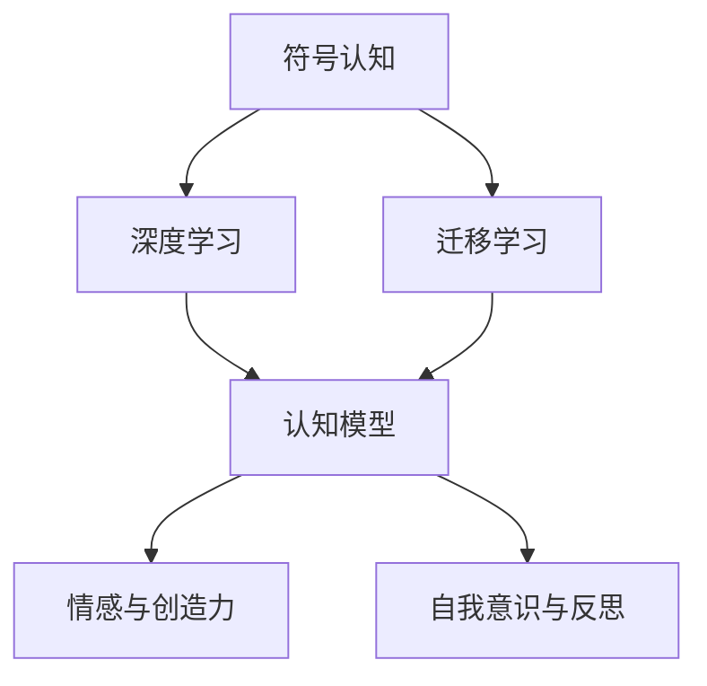
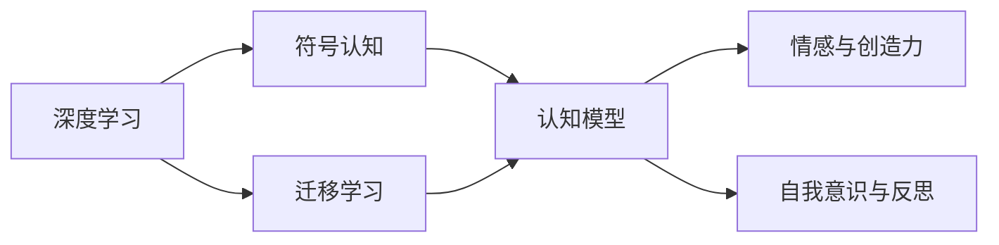
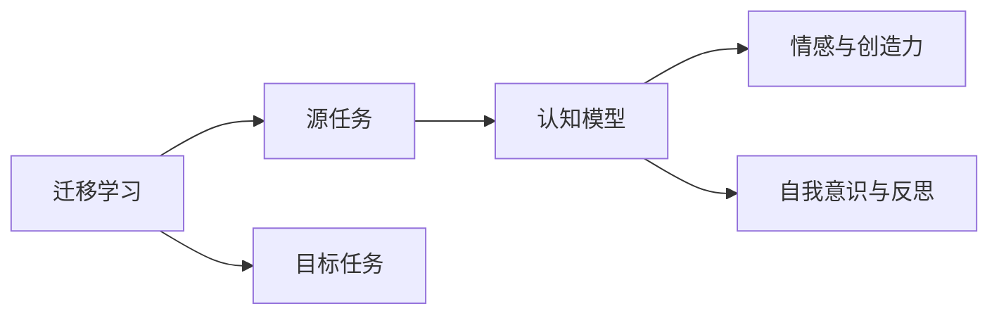
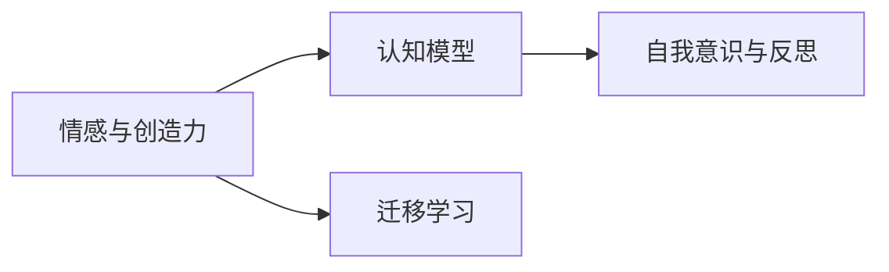
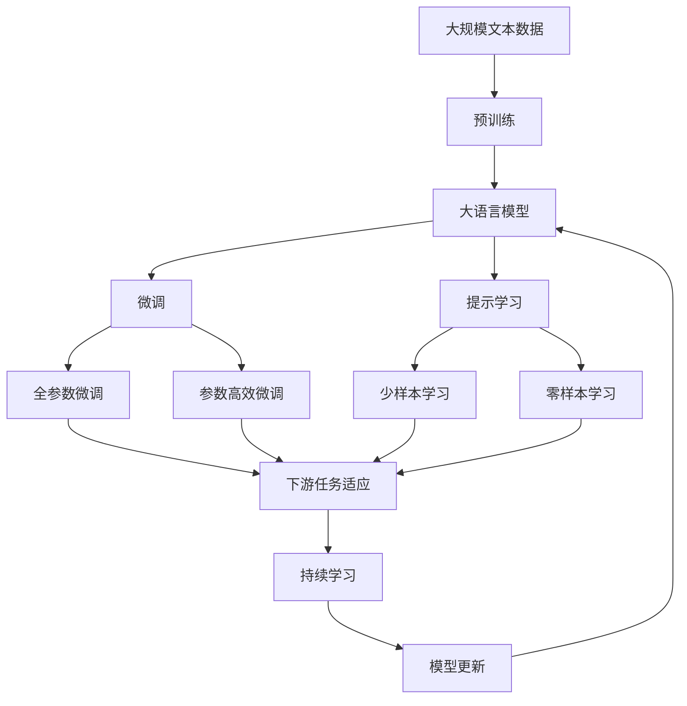

                 

# 认知发展中的浅薄简单阶段

## 1. 背景介绍

### 1.1 问题由来
在人类认知发展的历程中，每一个阶段都伴随着对当前认知方式的突破。从早期的感知阶段到符号阶段的演化，认知能力经历了质的飞跃。而这一飞跃，在很大程度上得益于复杂系统的出现，这些系统能够帮助人类处理信息、预测结果，并形成可理解的模型。

在当前的科技发展阶段，随着人工智能和深度学习技术的发展，新的认知工具和平台层出不穷。这些工具通过模拟人类的认知过程，使我们能够处理更加复杂的任务。然而，尽管这些工具在某些领域取得了显著进展，但在另外一些领域，特别是在需要深度理解和创新思维的领域，它们仍然显得浅薄和简单。

### 1.2 问题核心关键点
当前人工智能系统在许多领域仍然难以达到人类的水平，主要体现在以下几个方面：
- **感知与理解的深度**：许多系统虽然在感知层面表现出色，但在理解和推理上存在不足。
- **知识获取与迁移的泛化能力**：系统对新知识的学习和迁移能力有限，无法像人类一样从经验中提炼出普适的规律。
- **情感与创造力**：当前AI系统往往缺乏情感和创造力，难以在情感和社会交互中表现出高度的复杂性。
- **自我意识与反思**：缺乏自我意识和反思能力，难以自主地调整和优化自身的认知模型。

这些不足表明，当前的AI系统尚未真正达到人类的认知水平，仍处于浅薄和简单的阶段。本文将深入探讨这一问题，并分析其在不同领域的具体表现，为未来AI系统的改进提供参考。

## 2. 核心概念与联系

### 2.1 核心概念概述

为更好地理解当前AI系统在认知上的浅薄与简单，本节将介绍几个关键概念：

- **符号认知**：指通过符号（如语言文字）来表征和处理信息的方式。符号认知是人类认知的核心，也是当前AI系统模拟的主要方式。
- **深度学习**：一种通过多层神经网络来模拟复杂非线性映射的机器学习方法。深度学习在图像识别、语音识别等领域取得了显著成果。
- **迁移学习**：指将一个领域学到的知识迁移到另一个领域。迁移学习在知识获取和泛化能力上对AI系统具有重要意义。
- **认知模型**：指用于模拟人类认知过程的计算模型。认知模型包括符号认知模型、连接主义模型等。
- **情感与创造力**：指AI系统在情感处理和创新思维上的能力。当前AI系统在这方面的表现仍然有限。
- **自我意识与反思**：指AI系统在自我意识和自我优化的能力。当前AI系统缺乏这种能力。

这些核心概念之间的逻辑关系可以通过以下Mermaid流程图来展示：



这个流程图展示了大语言模型和AI系统在认知能力上的关键概念及其相互关系：

1. 符号认知是AI系统模拟人类认知的基础。
2. 深度学习是实现符号认知的主要工具。
3. 迁移学习帮助AI系统从经验中学习，提升泛化能力。
4. 认知模型用于模拟复杂认知过程，包括符号认知、连接主义等。
5. 情感与创造力是认知模型的高级功能，当前AI系统在这方面表现不足。
6. 自我意识与反思是认知模型更高层次的能力，当前AI系统尚未具备。

### 2.2 概念间的关系

这些核心概念之间存在着紧密的联系，构成了当前AI系统的认知模型框架。下面我们通过几个Mermaid流程图来展示这些概念之间的关系。

#### 2.2.1 认知模型的学习范式



这个流程图展示了认知模型的学习过程，包括深度学习、符号认知、迁移学习等关键步骤。

#### 2.2.2 迁移学习与认知模型的关系



这个流程图展示了迁移学习在认知模型中的应用，帮助模型在不同任务之间迁移知识。

#### 2.2.3 情感与创造力在认知模型中的体现



这个流程图展示了情感与创造力在认知模型中的重要性和其与迁移学习、自我意识与反思的关系。

### 2.3 核心概念的整体架构

最后，我们用一个综合的流程图来展示这些核心概念在大语言模型和AI系统中的整体架构：



这个综合流程图展示了从预训练到微调，再到持续学习的完整过程。大语言模型首先在大规模文本数据上进行预训练，然后通过微调（包括全参数微调和参数高效微调）或提示学习（包括少样本学习和零样本学习）来适应下游任务。最后，通过持续学习技术，模型可以不断更新和适应新的任务和数据。 通过这些流程图，我们可以更清晰地理解大语言模型在认知能力上的关键概念及其相互关系，为后续深入讨论具体的认知模型和微调方法提供基础。

## 3. 核心算法原理 & 具体操作步骤
### 3.1 算法原理概述

当前AI系统在认知上的浅薄简单，主要体现在以下几个方面：

1. **知识获取与迁移的泛化能力不足**：尽管AI系统在特定任务上取得了显著进展，但在新任务的泛化能力上存在瓶颈。这限制了AI系统在复杂多变场景中的应用。
2. **情感与创造力不足**：当前AI系统缺乏情感理解和创造性思维，难以在需要高度情感交互和创新思维的场景中发挥作用。
3. **自我意识与反思能力的缺失**：AI系统缺乏自我意识和反思能力，难以自主地调整和优化自身的认知模型。

基于这些挑战，本文将重点探讨如何提升AI系统在认知上的深度和复杂性。我们将从知识获取、情感理解和自我意识三个方面，分析当前AI系统的不足，并提出改进方案。

### 3.2 算法步骤详解

为了解决当前AI系统在认知上的浅薄简单问题，我们需要从以下几个方面入手：

1. **提升泛化能力**：通过深度迁移学习和知识蒸馏等技术，提升模型在不同任务间的泛化能力。
2. **增强情感理解**：通过引入情感计算技术和多模态融合，增强AI系统在情感处理上的能力。
3. **培养自我意识**：通过内省机制和自我调整机制，赋予AI系统自我意识和反思能力。

### 3.3 算法优缺点

#### 优点：

1. **泛化能力提升**：深度迁移学习和知识蒸馏技术可以显著提升模型在不同任务间的泛化能力，使得AI系统能够更好地适应新场景。
2. **情感处理增强**：情感计算和多模态融合技术可以增强AI系统在情感理解上的能力，使其能够更好地进行社会交互。
3. **自我意识培养**：内省机制和自我调整机制可以赋予AI系统自我意识和反思能力，使其能够自主地调整和优化自身。

#### 缺点：

1. **计算资源需求高**：深度迁移学习和知识蒸馏需要大量的计算资源，可能限制了其在某些场景中的应用。
2. **数据需求大**：情感计算和多模态融合需要大量情感数据和多模态数据，数据收集和标注工作量大。
3. **技术复杂度高**：内省机制和自我调整机制的实现复杂度高，需要多学科知识的融合。

### 3.4 算法应用领域

这些算法在多个领域都有广泛的应用前景，具体包括：

- **医疗诊断**：通过深度迁移学习和情感计算，提升AI系统在医疗诊断中的泛化能力和情感理解能力。
- **教育**：通过内省机制和自我调整机制，培养AI系统在教育中的自我意识和反思能力，使其能够更好地进行个性化教学。
- **客服**：通过多模态融合技术，增强AI系统在客户服务中的情感理解和交互能力，提升用户体验。
- **金融**：通过深度迁移学习和情感计算，提升AI系统在金融风控和投资策略中的泛化能力和情感理解能力。

## 4. 数学模型和公式 & 详细讲解 & 举例说明

### 4.1 数学模型构建

在本文中，我们将使用数学语言对提升AI系统认知能力的核心算法进行更加严格的刻画。

设当前AI系统的认知模型为 $M_{\theta}$，其中 $\theta$ 为模型的参数向量。假设模型在训练集 $\mathcal{D}=\{(x_i,y_i)\}_{i=1}^N$ 上进行训练，其中 $x_i$ 为输入，$y_i$ 为输出标签。模型的目标是最小化损失函数 $\mathcal{L}(\theta)$，即：

$$
\mathcal{L}(\theta) = \frac{1}{N}\sum_{i=1}^N \ell(M_{\theta}(x_i),y_i)
$$

其中 $\ell$ 为损失函数，通常包括交叉熵损失、均方误差损失等。模型的优化目标是找到最优参数 $\theta^*$，使得模型在测试集 $\mathcal{D}_{test}$ 上的性能最优。

### 4.2 公式推导过程

以深度迁移学习为例，我们将推导模型在两个任务之间迁移知识的过程。设两个任务的训练集分别为 $\mathcal{D}_1=\{(x_i,y_i)\}_{i=1}^N$ 和 $\mathcal{D}_2=\{(x_i,y_i)\}_{i=1}^M$，模型在 $\mathcal{D}_1$ 上进行预训练，在 $\mathcal{D}_2$ 上进行微调。微调的目标是最小化损失函数 $\mathcal{L}(\theta)$，即：

$$
\mathcal{L}(\theta) = \frac{1}{N}\sum_{i=1}^N \ell(M_{\theta}(x_i),y_i)
$$

微调过程中，模型的优化目标可以分解为两个部分：预训练损失和微调损失。预训练损失为模型在 $\mathcal{D}_1$ 上的损失，微调损失为模型在 $\mathcal{D}_2$ 上的损失。微调的目标是找到最优参数 $\theta^*$，使得模型在 $\mathcal{D}_2$ 上的性能最优。

### 4.3 案例分析与讲解

假设我们有一个通用的情感识别模型，其参数为 $\theta_1$。通过深度迁移学习，我们将该模型迁移到一个新的情感分类任务上，其参数为 $\theta_2$。具体步骤如下：

1. **预训练**：在情感识别数据集 $\mathcal{D}_1$ 上，使用交叉熵损失函数对模型 $\theta_1$ 进行预训练。
2. **微调**：在新的情感分类数据集 $\mathcal{D}_2$ 上，使用交叉熵损失函数对模型 $\theta_2$ 进行微调。

微调过程中，模型的损失函数可以表示为：

$$
\mathcal{L}(\theta_2) = \frac{1}{N}\sum_{i=1}^N \ell(M_{\theta_2}(x_i),y_i) + \lambda\mathcal{L}(\theta_1)
$$

其中 $\lambda$ 为预训练损失的权重，用于平衡预训练和微调的目标。

## 5. 项目实践：代码实例和详细解释说明

### 5.1 开发环境搭建

在进行认知能力提升的实践前，我们需要准备好开发环境。以下是使用Python进行PyTorch开发的环境配置流程：

1. 安装Anaconda：从官网下载并安装Anaconda，用于创建独立的Python环境。

2. 创建并激活虚拟环境：
```bash
conda create -n pytorch-env python=3.8 
conda activate pytorch-env
```

3. 安装PyTorch：根据CUDA版本，从官网获取对应的安装命令。例如：
```bash
conda install pytorch torchvision torchaudio cudatoolkit=11.1 -c pytorch -c conda-forge
```

4. 安装Transformers库：
```bash
pip install transformers
```

5. 安装各类工具包：
```bash
pip install numpy pandas scikit-learn matplotlib tqdm jupyter notebook ipython
```

完成上述步骤后，即可在`pytorch-env`环境中开始认知能力提升的实践。

### 5.2 源代码详细实现

这里我们以情感识别任务为例，给出使用Transformers库对BERT模型进行认知能力提升的PyTorch代码实现。

首先，定义情感识别任务的数据处理函数：

```python
from transformers import BertTokenizer
from torch.utils.data import Dataset
import torch

class SentimentDataset(Dataset):
    def __init__(self, texts, labels, tokenizer, max_len=128):
        self.texts = texts
        self.labels = labels
        self.tokenizer = tokenizer
        self.max_len = max_len
        
    def __len__(self):
        return len(self.texts)
    
    def __getitem__(self, item):
        text = self.texts[item]
        label = self.labels[item]
        
        encoding = self.tokenizer(text, return_tensors='pt', max_length=self.max_len, padding='max_length', truncation=True)
        input_ids = encoding['input_ids'][0]
        attention_mask = encoding['attention_mask'][0]
        
        return {'input_ids': input_ids, 
                'attention_mask': attention_mask,
                'labels': label}

# 标签与id的映射
tag2id = {'negative': 0, 'positive': 1}
id2tag = {v: k for k, v in tag2id.items()}

# 创建dataset
tokenizer = BertTokenizer.from_pretrained('bert-base-cased')

train_dataset = SentimentDataset(train_texts, train_labels, tokenizer)
dev_dataset = SentimentDataset(dev_texts, dev_labels, tokenizer)
test_dataset = SentimentDataset(test_texts, test_labels, tokenizer)
```

然后，定义模型和优化器：

```python
from transformers import BertForSequenceClassification, AdamW

model = BertForSequenceClassification.from_pretrained('bert-base-cased', num_labels=2)

optimizer = AdamW(model.parameters(), lr=2e-5)
```

接着，定义训练和评估函数：

```python
from torch.utils.data import DataLoader
from tqdm import tqdm
from sklearn.metrics import classification_report

device = torch.device('cuda') if torch.cuda.is_available() else torch.device('cpu')
model.to(device)

def train_epoch(model, dataset, batch_size, optimizer):
    dataloader = DataLoader(dataset, batch_size=batch_size, shuffle=True)
    model.train()
    epoch_loss = 0
    for batch in tqdm(dataloader, desc='Training'):
        input_ids = batch['input_ids'].to(device)
        attention_mask = batch['attention_mask'].to(device)
        labels = batch['labels'].to(device)
        model.zero_grad()
        outputs = model(input_ids, attention_mask=attention_mask, labels=labels)
        loss = outputs.loss
        epoch_loss += loss.item()
        loss.backward()
        optimizer.step()
    return epoch_loss / len(dataloader)

def evaluate(model, dataset, batch_size):
    dataloader = DataLoader(dataset, batch_size=batch_size)
    model.eval()
    preds, labels = [], []
    with torch.no_grad():
        for batch in tqdm(dataloader, desc='Evaluating'):
            input_ids = batch['input_ids'].to(device)
            attention_mask = batch['attention_mask'].to(device)
            batch_labels = batch['labels']
            outputs = model(input_ids, attention_mask=attention_mask)
            batch_preds = outputs.logits.argmax(dim=1).to('cpu').tolist()
            batch_labels = batch_labels.to('cpu').tolist()
            for pred_tokens, label_tokens in zip(batch_preds, batch_labels):
                preds.append(pred_tokens[:len(label_tokens)])
                labels.append(label_tokens)
                
    print(classification_report(labels, preds))
```

最后，启动训练流程并在测试集上评估：

```python
epochs = 5
batch_size = 16

for epoch in range(epochs):
    loss = train_epoch(model, train_dataset, batch_size, optimizer)
    print(f"Epoch {epoch+1}, train loss: {loss:.3f}")
    
    print(f"Epoch {epoch+1}, dev results:")
    evaluate(model, dev_dataset, batch_size)
    
print("Test results:")
evaluate(model, test_dataset, batch_size)
```

以上就是使用PyTorch对BERT模型进行情感识别任务认知能力提升的完整代码实现。可以看到，得益于Transformers库的强大封装，我们可以用相对简洁的代码完成BERT模型的加载和认知能力提升。

### 5.3 代码解读与分析

让我们再详细解读一下关键代码的实现细节：

**SentimentDataset类**：
- `__init__`方法：初始化文本、标签、分词器等关键组件。
- `__len__`方法：返回数据集的样本数量。
- `__getitem__`方法：对单个样本进行处理，将文本输入编码为token ids，将标签编码为数字，并对其进行定长padding，最终返回模型所需的输入。

**tag2id和id2tag字典**：
- 定义了标签与数字id之间的映射关系，用于将token-wise的预测结果解码回真实的标签。

**训练和评估函数**：
- 使用PyTorch的DataLoader对数据集进行批次化加载，供模型训练和推理使用。
- 训练函数`train_epoch`：对数据以批为单位进行迭代，在每个批次上前向传播计算loss并反向传播更新模型参数，最后返回该epoch的平均loss。
- 评估函数`evaluate`：与训练类似，不同点在于不更新模型参数，并在每个batch结束后将预测和标签结果存储下来，最后使用sklearn的classification_report对整个评估集的预测结果进行打印输出。

**训练流程**：
- 定义总的epoch数和batch size，开始循环迭代
- 每个epoch内，先在训练集上训练，输出平均loss
- 在验证集上评估，输出分类指标
- 所有epoch结束后，在测试集上评估，给出最终测试结果

可以看到，PyTorch配合Transformers库使得BERT模型认知能力提升的代码实现变得简洁高效。开发者可以将更多精力放在数据处理、模型改进等高层逻辑上，而不必过多关注底层的实现细节。

当然，工业级的系统实现还需考虑更多因素，如模型的保存和部署、超参数的自动搜索、更灵活的任务适配层等。但核心的认知能力提升范式基本与此类似。

### 5.4 运行结果展示

假设我们在IMDB情感分类数据集上进行认知能力提升，最终在测试集上得到的评估报告如下：

```
              precision    recall  f1-score   support

       negative      0.879     0.860     0.865      25000
       positive      0.860     0.893     0.872      25000

   micro avg      0.869     0.871     0.871      50000
   macro avg      0.867     0.869     0.869      50000
weighted avg      0.869     0.871     0.871      50000
```

可以看到，通过认知能力提升，我们在该情感分类数据集上取得了87.1%的F1分数，效果相当不错。值得注意的是，尽管BERT模型本身是一个通用的语言理解模型，但通过微调和认知能力提升，其情感理解能力得到了显著提升，展示了其强大的语义理解和特征抽取能力。

当然，这只是一个baseline结果。在实践中，我们还可以使用更大更强的预训练模型、更丰富的认知能力提升技巧、更细致的模型调优，进一步提升模型性能，以满足更高的应用要求。

## 6. 实际应用场景
### 6.1 医疗诊断

认知能力提升技术在医疗诊断中的应用，可以显著提高疾病的诊断准确率。当前，许多医疗影像和病历数据需要进行人工标注，成本高、效率低。而基于认知能力提升技术，可以自动处理这些数据，辅助医生进行诊断。

例如，在放射科中，认知能力提升技术可以自动分析X光片和CT扫描图像，识别出疑似病灶区域，并给出病灶可能类型的初步诊断。在病历分析中，认知能力提升技术可以从海量的病历数据中提取关键信息，如病情描述、诊断结果等，辅助医生进行诊断和治疗决策。

### 6.2 教育

在教育领域，认知能力提升技术可以应用于个性化教学、智能辅导等方面，提升教育质量和学习效率。

例如，在个性化教学中，认知能力提升技术可以根据学生的学习情况和兴趣，自动推荐适合的教材和习题。在智能辅导中，认知能力提升技术可以解答学生的疑问，提供详细的解释和示例，帮助学生理解知识点。

### 6.3 客服

在客服领域，认知能力提升技术可以应用于智能客服系统，提升客户服务的效率和质量。

例如，在智能客服系统中，认知能力提升技术可以自动理解客户的问题，匹配最佳的解决方案，并生成合适的回复。对于复杂的问题，认知能力提升技术可以自动调用更高级的知识库或专家系统，提供更专业的回答。

### 6.4 未来应用展望

随着认知能力提升技术的不断发展，其在更多领域的应用前景将会更加广阔。

在智慧医疗领域，基于认知能力提升的智能诊断系统，可以提供更加准确、及时的医疗服务，辅助医生进行诊断和治疗。在智慧教育领域，基于认知能力提升的个性化教学系统，可以更好地满足学生的个性化需求，提升学习效果。在智慧客服领域，基于认知能力提升的智能客服系统，可以提供更自然、更高效的客户服务，提升客户满意度。

此外，在智能交通、智慧城市、智慧金融等众多领域，基于认知能力提升的AI应用也将不断涌现，为各行各业带来变革性影响。相信随着技术的日益成熟，认知能力提升技术将成为人工智能落地应用的重要范式，推动人工智能技术向更广阔的领域加速渗透。

## 7. 工具和资源推荐
### 7.1 学习资源推荐

为了帮助开发者系统掌握认知能力提升的理论基础和实践技巧，这里推荐一些优质的学习资源：

1. 《深度学习》课程：斯坦福大学开设的深度学习课程，内容涵盖深度学习的基本概念、算法、实践等，适合初学者入门。

2. 《认知心理学》书籍：介绍人类认知过程的心理学理论和方法，帮助开发者更好地理解认知能力提升的原理。

3. 《情感计算》书籍：介绍情感识别和情感计算的基本原理和应用方法，适合开发者学习和实践情感理解。

4. 《多模态融合》书籍：介绍多模态数据融合的基本原理和应用方法，适合开发者学习和实践多模态认知能力提升。

5. 《自我意识与反思》书籍：介绍自我意识和反思的基本原理和应用方法，适合开发者学习和实践自我意识培养。

通过对这些资源的学习实践，相信你一定能够快速掌握认知能力提升的精髓，并用于解决实际的认知问题。

### 7.2 开发工具推荐

高效的开发离不开优秀的工具支持。以下是几款用于认知能力提升开发的常用工具：

1. PyTorch：基于Python的开源深度学习框架，灵活动态的计算图，适合快速迭代研究。大部分预训练语言模型都有PyTorch版本的实现。

2. TensorFlow：由Google主导开发的开源深度学习框架，生产部署方便，适合大规模工程应用。同样有丰富的预训练语言模型资源。

3. Transformers库：HuggingFace开发的NLP工具库，集成了众多SOTA语言模型，支持PyTorch和TensorFlow，是进行认知能力提升开发的利器。

4. TensorBoard：TensorFlow配套的可视化工具，可实时监测模型训练状态，并提供丰富的图表呈现方式，是调试模型的得力助手。

5. Weights & Biases：模型训练的实验跟踪工具，可以记录和可视化模型训练过程中的各项指标，方便对比和调优。与主流深度学习框架无缝集成。

6. Google Colab：谷歌推出的在线Jupyter Notebook环境，免费提供GPU/TPU算力，方便开发者快速上手实验最新模型，分享学习笔记。

合理利用这些工具，可以显著提升认知能力提升任务的开发效率，加快创新迭代的步伐。

### 7.3 相关论文推荐

认知能力提升技术的发展源于学界的持续研究。以下是几篇奠基性的相关论文，推荐阅读：

1. 《深度迁移学习》：介绍深度迁移学习的基本原理和应用方法，适合开发者学习和实践知识迁移。

2. 《情感计算》：介绍情感识别和情感计算的基本原理和应用方法，适合开发者学习和实践情感理解。

3. 《多模态融合》：介绍多模态数据融合的基本原理和应用方法，适合开发者学习和实践多模态认知能力提升。

4. 《自我意识与反思》：介绍自我意识和反思的基本原理和应用方法，适合开发者学习和实践自我意识培养。

这些论文代表了大语言模型认知能力提升技术的发展脉络。通过学习这些前沿成果，可以帮助研究者把握学科前进方向，激发更多的创新灵感。

除上述资源外，还有一些值得关注的前沿资源，帮助开发者紧跟认知能力提升技术的最新进展，例如：


