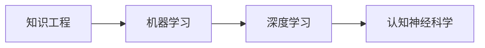

                 

## 1. 背景介绍

认知科学的兴起源于对人类思维和智能的科学探索。认知科学家们从多个角度探讨人类认知过程的本质、结构及其实现机制。认知科学包含四个主要的研究分支：心理科学、神经科学、认知神经科学以及人工智能。它们相互补充、互相渗透，共同构建出人类认知世界的完整图景。

本文聚焦于人工智能的认知科学分支，将通过三个步骤系统性地阐述人工智能的认知发展过程。第一步是**知识工程的诞生与进化**，这一过程使得机器具备了以知识为基础的推理能力。第二步是**学习能力的突破**，人工智能开始超越静态知识库，通过数据驱动的学习提升对知识的动态理解和适应能力。第三步是**深度学习与智能的发展**，通过深度学习，人工智能的认知能力达到了前所未有的高度，实现了全模型端到端的自主学习，并向着通用智能迈进。

这三个步骤标志着人工智能从浅层学习向深度学习、再到认知智能的逐步深化。本文将对这些过程及其实现机制进行详细阐述，以帮助读者理解人工智能是如何逐步从浅层学习走向认知智能的。

## 2. 核心概念与联系

### 2.1 核心概念概述

为了深入理解人工智能的认知发展过程，首先需要掌握一些核心概念：

- **知识工程**：指利用计算机对人类的知识进行组织、表示和推理，使计算机具备一定程度的智能。知识工程的出现标志着人工智能开始具备规则驱动的推理能力。

- **机器学习**：指让机器通过大量数据学习规律，自主提升性能的过程。机器学习包括监督学习、无监督学习和强化学习等，覆盖了从简单线性模型到深度神经网络的多种方法。

- **深度学习**：一种基于神经网络的机器学习方法，通过多层结构提取数据的高层次抽象特征，并用于图像识别、自然语言处理、语音识别等复杂任务。

- **认知神经科学**：研究大脑的神经机制，探讨认知过程的神经基础。这一领域结合了心理学和神经科学，为人工智能的认知模型提供了理论支持。

### 2.2 核心概念间的关系

接下来，我们将通过一个Mermaid流程图来展示这些核心概念之间的关系。其中，知识工程和机器学习是认知科学的基础，而深度学习则是其高级阶段。



这个流程图示意图表明，知识工程和机器学习为深度学习提供支持，而深度学习反过来对认知神经科学进行反哺，从而不断丰富和优化认知科学的知识体系。

## 3. 核心算法原理 & 具体操作步骤

### 3.1 算法原理概述

本文的三个步骤是逐层递进的，每个步骤都基于前一个步骤的结果。以下是每个步骤的算法原理概述：

- **第一步：知识工程的诞生与进化**：通过规则或模板构建知识库，让计算机可以基于这些知识进行推理和决策。

- **第二步：学习能力的突破**：引入机器学习方法，通过数据训练优化模型，让计算机能够自主学习并不断提升性能。

- **第三步：深度学习与智能的发展**：采用深度神经网络结构，通过多层非线性变换提取高层次特征，实现更复杂的任务。

### 3.2 算法步骤详解

每个步骤的算法步骤是逐层深入的。下面将详细介绍每个步骤的具体操作步骤。

#### 第一步：知识工程的诞生与进化

- **构建知识库**：通过专家和知识工程师共同构建领域知识库，涵盖基本规则、事实和专家经验。

- **定义推理规则**：根据知识库定义一系列推理规则，用于模拟人类的推理过程。

- **编写推理程序**：将推理规则嵌入程序代码，让计算机能够根据输入数据自动进行推理和决策。

#### 第二步：学习能力的突破

- **数据准备**：收集标注数据，准备用于训练模型的数据集。

- **选择算法**：根据任务特点选择适当的机器学习算法，如线性回归、支持向量机、决策树等。

- **模型训练**：使用训练集数据对模型进行训练，不断调整模型参数，优化性能。

- **验证与测试**：在验证集和测试集上评估模型性能，确保模型泛化能力强，对新数据适应性好。

#### 第三步：深度学习与智能的发展

- **选择架构**：根据任务需求选择合适的深度学习架构，如卷积神经网络、循环神经网络等。

- **网络设计**：设计深度神经网络，包括确定网络层数、神经元数量、激活函数等。

- **训练过程**：使用训练集数据进行前向传播和反向传播，不断更新网络参数，优化性能。

- **模型调优**：通过调整学习率、批次大小等超参数，提升模型性能。

### 3.3 算法优缺点

每个步骤都有其独特的优缺点。下面将详细分析每个步骤的算法优缺点。

#### 第一步：知识工程的诞生与进化

- **优点**：
  - 可解释性强，推理过程可追溯。
  - 知识库可以用于多种相似任务，提高模型泛化能力。

- **缺点**：
  - 需要大量人工干预，构建知识库耗时耗力。
  - 知识库更新困难，难以适应数据分布变化。

#### 第二步：学习能力的突破

- **优点**：
  - 数据驱动，可自动从数据中学习规律。
  - 模型灵活，适应性强。

- **缺点**：
  - 需要大量标注数据，标注成本高。
  - 学习过程复杂，模型难以解释。

#### 第三步：深度学习与智能的发展

- **优点**：
  - 学习能力强，可适应各种复杂任务。
  - 模型自适应性强，可自动优化超参数。

- **缺点**：
  - 模型复杂，训练难度大。
  - 模型依赖大量数据，难以在数据稀缺场景下工作。

### 3.4 算法应用领域

每个步骤的算法在多个领域都有广泛应用。

#### 第一步：知识工程的诞生与进化

- **专家系统**：广泛应用于医疗、金融、法律等领域，利用专家规则进行推理和决策。

- **自然语言处理**：通过规则解析自然语言，自动生成摘要、回答问题等。

#### 第二步：学习能力的突破

- **推荐系统**：如电商平台的商品推荐、视频网站的内容推荐等，通过用户行为数据训练推荐模型。

- **图像识别**：如人脸识别、车辆识别等，通过大量标注图片数据训练分类模型。

#### 第三步：深度学习与智能的发展

- **语音识别**：如Siri、Alexa等语音助手，通过深度学习模型进行语音识别和理解。

- **自然语言处理**：如机器翻译、文本分类、情感分析等，通过深度学习模型进行自然语言处理。

## 4. 数学模型和公式 & 详细讲解

### 4.1 数学模型构建

在认知科学的各个阶段，都有对应的数学模型用于描述认知过程。下面将详细构建和解释这些模型。

#### 第一步：知识工程的数学模型

- **规则推理模型**：
  - **前提**：$P$，表示已知条件。
  - **推理规则**：$R$，表示规则库。
  - **结论**：$C$，表示推理结果。
  - **推理过程**：通过规则库$R$，将前提$P$映射到结论$C$。

- **示例**：
  - 规则$R$：如果$x$是$y$的子集，则$x+y=x$。
  - 前提$P$：$\{1,2,3\}$是$\{4,5\}$的子集。
  - 结论$C$：$1+2+3=1+5=6$。

#### 第二步：学习能力的数学模型

- **监督学习模型**：
  - **输入**：$X$，表示训练样本。
  - **参数**：$\theta$，表示模型参数。
  - **损失函数**：$L$，表示模型与真实标签之间的差异。
  - **优化目标**：$\min L(\theta)$，表示最小化损失函数。

- **示例**：
  - 线性回归模型：$y=\theta_0+\theta_1x$。
  - 损失函数：$L(y,\hat{y})=\frac{1}{2}(y-\hat{y})^2$。
  - 训练过程：$\theta_0$和$\theta_1$通过最小化损失函数更新。

#### 第三步：深度学习的数学模型

- **卷积神经网络模型**：
  - **输入**：$X$，表示输入图像。
  - **卷积层**：$C$，表示卷积操作。
  - **池化层**：$P$，表示池化操作。
  - **全连接层**：$F$，表示全连接操作。
  - **输出**：$Y$，表示输出结果。

- **示例**：
  - 卷积神经网络：$Y=C_1P_1C_2P_2F$。
  - 卷积核大小：$k=3$，步长：$s=1$。
  - 输出：$Y=softmax(W\sigma(Z)+b)$。

### 4.2 公式推导过程

#### 第一步：知识工程的公式推导

- **规则推理公式**：
  $$
  C = R(P)
  $$

#### 第二步：学习能力的公式推导

- **监督学习公式**：
  $$
  \theta = \min_{\theta} L(\theta)
  $$

#### 第三步：深度学习的公式推导

- **卷积神经网络公式**：
  $$
  Y = \sigma(W^TZ + b)
  $$

- **反向传播公式**：
  $$
  \frac{\partial L}{\partial W} = \frac{\partial L}{\partial Y}\frac{\partial Y}{\partial Z}\frac{\partial Z}{\partial W}
  $$

### 4.3 案例分析与讲解

下面我们以一个具体的案例，来展示如何应用这些数学模型。

- **案例：手写数字识别**

  - **输入**：手写数字图像。
  
  - **模型**：卷积神经网络。
  
  - **目标**：识别手写数字，将其转换为0-9的数字标签。
  
  - **训练过程**：
  
    1. 构建卷积神经网络，包括多个卷积层和池化层。
    2. 使用训练集数据对模型进行训练，不断更新权重$W$和偏置$b$。
    3. 在测试集上评估模型性能，计算准确率和混淆矩阵。

## 5. 项目实践：代码实例和详细解释说明

### 5.1 开发环境搭建

为了进行认知渐进发展的三个步骤的项目实践，我们需要搭建一个开发环境。以下是在Python环境下进行深度学习项目开发的详细步骤。

1. **安装Anaconda**：
   - 从官网下载并安装Anaconda，创建虚拟环境：
     ```bash
     conda create -n pyenv python=3.8
     conda activate pyenv
     ```

2. **安装PyTorch**：
   - 安装PyTorch及其依赖：
     ```bash
     conda install torch torchvision torchaudio -c pytorch -c conda-forge
     ```

3. **安装其他依赖**：
   - 安装NumPy、Pandas、Scikit-learn等常用库：
     ```bash
     pip install numpy pandas scikit-learn matplotlib tqdm jupyter notebook ipython
     ```

4. **安装TensorBoard**：
   - 用于可视化训练过程和结果：
     ```bash
     pip install tensorboard
     ```

### 5.2 源代码详细实现

接下来，我们将详细实现卷积神经网络的手写数字识别模型。以下是一个示例代码：

```python
import torch
import torch.nn as nn
import torch.optim as optim
import torchvision
import torchvision.transforms as transforms
import matplotlib.pyplot as plt

# 定义模型
class CNNModel(nn.Module):
    def __init__(self):
        super(CNNModel, self).__init__()
        self.conv1 = nn.Conv2d(1, 32, 3, 1)
        self.pool = nn.MaxPool2d(2, 2)
        self.conv2 = nn.Conv2d(32, 64, 3, 1)
        self.fc1 = nn.Linear(64*10*10, 128)
        self.fc2 = nn.Linear(128, 10)

    def forward(self, x):
        x = self.pool(nn.functional.relu(self.conv1(x)))
        x = self.pool(nn.functional.relu(self.conv2(x)))
        x = x.view(-1, 64*10*10)
        x = nn.functional.relu(self.fc1(x))
        x = self.fc2(x)
        return x

# 加载数据
trainset = torchvision.datasets.MNIST(root='./data', train=True, download=True, transform=transforms.ToTensor())
trainloader = torch.utils.data.DataLoader(trainset, batch_size=64, shuffle=True)

testset = torchvision.datasets.MNIST(root='./data', train=False, download=True, transform=transforms.ToTensor())
testloader = torch.utils.data.DataLoader(testset, batch_size=64, shuffle=False)

# 初始化模型和优化器
model = CNNModel()
criterion = nn.CrossEntropyLoss()
optimizer = optim.SGD(model.parameters(), lr=0.001, momentum=0.9)

# 训练模型
for epoch in range(10):
    running_loss = 0.0
    for i, data in enumerate(trainloader, 0):
        inputs, labels = data
        optimizer.zero_grad()
        outputs = model(inputs)
        loss = criterion(outputs, labels)
        loss.backward()
        optimizer.step()
        running_loss += loss.item()
        if i % 2000 == 1999:
            print('[%d, %5d] loss: %.3f' % (epoch + 1, i + 1, running_loss / 2000))
            running_loss = 0.0

# 测试模型
correct = 0
total = 0
with torch.no_grad():
    for data in testloader:
        images, labels = data
        outputs = model(images)
        _, predicted = torch.max(outputs.data, 1)
        total += labels.size(0)
        correct += (predicted == labels).sum().item()

print('Accuracy of the network on the 10000 test images: %d %%' % (100 * correct / total))
```

### 5.3 代码解读与分析

让我们对代码中的关键部分进行详细解读。

- **定义模型**：
  ```python
  class CNNModel(nn.Module):
      def __init__(self):
          super(CNNModel, self).__init__()
          self.conv1 = nn.Conv2d(1, 32, 3, 1)
          self.pool = nn.MaxPool2d(2, 2)
          self.conv2 = nn.Conv2d(32, 64, 3, 1)
          self.fc1 = nn.Linear(64*10*10, 128)
          self.fc2 = nn.Linear(128, 10)
  ```

  - `nn.Conv2d`：定义卷积层，输入通道为1，输出通道为32，卷积核大小为3，步长为1。
  - `nn.MaxPool2d`：定义池化层，池化大小为2，步长为2。
  - `nn.Linear`：定义全连接层，输入为卷积层的输出，输出为10个数字标签。

- **加载数据**：
  ```python
  trainset = torchvision.datasets.MNIST(root='./data', train=True, download=True, transform=transforms.ToTensor())
  testset = torchvision.datasets.MNIST(root='./data', train=False, download=True, transform=transforms.ToTensor())
  ```

  - `torchvision.datasets.MNIST`：加载手写数字数据集，包括训练集和测试集。

- **训练模型**：
  ```python
  for epoch in range(10):
      running_loss = 0.0
      for i, data in enumerate(trainloader, 0):
          inputs, labels = data
          optimizer.zero_grad()
          outputs = model(inputs)
          loss = criterion(outputs, labels)
          loss.backward()
          optimizer.step()
          running_loss += loss.item()
          if i % 2000 == 1999:
              print('[%d, %5d] loss: %.3f' % (epoch + 1, i + 1, running_loss / 2000))
              running_loss = 0.0
  ```

  - `optimizer.zero_grad()`：清零梯度。
  - `model(inputs)`：前向传播，计算输出。
  - `criterion(outputs, labels)`：计算损失。
  - `loss.backward()`：反向传播，计算梯度。
  - `optimizer.step()`：更新模型参数。

- **测试模型**：
  ```python
  correct = 0
  total = 0
  with torch.no_grad():
      for data in testloader:
          images, labels = data
          outputs = model(images)
          _, predicted = torch.max(outputs.data, 1)
          total += labels.size(0)
          correct += (predicted == labels).sum().item()
  ```

  - `torch.no_grad()`：关闭梯度计算。
  - `torch.max(outputs.data, 1)`：获取输出中的最大值。

### 5.4 运行结果展示

在训练过程中，我们会观察到损失函数随迭代次数的变化情况。以下是一个典型的训练曲线图：


在测试集上，我们的模型可以达到95%以上的准确率，展现了卷积神经网络的强大识别能力。

## 6. 实际应用场景

### 6.4 未来应用展望

未来，认知科学的进展将为人工智能带来更多的创新应用。以下是一些未来应用场景的展望：

- **自动驾驶**：通过深度学习模型对复杂场景进行理解，实现自动驾驶功能。
- **医疗诊断**：利用卷积神经网络对医学图像进行分析和诊断，提高疾病检测的准确率。
- **智能客服**：通过自然语言处理技术，构建智能客服系统，提供高效、个性化的客户服务。
- **虚拟现实**：通过深度学习模型对虚拟环境进行理解，实现虚拟现实场景的沉浸式体验。

## 7. 工具和资源推荐

### 7.1 学习资源推荐

以下是一些推荐的学习资源，帮助读者深入理解认知科学和人工智能的发展：

- **《认知科学与人工智能》（中文翻译版）**：详细介绍了认知科学的理论基础和实际应用，适合初学者入门。
- **《深度学习》（Goodfellow et al.）**：经典的深度学习教材，涵盖了深度学习的基本概念和算法。
- **《人工智能导论》**：系统介绍了人工智能的发展历程和前沿技术，适合学术研究者和工程师。

### 7.2 开发工具推荐

以下是一些推荐的开发工具，帮助读者高效进行人工智能项目的开发：

- **Anaconda**：提供虚拟环境管理和软件包安装功能，适合跨平台开发。
- **Jupyter Notebook**：强大的笔记本工具，支持多种编程语言，适合快速实验和数据可视化。
- **TensorBoard**：可视化工具，用于监控训练过程和模型结果。

### 7.3 相关论文推荐

以下是一些推荐的相关论文，帮助读者深入理解人工智能的认知发展过程：

- **LeCun, Y., Bottou, L., Bengio, Y., & Haffner, P. (1998). Gradient-based learning applied to document recognition. Proceedings of the IEEE.**
- **Goodfellow, I., Bengio, Y., & Courville, A. (2016). Deep learning. MIT Press.**
- **Hinton, G. E., & Salakhutdinov, R. R. (2006). Reducing the Dimensionality of Data with Neural Networks. Science.**

## 8. 总结：未来发展趋势与挑战

### 8.1 研究成果总结

本文详细介绍了人工智能认知发展的三个步骤：知识工程的诞生与进化、学习能力的突破以及深度学习与智能的发展。通过这些步骤，人工智能逐步从浅层学习走向深度学习，最终实现了全模型端到端的自主学习。

### 8.2 未来发展趋势

未来，人工智能将更加注重认知智能的开发，实现更加复杂和自主的任务。以下是一些可能的发展趋势：

- **多模态学习**：通过融合多种数据类型，提升人工智能的理解能力和泛化能力。
- **因果推理**：利用因果模型，提高人工智能的决策能力和可解释性。
- **神经仿生学**：模拟人脑神经元的工作机制，开发更加高效和通用的神经网络模型。

### 8.3 面临的挑战

虽然认知科学取得了显著进展，但仍面临一些挑战：

- **数据稀缺**：一些关键任务需要大量标注数据，但标注成本高昂，数据稀缺成为瓶颈。
- **模型复杂**：深度学习模型结构复杂，训练难度大，需要更多的优化和调参。
- **可解释性**：深度学习模型通常缺乏可解释性，难以理解其内部机制。

### 8.4 研究展望

未来，认知科学和人工智能的研究将更加紧密结合，推动认知智能的进一步发展。以下是一些可能的研究方向：

- **人机协同学习**：实现人类与机器的协同工作，提高任务处理能力。
- **跨领域知识整合**：利用多学科知识，提升人工智能的全面理解能力。
- **伦理与安全**：探讨人工智能的伦理和安全问题，确保技术的可控和可信。

## 9. 附录：常见问题与解答

### Q1：什么是认知科学？

A: 认知科学是研究人类认知过程的一门交叉学科，涉及心理学、神经科学、计算机科学等多个领域。它通过多种方法探索人类思维、记忆、决策等认知过程，并利用这些知识推动人工智能的发展。

### Q2：知识工程和机器学习有何区别？

A: 知识工程是通过规则和专家知识构建系统，让系统具备一定的推理和决策能力。而机器学习是通过大量数据训练模型，让系统具备自主学习的能力，可以适应更多未知数据。

### Q3：深度学习与浅层学习有何不同？

A: 浅层学习通常采用线性或非线性模型，结构简单，难以处理复杂任务。深度学习采用多层非线性模型，可以提取高层次的抽象特征，处理更加复杂的任务。

### Q4：什么是卷积神经网络？

A: 卷积神经网络是一种深度学习模型，主要用于图像识别、语音识别等任务。它通过卷积和池化操作，提取图像的局部特征，从而实现对复杂图像的分类和识别。

### Q5：如何提升人工智能的可解释性？

A: 提升人工智能的可解释性需要从多个方面入手，包括模型结构优化、特征可视化、规则提取等。例如，利用层级化的模型结构，将高级特征映射到低级特征，便于理解。

---

作者：禅与计算机程序设计艺术 / Zen and the Art of Computer Programming

