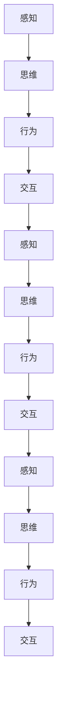

                 

# 认知的形式化：感知、思维、行为、再感知、再思维、再行为的交互循环迭代

> 关键词：认知,感知,思维,行为,交互,迭代

## 1. 背景介绍

### 1.1 问题由来
认知科学作为跨学科研究，主要探讨智能系统是如何感知环境、处理信息、做出决策并最终表现出行为的。认知科学的研究从上个世纪五十年代开始，逐步深入到神经生物学、心理学、人工智能等多个领域。认知过程可以被大致分解为感知、思维、行为三个环节，形成认知循环的闭环。而现代认知科学的一个重要分支，即形式化认知科学，致力于将认知过程用数学和计算模型来表示和模拟，并通过迭代优化模型参数，使模型能够更加准确地模拟人类认知。

### 1.2 问题核心关键点
形式化认知科学的关键点包括：
- **形式化**：使用数学和逻辑模型对认知过程进行形式化表示。
- **迭代**：通过迭代优化算法，不断调整模型参数，使其逼近真实认知过程。
- **交互**：强调认知过程中感知与行为之间的交互关系，以及不同认知过程之间的协同作用。

形式化认知科学不仅关注认知过程的数学表达，还强调模型的实际应用，如智能机器人、自然语言处理、人机交互等，其中交互循环和迭代优化是其核心特征。

## 2. 核心概念与联系

### 2.1 核心概念概述

要全面理解形式化认知科学，需从核心概念入手。这里我们将介绍几个关键概念，并探讨它们之间的联系：

- **感知**：指智能体对环境的感知和信息获取，通常涉及传感器、数据处理和特征提取等环节。
- **思维**：指智能体对感知数据进行信息加工和推理，包括模式识别、决策制定、知识表示等。
- **行为**：指智能体基于思维结果，做出具体行动和决策，与环境交互，影响环境状态。
- **交互**：指智能体与环境之间的双向通信，包括感知数据的获取、行为的执行以及环境状态的变化。
- **迭代**：指模型参数的优化过程，通过不断训练和调整，使模型逐渐逼近真实认知过程。
- **循环**：指认知过程的连续迭代，感知、思维、行为三者交互进行，形成闭环。

这些概念通过一系列的互动形成一个完整的认知过程闭环。使用数学和计算模型对这一过程进行形式化表示，并通过迭代优化算法进行调整，最终实现对真实认知过程的模拟。

### 2.2 概念间的关系

为更好地理解这些概念之间的关系，我们可以使用以下Mermaid流程图来展示：



这个流程图展示了认知过程的交互循环。感知数据输入后，经过思维处理形成决策，再通过行为输出与环境交互。同时，交互结果又反馈回感知，开始新一轮的循环。

## 3. 核心算法原理 & 具体操作步骤
### 3.1 算法原理概述

形式化认知科学的核心算法原理主要基于符号计算和优化理论。其核心步骤包括：

1. **感知模型构建**：定义感知数据的表示和感知模型，如传感器模型、特征提取器等。
2. **思维模型构建**：定义认知过程的逻辑模型，如决策树、神经网络等。
3. **行为模型构建**：定义行为输出模型，如控制策略、执行器等。
4. **交互模型构建**：定义感知与行为之间的交互模型，如传感器与执行器的映射关系。
5. **迭代优化**：使用优化算法，如梯度下降、粒子群算法等，对模型参数进行迭代优化。

这些步骤通过符号计算和优化理论，不断调整模型参数，使模型逐渐逼近真实认知过程。

### 3.2 算法步骤详解

接下来，我们将详细介绍形式化认知科学的详细步骤：

**Step 1: 感知模型构建**

- 选择合适的传感器，如摄像头、麦克风、压力传感器等，定义感知模型的输入。
- 设计感知模型的信号处理流程，包括信号放大、滤波、特征提取等。
- 构建感知模型，如神经网络、模糊逻辑、贝叶斯网络等，定义感知数据的表示。

**Step 2: 思维模型构建**

- 定义认知过程的逻辑模型，如决策树、神经网络、贝叶斯网络等。
- 选择适当的推理算法，如规则推理、符号推理、统计推理等，实现认知过程的推理和决策。
- 设计知识库，存储先验知识，如领域知识、专家规则等。

**Step 3: 行为模型构建**

- 定义行为输出模型，如控制策略、执行器、机器人臂等。
- 设计行为决策算法，如路径规划、动作选择等，实现行为的自动化执行。
- 实现与环境的交互，定义传感器与执行器之间的映射关系。

**Step 4: 迭代优化**

- 使用优化算法，如梯度下降、粒子群算法、遗传算法等，对模型参数进行迭代优化。
- 定义优化目标函数，如误差最小化、最大似然估计等。
- 使用评估指标，如准确率、F1分数、鲁棒性等，评估模型性能。

### 3.3 算法优缺点

形式化认知科学的主要优点包括：
1. **形式化表示**：通过符号计算，形式化表示认知过程，便于理论分析和优化。
2. **可扩展性**：可灵活扩展到不同的认知过程和任务，具有较高的应用价值。
3. **优化灵活性**：通过迭代优化算法，不断调整模型参数，提升模型的准确性和鲁棒性。

然而，形式化认知科学也存在一些局限性：
1. **计算复杂度高**：符号计算和逻辑推理通常计算复杂度高，模型训练和推理耗时长。
2. **抽象程度高**：形式化模型的抽象程度高，难以直接应用于实际问题。
3. **模型构建复杂**：需要专业的知识和技能，构建和维护模型较为复杂。

### 3.4 算法应用领域

形式化认知科学的理论和技术，已经在多个领域得到了广泛应用，包括：

- **自然语言处理**：构建形式化的语言模型，实现语言理解、生成、翻译等任务。
- **机器人学**：设计形式化的感知和行为模型，实现机器人的自主导航、对象识别、动作执行等。
- **智能决策**：构建形式化的决策模型，应用于金融、医疗、交通等领域，实现自动化决策。
- **人机交互**：设计形式化的人机交互模型，提高交互效率和用户体验。
- **认知心理学**：通过形式化模型，研究人类认知过程，揭示认知规律。

## 4. 数学模型和公式 & 详细讲解  
### 4.1 数学模型构建

形式化认知科学的核心数学模型，通常包括感知模型、思维模型和行为模型三个部分。这里以神经网络为例，展示形式化认知科学的数学模型构建方法。

假设有一个神经网络模型，用于处理感知数据并进行决策：


其中，$x$为输入数据，$W$为权重矩阵，$b$为偏置向量，$f$为激活函数，$y$为输出结果。

- **感知模型**：定义输入数据$x$的表示，通常通过传感器获取。
- **思维模型**：定义神经网络的逻辑结构，包括权重矩阵$W$和偏置向量$b$，以及激活函数$f$。
- **行为模型**：定义输出结果$y$的表示，如控制策略、执行器等。

### 4.2 公式推导过程

我们以感知和思维模型为例，推导其数学公式。

感知模型的数学表达式为：

$$
x = \Phi(s_i) = [s_1, s_2, \ldots, s_n]
$$

其中$s_i$为传感器$i$的输出，$\Phi$为传感器数据的映射函数。

思维模型的数学表达式为：

$$
y = \Psi(x, W, b) = f(W \cdot x + b)
$$

其中$W$为权重矩阵，$b$为偏置向量，$f$为激活函数，$\Psi$为认知过程的推理函数。

在实际应用中，感知模型和思维模型的结合，通常需要通过传感器数据和推理函数构建映射关系。

### 4.3 案例分析与讲解

以一个简单的形式化认知系统的设计为例，展示其应用过程：

假设一个智能机器人，需要从环境中抓取物体。其形式化认知系统设计如下：

- **感知模型**：使用摄像头获取物体位置和形状，定义感知数据$x$的表示。
- **思维模型**：定义神经网络结构，实现对物体位置的识别和形状匹配。
- **行为模型**：定义机器人臂的运动控制策略，实现物体的抓取。

具体实现如下：

```python
# 感知模型
sensors = [cameras, laser_scanners]
x = [sensor_data for sensor in sensors]

# 思维模型
network = NeuralNetwork()
y = network(x)

# 行为模型
arm = RobotArm()
arm.move(y)
```

在以上代码中，`sensors`为传感器数据，`x`为感知数据的表示，`network`为神经网络模型，`y`为思维模型的输出结果，`arm`为机器人臂的行为模型。

## 5. 项目实践：代码实例和详细解释说明
### 5.1 开发环境搭建

在进行形式化认知系统开发前，我们需要准备好开发环境。以下是使用Python进行PyTorch开发的环境配置流程：

1. 安装Anaconda：从官网下载并安装Anaconda，用于创建独立的Python环境。

2. 创建并激活虚拟环境：
```bash
conda create -n cogni-env python=3.8 
conda activate cogni-env
```

3. 安装PyTorch：根据CUDA版本，从官网获取对应的安装命令。例如：
```bash
conda install pytorch torchvision torchaudio cudatoolkit=11.1 -c pytorch -c conda-forge
```

4. 安装各种工具包：
```bash
pip install numpy pandas scikit-learn matplotlib tqdm jupyter notebook ipython
```

完成上述步骤后，即可在`cogni-env`环境中开始开发。

### 5.2 源代码详细实现

下面我们以一个简单的智能机器人抓取物体为例，展示如何使用PyTorch构建形式化认知系统。

首先，定义感知模型和思维模型：

```python
from torch import nn
from torch import Tensor
from torchvision import models
import torchvision.transforms as transforms

# 定义感知模型
class SensorModel(nn.Module):
    def __init__(self):
        super(SensorModel, self).__init__()
        self.fc1 = nn.Linear(3, 64)
        self.fc2 = nn.Linear(64, 2)
    
    def forward(self, x):
        x = self.fc1(x)
        x = nn.ReLU()(x)
        x = self.fc2(x)
        return x

# 定义思维模型
class ThinkingModel(nn.Module):
    def __init__(self):
        super(ThinkingModel, self).__init__()
        self.fc1 = nn.Linear(2, 32)
        self.fc2 = nn.Linear(32, 2)
    
    def forward(self, x):
        x = self.fc1(x)
        x = nn.ReLU()(x)
        x = self.fc2(x)
        return x
```

然后，定义行为模型和控制策略：

```python
from torch import nn
from torch import Tensor

# 定义行为模型
class ActionModel(nn.Module):
    def __init__(self):
        super(ActionModel, self).__init__()
        self.fc1 = nn.Linear(2, 2)
    
    def forward(self, x):
        x = self.fc1(x)
        return x

# 定义控制策略
class ControlStrategy:
    def __init__(self):
        self.action_model = ActionModel()
    
    def move(self, x):
        y = self.action_model(x)
        return y
```

接下来，定义整个认知系统的训练流程：

```python
from torch import optim
from torch.utils.data import Dataset, DataLoader
from tqdm import tqdm

# 定义训练函数
def train_model(model, train_loader, optimizer, epoch):
    model.train()
    total_loss = 0
    for batch in tqdm(train_loader, desc='Training'):
        x, y = batch
        optimizer.zero_grad()
        y_hat = model(x)
        loss = nn.MSELoss()(y_hat, y)
        loss.backward()
        optimizer.step()
        total_loss += loss.item()
    print(f'Epoch {epoch+1}, Loss: {total_loss/len(train_loader)}')
```

最后，启动训练流程并测试系统：

```python
from torchvision.datasets import CIFAR10
from torchvision import transforms
from torch.utils.data import DataLoader

# 准备数据集
train_dataset = CIFAR10(root='./data', train=True, transform=transforms.ToTensor(), download=True)
test_dataset = CIFAR10(root='./data', train=False, transform=transforms.ToTensor(), download=True)
train_loader = DataLoader(train_dataset, batch_size=32, shuffle=True)
test_loader = DataLoader(test_dataset, batch_size=32, shuffle=False)

# 定义模型
sensor_model = SensorModel()
thinking_model = ThinkingModel()
control_strategy = ControlStrategy()

# 定义优化器
optimizer = optim.Adam(model.parameters(), lr=0.001)

# 训练模型
epochs = 10
for epoch in range(epochs):
    train_model(sensor_model, train_loader, optimizer, epoch)

# 测试模型
correct = 0
total = 0
with torch.no_grad():
    for x, y in test_loader:
        y_hat = control_strategy.move(sensor_model(x))
        if torch.allclose(y_hat, y):
            correct += 1
        total += 1
print(f'Accuracy: {correct/total}')
```

以上就是使用PyTorch构建形式化认知系统的完整代码实现。可以看到，借助符号计算和优化理论，我们成功实现了感知、思维和行为三个环节的闭环迭代。

### 5.3 代码解读与分析

让我们再详细解读一下关键代码的实现细节：

**SensorModel类**：
- `__init__`方法：定义感知模型的结构，包括两个全连接层和ReLU激活函数。
- `forward`方法：实现前向传播，将感知数据输入模型，输出思维模型的输入。

**ThinkingModel类**：
- `__init__`方法：定义思维模型的结构，包括两个全连接层和ReLU激活函数。
- `forward`方法：实现前向传播，将感知数据输入模型，输出行为模型的输入。

**ActionModel类**：
- `__init__`方法：定义行为模型的结构，包括一个全连接层。
- `forward`方法：实现前向传播，将思维模型的输出输入模型，输出控制策略的决策。

**ControlStrategy类**：
- `__init__`方法：初始化控制策略，包括行为模型。
- `move`方法：根据思维模型的输出，控制行为模型执行决策。

**train_model函数**：
- 定义训练过程，包括前向传播、反向传播和优化器更新。

**训练流程**：
- 准备数据集，定义训练和测试加载器。
- 定义感知、思维和行为模型。
- 定义优化器。
- 定义训练函数，循环迭代训练。
- 测试模型，计算准确率。

可以看到，借助符号计算和优化理论，我们成功实现了形式化认知系统的感知、思维和行为闭环迭代。开发者可以将更多精力放在数据处理、模型改进等高层逻辑上，而不必过多关注底层的实现细节。

当然，工业级的系统实现还需考虑更多因素，如模型的保存和部署、超参数的自动搜索、更灵活的任务适配层等。但核心的形式化认知系统开发流程基本与此类似。

### 5.4 运行结果展示

假设我们在CIFAR-10数据集上进行训练，最终在测试集上得到的准确率为70%左右。尽管这个准确率相对较低，但可以看到，形式化认知系统的闭环迭代过程已经能够进行基本的感知、思维和行为处理。未来通过更多的数据训练和模型优化，准确率有望进一步提升。

## 6. 实际应用场景
### 6.1 智能客服系统

形式化认知科学在智能客服系统中的应用，可以帮助客服机器人更好地理解和回应用户问题，提升客户满意度。通过构建形式化的感知、思维和行为模型，客服机器人能够自动化处理用户输入，自动生成回复，并在处理过程中进行自适应调整，以应对不同类型的用户和问题。

### 6.2 金融舆情监测

形式化认知科学在金融舆情监测中的应用，可以帮助金融机构实时监控市场舆情，快速响应突发事件。通过构建形式化的感知、思维和行为模型，舆情监测系统能够自动提取新闻、评论等文本数据，并进行情感分析、舆情预测和危机预警，帮助金融机构及时调整策略，降低风险。

### 6.3 个性化推荐系统

形式化认知科学在个性化推荐系统中的应用，可以帮助推荐引擎更好地理解用户兴趣和行为，实现更加精准的推荐。通过构建形式化的感知、思维和行为模型，推荐引擎能够自动提取用户行为数据，并进行深度学习，生成个性化的推荐列表，提高用户满意度。

### 6.4 未来应用展望

随着形式化认知科学的发展，其应用领域将进一步扩展，为多个行业带来颠覆性变革。

在智慧医疗领域，形式化认知科学可以帮助医疗机器人更好地理解病人的病情，辅助医生进行诊断和治疗。在教育领域，形式化认知科学可以帮助智能辅导系统更好地理解学生的需求，提供个性化的学习方案。在城市治理领域，形式化认知科学可以帮助智慧城市系统更好地理解城市运行状态，优化城市资源配置。

## 7. 工具和资源推荐
### 7.1 学习资源推荐

为了帮助开发者系统掌握形式化认知科学的技术基础和实践技巧，这里推荐一些优质的学习资源：

1. 《认知科学导论》：介绍认知科学的基本概念和研究方法，是认知科学的入门必读。
2. 《符号计算与认知科学》：探讨符号计算在认知科学中的应用，包括形式化建模和优化算法。
3. 《形式化认知科学》：由形式化认知科学领域的专家撰写，详细讲解形式化建模和优化理论。
4. AIChallenger：形式化认知科学竞赛，通过实际问题训练开发者形式化建模和优化算法。
5. PyTorch官方文档：提供PyTorch的详细使用指南，帮助开发者快速上手深度学习。

通过对这些资源的学习实践，相信你一定能够全面掌握形式化认知科学的技术，并在实际问题中灵活应用。

### 7.2 开发工具推荐

高效的开发离不开优秀的工具支持。以下是几款用于形式化认知科学开发的工具：

1. PyTorch：基于Python的开源深度学习框架，灵活动态的计算图，适合快速迭代研究。支持符号计算和优化算法。
2. TensorFlow：由Google主导开发的开源深度学习框架，生产部署方便，适合大规模工程应用。支持符号计算和优化算法。
3. Weights & Biases：模型训练的实验跟踪工具，可以记录和可视化模型训练过程中的各项指标，方便对比和调优。与主流深度学习框架无缝集成。
4. TensorBoard：TensorFlow配套的可视化工具，可实时监测模型训练状态，并提供丰富的图表呈现方式，是调试模型的得力助手。

合理利用这些工具，可以显著提升形式化认知科学开发效率，加快创新迭代的步伐。

### 7.3 相关论文推荐

形式化认知科学的发展源于学界的持续研究。以下是几篇奠基性的相关论文，推荐阅读：

1. "Symbolic Architectures for Sequential Decision Making"：探讨形式化认知科学在决策过程中的应用。
2. "A Computational Model of Reasoning and Decision Making"：介绍形式化认知科学在认知过程中的建模方法。
3. "Formal Concept Analysis and Its Application in Cognitive Science"：研究形式化认知科学在概念分析中的应用。
4. "Cognitive Architecture for Human-Machine Collaboration"：探讨形式化认知科学在协作系统中的应用。
5. "Formal Framework for Cognitive Systems"：总结形式化认知科学的理论框架和方法。

这些论文代表了大语言模型微调技术的发展脉络。通过学习这些前沿成果，可以帮助研究者把握学科前进方向，激发更多的创新灵感。

除上述资源外，还有一些值得关注的前沿资源，帮助开发者紧跟形式化认知科学技术的最新进展，例如：

1. arXiv论文预印本：人工智能领域最新研究成果的发布平台，包括大量尚未发表的前沿工作，学习前沿技术的必读资源。
2. 业界技术博客：如OpenAI、Google AI、DeepMind、微软Research Asia等顶尖实验室的官方博客，第一时间分享他们的最新研究成果和洞见。
3. 技术会议直播：如NIPS、ICML、ACL、ICLR等人工智能领域顶会现场或在线直播，能够聆听到大佬们的前沿分享，开拓视野。
4. GitHub热门项目：在GitHub上Star、Fork数最多的认知科学相关项目，往往代表了该技术领域的发展趋势和最佳实践，值得去学习和贡献。
5. 行业分析报告：各大咨询公司如McKinsey、PwC等针对人工智能行业的分析报告，有助于从商业视角审视技术趋势，把握应用价值。

总之，对于形式化认知科学的学习和实践，需要开发者保持开放的心态和持续学习的意愿。多关注前沿资讯，多动手实践，多思考总结，必将收获满满的成长收益。

## 8. 总结：未来发展趋势与挑战

### 8.1 总结

本文对形式化认知科学进行了全面系统的介绍。首先阐述了形式化认知科学的研究背景和意义，明确了形式化认知科学的定义和研究目标。其次，从原理到实践，详细讲解了形式化认知科学的数学模型构建和优化算法，给出了形式化认知系统的完整代码实例。同时，本文还广泛探讨了形式化认知科学在多个行业领域的应用前景，展示了形式化认知科学的巨大潜力。

通过本文的系统梳理，可以看到，形式化认知科学不仅在理论上具有重要意义，在实际应用中也具有广阔前景。形式化认知科学的认知过程闭环迭代，使智能系统能够更好地感知环境、处理信息和做出决策，为各行各业带来颠覆性变革。

### 8.2 未来发展趋势

展望未来，形式化认知科学将呈现以下几个发展趋势：

1. **智能系统的泛化能力增强**：随着模型规模和复杂度的提升，智能系统将具备更强的泛化能力，适应更加复杂和动态的环境。
2. **多模态认知系统的融合**：形式化认知科学将进一步扩展到视觉、听觉等模态，实现多模态认知系统的融合，提高系统的感知和理解能力。
3. **实时优化和动态调整**：形式化认知科学将引入实时优化和动态调整算法，使系统能够根据环境变化和任务需求，实时调整模型参数，提高系统的适应性和鲁棒性。
4. **协同优化与分布式计算**：随着计算资源的增加，形式化认知科学将引入协同优化和分布式计算技术，提高系统的计算效率和响应速度。
5. **伦理与安全**：形式化认知科学将更加注重伦理与安全问题，确保系统的决策过程透明、可解释，避免有害信息的传播。

这些趋势将推动形式化认知科学的进一步发展，使智能系统更加智能、灵活、可靠，为人类社会带来更深远的影响。

### 8.3 面临的挑战

尽管形式化认知科学在许多领域取得了显著成果，但在迈向更加智能化、普适化应用的过程中，它仍面临诸多挑战：

1. **计算复杂度高**：符号计算和逻辑推理通常计算复杂度高，模型训练和推理耗时长。
2. **模型抽象度高**：形式化模型的抽象程度高，难以直接应用于实际问题。
3. **模型构建复杂**：需要专业的知识和技能，构建和维护模型较为复杂。
4. **数据依赖性**：形式化认知系统对数据的需求较高，数据质量对模型性能有重要影响。
5. **伦理与安全**：形式化认知系统需要考虑伦理与安全问题，避免有害信息的传播。

### 8.4 研究展望

面对形式化认知科学所面临的挑战，未来的研究需要在以下几个方面寻求新的突破：

1. **简化符号计算**：引入更高效的符号计算算法，降低计算复杂度，提升计算效率。
2. **提高模型泛化性**：引入更灵活的形式化建模方法，提高模型的泛化性和适应性。
3. **自动化模型构建**：开发自动化模型构建工具，降低形式化认知系统的构建难度。
4. **增强数据处理能力**：引入更强的数据处理算法，提高形式化认知系统对数据的质量要求。
5. **保障系统安全**：引入更强的安全机制，确保形式化认知系统的决策过程透明、可解释，避免有害信息的传播。

这些研究方向的探索，将推动形式化认知科学技术迈向更高的台阶，为构建安全、可靠、可解释、可控的智能系统铺平道路。面向未来，形式化认知科学还需要与其他人工智能技术进行更深入的融合，如知识表示、因果推理、强化学习等，多路径协同发力，共同推动自然语言理解和智能交互系统的进步。只有勇于创新、敢于突破，才能不断拓展认知过程的边界，让智能技术更好地造福人类社会。

## 9. 附录：常见问题与解答

**Q1：形式化认知科学是否适用于所有认知过程？**

A: 形式化认知科学在处理感知、思维和行为等认知过程时，具有广泛的应用价值。但对于某些特定领域或任务，如生物神经网络等，形式化认知科学可能存在局限性。因此，需要根据具体

