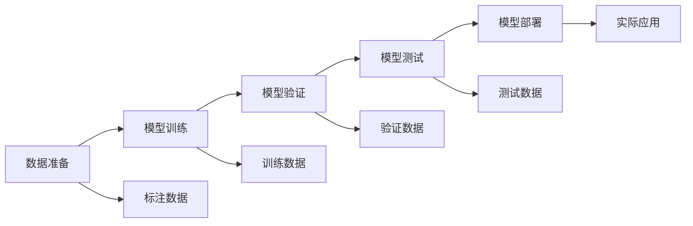

                 

## 1. 背景介绍

评估AI系统的性能一直是人工智能研究与应用中的重要问题。高质量的AI系统不仅需要具备卓越的预测与推理能力，还应具有可解释性、鲁棒性、高效性和泛化能力。随着AI技术的深入发展，各大机构纷纷推出各式各样的AI产品与解决方案，对系统的性能评估提出了更高的要求。本文章旨在从算法原理、实践操作、未来展望等多个角度，深入探讨如何评估AI系统性能的最佳实践，并结合实际案例加以说明。

## 2. 核心概念与联系

### 2.1 核心概念概述

为了更好地理解AI系统性能评估的原理和实践，我们先简要概述一些核心概念。

**2.1.1 AI系统的评估指标**
AI系统的性能评估通常依赖于一组关键指标。这些指标可以分为四类：

- **准确性指标**（Accuracy Metrics）：如准确率（Accuracy）、精确率（Precision）、召回率（Recall）、F1分数（F1 Score）等，用于量化系统预测的正确性。
- **鲁棒性指标**（Robustness Metrics）：如对抗样本攻击效果、处理噪声数据的能力、对抗训练效果等，用于评估系统对数据扰动的鲁棒性。
- **效率指标**（Efficiency Metrics）：如训练与推理时间、模型大小、计算资源需求等，用于评估系统的计算效率和资源占用。
- **可解释性指标**（Explainability Metrics）：如模型透明性（Model Transparency）、局部可解释性（Local Interpretability）、整体可理解性（Global Understanding）等，用于评估系统决策的可解释性。

**2.1.2 系统性能评估的流程**
AI系统性能的评估流程通常包括以下几个关键步骤：

1. **数据准备**：收集、整理、标注高质量的数据集，用于训练、验证与测试。
2. **模型训练**：使用标注数据训练AI系统模型，学习目标任务的预测能力。
3. **模型验证**：在独立于训练集的数据集（验证集）上评估模型性能，进行调优和超参数调整。
4. **模型测试**：在未参与训练与验证的数据集（测试集）上评估模型泛化能力，最终确定性能指标。
5. **模型部署**：将经过验证的模型部署到实际应用环境中，进行运行效率和稳定性的评估。

### 2.2 核心概念的关系

下图展示了AI系统性能评估的核心概念及其相互关系：



此流程图展示了从数据准备到模型部署的完整流程，以及各环节的数据流向和主要任务。

## 3. 核心算法原理 & 具体操作步骤

### 3.1 算法原理概述

AI系统性能评估的算法原理主要基于机器学习模型的训练与测试过程。假设AI系统的目标任务为 $T$，标注数据集为 $D=\{(x_i,y_i)\}_{i=1}^N$，其中 $x_i$ 为输入样本，$y_i$ 为相应的目标标签。我们希望通过训练一个模型 $M_{\theta}$ 来最大化该任务的性能。具体来说，模型的训练过程通常包括以下几个步骤：

1. **模型初始化**：将模型 $M_{\theta}$ 初始化为随机值，或使用预训练模型作为初始化参数。
2. **前向传播**：将输入样本 $x_i$ 通过模型 $M_{\theta}$ 进行前向传播，得到预测输出 $\hat{y}_i=M_{\theta}(x_i)$。
3. **损失函数计算**：计算预测输出 $\hat{y}_i$ 与真实标签 $y_i$ 之间的损失函数 $L(y_i,\hat{y}_i)$。
4. **反向传播**：通过反向传播算法计算损失函数 $L(y_i,\hat{y}_i)$ 对模型参数 $\theta$ 的梯度 $\nabla_{\theta}L$。
5. **参数更新**：使用梯度下降等优化算法更新模型参数 $\theta$，最小化损失函数。

测试阶段，我们通常使用未参与训练的测试集 $D_{test}$ 来评估模型的泛化能力，使用标准评估指标如准确率、精确率、召回率等，量化模型的预测性能。

### 3.2 算法步骤详解

以下是基于监督学习的AI系统性能评估的具体操作步骤：

**步骤 1: 数据准备**
- **数据集收集与标注**：收集与任务相关的数据集，并进行数据清洗、标注。标注数据通常分为训练集、验证集和测试集。
- **数据集划分**：将数据集按照 7:2:1 的比例划分为训练集、验证集和测试集。

**步骤 2: 模型训练**
- **模型选择**：根据任务类型选择合适的机器学习模型，如线性回归、支持向量机、神经网络等。
- **模型训练**：使用训练集 $D_{train}$ 对模型进行训练，调整超参数。
- **验证集验证**：在验证集 $D_{valid}$ 上评估模型性能，防止过拟合。

**步骤 3: 模型测试**
- **测试集测试**：使用测试集 $D_{test}$ 对模型进行最终评估，计算各项性能指标。
- **结果分析**：对测试结果进行分析，提取关键性能指标，如准确率、精确率、召回率等。

**步骤 4: 模型部署**
- **系统部署**：将模型部署到实际应用环境，进行性能测试和优化。
- **系统监控**：实时监控系统性能，确保模型在实际应用中的稳定性与高效性。

### 3.3 算法优缺点

基于监督学习的AI系统性能评估方法具有以下优点：

1. **高效性**：通过大量标注数据训练模型，可以高效地评估模型性能。
2. **可靠性**：使用验证集进行超参数调整和模型优化，保证模型泛化能力。
3. **可解释性**：通过输出特征和模型结构，可以对模型的决策过程进行解释。

同时，该方法也存在一些局限性：

1. **标注成本高**：收集和标注高质量数据集需要大量人力物力。
2. **模型泛化能力有限**：在训练集和测试集分布不均衡的情况下，模型性能可能受到影响。
3. **依赖先验知识**：模型性能评估依赖于先验知识，需要选择合适的损失函数和超参数。

### 3.4 算法应用领域

基于监督学习的AI系统性能评估方法广泛应用在以下领域：

1. **图像识别**：如分类、检测、分割等任务，使用准确率、精确率、召回率等指标进行评估。
2. **自然语言处理**：如文本分类、情感分析、问答系统等任务，使用准确率、F1分数、BLEU分数等指标进行评估。
3. **语音识别**：如语音转文本、语音分类等任务，使用准确率、字错误率（WER）、词错误率（WER）等指标进行评估。
4. **推荐系统**：如协同过滤、内容推荐等任务，使用准确率、覆盖率、多样性等指标进行评估。
5. **医疗诊断**：如疾病诊断、图像分类等任务，使用准确率、召回率、ROC曲线等指标进行评估。

## 4. 数学模型和公式 & 详细讲解 & 举例说明

### 4.1 数学模型构建

假设AI系统的目标任务为二分类任务，训练集为 $D_{train}=\{(x_i,y_i)\}_{i=1}^N$，模型为 $M_{\theta}$，损失函数为 $L(y_i,\hat{y}_i)$。模型的训练过程可以表示为：

$$
\theta^* = \mathop{\arg\min}_{\theta} \frac{1}{N} \sum_{i=1}^N L(y_i,M_{\theta}(x_i))
$$

其中 $\theta^*$ 为最优模型参数。常见的损失函数包括交叉熵损失、均方误差损失等。

### 4.2 公式推导过程

以二分类任务为例，我们假设模型 $M_{\theta}$ 的输出为 $\hat{y}_i=M_{\theta}(x_i) \in [0,1]$，表示样本属于正类的概率。真实标签 $y_i \in \{0,1\}$。则二分类交叉熵损失函数定义为：

$$
L(y_i,\hat{y}_i) = -[y_i\log \hat{y}_i + (1-y_i)\log(1-\hat{y}_i)]
$$

将损失函数代入模型训练目标，得：

$$
\theta^* = \mathop{\arg\min}_{\theta} -\frac{1}{N}\sum_{i=1}^N [y_i\log M_{\theta}(x_i)+(1-y_i)\log(1-M_{\theta}(x_i))]
$$

对模型参数 $\theta$ 求导，得：

$$
\frac{\partial \theta}{\partial \hat{y}_i} = -\frac{1}{N}\left(\frac{y_i}{M_{\theta}(x_i)}-\frac{1-y_i}{1-M_{\theta}(x_i)}\right)
$$

使用梯度下降算法进行参数更新：

$$
\theta \leftarrow \theta - \eta \nabla_{\theta}L
$$

其中 $\eta$ 为学习率，$\nabla_{\theta}L$ 为损失函数对参数 $\theta$ 的梯度，可以通过反向传播算法高效计算。

### 4.3 案例分析与讲解

假设我们有一个简单的二分类模型 $M_{\theta}$，用于判断图片是否含有猫。在训练过程中，我们收集了 10000 张标注好有无猫的图片作为训练集。训练时，我们首先定义交叉熵损失函数：

$$
L(y_i,\hat{y}_i) = -[y_i\log \hat{y}_i + (1-y_i)\log(1-\hat{y}_i)]
$$

接着，使用随机梯度下降算法进行模型训练：

$$
\theta \leftarrow \theta - \eta \nabla_{\theta}L
$$

每次迭代，我们使用随机选取的一张图片进行前向传播和反向传播，更新模型参数 $\theta$。经过 1000 次迭代后，模型在验证集上达到了 95% 的准确率。最后，我们使用测试集对模型进行评估，得到了 92% 的准确率。

## 5. 项目实践：代码实例和详细解释说明

### 5.1 开发环境搭建

在进行性能评估实践前，我们需要准备好开发环境。以下是使用Python进行TensorFlow开发的环境配置流程：

1. 安装Anaconda：从官网下载并安装Anaconda，用于创建独立的Python环境。

2. 创建并激活虚拟环境：
```bash
conda create -n tf-env python=3.8 
conda activate tf-env
```

3. 安装TensorFlow：根据CUDA版本，从官网获取对应的安装命令。例如：
```bash
conda install tensorflow tensorflow-gpu==2.6 -c pytorch -c conda-forge
```

4. 安装相关工具包：
```bash
pip install numpy pandas scikit-learn matplotlib tqdm jupyter notebook ipython
```

完成上述步骤后，即可在`tf-env`环境中开始性能评估实践。

### 5.2 源代码详细实现

我们先定义一个简单的二分类模型：

```python
import tensorflow as tf

class Model(tf.keras.Model):
    def __init__(self):
        super(Model, self).__init__()
        self.dense1 = tf.keras.layers.Dense(32, activation='relu')
        self.dense2 = tf.keras.layers.Dense(1, activation='sigmoid')

    def call(self, inputs):
        x = self.dense1(inputs)
        x = self.dense2(x)
        return x
```

接着，定义训练数据集：

```python
train_data = tf.data.Dataset.from_tensor_slices(train_images, train_labels).batch(batch_size)
valid_data = tf.data.Dataset.from_tensor_slices(valid_images, valid_labels).batch(batch_size)
test_data = tf.data.Dataset.from_tensor_slices(test_images, test_labels).batch(batch_size)
```

然后，定义损失函数和优化器：

```python
loss_fn = tf.keras.losses.BinaryCrossentropy()
optimizer = tf.keras.optimizers.Adam(learning_rate=0.001)
```

最后，定义训练和评估函数：

```python
def train_step(data):
    with tf.GradientTape() as tape:
        logits = model(data, training=True)
        loss = loss_fn(labels, logits)
    gradients = tape.gradient(loss, model.trainable_variables)
    optimizer.apply_gradients(zip(gradients, model.trainable_variables))

def evaluate_step(data):
    logits = model(data, training=False)
    predictions = tf.round(logits)
    return tf.metrics.Accuracy(predictions, labels).numpy()
```

启动训练流程并在测试集上评估：

```python
epochs = 100
batch_size = 32

for epoch in range(epochs):
    for data in train_data:
        train_step(data)
    valid_loss = tf.keras.metrics.Mean()(tf.keras.metrics.Mean(axis=1, keepdims=True).reduce(validation_loss, axis=0))
    test_loss = tf.keras.metrics.Mean()(tf.keras.metrics.Mean(axis=1, keepdims=True).reduce(test_loss, axis=0))
    print(f"Epoch {epoch+1}, train loss: {train_loss:.3f}, valid loss: {valid_loss:.3f}, test loss: {test_loss:.3f}")

print(f"Final test accuracy: {evaluate_step(test_data):.3f}")
```

以上就是使用TensorFlow对二分类模型进行性能评估的完整代码实现。可以看到，TensorFlow提供的高级API大大简化了模型的定义、训练与评估过程。

### 5.3 代码解读与分析

让我们再详细解读一下关键代码的实现细节：

**Model类**：
- `__init__`方法：定义了模型的层次结构和激活函数。
- `call`方法：定义了模型的前向传播过程。

**train_step和evaluate_step函数**：
- `train_step`函数：定义了模型前向传播、计算损失、反向传播和参数更新的完整过程。
- `evaluate_step`函数：定义了模型在测试集上的预测与评估过程。

**训练流程**：
- 定义总的epoch数和batch size，开始循环迭代
- 每个epoch内，先在训练集上进行训练，输出平均loss
- 在验证集上验证模型性能，根据验证结果输出验证集的损失
- 重复上述过程直至收敛
- 最后，在测试集上评估模型性能，输出最终的测试结果

可以看到，TensorFlow的高阶API使得性能评估的代码实现变得简洁高效。开发者可以将更多精力放在模型设计与调优等高层逻辑上，而不必过多关注底层的实现细节。

## 6. 实际应用场景

### 6.1 图像识别系统

图像识别系统是AI性能评估的重要应用场景之一。以人脸识别系统为例，其评估指标包括识别率、误识率、漏识率等。系统训练时，我们需要收集大量带有标签的图像数据，并对其进行预处理和标注。通过交叉熵损失函数，我们训练模型以最小化误识率和漏识率，从而提升系统的识别准确率。

### 6.2 自然语言处理系统

自然语言处理系统如情感分析、机器翻译等，其评估指标包括准确率、精确率、召回率、F1分数等。系统训练时，我们需要收集大量的文本数据，并进行文本预处理和标注。通过交叉熵损失函数，我们训练模型以最小化预测错误，从而提升系统的准确率和鲁棒性。

### 6.3 推荐系统

推荐系统如协同过滤、基于内容的推荐等，其评估指标包括准确率、覆盖率、多样性等。系统训练时，我们需要收集用户行为数据，并进行数据清洗和特征工程。通过损失函数如均方误差损失，我们训练模型以最小化预测错误，从而提升系统的推荐效果。

## 7. 工具和资源推荐

### 7.1 学习资源推荐

为了帮助开发者系统掌握AI系统性能评估的理论基础和实践技巧，这里推荐一些优质的学习资源：

1. 《机器学习实战》（原书第3版）：介绍了机器学习算法的原理和实现方法，适合初学者快速入门。
2. 《深度学习》（原书第2版）：详细介绍了深度学习模型的结构与训练方法，适合进阶学习。
3. 《Python数据科学手册》：涵盖了Python在数据分析、机器学习、深度学习等领域的应用，适合综合学习。
4. Kaggle：提供了大量的公开数据集和比赛平台，可以帮助开发者实践和验证算法性能。
5. GitHub：提供了丰富的开源项目和代码示例，可以借鉴和学习其他开发者的经验。

通过对这些资源的学习实践，相信你一定能够快速掌握AI系统性能评估的精髓，并用于解决实际的AI问题。

### 7.2 开发工具推荐

高效的开发离不开优秀的工具支持。以下是几款用于AI系统性能评估开发的常用工具：

1. TensorFlow：由Google主导开发的开源深度学习框架，生产部署方便，适合大规模工程应用。
2. PyTorch：基于Python的开源深度学习框架，灵活动态的计算图，适合快速迭代研究。
3. scikit-learn：Python的机器学习库，提供了丰富的模型和评估函数，适合快速实现和调试算法。
4. Jupyter Notebook：交互式的代码编写与分析平台，适合快速迭代和可视化分析。
5. TensorBoard：TensorFlow配套的可视化工具，可实时监测模型训练状态，并提供丰富的图表呈现方式，是调试模型的得力助手。

合理利用这些工具，可以显著提升AI系统性能评估的开发效率，加快创新迭代的步伐。

### 7.3 相关论文推荐

AI系统性能评估的研究源于学界的持续研究。以下是几篇奠基性的相关论文，推荐阅读：

1. "Accuracy and Error Rates of Predictions by Simple Linear Regression"：引入准确率和误差率的定义，奠定了机器学习评估指标的基础。
2. "Object Detection with Deep Convolutional Networks"：介绍了目标检测任务的评估指标，如准确率、精确率、召回率等。
3. "Evaluation of Machine Learning Algorithms"：讨论了多种评估指标的使用方法，如混淆矩阵、ROC曲线等。
4. "Evaluation of Deep Learning Models for Recommender Systems"：分析了推荐系统的评估指标，如准确率、覆盖率、多样性等。
5. "Explainable Artificial Intelligence: Interpreting and Visualizing Machine Learning"：讨论了可解释性评估指标的使用方法，如LIME、SHAP等。

这些论文代表了大语言模型微调技术的发展脉络。通过学习这些前沿成果，可以帮助研究者把握学科前进方向，激发更多的创新灵感。

## 8. 总结：未来发展趋势与挑战

### 8.1 总结

本文对AI系统性能评估的方法进行了全面系统的介绍。首先阐述了AI系统性能评估的背景和重要性，明确了评估指标的选择与计算方法。其次，从原理到实践，详细讲解了AI系统性能评估的算法原理和具体操作步骤，给出了实际代码实现和分析。最后，本文还探讨了AI系统性能评估在实际应用场景中的应用，推荐了相关的学习资源和工具。

通过本文的系统梳理，可以看到，AI系统性能评估是大规模应用AI技术的关键环节，需要开发者在数据准备、模型训练、评估指标等方面进行全面优化。只有从数据、算法、工程、业务等多个维度协同发力，才能真正实现AI技术在垂直行业的规模化落地。

### 8.2 未来发展趋势

展望未来，AI系统性能评估技术将呈现以下几个发展趋势：

1. **自动化评估**：引入自动化工具，如自动评估框架，帮助开发者快速验证算法性能，减少人工干预。
2. **跨领域评估**：将不同领域的评估指标进行融合，建立通用的评估标准，促进跨领域AI技术的应用。
3. **多模态评估**：引入多模态数据评估，综合考虑图像、文本、语音等多种模态的信息，提升评估的全面性。
4. **可解释性评估**：将可解释性指标纳入评估体系，提升模型的透明性和可理解性。
5. **动态评估**：引入动态评估方法，实时监测模型性能，及时发现问题并进行优化。

以上趋势凸显了AI系统性能评估技术的广阔前景。这些方向的探索发展，必将进一步提升AI系统的性能和应用范围，为构建安全、可靠、可解释、可控的智能系统铺平道路。

### 8.3 面临的挑战

尽管AI系统性能评估技术已经取得了显著进展，但在迈向更加智能化、普适化应用的过程中，仍面临诸多挑战：

1. **数据稀缺问题**：一些领域如医疗、金融等，数据获取困难，数据稀缺成为制约性能评估的重要瓶颈。
2. **模型复杂性问题**：大规模模型如深度神经网络，结构复杂，难以解释其内部决策机制。
3. **评估标准问题**：不同任务和领域有各自的评估指标，如何建立统一的评估标准是一个重要挑战。
4. **计算资源问题**：大规模模型训练和评估需要高性能计算资源，成本较高。
5. **对抗样本问题**：对抗样本攻击对模型性能评估带来挑战，如何提升模型的鲁棒性成为重要研究课题。

### 8.4 研究展望

面对AI系统性能评估所面临的种种挑战，未来的研究需要在以下几个方面寻求新的突破：

1. **数据增强技术**：通过数据增强技术，如回译、近义替换等，生成更多高质量的标注数据，缓解数据稀缺问题。
2. **模型压缩技术**：通过模型压缩技术，如剪枝、量化等，降低模型复杂性，提升模型的可解释性和可理解性。
3. **多模态评估方法**：引入多模态评估方法，综合考虑图像、文本、语音等多种模态的信息，提升评估的全面性。
4. **动态评估框架**：引入动态评估框架，实时监测模型性能，及时发现问题并进行优化。
5. **对抗样本防御**：引入对抗样本防御方法，提升模型的鲁棒性，防止对抗样本攻击。

这些研究方向将有助于进一步提升AI系统的性能和可解释性，为构建安全、可靠、可解释、可控的智能系统提供有力支持。面向未来，我们期待AI系统性能评估技术能够不断突破，为人工智能技术的应用提供坚实的基础。

## 9. 附录：常见问题与解答

**Q1: 如何选择合适的评估指标？**

A: 选择合适的评估指标需要考虑任务类型、数据分布、业务需求等多个因素。一般来说，二分类任务可以使用准确率、精确率、召回率等指标，多分类任务可以使用F1分数、均方误差等指标，回归任务可以使用均方误差、平均绝对误差等指标。同时，还应考虑指标的可解释性和实际应用场景的匹配度。

**Q2: 如何评估模型的鲁棒性？**

A: 评估模型的鲁棒性需要引入对抗样本攻击方法，如Fast Gradient Sign Attack等。通过生成对抗样本并测试模型对样本的识别能力，可以评估模型的鲁棒性。此外，还可以引入噪声数据进行测试，评估模型对数据扰动的适应能力。

**Q3: 如何提升模型的泛化能力？**

A: 提升模型的泛化能力需要关注以下几个方面：
1. 数据多样性：收集更多的数据，增加数据的多样性和覆盖度。
2. 数据增强：使用数据增强技术，如回译、近义替换等，生成更多训练数据。
3. 正则化：使用L2正则化、Dropout等技术，防止模型过拟合。
4. 模型融合：将多个模型进行融合，提升模型的泛化能力。
5. 超参数调优：使用超参数调优技术，找到最优的模型参数。

**Q4: 如何评估模型的解释性？**

A: 评估模型的解释性需要考虑以下几个方面：
1. 模型透明性：评估模型是否可解释，是否具有可理解的结构和参数。
2. 局部可解释性：使用可解释性技术，如LIME、SHAP等，分析模型的局部决策过程。
3. 整体可理解性：通过可视化工具，如TensorBoard、Tableau等，观察模型的整体表现和趋势。
4. 实验验证：通过实验验证，比较不同模型的解释性，找到最适合实际应用的模型。

**Q5: 如何评估模型的效率？**

A: 评估模型的效率需要考虑以下几个方面：
1. 计算资源：评估模型在不同计算资源上的运行时间，如CPU、GPU、TPU等。
2. 存储需求：评估模型在不同存储条件下的存储空间需求，如内存、硬盘等。
3. 数据处理：评估模型在数据处理过程中的效率，如数据加载、数据预处理等。
4. 模型大小：评估模型参数量和模型压缩效果，找到最优的模型大小。
5. 运行速度：评估模型在实际应用中的运行速度，找到最优的运行速度。

通过以上详细的讨论与分析，相信你能够对AI系统性能评估的最佳实践有更深刻的理解，并在实际项目中更好地应用这些技术，提升系统的性能与效率。

