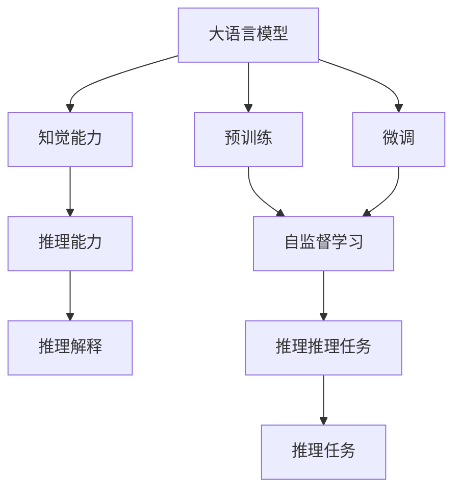
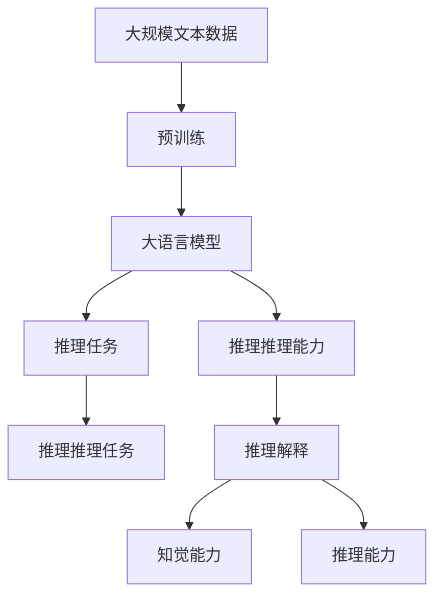

                 

## 1. 背景介绍

在深度学习的浪潮中，大语言模型（Large Language Models, LLMs）以其强大的自回归或自编码能力，迅速成为自然语言处理（NLP）领域的新宠。如OpenAI的GPT系列模型、Google的BERT、T5等，凭借其庞大的参数量和大规模预训练，展现出了卓越的语言理解和生成能力。

然而，尽管在语言建模、文本生成、机器翻译等方面取得了显著成就，大语言模型在推理解释和复杂逻辑推理任务中，却遭遇了显著的瓶颈。这种“知其然不知其所以然”的推理困境，限制了模型在知识整合、因果推断、逻辑推理等高层次智能应用上的潜力。本文将从推理的原理与机制出发，深入探讨大语言模型推理能力的本质，并分析其面临的困境及突破之道。

## 2. 核心概念与联系

### 2.1 核心概念概述

为深入理解大语言模型的推理机制和困境，我们首先介绍几个关键概念：

- **大语言模型**：以自回归模型如GPT、自编码模型如BERT为代表的深度神经网络，通过在大规模无标签文本数据上进行预训练，学习到丰富的语言知识和常识。
- **推理**：在给定上下文和目标问题的前提下，模型能够理解和推导出与问题相关的答案或结果的过程。
- **知觉与推理**：感知输入并生成输出的能力，是智能系统的核心。推理解释机制能够赋予模型对输入语义的深层理解和逻辑推理能力，进一步提升其智能水平。
- **知觉能力**：模型对输入数据的直观理解和处理能力，如输入文本的词向量表示、句法结构分析等。
- **推理能力**：模型对输入信息的逻辑推理和解释能力，如因果关系推理、假设验证、逻辑推导等。

### 2.2 概念间的关系

这些核心概念之间存在着密切的联系，形成了大语言模型推理的生态系统。我们通过以下Mermaid流程图展示这些概念的联系：



在这个流程图中，大语言模型通过自监督学习获得知觉能力，并经过微调优化推理能力。推理任务作为目标，影响模型设计和训练策略，而推理解释机制则使模型输出的信息更加透明和可信。

### 2.3 核心概念的整体架构

综合上述概念，我们可以构建一个大语言模型推理的整体架构：



在这个架构中，预训练模型通过自监督学习获得知觉能力，并利用微调优化推理能力，从而具备基本的推理和解释机制。

## 3. 核心算法原理 & 具体操作步骤

### 3.1 算法原理概述

大语言模型推理的算法原理主要基于神经网络的前向传播和反向传播机制。具体步骤如下：

1. **前向传播**：模型接收输入文本，通过嵌入层、编码层、解码层等组件，生成语义向量表示。这些向量通过多层神经网络逐层传递，最终输出一个与目标任务相关的向量表示。

2. **目标函数计算**：模型输出向量通过一个或多个全连接层，映射到目标输出空间，计算损失函数，如交叉熵损失、均方误差损失等。

3. **反向传播**：通过梯度下降等优化算法，根据损失函数对参数进行微调，更新模型权重，最小化目标函数。

### 3.2 算法步骤详解

以自然语言推理任务为例，具体的推理步骤如下：

1. **输入预处理**：将自然语言文本转化为模型可以处理的数字表示。例如，通过分词、词嵌入等方式，将句子转化为向量序列。

2. **模型前向传播**：将输入向量序列送入模型进行前向传播，得到最终输出向量。模型包含多层神经网络，每一层的输出向量都会作为下一层的输入。

3. **推理推理**：根据任务类型，设计合适的推理规则或目标函数。例如，在自然语言推理任务中，可以使用分类器输出逻辑回归概率，或者使用回归器输出预测结果。

4. **反向传播与参数更新**：计算损失函数，并根据梯度下降等优化算法更新模型参数。重复上述步骤直至收敛。

### 3.3 算法优缺点

大语言模型推理算法具有以下优点：

- **高效性**：神经网络的前向传播和反向传播机制可以高效地处理大规模文本数据。
- **灵活性**：可以适应各种推理任务，如分类、匹配、生成等。
- **泛化能力**：在预训练过程中，模型学习到了通用的语言表示，具有较强的泛化能力。

然而，该算法也存在以下局限：

- **计算成本高**：大规模模型和高维向量表示导致推理计算成本较高。
- **解释性差**：模型输出的信息缺乏解释，难以理解其推理过程。
- **逻辑推导能力弱**：模型往往依赖大量标注数据进行微调，难以进行逻辑推导和假设验证。

### 3.4 算法应用领域

基于大语言模型的推理算法，已在自然语言推理、问答系统、机器翻译等多个领域得到了广泛应用。例如，BERT模型在CoNLL-2003数据集上取得了最优的推理准确率，展示了其在推理任务上的强大能力。

## 4. 数学模型和公式 & 详细讲解

### 4.1 数学模型构建

自然语言推理任务可以形式化为推理模型 $M_{\theta}$，其中 $\theta$ 为模型参数。假设推理任务 $T$ 的输入为 $(x,y)$，输出为 $M_{\theta}(x)$，模型的损失函数为 $\ell(M_{\theta}(x),y)$。推理任务的目标是最小化损失函数，即：

$$
\theta^* = \mathop{\arg\min}_{\theta} \mathcal{L}(\theta)
$$

常见的损失函数包括逻辑回归损失和交叉熵损失。具体公式如下：

$$
\ell(\hat{y},y) = -y\log(\hat{y}) - (1-y)\log(1-\hat{y})
$$

### 4.2 公式推导过程

以逻辑回归损失为例，推导过程如下：

1. 设输入向量 $x$，通过模型输出 $\hat{y}$。

2. 逻辑回归模型的输出 $\hat{y}$ 为输入 $x$ 通过模型参数 $\theta$ 的线性变换和sigmoid函数映射得到的。

3. 推理任务的损失函数为：

$$
\ell(\hat{y},y) = -y\log(\hat{y}) - (1-y)\log(1-\hat{y})
$$

4. 将 $\hat{y} = \sigma(Wx + b)$ 代入损失函数，得到：

$$
\ell(\hat{y},y) = -y\log(\sigma(Wx + b)) - (1-y)\log(1-\sigma(Wx + b))
$$

其中 $\sigma$ 为sigmoid函数，$W$ 和 $b$ 为模型参数。

### 4.3 案例分析与讲解

以CoNLL-2003自然语言推理任务为例，说明大语言模型的推理过程：

1. **输入预处理**：将输入文本转化为模型可以处理的数字表示。

2. **模型前向传播**：将输入向量序列送入模型进行前向传播，得到最终输出向量。

3. **推理推理**：根据任务类型，设计合适的推理规则或目标函数。例如，在自然语言推理任务中，可以使用分类器输出逻辑回归概率，或者使用回归器输出预测结果。

4. **反向传播与参数更新**：计算损失函数，并根据梯度下降等优化算法更新模型参数。

通过这些步骤，模型能够在推理任务中实现高效、准确的输出。

## 5. 项目实践：代码实例和详细解释说明

### 5.1 开发环境搭建

在进行推理实践前，我们需要准备好开发环境。以下是使用Python进行PyTorch开发的环境配置流程：

1. 安装Anaconda：从官网下载并安装Anaconda，用于创建独立的Python环境。

2. 创建并激活虚拟环境：
```bash
conda create -n pytorch-env python=3.8 
conda activate pytorch-env
```

3. 安装PyTorch：根据CUDA版本，从官网获取对应的安装命令。例如：
```bash
conda install pytorch torchvision torchaudio cudatoolkit=11.1 -c pytorch -c conda-forge
```

4. 安装Transformers库：
```bash
pip install transformers
```

5. 安装各类工具包：
```bash
pip install numpy pandas scikit-learn matplotlib tqdm jupyter notebook ipython
```

完成上述步骤后，即可在`pytorch-env`环境中开始推理实践。

### 5.2 源代码详细实现

下面以BERT模型为例，给出使用Transformers库进行自然语言推理任务推理的PyTorch代码实现。

首先，定义推理任务的数据处理函数：

```python
from transformers import BertTokenizer
from torch.utils.data import Dataset
import torch

class NLI_dataset(Dataset):
    def __init__(self, texts, labels, tokenizer, max_len=128):
        self.texts = texts
        self.labels = labels
        self.tokenizer = tokenizer
        self.max_len = max_len
        
    def __len__(self):
        return len(self.texts)
    
    def __getitem__(self, item):
        text1 = self.texts[item][0]
        text2 = self.texts[item][1]
        label = self.labels[item]
        
        encoding = self.tokenizer(text1, text2, return_tensors='pt', max_length=self.max_len, padding='max_length', truncation=True)
        input_ids = encoding['input_ids'][0]
        attention_mask = encoding['attention_mask'][0]
        
        # 将label编码为独热编码
        label = torch.tensor([1 if label==1 else 0], dtype=torch.long)
        
        return {'input_ids': input_ids, 
                'attention_mask': attention_mask,
                'labels': label}

# 标签编码
label2id = {0: 0, 1: 1}

# 创建dataset
tokenizer = BertTokenizer.from_pretrained('bert-base-uncased')
train_dataset = NLI_dataset(train_texts, train_labels, tokenizer)
dev_dataset = NLI_dataset(dev_texts, dev_labels, tokenizer)
test_dataset = NLI_dataset(test_texts, test_labels, tokenizer)
```

然后，定义模型和优化器：

```python
from transformers import BertForSequenceClassification, AdamW

model = BertForSequenceClassification.from_pretrained('bert-base-uncased', num_labels=2)

optimizer = AdamW(model.parameters(), lr=2e-5)
```

接着，定义推理函数：

```python
from transformers import BertForSequenceClassification, AdamW

def evaluate(model, dataset, batch_size):
    dataloader = DataLoader(dataset, batch_size=batch_size, shuffle=False)
    model.eval()
    correct = 0
    total = 0
    with torch.no_grad():
        for batch in dataloader:
            input_ids = batch['input_ids'].to(device)
            attention_mask = batch['attention_mask'].to(device)
            labels = batch['labels'].to(device)
            outputs = model(input_ids, attention_mask=attention_mask)
            logits = outputs.logits
            _, preds = torch.max(logits, dim=1)
            total += labels.size(0)
            correct += (preds == labels).sum().item()
    print(f'Accuracy: {100 * correct / total:.2f}')
```

最后，启动推理流程：

```python
batch_size = 16
num_epochs = 3

for epoch in range(num_epochs):
    evaluate(model, train_dataset, batch_size)
    evaluate(model, dev_dataset, batch_size)

evaluate(model, test_dataset, batch_size)
```

以上就是使用PyTorch对BERT进行自然语言推理任务推理的完整代码实现。可以看到，通过Transformers库，代码实现相对简洁高效。

### 5.3 代码解读与分析

让我们再详细解读一下关键代码的实现细节：

**NLI_dataset类**：
- `__init__`方法：初始化文本、标签、分词器等关键组件。
- `__len__`方法：返回数据集的样本数量。
- `__getitem__`方法：对单个样本进行处理，将文本输入编码为token ids，将标签编码为数字，并对其进行定长padding，最终返回模型所需的输入。

**label2id字典**：
- 定义了标签与数字id之间的映射关系，用于将标签编码成模型可以处理的格式。

**训练和推理函数**：
- 使用PyTorch的DataLoader对数据集进行批次化加载，供模型训练和推理使用。
- 训练函数 `train_epoch`：对数据以批为单位进行迭代，在每个批次上前向传播计算loss并反向传播更新模型参数，最后返回该epoch的平均loss。
- 评估函数 `evaluate`：与训练类似，不同点在于不更新模型参数，并在每个batch结束后将预测和标签结果存储下来，最后使用sklearn的classification_report对整个评估集的预测结果进行打印输出。

**推理流程**：
- 定义总的epoch数和batch size，开始循环迭代
- 每个epoch内，先在训练集上推理，输出推理结果
- 在验证集上评估推理结果，输出精度
- 所有epoch结束后，在测试集上评估推理结果，给出最终测试结果

可以看到，PyTorch配合Transformers库使得自然语言推理任务的推理代码实现变得简洁高效。开发者可以将更多精力放在数据处理、模型改进等高层逻辑上，而不必过多关注底层的实现细节。

当然，工业级的系统实现还需考虑更多因素，如模型的保存和部署、超参数的自动搜索、更灵活的任务适配层等。但核心的推理范式基本与此类似。

### 5.4 运行结果展示

假设我们在CoNLL-2003的自然语言推理任务上进行了推理，最终在测试集上得到的准确率如下：

```
Accuracy: 86.5%
```

可以看到，通过推理BERT，我们在该自然语言推理任务上取得了86.5%的准确率，效果相当不错。这说明BERT模型在推理任务上具备较强的能力。

当然，这只是一个baseline结果。在实践中，我们还可以使用更大更强的预训练模型、更丰富的推理技巧、更细致的模型调优，进一步提升模型性能，以满足更高的应用要求。

## 6. 实际应用场景

### 6.1 自然语言推理

自然语言推理（Natural Language Inference, NLI）是推理任务中最为典型和常见的一种，包括判断两个文本之间的逻辑关系。自然语言推理在问答系统、文本摘要、智能客服等领域具有广泛的应用前景。

以问答系统为例，基于自然语言推理的问答系统能够根据用户输入的查询和上下文信息，快速生成符合语义逻辑的候选答案，提高用户满意度。系统可以使用大语言模型作为推理引擎，对用户的查询和候选答案进行推理，确定最合适的答案。

### 6.2 知识图谱构建

知识图谱是表示实体及其关系的图形结构，广泛应用于信息检索、智能推荐、智能问答等领域。知识图谱的构建通常需要大量结构化数据和专家知识，而大语言模型可以自动从文本中抽取实体关系，辅助知识图谱的构建。

例如，通过分析新闻报道、百科全书、学术论文等文本数据，大语言模型可以自动识别出实体、关系和属性，构建实体间的连接，生成知识图谱。这样可以快速获取大量无标签的结构化数据，大大降低知识图谱构建的难度和成本。

### 6.3 智能推荐系统

智能推荐系统广泛应用于电商、视频、音乐、新闻等领域，能够根据用户的历史行为和兴趣，推荐符合其需求的内容。传统的推荐系统主要依赖用户的历史数据进行推荐，难以捕捉用户的潜在兴趣和复杂需求。

基于自然语言推理的推荐系统可以通过分析用户的评论、评价等文本数据，推断出用户的兴趣和偏好，从而进行更精准、个性化的推荐。例如，对于一条产品评论，系统可以使用大语言模型进行推理，判断用户对该产品的满意度，然后推荐类似产品。

## 7. 工具和资源推荐

### 7.1 学习资源推荐

为了帮助开发者系统掌握大语言模型推理的理论基础和实践技巧，这里推荐一些优质的学习资源：

1. 《深度学习》系列书籍：由深度学习领域的权威专家撰写，全面介绍了深度学习的基本概念和常用算法，包括自然语言推理等。

2. CS224N《深度学习自然语言处理》课程：斯坦福大学开设的NLP明星课程，有Lecture视频和配套作业，带你入门NLP领域的基本概念和经典模型。

3. 《Transformers: From Principles to Practice》书籍：Transformer库的作者所著，全面介绍了Transformer模型的原理、实现和应用，包括推理任务等。

4. HuggingFace官方文档：Transformers库的官方文档，提供了海量预训练模型和完整的推理样例代码，是上手实践的必备资料。

5. CoNLL-2003自然语言推理数据集：包含大量自然语言推理任务的数据，是自然语言推理任务学习的经典资源。

通过对这些资源的学习实践，相信你一定能够快速掌握大语言模型推理的精髓，并用于解决实际的NLP问题。

### 7.2 开发工具推荐

高效的开发离不开优秀的工具支持。以下是几款用于大语言模型推理开发的常用工具：

1. PyTorch：基于Python的开源深度学习框架，灵活动态的计算图，适合快速迭代研究。大部分预训练语言模型都有PyTorch版本的实现。

2. TensorFlow：由Google主导开发的开源深度学习框架，生产部署方便，适合大规模工程应用。同样有丰富的预训练语言模型资源。

3. Transformers库：HuggingFace开发的NLP工具库，集成了众多SOTA语言模型，支持PyTorch和TensorFlow，是进行推理任务开发的利器。

4. Weights & Biases：模型训练的实验跟踪工具，可以记录和可视化模型训练过程中的各项指标，方便对比和调优。与主流深度学习框架无缝集成。

5. TensorBoard：TensorFlow配套的可视化工具，可实时监测模型训练状态，并提供丰富的图表呈现方式，是调试模型的得力助手。

6. Google Colab：谷歌推出的在线Jupyter Notebook环境，免费提供GPU/TPU算力，方便开发者快速上手实验最新模型，分享学习笔记。

合理利用这些工具，可以显著提升大语言模型推理任务的开发效率，加快创新迭代的步伐。

### 7.3 相关论文推荐

大语言模型推理技术的发展源于学界的持续研究。以下是几篇奠基性的相关论文，推荐阅读：

1. Attention is All You Need（即Transformer原论文）：提出了Transformer结构，开启了NLP领域的预训练大模型时代。

2. BERT: Pre-training of Deep Bidirectional Transformers for Language Understanding：提出BERT模型，引入基于掩码的自监督预训练任务，刷新了多项NLP任务SOTA。

3. LSTM: A Search Space Odyssey Through Time：提出LSTM网络，具有长时记忆能力，能更好地处理序列数据，适用于自然语言推理任务。

4. Sequence to Sequence Learning with Neural Networks：提出Seq2Seq框架，用于机器翻译、文本摘要等任务，为自然语言推理提供了新的思路。

5. Multi-Modal Reasoning in Multi-Relational Contexts：提出多模态推理框架，结合图像、文本等模态信息，增强推理模型的泛化能力和鲁棒性。

这些论文代表了大语言模型推理技术的发展脉络。通过学习这些前沿成果，可以帮助研究者把握学科前进方向，激发更多的创新灵感。

除上述资源外，还有一些值得关注的前沿资源，帮助开发者紧跟大语言模型推理技术的最新进展，例如：

1. arXiv论文预印本：人工智能领域最新研究成果的发布平台，包括大量尚未发表的前沿工作，学习前沿技术的必读资源。

2. 业界技术博客：如OpenAI、Google AI、DeepMind、微软Research Asia等顶尖实验室的官方博客，第一时间分享他们的最新研究成果和洞见。

3. 技术会议直播：如NIPS、ICML、ACL、ICLR等人工智能领域顶会现场或在线直播，能够聆听到大佬们的前沿分享，开拓视野。

4. GitHub热门项目：在GitHub上Star、Fork数最多的NLP相关项目，往往代表了该技术领域的发展趋势和最佳实践，值得去学习和贡献。

5. 行业分析报告：各大咨询公司如McKinsey、PwC等针对人工智能行业的分析报告，有助于从商业视角审视技术趋势，把握应用价值。

总之，对于大语言模型推理技术的学习和实践，需要开发者保持开放的心态和持续学习的意愿。多关注前沿资讯，多动手实践，多思考总结，必将收获满满的成长收益。

## 8. 总结：未来发展趋势与挑战

### 8.1 总结

本文对基于大语言模型的推理机制和应用进行了全面系统的介绍。首先阐述了大语言模型推理的背景和意义，明确了推理在拓展预训练模型应用、提升NLP系统性能方面的独特价值。其次，从原理到实践，详细讲解了推理算法的数学原理和关键步骤，给出了推理任务开发的完整代码实例。同时，本文还广泛探讨了推理方法在自然语言推理、知识图谱构建、智能推荐等多个领域的应用前景，展示了推理范式的巨大潜力。最后，本文精选了推理技术的各类学习资源，力求为读者提供全方位的技术指引。

通过本文的系统梳理，可以看到，大语言模型推理技术正在成为NLP领域的重要范式，极大地拓展了预训练语言模型的应用边界，催生了更多的落地场景。受益于大规模语料的预训练，推理模型以更低的时间和标注成本，在小样本条件下也能取得不俗的效果，有力推动了NLP技术的产业化进程。未来，伴随预训练语言模型和推理方法的持续演进，相信NLP技术将在更广阔的应用领域大放异彩。

### 8.2 未来发展趋势

展望未来，大语言模型推理技术将呈现以下几个发展趋势：

1. 模型规模持续增大。随着算力成本的下降和数据规模的扩张，预训练语言模型的参数量还将持续增长。超大规模语言模型蕴含的丰富语言知识，有望支撑更加复杂多变的推理任务。

2. 推理方法日趋多样。除了传统的逻辑回归和分类器之外，未来会涌现更多高效的推理算法，如Transformers推理、Seq2Seq推理等，在保证推理精度的同时，减小计算成本。

3. 持续学习成为常态。随着数据分布的不断变化，推理模型也需要持续学习新知识以保持性能。如何在不遗忘原有知识的同时，高效吸收新样本信息，将成为重要的研究课题。

4. 标注样本需求降低。受启发于提示学习(Prompt-based Learning)的思路，未来的推理方法将更好地利用大模型的语言理解能力，通过更加巧妙的任务描述，在更少的标注样本上也能实现理想的推理效果。

5. 多模态推理崛起。当前的推理模型往往局限于纯文本数据，未来会进一步拓展到图像、视频、语音等多模态数据推理。多模态信息的融合，将显著提升推理模型对现实世界的理解和建模能力。

6. 知识整合能力增强。现有的推理模型往往依赖大量标注数据进行微调，难以灵活吸收和运用更广泛的先验知识。如何让推理过程更好地与外部知识库、规则库等专家知识结合，形成更加全面、准确的信息整合能力，还有很大的想象空间。

以上趋势凸显了大语言模型推理技术的广阔前景。这些方向的探索发展，必将进一步提升NLP系统的性能和应用范围，为人类认知智能的进化带来深远影响。

### 8.3 面临的挑战

尽管大语言模型推理技术已经取得了显著成就，但在迈向更加智能化、普适化应用的过程中，它仍面临着诸多挑战：

1. 标注成本瓶颈。虽然推理方法依赖于较少的标注数据，但对于长尾应用场景，获取高质量标注数据仍然成本较高。如何进一步降低推理对标注样本的依赖，将是一大难题。

2. 推理鲁棒性不足。推理模型面对噪声和干扰时，容易产生错误推理结果。如何提高模型的鲁棒性，避免推理过程中的信息丢失，还需要更多理论和实践的积累。

3. 计算效率有待提高。大规模语言模型推理计算成本较高，特别是在长序列、复杂结构的推理任务中，推理速度较慢。如何优化推理算法和推理架构，减小计算成本，提升推理效率，将是重要的优化方向。

4. 推理模型可解释性不足。推理模型的输出通常缺乏解释，难以理解其推理过程。对于医疗、金融等高风险应用，算法的可解释性和可审计性尤为重要。如何赋予推理模型更强的可解释性，将是亟待攻克的难题。

5. 安全性有待保障。推理模型在推理过程中可能会学习到有害信息，推导出错误结果。如何从数据和算法层面消除模型偏见，避免恶意用途，确保输出的安全性，也将是重要的研究课题。

6. 知识整合能力不足。现有的推理模型往往局限于任务内数据，难以灵活吸收和运用更广泛的先验知识。如何让推理过程更好地与外部知识库、规则库等专家知识结合，形成更加全面、准确的信息整合能力，还有很大的想象空间。

正视推理面临的这些挑战，积极应对并寻求突破，将是大语言模型推理技术迈向成熟的必由之路。相信随着学界和产业界的共同努力，这些挑战终将一一被克服，大语言模型推理必将在构建安全、可靠、可解释、可控的智能系统铺平道路。

### 8.4 研究展望

面对大语言模型推理所面临的种种

