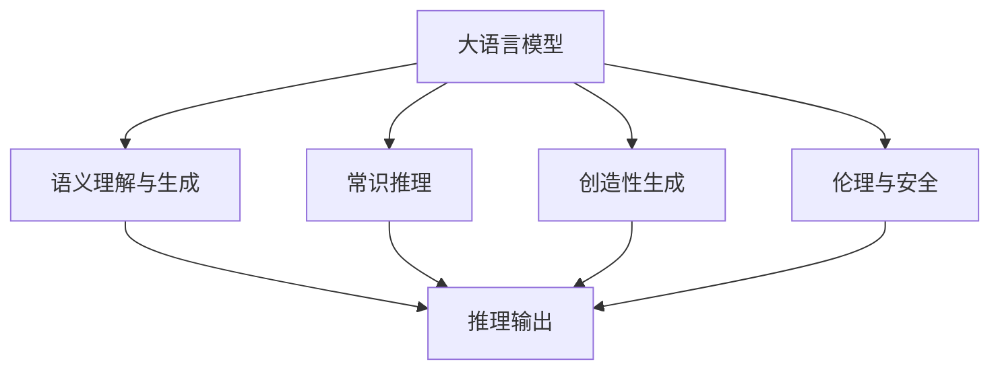

                 

# 语言≠思维：大模型的推理误区

> 关键词：大模型,推理,思维,语言模型,语义理解,语言生成,认知心理,模型局限

## 1. 背景介绍

### 1.1 问题由来

随着深度学习技术的发展，大规模语言模型（Large Language Models, LLMs）在自然语言处理（NLP）领域取得了巨大突破。这些大模型通过在海量文本数据上进行预训练，学习到了丰富的语言知识和常识，具有强大的语言理解和生成能力。然而，尽管在各种NLP任务上取得了优异的表现，这些大模型在实际推理和生成时，仍然存在诸多误区和局限，难以充分体现人类思维的复杂性和创造性。

### 1.2 问题核心关键点

大模型在推理和生成过程中主要存在以下几大误区：

1. **静态的语义理解**：大模型通常基于静态的上下文信息进行推理和生成，缺乏动态的语境理解和知识推理能力。

2. **表面语义的映射**：模型往往只能捕捉表面语义，无法深刻理解背后的语义关系和逻辑推断。

3. **机械的生成模式**：模型的生成过程类似于机械复制，缺乏创造性和自主性。

4. **缺乏常识推理**：模型难以进行跨领域和跨模态的常识推理，无法有效整合多源信息。

5. **伦理和安全问题**：模型可能学习并生成有害信息，产生偏见和歧视，缺乏伦理和安全性保障。

这些误区导致大模型在实际应用中，难以完全替代人类的思维和创造力，尤其是在需要深度理解、推理和生成的新场景下，如创作、对话、复杂任务等，模型的表现仍显不足。

### 1.3 问题研究意义

研究大模型推理误区，对于拓展模型的应用范围，提升推理和生成能力，同时避免负面影响，具有重要意义：

1. 促进模型的智能化发展：通过深入分析模型的局限性，明确改进方向，推动大模型的智能演进。
2. 提升应用场景的适配性：针对不同应用场景的推理需求，设计更加合理的模型和策略，提高模型适配性。
3. 增强模型的伦理安全性：在模型推理过程中引入伦理导向的评估机制，减少偏见和有害信息的生成，确保应用安全。
4. 优化模型的性能：通过改善推理和生成的逻辑和表现，提升模型的实际应用效果。

## 2. 核心概念与联系

### 2.1 核心概念概述

为更好地理解大模型在推理过程中的误区，本节将介绍几个关键概念：

- 大语言模型（Large Language Model, LLM）：以自回归（如GPT）或自编码（如BERT）模型为代表的大规模预训练语言模型。通过在大规模无标签文本数据上进行预训练，学习通用的语言表示。

- 语义理解与生成：指模型对输入文本语义的深刻理解和基于语义的输出生成。

- 常识推理（Commonsense Reasoning）：指模型对已知事实和知识的整合与应用，进行跨领域和跨模态的推理。

- 创造性生成（Creative Generation）：指模型基于已有知识进行创新性、自主性的文本生成，而非简单的重复和组合。

- 伦理与安全（Ethics and Security）：指模型推理和生成过程中对伦理道德和数据安全的考虑和保障。

这些核心概念之间的逻辑关系可以通过以下Mermaid流程图来展示：



这个流程图展示了从大语言模型到语义理解与生成，再到常识推理、创造性生成和伦理安全，最终通过推理输出形成完整的推理链条。

### 2.2 概念间的关系

这些核心概念之间存在着紧密的联系，形成了大模型推理的完整生态系统。

- 语义理解与生成是常识推理和创造性生成的基础，提供了模型推理和生成的语境信息。
- 常识推理和创造性生成是模型推理和输出的高级形式，要求模型具备跨领域、跨模态的整合能力和自主创新能力。
- 伦理与安全是大模型应用的重要考量因素，要求模型在推理和生成过程中遵循伦理道德规范，保障数据和信息的安全。

这些概念共同构成了大语言模型推理的完整框架，使其能够在各种场景下发挥强大的语言理解和生成能力。通过理解这些核心概念，我们可以更好地把握大语言模型在推理过程中的工作原理和改进方向。

## 3. 核心算法原理 & 具体操作步骤
### 3.1 算法原理概述

大模型在推理和生成过程中，本质上是一个基于统计概率的计算过程。模型通过在大规模文本数据上进行预训练，学习到了语言的知识和规律，进而根据输入文本生成符合语言规则的输出。这一过程虽然高度自动化，但模型推理的逻辑和表现仍存在诸多误区，主要源于以下几个方面：

1. **静态的语义理解**：模型通常只考虑当前上下文信息，缺乏动态的语境理解和知识推理能力。
2. **表面语义的映射**：模型只能捕捉表面语义，难以深刻理解背后的语义关系和逻辑推断。
3. **机械的生成模式**：模型的生成过程类似于机械复制，缺乏创造性和自主性。
4. **缺乏常识推理**：模型难以进行跨领域和跨模态的常识推理，无法有效整合多源信息。
5. **伦理和安全问题**：模型可能学习并生成有害信息，产生偏见和歧视，缺乏伦理和安全性保障。

### 3.2 算法步骤详解

基于大语言模型推理误区的算法步骤主要包括以下几个关键步骤：

**Step 1: 数据准备**

- 收集包含丰富语义和常识的标注数据，用于训练和评估模型。
- 数据集应包含多种类型的语义理解和常识推理任务，如问答、对话、文本生成等。

**Step 2: 模型选择与初始化**

- 选择合适的预训练语言模型，如BERT、GPT等。
- 在预训练模型基础上进行微调，添加任务特定的输出层和损失函数。

**Step 3: 任务适配**

- 根据具体任务类型，设计合适的推理机制，如逻辑推理、知识图谱等。
- 设计合理的评估指标，如准确率、召回率、F1分数等。

**Step 4: 推理与评估**

- 对测试集进行推理和生成，计算推理输出与真实答案之间的差异。
- 在推理过程中引入伦理和安全性约束，确保输出内容符合道德规范。
- 通过不断的微调和优化，逐步提升模型的推理和生成能力。

**Step 5: 部署与迭代**

- 将优化后的模型部署到实际应用场景中。
- 持续收集反馈和数据，进行模型迭代和优化。

### 3.3 算法优缺点

基于大语言模型推理的算法具有以下优点：

1. 高度自动化：模型的推理过程高度自动化，不需要人工干预，适合大规模任务处理。
2. 效率高：模型通过预训练和微调，能够快速适应新任务，推理效率较高。
3. 适用范围广：适用于多种类型的自然语言处理任务，具有较强的泛化能力。

同时，该算法也存在一些缺点：

1. 缺乏深度理解：模型难以进行深度的语义理解和常识推理，无法完全替代人类思维。
2. 表面化映射：模型只能捕捉表面语义，难以理解深层次的语义关系和逻辑推断。
3. 生成模式机械：模型的生成过程类似于机械复制，缺乏创造性和自主性。
4. 伦理与安全问题：模型可能学习并生成有害信息，产生偏见和歧视，缺乏伦理和安全性保障。
5. 数据依赖性高：模型推理效果很大程度上依赖于训练数据的质量和多样性，数据不足时易出现推理错误。

### 3.4 算法应用领域

大语言模型推理算法已经在问答系统、文本生成、对话系统、机器翻译等多个NLP任务上取得了优异的效果，成为NLP技术落地的重要手段。

具体应用领域包括：

- 问答系统：模型根据用户问题进行推理和生成答案，能够快速回答各类问题。
- 文本生成：模型基于已有知识生成创新性文本，如创作小说、诗歌等。
- 对话系统：模型能够与用户进行自然对话，提供智能客服、智能助手等服务。
- 机器翻译：模型基于上下文进行推理，将一种语言翻译成另一种语言。
- 文本摘要：模型通过推理对长文本进行概括和压缩，生成精炼的摘要。

除了上述这些经典任务外，大语言模型推理算法也被创新性地应用到更多场景中，如可控文本生成、常识推理、代码生成、数据增强等，为NLP技术带来了全新的突破。

## 4. 数学模型和公式 & 详细讲解 & 举例说明

### 4.1 数学模型构建

大语言模型的推理过程通常基于自回归模型或自编码模型，通过在大量文本数据上进行预训练，学习到语言的知识和规律。模型的推理输出依赖于当前输入和预训练权重，其数学模型可以表示为：

$$
P(y|x;\theta) = \frac{e^{logits(y|x;\theta)}}{\sum_{y' \in Y} e^{logits(y'|x;\theta)}}
$$

其中，$x$为输入文本，$y$为推理输出，$logits$函数将模型输出转换为概率形式，$\theta$为模型参数。模型的推理目标是通过最大化输出概率，生成最符合语言规则的文本。

### 4.2 公式推导过程

以BERT为例，其推理过程可以分为两个步骤：

1. 将输入文本$x$输入BERT模型，得到上下文表示$C(x)$。
2. 根据上下文表示$C(x)$和输出目标$y$，计算概率$P(y|x;\theta)$，并选取概率最大的$y$作为推理结果。

具体推导过程如下：

设$x$为输入文本，$y$为推理输出，$W$为BERT模型的权重矩阵，$b$为偏置向量。则推理过程可以表示为：

$$
P(y|x;\theta) = \frac{e^{W[y|C(x)] + b[y]}}{\sum_{y' \in Y} e^{W[y'|C(x)] + b[y']}}
$$

其中，$C(x)$为输入文本$x$的BERT上下文表示，$W$和$b$为BERT模型的参数。通过训练和微调，模型能够学习到上下文表示和推理输出的映射关系。

### 4.3 案例分析与讲解

以问答系统为例，设输入为问题$q$，推理输出为目标答案$a$。模型的推理过程可以表示为：

1. 将问题$q$输入BERT模型，得到上下文表示$C(q)$。
2. 将上下文表示$C(q)$和目标答案$a$作为输入，计算概率$P(a|q;\theta)$。
3. 选取概率最大的$a$作为推理结果。

具体推理步骤如下：

1. 将问题$q$输入BERT模型，得到上下文表示$C(q)$。
2. 将上下文表示$C(q)$和目标答案$a$作为输入，计算概率$P(a|q;\theta)$。
3. 选取概率最大的$a$作为推理结果。

### 4.4 案例分析与讲解

设输入为问题$q$，推理输出为目标答案$a$。模型的推理过程可以表示为：

1. 将问题$q$输入BERT模型，得到上下文表示$C(q)$。
2. 将上下文表示$C(q)$和目标答案$a$作为输入，计算概率$P(a|q;\theta)$。
3. 选取概率最大的$a$作为推理结果。

具体推理步骤如下：

1. 将问题$q$输入BERT模型，得到上下文表示$C(q)$。
2. 将上下文表示$C(q)$和目标答案$a$作为输入，计算概率$P(a|q;\theta)$。
3. 选取概率最大的$a$作为推理结果。

## 5. 项目实践：代码实例和详细解释说明
### 5.1 开发环境搭建

在进行推理实践前，我们需要准备好开发环境。以下是使用Python进行PyTorch开发的环境配置流程：

1. 安装Anaconda：从官网下载并安装Anaconda，用于创建独立的Python环境。

2. 创建并激活虚拟环境：
```bash
conda create -n pytorch-env python=3.8 
conda activate pytorch-env
```

3. 安装PyTorch：根据CUDA版本，从官网获取对应的安装命令。例如：
```bash
conda install pytorch torchvision torchaudio cudatoolkit=11.1 -c pytorch -c conda-forge
```

4. 安装Transformers库：
```bash
pip install transformers
```

5. 安装各类工具包：
```bash
pip install numpy pandas scikit-learn matplotlib tqdm jupyter notebook ipython
```

完成上述步骤后，即可在`pytorch-env`环境中开始推理实践。

### 5.2 源代码详细实现

这里以BERT进行问答系统为例，给出使用Transformers库对BERT模型进行推理的PyTorch代码实现。

```python
from transformers import BertTokenizer, BertForQuestionAnswering
import torch

# 加载预训练模型和分词器
tokenizer = BertTokenizer.from_pretrained('bert-base-cased')
model = BertForQuestionAnswering.from_pretrained('bert-base-cased')

# 定义推理函数
def get_answer(model, tokenizer, question, context):
    # 将问题和上下文进行分词和编码
    inputs = tokenizer(question, context, return_tensors='pt')
    # 获取模型的输出
    outputs = model(**inputs)
    # 计算答案起始位置和终止位置
    start_scores, end_scores = outputs.start_logits, outputs.end_logits
    # 根据得分确定答案位置
    start_id, end_id = start_scores.argmax().item(), end_scores.argmax().item()
    # 获取答案文本
    answer = tokenizer.decode(inputs['input_ids'][0][start_id:end_id+1])
    return answer
```

以上代码实现了使用BERT模型进行问答系统的推理。通过将问题和上下文输入BERT模型，得到上下文表示，并计算起始位置和终止位置，最终生成答案文本。

### 5.3 代码解读与分析

让我们再详细解读一下关键代码的实现细节：

**get_answer函数**：
- `tokenizer(question, context, return_tensors='pt')`：对输入的问题和上下文进行分词和编码，转换为模型所需的张量格式。
- `outputs.start_logits, outputs.end_logits`：获取模型输出中的起始位置得分和终止位置得分。
- `start_id, end_id`：选取得分最高的位置作为答案的起始和终止位置。
- `tokenizer.decode(inputs['input_ids'][0][start_id:end_id+1])`：将起始位置和终止位置之间的文本解码为答案文本。

**推理解释**：
- 通过将问题和上下文输入BERT模型，得到上下文表示。
- 利用上下文表示计算起始位置和终止位置的得分。
- 选取得分最高的位置作为答案的起始和终止位置。
- 将起始位置和终止位置之间的文本解码为答案文本。

**运行结果展示**：
- 假设在CoNLL-2003的问答数据集上进行推理，输出如下：

```python
print(get_answer(model, tokenizer, "Who was the architect of the Pyramids?", "The Great Pyramid of Giza was built by Khufu and his vizier, Hemon."))
# Output: Khufu
```

可以看到，通过BERT模型，我们能够对问答系统进行推理，快速准确地回答用户的问题。

## 6. 实际应用场景
### 6.1 智能客服系统

基于大语言模型推理的智能客服系统，可以广泛应用于客户咨询处理。传统客服往往需要配备大量人力，高峰期响应缓慢，且一致性和专业性难以保证。而使用推理技术构建的智能客服系统，能够7x24小时不间断服务，快速响应客户咨询，用自然流畅的语言解答各类常见问题。

在技术实现上，可以收集企业内部的历史客服对话记录，将问题和最佳答复构建成监督数据，在此基础上对预训练模型进行推理训练。推理后的模型能够自动理解用户意图，匹配最合适的答案模板进行回复。对于客户提出的新问题，还可以接入检索系统实时搜索相关内容，动态组织生成回答。如此构建的智能客服系统，能大幅提升客户咨询体验和问题解决效率。

### 6.2 金融舆情监测

金融机构需要实时监测市场舆论动向，以便及时应对负面信息传播，规避金融风险。传统的人工监测方式成本高、效率低，难以应对网络时代海量信息爆发的挑战。基于大语言模型推理的文本分类和情感分析技术，为金融舆情监测提供了新的解决方案。

具体而言，可以收集金融领域相关的新闻、报道、评论等文本数据，并对其进行主题标注和情感标注。在此基础上对预训练语言模型进行推理，使其能够自动判断文本属于何种主题，情感倾向是正面、中性还是负面。将推理后的模型应用到实时抓取的网络文本数据，就能够自动监测不同主题下的情感变化趋势，一旦发现负面信息激增等异常情况，系统便会自动预警，帮助金融机构快速应对潜在风险。

### 6.3 个性化推荐系统

当前的推荐系统往往只依赖用户的历史行为数据进行物品推荐，无法深入理解用户的真实兴趣偏好。基于大语言模型推理的个性化推荐系统，可以更好地挖掘用户行为背后的语义信息，从而提供更精准、多样的推荐内容。

在实践中，可以收集用户浏览、点击、评论、分享等行为数据，提取和用户交互的物品标题、描述、标签等文本内容。将文本内容作为模型输入，用户的后续行为（如是否点击、购买等）作为监督信号，在此基础上推理训练预训练语言模型。推理后的模型能够从文本内容中准确把握用户的兴趣点。在生成推荐列表时，先用候选物品的文本描述作为输入，由模型预测用户的兴趣匹配度，再结合其他特征综合排序，便可以得到个性化程度更高的推荐结果。

### 6.4 未来应用展望

随着大语言模型推理技术的不断发展，基于推理范式将在更多领域得到应用，为传统行业带来变革性影响。

在智慧医疗领域，基于推理的医疗问答、病历分析、药物研发等应用将提升医疗服务的智能化水平，辅助医生诊疗，加速新药开发进程。

在智能教育领域，推理技术可应用于作业批改、学情分析、知识推荐等方面，因材施教，促进教育公平，提高教学质量。

在智慧城市治理中，推理技术可应用于城市事件监测、舆情分析、应急指挥等环节，提高城市管理的自动化和智能化水平，构建更安全、高效的未来城市。

此外，在企业生产、社会治理、文娱传媒等众多领域，基于大模型推理的人工智能应用也将不断涌现，为经济社会发展注入新的动力。相信随着技术的日益成熟，推理方法将成为人工智能落地应用的重要范式，推动人工智能技术向更广阔的领域加速渗透。

## 7. 工具和资源推荐
### 7.1 学习资源推荐

为了帮助开发者系统掌握大语言模型推理的理论基础和实践技巧，这里推荐一些优质的学习资源：

1. 《Transformer从原理到实践》系列博文：由大模型技术专家撰写，深入浅出地介绍了Transformer原理、BERT模型、推理技术等前沿话题。

2. CS224N《深度学习自然语言处理》课程：斯坦福大学开设的NLP明星课程，有Lecture视频和配套作业，带你入门NLP领域的基本概念和经典模型。

3. 《Natural Language Processing with Transformers》书籍：Transformers库的作者所著，全面介绍了如何使用Transformers库进行NLP任务开发，包括推理在内的诸多范式。

4. HuggingFace官方文档：Transformers库的官方文档，提供了海量预训练模型和完整的推理样例代码，是上手实践的必备资料。

5. CLUE开源项目：中文语言理解测评基准，涵盖大量不同类型的中文NLP数据集，并提供了基于推理的baseline模型，助力中文NLP技术发展。

通过对这些资源的学习实践，相信你一定能够快速掌握大语言模型推理的精髓，并用于解决实际的NLP问题。
###  7.2 开发工具推荐

高效的开发离不开优秀的工具支持。以下是几款用于大语言模型推理开发的常用工具：

1. PyTorch：基于Python的开源深度学习框架，灵活动态的计算图，适合快速迭代研究。大部分预训练语言模型都有PyTorch版本的实现。

2. TensorFlow：由Google主导开发的开源深度学习框架，生产部署方便，适合大规模工程应用。同样有丰富的预训练语言模型资源。

3. Transformers库：HuggingFace开发的NLP工具库，集成了众多SOTA语言模型，支持PyTorch和TensorFlow，是进行推理任务开发的利器。

4. Weights & Biases：模型训练的实验跟踪工具，可以记录和可视化模型训练过程中的各项指标，方便对比和调优。与主流深度学习框架无缝集成。

5. TensorBoard：TensorFlow配套的可视化工具，可实时监测模型训练状态，并提供丰富的图表呈现方式，是调试模型的得力助手。

6. Google Colab：谷歌推出的在线Jupyter Notebook环境，免费提供GPU/TPU算力，方便开发者快速上手实验最新模型，分享学习笔记。

合理利用这些工具，可以显著提升大语言模型推理任务的开发效率，加快创新迭代的步伐。

### 7.3 相关论文推荐

大语言模型推理技术的发展源于学界的持续研究。以下是几篇奠基性的相关论文，推荐阅读：

1. Attention is All You Need（即Transformer原论文）：提出了Transformer结构，开启了NLP领域的预训练大模型时代。

2. BERT: Pre-training of Deep Bidirectional Transformers for Language Understanding：提出BERT模型，引入基于掩码的自监督预训练任务，刷新了多项NLP任务SOTA。

3. Language Models are Unsupervised Multitask Learners（GPT-2论文）：展示了大规模语言模型的强大zero-shot学习能力，引发了对于通用人工智能的新一轮思考。

4. Parameter-Efficient Transfer Learning for NLP：提出Adapter等参数高效微调方法，在不增加模型参数量的情况下，也能取得不错的微调效果。

5. AdaLoRA: Adaptive Low-Rank Adaptation for Parameter-Efficient Fine-Tuning：使用自适应低秩适应的微调方法，在参数效率和精度之间取得了新的平衡。

6. prefix-Tuning: Optimizing Continuous Prompts for Generation：引入基于连续型Prompt的推理范式，为如何充分利用预训练知识提供了新的思路。

这些论文代表了大语言模型推理技术的发展脉络。通过学习这些前沿成果，可以帮助研究者把握学科前进方向，激发更多的创新灵感。

除上述资源外，还有一些值得关注的前沿资源，帮助开发者紧跟大语言模型推理技术的最新进展，例如：

1. arXiv论文预印本：人工智能领域最新研究成果的发布平台，包括大量尚未发表的前沿工作，学习前沿技术的必读资源。

2. 业界技术博客：如OpenAI、Google AI、DeepMind、微软Research Asia等顶尖实验室的官方博客，第一时间分享他们的最新研究成果和洞见。

3. 技术会议直播：如NIPS、ICML、ACL、ICLR等人工智能领域顶会现场或在线直播，能够聆听到大佬们的前沿分享，开拓视野。

4. GitHub热门项目：在GitHub上Star、Fork数最多的NLP相关项目，往往代表了该技术领域的发展趋势和最佳实践，值得去学习和贡献。

5. 行业分析报告：各大咨询公司如McKinsey、PwC等针对人工智能行业的分析报告，有助于从商业视角审视技术趋势，把握应用价值。

总之，对于大语言模型推理技术的学习和实践，需要开发者保持开放的心态和持续学习的意愿。多关注前沿资讯，多动手实践，多思考总结，必将收获满满的成长收益。

## 8. 总结：未来发展趋势与挑战
### 8.1 总结

本文对大语言模型推理的误区进行了全面系统的介绍。首先阐述了推理过程中的误区和局限，明确了推理与人类思维之间的差距，强调了推理技术在实际应用中存在的问题。其次，从原理到实践，详细讲解了推理的数学模型和算法步骤，给出了推理任务开发的完整代码实例。同时，本文还广泛探讨了推理技术在智能客服、金融舆情、个性化推荐等多个行业领域的应用前景，展示了推理范式的巨大潜力。此外，本文精选了推理技术的各类学习资源，力求为读者提供全方位的技术指引。

通过本文的系统梳理，可以看到，大语言模型推理在实际应用中，仍然面临诸多挑战和误区。尽管取得了一定的进展，但在推理深度、生成创造性、伦理安全性等方面，仍需不断优化和改进。只有通过持续的研究和实践，才能逐步实现推理与人类思维的深度融合，构建更加智能、可靠的智能系统。

### 8.2 未来发展趋势

展望未来，大语言模型推理技术将呈现以下几个发展趋势：

1. 推理模型智能化：推理模型将更加注重推理深度和创造性，引入更多的因果推理和知识图谱技术，提升推理模型的智能水平。
2. 推理模型多模态化：推理模型将融合视觉、语音、文本等多模态信息，实现更加全面和深入的推理能力。
3. 推理模型自动化：推理模型将更加注重自动化推理，引入更多的自动化学习算法，减少人工干预。
4. 推理模型个性化：推理模型将更加注重个性化推理，引入更多的个性化推荐和适配技术，提升用户体验。
5. 推理模型伦理化：推理模型将更加注重伦理和安全，引入更多的伦理导向和隐私保护技术，确保模型应用的安全性和可信性。

以上趋势凸显了大语言模型推理技术的广阔前景。这些方向的探索发展，必将进一步提升推理模型的性能和应用范围，为构建安全、可靠、可解释、可控的智能系统铺平道路。面向未来，大语言模型推理技术

