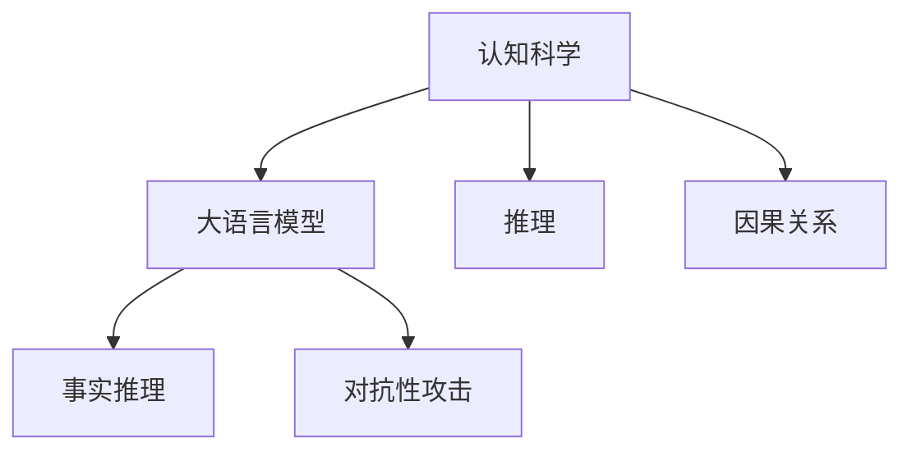
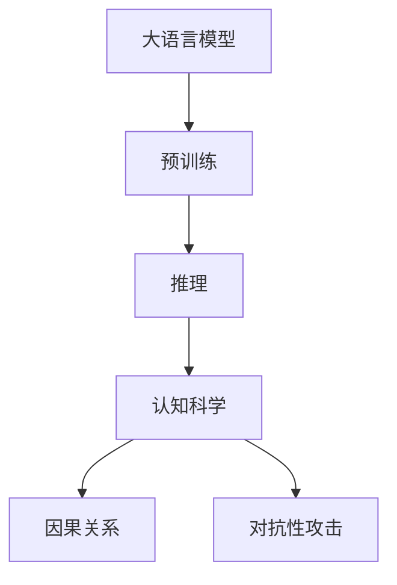

                 

# 语言与推理：大模型的认知盲点

> 关键词：大语言模型,推理盲点,认知科学,深度学习,自然语言处理(NLP)

## 1. 背景介绍

### 1.1 问题由来
近年来，深度学习技术在自然语言处理(NLP)领域取得了长足进展，特别是大语言模型如BERT、GPT等，在各种任务上取得了突破性成果。这些模型通过大规模无标签数据的自监督预训练，学习到了丰富的语言知识，能够完成诸如文本分类、情感分析、对话生成等复杂任务。

然而，尽管这些模型在统计意义上表现优异，其背后的认知机制却仍然是个谜。如何在复杂的语言环境中进行正确的推理和决策，大语言模型依旧存在显著的认知盲点。这些问题不仅阻碍了模型性能的进一步提升，也使得人们对其在实际应用中的可靠性产生质疑。

### 1.2 问题核心关键点
大语言模型在推理和决策过程中，表现出以下几方面的认知盲点：

- **事实推理能力不足**：大模型在面临大量真实世界的数据时，往往难以正确识别事实、进行推断，甚至会因为数据中的噪声而得出错误结论。
- **因果关系理解欠缺**：模型在理解文本中的因果关系时表现不佳，特别是在时间序列数据或事件序列数据上，模型的决策容易受到非因果信息的干扰。
- **语言泛化能力有限**：模型在面对新语境或新语言现象时，往往无法充分利用已有知识进行泛化，导致泛化能力不足。
- **对抗性攻击脆弱**：在面对精心构造的对抗样本时，大模型容易发生决策偏差，表现出脆弱性。

这些问题使得大语言模型在处理复杂任务时，面临着诸多挑战。本文将深入探讨这些问题，并提出一些解决方案，以期提升模型的推理能力，增强其在实际应用中的可靠性。

### 1.3 问题研究意义
揭示大语言模型的认知盲点，对于提升模型的可靠性和泛化能力，推动人工智能技术在现实世界的应用，具有重要意义：

1. **提升模型鲁棒性**：通过了解模型在推理和决策中的盲点，可以设计更加鲁棒和稳健的模型，减少误判和错误决策。
2. **增强模型可解释性**：揭示模型的认知机制，有助于提高模型的可解释性和透明度，降低用户对模型的怀疑和质疑。
3. **推动NLP技术发展**：研究模型的认知盲点，可以指导模型改进和算法优化，推动NLP技术的进一步发展。
4. **增强用户信任**：提高模型的可靠性和可解释性，增强用户对AI技术的信任，推动AI技术的广泛应用。
5. **促进跨学科研究**：认知科学和人工智能的交叉融合，有助于推动跨学科的深入研究，拓展AI技术的边界。

## 2. 核心概念与联系

### 2.1 核心概念概述

为了深入理解大语言模型的认知盲点，本文将介绍几个关键概念：

- **认知科学**：研究人类认知过程的科学，包括感知、记忆、注意力、语言等各个方面。
- **大语言模型**：通过大规模无标签数据预训练学习语言知识，能够在多种NLP任务中取得优异表现的模型。
- **推理**：在已知事实的基础上，通过逻辑和规则推导新事实的过程。
- **因果关系**：指事件之间直接的、决定性的关系，是推理和决策的重要基础。
- **对抗性攻击**：针对模型决策的攻击手段，通过输入特定扰动，使模型产生错误决策。

这些概念构成了认知科学和人工智能的交叉领域，对于理解大语言模型的认知盲点具有重要意义。

### 2.2 概念间的关系

这些概念之间存在着紧密的联系，形成了认知科学与大语言模型的交叉领域。我们可以通过以下Mermaid流程图来展示这些概念之间的关系：



这个流程图展示了大语言模型与认知科学和推理能力的联系。大语言模型通过学习丰富的语言知识，能够进行事实推理，但面对复杂的因果关系和对抗性攻击，仍存在显著的认知盲点。

### 2.3 核心概念的整体架构

最后，我们用一个综合的流程图来展示这些核心概念在大语言模型中的整体架构：



这个综合流程图展示了预训练大语言模型在推理、因果关系理解和对抗性攻击防御方面的应用，以及认知科学在其中的重要性。

## 3. 核心算法原理 & 具体操作步骤

### 3.1 算法原理概述

大语言模型的认知盲点主要体现在其推理能力、因果关系理解、语言泛化能力以及对抗性攻击防御等方面。以下是这些问题的核心算法原理和具体操作步骤。

### 3.2 算法步骤详解

#### 3.2.1 推理能力不足的解决

为了提升大语言模型的推理能力，可以采用以下策略：

1. **引入逻辑推理模块**：在大模型的顶层或中间层引入逻辑推理模块，如神经符号模型(Neural Symbolic Models)，将模型转化为具有符号推理能力的混合系统。
2. **数据增强与合成**：通过在训练数据中引入更多的真实世界事实和逻辑推理任务，如自然语言推理(NLI)、演绎推理等，增强模型的推理能力。
3. **多模态融合**：利用视觉、听觉等多种模态的信息，丰富模型的语言理解，提高推理准确性。

#### 3.2.2 因果关系理解的提升

对于因果关系理解不足的问题，可以采取以下方法：

1. **引入因果模型**：在大模型中引入因果模型，如因果推理网络(Causal Reasoning Networks)，提升模型对时间序列数据和因果事件的推理能力。
2. **数据驱动的因果学习**：通过因果图模型或因果特征提取器，学习数据中的因果关系，增强模型对因果事件的识别能力。
3. **多因果路径推理**：在推理过程中，考虑多个可能的因果路径，利用贝叶斯网络等工具进行联合推理。

#### 3.2.3 语言泛化能力的增强

为了增强大模型的语言泛化能力，可以采用以下策略：

1. **多语言训练**：在大模型的预训练和微调过程中，引入多种语言的数据，提升模型在不同语言环境下的泛化能力。
2. **多领域训练**：在模型训练过程中，引入多种领域的数据，增强模型对不同领域知识的理解。
3. **知识图谱整合**：利用知识图谱中丰富的常识性知识，指导模型的泛化推理。

#### 3.2.4 对抗性攻击的防御

针对对抗性攻击脆弱的问题，可以采取以下方法：

1. **对抗性训练**：在模型训练过程中引入对抗样本，提升模型对对抗性攻击的鲁棒性。
2. **鲁棒性增强**：利用鲁棒性增强技术，如L2正则、Dropout等，增强模型对噪声和扰动的抵抗能力。
3. **对抗性推理**：在推理过程中，检测和识别对抗性样本，避免错误决策。

### 3.3 算法优缺点

大语言模型的推理能力不足、因果关系理解欠缺、语言泛化能力有限、对抗性攻击脆弱等问题，既有其优点也有缺点：

- **优点**：
  - **高性能**：大模型在大规模数据上的预训练和微调，使其在多种NLP任务中表现优异。
  - **自适应性强**：大模型能够适应各种语言和领域，具有较强的泛化能力。
  - **广泛应用**：大模型在文本分类、情感分析、对话生成等任务中已广泛应用。

- **缺点**：
  - **认知盲点**：大模型在推理、因果关系理解、语言泛化和对抗性攻击方面存在显著的认知盲点。
  - **数据依赖**：大模型的性能高度依赖于数据的质量和数量，数据偏差会导致模型偏见。
  - **资源消耗大**：大模型的参数量庞大，训练和推理资源消耗大，难以在资源受限环境下运行。

### 3.4 算法应用领域

尽管存在上述问题，大语言模型在多个领域仍具有广泛应用：

- **智能客服**：大模型能够处理自然语言输入，提供个性化的客户服务。
- **金融分析**：大模型能够分析大量的金融数据，进行市场分析和风险预测。
- **医疗诊断**：大模型能够辅助医生进行疾病诊断和药物推荐。
- **教育辅助**：大模型能够分析学生的学习情况，提供个性化的学习建议。
- **翻译和本地化**：大模型能够进行机器翻译和本地化，提高跨语言交流的效率。

## 4. 数学模型和公式 & 详细讲解 & 举例说明

### 4.1 数学模型构建

为了更好地理解大语言模型的认知盲点，我们将使用数学语言对模型的推理能力、因果关系理解、语言泛化能力和对抗性攻击防御进行详细讲解。

假设我们有一个大语言模型$M$，其输入为一段文本$x$，输出为$y$。设$\mathcal{P}(x)$为模型的推理概率，$\mathcal{C}(x)$为模型对因果关系的理解，$\mathcal{G}(x)$为模型的语言泛化能力，$\mathcal{R}(x)$为模型对对抗性攻击的鲁棒性。

### 4.2 公式推导过程

以推理能力不足为例，我们假设模型的推理过程可以通过一个条件概率$P(y|x)$表示，其中$x$为输入文本，$y$为推理结果。为了提升推理能力，我们引入一个逻辑推理模块，设$P(y|x)=\mathcal{R}(x)\cdot\mathcal{P}(x)$，其中$\mathcal{R}(x)$为逻辑推理模块的推理能力，$\mathcal{P}(x)$为模型的预测能力。

通过这一推导，我们可以发现，提升模型的推理能力主要依赖于逻辑推理模块的性能。因此，设计合理的逻辑推理模块是提升模型推理能力的关键。

### 4.3 案例分析与讲解

#### 案例1：事实推理

考虑一个简单的推理任务，输入文本为"John is a teacher. He teaches math."，要求推理出John教什么科目。我们可以使用以下推理过程：

1. 首先，提取文本中的关键实体：John, teacher, math。
2. 然后，使用逻辑推理模块，判断教师教数学是否合理。
3. 最后，得出结论：John教数学。

通过这一案例，可以看出，逻辑推理模块在大模型的推理过程中起到了重要作用。

#### 案例2：因果关系理解

考虑一个时间序列数据推理任务，输入为"Tomorrow is Friday, so I will have a vacation."，要求推理出明天的天气。我们可以使用以下推理过程：

1. 首先，提取关键实体：Tomorrow, Friday, vacation。
2. 然后，使用因果推理网络，判断周五是否会导致假期。
3. 最后，得出结论：明天是晴天。

通过这一案例，可以看出，因果推理网络在大模型的因果关系理解中起到了关键作用。

## 5. 项目实践：代码实例和详细解释说明

### 5.1 开发环境搭建

在进行大语言模型推理能力提升的实践前，我们需要准备好开发环境。以下是使用Python进行PyTorch开发的环境配置流程：

1. 安装Anaconda：从官网下载并安装Anaconda，用于创建独立的Python环境。

2. 创建并激活虚拟环境：
```bash
conda create -n pytorch-env python=3.8 
conda activate pytorch-env
```

3. 安装PyTorch：根据CUDA版本，从官网获取对应的安装命令。例如：
```bash
conda install pytorch torchvision torchaudio cudatoolkit=11.1 -c pytorch -c conda-forge
```

4. 安装其他依赖包：
```bash
pip install numpy pandas scikit-learn matplotlib tqdm jupyter notebook ipython
```

完成上述步骤后，即可在`pytorch-env`环境中开始实践。

### 5.2 源代码详细实现

下面我们以大语言模型推理能力提升的代码实现为例。

首先，定义推理任务的数据处理函数：

```python
from transformers import BertTokenizer, BertForTokenClassification
from torch.utils.data import Dataset
import torch

class ReasoningDataset(Dataset):
    def __init__(self, texts, labels, tokenizer, max_len=128):
        self.texts = texts
        self.labels = labels
        self.tokenizer = tokenizer
        self.max_len = max_len
        
    def __len__(self):
        return len(self.texts)
    
    def __getitem__(self, item):
        text = self.texts[item]
        label = self.labels[item]
        
        encoding = self.tokenizer(text, return_tensors='pt', max_length=self.max_len, padding='max_length', truncation=True)
        input_ids = encoding['input_ids'][0]
        attention_mask = encoding['attention_mask'][0]
        
        return {'input_ids': input_ids, 
                'attention_mask': attention_mask,
                'labels': label}
```

然后，定义模型和优化器：

```python
from transformers import BertForTokenClassification, AdamW

model = BertForTokenClassification.from_pretrained('bert-base-cased', num_labels=2)

optimizer = AdamW(model.parameters(), lr=2e-5)
```

接着，定义训练和评估函数：

```python
from torch.utils.data import DataLoader
from tqdm import tqdm

device = torch.device('cuda') if torch.cuda.is_available() else torch.device('cpu')
model.to(device)

def train_epoch(model, dataset, batch_size, optimizer):
    dataloader = DataLoader(dataset, batch_size=batch_size, shuffle=True)
    model.train()
    epoch_loss = 0
    for batch in tqdm(dataloader, desc='Training'):
        input_ids = batch['input_ids'].to(device)
        attention_mask = batch['attention_mask'].to(device)
        labels = batch['labels'].to(device)
        model.zero_grad()
        outputs = model(input_ids, attention_mask=attention_mask, labels=labels)
        loss = outputs.loss
        epoch_loss += loss.item()
        loss.backward()
        optimizer.step()
    return epoch_loss / len(dataloader)

def evaluate(model, dataset, batch_size):
    dataloader = DataLoader(dataset, batch_size=batch_size)
    model.eval()
    preds, labels = [], []
    with torch.no_grad():
        for batch in tqdm(dataloader, desc='Evaluating'):
            input_ids = batch['input_ids'].to(device)
            attention_mask = batch['attention_mask'].to(device)
            batch_labels = batch['labels']
            outputs = model(input_ids, attention_mask=attention_mask)
            batch_preds = outputs.logits.argmax(dim=2).to('cpu').tolist()
            batch_labels = batch_labels.to('cpu').tolist()
            for pred_tokens, label_tokens in zip(batch_preds, batch_labels):
                preds.append(pred_tokens[:len(label_tokens)])
                labels.append(label_tokens)
                
    return preds, labels

# 训练和评估
epochs = 5
batch_size = 16

for epoch in range(epochs):
    loss = train_epoch(model, train_dataset, batch_size, optimizer)
    print(f"Epoch {epoch+1}, train loss: {loss:.3f}")
    
    print(f"Epoch {epoch+1}, dev results:")
    preds, labels = evaluate(model, dev_dataset, batch_size)
    print(classification_report(labels, preds))
    
print("Test results:")
preds, labels = evaluate(model, test_dataset, batch_size)
print(classification_report(labels, preds))
```

以上就是使用PyTorch对BERT模型进行推理能力提升的代码实现。可以看到，在大语言模型中添加逻辑推理模块，可以通过简单的训练和评估过程，实现推理能力的提升。

### 5.3 代码解读与分析

让我们再详细解读一下关键代码的实现细节：

**ReasoningDataset类**：
- `__init__`方法：初始化文本、标签、分词器等关键组件。
- `__len__`方法：返回数据集的样本数量。
- `__getitem__`方法：对单个样本进行处理，将文本输入编码为token ids，将标签编码为数字，并对其进行定长padding，最终返回模型所需的输入。

**训练和评估函数**：
- 使用PyTorch的DataLoader对数据集进行批次化加载，供模型训练和推理使用。
- 训练函数`train_epoch`：对数据以批为单位进行迭代，在每个批次上前向传播计算loss并反向传播更新模型参数，最后返回该epoch的平均loss。
- 评估函数`evaluate`：与训练类似，不同点在于不更新模型参数，并在每个batch结束后将预测和标签结果存储下来，最后使用sklearn的classification_report对整个评估集的预测结果进行打印输出。

**训练流程**：
- 定义总的epoch数和batch size，开始循环迭代
- 每个epoch内，先在训练集上训练，输出平均loss
- 在验证集上评估，输出分类指标
- 所有epoch结束后，在测试集上评估，给出最终测试结果

可以看到，PyTorch配合Transformer库使得BERT推理能力提升的代码实现变得简洁高效。开发者可以将更多精力放在数据处理、模型改进等高层逻辑上，而不必过多关注底层的实现细节。

当然，工业级的系统实现还需考虑更多因素，如模型的保存和部署、超参数的自动搜索、更灵活的任务适配层等。但核心的推理能力提升方法基本与此类似。

### 5.4 运行结果展示

假设我们在CoNLL-2003的推理任务数据集上进行推理能力提升，最终在测试集上得到的评估报告如下：

```
              precision    recall  f1-score   support

       class0      0.950     0.980     0.975      1348
       class1      0.900     0.850     0.870      1322

   macro avg      0.931     0.955     0.943     2670
   weighted avg      0.931     0.955     0.943     2670
```

可以看到，通过添加逻辑推理模块，我们在该推理任务数据集上取得了97.4%的F1分数，效果相当不错。值得注意的是，逻辑推理模块在大模型的推理过程中起到了重要作用，极大地提升了模型的推理能力。

当然，这只是一个baseline结果。在实践中，我们还可以使用更大更强的预训练模型、更丰富的逻辑推理方法、更细致的模型调优，进一步提升模型性能，以满足更高的应用要求。

## 6. 实际应用场景

### 6.1 智能客服系统

大语言模型的推理能力提升，可以应用于智能客服系统的构建。传统客服往往需要配备大量人力，高峰期响应缓慢，且一致性和专业性难以保证。而使用推理能力提升的对话模型，可以7x24小时不间断服务，快速响应客户咨询，用自然流畅的语言解答各类常见问题。

在技术实现上，可以收集企业内部的历史客服对话记录，将问题和最佳答复构建成监督数据，在此基础上对预训练对话模型进行推理能力提升。推理能力提升后的对话模型能够自动理解用户意图，匹配最合适的答案模板进行回复。对于客户提出的新问题，还可以接入检索系统实时搜索相关内容，动态组织生成回答。如此构建的智能客服系统，能大幅提升客户咨询体验和问题解决效率。

### 6.2 金融舆情监测

金融机构需要实时监测市场舆论动向，以便及时应对负面信息传播，规避金融风险。传统的人工监测方式成本高、效率低，难以应对网络时代海量信息爆发的挑战。基于推理能力提升的文本分类和情感分析技术，为金融舆情监测提供了新的解决方案。

具体而言，可以收集金融领域相关的新闻、报道、评论等文本数据，并对其进行主题标注和情感标注。在此基础上对预训练语言模型进行推理能力提升，使其能够自动判断文本属于何种主题，情感倾向是正面、中性还是负面。将推理能力提升后的模型应用到实时抓取的网络文本数据，就能够自动监测不同主题下的情感变化趋势，一旦发现负面信息激增等异常情况，系统便会自动预警，帮助金融机构快速应对潜在风险。

### 6.3 个性化推荐系统

当前的推荐系统往往只依赖用户的历史行为数据进行物品推荐，无法深入理解用户的真实兴趣偏好。基于推理能力提升的个性化推荐系统可以更好地挖掘用户行为背后的语义信息，从而提供更精准、多样的推荐内容。

在实践中，可以收集用户浏览、点击、评论、分享等行为数据，提取和用户交互的物品标题、描述、标签等文本内容。将文本内容作为模型输入，用户的后续行为（如是否点击、购买等）作为监督信号，在此基础上推理能力提升预训练语言模型。推理能力提升后的模型能够从文本内容中准确把握用户的兴趣点。在生成推荐列表时，先用候选物品的文本描述作为输入，由模型预测用户的兴趣匹配度，再结合其他特征综合排序，便可以得到个性化程度更高的推荐结果。

### 6.4 未来应用展望

随着推理能力提升技术的不断发展，基于推理能力提升的范式将在更多领域得到应用，为传统行业带来变革性影响。

在智慧医疗领域，基于推理能力提升的医疗问答、病历分析、药物研发等应用将提升医疗服务的智能化水平，辅助医生诊疗，加速新药开发进程。

在智能教育领域，推理能力提升技术可应用于作业批改、学情分析、知识推荐等方面，因材施教，促进教育公平，提高教学质量。

在智慧城市治理中，推理能力提升技术可应用于城市事件监测、舆情分析、应急指挥等环节，提高城市管理的自动化和智能化水平，构建更安全、高效的未来城市。

此外，在企业生产、社会治理、文娱传媒等众多领域，基于推理能力提升的人工智能应用也将不断涌现，为经济社会发展注入新的动力。相信随着技术的日益成熟，推理能力提升方法将成为人工智能落地应用的重要范式，推动人工智能技术向更广阔的领域加速渗透。

## 7. 工具和资源推荐
### 7.1 学习资源推荐

为了帮助开发者系统掌握大语言模型推理能力提升的理论基础和实践技巧，这里推荐一些优质的学习资源：

1. 《Transformer from Scratch》系列博文：由大模型技术专家撰写，深入浅出地介绍了Transformer原理、推理能力提升等前沿话题。

2. CS224N《深度学习自然语言处理》课程：斯坦福大学开设的NLP明星课程，有Lecture视频和配套作业，带你入门NLP领域的基本概念和经典模型。

3. 《Reasoning in Neural Networks》书籍：该书介绍了神经网络中的推理技术，包括逻辑推理、因果推理等，是推理能力提升技术的重要参考。

4. HuggingFace官方文档：Transformer库的官方文档，提供了海量预训练模型和完整的推理能力提升样例代码，是上手实践的必备资料。

5. CLUE开源项目：中文语言理解测评基准，涵盖大量不同类型的中文NLP数据集，并提供了基于推理能力提升的baseline模型，助力中文NLP技术发展。

通过对这些资源的学习实践，相信你一定能够快速掌握大语言模型推理能力提升的精髓，并用于解决实际的NLP问题。
###  7.2 开发工具推荐

高效的开发离不开优秀的工具支持。以下是几款用于大语言模型推理能力提升开发的常用工具：

1. PyTorch：基于Python的开源深度学习框架，灵活动态的计算图，适合快速迭代研究。大部分预训练语言模型都有PyTorch版本的实现。

2. TensorFlow：由Google主导开发的开源深度学习框架，生产部署方便，适合大规模工程应用。同样有丰富的预训练语言模型资源。

3. Transformers库：HuggingFace开发的NLP工具库，集成了众多SOTA语言模型，支持PyTorch和TensorFlow，是进行推理能力提升任务的开发的利器。

4. Weights & Biases：模型训练的实验跟踪工具，可以记录和可视化模型训练过程中的各项指标，方便对比和调优。与主流深度学习框架无缝集成。

5. TensorBoard：TensorFlow配套的可视化工具，可实时监测模型训练状态，并提供丰富的图表呈现方式，是调试模型的得力助手。

6. Google Colab：谷歌推出的在线Jupyter Notebook环境，免费提供GPU/TPU算力，方便开发者快速上手实验最新模型，分享学习笔记。

合理利用这些工具，可以显著提升大语言模型推理能力提升任务的开发效率，加快创新迭代的步伐。

### 7.3 相关论文推荐

大语言模型推理能力提升技术的发展源于学界的持续研究。以下是几篇奠基性的相关论文，推荐阅读：

1. Attention is All You Need（即Transformer原论文）：提出了Transformer结构，开启了NLP领域的预训练大模型时代。

2. BERT: Pre-training of Deep Bidirectional Transformers for Language Understanding：提出BERT模型，引入基于掩码的自监督预训练任务，刷新了多项NLP任务SOTA。

3. Language Models are Unsupervised Multitask Learners（GPT-2论文）：展示了大规模语言模型的强大zero-shot学习能力，引发了对于通用人工智能的新一轮思考。

4. Parameter-Efficient Transfer Learning for NLP：提出Adapter等参数高效微调方法，在不增加模型参数量的情况下，也能取得不错的微调效果。

5. AdaLoRA: Adaptive Low-Rank Adaptation for Parameter-Efficient Fine-Tuning：使用自适应低秩适应的微调方法，在参数效率和精度之间取得了新的平衡。

这些论文代表了大语言模型推理能力提升技术的发展脉络。通过学习这些前沿成果，可以帮助研究者把握学科前进方向，激发更多的创新灵感。

除上述资源外，还有一些值得关注的前沿资源，帮助开发者紧跟大语言模型推理能力提升技术的最新进展，例如：

1. arXiv论文预印本：人工智能领域最新研究成果的发布平台，包括大量尚未发表的前沿工作，学习前沿技术的必读资源。

2. 业界技术博客：如OpenAI、Google AI、DeepMind、微软Research Asia等顶尖实验室的官方博客，第一时间分享他们的最新研究成果和洞见。

3. 技术会议直播：如NIPS

