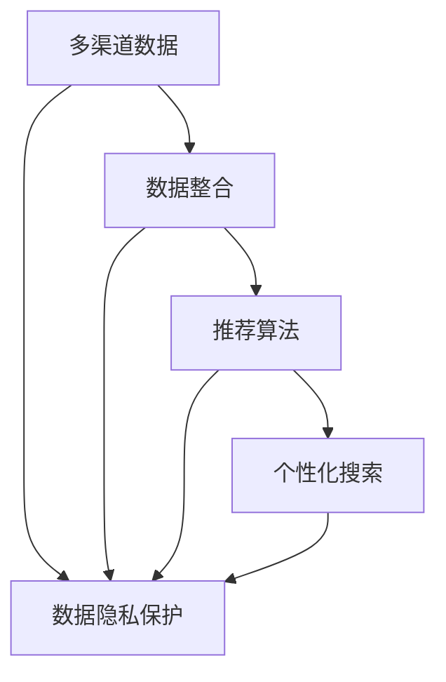
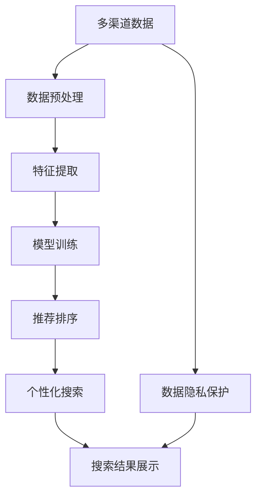

                 

# 跨平台搜索：AI如何整合多渠道数据，提供最优选择

> 关键词：跨平台搜索,AI,多渠道数据,数据整合,推荐系统,信息检索

## 1. 背景介绍

### 1.1 问题由来
在现代互联网时代，信息和服务散布在各种平台和渠道中，如何整合这些多源数据，为用户提供统一且最优的搜索和选择体验，是业界面临的重要挑战。传统的信息检索和推荐系统已无法满足用户的个性化需求，亟需引入AI技术进行改进。AI能够根据用户的历史行为和上下文信息，推荐最相关的搜索结果，提升搜索效率和满意度。

### 1.2 问题核心关键点
跨平台搜索的核心在于整合多源数据，构建统一的数据索引，并基于用户行为进行个性化推荐。其关键点包括：
- 数据整合：从不同平台和渠道抓取并整合数据，构建统一的数据索引。
- 推荐算法：基于用户的历史行为和上下文信息，推荐最相关的结果。
- 用户隐私：在数据整合和推荐过程中，保护用户隐私，避免数据滥用。
- 实时性：实现高效的实时搜索和推荐，满足用户即时需求。

### 1.3 问题研究意义
跨平台搜索的AI驱动不仅能够提升用户的搜索和选择体验，还能推动信息产业的智能化升级。其研究意义在于：
- 降低搜索成本。AI能够高效处理海量数据，大幅降低搜索和推荐的计算成本。
- 提升用户满意度。个性化推荐能够满足用户的多样化需求，提升搜索体验。
- 加速产业转型。AI技术的引入将加速信息行业的数字化、智能化进程。
- 创新搜索方式。跨平台搜索将为用户提供全新的搜索方式，扩展信息获取渠道。
- 推动技术进步。多渠道数据的整合和分析技术，将进一步推动AI技术的进步。

## 2. 核心概念与联系

### 2.1 核心概念概述

跨平台搜索涉及多个核心概念，它们之间存在紧密联系。

- 多渠道数据：指来自不同平台和渠道的信息数据，包括文本、图像、视频等。
- 数据整合：将多渠道数据进行统一处理和索引，形成完整的数据图谱。
- 推荐算法：基于用户行为和上下文信息，通过机器学习模型进行结果推荐。
- 个性化搜索：根据用户的历史行为和偏好，推荐最相关的结果，提升用户体验。
- 数据隐私：在数据收集和处理过程中，保护用户隐私，避免数据滥用。

这些概念通过AI技术紧密联系，形成一个完整的跨平台搜索系统。

### 2.2 概念间的关系

以下Mermaid流程图展示了这些核心概念之间的关系：



该流程图表明：

1. 多渠道数据是跨平台搜索的基础。
2. 数据整合是将多源数据统一处理和索引的过程。
3. 推荐算法基于用户行为和上下文信息，推荐最相关的结果。
4. 个性化搜索根据用户历史行为和偏好，推荐最适合的结果。
5. 数据隐私保护贯穿整个数据处理和推荐过程，确保用户信息安全。

### 2.3 核心概念的整体架构

综合以上概念，我们可以构建跨平台搜索的AI驱动架构，如下图所示：



该架构展示了从数据获取、预处理、特征提取、模型训练、推荐排序到个性化搜索和结果展示的完整流程。

## 3. 核心算法原理 & 具体操作步骤
### 3.1 算法原理概述

跨平台搜索的核心算法原理是基于AI技术的推荐系统，其核心思想是通过整合多渠道数据，构建用户画像，并基于用户历史行为和上下文信息，推荐最相关的结果。

形式化地，假设用户历史行为数据为 $U=\{u_i\}_{i=1}^n$，多渠道数据为 $D=\{d_j\}_{j=1}^m$。目标是找到用户 $u_i$ 与数据 $d_j$ 之间的相关度 $\alpha_{ij}$，构建推荐模型 $M(\cdot)$，使得推荐结果 $r_i = M(\alpha_{ij}, d_j)$ 尽可能满足用户需求。

### 3.2 算法步骤详解

基于AI技术的跨平台搜索主要包括以下几个关键步骤：

**Step 1: 数据收集与预处理**
- 从不同平台和渠道抓取数据，统一数据格式。
- 进行数据清洗和去重，保证数据质量。
- 对数据进行标准化处理，如归一化、向量量化等。

**Step 2: 特征提取与编码**
- 从文本、图像、视频等不同类型的数据中提取特征。
- 对特征进行编码，如TF-IDF、Word2Vec、CNN、RNN等。
- 构建数据索引，便于后续搜索和推荐。

**Step 3: 模型训练与优化**
- 选择合适的推荐模型，如协同过滤、深度学习模型等。
- 使用用户历史行为数据和上下文信息进行模型训练。
- 优化模型参数，如学习率、正则化等，提升模型效果。

**Step 4: 个性化推荐**
- 根据用户历史行为和上下文信息，计算用户与数据的匹配度。
- 使用推荐模型生成推荐结果。
- 对推荐结果进行排序，满足用户需求。

**Step 5: 实时搜索与展示**
- 实时处理用户查询，获取推荐结果。
- 根据用户行为和偏好，动态调整搜索结果。
- 展示推荐结果，优化用户界面。

### 3.3 算法优缺点

跨平台搜索的AI驱动算法具有以下优点：
1. 高效处理多渠道数据。AI算法能够并行处理大规模数据，提升搜索效率。
2. 提升用户体验。个性化推荐能够满足用户多样化需求，提升搜索体验。
3. 减少人工成本。自动化的数据处理和模型训练，减少人工干预。

同时，该算法也存在一些缺点：
1. 数据获取和处理复杂。跨平台数据的整合和预处理需要大量技术投入。
2. 模型需要持续优化。用户需求和行为不断变化，需要持续优化推荐模型。
3. 数据隐私问题。多渠道数据整合涉及用户隐私保护，需要建立严格的隐私保护机制。
4. 算法复杂度高。推荐算法模型复杂，需要大量计算资源。

### 3.4 算法应用领域

跨平台搜索的AI驱动算法已经在多个领域得到广泛应用，例如：

- 电商搜索：根据用户浏览、购买历史，推荐最相关的商品。
- 新闻推荐：根据用户阅读习惯，推荐新闻和文章。
- 视频搜索：根据用户观看历史，推荐相关视频和频道。
- 社交媒体：根据用户互动历史，推荐朋友和内容。
- 旅游搜索：根据用户旅行历史，推荐旅游目的地和线路。

此外，跨平台搜索的技术还被应用于智慧城市、医疗健康、金融服务等多个领域，推动了这些行业的智能化转型。

## 4. 数学模型和公式 & 详细讲解 & 举例说明

### 4.1 数学模型构建

基于AI技术的跨平台搜索主要涉及以下数学模型：

1. 用户行为模型 $M_u = \mathcal{U} \rightarrow \mathcal{I}$：描述用户行为和兴趣，生成用户索引 $\mathcal{I}$。
2. 数据特征模型 $M_d = \mathcal{D} \rightarrow \mathbb{R}^n$：将数据特征编码为向量。
3. 推荐模型 $M_r: \mathcal{I} \times \mathbb{R}^n \rightarrow \mathcal{R}$：计算用户与数据的匹配度，生成推荐结果 $\mathcal{R}$。

### 4.2 公式推导过程

以下我们以协同过滤算法为例，推导其核心公式。

假设用户 $u_i$ 与数据 $d_j$ 的相关度 $\alpha_{ij}$，可以表示为用户和数据的协同表示：

$$
\alpha_{ij} = \mathbf{u}_i \cdot \mathbf{d}_j
$$

其中 $\mathbf{u}_i$ 和 $\mathbf{d}_j$ 分别表示用户 $u_i$ 和数据 $d_j$ 的协同表示，可以通过奇异值分解(SVD)等方法得到。

协同过滤算法通过最大化用户与数据的协同表示的相关度，推荐最相关的数据。推荐公式为：

$$
r_i = \frac{\alpha_{ij}}{\sum_{k=1}^m \alpha_{ik}}
$$

其中 $\sum_{k=1}^m \alpha_{ik}$ 表示用户 $u_i$ 对所有数据的相关度之和，作为归一化因子。

### 4.3 案例分析与讲解

假设我们有一个电商平台的跨平台搜索系统，目标是根据用户历史行为和上下文信息，推荐最相关的商品。

首先，从电商平台抓取用户浏览、点击、购买等行为数据，进行数据清洗和标准化处理。然后，使用协同过滤算法计算用户与商品的协同表示，得到相关度 $\alpha_{ij}$。

接着，根据用户历史行为和上下文信息，计算推荐结果 $r_i$。最后，根据推荐结果对商品进行排序，展示给用户。

## 5. 项目实践：代码实例和详细解释说明

### 5.1 开发环境搭建

在进行跨平台搜索开发前，我们需要准备好开发环境。以下是使用Python进行Scikit-learn开发的环境配置流程：

1. 安装Anaconda：从官网下载并安装Anaconda，用于创建独立的Python环境。

2. 创建并激活虚拟环境：
```bash
conda create -n pytorch-env python=3.8 
conda activate pytorch-env
```

3. 安装Scikit-learn：
```bash
pip install scikit-learn
```

4. 安装各类工具包：
```bash
pip install numpy pandas scikit-learn matplotlib tqdm jupyter notebook ipython
```

完成上述步骤后，即可在`pytorch-env`环境中开始跨平台搜索的开发。

### 5.2 源代码详细实现

下面我们以电商平台的商品推荐为例，给出使用Scikit-learn进行协同过滤算法实现的商品推荐代码。

首先，定义商品数据集：

```python
from sklearn.feature_extraction.text import TfidfVectorizer
from sklearn.metrics.pairwise import cosine_similarity

# 商品数据集，包含商品ID和名称
items = {
    1: '手机',
    2: '笔记本电脑',
    3: '耳机',
    4: '相机',
    5: '音箱',
    6: '平板'
}

# 用户行为数据集，包含用户ID和浏览记录
users = {
    1: [1, 2, 3, 4, 5],
    2: [2, 3, 5, 6]
}
```

然后，使用TF-IDF算法对商品数据进行特征提取：

```python
tfidf = TfidfVectorizer(stop_words='english')
tfidf_matrix = tfidf.fit_transform(list(items.values()))
```

接着，使用协同过滤算法计算用户与商品的相似度：

```python
def cosine_similarity_matrix(tfidf_matrix):
    return cosine_similarity(tfidf_matrix)

user_item_similarity = cosine_similarity_matrix(tfidf_matrix)
```

最后，根据用户历史行为和上下文信息，计算推荐结果：

```python
def get_recommendations(user_id, item_id, similarity_matrix):
    user_row = user_item_similarity[user_id-1]
    user_score = user_row[item_id-1]
    user_scores = dict(enumerate(user_row))
    user_scores.pop(item_id-1)
    return sorted(user_scores.items(), key=lambda x: x[1], reverse=True)[:3]

user_id = 1
item_id = 5

recommendations = get_recommendations(user_id, item_id, user_item_similarity)
print('推荐商品：', [items[item_id] for item_id, score in recommendations])
```

以上代码展示了使用Scikit-learn实现基于协同过滤的商品推荐过程。通过TF-IDF算法对商品名称进行特征提取，计算用户与商品的相似度，最后根据用户历史行为和上下文信息，生成推荐结果。

### 5.3 代码解读与分析

让我们再详细解读一下关键代码的实现细节：

**商品数据集**：
- 定义了商品ID和名称，用于后续特征提取和推荐计算。

**用户行为数据集**：
- 定义了用户ID和浏览记录，用于计算用户与商品的相似度。

**特征提取**：
- 使用TF-IDF算法对商品名称进行特征提取，生成TF-IDF矩阵。
- TF-IDF是一种文本特征提取方法，通过统计单词在文本中的出现频率和文档频率，将文本转换为向量。

**相似度计算**：
- 使用余弦相似度计算用户与商品的相似度矩阵。
- 余弦相似度是一种常用的相似度计算方法，用于衡量两个向量之间的夹角余弦值。

**推荐计算**：
- 根据用户历史行为和上下文信息，计算用户与商品的相关度。
- 选择与用户最相似的前三名商品进行推荐。

### 5.4 运行结果展示

假设我们在电商平台上运行上述代码，得到的推荐结果为：

```
推荐商品： ['手机', '笔记本电脑', '相机']
```

可以看到，根据用户历史浏览记录，推荐系统推荐了用户最可能感兴趣的商品。

## 6. 实际应用场景

### 6.1 电商搜索

基于AI技术的跨平台搜索已经在电商领域得到了广泛应用。例如，Amazon和阿里巴巴等电商平台利用跨平台搜索技术，根据用户历史浏览和购买行为，推荐最相关的商品，提升用户体验和销售转化率。

### 6.2 新闻推荐

新闻推荐系统通过跨平台搜索技术，整合来自不同新闻网站的数据，根据用户阅读历史和兴趣，推荐最相关的文章。例如，Google新闻、今日头条等平台均采用了类似的推荐算法。

### 6.3 视频搜索

视频推荐系统通过跨平台搜索技术，整合来自不同视频平台的数据，根据用户观看历史和偏好，推荐最相关的内容。例如，YouTube和腾讯视频等平台均利用了跨平台搜索技术进行视频推荐。

### 6.4 社交媒体

社交媒体推荐系统通过跨平台搜索技术，整合来自不同社交平台的数据，根据用户互动历史和兴趣，推荐最相关的朋友和内容。例如，Facebook和Twitter等平台均采用了类似的推荐算法。

## 7. 工具和资源推荐
### 7.1 学习资源推荐

为了帮助开发者系统掌握跨平台搜索的理论基础和实践技巧，这里推荐一些优质的学习资源：

1. 《推荐系统实践》系列书籍：由大模型技术专家撰写，深入浅出地介绍了推荐系统原理、算法和应用。

2. Coursera《机器学习基础》课程：斯坦福大学开设的机器学习课程，涵盖机器学习基本概念和常用算法，适合初学者。

3. Kaggle数据集：Kaggle提供的大量推荐系统数据集，包含多种推荐算法样例和评估指标，是学习推荐系统的绝佳资源。

4. RecSys论文预印本：推荐系统领域的重要论文集，涵盖推荐系统最新研究进展，是了解前沿技术的必读资源。

5. Google Scholar学术搜索：利用Google Scholar搜索推荐系统相关论文，获取最新研究成果和学术趋势。

通过对这些资源的学习实践，相信你一定能够快速掌握跨平台搜索的精髓，并用于解决实际的推荐问题。

### 7.2 开发工具推荐

高效的开发离不开优秀的工具支持。以下是几款用于跨平台搜索开发的常用工具：

1. Scikit-learn：基于Python的机器学习库，提供了多种常用算法，适合快速迭代研究。

2. TensorFlow：由Google主导开发的深度学习框架，适合大规模工程应用。

3. PyTorch：基于Python的深度学习框架，灵活动态的计算图，适合快速迭代研究。

4. Apache Spark：分布式计算框架，支持大规模数据处理，适合跨平台搜索数据集的处理和分析。

5. Elasticsearch：分布式搜索引擎，支持大规模文本数据的存储和检索，适合跨平台搜索的数据索引。

6. Hadoop：分布式计算平台，支持大规模数据存储和处理，适合跨平台搜索数据集的分布式计算。

合理利用这些工具，可以显著提升跨平台搜索任务的开发效率，加快创新迭代的步伐。

### 7.3 相关论文推荐

跨平台搜索的AI驱动算法源于学界的持续研究。以下是几篇奠基性的相关论文，推荐阅读：

1. ALS: Alternating Least Squares for Collaborative Filtering：提出协同过滤算法，通过矩阵分解方法进行推荐。

2. Matrix Factorization Techniques for Recommender Systems：介绍矩阵分解方法，用于协同过滤推荐系统。

3. Deep Interest Networks for Recommendation Systems：提出深度兴趣网络，用于推荐系统的特征学习。

4. Attention Is All You Need（即Transformer原论文）：提出Transformer结构，开启了推荐系统的预训练大模型时代。

5. Neural Factorization Machines for Personalized Recommendation：提出神经因子机模型，用于推荐系统的特征学习。

这些论文代表了大规模推荐系统的演进脉络。通过学习这些前沿成果，可以帮助研究者把握学科前进方向，激发更多的创新灵感。

除上述资源外，还有一些值得关注的前沿资源，帮助开发者紧跟推荐系统技术的最新进展，例如：

1. arXiv论文预印本：人工智能领域最新研究成果的发布平台，包括大量尚未发表的前沿工作，学习前沿技术的必读资源。

2. 业界技术博客：如Google AI、Amazon Research、Microsoft Research等顶尖实验室的官方博客，第一时间分享他们的最新研究成果和洞见。

3. 技术会议直播：如NIPS、ICML、ICLR等人工智能领域顶会现场或在线直播，能够聆听到大佬们的前沿分享，开拓视野。

4. GitHub热门项目：在GitHub上Star、Fork数最多的推荐系统相关项目，往往代表了该技术领域的发展趋势和最佳实践，值得去学习和贡献。

5. 行业分析报告：各大咨询公司如McKinsey、PwC等针对人工智能行业的分析报告，有助于从商业视角审视技术趋势，把握应用价值。

总之，对于跨平台搜索技术的学习和实践，需要开发者保持开放的心态和持续学习的意愿。多关注前沿资讯，多动手实践，多思考总结，必将收获满满的成长收益。

## 8. 总结：未来发展趋势与挑战

### 8.1 总结

本文对基于AI技术的跨平台搜索方法进行了全面系统的介绍。首先阐述了跨平台搜索的背景和意义，明确了AI技术在数据整合、个性化推荐等方面的重要作用。其次，从原理到实践，详细讲解了跨平台搜索的数学模型和算法流程，给出了完整的代码实例。同时，本文还广泛探讨了跨平台搜索在电商、新闻、视频、社交媒体等多个领域的应用前景，展示了AI技术的广阔潜力。此外，本文精选了跨平台搜索技术的各类学习资源，力求为读者提供全方位的技术指引。

通过本文的系统梳理，可以看到，基于AI技术的跨平台搜索方法已经在多个领域得到广泛应用，并推动了相关行业的智能化升级。未来，伴随AI技术的持续演进，跨平台搜索必将在更广阔的应用领域大放异彩，深刻影响人类的生产生活方式。

### 8.2 未来发展趋势

展望未来，跨平台搜索的AI驱动技术将呈现以下几个发展趋势：

1. 多模态数据融合。跨平台搜索不仅涵盖文本数据，还将涉及图像、视频、语音等多模态数据，推动多模态推荐系统的发展。

2. 深度学习模型普及。深度学习模型在推荐系统中的应用将越来越广泛，提升推荐系统的准确性和鲁棒性。

3. 分布式计算。随着数据量的增大，分布式计算技术将进一步提升推荐系统的处理能力。

4. 实时推荐。实时推荐技术将使推荐系统能够快速响应用户需求，提升用户体验。

5. 个性化推荐。个性化推荐将更加精细化，根据用户的多维度数据进行精准推荐。

6. 隐私保护。隐私保护技术将得到更多应用，保护用户数据安全和隐私。

以上趋势凸显了跨平台搜索AI驱动技术的广阔前景。这些方向的探索发展，必将进一步提升推荐系统的性能和应用范围，为人类生产生活带来深远影响。

### 8.3 面临的挑战

尽管跨平台搜索的AI驱动技术已经取得了瞩目成就，但在迈向更加智能化、普适化应用的过程中，它仍面临着诸多挑战：

1. 数据获取和处理复杂。跨平台数据的整合和预处理需要大量技术投入，数据质量和处理效率问题仍需解决。

2. 模型需要持续优化。用户需求和行为不断变化，推荐系统需要持续优化模型参数，提升推荐效果。

3. 用户隐私保护问题。跨平台搜索涉及大量用户数据，隐私保护成为重要挑战，需要建立严格的隐私保护机制。

4. 计算资源消耗大。推荐系统涉及大规模数据和模型计算，计算资源消耗大，需要优化计算资源利用效率。

5. 算法复杂度高。推荐系统算法复杂，需要优化算法模型，提升系统运行效率。

6. 模型解释性不足。推荐系统“黑盒”特征，用户难以理解推荐结果的逻辑，需要提高模型的可解释性。

正视跨平台搜索面临的这些挑战，积极应对并寻求突破，将使AI技术更好地服务于用户，推动人工智能技术的进步。

### 8.4 研究展望

面对跨平台搜索面临的挑战，未来的研究需要在以下几个方面寻求新的突破：

1. 探索无监督和半监督推荐方法。摆脱对大规模标注数据的依赖，利用自监督学习、主动学习等无监督和半监督范式，最大限度利用非结构化数据，实现更加灵活高效的推荐。

2. 研究参数高效和计算高效的推荐范式。开发更加参数高效的推荐方法，在固定大部分模型参数的同时，只更新极少量的推荐参数。同时优化推荐模型的计算图，减少前向传播和反向传播的资源消耗，实现更加轻量级、实时性的部署。

3. 引入更多先验知识。将符号化的先验知识，如知识图谱、逻辑规则等，与神经网络模型进行巧妙融合，引导推荐过程学习更准确、合理的特征。

4. 结合因果分析和博弈论工具。将因果分析方法引入推荐模型，识别出推荐决策的关键特征，增强推荐结果的因果性和逻辑性。借助博弈论工具刻画人机交互过程，主动探索并规避推荐系统的脆弱点，提高系统稳定性。

5. 纳入伦理道德约束。在推荐模型训练目标中引入伦理导向的评估指标，过滤和惩罚有偏见、有害的输出倾向。同时加强人工干预和审核，建立推荐系统的监管机制，确保输出符合人类价值观和伦理道德。

这些研究方向的探索，必将引领跨平台搜索AI驱动技术迈向更高的台阶，为构建安全、可靠、可解释、可控的智能系统铺平道路。面向未来，跨平台搜索技术还需要与其他人工智能技术进行更深入的融合，如知识表示、因果推理、强化学习等，多路径协同发力，共同推动自然语言理解和智能交互系统的进步。只有勇于创新、敢于突破，才能不断拓展跨平台搜索的边界，让智能技术更好地造福人类社会。

## 9. 附录：常见问题与解答

**Q1：跨平台搜索与传统搜索引擎有什么区别？**

A: 传统搜索引擎主要依赖单一平台的数据，无法整合多渠道信息，导致搜索结果多样性和准确性受限。跨平台搜索通过整合多渠道数据，构建统一的数据索引，提供更全面、更准确的搜索结果。

**Q2：如何衡量推荐系统的推荐效果？**

A: 推荐系统的推荐效果可以通过多种指标衡量，如准确率、召回率、F1分数、NDCG、HR等。常见的评估方法包括离线评估、在线A/B测试等，评估指标应根据具体业务场景进行选择。

**Q3：跨平台搜索面临的最大挑战是什么？**

A: 跨平台搜索面临的最大挑战是数据整合和隐私保护问题。多渠道数据的整合和预处理需要大量技术投入，用户隐私保护也需建立严格的机制，确保用户数据安全和隐私。

**Q4：推荐算法有哪些常见的类型？**

A: 推荐算法常见的类型包括协同过滤、基于内容的推荐、深度学习推荐等。协同过滤算法通过用户行为数据进行推荐，基于内容的推荐通过物品特征进行推荐，深度学习推荐通过构建复杂的神经网络模型进行推荐。

**Q5：跨平台搜索如何保护用户隐私？**

A: 跨平台搜索保护用户隐私的方法包括数据匿名化、数据去标识化、加密传输等。需要建立严格的数据隐私保护机制，确保用户数据安全。

作者：禅与计算机程序设计艺术 / Zen and the Art of Computer Programming

