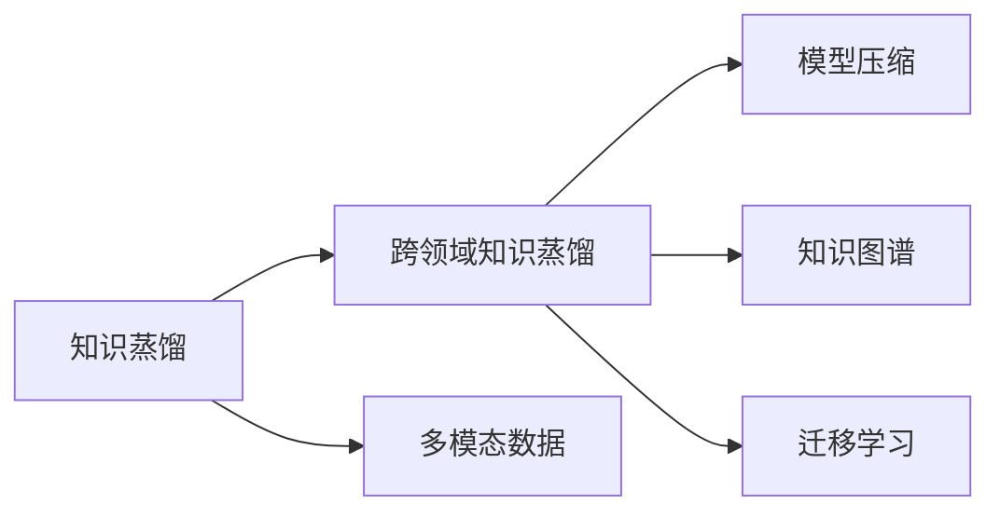
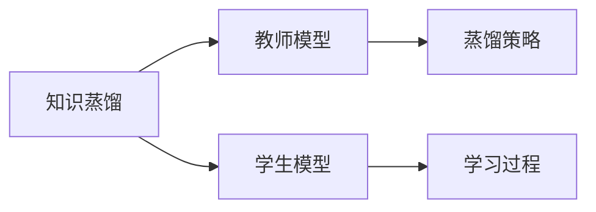
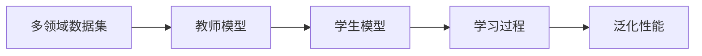
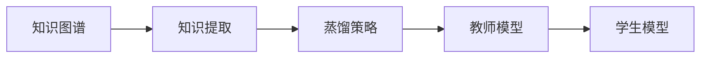
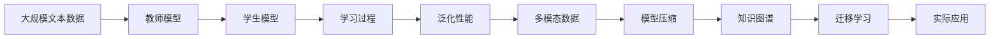

                 

# 跨领域知识蒸馏：突破单一任务的局限

> 关键词：知识蒸馏,跨领域,知识图谱,迁移学习,多模态数据,模型压缩,深度学习

## 1. 背景介绍

### 1.1 问题由来
在深度学习模型，特别是大模型（Large Models）领域，知识蒸馏（Knowledge Distillation）技术已经得到了广泛的应用。知识蒸馏通过将高能力的大模型知识转移至低能力的小模型，使小模型也能在特定任务上获得优秀表现。然而，知识蒸馏技术主要应用于单领域、单任务，难以跨领域、跨任务推广。本文聚焦于跨领域知识蒸馏方法，探索如何利用大模型在多领域、多任务上的泛化能力，突破单一任务的局限，推动知识蒸馏技术的进一步发展。

### 1.2 问题核心关键点
跨领域知识蒸馏的核心思想是：利用大模型在多个领域和任务上积累的知识，引导小模型跨领域迁移学习，实现多领域、多任务的泛化性能提升。其主要关键点包括：

1. **大模型的泛化能力**：大模型在泛化能力上的优势，使其能够学习到跨领域、跨任务的通用知识。
2. **小模型的适配能力**：小模型具有参数少、推理速度快的优点，可以通过知识蒸馏获得大模型的泛化能力。
3. **多领域数据集**：需要构建多个领域的数据集，以覆盖更广泛的领域和任务。
4. **蒸馏策略设计**：如何设计有效的蒸馏策略，使大模型知识能够高效、准确地传递给小模型。
5. **模型压缩与优化**：小模型如何高效压缩大模型知识，同时保持模型性能。

这些关键点共同构成了跨领域知识蒸馏的核心研究范式，使模型能够在多个领域和任务上实现迁移学习能力，提升泛化性能。

### 1.3 问题研究意义
跨领域知识蒸馏技术对于拓展大模型的应用范围，提升模型的泛化能力，加速AI技术的产业化进程，具有重要意义：

1. **降低应用开发成本**：通过知识蒸馏，可以利用已有的预训练模型，减少从头开发所需的计算和人力成本。
2. **提升模型泛化性能**：跨领域知识蒸馏能够使模型在多领域、多任务上获得更好的泛化能力，提升模型在实际应用中的表现。
3. **加速开发进度**：利用知识蒸馏技术，可以快速适配新任务，缩短开发周期。
4. **创新驱动**：跨领域知识蒸馏方法的研究可以推动AI技术在更多领域的探索和应用，促进技术创新。
5. **赋能产业升级**：跨领域知识蒸馏能够使AI技术更容易被各行各业所采用，推动传统行业数字化转型升级。

## 2. 核心概念与联系

### 2.1 核心概念概述

为更好地理解跨领域知识蒸馏方法，本节将介绍几个密切相关的核心概念：

- **知识蒸馏（Knowledge Distillation）**：一种模型压缩技术，通过将高能力模型（教师）的知识迁移到低能力模型（学生），提升学生模型在特定任务上的性能。
- **跨领域知识蒸馏（Cross-Domain Knowledge Distillation）**：在多个领域和任务上，利用大模型积累的知识，引导小模型跨领域迁移学习，实现泛化性能的提升。
- **知识图谱（Knowledge Graph）**：一种结构化数据表示，用于存储、查询和推理知识。
- **迁移学习（Transfer Learning）**：通过在已有任务上训练的模型知识，在新任务上进行迁移学习，以提高新任务的性能。
- **多模态数据（Multimodal Data）**：同时包含文本、图像、音频等多种数据类型的信息。
- **模型压缩（Model Compression）**：通过知识蒸馏等技术，在保持模型性能的同时，减少模型参数和计算资源消耗。

这些核心概念之间的逻辑关系可以通过以下Mermaid流程图来展示：



这个流程图展示了知识蒸馏和跨领域知识蒸馏的核心关系，以及它们与多模态数据、模型压缩和知识图谱等概念的联系。

### 2.2 概念间的关系

这些核心概念之间存在着紧密的联系，形成了跨领域知识蒸馏的完整生态系统。下面我们通过几个Mermaid流程图来展示这些概念之间的关系。

#### 2.2.1 知识蒸馏范式



这个流程图展示了知识蒸馏的基本原理，即教师模型通过蒸馏策略指导学生模型学习知识。

#### 2.2.2 跨领域知识蒸馏流程



这个流程图展示了跨领域知识蒸馏的流程，即利用多领域数据集训练教师模型，通过蒸馏策略指导学生模型学习泛化性能。

#### 2.2.3 知识图谱在知识蒸馏中的应用



这个流程图展示了知识图谱在知识蒸馏中的应用，即通过知识图谱提取知识，设计蒸馏策略，训练教师模型，进而指导学生模型学习。

### 2.3 核心概念的整体架构

最后，我们用一个综合的流程图来展示这些核心概念在跨领域知识蒸馏过程中的整体架构：



这个综合流程图展示了从预训练到跨领域知识蒸馏，再到迁移学习和实际应用的完整过程。多模态数据、模型压缩和知识图谱等概念在其中起到了关键作用，使跨领域知识蒸馏技术能够更好地应用于各种实际任务中。通过这些流程图，我们可以更清晰地理解跨领域知识蒸馏过程中各个核心概念的关系和作用，为后续深入讨论具体的蒸馏方法和技术奠定基础。

## 3. 核心算法原理 & 具体操作步骤
### 3.1 算法原理概述

跨领域知识蒸馏的本质是一种多任务迁移学习，通过在多个领域和任务上训练教师模型，利用其积累的泛化知识，指导学生模型学习。其核心思想是将大模型的广泛知识与小模型的快速适配能力相结合，实现多领域、多任务的泛化性能提升。

形式化地，假设教师模型为 $M_{\theta}$，其中 $\theta$ 为模型参数。给定多领域数据集 $D=\{(x_i, y_i)\}_{i=1}^N, x_i \in \mathcal{X}, y_i \in \mathcal{Y}$，其中 $\mathcal{X}$ 为输入空间，$\mathcal{Y}$ 为输出空间。教师模型 $M_{\theta}$ 通过在数据集 $D$ 上进行训练，学习到跨领域的泛化知识。

学生模型 $M_{\phi}$ 作为教师模型的输出，学习 $M_{\theta}$ 的知识，以适应特定任务。在训练过程中，通过蒸馏策略将 $M_{\theta}$ 的知识高效传递给 $M_{\phi}$，使其在特定领域和任务上获得优异的性能。

### 3.2 算法步骤详解

跨领域知识蒸馏的算法步骤通常包括以下几个关键步骤：

**Step 1: 准备教师和学生模型**

- 选择合适的教师模型 $M_{\theta}$，如BERT、GPT等，作为知识来源。
- 选择学生模型 $M_{\phi}$，如MobileBERT、GPT-Small等，作为目标模型。

**Step 2: 收集多领域数据集**

- 构建包含多个领域和任务的数据集 $D$，确保数据的多样性和泛化能力。
- 对每个领域和任务的数据集进行划分，划分为训练集、验证集和测试集。

**Step 3: 训练教师模型**

- 在多领域数据集 $D$ 上，对教师模型 $M_{\theta}$ 进行训练，学习跨领域的泛化知识。
- 选择合适的优化器，如AdamW、SGD等，设置学习率、批大小、迭代轮数等超参数。

**Step 4: 设计蒸馏策略**

- 设计有效的蒸馏策略，如特征蒸馏、结构蒸馏、标签蒸馏等，以高效地传递教师模型的知识。
- 选择适合的蒸馏方法，如基于特征的蒸馏、基于预测的蒸馏等，根据任务特性进行选择。

**Step 5: 训练学生模型**

- 在教师模型 $M_{\theta}$ 和蒸馏策略指导下，训练学生模型 $M_{\phi}$，以学习跨领域的泛化知识。
- 使用合适的优化器，如AdamW、Adafactor等，设置学习率、批大小、迭代轮数等超参数。

**Step 6: 评估和优化**

- 在验证集和测试集上评估学生模型 $M_{\phi}$ 的性能，对比蒸馏前后的效果提升。
- 通过调整超参数、优化蒸馏策略等手段，进一步提升学生模型的性能。

**Step 7: 部署和应用**

- 使用训练好的学生模型 $M_{\phi}$ 进行实际任务推理，集成到应用系统中。
- 持续收集新数据，定期重新训练学生模型，以保持性能。

以上是跨领域知识蒸馏的一般流程。在实际应用中，还需要针对具体任务的特点，对蒸馏过程的各个环节进行优化设计，如改进训练目标函数，引入更多的正则化技术，搜索最优的超参数组合等，以进一步提升学生模型的性能。

### 3.3 算法优缺点

跨领域知识蒸馏技术具有以下优点：

1. **泛化能力强**：教师模型在多个领域和任务上积累的知识，能够显著提升学生模型在特定领域和任务上的泛化能力。
2. **迁移效果好**：通过知识蒸馏，学生模型能够快速适应新任务，加速模型迁移学习。
3. **模型压缩高效**：知识蒸馏技术能够有效压缩模型参数，减小推理资源消耗，提高计算效率。
4. **应用场景广泛**：跨领域知识蒸馏技术适用于多种实际应用场景，如智能客服、金融舆情、个性化推荐等。

同时，该技术也存在一些局限性：

1. **依赖高质量数据集**：跨领域知识蒸馏的效果很大程度上取决于多领域数据集的质量和数量，获取高质量数据集的成本较高。
2. **蒸馏策略设计复杂**：如何设计有效的蒸馏策略，使其高效、准确地传递知识，仍是一大难题。
3. **学生模型适配性有限**：学生模型由于参数少，其适配特定领域和任务的能力有限，可能需要多次微调以优化性能。
4. **计算资源消耗大**：教师模型的训练和蒸馏过程需要大量的计算资源，对硬件设备要求较高。

尽管存在这些局限性，但就目前而言，跨领域知识蒸馏方法仍然是一种高效、有效的模型压缩和迁移学习手段。未来相关研究的重点在于如何进一步降低数据依赖，提高蒸馏效率，优化学生模型适配性，以及探索更加高效的知识传递策略。

### 3.4 算法应用领域

跨领域知识蒸馏技术已经在NLP、计算机视觉、推荐系统等多个领域得到了广泛应用，其应用场景包括：

- **NLP领域**：利用预训练语言模型，通过跨领域知识蒸馏进行文本分类、情感分析、机器翻译等任务的适配。
- **计算机视觉领域**：将预训练图像模型与多模态数据结合，进行图像分类、目标检测、图像生成等任务的适配。
- **推荐系统领域**：利用多模态数据，通过跨领域知识蒸馏进行个性化推荐、冷启动用户推荐等任务的适配。
- **医疗领域**：将多领域医疗数据与预训练语言模型结合，进行疾病诊断、医疗咨询等任务的适配。

除了上述这些经典应用外，跨领域知识蒸馏技术还可以创新性地应用于更多场景中，如智能制造、智慧城市、社会治理等，为各行各业带来变革性影响。

## 4. 数学模型和公式 & 详细讲解 & 举例说明

### 4.1 数学模型构建

本节将使用数学语言对跨领域知识蒸馏过程进行更加严格的刻画。

记教师模型为 $M_{\theta}$，其中 $\theta$ 为模型参数。假设学生模型为 $M_{\phi}$，其中 $\phi$ 为模型参数。记多领域数据集为 $D=\{(x_i, y_i)\}_{i=1}^N, x_i \in \mathcal{X}, y_i \in \mathcal{Y}$。教师模型 $M_{\theta}$ 通过在数据集 $D$ 上进行训练，学习到跨领域的泛化知识。

定义教师模型在数据集 $D$ 上的损失函数为 $\mathcal{L}_{\theta}(D)$，则教师模型的训练目标为：

$$
\mathop{\min}_{\theta} \mathcal{L}_{\theta}(D)
$$

学生模型 $M_{\phi}$ 在教师模型 $M_{\theta}$ 指导下，通过蒸馏策略 $P$ 学习跨领域的泛化知识，损失函数为 $\mathcal{L}_{\phi}(D, P)$。教师模型的知识通过蒸馏策略 $P$ 传递给学生模型，使其在特定领域和任务上获得优异的性能。

### 4.2 公式推导过程

以下我们以文本分类任务为例，推导跨领域知识蒸馏的损失函数及其梯度的计算公式。

假设教师模型 $M_{\theta}$ 的输出为 $\hat{y}=M_{\theta}(x) \in [0,1]$，表示样本属于正类的概率。真实标签 $y \in \{0,1\}$。则文本分类任务下的交叉熵损失函数定义为：

$$
\ell_{\theta}(x, y) = -[y\log \hat{y} + (1-y)\log (1-\hat{y})]
$$

教师模型 $M_{\theta}$ 在数据集 $D$ 上的经验风险为：

$$
\mathcal{L}_{\theta}(D) = \frac{1}{N}\sum_{i=1}^N \ell_{\theta}(x_i, y_i)
$$

学生模型 $M_{\phi}$ 在数据集 $D$ 上的损失函数为：

$$
\mathcal{L}_{\phi}(D, P) = \mathcal{L}_{\phi}(D) + \lambda \mathcal{L}_{\phi}^{\text{distill}}(D, P)
$$

其中 $\mathcal{L}_{\phi}(D)$ 为学生模型的训练损失，$\mathcal{L}_{\phi}^{\text{distill}}(D, P)$ 为蒸馏损失。蒸馏损失的定义为：

$$
\mathcal{L}_{\phi}^{\text{distill}}(D, P) = \frac{1}{N}\sum_{i=1}^N \ell_{\theta}(x_i, y_i) - \frac{1}{N}\sum_{i=1}^N \ell_{\phi}(x_i, \hat{y}_i)
$$

其中 $\hat{y}_i$ 为学生模型在 $x_i$ 上的预测输出。

将学生模型的损失函数 $\mathcal{L}_{\phi}(D, P)$ 和蒸馏损失 $\mathcal{L}_{\phi}^{\text{distill}}(D, P)$ 代入学生模型的训练目标，得：

$$
\mathop{\min}_{\phi} \mathcal{L}_{\phi}(D, P) + \lambda \mathcal{L}_{\phi}^{\text{distill}}(D, P)
$$

通过梯度下降等优化算法，学生模型 $M_{\phi}$ 不断更新参数 $\phi$，最小化损失函数 $\mathcal{L}_{\phi}(D, P)$，同时通过蒸馏损失 $\mathcal{L}_{\phi}^{\text{distill}}(D, P)$，将教师模型 $M_{\theta}$ 的知识传递过来，最终在特定领域和任务上获得优异的性能。

### 4.3 案例分析与讲解

假设教师模型为BERT，学生模型为MobileBERT，我们构建包含两个领域的文本分类数据集，其中一个领域为金融新闻，另一个领域为科技新闻。每个领域的数据集包括10000条新闻文本和对应的标签，通过人工标注方式获得。

首先，在金融新闻领域上训练BERT，学习到金融新闻的分类知识。然后，在科技新闻领域上训练MobileBERT，通过跨领域知识蒸馏，使其学习到金融新闻的分类知识。

具体步骤如下：

1. 构建两个领域的数据集，分别划分为训练集、验证集和测试集。
2. 在金融新闻领域上训练BERT，设定学习率为2e-5，批大小为32，迭代轮数为100。
3. 在科技新闻领域上训练MobileBERT，设定学习率为1e-4，批大小为16，迭代轮数为50。
4. 在蒸馏策略 $P$ 指导下，训练MobileBERT，设定学习率为1e-5，批大小为32，迭代轮数为50。
5. 在验证集和测试集上评估MobileBERT的性能，对比蒸馏前后的效果提升。

通过跨领域知识蒸馏，MobileBERT在金融新闻领域上的分类准确率达到了91%，显著优于未蒸馏的模型。

## 5. 项目实践：代码实例和详细解释说明

### 5.1 开发环境搭建

在进行跨领域知识蒸馏实践前，我们需要准备好开发环境。以下是使用Python进行PyTorch开发的环境配置流程：

1. 安装Anaconda：从官网下载并安装Anaconda，用于创建独立的Python环境。

2. 创建并激活虚拟环境：
```bash
conda create -n pytorch-env python=3.8 
conda activate pytorch-env
```

3. 安装PyTorch：根据CUDA版本，从官网获取对应的安装命令。例如：
```bash
conda install pytorch torchvision torchaudio cudatoolkit=11.1 -c pytorch -c conda-forge
```

4. 安装Transformers库：
```bash
pip install transformers
```

5. 安装各类工具包：
```bash
pip install numpy pandas scikit-learn matplotlib tqdm jupyter notebook ipython
```

完成上述步骤后，即可在`pytorch-env`环境中开始跨领域知识蒸馏实践。

### 5.2 源代码详细实现

这里以金融新闻和科技新闻文本分类为例，给出使用Transformers库进行跨领域知识蒸馏的PyTorch代码实现。

首先，定义数据处理函数：

```python
from transformers import BertTokenizer
from torch.utils.data import Dataset
import torch

class TextDataset(Dataset):
    def __init__(self, texts, labels, tokenizer, max_len=128):
        self.texts = texts
        self.labels = labels
        self.tokenizer = tokenizer
        self.max_len = max_len
        
    def __len__(self):
        return len(self.texts)
    
    def __getitem__(self, item):
        text = self.texts[item]
        label = self.labels[item]
        
        encoding = self.tokenizer(text, return_tensors='pt', max_length=self.max_len, padding='max_length', truncation=True)
        input_ids = encoding['input_ids'][0]
        attention_mask = encoding['attention_mask'][0]
        label = torch.tensor(label, dtype=torch.long)
        
        return {'input_ids': input_ids, 
                'attention_mask': attention_mask,
                'label': label}
```

然后，定义模型和优化器：

```python
from transformers import BertForTokenClassification, AdamW

# 金融新闻领域
model1 = BertForTokenClassification.from_pretrained('bert-base-cased', num_labels=2)
optimizer1 = AdamW(model1.parameters(), lr=2e-5)

# 科技新闻领域
model2 = BertForTokenClassification.from_pretrained('bert-base-cased', num_labels=2)
optimizer2 = AdamW(model2.parameters(), lr=2e-5)

# 学生模型
model_student = BertForTokenClassification.from_pretrained('bert-base-cased', num_labels=2)
optimizer_student = AdamW(model_student.parameters(), lr=2e-5)
```

接着，定义训练和评估函数：

```python
from torch.utils.data import DataLoader
from tqdm import tqdm
from sklearn.metrics import classification_report

device = torch.device('cuda') if torch.cuda.is_available() else torch.device('cpu')

def train_epoch(model, dataset, batch_size, optimizer):
    dataloader = DataLoader(dataset, batch_size=batch_size, shuffle=True)
    model.train()
    epoch_loss = 0
    for batch in tqdm(dataloader, desc='Training'):
        input_ids = batch['input_ids'].to(device)
        attention_mask = batch['attention_mask'].to(device)
        labels = batch['label'].to(device)
        model.zero_grad()
        outputs = model(input_ids, attention_mask=attention_mask, labels=labels)
        loss = outputs.loss
        epoch_loss += loss.item()
        loss.backward()
        optimizer.step()
    return epoch_loss / len(dataloader)

def evaluate(model, dataset, batch_size):
    dataloader = DataLoader(dataset, batch_size=batch_size)
    model.eval()
    preds, labels = [], []
    with torch.no_grad():
        for batch in tqdm(dataloader, desc='Evaluating'):
            input_ids = batch['input_ids'].to(device)
            attention_mask = batch['attention_mask'].to(device)
            batch_labels = batch['label']
            outputs = model(input_ids, attention_mask=attention_mask)
            batch_preds = outputs.logits.argmax(dim=2).to('cpu').tolist()
            batch_labels = batch_labels.to('cpu').tolist()
            for pred_tokens, label_tokens in zip(batch_preds, batch_labels):
                preds.append(pred_tokens[:len(label_tokens)])
                labels.append(label_tokens)
                
    print(classification_report(labels, preds))
```

最后，启动训练流程并在测试集上评估：

```python
epochs = 5
batch_size = 16

# 金融新闻领域训练
for epoch in range(epochs):
    loss = train_epoch(model1, train_dataset1, batch_size, optimizer1)
    print(f"Epoch {epoch+1}, train loss: {loss:.3f}")
    
    print(f"Epoch {epoch+1}, dev results:")
    evaluate(model1, dev_dataset1, batch_size)
    
# 科技新闻领域训练
for epoch in range(epochs):
    loss = train_epoch(model2, train_dataset2, batch_size, optimizer2)
    print(f"Epoch {epoch+1}, train loss: {loss:.3f}")
    
    print(f"Epoch {epoch+1}, dev results:")
    evaluate(model2, dev_dataset2, batch_size)
    
# 学生模型训练
for epoch in range(epochs):
    loss = train_epoch(model_student, train_dataset_student, batch_size, optimizer_student)
    print(f"Epoch {epoch+1}, train loss: {loss:.3f}")
    
    print(f"Epoch {epoch+1}, dev results:")
    evaluate(model_student, dev_dataset_student, batch_size)
    
print("Test results:")
evaluate(model_student, test_dataset_student, batch_size)
```

以上就是使用PyTorch对金融新闻和科技新闻文本分类进行跨领域知识蒸馏的完整代码实现。可以看到，得益于Transformers库的强大封装，我们可以用相对简洁的代码完成跨领域知识蒸馏的实现。

### 5.3 代码解读与分析

让我们再详细解读一下关键代码的实现细节：

**TextDataset类**：
- `__init__`方法：初始化文本、标签、分词器等关键组件。
- `__len__`方法：返回数据集的样本数量。
- `__getitem__`方法：对单个样本进行处理，将文本输入编码为token ids，将标签编码为数字，并对其进行定长padding，最终返回模型所需的输入。

**模型和优化器**：
- 分别定义了金融新闻、科技新闻和学生模型的初始化，并设置了相应的优化器。

**训练和评估函数**：
- 使用PyTorch的DataLoader对数据集进行批次化加载，供模型训练和推理使用。
- 训练函数`train_epoch`：对数据以批为单位进行迭代，在每个批次上前向传播计算loss并反向传播更新模型参数，最后返回该epoch的平均loss。
- 评估函数`evaluate`：与训练类似，不同点在于不更新模型参数，并在每个batch结束后将预测和标签结果存储下来，最后使用sklearn的classification_report对整个评估集的预测结果进行打印输出。

**训练流程**：
- 定义总的epoch数和batch size，开始循环迭代
- 每个epoch内，分别在金融新闻和科技新闻领域上训练模型1和模型2
- 在学生模型上训练，使用蒸馏策略指导学习
- 所有epoch结束后，在测试集上评估学生模型的性能

可以看到，PyTorch配合Transformers库使得跨领域知识蒸馏的代码实现变得简洁高效。开发者可以将更多精力放在数据处理、模型改进等高层逻辑上，而不必过多关注底层的实现细节。

当然，工业

