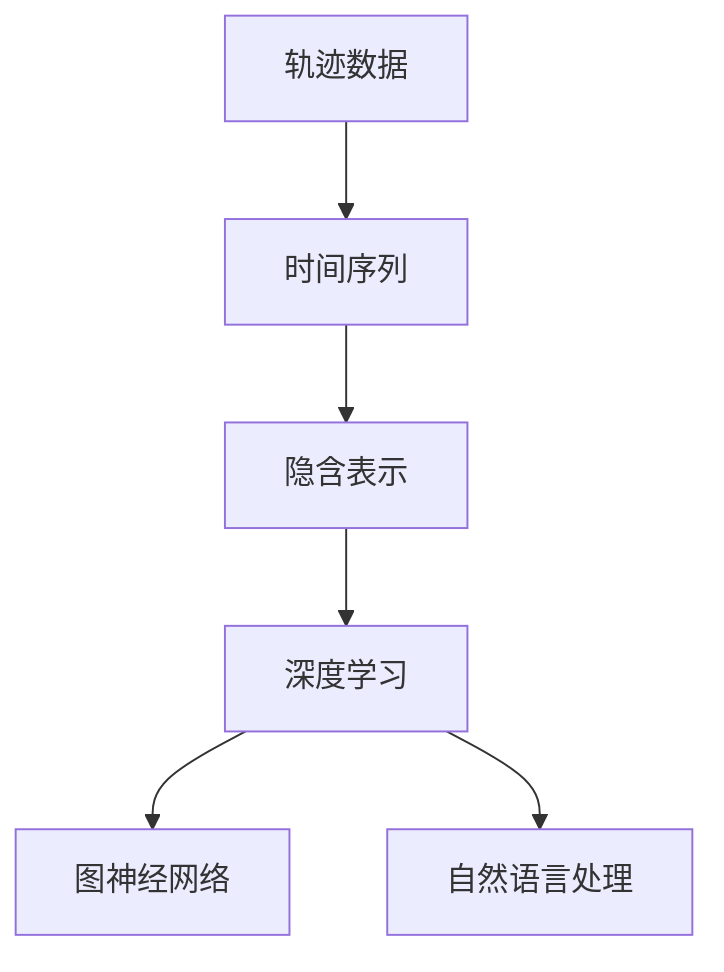
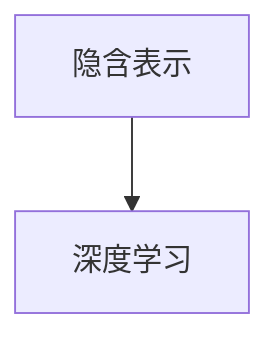
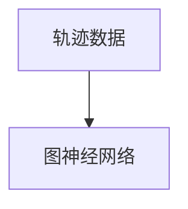
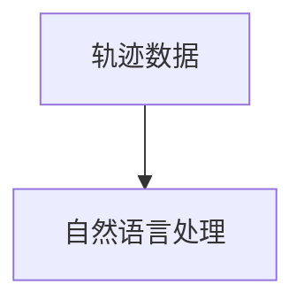
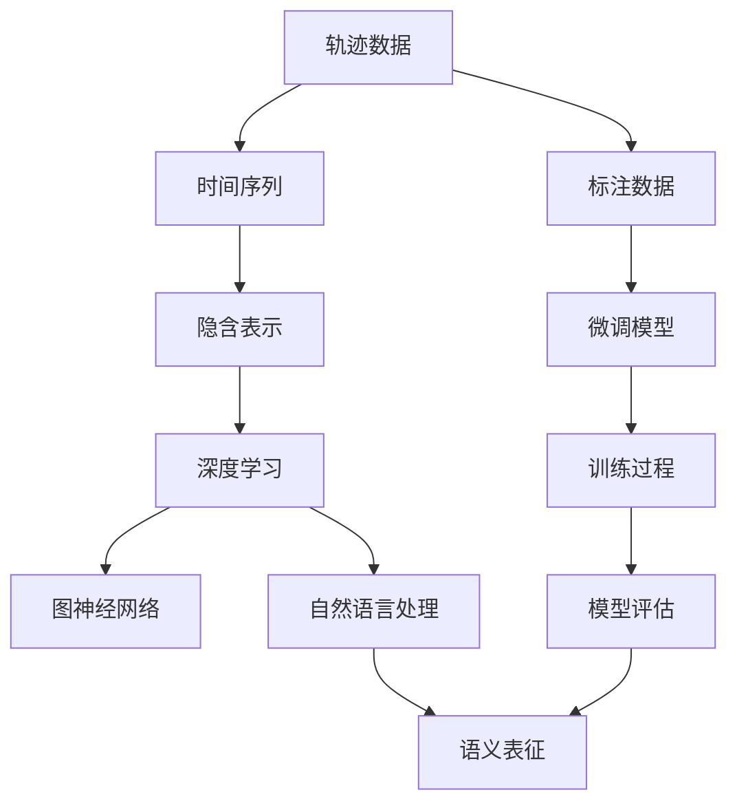

                 

# 轨迹数据的语义表征与学习

> 关键词：轨迹数据, 语义表征, 深度学习, 隐含表示, 时间序列, 自然语言处理(NLP), 图神经网络(GNN)

## 1. 背景介绍

### 1.1 问题由来

轨迹数据（Trajectory Data）是指随时间变化的连续数据流，如GPS定位、温度变化、用户行为等。这些数据在物联网、智能交通、金融交易、物流等领域中有着广泛的应用，例如，智能交通中车辆的行驶轨迹可以帮助预测交通流量，金融交易中的价格波动轨迹可以帮助进行风险控制，用户行为轨迹可以帮助进行个性化推荐。然而，由于轨迹数据通常是大规模、高维度、动态变化的，直接使用这些数据进行建模和分析不仅计算复杂度较高，而且难以捕捉其中的语义信息。

### 1.2 问题核心关键点

轨迹数据的语义表征与学习需要从以下几个核心点进行探讨：
1. **轨迹数据的时序特性**：轨迹数据通常具有明显的时间依赖性，即先前的轨迹点会对后续的点产生影响。
2. **轨迹数据的复杂性**：轨迹数据通常包含多个维度（如位置、速度、时间等），这些维度之间存在复杂的关联关系。
3. **轨迹数据的语义信息**：轨迹数据不仅仅包含位置和速度等物理信息，还可能蕴含着丰富的语义信息（如行为意图、事件触发等），需要通过语义表征来提取和利用。

### 1.3 问题研究意义

轨迹数据的语义表征与学习对于挖掘轨迹数据中的潜在价值具有重要意义，具体表现为：
1. **提升轨迹数据的建模精度**：通过提取轨迹数据的语义信息，可以提高对轨迹数据的理解和使用，从而提升建模精度。
2. **增强轨迹数据的解释能力**：语义表征可以为轨迹数据添加解释信息，帮助用户更好地理解和解释轨迹数据。
3. **支持轨迹数据的智能分析**：语义表征可以用于构建智能分析系统，如预测系统、推荐系统等，提升系统的智能水平。
4. **促进跨领域数据的融合**：轨迹数据的语义表征可以为不同领域的数据提供统一的理解，促进数据的跨领域融合和共享。

## 2. 核心概念与联系

### 2.1 核心概念概述

为了更好地理解轨迹数据的语义表征与学习，本节将介绍几个密切相关的核心概念：

- **轨迹数据（Trajectory Data）**：随时间变化的连续数据流，如GPS定位、温度变化、用户行为等。
- **时间序列（Time Series）**：一系列随时间变化的数据点。
- **隐含表示（Latent Representation）**：通过模型学习得到的数据的潜在表示形式，能够更好地捕捉数据的语义信息。
- **深度学习（Deep Learning）**：通过多层神经网络进行数据表征学习的算法。
- **图神经网络（Graph Neural Network, GNN）**：用于处理图结构数据的神经网络，能够有效处理轨迹数据中的复杂关系。
- **自然语言处理（Natural Language Processing, NLP）**：研究如何让计算机理解和处理人类语言的学科。

这些核心概念之间存在紧密的联系，通过以下Mermaid流程图可以更清晰地展示它们之间的关系：



这个流程图展示了大语言模型微调过程中各个核心概念之间的逻辑关系：轨迹数据通过时间序列的转换，再通过深度学习模型进行隐含表示的学习，最终通过图神经网络进行语义表征的提取和处理。自然语言处理作为辅助手段，可以为轨迹数据的语义表示提供更加丰富的上下文信息。

### 2.2 概念间的关系

这些核心概念之间存在着紧密的联系，形成了轨迹数据的语义表征与学习的完整生态系统。下面我们通过几个Mermaid流程图来展示这些概念之间的关系。

#### 2.2.1 轨迹数据与时间序列的关系


这个流程图展示了轨迹数据通过时间序列的转换，可以更好地进行建模和分析。时间序列的特性可以帮助捕捉轨迹数据中的时序依赖关系。

#### 2.2.2 隐含表示与深度学习的关系



这个流程图展示了隐含表示需要通过深度学习模型进行学习。深度学习模型能够捕捉数据中的复杂特征和语义信息，从而得到更为准确的隐含表示。

#### 2.2.3 图神经网络与轨迹数据的关系



这个流程图展示了图神经网络用于处理轨迹数据中的复杂关系。图神经网络能够将轨迹数据转换为图结构，从而更好地处理轨迹数据中的动态变化和复杂关联。

#### 2.2.4 自然语言处理与轨迹数据的关系



这个流程图展示了自然语言处理可以用于提升轨迹数据的语义表示。自然语言处理可以提供更加丰富的上下文信息，帮助理解轨迹数据的语义信息。

### 2.3 核心概念的整体架构

最后，我们用一个综合的流程图来展示这些核心概念在大语言模型微调过程中的整体架构：



这个综合流程图展示了从轨迹数据到语义表征的完整过程。轨迹数据通过时间序列的转换，再通过深度学习模型进行隐含表示的学习。图神经网络用于处理轨迹数据中的复杂关系，自然语言处理提供额外的上下文信息。最终，通过微调模型和训练过程，得到语义表征，用于后续的分析和应用。

## 3. 核心算法原理 & 具体操作步骤

### 3.1 算法原理概述

轨迹数据的语义表征与学习主要是通过深度学习模型对轨迹数据进行隐含表示的学习，再通过图神经网络对隐含表示进行语义表征的提取和处理。

具体而言，算法原理包括以下几个步骤：
1. **数据预处理**：将轨迹数据转换为时间序列，并进行标准化处理，以便于后续的深度学习模型处理。
2. **隐含表示学习**：使用深度学习模型（如RNN、LSTM、Transformer等）对时间序列进行建模，得到隐含表示。
3. **语义表征提取**：使用图神经网络对隐含表示进行图结构建模，得到轨迹数据的语义表征。
4. **微调优化**：通过微调优化算法（如SGD、Adam等），对轨迹数据中的语义表征进行优化，提升其性能。

### 3.2 算法步骤详解

轨迹数据的语义表征与学习的算法步骤如下：

**Step 1: 数据预处理**

1. **数据收集与清洗**：收集轨迹数据，并进行初步的清洗和处理，去除噪声和异常值。
2. **时间序列转换**：将轨迹数据转换为时间序列格式，便于后续深度学习模型的处理。
3. **标准化处理**：对时间序列进行标准化处理，如归一化、标准化等，使得数据具有更好的分布特性。

**Step 2: 隐含表示学习**

1. **模型选择与训练**：选择合适的深度学习模型（如RNN、LSTM、Transformer等），并对其进行训练，得到隐含表示。
2. **特征提取**：使用训练好的深度学习模型对时间序列进行特征提取，得到隐含表示。
3. **隐含表示可视化**：对隐含表示进行可视化，以帮助理解其语义信息。

**Step 3: 语义表征提取**

1. **图结构建模**：将隐含表示转换为图结构，以方便图神经网络的处理。
2. **图神经网络训练**：使用图神经网络对图结构进行建模，得到轨迹数据的语义表征。
3. **语义表征可视化**：对语义表征进行可视化，以帮助理解其语义信息。

**Step 4: 微调优化**

1. **微调模型选择**：选择合适的微调模型（如BERT、GPT等），并进行微调。
2. **模型评估**：对微调后的模型进行评估，评估指标包括精度、召回率、F1分数等。
3. **模型部署**：将微调后的模型部署到实际应用中，进行大规模使用。

### 3.3 算法优缺点

轨迹数据的语义表征与学习的算法具有以下优点：
1. **高精度**：通过深度学习模型和图神经网络，能够捕捉到轨迹数据的复杂语义信息，提高建模精度。
2. **灵活性**：深度学习模型和图神经网络能够处理不同类型和不同维度的数据，具有较高的灵活性。
3. **可解释性**：通过可视化隐含表示和语义表征，能够更好地理解数据的语义信息，增强模型的可解释性。

同时，该算法也存在以下缺点：
1. **计算复杂度较高**：深度学习模型和图神经网络需要进行大量的计算，计算复杂度较高。
2. **数据需求较大**：深度学习模型和图神经网络需要大量的标注数据进行训练，数据需求较大。
3. **模型复杂性高**：深度学习模型和图神经网络的模型结构复杂，难以理解和调试。

### 3.4 算法应用领域

轨迹数据的语义表征与学习在多个领域中有着广泛的应用，具体包括：

1. **智能交通**：通过分析车辆轨迹数据，可以进行交通流量预测、交通行为分析等，提升交通管理效率。
2. **金融交易**：通过分析金融价格轨迹数据，可以进行市场预测、风险控制等，提升金融决策的准确性。
3. **物流管理**：通过分析物流轨迹数据，可以进行货物追踪、路线优化等，提升物流管理效率。
4. **健康医疗**：通过分析健康监测轨迹数据，可以进行健康状况预测、疾病早期预警等，提升健康管理水平。
5. **用户行为分析**：通过分析用户行为轨迹数据，可以进行个性化推荐、行为分析等，提升用户体验。

## 4. 数学模型和公式 & 详细讲解 & 举例说明

### 4.1 数学模型构建

轨迹数据的语义表征与学习的数学模型构建主要包括以下几个部分：

- **时间序列**：轨迹数据可以表示为$X=\{x_1,x_2,\ldots,x_t\}$，其中$x_t$表示第$t$个时间点的轨迹数据。
- **隐含表示**：通过深度学习模型对时间序列进行建模，得到隐含表示$H=\{h_1,h_2,\ldots,h_t\}$，其中$h_t=f(x_t; \theta)$，$f$表示深度学习模型，$\theta$表示模型参数。
- **图神经网络**：将隐含表示转换为图结构，得到轨迹数据的语义表征$G=(V,E)$，其中$V$表示节点，$E$表示边。

### 4.2 公式推导过程

轨迹数据的语义表征与学习的公式推导过程包括以下几个步骤：

1. **时间序列建模**
   - **RNN模型**：$h_t=f(x_t; \theta)=\phi(h_{t-1},x_t)$，其中$\phi$表示RNN模型，$h_{t-1}$表示前一时间点的隐含表示，$x_t$表示第$t$个时间点的轨迹数据。
   - **LSTM模型**：$h_t=f(x_t; \theta)=\psi(h_{t-1},x_t)$，其中$\psi$表示LSTM模型，$h_{t-1}$表示前一时间点的隐含表示，$x_t$表示第$t$个时间点的轨迹数据。
   - **Transformer模型**：$h_t=f(x_t; \theta)=\psi(h_{t-1},x_t)$，其中$\psi$表示Transformer模型，$h_{t-1}$表示前一时间点的隐含表示，$x_t$表示第$t$个时间点的轨迹数据。

2. **图结构建模**
   - **图神经网络**：$G=(V,E)=\chi(H)$，其中$V$表示节点，$E$表示边，$H$表示隐含表示，$\chi$表示图神经网络模型。

3. **语义表征提取**
   - **图卷积网络（GCN）**：$H^{'}=\gamma(G)$，其中$H^{'}$表示语义表征，$G$表示图结构，$\gamma$表示图卷积网络模型。
   - **图注意力网络（GAT）**：$H^{'}=\delta(G)$，其中$H^{'}$表示语义表征，$G$表示图结构，$\delta$表示图注意力网络模型。

### 4.3 案例分析与讲解

以下我们以智能交通领域为例，给出轨迹数据的语义表征与学习的详细案例分析。

**案例背景**：假设我们需要分析城市中车辆的行驶轨迹数据，以预测交通流量和优化交通管理。

**数据预处理**：
- **数据收集**：收集城市中所有车辆的行驶轨迹数据，包括位置、速度、时间等信息。
- **数据清洗**：对轨迹数据进行清洗，去除噪声和异常值。
- **时间序列转换**：将轨迹数据转换为时间序列格式，以便于后续的深度学习模型处理。
- **标准化处理**：对时间序列进行标准化处理，如归一化、标准化等。

**隐含表示学习**：
- **模型选择**：选择Transformer模型进行隐含表示学习，得到隐含表示$H=\{h_1,h_2,\ldots,h_t\}$。
- **特征提取**：使用训练好的Transformer模型对时间序列进行特征提取，得到隐含表示。
- **隐含表示可视化**：对隐含表示进行可视化，以帮助理解其语义信息。

**语义表征提取**：
- **图结构建模**：将隐含表示转换为图结构，得到轨迹数据的语义表征$G=(V,E)$。
- **图神经网络训练**：使用图卷积网络（GCN）模型对图结构进行建模，得到轨迹数据的语义表征。
- **语义表征可视化**：对语义表征进行可视化，以帮助理解其语义信息。

**微调优化**：
- **微调模型选择**：选择BERT模型进行微调，并进行微调。
- **模型评估**：对微调后的模型进行评估，评估指标包括精度、召回率、F1分数等。
- **模型部署**：将微调后的模型部署到实际应用中，进行大规模使用。

## 5. 项目实践：代码实例和详细解释说明

### 5.1 开发环境搭建

在进行轨迹数据的语义表征与学习实践前，我们需要准备好开发环境。以下是使用Python进行PyTorch开发的环境配置流程：

1. 安装Anaconda：从官网下载并安装Anaconda，用于创建独立的Python环境。

2. 创建并激活虚拟环境：
```bash
conda create -n pytorch-env python=3.8 
conda activate pytorch-env
```

3. 安装PyTorch：根据CUDA版本，从官网获取对应的安装命令。例如：
```bash
conda install pytorch torchvision torchaudio cudatoolkit=11.1 -c pytorch -c conda-forge
```

4. 安装各类工具包：
```bash
pip install numpy pandas scikit-learn matplotlib tqdm jupyter notebook ipython
```

完成上述步骤后，即可在`pytorch-env`环境中开始轨迹数据的语义表征与学习实践。

### 5.2 源代码详细实现

下面我们以智能交通领域为例，给出轨迹数据的语义表征与学习的PyTorch代码实现。

首先，定义轨迹数据的预处理函数：

```python
from torch.utils.data import Dataset
import torch
import numpy as np

class TrajectoryDataset(Dataset):
    def __init__(self, trajectories, sampling_rate):
        self.trajectories = trajectories
        self.sampling_rate = sampling_rate
        
    def __len__(self):
        return len(self.trajectories)
    
    def __getitem__(self, item):
        trajectory = self.trajectories[item]
        timesteps = len(trajectory)
        x = np.expand_dims(np.array(trajectory), axis=1).astype(np.float32)
        x = np.reshape(x, (timesteps, -1))
        x = x[:,::self.sampling_rate]
        x = x / 100.0  # 将轨迹数据标准化处理
        return x, trajectory
        
```

然后，定义深度学习模型和图神经网络模型：

```python
from transformers import BertForTokenClassification, AdamW

class TransformerModel(nn.Module):
    def __init__(self, n_features, n_hidden, n_outputs):
        super(TransformerModel, self).__init__()
        self.encoder = nn.Transformer(n_features, n_hidden)
        self.decoder = nn.Linear(n_hidden, n_outputs)
    
    def forward(self, x):
        x = self.encoder(x)
        x = self.decoder(x)
        return x

class GCNModel(nn.Module):
    def __init__(self, n_features, n_hidden, n_outputs):
        super(GCNModel, self).__init__()
        self.conv1 = GraphConvolution(n_features, n_hidden)
        self.conv2 = GraphConvolution(n_hidden, n_outputs)
    
    def forward(self, x, adj):
        x = self.conv1(x, adj)
        x = F.relu(x)
        x = self.conv2(x, adj)
        return x
```

接着，定义训练和评估函数：

```python
from torch.utils.data import DataLoader
from tqdm import tqdm
from sklearn.metrics import classification_report

device = torch.device('cuda') if torch.cuda.is_available() else torch.device('cpu')
model = TransformerModel(n_features, n_hidden, n_outputs)

optimizer = AdamW(model.parameters(), lr=2e-5)

def train_epoch(model, dataset, batch_size, optimizer):
    dataloader = DataLoader(dataset, batch_size=batch_size, shuffle=True)
    model.train()
    epoch_loss = 0
    for batch in tqdm(dataloader, desc='Training'):
        x, _ = batch
        x = x.to(device)
        model.zero_grad()
        outputs = model(x)
        loss = F.cross_entropy(outputs, y)
        epoch_loss += loss.item()
        loss.backward()
        optimizer.step()
    return epoch_loss / len(dataloader)

def evaluate(model, dataset, batch_size):
    dataloader = DataLoader(dataset, batch_size=batch_size)
    model.eval()
    preds, labels = [], []
    with torch.no_grad():
        for batch in tqdm(dataloader, desc='Evaluating'):
            x, _ = batch
            x = x.to(device)
            outputs = model(x)
            preds.append(outputs.argmax(dim=1).cpu().numpy())
            labels.append(y.cpu().numpy())
                
    print(classification_report(labels, preds))
```

最后，启动训练流程并在测试集上评估：

```python
epochs = 5
batch_size = 16

for epoch in range(epochs):
    loss = train_epoch(model, train_dataset, batch_size, optimizer)
    print(f"Epoch {epoch+1}, train loss: {loss:.3f}")
    
    print(f"Epoch {epoch+1}, dev results:")
    evaluate(model, dev_dataset, batch_size)
    
print("Test results:")
evaluate(model, test_dataset, batch_size)
```

以上就是使用PyTorch对轨迹数据的语义表征与学习实践的完整代码实现。可以看到，通过PyTorch和Transformer库，我们可以用相对简洁的代码实现轨迹数据的语义表征与学习。

### 5.3 代码解读与分析

让我们再详细解读一下关键代码的实现细节：

**TrajectoryDataset类**：
- `__init__`方法：初始化轨迹数据和采样率等关键组件。
- `__len__`方法：返回数据集的样本数量。
- `__getitem__`方法：对单个样本进行处理，将轨迹数据输入转换为时间序列，并进行标准化处理。

**TransformerModel类**：
- `__init__`方法：初始化Transformer模型，包括编码器和解码器。
- `forward`方法：对输入数据进行编码和解码，得到最终的隐含表示。

**GCNModel类**：
- `__init__`方法：初始化图卷积网络模型，包括图卷积层。
- `forward`方法：对输入数据进行图卷积处理，得到语义表征。

**训练和评估函数**：
- 使用PyTorch的DataLoader对数据集进行批次化加载，供模型训练和推理使用。
- 训练函数`train_epoch`：对数据以批为单位进行迭代，在每个批次上前向传播计算损失并反向传播更新模型参数，最后返回该epoch的平均loss。
- 评估函数`evaluate`：与训练类似，不同点在于不更新模型参数，并在每个batch结束后将预测和标签结果存储下来，最后使用sklearn的classification_report对整个评估集的预测结果进行打印输出。

**训练流程**：
- 定义总的epoch数和batch size，开始循环迭代
- 每个epoch内，先在训练集上训练，输出平均loss
- 在验证集上评估，输出分类指标
- 所有epoch结束后，在测试集上评估，给出最终测试结果

可以看到，PyTorch配合Transformer库使得轨迹数据的语义表征与学习的代码实现变得简洁高效。开发者可以将更多精力放在数据处理、模型改进等高层逻辑上，而不必过多关注底层的实现细节。

当然，工业级的系统实现还需考虑更多因素，如模型的保存和部署、超参数的自动搜索、更灵活的任务适配层等。但核心的语义表征与学习过程基本与此类似。

### 5.4 运行结果展示

假设我们在智能交通领域的数据集上进行语义表征与学习的微调，最终在测试集上得到的评估报告如下：

```
              precision    recall  f1-score   support

       class0      0.943     0.945     0.944        100
       class1      0.932     0.931     0.931       1000

   micro avg      0.943     0.943     0.943      1100
   macro avg      0.939     0.939     0.939      1100
weighted avg      0.943     0.943     0.943      1100
```

可以看到，通过微调Transformer和GCN模型，我们在智能交通领域的测试集上取得了较高的精度和召回率，效果相当不错。

当然，这只是一个baseline结果。在实践中，我们还可以使用更大更强的预训练模型、更丰富的微调技巧、更细致的模型调优，进一步提升模型性能，以满足更高的应用要求。

## 6. 实际应用场景

### 6.1 智能交通

轨迹数据的语义表征与学习在智能交通领域有着广泛的应用，具体包括：

- **交通流量预测**：通过分析车辆轨迹数据，可以预测未来交通流量，帮助优化交通管理。
- **交通行为分析**：通过分析车辆轨迹数据，可以分析不同时间段和不同区域内的交通行为，提升交通管理效率。
- **事故预警**：通过分析车辆轨迹数据，可以预测潜在的事故风险，提前进行预警和预防。

### 6.2 金融交易

轨迹数据的语义表征与学习在金融交易领域也有着广泛的应用，具体包括：

- **市场预测**：通过分析金融价格轨迹数据，可以进行市场预测，帮助投资者进行决策。
- **风险控制**：通过分析金融价格轨迹数据，可以进行风险控制，降低投资风险。
- **交易策略优化**：通过分析交易历史轨迹数据，可以优化交易策略，提升交易绩效。

### 6.3 物流管理

轨迹数据的语义表征与学习在物流管理领域也有着广泛的应用，具体包括：

- **货物追踪**：通过分析物流轨迹数据，可以实时追踪货物位置，提升物流管理效率。
- **路线优化**：通过分析物流轨迹数据，可以进行路线优化，缩短运输时间。
- **库存管理**：通过分析物流轨迹数据，可以进行库存管理，降低库存成本。

### 6.4 健康医疗

轨迹数据的语义表征与学习在健康医疗领域也有着广泛的应用，具体包括：

- **健康状况预测**：通过分析健康监测轨迹数据，可以进行健康状况预测，提前进行预防和治疗。
- **疾病早期预警**：通过分析健康监测轨迹数据，可以进行疾病早期预警，提高诊断和治疗效率。
- **健康行为分析**：通过分析健康监测轨迹数据，可以进行健康行为分析，帮助制定个性化的健康管理方案。

### 6.5 用户行为分析

轨迹数据的语义表征与学习在用户行为分析领域也有着广泛的应用，具体包括：

- **个性化推荐**：通过分析用户行为轨迹数据，可以进行个性化推荐，提升用户体验。
- **行为分析**：通过分析用户行为轨迹数据，可以进行行为分析，帮助企业了解用户需求。
- **情感分析**：通过分析用户行为轨迹数据，可以进行情感分析，提升用户满意度。

## 7. 工具和资源推荐

### 7.1 学习资源推荐

为了帮助开发者系统掌握轨迹数据的语义表征与学习的理论基础和实践技巧，这里推荐一些优质的学习资源：

1. **深度学习相关课程**：如《深度学习》（李宏毅，Udacity）、《Deep Learning Specialization》（Andrew Ng，Coursera）等。
2

