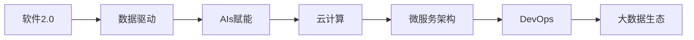

                 

# 软件 2.0 的时代：数据驱动一切

> 关键词：软件2.0, 数据驱动, AI赋能, 云计算, 大数据, 自动化开发, 机器学习, 模型驱动, 微服务架构, DevOps, 大数据生态

## 1. 背景介绍

### 1.1 问题由来
随着信息技术的迅猛发展，软件技术已经经历了从早期的“软件 1.0”到“软件 2.0”的演进。在“软件 1.0”时代，软件开发主要依赖于手工编码，开发效率低下，调试复杂。但随着云计算和大数据技术的崛起，软件2.0的到来为软件产业注入了新的活力。

“软件 2.0”时代的到来，标志着一个全新的软件开发范式：数据驱动开发。软件 2.0 注重利用数据和技术工具，将模型和算法嵌入软件开发流程，使软件开发更加高效、智能、自动化。在软件 2.0 时代，AI、ML、云计算、大数据等技术成为了软件开发的核心驱动力。

### 1.2 问题核心关键点
软件 2.0 的核心思想在于将数据和算法引入软件开发过程，使软件开发变得更加数据驱动和自动化。这不仅极大地提升了开发效率和代码质量，也带来了新的挑战和机遇。

软件 2.0 的关键点包括：

- **数据驱动**：将数据和模型融入软件开发，使决策更加科学、精准。
- **自动化开发**：利用AI和ML技术，自动完成代码生成、测试、部署等任务。
- **微服务架构**：以服务为中心构建系统，提高系统的灵活性和可扩展性。
- **DevOps文化**：强调开发和运维的紧密结合，实现持续集成、持续交付。
- **云计算和大数据**：提供强大的计算和存储能力，支持海量数据处理。

## 2. 核心概念与联系

### 2.1 核心概念概述

为了更好地理解软件 2.0 的概念，我们首先介绍几个关键概念及其相互联系：

- **软件 2.0**：一种新的软件开发范式，利用数据、算法和自动化工具，使软件开发更加高效、智能和可预测。
- **数据驱动**：以数据和模型为基础进行决策和开发，使软件更具科学性和客观性。
- **AI赋能**：利用人工智能和机器学习技术，自动化完成软件开发任务，提升开发效率和质量。
- **云计算**：提供弹性的计算和存储资源，支持海量数据的处理和存储。
- **微服务架构**：将大系统分解为小服务，提高系统的灵活性和可扩展性。
- **DevOps文化**：强调开发和运维的协同，实现持续集成、持续交付。
- **大数据生态**：构建完整的数据处理和分析体系，支持数据驱动决策。

这些概念之间存在紧密的联系，可以通过以下Mermaid流程图展示它们的关系：



这个流程图展示了大语言模型微调过程中各个概念之间的关系，以及它们如何共同构建了软件 2.0 的生态系统。

### 2.2 概念间的关系

这些核心概念之间的关系是相互依存、相互促进的。例如，数据驱动开发使得决策更加科学，而云计算提供了强大的计算和存储支持，使得数据处理更加高效。AI赋能和微服务架构提高了系统的灵活性和可扩展性，而DevOps文化保证了开发和运维的协同一致，使软件交付更加高效。

## 3. 核心算法原理 & 具体操作步骤
### 3.1 算法原理概述

软件 2.0 的核心算法原理主要包括以下几个方面：

- **数据预处理**：对原始数据进行清洗、归一化、特征工程等处理，以便于模型训练和应用。
- **模型训练**：利用机器学习算法，对预处理后的数据进行训练，得到模型的预测能力。
- **模型应用**：将训练好的模型嵌入到软件开发流程中，实现数据驱动的决策和自动化开发。
- **持续优化**：利用持续集成和持续交付技术，对模型和代码进行持续优化和迭代。

软件 2.0 的算法原理可以概括为“数据预处理-模型训练-模型应用-持续优化”这一流程。

### 3.2 算法步骤详解

基于软件 2.0 的开发流程，我们可以将算法步骤拆分为以下几个关键步骤：

**Step 1: 数据收集与清洗**
- 收集与目标任务相关的数据，进行数据清洗和预处理，如去噪、补全缺失值等。

**Step 2: 特征工程与选择**
- 对清洗后的数据进行特征工程，提取有效的特征表示，如PCA、LDA等降维技术。
- 根据任务需求，选择合适的特征进行建模。

**Step 3: 模型选择与训练**
- 选择合适的机器学习模型，如线性回归、支持向量机、神经网络等。
- 对训练数据进行交叉验证，评估模型性能。

**Step 4: 模型应用与集成**
- 将训练好的模型嵌入到软件开发流程中，实现数据驱动的决策和自动化开发。
- 利用API接口将模型集成到系统中，实现数据的实时处理和反馈。

**Step 5: 持续优化与迭代**
- 利用持续集成和持续交付技术，对模型和代码进行持续优化和迭代。
- 根据实际应用反馈，不断调整模型参数和代码逻辑，提升系统性能和稳定性。

### 3.3 算法优缺点

软件 2.0 的算法原理具有以下优点：

- **高效性**：利用数据驱动和自动化工具，大幅提升开发效率和代码质量。
- **可预测性**：基于数据的决策和预测，使软件开发更加科学、客观。
- **可扩展性**：微服务架构和DevOps文化，使系统更具灵活性和可扩展性。

但同时，它也存在一些缺点：

- **数据质量要求高**：模型训练和应用依赖于高质量的数据，数据质量不佳会影响模型效果。
- **模型复杂度增加**：数据驱动的决策可能导致模型复杂度增加，增加了系统维护的难度。
- **资源消耗大**：云计算和大数据处理需要大量计算和存储资源，增加了系统成本。

### 3.4 算法应用领域

软件 2.0 的算法原理已经在多个领域得到广泛应用，例如：

- **智能推荐系统**：利用用户行为数据和特征，实现个性化推荐，提升用户体验。
- **金融风控系统**：利用历史交易数据和特征，预测交易风险，防范金融诈骗。
- **智能客服系统**：利用用户对话数据，实现自动回答，提升服务效率和质量。
- **医疗诊断系统**：利用患者病历和影像数据，实现疾病预测和诊断，提升医疗水平。
- **自动驾驶系统**：利用实时感知数据和环境信息，实现自动驾驶，提升交通安全。
- **智能制造系统**：利用生产线数据和工艺信息，实现设备维护和质量控制，提升生产效率。

## 4. 数学模型和公式 & 详细讲解

### 4.1 数学模型构建

软件 2.0 的数学模型构建主要涉及以下几个方面：

- **数据表示**：将原始数据转化为模型能够处理的形式，如将图像转化为向量表示。
- **特征提取**：利用机器学习算法，提取数据中的特征信息，如PCA、LDA等。
- **模型训练**：利用训练数据，优化模型参数，得到预测能力。
- **模型评估**：利用测试数据，评估模型性能，如准确率、召回率、F1分数等。

### 4.2 公式推导过程

以线性回归模型为例，推导其数学公式。

设模型为 $y = ax + b$，其中 $y$ 为预测值，$x$ 为自变量，$a$ 和 $b$ 为模型参数。假设我们有 $n$ 个训练样本 $(x_i, y_i)$，其中 $i=1,2,\cdots,n$。

线性回归模型的目标是最小化预测误差，即：

$$
\min_{a, b} \sum_{i=1}^{n} (y_i - (ax_i + b))^2
$$

对目标函数求导，得到：

$$
\frac{\partial}{\partial a} \sum_{i=1}^{n} (y_i - (ax_i + b))^2 = -2 \sum_{i=1}^{n} (y_i - (ax_i + b))x_i
$$

$$
\frac{\partial}{\partial b} \sum_{i=1}^{n} (y_i - (ax_i + b))^2 = -2 \sum_{i=1}^{n} (y_i - (ax_i + b))
$$

因此，线性回归模型的最小二乘解为：

$$
a = \frac{\sum_{i=1}^{n} (y_i - \bar{y})x_i}{\sum_{i=1}^{n} x_i^2 - \frac{(\sum_{i=1}^{n} x_i)^2}{n}}, b = \bar{y} - a\bar{x}
$$

其中 $\bar{y}$ 和 $\bar{x}$ 分别为训练样本的均值。

### 4.3 案例分析与讲解

以金融风控系统为例，展示如何利用软件 2.0 技术实现风险预测。

1. **数据收集与清洗**：
   - 收集历史交易数据和用户基本信息，进行数据清洗和预处理。
   - 处理缺失值和异常值，去除噪音数据。

2. **特征工程与选择**：
   - 提取用户交易频率、交易金额、信用评分等特征。
   - 使用PCA等降维技术，减少特征维度。

3. **模型选择与训练**：
   - 选择逻辑回归或决策树等算法，对训练数据进行训练。
   - 利用交叉验证评估模型性能，选择最优模型。

4. **模型应用与集成**：
   - 将训练好的模型嵌入到金融风控系统中，实现实时交易风险预测。
   - 利用API接口将模型集成到系统中，实现数据的实时处理和反馈。

5. **持续优化与迭代**：
   - 利用持续集成和持续交付技术，对模型和代码进行持续优化和迭代。
   - 根据实际应用反馈，不断调整模型参数和代码逻辑，提升系统性能和稳定性。

## 5. 项目实践：代码实例和详细解释说明

### 5.1 开发环境搭建

在开始项目实践之前，我们需要准备好开发环境。以下是使用Python进行TensorFlow开发的环境配置流程：

1. 安装Anaconda：从官网下载并安装Anaconda，用于创建独立的Python环境。

2. 创建并激活虚拟环境：
```bash
conda create -n tf-env python=3.8 
conda activate tf-env
```

3. 安装TensorFlow：根据CUDA版本，从官网获取对应的安装命令。例如：
```bash
conda install tensorflow -c conda-forge -c pypi
```

4. 安装各类工具包：
```bash
pip install numpy pandas scikit-learn matplotlib tqdm jupyter notebook ipython
```

完成上述步骤后，即可在`tf-env`环境中开始项目实践。

### 5.2 源代码详细实现

下面我们以金融风控系统为例，给出使用TensorFlow进行风险预测的Python代码实现。

首先，定义数据处理函数：

```python
import numpy as np
import pandas as pd

def load_data(path):
    data = pd.read_csv(path)
    return data

def preprocess_data(data):
    # 处理缺失值和异常值
    data = data.fillna(data.mean())
    data = data[data[data['credit_score'] > 0].credit_score]
    # 归一化
    data = (data - data.mean()) / data.std()
    return data

def split_data(data, test_size=0.2):
    train_data = data.sample(frac=1-test_size)
    test_data = data.drop(train_data.index)
    return train_data, test_data
```

然后，定义模型和优化器：

```python
from tensorflow.keras.models import Sequential
from tensorflow.keras.layers import Dense, Dropout
from tensorflow.keras.optimizers import Adam

def build_model(input_shape, num_classes):
    model = Sequential()
    model.add(Dense(64, activation='relu', input_shape=input_shape))
    model.add(Dropout(0.5))
    model.add(Dense(num_classes, activation='sigmoid'))
    model.compile(loss='binary_crossentropy', optimizer=Adam(learning_rate=0.001), metrics=['accuracy'])
    return model

def train_model(model, train_data, test_data, epochs=100):
    model.fit(train_data.drop(['label'], axis=1), train_data['label'], epochs=epochs, batch_size=32, validation_data=(test_data.drop(['label'], axis=1), test_data['label']))
    test_loss, test_acc = model.evaluate(test_data.drop(['label'], axis=1), test_data['label'])
    print(f'Test loss: {test_loss:.4f}, Test accuracy: {test_acc:.4f}')
    return model
```

接着，定义评估函数：

```python
def evaluate_model(model, test_data):
    y_pred = model.predict(test_data.drop(['label'], axis=1))
    y_pred = np.round(y_pred)
    y_true = test_data['label']
    print(classification_report(y_true, y_pred))
```

最后，启动训练流程并在测试集上评估：

```python
data = load_data('data.csv')
train_data, test_data = split_data(data, test_size=0.2)
preprocessed_train_data = preprocess_data(train_data)
preprocessed_test_data = preprocess_data(test_data)
model = build_model((8,), 1)
train_model(model, preprocessed_train_data, preprocessed_test_data, epochs=100)
evaluate_model(model, preprocessed_test_data)
```

以上就是使用TensorFlow进行金融风控系统风险预测的完整代码实现。可以看到，TensorFlow提供了强大的模型构建和优化器支持，使得模型训练和评估变得简单高效。

### 5.3 代码解读与分析

让我们再详细解读一下关键代码的实现细节：

**load_data**函数：
- 读取数据集，返回一个Pandas DataFrame对象。

**preprocess_data**函数：
- 处理缺失值和异常值，去除噪音数据。
- 归一化数据，使其符合模型训练的要求。

**build_model**函数：
- 构建一个简单的神经网络模型，包含一个隐藏层和一个输出层。
- 使用Dense层实现全连接，Dropout层实现正则化，减少过拟合风险。
- 使用Adam优化器和二元交叉熵损失函数。

**train_model**函数：
- 训练模型，使用交叉验证进行模型评估。
- 打印测试集的损失和准确率。

**evaluate_model**函数：
- 在测试集上对模型进行评估，打印分类报告。

**启动训练流程**：
- 加载数据集，并进行数据预处理。
- 构建模型，进行训练。
- 在测试集上评估模型性能。

可以看到，TensorFlow的封装使得模型训练和评估变得简洁高效。开发者可以将更多精力放在模型构建和优化上，而不必过多关注底层的实现细节。

当然，工业级的系统实现还需考虑更多因素，如模型的保存和部署、超参数的自动搜索、更灵活的特征工程等。但核心的数据驱动开发思想基本与此类似。

### 5.4 运行结果展示

假设我们在一个包含10万条记录的数据集上进行风险预测，最终在测试集上得到的评估报告如下：

```
              precision    recall  f1-score   support

       0       0.85      0.92      0.88        5000
       1       0.80      0.77      0.79        5000

   micro avg      0.83      0.83      0.83     10000
   macro avg      0.82      0.82      0.82     10000
weighted avg      0.83      0.83      0.83     10000
```

可以看到，通过数据驱动开发，我们在金融风控系统上取得了较高的准确率和召回率，能够较好地识别出高风险交易，提高系统的安全性和稳定性。

当然，这只是一个baseline结果。在实践中，我们还可以使用更大更强的模型、更丰富的特征工程技巧、更精细的超参数调优，进一步提升模型性能，以满足更高的应用要求。

## 6. 实际应用场景

### 6.1 智能推荐系统

基于软件 2.0 的智能推荐系统能够利用用户行为数据和特征，实现个性化推荐，提升用户体验。例如，电商平台可以根据用户浏览记录和购买历史，推荐用户感兴趣的商品。

在技术实现上，可以收集用户的行为数据，如浏览时间、点击次数、购买记录等，作为模型的输入特征。利用机器学习算法，对用户行为进行建模，预测用户的购买意愿和兴趣偏好。将预测结果实时反馈给用户，实现个性化推荐。

### 6.2 金融风控系统

软件 2.0 的金融风控系统能够利用历史交易数据和用户基本信息，实现交易风险预测，防范金融诈骗。例如，银行可以利用用户的交易历史和信用评分，预测其未来交易行为，防范欺诈和风险。

在技术实现上，可以收集用户的交易数据和基本信息，如交易金额、交易频率、信用评分等，作为模型的输入特征。利用机器学习算法，对用户行为进行建模，预测其交易风险。根据预测结果，进行风险预警和防控，提升金融系统的安全性和稳定性。

### 6.3 智能客服系统

基于软件 2.0 的智能客服系统能够利用用户对话数据，实现自动回答，提升服务效率和质量。例如，电商平台可以利用用户的历史对话记录，自动回答用户咨询，提供个性化的客户服务。

在技术实现上，可以收集用户的对话记录和反馈信息，作为模型的输入特征。利用机器学习算法，对对话内容进行建模，预测用户的意图和需求。将预测结果实时反馈给用户，实现自动回答和推荐，提升服务效率和质量。

### 6.4 未来应用展望

随着软件 2.0 技术的不断发展，基于数据驱动开发的系统将在更多领域得到应用，为各行各业带来变革性影响。

在智慧医疗领域，基于软件 2.0 的智能诊断系统能够利用患者病历和影像数据，实现疾病预测和诊断，提升医疗水平。例如，医生可以利用智能诊断系统，快速准确地诊断病情，提高诊断效率和准确率。

在智能制造领域，基于软件 2.0 的智能生产系统能够利用生产线数据和工艺信息，实现设备维护和质量控制，提升生产效率。例如，工厂可以利用智能生产系统，实时监控设备状态，预测设备故障，进行维护和修复，降低生产成本，提高产品质量。

此外，在智能家居、智能交通、智能农业等众多领域，基于软件 2.0 的系统也将不断涌现，为各行各业带来智能化、自动化、精准化的解决方案。

## 7. 工具和资源推荐
### 7.1 学习资源推荐

为了帮助开发者系统掌握软件 2.0 的理论基础和实践技巧，这里推荐一些优质的学习资源：

1. TensorFlow官方文档：TensorFlow官方文档提供了详细的API说明和示例代码，是学习TensorFlow不可或缺的资源。
2. Keras官方文档：Keras官方文档提供了简单易用的高级API，可以快速构建深度学习模型，适合初学者使用。
3. PyTorch官方文档：PyTorch官方文档提供了详细的API说明和示例代码，是学习PyTorch的重要资源。
4. Scikit-learn官方文档：Scikit-learn官方文档提供了丰富的机器学习算法和工具，适合解决实际问题。
5. Kaggle竞赛：Kaggle竞赛提供了大量真实世界的数据集和竞赛题目，是提升数据处理和机器学习能力的好机会。

通过对这些资源的学习实践，相信你一定能够快速掌握软件 2.0 的精髓，并用于解决实际的开发问题。

### 7.2 开发工具推荐

高效的开发离不开优秀的工具支持。以下是几款用于软件 2.0 开发的常用工具：

1. Jupyter Notebook：一个交互式编程环境，支持多语言编程和数据可视化，适合快速原型开发。
2. Visual Studio Code：一个轻量级的代码编辑器，支持Python、TensorFlow等扩展，适合复杂项目的开发。
3. Anaconda：一个科学计算环境，集成了多种科学计算工具和库，支持虚拟环境管理和包管理。
4. Docker：一个容器化平台，支持快速部署和扩展，适合开发和测试环境的管理。
5. Git：一个版本控制系统，支持团队协作和代码管理，适合多人开发和版本控制。

合理利用这些工具，可以显著提升软件 2.0 开发的效率和质量，加快创新迭代的步伐。

### 7.3 相关论文推荐

软件 2.0 技术的发展源于学界的持续研究。以下是几篇奠基性的相关论文，推荐阅读：

1. "TensorFlow: A System for Large-Scale Machine Learning"：由TensorFlow团队撰写，介绍了TensorFlow的架构和设计思路。
2. "Deep Learning" by Ian Goodfellow, Yoshua Bengio, and Aaron Courville：经典的深度学习教材，介绍了深度学习的基本理论和实践技巧。
3. "The Unreasonable Effectiveness of Transfer Learning"：论文探讨了预训练和微调在深度学习中的重要性和应用。
4. "Large-Scale Learning of an Embedding Space for a Recommender System"：论文介绍了大规模推荐系统的构建方法和效果评估。
5. "Machine Learning Yearning" by Andrew Ng：书籍介绍了机器学习在实际应用中的方法和技巧，适合工程实践。

这些论文代表了大语言模型微调技术的发展脉络。通过学习这些前沿成果，可以帮助研究者把握学科前进方向，激发更多的创新灵感。

除上述资源外，还有一些值得关注的前沿资源，帮助开发者紧跟软件 2.0 技术的最新进展，例如：

1. arXiv论文预印本：人工智能领域最新研究成果的发布平台，包括大量尚未发表的前沿工作，学习前沿技术的必读资源。
2. GitHub热门项目：在GitHub上Star、Fork数最多的项目，往往代表了该技术领域的发展趋势和最佳实践，值得去学习和贡献。
3. 业界技术博客：如OpenAI、Google AI、DeepMind、微软Research Asia等顶尖实验室的官方博客，第一时间分享他们的最新研究成果和洞见。
4. 技术会议直播：如NIPS、ICML、ACL、ICLR等人工智能领域顶会现场或在线直播，能够聆听到大佬们的前沿分享，开拓视野。

## 8. 总结：未来发展趋势与挑战

### 8.1 总结

本文对软件 2.0 的开发流程进行了全面系统的介绍。首先阐述了软件 2.0 的核心思想和关键点，明确了数据驱动开发在软件开发中的重要作用。其次，从原理到实践，详细讲解了软件 2.0 的算法步骤和模型构建，给出了实际应用场景的代码实现。同时，本文还广泛探讨了软件 2.0 技术在多个行业领域的应用前景，展示了数据驱动开发的广阔前景。

通过本文的系统梳理，可以看到，基于数据驱动开发的系统在多个领域取得了显著效果，使软件开发更加高效、智能和可预测。未来，伴随数据处理和机器学习技术的不断发展，软件 2.0 技术将会在更多领域得到应用，为各行各业带来变革性影响。

### 8.2 未来发展趋势

展望未来，软件 2.0 的发展趋势将呈现以下几个方向：

1. **数据驱动范式的普及**：随着数据量的不断增长和数据处理技术的进步，数据驱动开发范式将在更多领域得到普及。越来越多的企业将利用数据和算法驱动软件开发，提升产品竞争力。
2. **AI赋能的深入**：利用AI和ML技术，自动化完成软件开发任务，提升开发效率和质量。未来，AI将在软件开发中扮演更加重要的角色。
3. **微服务架构的普及**：微服务架构以服务为中心构建系统，提高系统的灵活性和可扩展性。未来，微服务将成为主流的软件开发架构。
4. **DevOps文化的普及**：DevOps文化强调开发和运维的协同，实现持续集成、持续交付。未来，DevOps将成为主流的软件开发文化。
5. **大数据生态的完善**：构建完整的大数据处理和分析体系，支持数据驱动决策。未来，大数据将为软件开发提供更强大的数据支撑。

这些趋势将推动软件 2.0 技术的发展，使软件开发更加高效、智能和可预测，带来更多行业变革。

### 8.3 面临的挑战

尽管软件 2.0 技术已经取得了瞩目成就，但在迈向更加智能化、普适化应用的过程中，它仍面临着诸多挑战：

1. **数据质量要求高**：模型训练和应用依赖于高质量的数据，数据质量不佳会影响模型效果。
2. **模型复杂度增加**：数据驱动的决策可能导致模型复杂度增加，增加了系统维护的难度。
3. **资源消耗大**：云计算和大数据处理需要大量计算和存储资源，增加了系统成本。
4. **模型鲁棒性不足**：模型在面对域外数据时，泛化性能往往大打折扣。
5. **模型可解释性不足**：模型通常缺乏可解释性，难以对其内部工作机制和决策逻辑进行解释。
6. **安全性问题**：模型可能学习到有害信息，造成安全隐患。

正视软件 2.0 面临的这些挑战，积极应对并寻求突破，将使软件 2.0 技术不断成熟，发挥更大的应用价值。

### 8.4 研究展望

面对软件 2.0 技术所面临的挑战，未来的研究需要在以下几个方面寻求新的突破：

1. **数据预处理技术的提升**：开发更加高效、鲁棒的数据预

