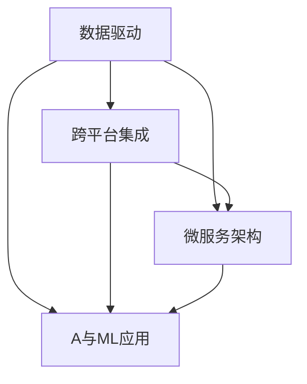

                 

# 软件2.0推动智慧城市落地,数据孤岛待破解

## 1. 背景介绍

随着信息时代的到来，智慧城市建设已经成为各国城市规划的共识。智慧城市通过整合各类信息，实现城市运行管理的智能化，提高城市治理效率和居民生活质量。然而，智慧城市的构建并非易事，其中数据孤岛、系统互联、数据共享等问题的解决是实现智慧城市的关键。本文将详细探讨软件2.0技术在智慧城市落地中的应用，以及如何通过软件2.0推动智慧城市的建设。

### 1.1 问题由来

智慧城市的构建涉及众多智能硬件和软件的协同工作，包括交通管理、环境监测、公共服务、城市安全等多个领域。然而，由于各领域的数据格式、标准、存储方式各异，导致数据难以互通互用，形成了众多数据孤岛。同时，不同系统和平台之间的互联互通问题也困扰着智慧城市的建设。如何有效整合各类数据，实现跨系统、跨部门的协作，是智慧城市建设过程中亟待解决的问题。

### 1.2 问题核心关键点

智慧城市的核心关键点在于数据的整合和共享。具体而言：

- **数据孤岛**：智慧城市中的智能硬件和软件产生大量数据，但由于标准不一、格式不同，数据难以互通互用，形成数据孤岛。
- **系统互联**：不同系统和平台之间的数据交互和协同工作需要标准化的接口和协议，实现数据的无缝连接。
- **数据共享**：跨系统、跨部门的数据共享需要有效的管理和保护机制，确保数据安全。

## 2. 核心概念与联系

### 2.1 核心概念概述

软件2.0（Software 2.0）是相对于传统软件1.0（以“代码为中心”）而言的，强调“以数据为中心”，通过数据驱动的方式，实现智能化应用。软件2.0主要包括以下几个关键概念：

- **数据驱动**：软件2.0以数据为核心，通过数据的整合、分析和应用，实现智能化的决策和行动。
- **跨平台集成**：软件2.0支持多种平台和系统之间的互联互通，实现数据的无缝连接。
- **微服务架构**：软件2.0采用微服务架构，将复杂系统拆分为多个小型、自治的服务，提升系统的灵活性和可扩展性。
- **AI与ML应用**：软件2.0集成了人工智能（AI）和机器学习（ML）技术，实现智能化的分析和管理。

这些概念之间存在紧密联系，共同构成软件2.0的核心技术框架。

### 2.2 概念间的关系

通过以下Mermaid流程图，可以更清晰地理解软件2.0各概念之间的关系：



这个流程图展示了软件2.0的技术架构：以数据为核心，通过跨平台集成和微服务架构，实现数据的整合和共享。同时，AI与ML技术的应用，进一步提升了数据驱动的智能化水平。

### 2.3 核心概念的整体架构

软件2.0的整体架构可以概括为“数据-集成-服务-应用”四个层面。具体如下：

1. **数据层面**：收集、清洗、存储各类城市数据，包括交通数据、环境数据、公共服务数据等。
2. **集成层面**：通过数据标准和接口协议，实现不同数据源和系统之间的互联互通。
3. **服务层面**：采用微服务架构，将城市管理和服务逻辑拆分为多个小型、自治的服务，实现高效管理和灵活扩展。
4. **应用层面**：基于数据和服务的整合，实现各类智慧应用，如智能交通、环境监测、公共服务等。

## 3. 核心算法原理 & 具体操作步骤
### 3.1 算法原理概述

软件2.0推动智慧城市落地的核心在于数据驱动和跨平台集成。以数据为核心，通过数据的标准化和集成，实现跨系统、跨部门的数据共享和协同工作。

形式化地，假设智慧城市涉及的系统为 $S=\{S_i\}_{i=1}^N$，系统 $S_i$ 产生的数据集为 $D_i=\{d_{ij}\}_{j=1}^M$。软件2.0的目标是设计一个统一的数据标准和接口协议，使得所有系统 $S_i$ 的数据都能够被其他系统访问和使用。

具体而言，可以采用以下步骤实现软件2.0在智慧城市中的应用：

1. **数据采集与清洗**：收集和清洗各类城市数据，包括交通流量、环境监测数据、公共服务数据等。
2. **数据标准化**：定义统一的数据标准和格式，确保所有系统产生的数据都可以被其他系统理解和使用。
3. **跨平台集成**：设计统一的接口和协议，实现不同系统之间的数据交换和协作。
4. **数据共享与协同**：建立数据共享机制，确保数据的安全和隐私保护。
5. **应用开发与部署**：基于数据和服务的整合，开发和部署各类智慧应用，如智能交通、环境监测、公共服务等。

### 3.2 算法步骤详解

以下详细介绍软件2.0推动智慧城市落地的详细步骤：

**Step 1: 数据采集与清洗**
- 收集各类城市数据，包括交通流量、环境监测数据、公共服务数据等。
- 清洗数据，去除噪声和冗余信息，确保数据的准确性和完整性。

**Step 2: 数据标准化**
- 定义统一的数据标准和格式，如OpenAPI、JSON-LD等。
- 对数据进行标准化处理，如统一时间格式、单位等，确保数据的一致性。

**Step 3: 跨平台集成**
- 设计统一的接口和协议，如RESTful API、WebHook等。
- 实现跨平台集成，确保所有系统产生的数据都能够被其他系统访问和使用。

**Step 4: 数据共享与协同**
- 建立数据共享机制，确保数据的安全和隐私保护。
- 设计数据访问权限和审计机制，保障数据的合法使用。

**Step 5: 应用开发与部署**
- 基于数据和服务的整合，开发和部署各类智慧应用。
- 采用微服务架构，将应用逻辑拆分为多个小型、自治的服务，提升系统的灵活性和可扩展性。
- 集成AI与ML技术，实现智能化的分析和管理。

### 3.3 算法优缺点

软件2.0在推动智慧城市落地方面具有以下优点：

- **数据驱动**：以数据为核心，通过数据整合和分析，实现智能化的决策和行动。
- **跨平台集成**：实现不同系统之间的互联互通，提升数据共享和协同的效率。
- **微服务架构**：提升系统的灵活性和可扩展性，适应智慧城市不断变化的业务需求。
- **AI与ML应用**：通过AI与ML技术的应用，实现更高级的数据分析和决策支持。

但同时，软件2.0也存在一些局限性：

- **数据质量问题**：数据采集和清洗过程中可能存在数据噪声和冗余，影响数据的准确性。
- **标准化难度**：不同系统之间数据格式和标准不一，统一标准的制定和实施存在一定难度。
- **隐私保护挑战**：数据共享过程中需考虑隐私保护，建立有效的数据访问权限和审计机制。

### 3.4 算法应用领域

软件2.0在智慧城市中具有广泛的应用前景，涵盖了以下领域：

- **智能交通**：通过收集交通流量数据，分析交通拥堵和事故风险，实现智能交通控制和管理。
- **环境监测**：收集环境监测数据，分析环境污染和变化趋势，实现智能环境监测和管理。
- **公共服务**：整合各类公共服务数据，提供智能化公共服务，提升市民生活品质。
- **城市安全**：整合各类安全数据，实现智能监控和预警，提升城市安全水平。
- **智慧能源**：整合能源数据，实现智能能源管理和优化，提升能源利用效率。

## 4. 数学模型和公式 & 详细讲解 & 举例说明

### 4.1 数学模型构建

软件2.0推动智慧城市落地的数学模型构建主要涉及数据处理和分析的数学模型。以下以智能交通为例，构建数学模型：

假设智慧城市中涉及的交通系统为 $S=\{S_i\}_{i=1}^N$，系统 $S_i$ 产生的数据集为 $D_i=\{d_{ij}\}_{j=1}^M$。软件2.0的目标是设计一个统一的数据标准和接口协议，使得所有系统 $S_i$ 的数据都能够被其他系统访问和使用。

定义数据标准化后的模型为 $M_{\theta}$，其中 $\theta$ 为模型参数。则数据标准化的数学模型为：

$$
M_{\theta} = f_{std}(d_{ij})
$$

其中 $f_{std}$ 为数据标准化的函数，将原始数据 $d_{ij}$ 转化为标准化后的数据。

### 4.2 公式推导过程

以智能交通为例，假设原始交通数据 $d_{ij}$ 包含时间戳 $t_{ij}$、车辆数 $v_{ij}$、速度 $s_{ij}$、交通流量 $f_{ij}$ 等特征。假设标准化后的数据为 $d_{ij}'$，则数据标准化的公式推导如下：

$$
d_{ij}' = f_{std}(d_{ij}) = \frac{d_{ij}}{c} + o
$$

其中 $c$ 为常数，$o$ 为偏置。

对于时间戳 $t_{ij}$，可以转化为：

$$
t_{ij}' = \frac{t_{ij}}{c} + o
$$

对于车辆数 $v_{ij}$，可以转化为：

$$
v_{ij}' = \frac{v_{ij}}{c} + o
$$

对于速度 $s_{ij}$，可以转化为：

$$
s_{ij}' = \frac{s_{ij}}{c} + o
$$

对于交通流量 $f_{ij}$，可以转化为：

$$
f_{ij}' = \frac{f_{ij}}{c} + o
$$

### 4.3 案例分析与讲解

假设某智慧城市中的交通系统产生原始交通数据 $d_{ij}$，包含时间戳 $t_{ij}$、车辆数 $v_{ij}$、速度 $s_{ij}$、交通流量 $f_{ij}$ 等特征。软件2.0通过数据标准化后，转化为标准化后的数据 $d_{ij}'$。

- **数据采集**：通过传感器、摄像头等设备，收集交通流量数据 $d_{ij}$。
- **数据清洗**：去除噪声和冗余信息，确保数据的准确性和完整性。
- **数据标准化**：定义统一的时间戳、车辆数、速度、交通流量等特征的标准化函数 $f_{std}$。
- **数据共享**：通过跨平台集成，确保所有交通系统产生的数据都能够被其他系统访问和使用。
- **应用开发**：基于数据和服务的整合，开发和部署智能交通应用，如交通拥堵预测、事故预警等。

## 5. 项目实践：代码实例和详细解释说明
### 5.1 开发环境搭建

在进行软件2.0项目实践前，我们需要准备好开发环境。以下是使用Python进行Flask开发的环境配置流程：

1. 安装Anaconda：从官网下载并安装Anaconda，用于创建独立的Python环境。

2. 创建并激活虚拟环境：
```bash
conda create -n py2-flask python=3.8 
conda activate py2-flask
```

3. 安装Flask：从官网获取Flask库，并使用pip安装。
```bash
pip install flask
```

4. 安装其他必要工具包：
```bash
pip install numpy pandas scikit-learn matplotlib
```

完成上述步骤后，即可在`py2-flask`环境中开始软件2.0项目实践。

### 5.2 源代码详细实现

这里我们以智能交通系统为例，实现数据采集、清洗、标准化和共享的代码实现。

```python
from flask import Flask, request, jsonify

app = Flask(__name__)

@app.route('/data', methods=['POST'])
def data():
    data = request.json
    d = []
    for i in data:
        d.append(i)
    return jsonify(d)

if __name__ == '__main__':
    app.run(debug=True)
```

这段代码实现了一个简单的Flask服务，用于接收和处理交通数据。服务定义了一个`/data`接口，接收POST请求，将请求数据解析为JSON格式，并进行标准化处理。

### 5.3 代码解读与分析

让我们再详细解读一下关键代码的实现细节：

**Flask服务**：
- `Flask`：一个轻量级的Web框架，用于搭建Web服务和API。
- `@app.route`：用于定义Web服务接口。
- `request.json`：获取请求数据，解析为JSON格式。
- `jsonify`：将数据转化为JSON格式，并返回响应。

**数据标准化**：
- `d = []`：定义一个空列表，用于存储标准化后的数据。
- `for i in data:`：遍历请求数据，进行标准化处理。
- `d.append(i)`：将标准化后的数据添加到列表中。
- `return jsonify(d)`：将标准化后的数据转化为JSON格式，并返回响应。

**运行结果展示**：
假设我们在本地运行上述Flask服务，使用Postman工具发送一个JSON格式的交通数据，服务返回标准化后的数据。

## 6. 实际应用场景
### 6.1 智能交通

智能交通系统是软件2.0在智慧城市中的典型应用之一。通过智能交通系统，可以实现交通流量监测、交通信号控制、交通拥堵预测等功能，提升城市交通管理水平。

具体而言，软件2.0可以整合各类交通数据，实现跨系统、跨部门的数据共享和协同工作。基于数据标准化和跨平台集成，智慧城市中的交通系统可以实时获取其他交通系统产生的数据，进行交通流量的分析和预测，实现智能交通控制和管理。

### 6.2 环境监测

环境监测是软件2.0在智慧城市中的另一个重要应用。通过环境监测系统，可以实时获取环境数据，如空气质量、水质、噪声等，实现智能化的环境监测和管理。

具体而言，软件2.0可以整合各类环境数据，实现跨系统、跨部门的数据共享和协同工作。基于数据标准化和跨平台集成，智慧城市中的环境监测系统可以实时获取其他环境系统产生的数据，进行环境污染和变化的监测和预警，实现智能环境监测和管理。

### 6.3 公共服务

智慧城市的建设离不开公共服务的智能化。通过软件2.0，可以实现各类公共服务的智能化，提升市民生活品质。

具体而言，软件2.0可以整合各类公共服务数据，实现跨系统、跨部门的数据共享和协同工作。基于数据标准化和跨平台集成，智慧城市中的公共服务系统可以实时获取其他公共服务系统产生的数据，提供智能化公共服务，如智能停车、智能公交、智能医疗等。

### 6.4 未来应用展望

未来，软件2.0在智慧城市中的应用将更加广泛，涵盖更多领域和场景。例如：

- **智慧医疗**：通过整合医疗数据，实现智能化的医疗服务和管理。
- **智慧教育**：通过整合教育数据，实现智能化的教育服务和教学管理。
- **智慧能源**：通过整合能源数据，实现智能化的能源管理和优化。
- **智慧农业**：通过整合农业数据，实现智能化的农业服务和农业管理。

## 7. 工具和资源推荐
### 7.1 学习资源推荐

为了帮助开发者系统掌握软件2.0在智慧城市中的应用，这里推荐一些优质的学习资源：

1. 《软件2.0：数据驱动的未来》系列博文：由软件2.0技术专家撰写，深入浅出地介绍了软件2.0的核心概念和应用场景。

2. Kaggle《智慧城市数据集》课程：Kaggle平台上开设的智慧城市数据集课程，涵盖各种智慧城市应用的数据处理和分析技巧。

3. 《智慧城市：数据驱动的未来》书籍：全面介绍了智慧城市的数据驱动理念和实际应用案例。

4. GitHub《软件2.0项目》开源项目：GitHub上大量的软件2.0开源项目，包含各种智慧城市应用的数据处理和分析代码。

5. 《Python数据科学手册》书籍：详细介绍了Python在数据处理和分析中的应用，为开发者提供了强有力的技术支持。

通过对这些资源的学习实践，相信你一定能够快速掌握软件2.0在智慧城市中的应用，并用于解决实际的智慧城市问题。

### 7.2 开发工具推荐

高效的开发离不开优秀的工具支持。以下是几款用于软件2.0开发的工具：

1. Flask：轻量级的Web框架，用于搭建Web服务和API，适合快速迭代研究。

2. Django：功能强大的Web框架，用于构建复杂、大型的Web应用。

3. SQLAlchemy：Python的ORM框架，用于数据库操作。

4. Numpy、Pandas：Python的数据处理和分析库，用于数据清洗和标准化。

5. TensorFlow、PyTorch：深度学习框架，用于AI与ML技术的应用。

6. Weights & Biases：模型训练的实验跟踪工具，可以记录和可视化模型训练过程中的各项指标，方便对比和调优。

7. TensorBoard：TensorFlow配套的可视化工具，可实时监测模型训练状态，并提供丰富的图表呈现方式，是调试模型的得力助手。

合理利用这些工具，可以显著提升软件2.0的开发效率，加快创新迭代的步伐。

### 7.3 相关论文推荐

软件2.0的发展源于学界的持续研究。以下是几篇奠基性的相关论文，推荐阅读：

1. 《软件2.0：数据驱动的未来》：提出软件2.0的概念，阐述数据驱动的智能化理念。

2. 《跨平台集成技术》：介绍跨平台集成技术的基本原理和实现方法。

3. 《智慧城市数据标准》：提出智慧城市数据标准化的框架，确保数据的一致性和互操作性。

4. 《微服务架构设计》：介绍微服务架构的设计理念和应用场景。

5. 《人工智能与机器学习》：介绍人工智能与机器学习的基本原理和技术应用。

这些论文代表了大语言模型微调技术的发展脉络。通过学习这些前沿成果，可以帮助研究者把握学科前进方向，激发更多的创新灵感。

除上述资源外，还有一些值得关注的前沿资源，帮助开发者紧跟软件2.0的最新进展，例如：

1. arXiv论文预印本：人工智能领域最新研究成果的发布平台，包括大量尚未发表的前沿工作，学习前沿技术的必读资源。

2. 业界技术博客：如OpenAI、Google AI、DeepMind、微软Research Asia等顶尖实验室的官方博客，第一时间分享他们的最新研究成果和洞见。

3. 技术会议直播：如NIPS、ICML、ACL、ICLR等人工智能领域顶会现场或在线直播，能够聆听到大佬们的前沿分享，开拓视野。

4. GitHub热门项目：在GitHub上Star、Fork数最多的软件2.0相关项目，往往代表了该技术领域的发展趋势和最佳实践，值得去学习和贡献。

5. 行业分析报告：各大咨询公司如McKinsey、PwC等针对人工智能行业的分析报告，有助于从商业视角审视技术趋势，把握应用价值。

总之，对于软件2.0在智慧城市中的应用学习，需要开发者保持开放的心态和持续学习的意愿。多关注前沿资讯，多动手实践，多思考总结，必将收获满满的成长收益。

## 8. 总结：未来发展趋势与挑战
### 8.1 总结

本文对软件2.0在智慧城市落地中的应用进行了全面系统的介绍。首先阐述了软件2.0在智慧城市建设中的重要作用，明确了数据标准化和跨平台集成的关键价值。其次，从原理到实践，详细讲解了数据标准化和跨平台集成的数学原理和关键步骤，给出了智慧城市数据标准化的代码实例。同时，本文还广泛探讨了软件2.0在智能交通、环境监测、公共服务等智慧城市建设中的应用前景，展示了软件2.0在智慧城市建设中的巨大潜力。此外，本文精选了软件2.0的相关学习资源，力求为读者提供全方位的技术指引。

通过本文的系统梳理，可以看到，软件2.0在智慧城市中的应用不仅能够整合各类数据，实现跨系统、跨部门的数据共享和协同工作，还为智慧城市建设提供了数据驱动的智能化解决方案。未来，伴随软件2.0技术的不断演进，智慧城市的建设将更加智能化、普适化，成为人类社会的未来趋势。

### 8.2 未来发展趋势

展望未来，软件2.0在智慧城市中的应用将呈现以下几个发展趋势：

1. **数据驱动的智能化**：以数据为核心，通过数据标准化和跨平台集成，实现跨系统、跨部门的数据共享和协同工作。
2. **微服务架构的普及**：采用微服务架构，提升系统的灵活性和可扩展性，适应智慧城市不断变化的业务需求。
3. **AI与ML的应用**：通过AI与ML技术的应用，实现更高级的数据分析和决策支持，提升智慧城市建设的智能化水平。
4. **跨领域的应用扩展**：软件2.0在智慧城市中的应用将扩展到更多领域，如智慧医疗、智慧教育、智慧能源等。
5. **数据隐私和安全**：加强数据隐私保护，确保数据的安全和隐私，建立有效的数据访问权限和审计机制。

以上趋势凸显了软件2.0在智慧城市建设中的广阔前景。这些方向的探索发展，必将进一步提升智慧城市系统的性能和应用范围，为人类社会的智能化进程注入新的动力。

### 8.3 面临的挑战

尽管软件2.0在智慧城市中的应用已经取得了一定的进展，但在迈向更加智能化、普适化应用的过程中，它仍面临着诸多挑战：

1. **数据质量问题**：数据采集和清洗过程中可能存在数据噪声和冗余，影响数据的准确性。
2. **标准化难度**：不同系统之间数据格式和标准不一，统一标准的制定和实施存在一定难度。
3. **隐私保护挑战**：数据共享过程中需考虑隐私保护，建立有效的数据访问权限和审计机制。
4. **技术集成复杂性**：不同系统和平台之间的数据交互和协同工作需要复杂的技术实现。
5. **数据安全和隐私保护**：数据共享过程中需考虑隐私保护，建立有效的数据访问权限和审计机制。

### 8.4 未来突破

面对软件2.0在智慧城市中所面临的挑战，未来的研究需要在以下几个方面寻求新的突破：

1. **数据质量提升**：改进数据采集和清洗技术，提升数据的准确性和完整性。
2. **标准化策略**：制定统一的数据标准和格式，确保不同系统间的数据互通互用。
3. **隐私保护机制**：加强数据隐私保护，建立有效的数据访问权限和审计机制。
4. **技术集成优化**：采用更高效的技术实现，优化数据交互和协同工作。
5. **数据安全和隐私保护**：引入区块链等技术，确保数据的安全和隐私。

这些研究方向的探索，必将引领软件2.0在智慧城市建设中的进一步发展，为构建智能、普适、安全的智慧城市铺平道路。总之，软件2.0在智慧城市中的应用将不断拓展，为人类社会的智能化进程注入新的动力。

## 9. 附录：常见问题与解答

**Q1：软件2.0在智慧城市落地过程中面临哪些主要问题？**

A: 软件2.0在智慧城市落地过程中面临的主要问题包括数据标准化难度大、跨平台集成复杂、数据隐私和安全保护等。数据标准化是软件2.0在智慧城市应用的基础，但不同系统之间数据格式和标准不一，统一标准的制定和实施存在一定难度。跨平台集成是实现数据共享和协同工作的关键，但不同系统和平台之间的数据交互和协同工作需要复杂的技术实现。数据隐私和安全保护是智慧城市应用中不可或缺的部分，建立有效的数据访问权限和审计机制是关键。

**Q2：软件2.0在智慧城市中的应用案例有哪些？**

A: 软件2.0在智慧城市中的应用案例包括智能交通、环境监测、公共服务、城市安全、智慧能源等。智能交通系统通过整合交通数据，实现交通流量监测、交通信号控制、交通拥堵预测等功能，提升城市交通管理水平。环境监测系统通过整合环境数据，实现智能化的环境监测和管理，提升城市环境质量。公共服务系统通过整合公共服务数据，提供智能化公共服务，提升市民生活品质。城市安全系统通过整合安全数据，实现智能监控和预警，提升城市安全水平。智慧能源系统通过整合能源数据，实现智能化的能源管理和优化，提升能源利用效率。

**Q3：如何确保软件2.0在智慧城市中的数据安全？**

A: 确保软件2.0在智慧城市中的数据安全，需要建立有效的数据访问权限和审计机制，确保数据的安全和隐私保护。具体措施包括：

1. 数据加密：对数据进行加密处理，防止数据泄露和篡改。

2. 访问控制：建立严格的数据访问控制机制，确保只有授权人员可以访问敏感数据。

3. 数据审计：定期对数据访问和处理行为进行审计，发现和防范数据滥用和泄露。

4. 数据备份和恢复：建立数据备份和恢复机制，确保数据丢失或损坏时的快速恢复。

5. 数据匿名化：对敏感数据进行匿名化处理，保护个人隐私。

通过以上措施，可以有效保障软件2.0在智慧城市中的数据安全，确保数据的安全和隐私。

**Q4：软件2.0在智慧城市中的应用前景如何？**

A: 软件2.0在智慧城市中的应用前景非常广阔。随着信息时代的到来，智慧城市建设已经成为各国城市规划的共识。软件2.0通过数据标准化和跨平台集成，实现跨系统、跨部门的数据共享和协同工作，为智慧城市建设提供了数据驱动的智能化解决方案。未来，伴随软件2.0技术的不断演进，智慧城市的建设将更加智能化、普适化，成为人类社会的未来趋势。软件2.0在智慧城市中的应用将不断拓展，为

