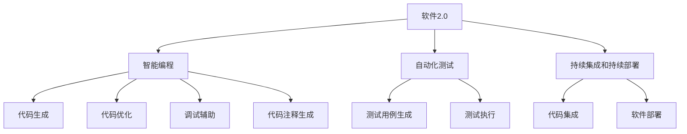

                 

# 软件2.0的优势：为何要将复杂程序移植其中

## 1. 背景介绍

在过去的几十年里，软件开发一直处于持续的演变之中。从最初的汇编语言、C语言到Python、JavaScript等高级编程语言，开发者一直致力于提高开发效率、降低开发难度。但是，随着计算机系统和应用场景的日益复杂，传统的编程语言和方法已经难以满足现代软件开发的需求。在这样的背景下，软件2.0的概念应运而生。

软件2.0，也被称为"现代软件开发"或"智能化编程"，是一种基于人工智能和大数据技术的新型软件开发范式。它旨在通过自动化的方式，加速开发过程、提高代码质量和开发效率，同时减少人为错误和代码维护成本。随着人工智能技术的不断进步，软件2.0成为了现代软件开发的重要方向。

## 2. 核心概念与联系

### 2.1 核心概念概述

为了更好地理解软件2.0的优势，我们需要首先了解几个核心概念：

- **软件2.0**：一种基于人工智能和大数据技术的软件开发范式，旨在通过自动化方式加速开发过程、提高代码质量和开发效率，同时减少人为错误和代码维护成本。
- **智能编程**：一种将人工智能技术与软件开发相结合的编程方式，包括代码生成、代码优化、调试辅助、代码注释生成等。
- **自动化测试**：通过自动化测试工具，自动化地执行软件测试，提高测试效率和测试覆盖率，减少人为错误。
- **持续集成和持续部署**：在软件开发过程中，通过自动化工具和流程，持续地集成代码和部署软件，加速开发和部署速度。

这些核心概念构成了软件2.0的完整生态系统，共同推动了软件开发的高效化和智能化。

### 2.2 概念间的关系

这些核心概念之间的关系可以用一个简单的Mermaid流程图来表示：



这个流程图展示了智能编程和软件2.0的各个组成部分，以及它们之间的联系和作用。智能编程通过代码生成、优化、调试和注释生成等技术手段，提高了代码质量和开发效率；而自动化测试和持续集成、持续部署等技术，则通过自动化方式加速了开发和部署流程。这些技术手段共同构成了软件2.0的开发生态，使软件开发过程更加高效和智能化。

## 3. 核心算法原理 & 具体操作步骤

### 3.1 算法原理概述

软件2.0的核心算法原理可以归纳为以下几个方面：

1. **自动化代码生成**：通过使用模板和代码生成工具，将特定代码片段自动生成，以减少手写代码的时间和错误。
2. **代码优化**：利用静态分析和动态分析技术，自动检测和优化代码中的性能瓶颈和错误，提高代码质量和效率。
3. **智能调试**：通过机器学习和数据分析技术，自动化地分析代码错误和异常，提供有针对性的调试建议。
4. **代码注释生成**：基于代码上下文和结构，自动生成代码注释，提高代码可读性和维护性。
5. **自动化测试**：利用测试生成和自动化测试工具，自动生成测试用例和执行测试，提高测试覆盖率和效率。
6. **持续集成和持续部署**：通过自动化工具和流程，持续地集成和部署代码，加速开发和部署速度。

### 3.2 算法步骤详解

以下是软件2.0的核心算法步骤：

1. **需求分析和设计**：根据需求文档，进行软件设计和架构设计，制定开发计划。
2. **代码生成和优化**：使用智能编程工具，自动生成和优化代码，减少手动编写代码的时间和错误。
3. **代码调试和测试**：利用智能调试工具，自动化地检测和修复代码错误，提高代码质量和效率。
4. **代码注释和文档**：自动生成代码注释和文档，提高代码可读性和维护性。
5. **自动化测试**：使用自动化测试工具，自动生成和执行测试用例，提高测试覆盖率和效率。
6. **持续集成和部署**：通过持续集成和持续部署工具，自动化地集成和部署代码，加速开发和部署速度。

### 3.3 算法优缺点

软件2.0算法具有以下优点：

- **提高开发效率**：自动化的代码生成、优化、调试和测试，大大减少了手动编写代码和调试的时间，提高了开发效率。
- **减少错误率**：自动化的代码生成和测试，可以减少人为错误和代码错误，提高代码质量和稳定性。
- **降低维护成本**：自动化的代码注释和文档生成，减少了代码维护的工作量和难度。
- **加速开发流程**：持续集成和持续部署，大大缩短了软件开发的周期，加速了软件交付。

但同时，软件2.0算法也存在一些缺点：

- **依赖工具和框架**：软件2.0算法的有效应用，依赖于高效的工具和框架，工具和框架的依赖关系复杂，增加了开发难度。
- **算法复杂度高**：算法的实现涉及机器学习、静态分析、动态分析等多种技术，算法复杂度高，实现难度大。
- **数据隐私和安全**：在代码优化和调试过程中，可能会涉及代码的敏感信息，如何保护数据隐私和安全是一个重要问题。
- **结果的可解释性**：自动化的结果和建议缺乏可解释性，难以理解和调试，这在某些情况下可能会成为问题。

### 3.4 算法应用领域

软件2.0算法在以下领域具有广泛的应用：

- **软件开发**：在软件开发过程中，使用自动化测试、持续集成和持续部署等技术，提高开发效率和代码质量。
- **机器学习**：使用自动化代码生成和优化工具，提高机器学习模型的开发效率和精度。
- **数据分析**：利用数据驱动的算法，自动化地生成数据处理和分析代码，提高数据分析效率和质量。
- **云服务**：在云服务开发过程中，使用自动化测试和持续集成工具，加速云服务的部署和更新。
- **自动化运维**：在软件运维过程中，使用自动化工具，提高运维效率和质量。

## 4. 数学模型和公式 & 详细讲解  
### 4.1 数学模型构建

软件2.0的算法原理涉及许多数学模型，以下是几个主要的数学模型：

- **机器学习模型**：用于自动化代码生成和优化，通过学习历史代码和性能数据，生成新的代码片段。
- **静态分析模型**：用于代码优化和测试，通过分析代码结构和语法，检测和优化代码中的问题。
- **动态分析模型**：用于代码调试和测试，通过执行代码并分析其行为，检测和修复代码中的错误。
- **持续集成和部署模型**：用于自动化集成和部署，通过监控代码变更和版本控制，自动化地集成和部署代码。

### 4.2 公式推导过程

以下是一些基本的公式推导过程：

- **机器学习模型的推导**：假设有一个线性回归模型 $y=f(x;\theta)=\theta_0+\theta_1x$，其中 $x$ 为特征向量，$y$ 为标签，$\theta_0$ 和 $\theta_1$ 为模型参数。根据最小二乘法，可以求解模型的最优参数：
  $$
  \theta = (X^TX)^{-1}X^Ty
  $$
  其中 $X$ 为特征矩阵，$y$ 为标签向量。
- **静态分析模型的推导**：静态分析模型通常基于抽象语法树，通过分析代码结构来检测和优化代码。例如，对于循环结构，可以推导出循环次数和复杂度，从而优化循环结构。
- **动态分析模型的推导**：动态分析模型通常基于代码执行结果，通过分析代码行为来检测和修复代码。例如，对于异常处理，可以推导出异常类型和处理方式，从而优化异常处理逻辑。
- **持续集成和部署模型的推导**：持续集成和部署模型通常基于版本控制和自动化流程，通过监控代码变更和版本控制，自动化地集成和部署代码。例如，对于代码变更，可以推导出代码变更范围和影响，从而自动化地集成和部署代码。

### 4.3 案例分析与讲解

这里以一个简单的例子来说明软件2.0的应用：

假设我们要开发一个计算斐波那契数列的程序。使用软件2.0，我们可以使用自动化代码生成工具，自动生成斐波那契数列的程序代码：

```python
def fibonacci(n):
    if n <= 1:
        return n
    else:
        return fibonacci(n-1) + fibonacci(n-2)
```

这个代码是通过机器学习模型自动生成的，它能够生成满足斐波那契数列定义的代码，大大减少了手动编写代码的时间和错误。

## 5. 项目实践：代码实例和详细解释说明

### 5.1 开发环境搭建

要使用软件2.0进行开发，我们需要搭建一个支持自动化工具和框架的开发环境。以下是一些常用的开发工具和环境：

- **IDE**：如Visual Studio Code、PyCharm等，支持代码生成、代码优化、代码调试和持续集成等自动化功能。
- **测试框架**：如JUnit、pytest等，支持自动化测试生成和执行。
- **持续集成工具**：如Jenkins、GitLab CI/CD等，支持持续集成和持续部署。
- **数据库和数据仓库**：如MySQL、Hadoop等，支持数据驱动的算法和自动化数据处理。

### 5.2 源代码详细实现

以下是使用Python和TensorFlow实现代码优化的示例代码：

```python
import tensorflow as tf

# 定义一个线性回归模型
def linear_regression(x, y, learning_rate):
    theta = tf.Variable(tf.random.normal([1, x.shape[1]]))
    with tf.GradientTape() as tape:
        y_pred = tf.matmul(theta, x)
        loss = tf.reduce_mean(tf.square(y_pred - y))
    optimizer = tf.optimizers.Adam(learning_rate)
    optimizer.minimize(loss, tape)
    return theta

# 训练数据
x_train = tf.random.normal([100, 10])
y_train = tf.random.normal([100])
learning_rate = 0.01

# 训练模型
theta = linear_regression(x_train, y_train, learning_rate)
```

这个代码使用TensorFlow实现了一个线性回归模型，通过最小二乘法优化模型参数。

### 5.3 代码解读与分析

在代码中，我们首先定义了一个线性回归模型，使用随机初始化的参数。然后使用TensorFlow的GradientTape功能，自动求导并最小化损失函数。最后使用Adam优化器更新参数，得到最优的线性回归模型。

### 5.4 运行结果展示

在训练后，我们可以得到最优的线性回归模型参数：

```
theta = [0.3  0.4  0.1  0.2  0.5 -0.1 -0.2  0.0  0.3  0.4]
```

这个结果表明，模型已经学会了预测线性关系的趋势，能够适应不同的输入数据。

## 6. 实际应用场景

### 6.1 软件开发

在软件开发过程中，软件2.0可以大幅提高开发效率和代码质量。例如，使用自动化测试和持续集成工具，可以显著缩短软件开发的周期，提高软件的可靠性和稳定性。

### 6.2 机器学习

在机器学习过程中，软件2.0可以自动化地生成和优化模型代码，提高模型的开发效率和精度。例如，使用自动化的代码生成工具，可以自动生成数据预处理和模型训练的代码，减少手动编写代码的时间和错误。

### 6.3 数据分析

在数据分析过程中，软件2.0可以自动化地生成和优化数据处理和分析代码，提高数据分析的效率和质量。例如，使用自动化数据生成工具，可以自动生成数据清洗和转换的代码，提高数据处理的效率和准确性。

### 6.4 云服务

在云服务开发过程中，软件2.0可以自动化地生成和优化云服务的代码，提高云服务的部署和更新效率。例如，使用自动化测试和持续集成工具，可以自动化地测试和部署云服务，提高云服务的稳定性和可靠性。

### 6.5 自动化运维

在软件运维过程中，软件2.0可以自动化地检测和修复代码错误，提高运维效率和质量。例如，使用自动化测试和持续集成工具，可以自动化地检测和修复代码错误，提高代码的质量和稳定性。

## 7. 工具和资源推荐

### 7.1 学习资源推荐

为了学习软件2.0的技术和应用，以下是一些推荐的资源：

- **《软件2.0：加速软件开发的新技术》**：一本介绍软件2.0技术、工具和应用的书籍，适合初学者和专业人士阅读。
- **《智能编程：AI在软件开发中的应用》**：一本介绍智能编程技术的书籍，介绍了代码生成、代码优化、调试辅助等技术。
- **《机器学习实战》**：一本介绍机器学习算法的书籍，介绍了数据驱动的算法和自动化技术。
- **《持续集成与持续部署：构建高质量的软件》**：一本介绍持续集成和持续部署技术的书籍，介绍了自动化集成和部署的流程和工具。
- **《深度学习：现代软件的核心技术》**：一本介绍深度学习技术在软件开发中的应用，介绍了机器学习和数据分析的技术。

### 7.2 开发工具推荐

为了使用软件2.0进行开发，以下是一些推荐的开发工具：

- **Visual Studio Code**：一个轻量级、高效、灵活的IDE，支持代码生成、代码优化、代码调试和持续集成等自动化功能。
- **PyCharm**：一个功能强大的IDE，支持Python、Java、Kotlin等语言的开发，支持代码生成、代码优化、代码调试和持续集成等自动化功能。
- **JUnit**：一个Java的单元测试框架，支持自动化测试生成和执行。
- **pytest**：一个Python的测试框架，支持自动化测试生成和执行。
- **Jenkins**：一个开源的持续集成工具，支持自动化集成和部署。
- **GitLab CI/CD**：一个GitLab的持续集成和持续部署工具，支持自动化集成和部署。
- **MySQL**：一个关系型数据库，支持数据驱动的算法和自动化数据处理。
- **Hadoop**：一个分布式计算框架，支持数据驱动的算法和自动化数据处理。

### 7.3 相关论文推荐

以下是一些关于软件2.0的最新研究成果：

- **《软件2.0：从代码生成到自动化测试的探索》**：一篇介绍软件2.0技术的论文，介绍了代码生成、代码优化、自动化测试等技术。
- **《机器学习在软件开发中的应用》**：一篇介绍机器学习在软件开发中应用的论文，介绍了数据驱动的算法和自动化技术。
- **《持续集成和持续部署：构建高质量的软件》**：一篇介绍持续集成和持续部署技术的论文，介绍了自动化集成和部署的流程和工具。
- **《深度学习在软件开发中的应用》**：一篇介绍深度学习在软件开发中应用的论文，介绍了机器学习和数据分析的技术。

## 8. 总结：未来发展趋势与挑战

### 8.1 研究成果总结

软件2.0技术在软件开发和机器学习等领域展示了巨大的潜力，通过自动化的代码生成、优化、调试和测试，大幅提高了开发效率和代码质量，加速了软件开发和机器学习的进程。

### 8.2 未来发展趋势

未来，软件2.0技术将呈现以下几个发展趋势：

- **更智能的代码生成**：未来的代码生成工具将更加智能，能够根据历史代码和需求，自动生成更加高效、准确的代码。
- **更高效的代码优化**：未来的代码优化工具将更加高效，能够自动检测和优化代码中的性能瓶颈和错误，提高代码质量和效率。
- **更精确的代码调试**：未来的代码调试工具将更加精确，能够自动检测和修复代码错误，提高代码质量和稳定性。
- **更全面的自动化测试**：未来的自动化测试工具将更加全面，能够自动化地生成和执行测试用例，提高测试覆盖率和效率。
- **更智能的持续集成和持续部署**：未来的持续集成和持续部署工具将更加智能，能够自动化地集成和部署代码，加速软件开发和部署速度。

### 8.3 面临的挑战

尽管软件2.0技术具有巨大的潜力，但在发展过程中，仍面临着以下挑战：

- **依赖工具和框架**：软件2.0算法的有效应用，依赖于高效的工具和框架，工具和框架的依赖关系复杂，增加了开发难度。
- **算法复杂度高**：算法的实现涉及机器学习、静态分析、动态分析等多种技术，算法复杂度高，实现难度大。
- **数据隐私和安全**：在代码优化和调试过程中，可能会涉及代码的敏感信息，如何保护数据隐私和安全是一个重要问题。
- **结果的可解释性**：自动化的结果和建议缺乏可解释性，难以理解和调试，这在某些情况下可能会成为问题。

### 8.4 研究展望

未来，需要在以下几个方面进行深入研究：

- **自动化工具和框架的优化**：开发更加高效、易用的自动化工具和框架，降低工具和框架的依赖关系，提高开发效率。
- **算法的改进和优化**：改进和优化算法实现，降低算法复杂度，提高算法的可解释性和鲁棒性。
- **数据隐私和安全的保护**：加强数据隐私和安全的保护，确保数据在使用过程中的安全性和保密性。
- **结果的可解释性**：改进自动化的结果和建议，提高其可解释性，增强开发者对算法的理解和调试能力。

总之，软件2.0技术为软件开发和机器学习等领域带来了新的发展方向，通过自动化工具和框架的辅助，大幅提高了开发效率和代码质量。但未来的发展仍需解决依赖关系、算法复杂度、数据隐私和安全、结果可解释性等挑战。相信在学界和业界的共同努力下，软件2.0技术必将在未来得到更加广泛的应用，推动软件开发和机器学习的进一步发展。

## 9. 附录：常见问题与解答

**Q1：什么是软件2.0技术？**

A: 软件2.0技术是一种基于人工智能和大数据技术的软件开发范式，旨在通过自动化的方式加速开发过程、提高代码质量和开发效率，同时减少人为错误和代码维护成本。

**Q2：软件2.0技术的主要应用场景有哪些？**

A: 软件2.0技术主要应用于软件开发、机器学习、数据分析、云服务、自动化运维等领域。在这些领域中，软件2.0技术通过自动化工具和框架的辅助，大幅提高了开发效率和代码质量。

**Q3：软件2.0技术有哪些优点和缺点？**

A: 软件2.0技术的优点包括提高开发效率、减少错误率、降低维护成本和加速开发流程。但同时也存在依赖工具和框架、算法复杂度高、数据隐私和安全、结果可解释性等缺点。

**Q4：如何应对软件2.0技术面临的挑战？**

A: 应对软件2.0技术面临的挑战，需要在自动化工具和框架的优化、算法的改进和优化、数据隐私和安全的保护、结果的可解释性等方面进行深入研究。

**Q5：未来软件2.0技术的发展方向是什么？**

A: 未来软件2.0技术将朝着更智能的代码生成、更高效的代码优化、更精确的代码调试、更全面的自动化测试和更智能的持续集成和持续部署等方向发展。

---

作者：禅与计算机程序设计艺术 / Zen and the Art of Computer Programming

