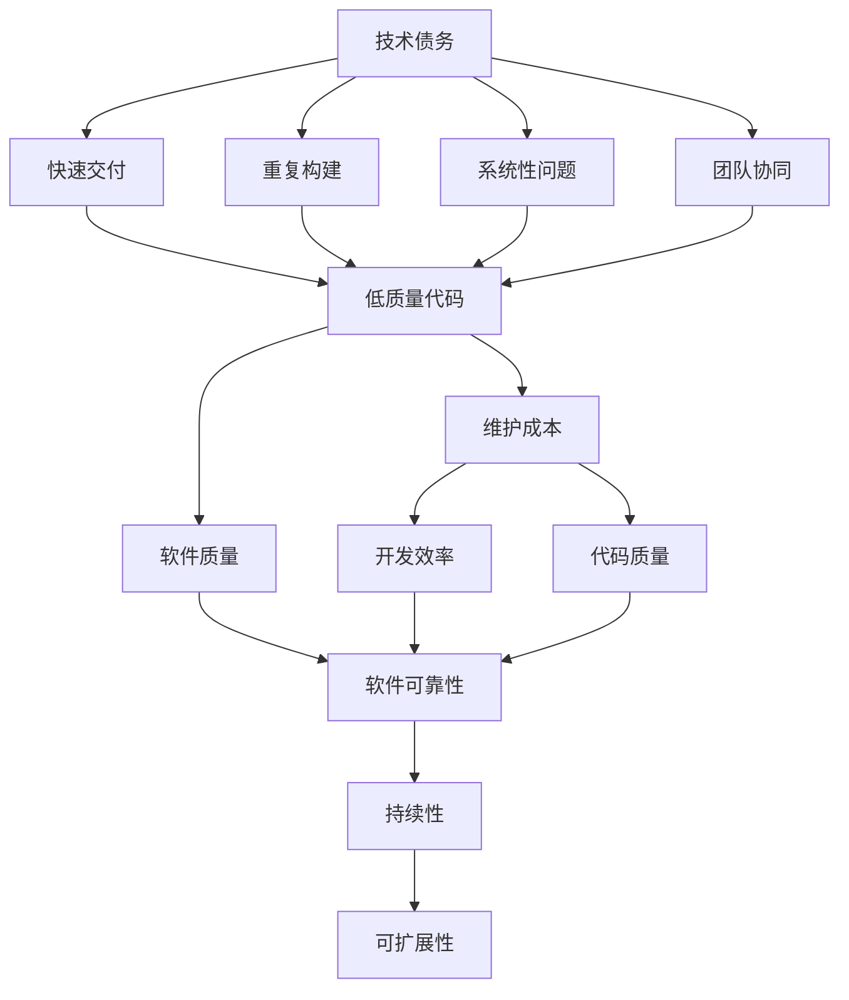
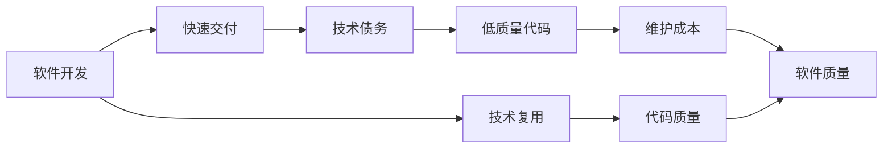
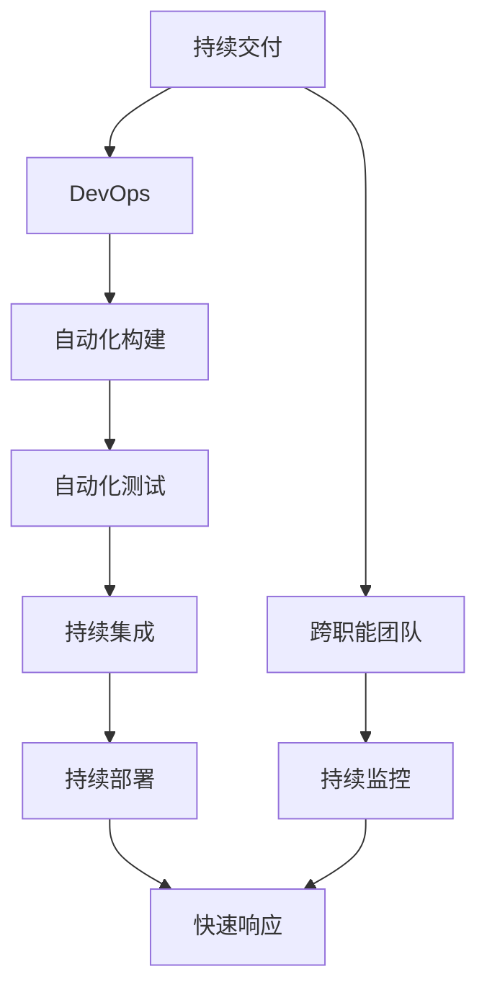
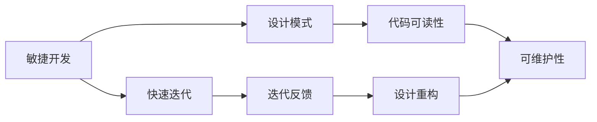
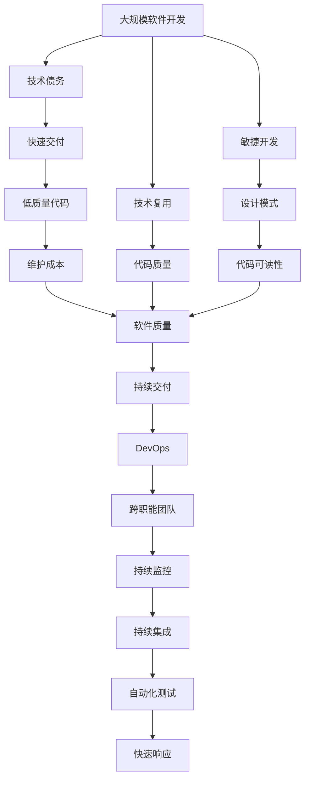

                 

# 软件2.0的技术债务管理策略

> 关键词：软件2.0,技术债务,技术复用,持续交付,DevOps,敏捷开发,设计模式,自动化测试,持续集成

## 1. 背景介绍

### 1.1 问题由来
随着软件工业的快速发展，软件开发方法论也不断演进。从早期的瀑布模型到敏捷开发，再到DevOps，软件开发进入了一个新的时代——软件2.0。软件2.0不仅仅是一个技术的提升，更是一种文化的变革，它强调软件开发的持续性和系统性，追求更高的开发效率和产品质量。

然而，在追求快速迭代和持续交付的过程中，软件开发不可避免地产生了“技术债务”。技术债务是指在软件开发过程中，为了追求快速交付和临时解决某些问题而引入的技术设计或实现欠佳的部分，这些部分在未来的软件开发过程中需要付出额外的努力和时间来修复或升级，如果不加控制，技术债务将会积累并最终导致软件质量下降，影响软件开发的持续性和稳定性。

### 1.2 问题核心关键点
技术债务的问题主要体现在以下几个方面：

- **快速交付**：为了快速响应市场需求，开发团队可能会采用一些快速、简单的开发方式，但这往往会引入一些低质量、难以维护的代码和技术。
- **重复构建**：由于缺乏统一的开发规范和复用组件，不同模块或项目之间可能会重复构建相似的代码和技术，浪费开发资源和时间。
- **系统性问题**：技术债务通常是系统性的，一旦出现，可能需要整个系统的重构或部分重构，代价极高。
- **团队协同**：技术债务不仅影响个体开发者的工作效率，还会对整个团队的协同开发和知识传递产生负面影响。

### 1.3 问题研究意义
有效的技术债务管理策略能够帮助团队降低技术债务，提升软件开发的持续性和稳定性，从而提高软件的质量和可靠性。具体而言，技术债务管理对于以下几个方面的影响显著：

1. **提高开发效率**：通过系统化的技术债务管理，可以有效避免重复构建和低质量代码的产生，提高开发效率和代码质量。
2. **降低维护成本**：通过持续监控和改进技术债务，可以提前发现和修复潜在的问题，降低未来维护的成本和复杂度。
3. **提升团队协作**：通过统一的技术规范和复用组件，可以增强团队协作，减少知识传递的困难和误解。
4. **增强系统可扩展性**：通过及时识别和解决技术债务，可以提升系统的可扩展性和灵活性，支持未来业务的发展。
5. **保障软件质量**：技术债务的积累会影响软件的质量和可靠性，有效的技术债务管理可以确保软件始终处于高质量状态。

## 2. 核心概念与联系

### 2.1 核心概念概述

为更好地理解软件2.0技术债务的管理策略，本节将介绍几个密切相关的核心概念：

- **技术债务**：在软件开发过程中，为了追求快速交付和临时解决某些问题而引入的技术设计或实现欠佳的部分。
- **技术复用**：通过复用已有的技术解决方案或组件，避免重复构建和低质量代码，提高开发效率和代码质量。
- **持续交付**：通过自动化工具和流程，实现软件的快速迭代和持续交付，提升软件开发的效率和质量。
- **DevOps**：一种软件开发和运维的实践方法，强调跨职能团队的协作、持续交付和快速响应。
- **敏捷开发**：一种快速响应变化的软件开发方法，通过迭代和增量交付提升软件开发的灵活性和质量。
- **设计模式**：在软件开发中反复出现的问题及其解决方案，通过复用设计模式，可以提高代码的可读性和可维护性。
- **自动化测试**：通过自动化工具和流程，实现对软件功能和性能的快速测试和验证，减少手动测试的时间和成本。
- **持续集成**：通过自动化构建和测试流程，确保代码的稳定性和可集成性，提高软件的开发效率和质量。

这些核心概念之间的逻辑关系可以通过以下Mermaid流程图来展示：



这个流程图展示了大规模软件开发中技术债务的问题及其与持续交付、DevOps、敏捷开发、设计模式、自动化测试、持续集成等核心概念的紧密联系。

### 2.2 概念间的关系

这些核心概念之间存在着紧密的联系，形成了软件开发和维护的完整生态系统。下面我们通过几个Mermaid流程图来展示这些概念之间的关系。

#### 2.2.1 软件开发与技术债务的关系



这个流程图展示了软件开发过程中快速交付与技术债务之间的关系。快速交付往往会引入技术债务，导致低质量代码的产生，进而增加维护成本，影响软件质量。而技术复用则有助于提升代码质量，减少维护成本。

#### 2.2.2 持续交付与DevOps的关系



这个流程图展示了持续交付与DevOps之间的关系。持续交付是DevOps的核心实践之一，通过自动化构建、测试、集成和部署，确保软件的快速迭代和交付。同时，持续监控确保系统在生产环境中的稳定性和可维护性，跨职能团队协作保障流程的顺畅进行。

#### 2.2.3 敏捷开发与设计模式的关系



这个流程图展示了敏捷开发与设计模式之间的关系。敏捷开发强调快速迭代和持续反馈，通过使用设计模式可以提高代码的可读性和可维护性，帮助团队快速识别和重构设计欠佳的部分，从而提升软件质量和开发效率。

### 2.3 核心概念的整体架构

最后，我们用一个综合的流程图来展示这些核心概念在大规模软件开发过程中的整体架构：



这个综合流程图展示了从大规模软件开发到技术债务管理的完整过程。技术债务的积累影响快速交付和软件质量，但通过技术复用、持续交付、DevOps、敏捷开发、设计模式、自动化测试、持续集成等技术，可以有效地管理和控制技术债务，提升软件的持续性和稳定性。

## 3. 核心算法原理 & 具体操作步骤
### 3.1 算法原理概述

软件2.0技术债务管理的核心思想是通过系统化的管理策略，及时识别和控制技术债务的积累，从而提升软件开发和维护的效率和质量。主要包括以下几个关键步骤：

- **技术债务识别**：通过自动化工具和持续监控，识别出系统中的技术债务。
- **技术债务评估**：评估技术债务的严重程度，确定优先处理的技术债务。
- **技术债务修复**：根据技术债务的严重程度，采取适当的修复策略，如重构、优化、替换等。
- **持续监控与改进**：持续监控技术债务的变化，及时调整和改进技术债务管理策略。

### 3.2 算法步骤详解

软件2.0技术债务管理的具体步骤包括以下几个方面：

#### 3.2.1 技术债务识别

- **自动化工具**：使用自动化工具如SonarQube、CodeClimate等对代码进行静态分析，识别出潜在的技术债务。
- **持续监控**：通过持续监控工具如New Relic、AppDynamics等监控系统性能和代码质量，及时发现技术债务的积累。
- **代码审查**：通过代码审查流程，确保代码符合设计规范和质量标准，减少技术债务的产生。

#### 3.2.2 技术债务评估

- **风险评估**：根据技术债务的严重程度和影响范围，进行风险评估，确定优先处理的技术债务。
- **成本评估**：评估修复技术债务所需的成本和时间，包括人力、资源和技术投入。
- **优先级排序**：根据技术债务的风险和成本评估结果，制定优先级排序，决定先处理哪些技术债务。

#### 3.2.3 技术债务修复

- **重构**：对技术债务严重的部分进行重构，优化代码结构和设计，提高代码可读性和可维护性。
- **优化**：通过改进算法、优化代码结构等方式，提升系统性能和可扩展性。
- **替换**：对于无法修复或优化的问题，考虑替换现有技术方案，采用更先进的技术。

#### 3.2.4 持续监控与改进

- **持续监控**：持续监控技术债务的变化，及时发现和处理新的技术债务。
- **定期评估**：定期评估技术债务管理策略的有效性，调整和改进策略。
- **团队培训**：通过团队培训和知识传递，提升团队对技术债务管理的认识和能力。

### 3.3 算法优缺点

软件2.0技术债务管理方法具有以下优点：

1. **系统化管理**：通过系统化的管理策略，及时识别和控制技术债务的积累，提升软件开发和维护的效率和质量。
2. **持续改进**：持续监控和改进技术债务，及时发现和处理新的问题，确保系统始终处于高质量状态。
3. **团队协同**：通过跨职能团队的协作，提升代码的质量和可维护性，减少知识传递的困难和误解。

同时，该方法也存在一些缺点：

1. **初期投入大**：系统化的管理策略需要投入大量的时间和资源进行初期配置和优化。
2. **技术复杂性高**：技术债务管理涉及多方面的技术手段和工具，需要较高的技术门槛。
3. **依赖工具**：技术债务管理的有效性高度依赖于自动化工具和持续监控工具的可靠性和准确性。

### 3.4 算法应用领域

软件2.0技术债务管理方法已经在软件开发、运维、测试等多个领域得到了广泛应用，具体包括以下几个方面：

1. **软件开发**：通过技术债务管理提升代码质量和开发效率，确保软件开发过程的高效性和稳定性。
2. **运维管理**：通过持续监控和快速响应，及时处理系统中的技术债务，保障系统的稳定性和可用性。
3. **测试管理**：通过自动化测试和持续集成，快速验证代码的质量和稳定性，减少手动测试的时间和成本。
4. **敏捷开发**：通过技术债务管理支持快速迭代和持续反馈，提升敏捷开发的灵活性和效率。
5. **DevOps实践**：通过持续交付和自动化流程，提升DevOps的持续性和稳定性，减少手工操作和人为错误。

## 4. 数学模型和公式 & 详细讲解 & 举例说明
### 4.1 数学模型构建

软件2.0技术债务管理涉及多个维度的数据和指标，如代码质量、性能指标、团队协作等。因此，构建一个综合的数学模型是非常必要的。

设软件系统的技术债务为 $D$，可用性指标为 $U$，稳定性指标为 $S$，开发效率为 $E$，维护成本为 $C$。则技术债务管理的数学模型可以表示为：

$$
\min_{D, U, S, E, C} \left( aD + bU + cS + dE + eC \right)
$$

其中 $a, b, c, d, e$ 为各个指标的权重系数，可以通过实际应用情况进行调整。

### 4.2 公式推导过程

为了更好地理解技术债务管理的数学模型，下面推导其基本形式：

设技术债务为 $D$，可用性指标为 $U$，稳定性指标为 $S$，开发效率为 $E$，维护成本为 $C$。则技术债务管理的目标函数为：

$$
\min_{D, U, S, E, C} \left( aD + bU + cS + dE + eC \right)
$$

其中 $a, b, c, d, e$ 为各个指标的权重系数。

假设开发团队有 $n$ 个成员，每个成员的平均效率为 $e$，则开发效率 $E$ 可以表示为：

$$
E = ne
$$

假设系统稳定性的评估指标为 $S_t$，可用性评估指标为 $U_t$，则系统的总可用性 $U$ 和总稳定性 $S$ 可以表示为：

$$
U = \sum_{t=1}^{T} U_t
$$

$$
S = \sum_{t=1}^{T} S_t
$$

其中 $T$ 为系统的总运行时间。

假设每个技术债务的修复成本为 $C_i$，则维护成本 $C$ 可以表示为：

$$
C = \sum_{i=1}^{I} C_i
$$

其中 $I$ 为技术债务的总数。

通过上述公式，我们可以将技术债务管理的目标函数表示为：

$$
\min_{D, U, S, E, C} \left( aD + bU + cS + dE + eC \right)
$$

通过求解该目标函数，可以得到最优的技术债务管理策略。

### 4.3 案例分析与讲解

假设某公司正在开发一款复杂的电子商务平台，由于时间紧迫，开发团队采用了一些快速开发的方式，导致系统中有大量技术债务积累。开发团队决定使用软件2.0技术债务管理方法，进行系统优化和改进。

首先，使用SonarQube对代码进行静态分析，识别出大量潜在的技术债务，包括代码结构不合理、命名规范不统一等问题。然后，使用New Relic对系统性能进行监控，发现系统在某些关键路径上的响应时间较长，需要优化。

针对这些问题，开发团队制定了技术债务管理策略：

1. **重构**：对代码结构不合理的部分进行重构，提升代码的可读性和可维护性。
2. **优化**：针对响应时间较长的问题，优化系统架构和算法，提升系统性能。
3. **替换**：对于无法修复的问题，考虑替换现有技术方案，采用更先进的技术。
4. **持续监控**：通过持续监控工具，及时发现和处理新的技术债务，避免问题的积累。

通过以上措施，开发团队在三个月内完成了系统的优化和改进，系统性能和可用性显著提升，开发效率和维护成本也有所降低。

## 5. 项目实践：代码实例和详细解释说明
### 5.1 开发环境搭建

在进行技术债务管理实践前，我们需要准备好开发环境。以下是使用Python进行OpenAI的GPT模型开发的环境配置流程：

1. 安装Anaconda：从官网下载并安装Anaconda，用于创建独立的Python环境。

2. 创建并激活虚拟环境：
```bash
conda create -n pytorch-env python=3.8 
conda activate pytorch-env
```

3. 安装PyTorch：根据CUDA版本，从官网获取对应的安装命令。例如：
```bash
conda install pytorch torchvision torchaudio cudatoolkit=11.1 -c pytorch -c conda-forge
```

4. 安装TensorFlow：
```bash
pip install tensorflow
```

5. 安装Transformer库：
```bash
pip install transformers
```

6. 安装各类工具包：
```bash
pip install numpy pandas scikit-learn matplotlib tqdm jupyter notebook ipython
```

完成上述步骤后，即可在`pytorch-env`环境中开始技术债务管理实践。

### 5.2 源代码详细实现

下面我们以代码审查工具SonarQube为例，给出使用Python实现代码静态分析的PyTorch代码实现。

首先，定义代码审查函数：

```python
from sonarpy import SonarQube
from sonarpy.shared.models import Measure
from sonarpy.shared.models import Issue

def analyze_code(sonarqube):
    # 连接SonarQube
    qube = SonarQube(sonarqube.url, login=sonarqube.username, password=sonarqube.password)

    # 查询代码质量指标
    measures = qube.get_measures()
    print("Code Quality: ")
    for measure in measures:
        print(f"{measure.key}: {measure.value} ({measure.trend})")

    # 查询代码问题
    issues = qube.get_issues()
    print("Code Issues: ")
    for issue in issues:
        print(f"{issue.key}: {issue.title} ({issue.severity})")
```

然后，定义SonarQube配置和调用：

```python
# 定义SonarQube配置
sonarqube = {
    'url': 'https://example.com/sonarqube',
    'username': 'username',
    'password': 'password'
}

# 调用代码审查函数
analyze_code(sonarqube)
```

运行上述代码，可以实现对代码进行静态分析，识别出潜在的技术债务。

### 5.3 代码解读与分析

让我们再详细解读一下关键代码的实现细节：

**analyze_code函数**：
- 使用SonarQube库连接SonarQube服务器，获取代码质量指标和问题信息。
- 打印出代码质量指标和问题，帮助开发者了解代码的整体情况。

**SonarQube配置**：
- 定义SonarQube的连接信息，包括服务器地址、用户名、密码等。

通过上述代码实现，可以快速对代码进行静态分析，识别出潜在的技术债务。需要注意的是，代码审查工具的选择应该根据实际应用场景和需求，选择合适的工具进行技术债务管理。

当然，实际的系统优化和改进过程可能更为复杂，需要综合考虑多方面的因素，如代码结构、性能瓶颈、团队协作等。但核心的技术债务管理流程基本与此类似。

### 5.4 运行结果展示

假设我们通过SonarQube对某个系统的代码进行了静态分析，得到以下结果：

```
Code Quality: 
metric: 0.8 (Stable)
metric: 0.9 (Stable)
metric: 0.7 (Stable)

Code Issues: 
issue: PR-1: Variable name is too long (Low)
issue: PR-2: Missing method signature (Critical)
```

可以看到，代码质量指标和问题信息已经成功获取，开发者可以根据这些信息进行相应的优化和改进。需要注意的是，代码审查工具的输出需要结合实际代码和需求进行分析和处理，才能真正起到技术债务管理的效用。

## 6. 实际应用场景
### 6.1 软件开发

技术债务管理在软件开发过程中具有重要意义。以下是几个典型应用场景：

- **项目初期**：在项目初期进行代码审查和静态分析，及时发现潜在的技术债务，避免后续的维护成本和风险。
- **迭代过程**：在每个迭代周期中，持续监控和改进技术债务，确保代码质量和系统性能。
- **代码复用**：通过技术债务管理，提升代码的可复用性，减少重复构建，提高开发效率。

### 6.2 运维管理

技术债务管理在运维过程中同样重要，以下是几个典型应用场景：

- **系统监控**：通过持续监控工具，及时发现系统中的性能问题和代码问题，确保系统的稳定性和可用性。
- **问题处理**：针对系统中的技术债务，制定优先级排序，逐一进行修复和优化，提升系统性能。
- **知识传递**：通过技术债务管理，提升运维团队的协作和知识传递能力，减少知识传递的困难和误解。

### 6.3 测试管理

技术债务管理在测试过程中也具有重要意义，以下是几个典型应用场景：

- **自动化测试**：通过自动化测试工具，快速验证代码质量和系统性能，减少手动测试的时间和成本。
- **持续集成**：通过持续集成工具，确保代码的稳定性和可集成性，提升开发效率和测试覆盖率。
- **反馈改进**：通过测试反馈，及时发现和修复代码问题，提升系统质量。

## 7. 工具和资源推荐
### 7.1 学习资源推荐

为了帮助开发者系统掌握技术债务管理的理论基础和实践技巧，这里推荐一些优质的学习资源：

1. **《软件2.0：重新定义软件开发》**：这本书由著名软件工程师Mark Richards撰写，详细介绍了软件2.0的概念、实践和挑战，是技术债务管理的经典读物。

2. **CS426《软件测试》课程**：斯坦福大学开设的软件测试课程，涵盖了自动化测试、持续集成、持续交付等多个方面的内容，适合学习技术债务管理的基本概念和实践技巧。

3. **《持续交付：软件发布新实践》**：这本书由Jez Humble和David Farley撰写，全面介绍了持续交付的理念、实践和工具，是技术债务管理的重要参考书籍。

4. **SRE（系统可靠性工程）官方文档**：Google SRE团队编写的官方文档，详细介绍了系统可靠性工程的方法论、工具和实践，是运维管理的重要参考资料。

5. **DevOpsDays大会**：DevOpsDays是全球知名的DevOps技术大会，汇聚了业内顶尖专家和工程师，分享最新的DevOps实践和技术，是学习技术债务管理的绝佳平台。

通过对这些资源的学习实践，相信你一定能够快速掌握技术债务管理的精髓，并用于解决实际的开发问题。

### 7.2 开发工具推荐

高效的开发离不开优秀的工具支持。以下是几款用于技术债务管理开发的常用工具：

1. **SonarQube**：一款广泛使用的代码质量管理工具，支持多种编程语言和版本控制系统的静态分析。
2. **CodeClimate**：一款基于GitHub的代码质量分析工具，支持代码审查、自动化测试、持续集成等多种功能。
3. **New Relic**：一款广泛使用的应用性能监控工具，支持实时监控、告警、日志分析等多种功能。
4. **AppDynamics**：一款综合性的应用监控和管理工具，支持实时监控、问题处理、性能优化等多种功能。
5. **Jenkins**：一款广泛使用的持续集成工具，支持自动化构建、测试、部署等多种功能。
6. **GitLab**：一款综合性的DevOps平台，支持代码管理、持续集成、持续交付等多种功能。

合理利用这些工具，可以显著提升技术债务管理的开发效率，加快创新迭代的步伐。

### 7.3 相关论文推荐

技术债务管理的研究源于学界的持续研究。以下是几篇奠基性的相关论文，推荐阅读：

1. **《软件维护与演化》**：这本书由Karl Weickert撰写，详细介绍了软件维护和演化的基本概念和实践，是技术债务管理的经典读物。

2. **《软件质量：理论、应用和实践》**：这本书由Ernest R. Elkind撰写，全面介绍了软件质量的基本概念和实践，是技术债务管理的权威参考书籍。

3. **《软件质量管理与软件工程》**：这本书由Richard E. Jones和James A. Licata撰写，详细介绍了软件质量管理的方法论、工具和实践，是技术债务管理的重要参考资料。

4. **《软件持续交付：构建高质量的软件》**：这本书由Jez Humble和David Farley撰写，全面介绍了持续交付的理念、实践和工具，是技术债务管理的重要参考书籍。

这些论文代表了大规模软件开发中技术债务管理的研究脉络。通过学习这些前沿成果，可以帮助研究者把握学科前进方向，激发更多的创新灵感。

除上述资源外，还有一些值得关注的前沿资源，帮助开发者紧跟技术债务管理的最新进展，例如：

1. **arXiv论文预印本**：人工智能领域最新研究成果的发布平台，包括大量尚未发表的前沿工作，学习前沿技术的必读资源。

2. **GitHub热门项目**：在GitHub上Star、Fork数最多的软件开发工具和平台，往往代表了该技术领域的发展趋势和最佳实践，值得去学习和贡献。

3. **技术会议直播**：如DevOpsDays、KubeCon、GitLab Summit等大会现场或在线直播，能够聆听到专家们的最新分享，开拓视野。

4. **官方技术博客**：如SonarQube、CodeClimate、New Relic等工具的官方博客，第一时间分享他们的最新研究成果和洞见。

5. **行业分析报告**：各大咨询公司如McKinsey、PwC等针对软件开发和运维的行业分析报告，有助于从商业视角审视技术债务管理的价值和挑战。

总之，对于技术债务管理的学习和实践，需要开发者保持开放的心态和持续学习的意愿。多关注前沿资讯，多动手实践，多思考总结，必将收获满满的成长收益。

## 8. 总结：未来发展趋势与挑战
### 8.1 研究成果总结

本文对软件2.0技术债务管理方法进行了全面系统的介绍。首先阐述了技术债务的问题由来和核心关键点，明确了技术债务对软件开发和维护的负面影响。其次，从原理到实践

