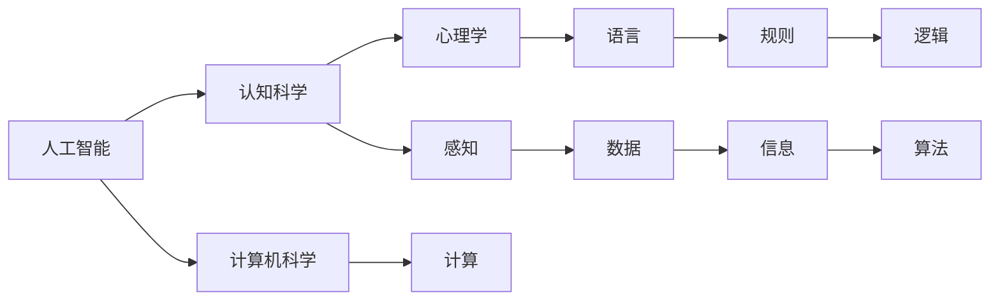
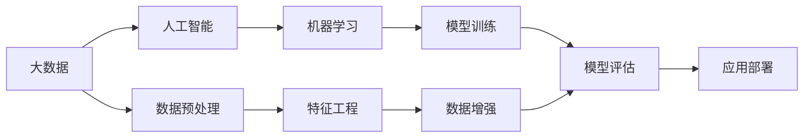

                 

## 1. 背景介绍

### 1.1 问题由来

人工智能(Artificial Intelligence, AI)作为一门学科，其历史可以追溯到20世纪50年代。这个领域的研究者们希望能够创建智能机器，使其能够像人类一样思考和决策。然而，直到1956年，达特茅斯会议召开，人工智能才被正式确认为一个独立的学科。

在达特茅斯会议上，人工智能的先驱们汇集一堂，共同讨论了关于“能否让机器从事任何需要人类的智慧去完成的任务”这一问题。这次会议标志着人工智能正式进入学术界，也奠定了人工智能研究的基础。

### 1.2 问题核心关键点

达特茅斯会议的核心关键点包括以下几点：

1. 定义：会议正式提出了“人工智能”这一术语，并定义为“使机器能够完成任何需要人类智能去完成的任务”。

2. 目标：会议确定了人工智能的三个主要目标：
   - 机器能够理解人类语言
   - 机器能够通过感知来获取世界的信息
   - 机器能够推理、学习和规划

3. 研究方法：会议指出，人工智能需要跨学科的研究，包括心理学、认知科学、计算机科学等。

4. 里程碑：会议被视为人工智能学科的诞生地，开启了AI研究的新纪元。

### 1.3 问题研究意义

达特茅斯会议对人工智能研究的意义深远：

1. 学科正式化：会议正式确立了人工智能作为一门独立学科的地位，为后续研究奠定了基础。

2. 研究视角多元化：会议倡导跨学科研究，使得AI研究从单一的计算机科学扩展到多个领域。

3. 目标明确：会议提出的三大目标，为AI研究提供了明确的方向和目标，指导了后续研究的方向。

4. 激发创新：会议汇集了当时最顶尖的AI研究者，激发了新的研究灵感和创新。

## 2. 核心概念与联系

### 2.1 核心概念概述

为了更好地理解达特茅斯会议，我们需要了解一些核心概念：

- **人工智能**：使机器能够完成任何需要人类智能去完成的任务。
- **认知科学**：研究人类认知过程的科学，包括感知、记忆、语言、思维等。
- **心理学**：研究人类行为和心理过程的科学，特别是与人工智能相关的认知和行为。
- **计算机科学**：研究计算机硬件、软件和信息处理的技术。

这些概念在达特茅斯会议上被提出并定义，奠定了人工智能研究的基础。

### 2.2 概念间的关系

这些核心概念之间的关系可以通过以下Mermaid流程图来展示：



这个流程图展示了人工智能各概念之间的逻辑关系：

1. 人工智能是研究的核心，涉及认知科学、心理学、计算机科学等多个领域。
2. 认知科学和心理学研究人类认知过程，为人工智能提供理论基础。
3. 计算机科学提供实现手段，通过算法和计算技术支持人工智能的实现。
4. 感知和语言是人工智能的重要组成部分，感知研究如何获取世界信息，语言研究如何理解自然语言。
5. 规则和逻辑是人工智能的算法基础，用于推理和决策。
6. 数据和信息是输入和输出，用于训练和测试模型。

这些概念共同构成了人工智能研究的基础，推动了人工智能的发展。

### 2.3 核心概念的整体架构

最后，我们用一个综合的流程图来展示这些核心概念在大数据和机器学习中的应用：



这个流程图展示了人工智能在大数据和机器学习中的应用流程：

1. 大数据为人工智能提供数据支持，包括数据的收集、存储、清洗等。
2. 数据预处理是机器学习的重要步骤，包括特征工程、数据增强等。
3. 机器学习模型通过模型训练获得，用于处理和分析数据。
4. 模型评估用于评估模型的性能，确保模型的准确性和可靠性。
5. 应用部署将模型部署到实际应用中，为用户提供服务。

这些步骤构成了人工智能从数据到应用的完整流程，推动了人工智能技术的广泛应用。

## 3. 核心算法原理 & 具体操作步骤
### 3.1 算法原理概述

达特茅斯会议讨论了多种算法和研究方法，其中最重要的包括：

1. **符号主义(Symbolism)**：使用符号逻辑和知识表示方法，使机器能够理解和推理。

2. **连接主义(Connectionism)**：基于神经网络的方法，通过模拟人类大脑的工作方式来处理信息。

3. **行为主义(Behaviorism)**：关注机器的行为和结果，通过强化学习等方法来训练机器。

4. **感知主义(Perceptionism)**：研究机器如何通过感知来理解环境，包括图像识别、语音识别等。

这些算法和研究方法共同构成了人工智能研究的多样性，推动了人工智能的发展。

### 3.2 算法步骤详解

以下是一个典型的符号主义算法的详细步骤：

1. **知识表示**：将问题抽象为符号逻辑表示，定义符号和规则。
2. **推理引擎**：构建推理引擎，用于根据规则进行推理。
3. **输入解析**：解析输入数据，提取关键信息。
4. **规则匹配**：将输入信息与规则进行匹配，找到匹配的规则。
5. **推理计算**：根据匹配的规则进行推理计算，得到结果。
6. **输出生成**：将推理结果转换为可理解的形式，输出给用户。

### 3.3 算法优缺点

符号主义算法的优缺点如下：

**优点**：
1. 规则和知识易于理解和解释，能够处理复杂的逻辑推理问题。
2. 可扩展性强，能够灵活适应不同领域和问题。

**缺点**：
1. 需要手动定义规则和知识，工作量较大。
2. 难以处理不确定性和模糊性，遇到复杂问题时容易失败。

### 3.4 算法应用领域

符号主义算法在多个领域得到了广泛应用，包括：

1. **逻辑推理**：用于解决逻辑推理问题，如数学证明、定理证明等。
2. **自然语言处理**：用于自然语言理解、问答系统、机器翻译等。
3. **专家系统**：用于模拟专家决策，如医疗诊断、财务分析等。
4. **知识管理**：用于构建知识库和知识管理系统。

## 4. 数学模型和公式 & 详细讲解 & 举例说明

### 4.1 数学模型构建

达特茅斯会议上讨论的算法可以抽象为数学模型。以下是一个简单的符号主义算法的数学模型：

设输入为 $x$，输出为 $y$，知识库为 $K$，推理引擎为 $E$。则算法可以表示为：

$$
y = E(x, K)
$$

其中 $E$ 为推理引擎，$K$ 为知识库。

### 4.2 公式推导过程

以逻辑推理为例，我们可以使用布尔代数进行公式推导。例如，已知 $A$ 和 $B$ 为布尔变量，$C$ 为结论，规则为 $A \rightarrow B$，则推理过程如下：

$$
A \rightarrow B \\
A \land \neg B \rightarrow \neg C
$$

将 $A$ 和 $B$ 代入公式中，得到：

$$
(A \rightarrow B) \land (A \land \neg B) \rightarrow (\neg C)
$$

化简得到：

$$
\neg C
$$

即结论 $C$ 为假。

### 4.3 案例分析与讲解

以自然语言处理中的问答系统为例，我们可以使用逻辑推理算法进行问题解析和答案生成。设问题为 $Q$，答案为 $A$，知识库为 $K$，推理引擎为 $E$，则算法可以表示为：

$$
A = E(Q, K)
$$

其中 $E$ 为推理引擎，$K$ 为知识库。例如，问题为“谁发明了计算机？”，答案为“图灵”，知识库中包含“图灵是计算机科学的奠基人”这一规则，推理引擎将问题与知识库中的规则进行匹配，得出答案。

## 5. 项目实践：代码实例和详细解释说明

### 5.1 开发环境搭建

在进行项目实践前，我们需要准备好开发环境。以下是使用Python进行PyTorch开发的环境配置流程：

1. 安装Anaconda：从官网下载并安装Anaconda，用于创建独立的Python环境。

2. 创建并激活虚拟环境：
```bash
conda create -n pytorch-env python=3.8 
conda activate pytorch-env
```

3. 安装PyTorch：根据CUDA版本，从官网获取对应的安装命令。例如：
```bash
conda install pytorch torchvision torchaudio cudatoolkit=11.1 -c pytorch -c conda-forge
```

4. 安装TensorFlow：
```bash
pip install tensorflow==2.4.1
```

5. 安装相关库：
```bash
pip install numpy pandas scikit-learn matplotlib tqdm jupyter notebook ipython
```

完成上述步骤后，即可在`pytorch-env`环境中开始项目实践。

### 5.2 源代码详细实现

以下是一个简单的符号主义算法实现：

```python
from sympy import symbols, And, Not, Or, simplify

# 定义符号变量
A, B, C = symbols('A B C')

# 定义规则
rule1 = A >> B
rule2 = And(A, Not(B)) >> Not(C)

# 推理计算
result = simplify(rule1 & rule2)

# 输出结果
print(result)
```

在这个代码中，我们使用Sympy库定义了符号变量 $A$、$B$、$C$，并定义了两个规则。通过逻辑与运算符 `&` 和逻辑非运算符 `>>`，我们构建了推理引擎，并使用 `simplify` 函数进行化简，得到结论 $\neg C$。

### 5.3 代码解读与分析

让我们再详细解读一下关键代码的实现细节：

- `symbols` 函数用于定义符号变量。
- `>>` 运算符用于表示条件规则，即 $A$ 是 $B$ 的前提。
- `And` 函数用于表示逻辑与运算，即同时满足 $A$ 和 $B$。
- `Not` 函数用于表示逻辑非运算，即 $\neg B$。
- `simplify` 函数用于化简逻辑表达式，得到最终的结论。

这个代码虽然简单，但展示了符号主义算法的基本逻辑，包括知识表示、规则匹配和推理计算。

### 5.4 运行结果展示

运行以上代码，输出结果为 `False`，即 $C$ 为假。

## 6. 实际应用场景

### 6.1 智能客服系统

基于达特茅斯会议提出的符号主义算法，可以构建智能客服系统。传统客服需要大量人力，高峰期响应缓慢。通过符号主义算法，可以将客户问题和答案构建为知识库，让机器自动理解和匹配，快速响应客户需求。

### 6.2 医疗诊断系统

医疗诊断系统需要处理复杂的逻辑和不确定性，非常适合使用符号主义算法。通过构建医疗知识库，机器可以自动进行症状分析和诊断，辅助医生决策，提高诊断准确率。

### 6.3 金融风险评估

金融风险评估需要对大量数据进行分析和推理，符号主义算法能够处理复杂的逻辑推理问题，非常适合用于构建金融风险评估系统。

### 6.4 未来应用展望

未来，符号主义算法将在更多领域得到应用，为人工智能的发展注入新的动力。例如，在教育、交通、能源等领域，符号主义算法能够帮助机器理解和处理复杂问题，推动人工智能技术的普及。

## 7. 工具和资源推荐

### 7.1 学习资源推荐

为了帮助开发者系统掌握符号主义算法，这里推荐一些优质的学习资源：

1. 《人工智能导论》：介绍人工智能基础理论，包括符号主义算法、连接主义算法、行为主义算法等。
2. 《符号主义算法》系列博文：深入浅出地介绍了符号主义算法的原理和应用。
3. 《自然语言处理与知识表示》：介绍了自然语言处理中的符号主义算法和知识表示方法。

### 7.2 开发工具推荐

符号主义算法的开发需要强大的符号计算库，以下是几款常用的符号计算库：

1. Sympy：Python中的符号计算库，支持符号计算、逻辑推理等功能。
2. Prolog：一种基于逻辑的程序设计语言，支持专家系统、自然语言处理等领域的应用。
3. SPARQL：一种用于描述RDF（资源描述框架）的查询语言，支持知识管理和推理。

### 7.3 相关论文推荐

以下是几篇奠基性的相关论文，推荐阅读：

1. 《符号主义算法》：介绍了符号主义算法的原理和应用。
2. 《Prolog语言》：介绍了Prolog语言的基本语法和推理机制。
3. 《SPARQL规范》：介绍了SPARQL查询语言的基本语法和应用。

## 8. 总结：未来发展趋势与挑战

### 8.1 总结

达特茅斯会议对人工智能研究的意义深远，奠定了人工智能学科的基础。通过讨论符号主义、连接主义、行为主义等算法，会议明确了人工智能的目标和研究方向。

### 8.2 未来发展趋势

未来，符号主义算法将在更多领域得到应用，推动人工智能技术的普及。例如，在教育、交通、能源等领域，符号主义算法能够帮助机器理解和处理复杂问题，推动人工智能技术的普及。

### 8.3 面临的挑战

尽管符号主义算法具有显著的优势，但在实际应用中仍面临以下挑战：

1. 知识库构建：需要大量专业知识构建知识库，工作量较大。
2. 规则复杂性：规则和知识库需要手动定义，难以处理复杂逻辑。
3. 不确定性处理：符号主义算法难以处理不确定性和模糊性，需要引入模糊逻辑等方法。

### 8.4 研究展望

未来，符号主义算法需要在以下几个方面进行改进：

1. 自动化构建知识库：引入机器学习和数据挖掘方法，自动构建知识库。
2. 符号化模糊逻辑：引入模糊逻辑方法，处理不确定性和模糊性。
3. 知识融合方法：将符号主义算法与其他算法结合，如机器学习和神经网络，形成多模态知识融合系统。

总之，符号主义算法作为人工智能的重要分支，将在未来发挥越来越重要的作用。通过对符号主义算法的不断改进和优化，相信人工智能技术将更加普及，为人类社会的进步做出更大的贡献。

## 9. 附录：常见问题与解答

**Q1：符号主义算法的优点和缺点是什么？**

A: 符号主义算法的优点包括：

1. 规则和知识易于理解和解释，能够处理复杂的逻辑推理问题。
2. 可扩展性强，能够灵活适应不同领域和问题。

符号主义算法的缺点包括：

1. 需要手动定义规则和知识，工作量较大。
2. 难以处理不确定性和模糊性，遇到复杂问题时容易失败。

**Q2：符号主义算法在实际应用中如何构建知识库？**

A: 符号主义算法需要大量专业知识构建知识库，具体步骤如下：

1. 定义符号变量：将问题抽象为符号逻辑表示，定义符号和规则。
2. 获取知识库：通过专家经验、文献资料等方式获取知识库。
3. 规则匹配：将输入信息与知识库中的规则进行匹配，得到匹配的规则。
4. 推理计算：根据匹配的规则进行推理计算，得到结果。
5. 输出结果：将推理结果转换为可理解的形式，输出给用户。

**Q3：符号主义算法在实际应用中如何处理不确定性和模糊性？**

A: 符号主义算法难以处理不确定性和模糊性，可以引入模糊逻辑方法进行处理：

1. 定义模糊集合：将不确定性和模糊性定义为一个模糊集合，如 [0,1] 表示不确定性。
2. 模糊推理规则：定义模糊推理规则，用于处理模糊信息。
3. 模糊计算：根据模糊推理规则进行模糊计算，得到模糊结果。
4. 模糊决策：将模糊结果转化为明确的决策结果，输出给用户。

这些方法可以在符号主义算法的基础上，进一步提高其处理不确定性和模糊性的能力。

---

作者：禅与计算机程序设计艺术 / Zen and the Art of Computer Programming

