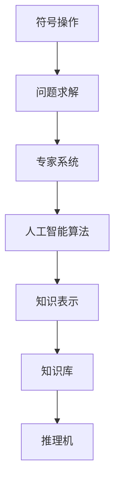
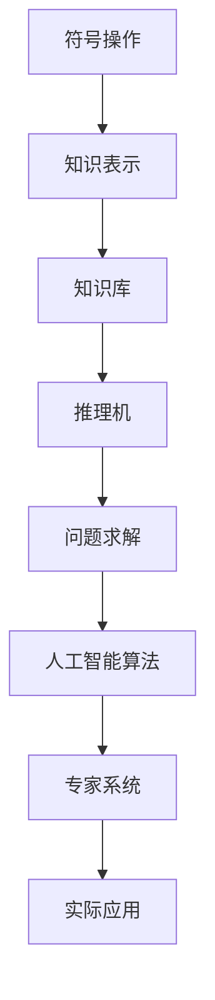

                 

## 1. 背景介绍

### 1.1 问题由来

1956年夏天，在新罕布什尔州达特茅斯学院，美国计算机科学家约翰·麦卡锡（John McCarthy）和他的学生们聚在一起，提出了“人工智能”（Artificial Intelligence）一词，并成功举办了第一次人工智能会议，开启了人工智能时代的序幕。在这次会议上，麦卡锡和他的合作者们提出了一系列开创性的学术成果，奠定了现代人工智能研究的基础。

### 1.2 问题核心关键点

达特茅斯会议的核心讨论内容包括：

- **机器智能的实现**：如何构建能够执行复杂任务的计算机程序。
- **问题求解**：使用计算机程序解决实际问题的方法。
- **符号操作**：如何处理和操作逻辑符号，构建知识表示。
- **算法设计**：高效解决问题的算法。

这些讨论不仅在学术上具有划时代意义，还推动了人工智能领域的发展。

### 1.3 问题研究意义

达特茅斯会议对人工智能的研究和发展具有重要意义：

- 它定义了“人工智能”这个概念，使得计算机科学的研究方向有了明确的目标。
- 会议集中讨论了符号操作和算法设计，为后来的专家系统和人工智能算法提供了重要参考。
- 会议奠定了人工智能的学术基础，吸引了大批人才加入这一新兴领域。
- 会议促进了计算机科学与数学、认知科学、心理学等学科的交叉融合，推动了人工智能的全面发展。

## 2. 核心概念与联系

### 2.1 核心概念概述

为了更好地理解达特茅斯会议的学术成果，本节将介绍几个核心概念：

- **符号操作**：使用逻辑符号表示知识，构建知识表示系统。
- **问题求解**：使用计算机程序解决实际问题，如搜索和规划算法。
- **人工智能算法**：设计高效解决问题的算法，如逻辑推理和规则匹配。
- **专家系统**：利用知识库和推理机实现问题求解的系统，广泛应用于专家领域。
- **知识表示**：如何组织和表示知识，以便计算机能够理解和应用。

这些概念共同构成了达特茅斯会议讨论的主要内容，奠定了人工智能研究的基础。

### 2.2 概念间的关系

这些核心概念之间存在紧密的联系，形成了人工智能研究的基础框架。我们可以用以下Mermaid流程图来展示它们之间的关系：



这个流程图展示了符号操作、问题求解、专家系统、人工智能算法、知识表示之间的关系：

- 符号操作是构建知识表示的基础。
- 问题求解是使用算法解决实际问题的过程。
- 专家系统利用知识库和推理机实现问题求解。
- 人工智能算法提供高效的问题求解方案。
- 知识表示是构建知识库的基础。

这些概念相互依存、相互促进，共同构成了人工智能研究的核心内容。

### 2.3 核心概念的整体架构

最后，我们用一个综合的流程图来展示这些核心概念在人工智能研究中的整体架构：



这个综合流程图展示了从符号操作到实际应用的完整过程：

- 符号操作和知识表示是构建知识库的基础。
- 知识库和推理机构成了专家系统，实现问题求解。
- 人工智能算法提供高效的问题求解方案。
- 专家系统应用于实际问题解决，最终形成实际应用。

通过这些流程图，我们可以更清晰地理解达特茅斯会议的学术成果及其在人工智能研究中的应用。

## 3. 核心算法原理 & 具体操作步骤
### 3.1 算法原理概述

达特茅斯会议的学术成果主要集中在符号操作和人工智能算法的设计上。这些算法的设计理念和实现方法，对后来的专家系统和人工智能研究产生了深远影响。

### 3.2 算法步骤详解

达特茅斯会议讨论的主要算法步骤如下：

1. **符号操作**：将问题转化为逻辑符号，构建知识表示系统。
2. **问题求解**：设计高效的算法，解决逻辑符号表示的问题。
3. **专家系统**：构建知识库和推理机，实现问题的自动求解。
4. **人工智能算法**：设计更高效的算法，提升问题求解效率。

这些步骤共同构成了达特茅斯会议的主要研究成果。

### 3.3 算法优缺点

达特茅斯会议的算法具有以下优点：

- 符号操作和知识表示使计算机能够理解和处理人类语言，提升了人工智能的理解能力。
- 问题求解和人工智能算法提供了高效的问题求解方案，推动了专家系统的发展。

同时，这些算法也存在一些缺点：

- 符号操作和知识表示的实现较为复杂，需要大量的人工介入和调试。
- 问题求解和人工智能算法的实现需要较强的数学和计算机科学背景，普通开发者难以理解和应用。
- 专家系统虽然在特定领域表现出色，但在复杂问题的求解上仍然存在局限性。

尽管存在这些缺点，但达特茅斯会议的算法奠定了人工智能研究的基础，推动了人工智能的发展。

### 3.4 算法应用领域

达特茅斯会议的算法广泛应用于以下几个领域：

- **专家系统**：在医疗、金融、法律等专业领域，专家系统用于解决特定问题，如医疗诊断、金融风险评估等。
- **问题求解**：在搜索引擎、自动规划、机器翻译等任务中，使用问题求解算法实现高效计算。
- **人工智能算法**：在智能推荐、游戏AI、自然语言处理等领域，使用高效算法提升问题求解效率。

## 4. 数学模型和公式 & 详细讲解  
### 4.1 数学模型构建

达特茅斯会议的主要研究成果包括符号操作和人工智能算法的设计，这些算法的设计和实现需要一定的数学模型支持。

- **符号操作**：使用逻辑符号表示问题，构建知识表示系统。
- **问题求解**：设计高效的算法，解决逻辑符号表示的问题。

### 4.2 公式推导过程

以下我们以问题求解为例，推导算法的基本数学模型。

假设有一个逻辑表达式 $A \vee B \rightarrow C$，其中 $\vee$ 表示或，$\rightarrow$ 表示蕴含。现在要判断该逻辑表达式是否成立。

1. **符号操作**：将逻辑表达式 $A \vee B \rightarrow C$ 转化为符号表示：
   - $A$ 表示命题A
   - $B$ 表示命题B
   - $C$ 表示命题C

2. **问题求解**：使用逻辑推理算法，判断 $A \vee B \rightarrow C$ 是否成立。

3. **人工智能算法**：设计高效的逻辑推理算法，提升推理效率。

在实际应用中，问题求解算法通常使用推理机来实现，推理机根据已知的规则库和知识库，对逻辑表达式进行推理计算。

### 4.3 案例分析与讲解

假设有一个逻辑表达式 $A \wedge B \rightarrow (C \vee D)$，其中 $\wedge$ 表示与，$\rightarrow$ 表示蕴含。现在要判断该逻辑表达式是否成立。

1. **符号操作**：将逻辑表达式 $A \wedge B \rightarrow (C \vee D)$ 转化为符号表示：
   - $A$ 表示命题A
   - $B$ 表示命题B
   - $C$ 表示命题C
   - $D$ 表示命题D

2. **问题求解**：使用推理机，判断 $A \wedge B \rightarrow (C \vee D)$ 是否成立。推理过程如下：
   - 首先，判断 $A$ 是否成立，如果成立，继续判断 $B$ 是否成立，如果 $B$ 成立，则 $A \wedge B$ 成立。
   - 接着，判断 $A \wedge B \rightarrow (C \vee D)$ 是否成立，即 $C \vee D$ 是否成立。
   - 最后，判断 $C \vee D$ 是否成立，如果成立，则整个逻辑表达式成立。

3. **人工智能算法**：设计高效的推理机，实现以上推理过程。推理机通常使用基于规则的推理算法，如前向链推理、后向链推理等。

## 5. 项目实践：代码实例和详细解释说明
### 5.1 开发环境搭建

在进行问题求解实践前，我们需要准备好开发环境。以下是使用Python进行逻辑推理系统的环境配置流程：

1. 安装Anaconda：从官网下载并安装Anaconda，用于创建独立的Python环境。

2. 创建并激活虚拟环境：
```bash
conda create -n logic-env python=3.8 
conda activate logic-env
```

3. 安装PyTorch：根据CUDA版本，从官网获取对应的安装命令。例如：
```bash
conda install pytorch torchvision torchaudio cudatoolkit=11.1 -c pytorch -c conda-forge
```

4. 安装相关库：
```bash
pip install numpy pandas scikit-learn sympy tqdm jupyter notebook ipython
```

5. 安装逻辑推理库：
```bash
pip install pycarpenter
```

完成上述步骤后，即可在`logic-env`环境中开始逻辑推理系统的开发。

### 5.2 源代码详细实现

下面我们以逻辑推理为例，给出使用Sympy库实现逻辑表达式求解的PyTorch代码实现。

首先，定义逻辑表达式的数据结构：

```python
from sympy import Symbol, Or, And, Implies

class LogicExpression:
    def __init__(self, expr):
        self.expr = expr
        self.variables = self.get_variables()
        
    def get_variables(self):
        variables = []
        for term in self.expr.atoms():
            if isinstance(term, Symbol):
                variables.append(term)
        return variables
        
    def evaluate(self, variable_values):
        variables = dict(zip(self.variables, variable_values))
        return self.expr.subs(variables)
```

然后，定义推理算法：

```python
from sympy.logic.boolalg import Implies, And, Or

def inference_algorithm(expr, variable_values):
    if expr.is_and:
        and_expr = expr
        for term in expr.args:
            if term.is_and:
                and_expr = And(term.args[0], term.args[1])
            else:
                and_expr = And(term.args[0], term)
        return and_expr
    elif expr.is_or:
        or_expr = expr
        for term in expr.args:
            if term.is_or:
                or_expr = Or(term.args[0], term.args[1])
            else:
                or_expr = Or(term.args[0], term)
        return or_expr
    elif expr.is_implies:
        implies_expr = expr
        return Implies(implies_expr.args[0], implies_expr.args[1])
```

最后，使用这些类和方法进行推理计算：

```python
# 定义逻辑表达式
expr = Or(And(Symbol('A'), Symbol('B')), Implies(Symbol('A'), Or(Symbol('C'), Symbol('D'))))

# 定义变量值
variable_values = {'A': True, 'B': True, 'C': True, 'D': True}

# 推理计算
result = inference_algorithm(expr, variable_values)
print(result)
```

在以上代码中，我们首先定义了一个`LogicExpression`类来表示逻辑表达式，并使用`sympy`库的`Symbol`类来定义逻辑符号。然后，定义了一个`inference_algorithm`函数，根据逻辑表达式的类型（或、与、蕴含）进行推理计算。最后，使用这些类和方法进行推理计算。

### 5.3 代码解读与分析

让我们再详细解读一下关键代码的实现细节：

**LogicExpression类**：
- `__init__`方法：初始化逻辑表达式和变量。
- `get_variables`方法：获取表达式中的变量。

**inference_algorithm函数**：
- 根据逻辑表达式的类型，判断使用哪个推理算法。
- 对于与运算，将子表达式合并为一个逻辑表达式。
- 对于或运算，将子表达式合并为一个逻辑表达式。
- 对于蕴含运算，直接返回原表达式。

**变量值**：
- 在推理过程中，需要提供变量值来计算逻辑表达式的结果。

通过这些类和方法，我们可以构建一个简单的逻辑推理系统，用于解决逻辑表达式求解的问题。

## 6. 实际应用场景
### 6.1 智能推荐系统

达特茅斯会议的逻辑推理算法可以应用于智能推荐系统，提升推荐系统的精准度和效率。

在推荐系统中，通常需要根据用户的历史行为数据和物品属性信息，进行综合推理和匹配。逻辑推理算法可以用于处理复杂的逻辑表达式，实现高效的推荐计算。

具体而言，可以使用逻辑推理算法对用户的行为数据进行编码，将用户的历史行为转化为逻辑表达式。然后，使用推理机对逻辑表达式进行推理计算，得到用户对物品的评分。最后，根据评分对物品进行排序，生成推荐列表。

### 6.2 金融风险评估

逻辑推理算法可以应用于金融风险评估，提升金融系统的风险预警能力。

在金融系统中，需要根据各种财务指标和市场信息，进行综合推理和分析，评估客户的信用风险和市场风险。逻辑推理算法可以用于处理复杂的逻辑表达式，实现高效的金融风险评估。

具体而言，可以使用逻辑推理算法对客户的财务信息进行编码，将各种财务指标转化为逻辑表达式。然后，使用推理机对逻辑表达式进行推理计算，得到客户的信用评分和市场风险等级。最后，根据评分和等级，进行风险预警和决策支持。

### 6.3 自然语言处理

逻辑推理算法可以应用于自然语言处理，提升自然语言理解系统的能力。

在自然语言处理中，通常需要处理复杂的语义关系和逻辑表达式，进行自然语言理解和推理。逻辑推理算法可以用于处理复杂的逻辑表达式，实现高效的自然语言理解。

具体而言，可以使用逻辑推理算法对自然语言文本进行编码，将自然语言文本转化为逻辑表达式。然后，使用推理机对逻辑表达式进行推理计算，得到文本的语义关系和逻辑推理结果。最后，根据推理结果，进行自然语言理解和推理。

## 7. 工具和资源推荐
### 7.1 学习资源推荐

为了帮助开发者系统掌握达特茅斯会议的学术成果，这里推荐一些优质的学习资源：

1. 《人工智能：原理与技术》系列博文：由人工智能专家撰写，详细介绍了人工智能的基本概念和达特茅斯会议的学术成果。

2. 斯坦福大学《人工智能导论》课程：斯坦福大学开设的AI入门课程，涵盖了人工智能的基本原理和历史。

3. 《人工智能：一个现代方法》书籍：清华大学出版社出版的经典教材，介绍了人工智能的基本概念和技术。

4. 《逻辑与人工智能基础》书籍：清华大学出版社出版的教材，详细介绍了逻辑推理和人工智能算法。

5. 《符号主义人工智能》课程：由上海交通大学开设的在线课程，详细介绍了符号主义人工智能的基本原理和技术。

通过对这些资源的学习实践，相信你一定能够快速掌握达特茅斯会议的学术成果，并用于解决实际的AI问题。
###  7.2 开发工具推荐

高效的开发离不开优秀的工具支持。以下是几款用于逻辑推理系统开发的常用工具：

1. PyTorch：基于Python的开源深度学习框架，灵活动态的计算图，适合快速迭代研究。大部分推理算法都有PyTorch版本的实现。

2. TensorFlow：由Google主导开发的开源深度学习框架，生产部署方便，适合大规模工程应用。同样有丰富的推理算法资源。

3. SymPy：Python的符号计算库，提供了强大的逻辑推理和符号操作功能，是实现逻辑推理算法的理想工具。

4. Weights & Biases：模型训练的实验跟踪工具，可以记录和可视化模型训练过程中的各项指标，方便对比和调优。与主流深度学习框架无缝集成。

5. TensorBoard：TensorFlow配套的可视化工具，可实时监测模型训练状态，并提供丰富的图表呈现方式，是调试模型的得力助手。

6. Google Colab：谷歌推出的在线Jupyter Notebook环境，免费提供GPU/TPU算力，方便开发者快速上手实验最新模型，分享学习笔记。

合理利用这些工具，可以显著提升逻辑推理系统的开发效率，加快创新迭代的步伐。

### 7.3 相关论文推荐

达特茅斯会议的学术成果已经奠定了人工智能研究的基础，相关的论文值得广泛阅读和学习：

1. "Artificial Intelligence: A Modern Approach"（《人工智能：现代方法》）：Russell和Norvig合著的经典教材，介绍了人工智能的基本概念和技术。

2. "Artificial Intelligence: Foundations of Computational Agents"（《人工智能：计算代理的原理与技术》）：Russell和Norvig的另一本经典教材，介绍了人工智能的原理和应用。

3. "Symbolic and Statistical Approaches to Reasoning"（《符号和统计推理方法》）：Larrypage和MichaelJordan的论文，介绍了符号主义和统计主义两种人工智能方法的基本原理。

4. "Knowledge-Based Systems: The AI Approach"（《基于知识的系统：人工智能方法》）：Sharon的论文，介绍了基于知识的人工智能系统的基本原理和实现方法。

5. "Artificial Intelligence: A Survey"（《人工智能：综述》）：Patterson的论文，介绍了人工智能的基本概念和技术，适合作为入门读物。

这些论文代表了达特茅斯会议的学术成果，是理解人工智能发展历程的重要参考资料。

除上述资源外，还有一些值得关注的前沿资源，帮助开发者紧跟人工智能技术的最新进展，例如：

1. arXiv论文预印本：人工智能领域最新研究成果的发布平台，包括大量尚未发表的前沿工作，学习前沿技术的必读资源。

2. 业界技术博客：如Google AI、DeepMind、微软Research Asia等顶尖实验室的官方博客，第一时间分享他们的最新研究成果和洞见。

3. 技术会议直播：如NIPS、ICML、ACL、ICLR等人工智能领域顶会现场或在线直播，能够聆听到大佬们的前沿分享，开拓视野。

4. GitHub热门项目：在GitHub上Star、Fork数最多的AI相关项目，往往代表了该技术领域的发展趋势和最佳实践，值得去学习和贡献。

5. 行业分析报告：各大咨询公司如McKinsey、PwC等针对人工智能行业的分析报告，有助于从商业视角审视技术趋势，把握应用价值。

总之，对于达特茅斯会议的学术成果的学习和实践，需要开发者保持开放的心态和持续学习的意愿。多关注前沿资讯，多动手实践，多思考总结，必将收获满满的成长收益。

## 8. 总结：未来发展趋势与挑战
### 8.1 总结

本文对达特茅斯会议的学术成果进行了全面系统的介绍。首先阐述了符号操作和人工智能算法的设计背景和意义，明确了逻辑推理在人工智能研究中的核心地位。其次，从原理到实践，详细讲解了逻辑推理算法的设计和实现，给出了逻辑推理系统开发的完整代码实例。同时，本文还广泛探讨了逻辑推理算法在智能推荐、金融风险评估、自然语言处理等多个领域的应用前景，展示了逻辑推理算法的广泛应用价值。此外，本文精选了逻辑推理算法的各类学习资源，力求为读者提供全方位的技术指引。

通过本文的系统梳理，可以看到，达特茅斯会议的学术成果奠定了人工智能研究的基础，推动了人工智能的发展。逻辑推理算法在人工智能领域的应用前景广阔，将在未来继续发挥重要作用。

### 8.2 未来发展趋势

展望未来，逻辑推理算法将呈现以下几个发展趋势：

1. **符号操作和知识表示的自动化**：未来的逻辑推理算法将更多地采用自动化符号操作和知识表示，减少人工干预，提升推理效率。

2. **推理算法的优化**：未来的逻辑推理算法将更多地采用高效的推理算法，提升推理效率和推理精度。

3. **多模态推理**：未来的逻辑推理算法将更多地应用于多模态数据，实现视觉、语音、文本等多种模态的协同推理。

4. **智能问答系统**：未来的逻辑推理算法将更多地应用于智能问答系统，实现自然语言问答和推理。

5. **因果推理**：未来的逻辑推理算法将更多地应用于因果推理，实现对复杂因果关系的建模和分析。

以上趋势凸显了逻辑推理算法的广阔前景。这些方向的探索发展，必将进一步提升逻辑推理系统的性能和应用范围，为人工智能的发展提供新的动力。

### 8.3 面临的挑战

尽管达特茅斯会议的学术成果奠定了人工智能研究的基础，但在迈向更加智能化、普适化应用的过程中，逻辑推理算法仍面临诸多挑战：

1. **符号操作和知识表示的复杂性**：符号操作和知识表示需要大量的人工介入和调试，难以自动化实现。

2. **推理算法的复杂性**：推理算法的实现需要较强的数学和计算机科学背景，普通开发者难以理解和应用。

3. **多模态推理的复杂性**：多模态推理需要综合处理多种模态的数据，实现复杂的协同推理，需要进一步研究。

4. **智能问答系统的复杂性**：智能问答系统需要综合处理自然语言理解和推理，实现高效的问答处理，需要进一步研究。

5. **因果推理的复杂性**：因果推理需要识别和建模复杂的因果关系，实现高效的因果推理，需要进一步研究。

尽管存在这些挑战，但未来的研究需要在以下几个方面寻求新的突破：

1. **自动化符号操作和知识表示**：开发自动化的符号操作和知识表示工具，减少人工干预，提升推理效率。

2. **高效的推理算法**：设计高效的推理算法，提升推理效率和推理精度。

3. **多模态推理算法**：开发多模态推理算法，实现视觉、语音、文本等多种模态的协同推理。

4. **智能问答系统算法**：开发智能问答系统算法，实现自然语言问答和推理。

5. **因果推理算法**：开发高效的因果推理算法，实现复杂的因果关系建模和分析。

这些研究方向将推动逻辑推理算法的发展，为人工智能的研究和应用提供新的动力。

### 8.4 研究展望

未来的研究需要在以下几个方面寻求新的突破：

1. **自动化符号操作和知识表示**：开发自动化的符号操作和知识表示工具，减少人工干预，提升推理效率。

2. **高效的推理算法**：设计高效的推理算法，提升推理效率和推理精度。

3. **多模态推理算法**：开发多模态推理算法，实现视觉、语音、文本等多种模态的协同推理。

4. **智能问答系统算法**：开发智能问答系统算法，实现自然语言问答和推理。

5. **因果推理算法**：开发高效的因果推理算法，实现复杂的因果关系建模和分析。

这些研究方向将推动逻辑推理算法的发展，为人工智能的研究和应用提供新的动力。

## 9. 附录：常见问题与解答
----------------------------------------------------------------
> 关键词：
- 符号操作
- 逻辑推理
- 专家系统
- 知识表示
- 人工智能算法

**Q1：逻辑推理算法是否适用于所有问题求解任务？**

A: 逻辑推理算法适用于结构化的问题求解任务，如数学推理、自然语言推理等。但对于非结构化的任务，如情感分析、图像识别等，逻辑推理算法无法直接应用。

**Q2：逻辑推理算法在实际应用中面临哪些问题？**

A: 逻辑推理算法在实际应用中面临以下问题：
1. 符号操作和知识表示需要大量的人工介入和调试，难以自动化实现。
2. 推理算法的实现需要较强的数学和计算机科学背景，普通开发者难以理解和应用。
3. 多模态推理需要综合处理多种模态的数据，实现复杂的协同推理，需要进一步研究。

**Q3：如何使用逻辑推理算法解决自然语言问题？**

A: 使用逻辑推理算法解决自然语言问题，通常需要将自然语言文本转化为逻辑表达式，然后进行推理计算。具体步骤如下：
1. 对自然语言文本进行分词和词性标注。
2. 将自然语言文本转化为逻辑表达式，使用符号操作和知识表示方法。
3. 使用逻辑推理算法对逻辑表达式进行推理计算，得到自然语言问题的答案。

**Q4：逻辑推理算法在智能推荐系统中如何应用？**

A: 逻辑推理算法在智能推荐系统中可以用于处理复杂的逻辑表达式，实现高效的推荐计算。具体步骤如下：
1. 对用户的行为数据进行编码，将用户的历史行为转化为逻辑表达式。
2. 使用推理机对逻辑表达式进行推理计算，得到用户对物品的评分。
3. 根据评分对物品进行排序，生成推荐列表。

**Q5：逻辑推理算法在金融风险评估中如何应用？**

A: 逻辑推理算法在金融风险评估中可以用于处理复杂的逻辑表达式，实现高效的金融风险评估。具体步骤如下：
1. 对客户的财务信息进行编码，将各种财务指标转化为逻辑表达式。
2. 使用推理机对逻辑表达式进行推理计算，得到客户的信用评分和市场风险等级。
3. 根据评分和等级，进行风险预警和决策支持。

通过本文的系统梳理，可以看到，达特茅斯会议的学术成果奠定了人工智能研究的基础，推动了人工智能的发展。逻辑推理算法在人工智能领域的应用前景广阔，将在未来继续发挥重要作用。

---

作者：禅与计算机程序设计艺术 / Zen and the Art of Computer Programming

