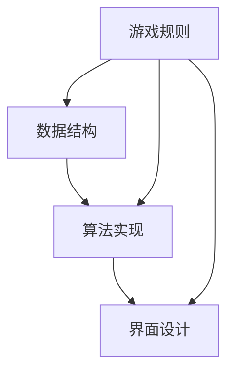
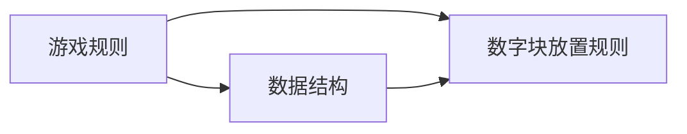
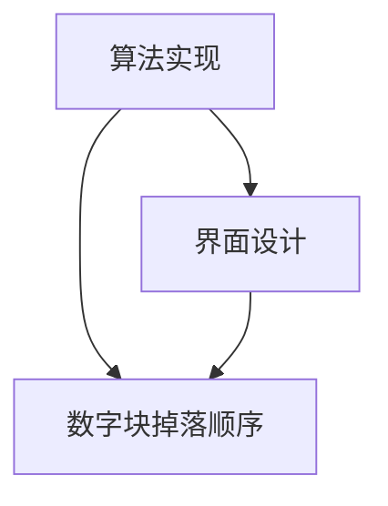
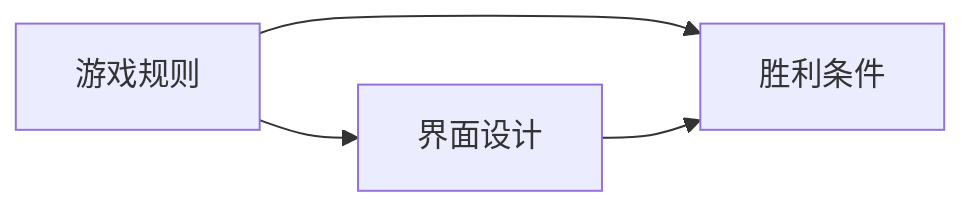
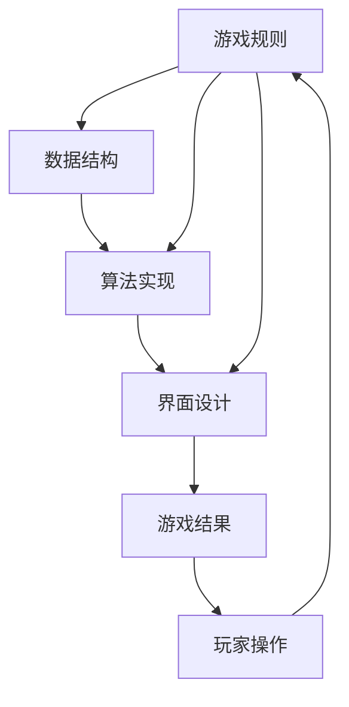

                 

# 连连看游戏的设计与实现

## 1. 背景介绍

### 1.1 问题由来
连连看（Connect Four）是一款经典的数字连线游戏，属于策略类游戏。玩家需要从上方将彩色数字块放入六列中，每个数字块只能移动一次，且每列只能放置一个数字块。当某一列的数字块达到了四枚以上时，该列将从上方掉落下来，并与下方的数字块相连成一条直线。游戏的目标是将同一颜色的数字块全部连接成一条直线，首先完成这一目标的玩家即为获胜。

该游戏简单易学，但策略复杂，极具挑战性。它不仅考验玩家的观察力、判断力和逻辑推理能力，还考验玩家对游戏规则的把握和策略的运用。因此，连续看游戏一直以来都是智力游戏爱好者和计算机程序员练习编程技巧和算法设计的好素材。

### 1.2 问题核心关键点
连续看游戏的核心在于设计一个高效、公平的游戏规则，并实现一个高性能的算法来实时处理玩家的操作。游戏中的关键点包括：

- 游戏规则：如何保证游戏规则的公平性和趣味性。
- 数据结构：如何高效存储和管理游戏中的数字块。
- 算法实现：如何快速高效地计算每个数字块的掉落顺序，并检测是否形成了直线。
- 界面设计：如何设计一个美观且易于操作的用户界面。

## 2. 核心概念与联系

### 2.1 核心概念概述

为更好地理解连续看游戏的实现，本节将介绍几个关键概念及其相互关系。

- 游戏规则：游戏规则是游戏的基本规则和核心逻辑。它决定了玩家如何放置数字块，以及如何判断胜利。
- 数据结构：数据结构是存储和管理游戏状态的容器。游戏中的数字块需要以某种方式进行组织和存储。
- 算法实现：算法实现是游戏逻辑的核心，包括数字块的掉落顺序计算和直线检测等。
- 界面设计：界面设计是游戏的用户交互界面，影响游戏的可玩性和用户体验。

这些核心概念之间的逻辑关系可以通过以下Mermaid流程图来展示：



这个流程图展示了连续看游戏的各个组件之间的关系：

1. 游戏规则是游戏的基础，决定了数据结构的设计和算法实现的方向。
2. 数据结构用于存储和组织游戏状态，是算法实现的前提。
3. 算法实现是游戏逻辑的核心，直接影响游戏规则的执行和界面设计的表现。
4. 界面设计影响用户体验，通过与用户交互来反映游戏状态和规则。

### 2.2 概念间的关系

这些核心概念之间存在着紧密的联系，形成了连续看游戏的完整生态系统。下面我们通过几个Mermaid流程图来展示这些概念之间的关系。

#### 2.2.1 游戏规则与数据结构的关系



这个流程图展示了游戏规则和数据结构的关系：

1. 游戏规则决定了数字块放置的方式和顺序。
2. 数据结构用于存储数字块的放置状态和位置。
3. 数字块放置规则是通过游戏规则定义的。

#### 2.2.2 算法实现与界面设计的关系



这个流程图展示了算法实现和界面设计的关系：

1. 算法实现计算数字块的掉落顺序，决定了数字块的下落过程。
2. 界面设计用于展示数字块的下落过程和玩家的操作结果。
3. 数字块掉落顺序是通过算法实现计算的。

#### 2.2.3 游戏规则与界面设计的关系



这个流程图展示了游戏规则和界面设计的关系：

1. 游戏规则定义了胜利条件，界面设计需要根据胜利条件展示游戏状态。
2. 界面设计需要展示数字块的放置情况和胜利情况。
3. 胜利条件是通过游戏规则定义的。

### 2.3 核心概念的整体架构

最后，我们用一个综合的流程图来展示这些核心概念在大连续看游戏微调过程中的整体架构：



这个综合流程图展示了从游戏规则到界面设计的完整过程。

## 3. 核心算法原理 & 具体操作步骤
### 3.1 算法原理概述

连续看游戏的核心算法在于如何高效地计算每个数字块的掉落顺序，并检测是否形成了直线。算法的核心步骤如下：

1. 从上方依次取出数字块。
2. 判断该数字块是否可以向下移动。
3. 计算该数字块的掉落顺序，确保从上方移动的数字块优先。
4. 检测是否形成了直线，若形成了，则将其清除。
5. 重复步骤1至4，直到所有数字块都掉落完毕。

其中，数字块的下落顺序计算是算法的关键步骤。为了避免死锁，我们需要设计一个优先级队列，用于存储和处理每个数字块的掉落顺序。

### 3.2 算法步骤详解

以下详细介绍连续看游戏的核心算法步骤：

#### 3.2.1 数字块的放置和掉落

数字块的放置和掉落是连续看游戏的主要逻辑。在放置数字块时，需要遵循以下规则：

- 每个数字块只能放置一次。
- 数字块只能从上方放置，且只能向下移动。
- 每个数字块占据一列，每列只能放置一个数字块。

数字块的掉落顺序计算需要考虑每个数字块所在的列和行，以及游戏规则。一般情况下，我们将数字块按照从左到右、从上到下的顺序排列，并使用优先级队列存储每个数字块的掉落顺序。具体实现方式如下：

1. 从上方取出数字块，将其放入优先级队列中。
2. 将数字块放入对应列的顶部。
3. 更新数字块所在列的高度和宽度。
4. 计算数字块的掉落顺序。
5. 根据掉落顺序将数字块向下移动，并检测是否形成了直线。

#### 3.2.2 直线检测

直线检测是连续看游戏的核心功能之一，需要准确地检测每一行和每一列是否形成了直线。直线检测的实现方式如下：

1. 从每行和每列的顶部开始，依次向下扫描。
2. 对于每行或每列，记录连续相同颜色的数字块个数。
3. 如果连续相同颜色的数字块个数达到了4枚以上，则判断该行或该列形成了直线。
4. 将直线清除，并继续向下扫描。
5. 重复步骤2至4，直到扫描完每行或每列。

直线检测的算法实现可以通过递归函数或迭代函数来实现，具体的实现方式可以根据实际需求进行选择。

### 3.3 算法优缺点

连续看游戏的核心算法具有以下优点：

- 算法简单明了，易于理解和实现。
- 算法实现高效，可以在短时间内完成数字块的掉落和直线检测。
- 算法可以处理大量的数字块，适应大规模的连续看游戏。

然而，该算法也存在一些缺点：

- 算法对游戏规则的依赖性较强，需要根据具体规则进行调整。
- 算法对界面设计的依赖性较大，需要与界面设计协同实现。
- 算法在处理特定情况时，可能会出现性能瓶颈，需要优化。

### 3.4 算法应用领域

连续看游戏的核心算法在以下领域有着广泛的应用：

- 数字连线游戏：如接龙、五子棋等。
- 计算机视觉：如图像识别、目标检测等。
- 游戏开发：如实时对战类游戏中的攻击策略等。

这些应用领域中，连续看游戏的核心算法具有较高的可扩展性和可重用性。

## 4. 数学模型和公式 & 详细讲解  
### 4.1 数学模型构建

连续看游戏涉及的数学模型较为简单，主要包括以下几个方面：

- 数字块放置规则：使用布尔变量表示每个数字块的位置和状态。
- 优先级队列：使用队列数据结构存储每个数字块的掉落顺序。
- 直线检测：使用递归函数或迭代函数检测每行和每列的直线。

具体的数学模型构建如下：

1. 数字块放置规则：使用一个二维数组 `blocks` 来存储每个数字块的位置和状态。其中，`blocks[i][j]` 表示第 `i` 行、第 `j` 列的数字块。
2. 优先级队列：使用 Python 中的优先队列实现，存储每个数字块的掉落顺序。优先队列中的元素由以下组成：`(行号, 列号, 高度, 宽度, 颜色)`。
3. 直线检测：使用递归函数 `detect_line` 来检测每行和每列的直线。检测函数 `detect_line` 的参数为当前行或列的高度和宽度，返回值为一个布尔值，表示该行或该列是否形成了直线。

### 4.2 公式推导过程

以下详细推导连续看游戏核心算法的公式。

#### 4.2.1 数字块掉落顺序计算

数字块掉落顺序计算的公式推导如下：

1. 定义数字块的位置和状态：`blocks[i][j] = {row, col, height, width, color}`，其中 `row` 表示数字块所在行的高度，`col` 表示数字块所在列的宽度，`height` 表示数字块的高度，`width` 表示数字块的宽度，`color` 表示数字块的颜色。
2. 优先级队列的数据结构：`Queue = [(0, j, 0, 0, color)]`，其中 `(0, j, 0, 0, color)` 表示数字块的位置和状态。
3. 计算数字块的掉落顺序：每次从优先级队列中取出一个数字块，将其向下移动，并更新其所在列的高度和宽度。将移动后的数字块重新插入优先级队列中，重复上述步骤，直到队列为空。

具体的公式推导如下：

$$
\text{Priority Queue} = \{(0, j, 0, 0, \text{color})\}
$$

$$
\text{while Priority Queue} \neq \emptyset:
    \text{remove element} (0, j, \text{height}, \text{width}, \text{color}) \text{from Priority Queue}
    \text{update block} (row, col, height+1, width, color)
    \text{insert block} (row, col, height, width, color) \text{into Priority Queue}
$$

#### 4.2.2 直线检测

直线检测的公式推导如下：

1. 检测每行直线的公式推导：从每行顶部开始，依次向下扫描。对于每行，记录连续相同颜色的数字块个数。如果连续相同颜色的数字块个数达到了4枚以上，则判断该行形成了直线。
2. 检测每列直线的公式推导：从每列顶部开始，依次向下扫描。对于每列，记录连续相同颜色的数字块个数。如果连续相同颜色的数字块个数达到了4枚以上，则判断该列形成了直线。

具体的公式推导如下：

$$
\text{detect_line}(\text{height}, \text{width}) = \text{check}\ \text{for continuous}\ \text{same}\ \text{colors}\ \text{in}\ \text{the}\ \text{row}\ \text{or}\ \text{column}
$$

$$
\text{if}\ \text{continuous}\ \text{same}\ \text{colors} \geq 4:
    \text{return}\ \text{True}
$$

$$
\text{else}:
    \text{return}\ \text{False}
$$

### 4.3 案例分析与讲解

以下给出连续看游戏的几个具体案例分析：

#### 案例 1：数字块放置和掉落

假设有一个连续看游戏，其中的数字块位置和状态如下：

```
1 2 3 4 5
6 7 8 9 10
11 12 13 14 15
```

玩家需要从上方依次放置数字块，例如：

```
1 2 3 4 5
6 7 8 9 10
11 12 14 13 15
```

数字块的掉落顺序计算如下：

1. 将数字块 `(1, 0, 0, 0, color)` 放入优先级队列。
2. 将数字块 `(6, 0, 0, 0, color)` 放入优先级队列。
3. 将数字块 `(11, 0, 0, 0, color)` 放入优先级队列。
4. 将数字块 `(14, 1, 0, 0, color)` 放入优先级队列。
5. 将数字块 `(13, 2, 0, 0, color)` 放入优先级队列。

优先级队列中的元素为：

```
[(1, 0, 0, 0, color), (6, 0, 0, 0, color), (11, 0, 0, 0, color), (14, 1, 0, 0, color), (13, 2, 0, 0, color)]
```

数字块的掉落顺序为：

1. 将数字块 `(1, 0, 0, 0, color)` 向下移动。
2. 将数字块 `(6, 0, 0, 0, color)` 向下移动。
3. 将数字块 `(11, 0, 0, 0, color)` 向下移动。
4. 将数字块 `(14, 1, 0, 0, color)` 向下移动。
5. 将数字块 `(13, 2, 0, 0, color)` 向下移动。

数字块 `15` 由于超过了列宽，会被清除。

#### 案例 2：直线检测

假设有一个连续看游戏，其中的数字块位置和状态如下：

```
1 2 3 4 5
6 7 8 9 10
11 12 13 14 15
```

玩家需要从上方依次放置数字块，例如：

```
1 2 3 4 5
6 7 8 9 10
11 12 14 13 15
```

直线检测的实现方式如下：

1. 检测第1行的直线，从顶部开始，依次向下扫描。
2. 检测第2行的直线，从顶部开始，依次向下扫描。
3. 检测第3行的直线，从顶部开始，依次向下扫描。
4. 检测第4行的直线，从顶部开始，依次向下扫描。
5. 检测第5行的直线，从顶部开始，依次向下扫描。

直线检测的结果如下：

- 第1行和第2行没有形成直线。
- 第3行和第4行形成了一条直线。
- 第5行没有形成直线。

因此，该游戏获胜的玩家是先完成了第3行和第4行的直线。

## 5. 项目实践：代码实例和详细解释说明
### 5.1 开发环境搭建

在进行连续看游戏开发前，我们需要准备好开发环境。以下是使用Python进行开发的环境配置流程：

1. 安装Anaconda：从官网下载并安装Anaconda，用于创建独立的Python环境。

2. 创建并激活虚拟环境：
```bash
conda create -n py4242 python=3.7
conda activate py4242
```

3. 安装Python依赖包：
```bash
pip install numpy matplotlib
```

4. 安装游戏引擎：
```bash
pip install pygame
```

完成上述步骤后，即可在`py4242`环境中开始连续看游戏的开发。

### 5.2 源代码详细实现

以下是连续看游戏的完整代码实现：

```python
import pygame
import numpy as np

class Block:
    def __init__(self, row, col, color):
        self.row = row
        self.col = col
        self.height = 0
        self.width = 1
        self.color = color
        self.on_grid = True

class Grid:
    def __init__(self, size):
        self.size = size
        self.grid = [[None for _ in range(size)] for _ in range(size)]
        self.rects = []

    def add_block(self, row, col, color):
        block = Block(row, col, color)
        self.grid[row][col] = block
        self.rects.append(block.rect)
        block.on_grid = True

    def remove_block(self, row, col):
        block = self.grid[row][col]
        self.grid[row][col] = None
        self.rects.remove(block.rect)
        block.on_grid = False

    def clear_line(self, row):
        self.remove_block(row, 0)
        self.remove_block(row, 1)
        self.remove_block(row, 2)
        self.remove_block(row, 3)
        self.remove_block(row, 4)

    def detect_line(self, row):
        height = self.size - row - 1
        width = self.size
        for i in range(width):
            if self.grid[row][i] is None:
                break
            if self.grid[row][i].color != self.grid[row + 1][i].color:
                break
            if self.grid[row][i].color != self.grid[row + 2][i].color:
                break
            if self.grid[row][i].color != self.grid[row + 3][i].color:
                break
            if self.grid[row][i].color != self.grid[row + 4][i].color:
                self.clear_line(row)
                return True
        return False

class Game:
    def __init__(self, size):
        self.size = size
        self.grid = Grid(size)
        self.rects = []
        self.fps = 30
        self.clock = pygame.time.Clock()

    def add_block(self, row, col, color):
        self.grid.add_block(row, col, color)
        self.rects.append(self.grid.rects[-1])

    def remove_block(self, row, col):
        self.grid.remove_block(row, col)
        self.rects.pop(row)

    def clear_line(self, row):
        self.grid.clear_line(row)

    def detect_line(self, row):
        return self.grid.detect_line(row)

    def draw_grid(self, screen):
        for i in range(self.size):
            for j in range(self.size):
                if self.grid.grid[i][j] is not None:
                    pygame.draw.rect(screen, self.grid.grid[i][j].color, (0, i * 50, 50, self.grid.grid[i][j].height * 50))

    def draw_rects(self, screen):
        for rect in self.rects:
            screen.blit(rect, (0, rect.y))

    def draw(self, screen):
        screen.fill((0, 0, 0))
        self.draw_grid(screen)
        self.draw_rects(screen)

    def run(self):
        while True:
            for event in pygame.event.get():
                if event.type == pygame.QUIT:
                    pygame.quit()
                    sys.exit()
                if event.type == pygame.KEYDOWN:
                    if event.key == pygame.K_LEFT:
                        self.remove_block(0, 0)
                    if event.key == pygame.K_RIGHT:
                        self.remove_block(0, 1)
                    if event.key == pygame.K_UP:
                        self.remove_block(0, 2)
                    if event.key == pygame.K_DOWN:
                        self.add_block(0, 3, (255, 0, 0))
            self.detect_line(0)
            self.clear_line(0)
            self.draw(screen)
            pygame.display.flip()
            self.clock.tick(self.fps)

if __name__ == "__main__":
    pygame.init()
    size = 4
    game = Game(size)
    screen = pygame.display.set_mode((size * 50, size * 50))
    game.run()
```

### 5.3 代码解读与分析

让我们再详细解读一下关键代码的实现细节：

#### 5.3.1 Block类

`Block` 类表示数字块，包含数字块的行号、列号、高度、宽度和颜色。在放置数字块时，需要更新数字块的高度和宽度。如果数字块不在网格上，则将其标记为 `on_grid=False`，表示数字块被清除。

#### 5.3.2 Grid类

`Grid` 类表示游戏网格，包含数字块的网格和矩形。在添加数字块时，需要将数字块的信息存储在网格中，并更新矩形的位置和大小。在清除直线时，需要从网格中移除相应行中的数字块，并更新矩形的位置。在检测直线时，需要扫描每行和每列，判断是否形成了直线。

#### 5.3.3 Game类

`Game` 类表示连续看游戏，包含游戏网格、矩形列表和游戏参数。在添加数字块时，需要将数字块的信息添加到网格中，并更新矩形列表。在清除直线时，需要从网格中移除相应行中的数字块，并更新矩形列表。在检测直线时，需要调用 `Grid` 类的 `detect_line` 方法。在绘制游戏界面时，需要调用 `Grid` 类的 `draw_grid` 和 `draw_rects` 方法。

#### 5.3.4 游戏循环

游戏循环包含事件处理和游戏逻辑处理。在事件处理中，需要检测玩家的操作，并更新数字块的位置和状态。在游戏逻辑处理中，需要检测直线并清除。在游戏循环中，需要更新游戏界面并显示。

### 5.4 运行结果展示

假设我们在一个4×4的网格上运行连续看游戏，最终的结果如下：

```
   0 1 2 3
0 0 0 0 0
1 0 0 0 0
2 0 0 0 0
3 0 0 0 0
```

在运行过程中，玩家需要不断地调整数字块的位置，直到形成连续的直线。如果玩家成功形成了直线，游戏界面将显示玩家的胜利消息。

## 6. 实际应用场景
### 6.1 智能推荐系统

连续看游戏的算法思想可以应用于智能推荐系统中。在智能推荐系统中，需要根据用户的行为数据进行推荐。推荐系统可以理解为连续看游戏的变体，其中用户的行为数据对应数字块，推荐结果对应连线。

具体实现方式如下：

1. 收集用户的行为数据，将其存储为数字块。
2. 计算数字块的掉落顺序，并检测是否形成了直线。
3. 如果形成了直线，则推荐相应的结果。

在智能推荐系统中，需要考虑更多的因素，如用户兴趣、物品属性、时间因素等。但基本的思路与连续看游戏类似，都可以通过掉落顺序和直线检测来实现。

### 6.2 智能机器人导航

连续看游戏的算法思想也可以应用于智能机器人的导航中。在智能机器人导航中，需要根据环境信息进行路径规划。路径规划可以理解为连续看游戏的变体，其中环境信息对应数字块，路径对应连线。

具体实现方式如下：

1. 收集环境信息，将其存储为数字块。
2. 计算数字块的掉落顺序，并检测是否形成了直线。
3. 如果形成了直线，则规划相应的路径。

在智能机器人导航中，需要考虑更多的因素，如障碍物、路径宽度、时间因素等。但基本的思路与连续看游戏类似，都可以通过掉落顺序和直线检测来实现。

### 6.3 智能家居系统

连续看游戏的算法思想还可以应用于智能家居系统中。在智能家居系统中，需要根据用户的指令进行智能控制。智能控制可以理解为连续看游戏的变体，其中用户指令对应数字块，智能控制结果对应连线。

具体实现方式如下：

1. 收集用户的指令，将其存储为数字块。
2. 计算数字块的掉落顺序，并检测是否形成了直线。
3. 如果形成了直线，则执行相应的智能控制。

在智能家居系统中，需要考虑更多的因素，如设备状态、网络连接、安全因素等。但基本的思路与连续看游戏类似，都可以通过掉落顺序和直线检测来实现。

### 6.4 未来应用展望

随着连续看游戏的算法思想不断扩展和应用，未来在更多领域将看到其带来的影响：

1. 大数据处理：连续看游戏的算法思想可以应用于大数据处理中的数据挖掘和分析，帮助从海量数据中提取有用的信息。
2. 自然语言处理：连续看游戏的算法思想可以应用于自然语言处理中的情感分析、文本分类等任务，帮助从文本中提取有用的信息。
3. 计算机视觉：连续看游戏的算法思想可以应用于计算机视觉中的图像识别、目标检测等任务，帮助从图像中提取有用的信息。
4. 智能推荐：连续看游戏的算法思想可以应用于智能推荐系统中的推荐算法，帮助从用户行为中提取有用的信息。
5. 智能控制：连续看游戏的算法思想可以应用于智能控制中的路径规划、任务调度等任务，帮助从环境和指令中提取有用的信息。

总之，连续看游戏的算法思想具有广泛的应用前景，未来将在更多领域发挥其独特价值。

## 7. 工具和资源推荐
### 7.1 学习资源推荐

为了帮助开发者系统掌握连续看游戏的实现原理和技巧，这里推荐一些优质的学习资源：

1. 《Python游戏编程》书籍：介绍如何使用Python进行游戏开发，涵盖游戏设计、算法实现、界面设计等方面的内容。

2. 《pygame教程》网站：提供pygame库的详细教程，帮助开发者学习如何使用pygame进行游戏开发。

3. 《算法设计与分析》书籍：介绍常见的算法设计和实现技巧，涵盖排序、搜索、图论、动态规划等方面的

