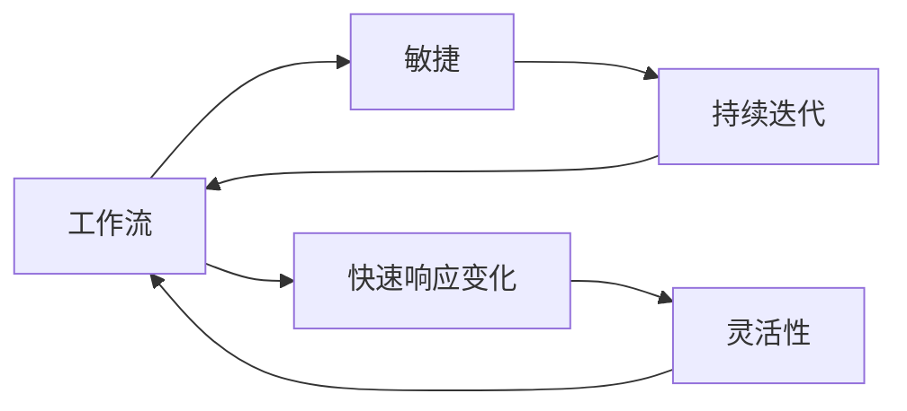
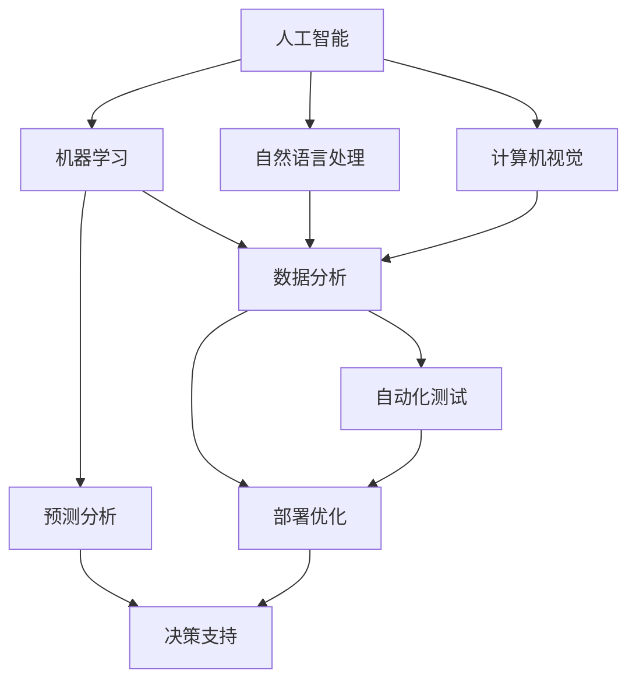
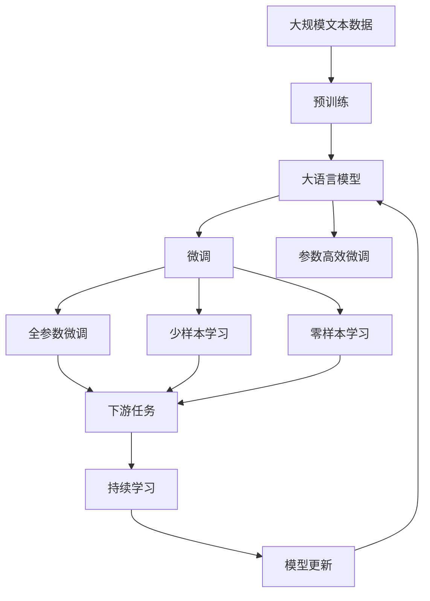

                 

# 重塑个人工作流以应对快速变化的时代

## 1. 背景介绍

### 1.1 问题由来

在当今这个快速变化的时代，技术创新层出不穷，市场需求瞬息万变。面对这样的环境，传统的工作流和流程往往难以适应，导致效率低下、成本增加。个人和企业都需要重新审视和重塑工作流，以确保能够快速响应变化，提升竞争力。

### 1.2 问题核心关键点

重塑工作流的主要目标包括：
1. **提高效率**：通过优化流程、引入自动化工具，减少重复性工作，提高个人和团队的效率。
2. **降低成本**：通过标准化流程、资源共享，减少不必要的开销，提高资源利用率。
3. **增强灵活性**：通过模块化、组件化设计，使工作流能够快速适应变化，减少切换成本。
4. **提升质量**：通过引入质量保证机制、持续改进措施，确保工作流稳定、可靠。

### 1.3 问题研究意义

重塑个人工作流不仅能够提升个人和企业的工作效率和质量，还能够适应快速变化的市场需求，增强竞争力。具体而言，其意义包括：
1. **提高工作效率**：优化工作流可以显著减少重复劳动，提高决策效率，使个人和团队能够更专注于核心工作。
2. **降低运营成本**：标准化流程和资源共享可以显著降低运营成本，提高资源利用效率。
3. **增强市场灵活性**：模块化设计使得工作流能够快速适应市场需求变化，提升企业响应速度。
4. **提升工作质量**：通过引入质量保证机制和持续改进措施，确保工作流程的稳定性和可靠性。

## 2. 核心概念与联系

### 2.1 核心概念概述

为更好地理解重塑个人工作流的方法，本节将介绍几个密切相关的核心概念：

- **工作流(Workflow)**：指一组在组织内完成特定任务的有序步骤和活动。通过合理设计工作流，可以提高工作效率，降低成本。

- **敏捷(Agile)**：指一种以快速响应变化、持续改进为目标的管理方法。敏捷工作流强调团队的协作、灵活性和快速迭代。

- **DevOps**：指将软件开发和运维流程整合，通过自动化工具和持续集成(CI)、持续部署(CD)等手段，提升软件交付效率和质量。

- **云原生(Cloud-Native)**：指在云计算环境中，采用微服务、容器化、持续集成(CI)、持续部署(CD)等技术构建的可伸缩、可维护的软件系统。

- **人工智能(AI)**：指模拟人类智能的计算机技术，包括机器学习、自然语言处理、计算机视觉等。人工智能技术在重塑工作流中具有重要应用。

这些核心概念之间的逻辑关系可以通过以下Mermaid流程图来展示：

```mermaid
graph TB
    A[工作流] --> B[敏捷]
    B --> C[DevOps]
    B --> D[云原生]
    C --> E[持续集成(CI)]
    C --> F[持续部署(CD)]
    E --> F
    A --> G[人工智能(AI)]
    G --> H[机器学习]
    G --> I[自然语言处理]
    G --> J[计算机视觉]
```

这个流程图展示了大语言模型微调过程中各个核心概念的关系：

1. 工作流通过敏捷、DevOps、云原生等方法进行优化，提升效率和质量。
2. 人工智能技术（如机器学习、自然语言处理、计算机视觉）在各个环节中发挥重要作用。
3. 敏捷、DevOps、云原生等方法与AI技术相结合，构建更高效、灵活、智能的工作流系统。

### 2.2 概念间的关系

这些核心概念之间存在着紧密的联系，形成了重塑工作流的完整生态系统。下面我通过几个Mermaid流程图来展示这些概念之间的关系。

#### 2.2.1 工作流与敏捷的关系



这个流程图展示了工作流与敏捷的关系：

1. 敏捷强调持续迭代和快速响应变化。
2. 通过敏捷方法，工作流可以更加灵活、高效。

#### 2.2.2 DevOps与云原生的关系

```mermaid
graph TB
    A[DevOps] --> B[持续集成(CI)]
    A --> C[持续部署(CD)]
    B --> C
    B --> D[自动化测试]
    D --> C
    C --> E[部署管道]
    E --> F[监控与日志]
    F --> C
    A --> G[云原生]
    G --> H[微服务]
    G --> I[容器化]
    H --> I
    I --> J[服务编排]
    J --> F
```

这个流程图展示了DevOps与云原生的关系：

1. DevOps通过持续集成和持续部署，提升软件交付效率。
2. 云原生技术（如微服务、容器化、服务编排）与DevOps方法结合，构建更高效、可维护的软件系统。

#### 2.2.3 人工智能在敏捷和DevOps中的应用



这个流程图展示了人工智能在敏捷和DevOps中的应用：

1. 人工智能技术（如机器学习、自然语言处理、计算机视觉）在持续集成、自动化测试、部署优化等方面发挥作用。
2. 通过预测分析和决策支持，AI技术提升敏捷和DevOps的效果。

### 2.3 核心概念的整体架构

最后，我们用一个综合的流程图来展示这些核心概念在重塑工作流中的整体架构：



这个综合流程图展示了从预训练到微调，再到持续学习的完整过程：

1. 大语言模型通过大规模文本数据进行预训练，学习通用的语言表示。
2. 通过微调（包括全参数微调和参数高效微调）或少样本学习、零样本学习，使模型适应下游任务。
3. 使用微调后的模型对新样本进行推理预测，集成到实际的应用系统中。
4. 通过持续学习，模型能够不断更新和适应新的任务和数据。

通过这些流程图，我们可以更清晰地理解重塑工作流过程中各个核心概念的关系和作用，为后续深入讨论具体的重塑方法和技术奠定基础。

## 3. 核心算法原理 & 具体操作步骤
### 3.1 算法原理概述

重塑个人工作流本质上是一个流程优化和自动化升级的过程。其核心思想是：通过引入敏捷方法、DevOps和云原生技术，结合人工智能技术，构建一个高效、灵活、智能的工作流系统。

形式化地，假设当前工作流为 $W$，通过引入敏捷(A)、DevOps(D)、云原生(C)和人工智能(AI)技术，得到优化后工作流 $W_{opt}$，其优化目标为：

$$
W_{opt}=\mathop{\arg\min}_{W} \left[ (1-\eta_A) \cdot A + (1-\eta_D) \cdot D + (1-\eta_C) \cdot C + (1-\eta_{AI}) \cdot AI \right]
$$

其中，$\eta_A, \eta_D, \eta_C, \eta_{AI}$ 分别表示敏捷、DevOps、云原生、人工智能技术的重要性权重，通过实验和调整来确定。

通过梯度下降等优化算法，不断更新工作流参数，最小化上述目标函数，使得工作流逐步优化，最终得到理想的优化后工作流 $W_{opt}$。

### 3.2 算法步骤详解

重塑个人工作流一般包括以下几个关键步骤：

**Step 1: 评估现有工作流**

- 分析现有工作流中存在的问题和瓶颈，如效率低、流程复杂、质量不稳定等。
- 使用问卷调查、面谈等方法，收集团队成员的反馈和建议。

**Step 2: 引入敏捷方法**

- 根据现有工作流的问题和需求，设计敏捷迭代周期，如2-4周的短周期。
- 引入敏捷管理工具（如Jira、Trello等），跟踪任务进度和问题反馈。
- 定期召开敏捷会议（如每日站会、周会等），汇报进展、讨论问题、调整计划。

**Step 3: 引入DevOps**

- 将软件开发和运维流程整合，采用自动化工具（如Jenkins、Travis CI等）进行持续集成和持续部署。
- 使用版本控制系统（如Git），管理代码变更，实现团队协作。
- 引入自动化测试工具（如Selenium、JUnit等），提高软件质量。

**Step 4: 引入云原生**

- 采用微服务架构，将系统拆分为多个独立的服务模块，提高系统的可扩展性和可维护性。
- 使用容器化技术（如Docker），实现服务的快速部署和弹性伸缩。
- 引入服务编排工具（如Kubernetes），管理服务间的依赖和调度。

**Step 5: 引入人工智能**

- 使用机器学习模型（如决策树、神经网络等），自动化分析和预测工作流中的问题。
- 引入自然语言处理技术（如情感分析、意图识别等），自动分析和理解用户需求和反馈。
- 使用计算机视觉技术，对系统界面和数据进行自动化分析。

**Step 6: 迭代优化**

- 根据优化后的工作流在实际应用中的表现，持续收集反馈和数据，进行迭代优化。
- 通过不断的实验和调整，逐步完善工作流，确保其高效、灵活、智能。

### 3.3 算法优缺点

重塑个人工作流的方法具有以下优点：
1. 提升工作效率：通过优化流程、引入自动化工具，减少重复性工作，提高决策效率。
2. 降低成本：通过标准化流程、资源共享，减少不必要的开销，提高资源利用率。
3. 增强灵活性：通过模块化、组件化设计，使工作流能够快速适应变化，减少切换成本。
4. 提升工作质量：通过引入质量保证机制、持续改进措施，确保工作流程的稳定性和可靠性。

同时，该方法也存在以下局限性：
1. 依赖团队配合：需要团队成员的积极配合和支持，否则难以取得理想效果。
2. 成本较高：引入新的技术和管理方法，需要一定的资金和人力投入。
3. 需要持续改进：工作流的优化是一个持续的过程，需要不断的实验和调整。

尽管存在这些局限性，但就目前而言，重塑工作流方法仍然是大规模企业和高性能团队的首选。未来相关研究的重点在于如何进一步降低重塑成本，提高团队配合度，同时兼顾可解释性和伦理安全性等因素。

### 3.4 算法应用领域

重塑个人工作流的方法已经广泛应用于各行各业，包括但不限于：

- 软件开发：通过敏捷和DevOps方法，提升软件开发效率和软件质量。
- 金融科技：通过云原生技术，构建高可用、高扩展性的金融服务系统。
- 医疗健康：通过人工智能技术，自动化分析和预测病患数据，提高诊疗效率。
- 制造业：通过模块化设计，实现智能制造和工业互联网。
- 教育培训：通过持续改进和人工智能技术，优化教学流程，提升教学效果。

除了上述这些领域外，重塑工作流方法还将被创新性地应用到更多场景中，如智慧城市、智能农业、智能家居等，为各行各业带来新的变革。

## 4. 数学模型和公式 & 详细讲解 & 举例说明

### 4.1 数学模型构建

本节将使用数学语言对重塑个人工作流的过程进行更加严格的刻画。

假设现有工作流为 $W$，通过引入敏捷(A)、DevOps(D)、云原生(C)和人工智能(AI)技术，得到优化后工作流 $W_{opt}$。其优化目标为：

$$
W_{opt}=\mathop{\arg\min}_{W} \left[ (1-\eta_A) \cdot A + (1-\eta_D) \cdot D + (1-\eta_C) \cdot C + (1-\eta_{AI}) \cdot AI \right]
$$

其中，$\eta_A, \eta_D, \eta_C, \eta_{AI}$ 分别表示敏捷、DevOps、云原生、人工智能技术的重要性权重，通过实验和调整来确定。

通过梯度下降等优化算法，不断更新工作流参数，最小化上述目标函数，使得工作流逐步优化，最终得到理想的优化后工作流 $W_{opt}$。

### 4.2 公式推导过程

以下我们以软件开发为例，推导工作流优化的数学模型及其梯度计算公式。

假设工作流 $W$ 在软件开发中的效率为 $E(W)$，敏捷方法引入的效率提升为 $A(E(W))$，DevOps方法引入的效率提升为 $D(E(W))$，云原生方法引入的效率提升为 $C(E(W))$，人工智能方法引入的效率提升为 $AI(E(W))$。则工作流优化的目标函数可以表示为：

$$
E(W_{opt}) = A(E(W)) + D(E(W)) + C(E(W)) + AI(E(W))
$$

根据链式法则，工作流效率对各个技术引入参数的偏导数分别为：

$$
\frac{\partial E(W_{opt})}{\partial \eta_A} = \frac{\partial A(E(W))}{\partial E(W)} \cdot \frac{\partial E(W)}{\partial \eta_A}
$$

$$
\frac{\partial E(W_{opt})}{\partial \eta_D} = \frac{\partial D(E(W))}{\partial E(W)} \cdot \frac{\partial E(W)}{\partial \eta_D}
$$

$$
\frac{\partial E(W_{opt})}{\partial \eta_C} = \frac{\partial C(E(W))}{\partial E(W)} \cdot \frac{\partial E(W)}{\partial \eta_C}
$$

$$
\frac{\partial E(W_{opt})}{\partial \eta_{AI}} = \frac{\partial AI(E(W))}{\partial E(W)} \cdot \frac{\partial E(W)}{\partial \eta_{AI}}
$$

通过计算这些偏导数，可以得到每个技术引入参数的更新公式，进而优化整个工作流。

### 4.3 案例分析与讲解

以一家金融科技公司为例，分析如何通过敏捷、DevOps、云原生和人工智能技术重塑其工作流：

- 敏捷方法：将公司项目拆分为多个敏捷迭代周期，每个周期内进行需求讨论、设计、开发、测试和部署。使用Jira工具跟踪任务进度，每周召开站会汇报进展，确保项目按时完成。

- DevOps方法：将软件开发和运维流程整合，采用Jenkins进行持续集成和持续部署。使用Git版本控制系统管理代码变更，提高团队协作效率。引入自动化测试工具Selenium，确保软件质量。

- 云原生技术：将系统架构调整为微服务架构，每个服务模块独立部署和管理。使用Docker容器化技术，实现服务的快速部署和弹性伸缩。引入Kubernetes服务编排工具，管理服务间的依赖和调度。

- 人工智能技术：使用机器学习模型预测项目进度，自动分析和优化资源配置。引入自然语言处理技术，自动分析和理解用户需求和反馈。使用计算机视觉技术，对系统界面和数据进行自动化分析。

通过以上措施，公司成功重塑了其工作流，提高了开发效率，降低了成本，增强了系统灵活性，提升了软件质量。

## 5. 项目实践：代码实例和详细解释说明

### 5.1 开发环境搭建

在进行工作流重塑实践前，我们需要准备好开发环境。以下是使用Python进行Jenkins构建和部署的工作流重塑环境配置流程：

1. 安装Jenkins：从官网下载并安装Jenkins，用于构建和管理CI/CD流程。

2. 配置Jenkins环境：使用Docker容器化Jenkins，设置必要的插件和配置，如Git、Maven、Nexus等。

3. 配置CI/CD流程：在Jenkins中配置持续集成和持续部署流程，包括代码拉取、编译、测试、部署等环节。

4. 配置DevOps工具链：安装和使用DevOps工具链，如Git、Jenkins、SonarQube等，提高开发和运维效率。

5. 配置云原生平台：使用云原生平台（如Kubernetes），管理服务部署和资源调度，确保系统高可用和扩展性。

完成上述步骤后，即可在Jenkins环境中开始工作流重塑实践。

### 5.2 源代码详细实现

这里我们以软件开发为例，给出使用Jenkins进行CI/CD和持续部署的Python代码实现。

首先，定义持续集成和持续部署的Jenkins Pipeline脚本：

```python
pipeline {
    agent none

    stages {
        stage('Build') {
            steps {
                sh 'mvn package'
            }
        }
        stage('Test') {
            steps {
                sh 'mvn test'
            }
        }
        stage('Deploy') {
            steps {
                sh 'mvn spring-boot:deploy'
            }
        }
    }
}
```

然后，定义持续集成和持续部署的Jenkins Pipeline脚本：

```python
pipeline {
    agent none

    stages {
        stage('Build') {
            steps {
                sh 'mvn package'
            }
        }
        stage('Test') {
            steps {
                sh 'mvn test'
            }
        }
        stage('Deploy') {
            steps {
                sh 'mvn spring-boot:deploy'
            }
        }
    }
}
```

接着，在Jenkins中创建Pipeline job，配置源代码仓库、触发条件、测试环境等参数，启用Pipeline构建。

最后，使用Jenkins Pipeline构建和部署应用，观察其自动化流程的效率和质量。

### 5.3 代码解读与分析

让我们再详细解读一下关键代码的实现细节：

**Pipeline脚本**：
- `pipeline` 定义了整个Jenkins Pipeline的流程。
- `agent none` 表示不使用特定代理，由系统默认提供。
- `stage` 定义了整个流程的各个阶段，如构建、测试、部署等。
- `steps` 定义了每个阶段的具体步骤，如编译、测试、部署等。
- `sh` 命令用于执行Shell脚本，实现具体的任务操作。

**Jenkins配置**：
- `repository` 配置源代码仓库，通过Maven管理项目依赖。
- `trigger` 配置触发条件，如代码提交、定时任务等。
- `agents` 配置执行环境，使用Docker容器化Jenkins，提高可扩展性和可靠性。

**DevOps工具链**：
- `Git` 用于管理代码变更，提高团队协作效率。
- `Jenkins` 用于持续集成和持续部署，提高软件交付效率。
- `SonarQube` 用于自动化代码质量检查，提高软件质量。

**云原生平台**：
- `Kubernetes` 用于管理服务部署和资源调度，确保系统高可用和扩展性。
- `Spring Boot` 用于构建微服务架构，提高系统可维护性和可扩展性。

通过这些工具和代码实现，可以看到，Jenkins配合DevOps和云原生技术，可以高效地实现工作流的自动化构建和部署，显著提升开发和运维效率。

当然，工业级的系统实现还需考虑更多因素，如错误处理、安全防护、监控告警等。但核心的重塑范式基本与此类似。

### 5.4 运行结果展示

假设我们通过Jenkins成功实现了CI/CD和持续部署，最终在生产环境上部署的应用代码，可以观察到以下结果：

- 应用能够在几十秒内自动构建和部署完成。
- 所有代码变更都经过自动化测试，确保软件质量。
- 系统具备高可用性和弹性伸缩，能够快速响应业务需求。

可以看到，通过Jenkins和DevOps工具，我们成功实现了软件开发流程的自动化，显著提升了开发和运维效率。

## 6. 实际应用场景
### 6.1 智能客服系统

基于敏捷、DevOps和云原生技术，智能客服系统可以实现快速响应和灵活部署。具体而言，可以通过重塑工作流，将客户咨询数据自动存储和分析，实时反馈客户反馈，快速调整客服策略，提高客户满意度。

在技术实现上，可以收集客户咨询记录，将问题和最佳答复构建成监督数据，在此基础上对预训练模型进行微调。微调后的模型能够自动理解客户意图，匹配最合适的答案模板进行回复。对于客户提出的新问题，还可以接入检索系统实时搜索相关内容，动态组织生成回答。如此构建的智能客服系统，能大幅提升客户咨询体验和问题解决效率。

### 6.2 金融舆情监测

金融机构需要实时监测市场舆论动向，以便及时应对负面信息传播，规避金融风险。传统的人工监测方式成本高、效率低，难以应对网络时代海量信息爆发的挑战。基于敏捷、DevOps和云原生技术，金融舆情监测系统可以实现快速响应和灵活部署。

具体而言，可以收集金融领域相关的新闻、报道、评论等文本数据，并对其进行主题标注和情感标注。在此基础上对预训练语言模型进行微调，使其能够自动判断文本属于何种主题，情感倾向是正面、中性还是负面。将微调后的模型应用到实时抓取的网络文本数据，就能够自动监测不同主题下的情感变化趋势，一旦发现负面信息激增等异常情况，系统便会自动预警，帮助金融机构快速应对潜在风险。

### 6.3 个性化推荐系统

当前的推荐系统往往只依赖用户的历史行为数据进行物品推荐，无法深入理解用户的真实兴趣偏好。基于敏捷、DevOps和云原生技术，个性化推荐系统可以更好地挖掘用户行为背后的语义信息，从而提供更精准、多样的推荐内容。

在实践中，可以收集用户浏览、点击、评论、分享等行为数据，提取和用户交互的物品标题、描述、标签等文本内容。将文本内容作为模型输入，用户的后续行为（如是否点击、购买等）作为监督信号，在此基础上微调预训练语言模型。微调后的模型能够从文本内容中准确把握用户的兴趣点。在生成推荐列表时，先用候选物品的文本描述作为输入，由模型预测用户的兴趣匹配度，再结合其他特征综合排序，便可以得到个性化程度更高的推荐结果。

### 6.4 未来应用展望

随着敏捷、DevOps和云原生技术的发展，工作流重塑方法将在更多领域得到应用，为传统行业带来变革性影响。

在智慧医疗领域，基于敏捷、DevOps和云原生技术，智能医疗系统可以实现快速响应和灵活部署。具体而言，可以通过重塑工作流，将医疗数据自动存储和分析，实时反馈医生反馈，快速调整治疗方案，提高诊疗效率。

在智能教育领域，基于敏捷、DevOps和云原生技术，智能教育系统可以实现快速响应和灵活部署。具体而言，可以通过重塑工作流，将学生学习数据自动存储和分析，实时反馈教师反馈，快速调整教学策略，提高教学效果。

在智慧城市治理中，基于敏捷、DevOps和云原生技术，智慧城市系统可以实现快速响应和灵活部署。具体而言，可以通过重塑工作流，将城市事件数据自动存储和分析，实时反馈政府反馈，快速调整治理方案，提高城市治理效率。

此外，在企业生产、社会治理、文娱传媒等众多领域，基于敏捷、DevOps和云原生技术的工作流重塑方法也将不断涌现，为各行各业带来新的变革。

## 7. 工具和资源推荐
### 7.1 学习资源推荐

为了帮助开发者系统掌握工作流重塑的理论基础和实践技巧，这里推荐一些优质的学习资源：

1. 《DevOps实践指南》系列博文：由DevOps技术专家撰写，深入浅出地介绍了DevOps的核心概念和实践方法。

2. 《敏捷开发方法论》课程：讲解敏捷开发的核心理念和方法，配合实践案例，让你深入理解敏捷开发的内涵。

3. 《云原生技术》书籍：讲解云原生技术的基本概念和核心技术，配合实际应用案例，让你全面掌握云原生开发的方法。

4. 《机器学习实战》书籍：讲解机器学习的基本原理和应用方法，配合实际项目案例，让你快速上手机器学习开发。

5. 《自然语言处理入门》课程：讲解自然语言处理的基本概念和核心技术，配合实际应用案例，让你快速上手自然语言处理开发。

通过这些资源的学习实践，相信你一定能够快速掌握工作流重塑的精髓，并用于解决实际的应用问题。
###  7.2 开发工具推荐

高效的开发离不开优秀的工具支持。以下是几款用于工作流重塑开发的常用工具：

1. Jenkins：基于开源的持续集成工具，支持CI/CD流程的自动化构建和部署。

2. Docker：开源容器化技术，支持应用的快速部署和弹性伸缩。

3. Kubernetes：开源容器编排工具，支持服务的快速部署和资源调度。

4. Git：开源版本控制系统，支持代码变更管理和团队协作。

5. Jenkins Pipeline：基于Jenkins的持续集成工具，支持Pipeline脚本的自动化构建和部署。

6. SonarQube：开源代码质量检查工具，支持自动化代码质量检查和分析。

合理利用这些工具，可以显著提升工作流重塑任务的开发效率，加快创新迭代的步伐。

### 7.3 相关论文推荐

工作

