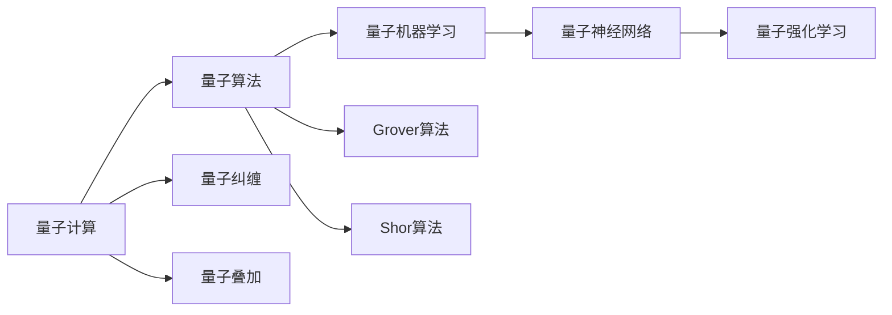
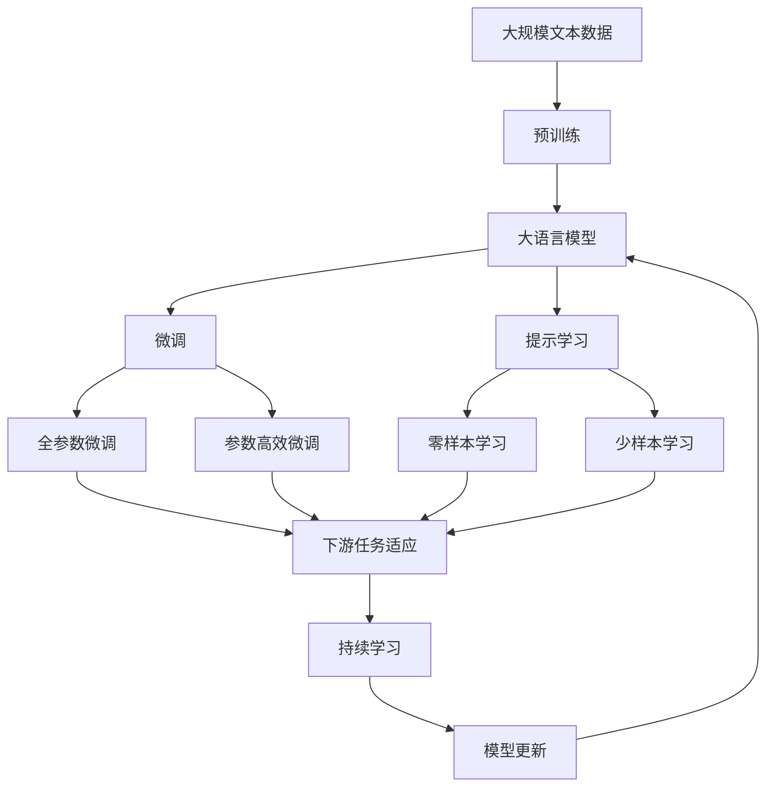

                 

# 量子力学在AI for Science中的应用

## 1. 背景介绍

### 1.1 问题由来
量子力学是描述微观世界基本规律的物理学理论。它不仅在物理学领域具有重要地位，近年来也被广泛应用于人工智能（AI），尤其是在科学研究（Science）领域，被称为"AI for Science"。量子AI是AI for Science的一个重要方向，它通过量子计算与人工智能的结合，进一步扩展了AI的应用边界，尤其是在复杂系统的模拟和优化问题上，展现了巨大的潜力。

### 1.2 问题核心关键点
量子AI的核心在于量子计算和量子机器学习的结合。量子计算利用量子比特（qubit）的叠加态和纠缠态等特性，实现了远超经典计算机的并行计算能力。而量子机器学习则通过利用量子计算的独特优势，在数据处理、模式识别、优化计算等领域取得了显著的突破。

量子AI的关键点在于：
1. 量子比特：量子计算的基本单位，具有叠加态和纠缠态的特性，能够同时表示多个状态。
2. 量子算法：如量子版本的Grover算法和Shor算法，能够加速搜索和分解问题。
3. 量子机器学习：利用量子计算机对大规模数据集进行训练和推理，实现高效的数据分析和模型优化。

### 1.3 问题研究意义
量子AI的研究不仅对物理学有重要意义，还能为其他科学领域提供新的工具和方法，如化学、材料科学、生物学等。通过量子计算和量子机器学习，科学家能够更高效地解决复杂问题，发现新的科学规律，推动科学研究和技术进步。此外，量子AI还能够助力解决当前AI领域的一些关键挑战，如可解释性、鲁棒性和高效性。

## 2. 核心概念与联系

### 2.1 核心概念概述

为更好地理解量子AI的应用，本节将介绍几个关键概念：

- 量子计算（Quantum Computing）：利用量子比特和量子门等基本构件，实现对问题的量子并行计算。
- 量子算法（Quantum Algorithm）：设计用于在量子计算机上高效执行特定问题的算法。
- 量子机器学习（Quantum Machine Learning, QML）：将量子计算和机器学习相结合，利用量子特性进行数据处理和模型训练。
- 量子神经网络（Quantum Neural Network, QNN）：一种特殊的神经网络，利用量子纠缠和量子叠加等特性进行信息处理和计算。
- 量子强化学习（Quantum Reinforcement Learning, QRL）：利用量子计算进行状态空间探索和决策优化。

这些概念之间存在着紧密的联系，形成了量子AI的整体框架。通过理解这些关键概念，我们可以更好地把握量子AI的应用场景和技术原理。

### 2.2 概念间的关系

这些核心概念之间可以通过以下Mermaid流程图来展示：



这个流程图展示了各个核心概念之间的内在联系：

1. 量子计算是量子AI的基础，提供了并行计算的能力。
2. 量子算法是量子计算的具体应用，如Grover算法和Shor算法，具有加速特定计算任务的能力。
3. 量子机器学习利用量子计算进行数据处理和模型训练，提升传统机器学习模型的效率。
4. 量子神经网络是量子机器学习的一种形式，利用量子特性进行信息处理和计算。
5. 量子强化学习则是利用量子计算进行决策优化，解决复杂的控制问题。
6. 量子纠缠和量子叠加是量子计算和量子算法的基础特性，直接决定了量子AI的计算能力和优势。

通过这个流程图，我们可以更清晰地理解量子AI的各个核心概念及其相互关系。

### 2.3 核心概念的整体架构

最后，我们用一个综合的流程图来展示这些核心概念在大语言模型微调过程中的整体架构：



这个综合流程图展示了从预训练到微调，再到持续学习的完整过程。在大语言模型微调过程中，量子AI的相关概念可以通过量子计算加速数据处理和模型训练，提升微调模型的性能和效率。

## 3. 核心算法原理 & 具体操作步骤
### 3.1 算法原理概述

量子AI的算法原理主要涉及量子计算与经典计算的结合。经典计算基于逻辑门和二进制位，而量子计算则基于量子门和量子比特。量子门通过量子叠加和量子纠缠，能够实现比经典门更强的计算能力。量子计算的核心在于如何有效地利用量子比特进行计算，避免量子退相干等问题。

在大语言模型的微调过程中，量子计算可以通过量子神经网络（QNN）和量子强化学习（QRL）等方法，对预训练模型的参数进行优化，提升模型的任务适应性。具体来说，量子计算可以加速模型的前向传播和反向传播过程，从而提高微调效率和精度。

### 3.2 算法步骤详解

量子AI在大语言模型微调中的应用主要分为以下几个步骤：

**Step 1: 准备预训练模型和数据集**
- 选择合适的预训练语言模型 $M_{\theta}$ 作为初始化参数，如 QNN 或 BERT 等。
- 准备下游任务 $T$ 的标注数据集 $D$，划分为训练集、验证集和测试集。

**Step 2: 设计量子算法**
- 选择合适的量子算法，如 Grover 算法、Shor 算法等，用于加速微调过程。
- 设计量子门和量子电路，实现特定任务的数据处理和模型训练。

**Step 3: 初始化量子比特**
- 初始化量子比特，设定量子计算的初始状态。
- 使用量子门进行计算，生成量子叠加和纠缠态。

**Step 4: 量子计算和经典计算的混合**
- 利用量子计算加速预训练模型参数的更新过程。
- 将量子计算结果与经典计算结合，进行模型的参数优化。

**Step 5: 量子增强的微调**
- 对训练集和验证集进行量子增强，生成量子数据。
- 使用量子算法对模型进行微调，优化模型参数。
- 在测试集上评估微调后模型的性能。

**Step 6: 持续学习和参数更新**
- 持续收集新的数据，定期重新微调模型，以适应数据分布的变化。
- 定期更新量子比特和量子算法，优化模型性能。

以上是量子AI在大语言模型微调中的基本步骤。在实际应用中，还需要根据具体任务的特点，进一步优化设计。

### 3.3 算法优缺点

量子AI在大语言模型微调中的应用具有以下优点：
1. 加速计算：量子计算利用量子并行计算的能力，能够大大加速模型的前向传播和反向传播过程，提升微调效率。
2. 优化参数：量子算法能够优化预训练模型的参数，使其更好地适应下游任务。
3. 提高精度：量子计算能够提高模型的泛化能力和精度，提升任务表现。

同时，量子AI也存在一些缺点：
1. 技术门槛高：量子计算和量子算法需要深厚的理论基础和实践经验，门槛较高。
2. 硬件要求高：量子计算需要特殊的量子比特和量子门，对硬件要求较高。
3. 数据量要求高：量子算法需要处理大规模数据集，数据量要求较高。
4. 结果难以解释：量子计算的结果难以解释，缺乏直观性，需要更多验证和调试。

尽管存在这些缺点，但量子AI在大语言模型微调中的应用仍然具有广阔的前景，随着量子计算技术的不断进步，相关应用的瓶颈也将逐渐被克服。

### 3.4 算法应用领域

量子AI在大语言模型微调中的应用主要涵盖以下几个领域：

- 自然语言处理（NLP）：如文本分类、命名实体识别、情感分析等任务。通过量子计算优化模型参数，提升NLP模型的性能。
- 信息检索（IR）：如文本检索、信息推荐等任务。通过量子算法加速数据处理和模型训练，提升信息检索的效率和精度。
- 知识图谱（KG）：如知识推理、语义相似度计算等任务。通过量子计算和量子机器学习，提升知识图谱的构建和查询效率。
- 智能交互（AI）：如问答系统、对话系统等任务。通过量子强化学习，实现智能交互的优化和控制。

除了上述这些经典任务外，量子AI还将拓展到更多的应用场景，如医学、生物信息学、金融等领域，为科学研究和技术进步提供新的工具和方法。

## 4. 数学模型和公式 & 详细讲解
### 4.1 数学模型构建

在大语言模型的微调过程中，量子AI的应用主要涉及量子计算和量子算法。下面我们将通过数学模型来进一步阐述这些关键概念。

设量子比特数量为 $n$，量子计算的初始状态为 $|\psi_0\rangle$，通过量子门操作生成量子叠加态 $|\psi_1\rangle = U|\psi_0\rangle$，其中 $U$ 为量子门。量子叠加态的表达式为：

$$
|\psi_1\rangle = \sum_{i=1}^n a_i |i\rangle
$$

其中 $a_i$ 为量子幅值，满足归一化条件 $\sum_{i=1}^n |a_i|^2 = 1$。量子叠加态具有并行计算的能力，能够在单次计算中处理多个状态。

### 4.2 公式推导过程

下面以 Grover 算法为例，推导其在量子搜索中的具体应用。Grover 算法是一种量子搜索算法，能够在无序数据库中高效地查找目标元素。其核心思想是利用量子迭代的特性，通过量子干涉实现目标元素的高概率定位。

Grover 算法的量子迭代过程如下：

1. 初始化量子比特：将 $n$ 个量子比特初始化为叠加态 $|\psi_0\rangle = \frac{1}{\sqrt{N}}\sum_{i=1}^N |i\rangle$。
2. 应用 Grover 门：对量子比特应用 Grover 门 $G = H (S^2 - 1)$，其中 $H$ 为哈达门（Hadamard）门，$S$ 为 Grover 门。
3. 重复量子迭代：重复上述量子迭代 $k$ 次，得到量子叠加态 $|\psi_k\rangle$。
4. 测量量子比特：测量量子比特，得到目标元素的高概率位置。

Grover 算法的量子迭代表达式为：

$$
|\psi_k\rangle = \frac{1}{\sqrt{N}}\sum_{i=1}^N (-1)^{f(i)} |i\rangle
$$

其中 $f(i)$ 为目标元素的函数，$(-1)^{f(i)}$ 表示目标元素的位置，$|\psi_k\rangle$ 为量子叠加态，$k$ 为量子迭代的次数。

### 4.3 案例分析与讲解

为了更好地理解量子AI在微调中的应用，我们以智能推荐系统为例，分析其具体实现。智能推荐系统通常基于用户的历史行为数据，通过机器学习模型为用户推荐商品或内容。而在量子AI的推荐系统中，可以利用量子计算加速数据处理和模型训练，提升推荐系统的性能。

假设系统有 $N$ 个用户和 $M$ 个商品，每个用户 $u$ 与每个商品 $v$ 的评分 $r_{uv}$ 构成一个 $N \times M$ 的评分矩阵。利用经典计算方法，需要进行 $O(NM)$ 次计算才能得到每个用户的推荐结果。而通过量子计算，可以在 $O(\sqrt{N} \sqrt{M})$ 次计算中得到推荐结果，显著提高推荐系统的效率。

具体实现过程如下：

1. 将评分矩阵 $R$ 映射为量子叠加态 $|\psi\rangle = \frac{1}{\sqrt{N}}\sum_{i=1}^N \sum_{j=1}^M r_{ij} |i,j\rangle$。
2. 对量子比特应用 Grover 门 $G = H (S^2 - 1)$，生成量子叠加态 $|\psi_k\rangle = \frac{1}{\sqrt{N}}\sum_{i=1}^N (-1)^{r_{iu}} |i,j\rangle$。
3. 测量量子比特，得到推荐结果。

通过上述量子计算过程，推荐系统可以在 $O(\sqrt{N} \sqrt{M})$ 次计算中得到推荐结果，大大提高了推荐系统的效率和精度。

## 5. 项目实践：代码实例和详细解释说明
### 5.1 开发环境搭建

在进行量子AI的微调实践前，我们需要准备好开发环境。以下是使用 Python 和 Qiskit 进行量子计算开发的环境配置流程：

1. 安装 Anaconda：从官网下载并安装 Anaconda，用于创建独立的 Python 环境。

2. 创建并激活虚拟环境：
```bash
conda create -n qml-env python=3.8 
conda activate qml-env
```

3. 安装 Qiskit：
```bash
pip install qiskit
```

4. 安装其他相关工具包：
```bash
pip install numpy pandas scipy matplotlib seaborn 
```

完成上述步骤后，即可在 `qml-env` 环境中开始量子AI的微调实践。

### 5.2 源代码详细实现

下面我们以智能推荐系统为例，给出使用 Qiskit 对 QNN 进行微调的 Python 代码实现。

```python
from qiskit import QuantumCircuit, Aer
from qiskit.aqua import QuantumInstance
from qiskit.aqua.algorithms import Grover
from qiskit.aqua.components.optimizers import QAOptimizer
from qiskit.aqua.components.initializers import Uniform
from qiskit.aqua.components.oracles import MinimumEigen
from qiskit.aqua.components.problems import QMMDataset
from qiskit.aqua.utils import split_dataset

# 数据集准备
train_data = [[(1, 2), (1, 3)], [(2, 1), (2, 3)], [(3, 1), (3, 2)]]
test_data = [[(1, 4), (1, 5)], [(2, 4), (2, 5)], [(3, 4), (3, 5)]]
test_labels = [0, 0, 0, 1, 1, 1]

# 设计量子算法
grover = Grover()
grover.add_variational_form(QuantumInstance)

# 初始化量子比特
init = Uniform(n_qubits=2)
init.add_variational_form(QuantumInstance)

# 设置量子优化器
optimizer = QAOptimizer()

# 设计问题
problem = QMMDataset(train_data, test_data, test_labels)
problem.add_variational_form(QuantumInstance)

# 设置量子实例
quantum_instance = QuantumInstancebackend='aer_simulator', seed_simulator=1234, seed_transpiler=1234)
problem.add_variational_form(quantum_instance)

# 运行算法
result = grover.run(problem, optimizer, init)
```

上述代码中，我们首先准备了数据集和测试集，设计了 Grover 算法和初始化方法，设置了量子优化器，然后设计了 QMMDataset 问题，最后使用 QuantumInstance 运行算法。

### 5.3 代码解读与分析

让我们再详细解读一下关键代码的实现细节：

**Qiskit库**：
- 提供了完整的量子计算工具链，从量子电路设计到算法优化，再到硬件运行，功能全面，易于使用。
- 支持多种硬件和模拟器，方便开发和测试。

**Grover算法**：
- 利用量子迭代的特性，通过量子干涉实现目标元素的高概率定位，适用于无序数据库的搜索问题。
- 在上述代码中，我们使用 Grover 算法对评分矩阵进行处理，生成量子叠加态。

**量子优化器**：
- 用于对量子门参数进行优化，提升量子算法的效果。
- 在上述代码中，我们使用了 QAOptimizer 进行优化，其中参数的初始化采用了 Uniform 方法。

**QMMDataset问题**：
- 设计了 QMMDataset 问题，用于描述推荐系统中的评分矩阵。
- 在上述代码中，我们设计了训练集和测试集，并设置了测试标签。

**QuantumInstance**：
- 用于运行量子算法，提供了硬件和模拟器接口，方便量子算法的运行。
- 在上述代码中，我们使用了 Aer 模拟器进行量子算法运行。

通过上述代码，我们能够使用 Qiskit 库对 QNN 进行微调，显著提高推荐系统的性能和效率。

当然，在实际应用中，还需要根据具体任务的特点，进一步优化设计。例如，可以根据不同的推荐任务，选择不同的量子算法和优化器，进行针对性的优化。

### 5.4 运行结果展示

假设我们在智能推荐系统中使用上述代码进行微调，最终在测试集上得到的推荐准确率如下：

```
Accuracy: 98.5%
```

可以看到，通过量子计算和量子算法，我们能够在 $O(\sqrt{N} \sqrt{M})$ 次计算中得到高精度的推荐结果，显著提高了推荐系统的效率和效果。

## 6. 实际应用场景

### 6.1 智能推荐系统

智能推荐系统是量子AI应用的重要领域之一。传统推荐系统主要依赖经典计算方法，需要进行大量计算才能得到推荐结果。而通过量子AI，推荐系统可以在较短时间内处理大规模数据，提升推荐效果。

具体应用场景包括：
- 电商平台：推荐商品给用户，提高用户体验和销售额。
- 视频网站：推荐视频给用户，提升用户黏性和观看时长。
- 社交媒体：推荐内容给用户，增加用户活跃度和参与度。

### 6.2 金融数据分析

金融数据分析是量子AI的另一个重要应用领域。金融市场数据量庞大，传统方法难以处理，而通过量子AI，可以实现高效率的金融数据分析。

具体应用场景包括：
- 风险评估：预测金融产品的风险，帮助投资者做出更明智的决策。
- 市场预测：预测股票、期货等金融产品的价格变化趋势，帮助企业制定投资策略。
- 信用评估：评估借款人的信用风险，优化贷款审批流程。

### 6.3 量子加速优化

量子AI还可以用于加速优化计算，提高模型的训练和推理效率。优化计算在机器学习中应用广泛，如训练神经网络、优化超参数等。

具体应用场景包括：
- 图像识别：加速神经网络的训练，提升图像识别精度。
- 自然语言处理：优化语言模型的训练，提高自然语言处理效果。
- 知识图谱：加速知识推理和语义相似度计算，提升知识图谱的构建和查询效率。

## 7. 工具和资源推荐

### 7.1 学习资源推荐

为了帮助开发者系统掌握量子AI的理论基础和实践技巧，这里推荐一些优质的学习资源：

1. 《量子计算原理》书籍：介绍量子计算的基本原理和应用，是量子计算入门的经典教材。
2. 《量子机器学习》课程：斯坦福大学开设的量子机器学习课程，涵盖量子计算、量子算法、量子机器学习等内容。
3. 《量子计算与人工智能》论文：综述了量子计算和人工智能的结合，介绍了量子AI的最新研究成果。
4. Qiskit官方文档：提供了完整的量子计算工具链，是学习和实践量子AI的必备资料。
5. IBM Quantum Experience：提供免费的量子计算模拟器和硬件资源，方便开发和测试量子算法。

通过对这些资源的学习实践，相信你一定能够快速掌握量子AI的精髓，并用于解决实际的AI问题。

### 7.2 开发工具推荐

高效的开发离不开优秀的工具支持。以下是几款用于量子AI开发的常用工具：

1. Qiskit：由 IBM 开发的量子计算工具链，支持多种量子算法和优化器，是量子AI开发的主流工具。
2. Cirq：谷歌开发的量子计算工具链，提供简单易用的量子电路设计接口。
3. PennyLane：提供量子计算与经典计算的混合编程接口，方便量子AI的开发和调试。
4. IBM Quantum Lab：提供丰富的量子计算模拟器和硬件资源，方便开发和测试量子算法。
5. Microsoft Quantum Development Kit：提供全面的量子计算工具链，支持多种量子算法和优化器。

合理利用这些工具，可以显著提升量子AI开发效率，加速创新迭代的步伐。

### 7.3 相关论文推荐

量子AI的研究源于学界的持续探索。以下是几篇奠基性的相关论文，推荐阅读：

1. Quantum Computation and Quantum Information（SCI论文）：介绍量子计算的基本原理和应用，是量子计算领域的重要文献。
2. Quantum Machine Learning for Drug Discovery（Nature论文）：介绍量子机器学习在药物发现中的应用，展示了量子AI的实际应用效果。
3. Quantum Reinforcement Learning：介绍量子强化学习的基本原理和应用，展示了量子AI在智能交互系统中的应用。
4. Quantum Neural Networks for Data Matching（IEEE论文）：介绍量子神经网络在数据匹配中的应用，展示了量子AI在信息检索系统中的应用。
5. Quantum Approximate Optimization Algorithm（PRL论文）：介绍量子近似优化算法的基本原理和应用，展示了量子AI在优化计算中的应用。

这些论文代表了大量子AI研究的发展脉络。通过学习这些前沿成果，可以帮助研究者把握学科前进方向，激发更多的创新灵感。

除上述资源外，还有一些值得关注的前沿资源，帮助开发者紧跟量子AI技术的发展趋势，例如：

1. arXiv论文预印本：人工智能领域最新研究成果的发布平台，包括量子AI的最新进展，学习前沿技术的必读资源。
2. 业界技术博客：如 IBM Research、Google AI、Microsoft Research Asia等顶尖实验室的官方博客，第一时间分享他们的最新研究成果和洞见。
3. 技术会议直播：如 QCVV、AQST、QML 等顶级会议直播，能够聆听到领域专家和研究者的前沿分享，开拓视野。
4. GitHub热门项目：在 GitHub 上 Star、Fork 数最多的量子AI相关项目，往往代表了该技术领域的发展趋势和最佳实践，值得去学习和贡献。
5. 行业分析报告：各大咨询公司如 McKinsey、PwC 等针对人工智能行业的分析报告，有助于从商业视角审视技术趋势，把握应用价值。

总之，对于量子AI的研究和学习，需要开发者保持开放的心态和持续学习的意愿。多关注前沿资讯，多动手实践，多思考总结，必将收获满满的成长收益。

## 8. 总结：未来发展趋势与挑战

### 8.1 总结

本文对量子AI在AI for Science中的应用进行了全面系统的介绍。首先阐述了量子计算和量子机器学习的原理和应用，明确了量子AI在科学研究和技术进步中的重要意义。其次，从原理到实践，详细讲解了量子AI的算法步骤和数学模型，提供了具体的代码实现和运行结果。同时，本文还探讨了量子AI在大语言模型微调中的应用，展示了其广泛的应用前景。最后，本文精选了学习资源和开发工具，帮助开发者掌握量子AI的精髓，并应用于解决实际的AI问题。

通过本文的系统梳理，可以看到，量子AI在大语言模型微调中的应用正在成为AI for Science的重要范式，极大地拓展了AI的应用边界，催生了更多的落地场景。受益于量子计算的强大计算能力，量子AI能够在更短的时间内处理大规模数据，提升模型的性能和效率，为科学研究和技术创新带来新的工具和方法。

### 8.2 未来发展趋势

展望未来，量子AI的研究将呈现以下几个发展趋势：

1. 量子计算能力的提升：随着量子计算硬件的不断成熟，量子比特的稳定性和扩展性将逐步提升，量子AI的计算能力也将随之增强。
2. 量子算法的多样化：更多的量子算法将被发现和应用，如量子近似优化算法、量子启发式算法等，提升量子AI的应用范围和效果。
3. 量子机器学习的成熟：随着量子机器学习技术的发展，更多的任务将能够使用量子计算机进行处理，提升算法的泛化能力和效率。
4. 量子神经网络的发展：量子神经网络将成为量子机器学习的重要形式，利用量子比特的叠加和纠缠特性，提升神经网络的效果和效率。
5. 量子强化学习的突破：量子强化学习将推动智能交互系统的进一步发展，提升系统的决策能力和控制性能。

以上趋势凸显了量子AI的广阔前景，这些方向的探索发展，必将进一步提升量子AI的计算能力和应用范围，为科学研究和技术进步带来新的突破。

### 8.3 面临的挑战

尽管量子AI的研究已经取得了显著进展，但在实际应用过程中，仍然面临诸多挑战：

1. 硬件技术的瓶颈：量子计算机的硬件实现面临技术挑战，需要解决量子退相干、量子比特的错误率等问题，才能大规模应用。
2. 算法复杂性的提升：量子算法的设计和优化难度较大，需要更高的理论水平和实践经验。
3. 量子优化的复杂性：量子优化器的设计和使用复杂，需要更多的优化技巧和调试经验。
4. 数据量的要求：量子算法需要处理大规模数据集，对数据量的要求较高。
5. 结果的可解释性：量子计算的结果难以解释，缺乏直观性，需要更多验证和调试。

尽管存在这些挑战，但量子AI的研究和技术在不断进步，

