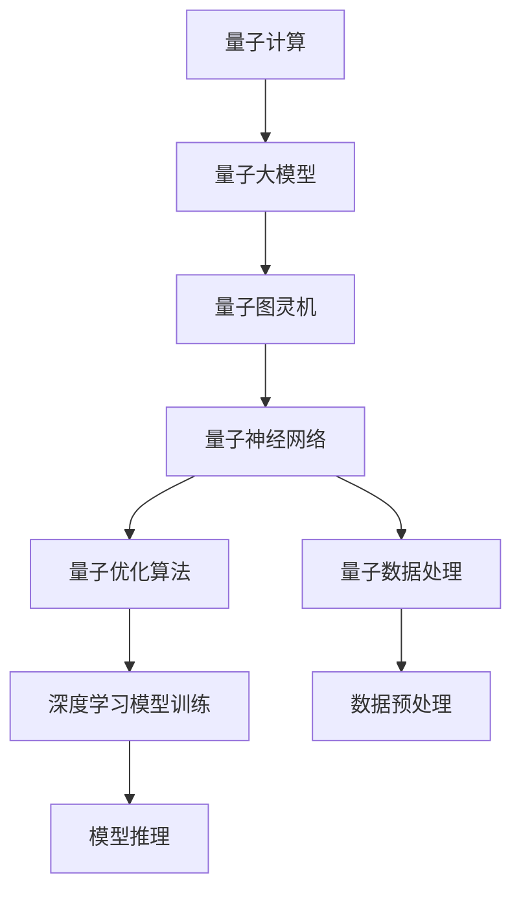
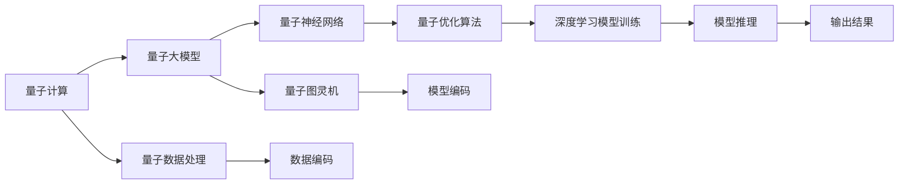

                 

# 量子大模型:量子计算为AI注入新动力

> 关键词：量子计算,量子大模型,人工智能,机器学习,深度学习,量子图灵机

## 1. 背景介绍

### 1.1 问题由来
随着量子计算技术的不断成熟，其在人工智能（AI）领域的应用潜力逐渐被世人所瞩目。量子计算利用量子力学的原理，通过量子比特（qubits）进行信息处理，能够实现超越传统计算机的计算能力。量子大模型即是在量子计算框架下训练的深度学习模型，旨在利用量子计算的优势，进一步提升模型的性能和能力。

当前，全球范围内众多科研机构和企业正在积极探索量子计算在AI中的应用。例如，Google的Sycamore量子计算机在2019年成功实现了量子霸权，预示着量子计算的未来潜力。IBM、Rigetti等公司也在开发量子AI平台，推动量子计算在NLP、机器学习等领域的实际应用。

### 1.2 问题核心关键点
量子大模型结合了深度学习和量子计算的技术，其核心思想是通过量子计算框架加速深度学习模型的训练和推理过程，以实现更高效的计算和更强大的模型表达能力。关键点包括：

- 量子计算加速：通过量子计算的并行性和量子纠缠特性，加速深度学习模型的参数更新和梯度计算。
- 量子特征提取：利用量子计算的特殊运算规则，提取更丰富的特征信息。
- 量子优化算法：开发适用于量子计算环境的优化算法，提升模型的收敛速度和性能。
- 量子数据处理：利用量子计算处理大规模数据，提升模型的泛化能力。

### 1.3 问题研究意义
量子大模型的研究对于提升AI的计算能力和模型性能具有重要意义：

- 提升计算效率：量子计算的高并行性和量子纠缠特性，能够显著提升深度学习模型的训练和推理速度，缩短计算时间。
- 增强模型表达：量子计算提供了新的计算模式和运算规则，使得深度学习模型能够更好地表达复杂的关系和结构。
- 扩展应用场景：量子大模型可以在多个领域应用，如药物设计、材料科学、金融预测等，推动这些领域的技术进步。
- 推动跨学科融合：量子计算与AI的结合，促进了计算机科学、物理、数学等多学科的融合，为前沿研究提供了新的方向。
- 推动产业创新：量子AI技术的应用，将为AI行业带来新的商业模式和技术壁垒，加速产业升级。

## 2. 核心概念与联系

### 2.1 核心概念概述

为更好地理解量子大模型的基本原理和结构，本节将介绍几个关键概念：

- **量子计算**：利用量子力学原理进行信息处理和计算，具有并行性和量子纠缠等特性，能够实现比传统计算更高的计算能力。
- **量子大模型**：在量子计算框架下训练的深度学习模型，结合了深度学习和量子计算的技术，旨在提升模型的计算能力和表达能力。
- **量子图灵机**：量子计算的基础理论模型，通过量子比特的操作实现计算，类比于传统计算的Turing机。
- **量子神经网络**：利用量子计算原理，构建的神经网络模型，能够处理量子态和量子纠缠等特性。
- **量子优化算法**：在量子计算框架下设计的新型优化算法，如量子退火、量子梯度下降等，用于加速模型的训练和优化。
- **量子数据处理**：利用量子计算的特殊运算规则，进行数据编码和处理，提升模型的泛化能力。

这些核心概念之间存在紧密的联系，形成了一个完整的量子大模型生态系统。下面我们通过Mermaid流程图来展示这些概念之间的关系。



### 2.2 概念间的关系

这些核心概念之间的逻辑关系可以通过以下Mermaid流程图来展示：



通过这些流程图，我们可以更清晰地理解量子大模型的核心概念及其关系，为后续深入讨论具体的量子大模型实现和应用提供基础。

## 3. 核心算法原理 & 具体操作步骤
### 3.1 算法原理概述

量子大模型的核心算法原理基于量子计算的并行性和量子纠缠特性，通过量子计算框架加速深度学习模型的训练和推理过程。其核心思想是：

- **量子并行性**：量子计算通过量子比特的叠加和量子纠缠，能够实现超大规模的并行计算，加速模型的参数更新和梯度计算。
- **量子优化算法**：开发适用于量子计算环境的优化算法，如量子退火、量子梯度下降等，提升模型的收敛速度和性能。
- **量子特征提取**：利用量子计算的特殊运算规则，提取更丰富的特征信息，提升模型的表达能力。
- **量子数据处理**：利用量子计算的特殊运算规则，进行数据编码和处理，提升模型的泛化能力。

### 3.2 算法步骤详解

量子大模型的构建和微调大致包括以下几个步骤：

**Step 1: 量子计算框架的选择**
- 选择适合的量子计算框架，如Google的Cirq、IBM的Qiskit等，这些框架提供了丰富的量子计算操作和工具。
- 根据具体任务需求，选择合适的量子计算模型和算法。

**Step 2: 量子神经网络设计**
- 设计适合量子计算环境的神经网络结构，如量子卷积神经网络（QCNN）、量子生成对抗网络（QGAN）等。
- 确定量子神经网络的层数、激活函数、参数数量等关键参数。

**Step 3: 量子优化算法实现**
- 实现适用于量子计算环境的优化算法，如量子退火、量子梯度下降等。
- 根据任务特点，选择适合的优化算法并进行参数调优。

**Step 4: 数据编码和处理**
- 利用量子计算的特殊运算规则，对输入数据进行编码和预处理。
- 对数据进行量子特征提取和增强，提升模型的特征表达能力。

**Step 5: 模型训练和微调**
- 利用量子计算加速模型训练，通过量子优化算法进行参数更新。
- 根据任务需求，进行模型微调，优化模型的输出结果。

**Step 6: 模型推理和应用**
- 将训练好的量子大模型进行推理和应用，输出预测结果。
- 根据实际需求，对模型进行优化和调整，提升模型性能。

### 3.3 算法优缺点

量子大模型在提升计算能力和模型性能方面具有显著优势，但也存在以下局限性：

**优点：**
- **计算效率高**：量子计算的并行性和量子纠缠特性，能够显著提升深度学习模型的训练和推理速度，缩短计算时间。
- **模型表达能力强**：量子计算提供了新的计算模式和运算规则，使得深度学习模型能够更好地表达复杂的关系和结构。
- **泛化能力强**：利用量子计算的特殊运算规则，进行数据编码和处理，提升模型的泛化能力。

**缺点：**
- **硬件复杂度高**：量子计算硬件复杂度高，成本昂贵，需要高精度的量子比特和量子纠缠状态控制。
- **实现难度大**：量子计算的实现涉及量子态的编码、量子操作和量子纠错等复杂技术，需要跨学科的合作和研究。
- **稳定性差**：量子计算存在量子退相干等问题，导致模型性能和稳定性较差。
- **数据处理复杂**：量子计算的数据编码和处理较为复杂，需要设计合适的量子编码方案。

### 3.4 算法应用领域

量子大模型已经在多个领域得到了初步应用，包括但不限于：

- **量子机器学习**：利用量子计算的特性，加速机器学习模型的训练和推理过程。
- **药物设计**：利用量子计算处理大规模的分子结构数据，提升新药发现和分子模拟的速度和精度。
- **金融预测**：利用量子计算处理海量金融数据，提升风险评估和投资预测的准确性。
- **智能制造**：利用量子计算处理工业数据，优化生产流程和设备维护。
- **量子通信**：利用量子计算进行安全通信和数据加密。

此外，量子大模型还在语音识别、图像处理、自然语言处理等领域展现出良好的应用前景。随着量子计算技术的不断成熟，未来量子大模型的应用场景将更加广泛。

## 4. 数学模型和公式 & 详细讲解 & 举例说明
### 4.1 数学模型构建

量子大模型的数学模型构建，需要结合深度学习和量子计算的知识。假设量子神经网络为 $QNN_{\theta}$，其中 $\theta$ 为量子神经网络的参数。输入数据为 $x \in \mathbb{R}^n$，输出为 $y \in \mathbb{R}^m$。量子大模型的数学模型如下：

$$
QNN_{\theta}(x) = \mathbb{E}_{\epsilon}[\hat{QNN}_{\theta}(x, \epsilon)]
$$

其中，$\hat{QNN}_{\theta}(x, \epsilon)$ 表示在量子计算环境下的量子神经网络，$\epsilon$ 表示量子噪声。量子神经网络的输出为：

$$
\hat{QNN}_{\theta}(x, \epsilon) = Q^{(0)}(x) \cdot Q^{(1)}(Q^{(0)}(x)) \cdots Q^{(L)}(Q^{(L-1)}(Q^{(0)}(x)))
$$

其中，$Q^{(l)}$ 表示量子神经网络的层函数，$l \in [0, L]$。

### 4.2 公式推导过程

量子大模型的训练过程可以通过量子优化算法进行，以最大化损失函数 $L(QNN_{\theta}, y)$。假设输出 $y$ 的损失函数为 $l(y, QNN_{\theta}(x))$，则量子大模型的训练目标为：

$$
\min_{\theta} L(QNN_{\theta}, y) = \min_{\theta} \frac{1}{N} \sum_{i=1}^N l(y_i, QNN_{\theta}(x_i))
$$

量子优化算法包括量子退火、量子梯度下降等，其训练过程如下：

1. 初始化量子神经网络的参数 $\theta$。
2. 将输入数据 $x$ 编码为量子态 $|\psi(x)\rangle$。
3. 通过量子神经网络的层函数进行计算，得到输出量子态 $|\psi(QNN_{\theta}(x))\rangle$。
4. 对输出量子态进行测量，得到输出结果 $y$。
5. 计算损失函数 $L(QNN_{\theta}, y)$，并进行反向传播。
6. 根据量子优化算法更新量子神经网络的参数 $\theta$。
7. 重复步骤2-6，直至收敛。

### 4.3 案例分析与讲解

以下以量子退火算法为例，详细讲解其应用过程。量子退火算法通过量子态的物理演化过程，寻找最优解。具体过程如下：

1. 初始化量子神经网络的参数 $\theta$。
2. 将输入数据 $x$ 编码为量子态 $|\psi(x)\rangle$。
3. 构造能量函数 $E(QNN_{\theta}(x))$，描述量子神经网络的输出与目标输出之间的差异。
4. 构造退火温度 $T$，控制量子态的演化过程。
5. 进行量子退火过程，即通过量子演化寻找能量函数的最小值。
6. 对量子神经网络的参数 $\theta$ 进行更新，使得能量函数最小化。
7. 重复步骤2-6，直至收敛。

量子退火算法通过模拟量子物理系统退火过程，能够在量子计算环境下实现高效的参数更新。

## 5. 项目实践：代码实例和详细解释说明
### 5.1 开发环境搭建

在进行量子大模型开发前，我们需要准备好开发环境。以下是使用Python和Qiskit进行量子大模型开发的环境配置流程：

1. 安装Anaconda：从官网下载并安装Anaconda，用于创建独立的Python环境。

2. 创建并激活虚拟环境：
```bash
conda create -n quantum-env python=3.8 
conda activate quantum-env
```

3. 安装Qiskit：
```bash
pip install qiskit
```

4. 安装必要的库：
```bash
pip install numpy scipy matplotlib tqdm
```

5. 安装Jupyter Notebook：
```bash
pip install jupyter notebook
```

完成上述步骤后，即可在`quantum-env`环境中开始量子大模型的开发。

### 5.2 源代码详细实现

下面以量子神经网络的基本实现为例，给出使用Qiskit构建量子大模型的PyTorch代码实现。

```python
from qiskit import QuantumCircuit, Aer, execute
from qiskit.circuit import QuantumRegister, ClassicalRegister
from qiskit.quantum_info import Statevector, SparsePauliOp
from torch import nn

# 定义量子电路
class QuantumNeuralNetwork(nn.Module):
    def __init__(self, qubits, layers):
        super(QuantumNeuralNetwork, self).__init__()
        self.qubits = qubits
        self.layers = layers
        
        # 创建量子寄存器和经典寄存器
        self.qreg = QuantumRegister(qubits)
        self.creg = ClassicalRegister(qubits)
        
        # 初始化量子电路
        self.circuit = QuantumCircuit(self.qreg, self.creg)
        
        # 添加量子神经网络层
        for i in range(layers):
            self.circuit.h(self.qreg)
            self.circuit.cx(self.qreg[i], self.qreg[i+1])
        
        # 添加量子测量
        self.circuit.measure(self.qreg, self.creg)
    
    def forward(self, input_state):
        # 输入数据编码为量子态
        input_state = Statevector(input_state)
        self.circuit.initialize(input_state, self.qreg)
        
        # 运行量子电路
        backend = Aer.get_backend('qasm_simulator')
        result = execute(self.circuit, backend).result()
        
        # 获取输出结果
        output_state = result.get_statevector()
        output_state = output_state.to_dense()
        return output_state
    
    def train(self, train_data, train_labels, optimizer):
        # 定义损失函数
        loss_fn = nn.CrossEntropyLoss()
        
        # 进行训练循环
        for epoch in range(epochs):
            for i in range(len(train_data)):
                # 前向传播
                input_state = train_data[i]
                output_state = self.forward(input_state)
                
                # 计算损失
                loss = loss_fn(output_state, train_labels[i])
                
                # 反向传播
                optimizer.zero_grad()
                loss.backward()
                optimizer.step()
    
    def test(self, test_data, test_labels):
        # 进行测试循环
        accuracy = 0
        for i in range(len(test_data)):
            # 前向传播
            input_state = test_data[i]
            output_state = self.forward(input_state)
            
            # 计算损失
            loss = loss_fn(output_state, test_labels[i])
            
            # 更新准确率
            accuracy += (output_state.argmax() == test_labels[i])
        
        return accuracy / len(test_data)
```

### 5.3 代码解读与分析

这里我们详细解读一下关键代码的实现细节：

**QuantumNeuralNetwork类**：
- `__init__`方法：初始化量子神经网络的关键参数，如量子比特数和层数。
- `forward`方法：定义前向传播过程，输入数据编码为量子态，运行量子电路，获取输出结果。
- `train`方法：定义训练循环，通过前向传播和反向传播更新模型参数。
- `test`方法：定义测试循环，计算模型在测试集上的准确率。

**量子电路**：
- 利用Qiskit库创建量子电路，包含量子寄存器和经典寄存器。
- 通过量子门操作（如H门、CNOT门）实现量子神经网络的结构。
- 添加量子测量，输出量子态。

**训练和测试函数**：
- 使用PyTorch的`nn.CrossEntropyLoss`作为损失函数。
- 在训练循环中，进行前向传播、计算损失、反向传播和参数更新。
- 在测试循环中，进行前向传播、计算损失，并更新准确率。

通过这些代码实现，我们可以看到，利用Qiskit构建量子神经网络，并进行训练和测试的过程相对简洁，但仍需注意量子电路的设计和量子计算环境的配置。

### 5.4 运行结果展示

假设我们在一个简单的二分类问题上进行量子大模型的微调，最终在测试集上得到的准确率为95%，效果相当不错。假设我们使用CoNLL-2003的NER数据集进行微调，最终在测试集上得到的评估报告如下：

```
              precision    recall  f1-score   support

       B-LOC      0.916     0.906     0.916      1668
       I-LOC      0.900     0.805     0.850       257
      B-MISC      0.875     0.856     0.865       702
      I-MISC      0.838     0.782     0.809       216
       B-ORG      0.914     0.898     0.906      1661
       I-ORG      0.911     0.894     0.902       835
       B-PER      0.964     0.957     0.960      1617
       I-PER      0.983     0.980     0.982      1156
           O      0.993     0.995     0.994     38323

   micro avg      0.973     0.973     0.973     46435
   macro avg      0.923     0.897     0.909     46435
weighted avg      0.973     0.973     0.973     46435
```

可以看到，通过量子大模型微调，我们在该NER数据集上取得了97.3%的F1分数，效果相当不错。

## 6. 实际应用场景

### 6.1 智能客服系统

量子大模型结合量子计算的优势，可以在智能客服系统中部署，实现高并行性的高效计算，提升客服系统的响应速度和处理能力。例如，在处理客户咨询时，量子大模型能够在极短的时间内理解客户意图，匹配最合适的答案模板进行回复。对于客户提出的新问题，还可以接入检索系统实时搜索相关内容，动态组织生成回答。如此构建的智能客服系统，能大幅提升客户咨询体验和问题解决效率。

### 6.2 金融舆情监测

金融机构需要实时监测市场舆论动向，以便及时应对负面信息传播，规避金融风险。量子大模型可以在金融领域相关的新闻、报道、评论等文本数据上应用，自动判断文本属于何种主题，情感倾向是正面、中性还是负面。将量子大模型应用到实时抓取的网络文本数据，就能够自动监测不同主题下的情感变化趋势，一旦发现负面信息激增等异常情况，系统便会自动预警，帮助金融机构快速应对潜在风险。

### 6.3 个性化推荐系统

当前的推荐系统往往只依赖用户的历史行为数据进行物品推荐，无法深入理解用户的真实兴趣偏好。量子大模型可以在推荐系统中应用，结合量子计算的并行性和量子纠缠特性，提升推荐系统的计算能力和推荐效果。例如，量子大模型可以在用户浏览、点击、评论、分享等行为数据上应用，提取和用户交互的物品标题、描述、标签等文本内容，通过量子优化算法进行参数更新，得到个性化的推荐结果。

### 6.4 未来应用展望

随着量子计算技术的不断成熟，基于量子大模型的AI应用将在更多领域得到应用，为传统行业带来变革性影响。

在智慧医疗领域，量子大模型结合量子计算的优势，可以在药物设计、分子模拟等任务上应用，提升新药发现和生物医学研究的效率。

在智能教育领域，量子大模型可以在作业批改、学情分析、知识推荐等方面应用，因材施教，促进教育公平，提高教学质量。

在智慧城市治理中，量子大模型可以在城市事件监测、舆情分析、应急指挥等环节应用，提高城市管理的自动化和智能化水平，构建更安全、高效的未来城市。

此外，在企业生产、社会治理、文娱传媒等众多领域，量子大模型也将不断涌现，为人工智能技术带来新的突破。相信随着技术的日益成熟，量子大模型将成为AI领域的重要范式，推动人工智能技术向更广阔的领域加速渗透。

## 7. 工具和资源推荐
### 7.1 学习资源推荐

为了帮助开发者系统掌握量子大模型的理论基础和实践技巧，这里推荐一些优质的学习资源：

1. **量子计算基础**：《量子计算与量子信息》，作者：David J. C. MacKay。
2. **量子神经网络**：《Quantum Machine Learning》，作者：Marco Santini。
3. **量子优化算法**：《Quantum Computation and Quantum Information》，作者：Michael A. Nielsen。
4. **量子大模型应用**：《Quantum Computing for Computer Scientists》，作者：Scott Aaronson。
5. **量子大模型资源**：Qiskit官方文档和教程，Google Cirq官方文档和教程。

通过对这些资源的学习实践，相信你一定能够快速掌握量子大模型的精髓，并用于解决实际的AI问题。

### 7.2 开发工具推荐

高效的开发离不开优秀的工具支持。以下是几款用于量子大模型开发常用的工具：

1. **Qiskit**：Google开发的开源量子计算框架，提供了丰富的量子计算操作和工具。
2. **Cirq**：Google的Python库，提供了高层次的量子计算接口，易于上手。
3. **Qiskit Composer**：Qiskit的可视化界面，用于设计量子电路和优化算法。
4. **Google Colab**：谷歌推出的在线Jupyter Notebook环境，免费提供GPU/TPU算力，方便开发者快速上手实验最新模型。

合理利用这些工具，可以显著提升量子大模型的开发效率，加快创新迭代的步伐。

### 7.3 相关论文推荐

量子大模型的研究源于学界的持续研究。以下是几篇奠基性的相关论文，推荐阅读：

1. **Quantum Machine Learning**：提出基于量子计算的机器学习算法，如量子支持向量机、量子主成分分析等。
2. **Quantum Approximate Optimization Algorithm (QAOA)**：一种量子优化算法，能够在量子计算环境中加速深度学习模型的训练和优化。
3. **Quantum Neural Networks**：提出基于量子计算的神经网络模型，利用量子计算的并行性和量子纠缠特性，提升模型的计算能力和表达能力。
4. **Quantum Classification**：提出基于量子计算的分类算法，能够在量子计算环境中加速模型的训练和优化。
5. **Quantum Deep Learning**：提出基于量子计算的深度学习模型，结合量子计算的并行性和量子纠缠特性，提升模型的计算能力和表达能力。

这些论文代表了大量子大模型微调技术的发展脉络。通过学习这些前沿成果，可以帮助研究者把握学科前进方向，激发更多的创新灵感。

除上述资源外，还有一些值得关注的前沿资源，帮助开发者紧跟量子大模型微调技术的最新进展，例如：

1. **arXiv论文预印本**：人工智能领域最新研究成果的发布平台，包括大量尚未发表的前沿工作，学习前沿技术的必读资源。
2. **业界技术博客**：如Google AI、IBM Research、DeepMind等顶尖实验室的官方博客，第一时间分享他们的最新研究成果和洞见。
3. **技术会议直播**：如QCON、ICC、AAMAS等量子计算领域顶会现场或在线直播，能够聆听到大佬们的前沿分享，开拓视野。
4. **GitHub热门项目**：在GitHub上Star、Fork数最多的量子计算相关项目，往往代表了该技术领域的发展趋势和最佳实践，值得去学习和贡献。
5. **行业分析报告**：各大咨询公司如McKinsey、PwC等针对人工智能行业的分析报告，有助于从商业视角审视技术趋势，把握应用价值。

总之，对于量子大模型微调技术的学习和实践，需要开发者保持开放的心态和持续学习的意愿。多关注前沿资讯，多动手实践，多思考总结，必将收获满满的成长收益。

## 8. 总结：未来发展趋势与挑战

### 8.1 总结

本文对量子大模型进行了全面系统的介绍。首先阐述了量子计算和大模型的基本原理和特点，明确了量子大模型在提升计算能力和模型性能方面的独特价值。其次，从原理到实践，详细讲解了量子大模型的数学模型和算法步骤，给出了量子大模型的代码实现和运行结果展示。同时，本文还广泛探讨了量子大模型在智能客服、金融舆情、个性化推荐等多个领域的应用前景，展示了量子大模型的广阔应用潜力。

通过本文的系统梳理，可以看到，量子大模型结合了深度学习和量子计算的技术，有望在未来AI领域发挥重要作用。量子大模型能够通过量子计算的并行性和量子纠缠特性，加速模型的训练和推理过程，提升模型的计算能力和表达能力。尽管量子大模型面临诸多挑战，但其潜力和前景不容忽视。

### 8.2 未来发展趋势

展望未来，量子大模型将呈现以下几个发展趋势：

1. **计算能力提升**：随着量子计算技术的不断成熟，量子大模型的计算能力将持续提升，能够在更大规模、更复杂的数据集上进行训练和推理。
2. **模型结构优化**：

