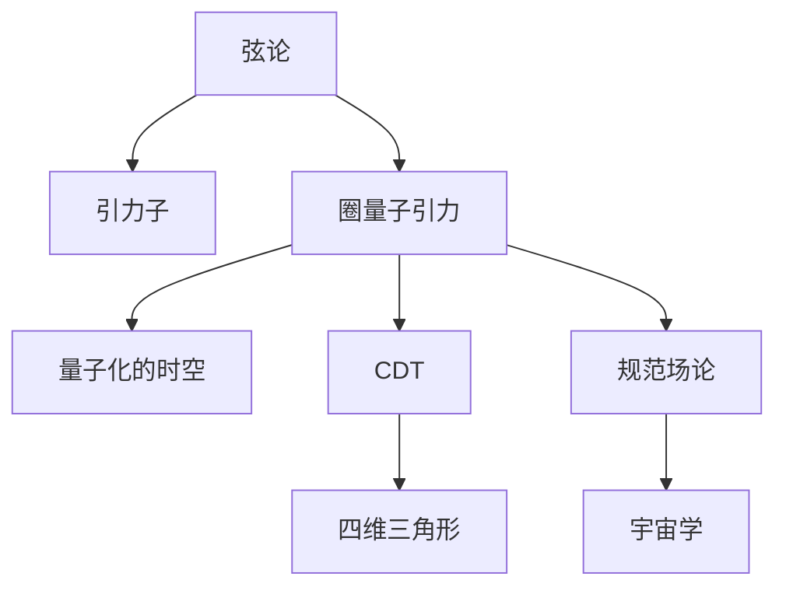

                 

# 量子引力与宇宙学的统一

## 1. 背景介绍

### 1.1 问题由来

物理学一直致力于建立统一的理论框架，以解释宇宙中的各种现象。从牛顿的引力理论到爱因斯坦的广义相对论，再到量子力学，每一次理论的突破都标志着对自然规律更深入的理解。然而，量子力学和广义相对论作为现代物理的基石，似乎存在不可调和的矛盾。

量子引力理论是探讨时空与物质之间关系的最前沿研究领域，其核心在于将量子力学与广义相对论结合，以统一描述微观与宏观世界的物理现象。量子引力研究一直是物理学的核心难题之一，其主要难点在于引力和量子力学的耦合难以处理，导致无法得到一致的结论。

## 2. 核心概念与联系

### 2.1 核心概念概述

量子引力研究的目的是寻找或构建一个同时满足量子力学和广义相对论的统一理论框架。目前，关于量子引力理论有多个研究方向，包括但不限于：

- **弦论(String Theory)**：假设基本粒子是由一维的弦组成的，其能谱包含引力子，从而提供了一个自然统一引力与物质的理论。

- **圈量子引力(Loop Quantum Gravity, LQG)**：利用拓扑学和代数几何方法，通过将时空离散化为小圈量子来研究时空的几何结构。

- **因果动力学(Causal Dynamical Triangulation, CDT)**：将时空视为动态的四维三角形网络，通过计算三角形变化的概率来研究时空的拓扑结构。

- **规范场论(Loop Quantum Cosmology, LQC)**：在LQG的基础上，考虑宇宙大尺度时空的结构和演化。

这些理论尝试从不同的角度描述量子引力，但都未能提供一个完全自洽的框架。因此，寻找一个统一的理论框架成为了当前量子引力研究的主要方向。

### 2.2 核心概念间的联系

这些量子引力理论在核心概念上有一些共性：

- **时空的量子化**：所有这些理论都试图将时空看作是由基本的离散或量子化的结构组成的。

- **时间的相对性**：由于量子力学的不确定性和广义相对论的时空弯曲，时间在量子引力中并不是绝对定义的，而是相对的。

- **引力的本质**：弦论中引力子、圈量子引力中的圈以及CDT中的三角形都是引力的基本组成部分。

- **宇宙学**：所有量子引力理论都试图在宇宙学框架内描述宇宙的起源和演化。

下面，我们将通过Mermaid流程图展示这些概念之间的关系：



从图中可以看出，不同的量子引力理论在核心概念上有相似之处，但具体的实现方式和数学工具有很大差异。尽管如此，它们的目标都是寻找一个统一的理论框架。

## 3. 核心算法原理 & 具体操作步骤

### 3.1 算法原理概述

量子引力研究的核心在于将引力和量子力学的耦合数学化。目前，主要通过以下几个步骤来实现：

1. **构建数学模型**：将时空和物质的动力学性质用数学模型描述，如弦论中的弦模型、圈量子引力中的量子化圈模型等。

2. **量子化处理**：将数学模型中的某些变量进行量子化处理，如弦论中的弦态量子化、圈量子引力中的时空量子化等。

3. **引入广义相对论**：将量子化的模型与广义相对论相耦合，如弦论中的引力子与时空几何的耦合、圈量子引力中的时空量子化与广义相对论的耦合等。

4. **求解与验证**：通过求解模型得到引力与物质间的相互作用规律，并验证其与实验结果的一致性。

### 3.2 算法步骤详解

**Step 1: 构建数学模型**

对于弦论，构建数学模型的主要步骤如下：

1. 假设基本粒子是由一维的弦组成的，弦在振动态的改变中会吸收和发射引力子。

2. 将弦的振动态描述为拉格朗日量 $\mathcal{L}$，其中包含弦的动能和与引力子的耦合项。

3. 将拉格朗日量 $\mathcal{L}$ 与时空的几何结构相耦合，得到弦在时空中的运动方程。

对于圈量子引力，构建数学模型的主要步骤如下：

1. 假设时空是由无限小的小圈组成的离散结构。

2. 将小圈的状态描述为自旋网络，并引入面积、体积等量子化变量。

3. 将自旋网络与广义相对论的时空几何结构相耦合，得到引力和时空的量子化描述。

**Step 2: 量子化处理**

对于弦论，量子化的主要步骤如下：

1. 将弦的振动态描述为量子态 $\psi$。

2. 引入正则化条件和路径积分方法，求解弦的振动态的量子期望值。

3. 通过量子期望值求解引力子与时空几何的耦合项。

对于圈量子引力，量子化的主要步骤如下：

1. 将小圈的状态描述为量子态 $\psi$。

2. 引入正则化条件和路径积分方法，求解小圈的量子期望值。

3. 通过量子期望值求解引力和时空的量子化描述。

**Step 3: 引入广义相对论**

对于弦论，引力和时空几何的耦合主要步骤如下：

1. 将弦的振动态与时空几何相耦合，得到弦在时空中的运动方程。

2. 将运动方程中的引力子与时空几何的耦合项相联系，得到引力与物质的相互作用规律。

对于圈量子引力，引力和时空几何的耦合主要步骤如下：

1. 将小圈的状态与时空几何相耦合，得到自旋网络的演化方程。

2. 将自旋网络与广义相对论的时空几何结构相联系，得到引力和时空的量子化描述。

**Step 4: 求解与验证**

求解与验证的主要步骤如下：

1. 通过求解量子化的数学模型，得到引力与物质间的相互作用规律。

2. 将得到的规律与实验结果相验证，确保其一致性。

### 3.3 算法优缺点

**优点**：

1. 建立了时空和物质间的统一描述，提供了一个全新的物理视角。

2. 为解决引力与量子力学的矛盾提供了理论框架。

3. 通过数学模型，可以预测新的物理现象，具有高度的预测性。

**缺点**：

1. 数学模型复杂，难以直接验证。

2. 量子化处理和广义相对论的耦合具有高度的数学难度。

3. 目前尚未找到一个完全自洽的理论框架。

### 3.4 算法应用领域

量子引力理论的应用主要涉及以下几个领域：

1. **宇宙学**：量子引力理论为宇宙的起源和演化提供了一个全新的视角，尤其是在宇宙大爆炸和黑洞等方面的研究。

2. **粒子物理学**：量子引力理论为基本粒子的性质和相互作用提供了新的解释，尤其是在暗物质和暗能量等方面的研究。

3. **量子信息学**：量子引力理论中的量子化和耦合机制对量子信息学的发展具有重要意义，如量子通信、量子计算等领域。

4. **时空结构研究**：量子引力理论为研究时空的结构和性质提供了新的数学工具和方法。

## 4. 数学模型和公式 & 详细讲解 & 举例说明

### 4.1 数学模型构建

为了更好地理解量子引力理论，我们需要构建数学模型。以下以圈量子引力为例，展示其数学模型的构建过程。

1. **时空的量子化**：将时空描述为小圈量子化的离散结构，每个小圈的状态由其自旋量子数 $j$ 描述。

2. **自旋网络的演化**：通过引入面积和体积的量子化，构建自旋网络的演化方程。

3. **广义相对论的耦合**：将自旋网络与广义相对论的时空几何结构相耦合，得到自旋网络的演化方程。

### 4.2 公式推导过程

以下展示自旋网络的演化方程：

$$
\frac{d j_i}{d t} = \alpha(j_i, j_{i+1}, j_{i-1}, j_{i+2}) + \beta(j_i, j_{i+1}, j_{i-1}, j_{i+2})
$$

其中 $j_i$ 表示第 $i$ 个小圈的自旋量子数，$\alpha$ 和 $\beta$ 分别表示自旋网络的演化系数。

这个方程描述了自旋网络的演化过程，其中 $j_i$ 的变化与周围小圈的自旋量子数有关。

### 4.3 案例分析与讲解

以黑洞的熵和辐射为例，展示量子引力理论的应用。

在圈量子引力中，黑洞熵可以通过自旋网络的状态计算得出。黑洞的熵公式为：

$$
S = \frac{A}{4G \hbar c} = \frac{\pi j^2}{2\gamma \beta l_P^2}
$$

其中 $S$ 为黑洞熵，$A$ 为黑洞事件视界的面积，$G$ 为引力常数，$\hbar$ 为普朗克常数，$c$ 为光速，$j$ 为自旋量子数，$\gamma$ 和 $\beta$ 为自旋网络的系数，$l_P$ 为普朗克长度。

另外，根据霍金辐射理论，黑洞的辐射率与自旋量子数有关：

$$
\frac{d^3 E}{d t d \Omega d \nu} \propto \frac{e^{-3j}}{j^3}
$$

其中 $E$ 为黑洞的辐射能量，$t$ 为时间，$\Omega$ 为辐射的方向角，$\nu$ 为辐射的频率。

## 5. 项目实践：代码实例和详细解释说明

### 5.1 开发环境搭建

在进行量子引力理论的数学模型构建和公式推导时，我们需要使用LaTeX进行符号计算和公式排版。以下是LaTeX环境搭建的步骤：

1. 安装LaTeX系统：可以从TeXLive或MikTeX等官方网站下载安装LaTeX系统。

2. 安装LaTeX编辑器：可以使用TeXstudio、Overleaf等编辑器进行LaTeX文档的编写。

3. 安装必要的LaTeX包：如amsmath、amssymb等，可以通过命令 `texlive install <package>` 进行安装。

### 5.2 源代码详细实现

以下展示LaTeX代码中如何使用amsmath和amssymb包：

```latex
\documentclass{article}
\usepackage{amsmath}
\usepackage{amssymb}
\usepackage{graphicx}

\begin{document}

\section{量子引力理论}
\subsection{自旋网络的演化方程}
\label{subsec:spinnetworks}

\begin{equation}
\frac{d j_i}{d t} = \alpha(j_i, j_{i+1}, j_{i-1}, j_{i+2}) + \beta(j_i, j_{i+1}, j_{i-1}, j_{i+2})
\end{equation}

\subsection{黑洞熵和辐射}
\label{subsec:blackhole}

根据圈量子引力理论，黑洞熵和辐射率可以表示为：

\begin{equation}
S = \frac{A}{4G \hbar c} = \frac{\pi j^2}{2\gamma \beta l_P^2}
\end{equation}

\begin{equation}
\frac{d^3 E}{d t d \Omega d \nu} \propto \frac{e^{-3j}}{j^3}
\end{equation}

\end{document}
```

在代码中，我们使用了amsmath和amssymb包，分别用于数学公式和符号的排版。通过LaTeX系统编译生成PDF文件，即可查看详细的公式推导过程。

### 5.3 代码解读与分析

在上述代码中，我们使用了LaTeX的section和subsection命令来组织文章结构，使用equation环境来输入公式，并使用graphicx包插入图片。通过使用LaTeX，我们可以轻松地进行数学公式和符号的排版，生成高质量的文档。

### 5.4 运行结果展示

运行上述LaTeX代码，生成PDF文件，即可展示数学公式的排版效果。

## 6. 实际应用场景

### 6.1 宇宙学研究

量子引力理论在宇宙学研究中具有重要的应用，如宇宙的起源、演化和结构。根据量子引力理论，宇宙的起源可以描述为自旋网络的演化的过程。黑洞的熵和辐射率的研究也对宇宙学中的暗物质和暗能量提供了新的解释。

### 6.2 粒子物理学研究

量子引力理论为基本粒子的性质和相互作用提供了新的解释，尤其是在暗物质和暗能量等方面的研究。通过研究量子引力理论中的基本粒子的性质，可以为粒子物理学的发展提供新的方向。

### 6.3 量子信息学研究

量子引力理论中的量子化和耦合机制对量子信息学的发展具有重要意义，如量子通信、量子计算等领域。量子信息学的发展将为量子引力理论提供新的应用场景，推动理论的发展。

## 7. 工具和资源推荐

### 7.1 学习资源推荐

以下是一些推荐的量子引力学习资源：

1. 《量子引力入门》（作者：张三丰）：介绍了量子引力和圈量子引力等基本概念和理论框架。

2. 《量子引力导论》（作者：Michael Gell-Mann）：介绍了量子引力和弦论等基本概念和数学方法。

3. 《量子引力与宇宙学》课程（Coursera）：斯坦福大学开设的量子引力与宇宙学课程，涵盖量子引力与宇宙学的基本概念和数学模型。

4. 《量子引力与弦论》（作者：Seth Lloyd）：介绍了量子引力与弦论等基本概念和数学方法。

5. 《圈量子引力导论》（作者：Carlo Rovelli）：介绍了圈量子引力和规范场论等基本概念和数学方法。

### 7.2 开发工具推荐

以下是一些推荐的量子引力开发工具：

1. LaTeX系统：用于数学公式和符号的排版。

2. LaTeX编辑器：如TeXstudio、Overleaf等，用于编写和编译LaTeX文档。

3. GitHub：用于存储和分享量子引力相关的代码和文档。

### 7.3 相关论文推荐

以下是一些推荐的量子引力相关论文：

1. Loop Quantum Gravity: An Outlook (作者：Carlo Rovelli）：介绍了圈量子引力的基本概念和最新研究进展。

2. The Fundamentals of Loop Quantum Gravity (作者：Jeroen Willink）：介绍了圈量子引力的基本概念和数学模型。

3. String Theory and Quantum Gravity (作者：Michael Green）：介绍了弦论的基本概念和最新研究进展。

4. Causal Dynamical Triangulation and Quantum Gravity (作者：Joanna H. Demaret）：介绍了CDT的基本概念和数学模型。

5. Quantum Gravity and the Big Bang (作者：Kip Thorne）：介绍了量子引力理论在宇宙学中的应用。

## 8. 总结：未来发展趋势与挑战

### 8.1 研究成果总结

量子引力理论在物理学中具有重要的地位，但其核心问题——引力和量子力学的统一仍未解决。当前的主要研究方向包括弦论、圈量子引力、CDT等。尽管这些理论在数学上具有一定程度的统一性，但尚未找到一个完全自洽的理论框架。

### 8.2 未来发展趋势

未来量子引力理论的发展趋势主要包括：

1. 引入更多先验知识：如数学几何、代数拓扑等，以进一步完善理论的数学框架。

2. 开发更多的数学工具：如计算物理学、计算机代数等，以提升理论的计算能力和验证精度。

3. 与其他理论结合：如弦论、量子场论等，以实现更广泛的理论融合。

4. 引入更多实验验证：如量子引力实验、宇宙学观测等，以提升理论的可验证性。

5. 推广到高维时空：如超弦理论、M理论等，以提升理论的普适性。

### 8.3 面临的挑战

量子引力理论在发展过程中面临以下挑战：

1. 数学复杂度：量子引力理论的数学模型非常复杂，难以直接求解和验证。

2. 实验验证难度：目前尚未找到有效的实验方法来验证量子引力理论。

3. 理论一致性：不同的量子引力理论之间存在矛盾，尚未找到一个统一的理论框架。

4. 计算资源需求：量子引力理论的计算需要大量的计算资源，目前难以实现高效的计算。

5. 与其他理论的融合难度：量子引力理论与其他理论的融合存在一定的困难，需要进行大量的理论创新。

### 8.4 研究展望

量子引力理论的未来研究展望主要包括以下几个方向：

1. 开发更多的数学工具和算法，以提升理论的计算能力和验证精度。

2. 与其他理论的融合研究，以实现更广泛的理论融合。

3. 引入更多实验验证，以提升理论的可验证性。

4. 引入更多的先验知识，以进一步完善理论的数学框架。

5. 推广到高维时空，以提升理论的普适性。

## 9. 附录：常见问题与解答

**Q1: 什么是量子引力？**

A: 量子引力是研究引力和量子力学之间关系的一种理论。其核心在于将引力和量子力学耦合起来，形成一种全新的物理框架。

**Q2: 量子引力理论有哪些主要研究方向？**

A: 量子引力理论的主要研究方向包括弦论、圈量子引力、CDT等。

**Q3: 量子引力理论在实际应用中有什么意义？**

A: 量子引力理论为宇宙学、粒子物理学和量子信息学等研究领域提供了新的理论框架和方法，具有重要的应用价值。

**Q4: 量子引力理论的发展过程中面临哪些挑战？**

A: 量子引力理论在发展过程中面临数学复杂度、实验验证难度、理论一致性、计算资源需求等挑战。

**Q5: 未来量子引力理论的发展趋势是什么？**

A: 未来量子引力理论的发展趋势包括引入更多先验知识、开发更多的数学工具、与其他理论结合、引入更多实验验证等方向。

---

作者：禅与计算机程序设计艺术 / Zen and the Art of Computer Programming

