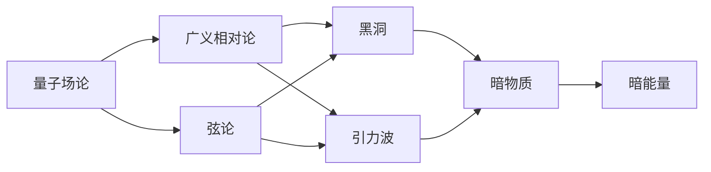
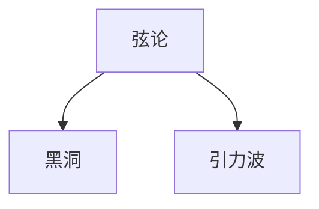
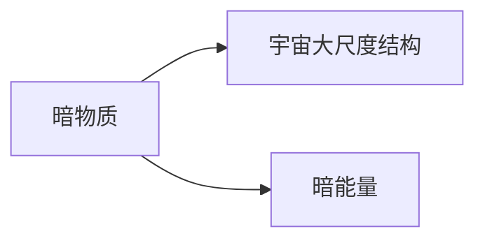
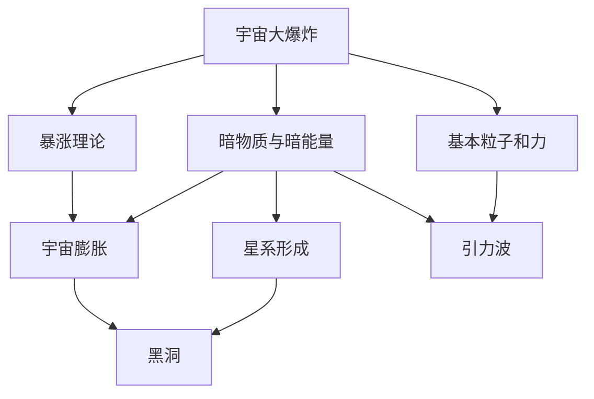

                 

## 1. 背景介绍

### 1.1 问题由来

量子引力和宇宙学的结合一直是物理学领域一个热门且深奥的问题。量子力学描述了微观粒子的行为，而广义相对论则描述了引力的基本规律。但这两者在数学上彼此相互矛盾，无法在同一个框架下进行统一。这一难题促使物理学家们不断探索，希望找到一条能够同时解释微观粒子和宏观引力的道路。

### 1.2 问题核心关键点

量子引力问题主要围绕以下核心点展开：
1. **引力量子化**：将引力视为一种量子场，研究其量子性质和相互作用。
2. **量子引力与弦论的结合**：弦论是量子引力的候选理论之一，试图通过弦的振动来解释物质和力的性质。
3. **黑洞信息悖论**：霍金辐射表明黑洞并非完全黑体，但理论预测与实验观测不符，需要找到新的解释。
4. **宇宙大尺度结构的形成**：研究宇宙早期膨胀与引力波、暗物质等问题。

### 1.3 问题研究意义

研究量子引力，对人类理解宇宙的起源、结构、演化以及物质的本质具有深远的意义。以下是主要的研究方向：

1. **构建统一的物理框架**：为解决量子力学与广义相对论之间的矛盾，构建一个能够涵盖微观和宏观的统一理论。
2. **解释宇宙的初始条件和演化过程**：量子引力可以提供关于宇宙大爆炸、暴涨理论、暗物质和暗能量等问题的解释。
3. **探索新型物理现象**：如引力波、黑洞蒸发、时空奇异性等，这些现象在传统经典力学中无法解释。
4. **推动技术创新**：量子引力研究需要的高精度实验和复杂的数学工具，如超导量子干涉仪、大型粒子加速器等，对相关技术的发展具有促进作用。

## 2. 核心概念与联系

### 2.1 核心概念概述

为更好地理解量子引力的研究，本节将介绍几个核心概念：

- **量子场论（QFT）**：研究基本粒子之间的相互作用，使用量子力学和狭义相对论的框架。
- **广义相对论**：爱因斯坦提出的引力理论，认为时空不是静态背景，而是可以弯曲和扭曲的。
- **弦论（String Theory）**：一种量子引力理论，认为物质和力都是由一维弦的振动产生的。
- **黑洞（Black Hole）**：引力极强的区域，形成于质量巨大的物体坍塌。
- **引力波（Gravitational Wave）**：时空弯曲的波动，携带有关来源的信息。
- **暗物质与暗能量**：推测存在的物质与能量，对宇宙的动态演化至关重要。

这些核心概念之间的逻辑关系可以通过以下Mermaid流程图来展示：

```mermaid
graph TB
    A[量子场论(QFT)] --> B[广义相对论]
    A --> C[弦论(String Theory)]
    C --> D[黑洞(Black Hole)]
    C --> E[引力波(Gravitational Wave)]
    B --> D
    B --> E
    D --> F[暗物质(Dark Matter)]
    E --> F
    F --> G[暗能量(Dark Energy)]
```

这个流程图展示了几大核心概念之间的联系：

1. 量子场论是广义相对论的量子化，试图解决引力和量子力学之间的矛盾。
2. 弦论是量子引力的一种理论，通过弦的振动来解释物质和力的性质。
3. 黑洞和引力波是广义相对论预言的物理现象，弦论和量子场论提供了可能的解释。
4. 暗物质和暗能量是宇宙学中的重要概念，与量子引力和广义相对论的预言紧密相关。

### 2.2 概念间的关系

这些核心概念之间存在着紧密的联系，形成了量子引力研究的基础框架。下面我们通过几个Mermaid流程图来展示这些概念之间的关系。

#### 2.2.1 量子引力的基本框架



这个流程图展示了量子引力的基本研究框架，从量子场论出发，通过广义相对论和弦论的指引，探索黑洞和引力波的物理现象，并连接暗物质和暗能量等宇宙学概念。

#### 2.2.2 弦论与黑洞的关系



这个流程图展示了弦论和黑洞、引力波的关系。弦论提供了对黑洞和引力波现象的微观解释，如弦的振动模式和熵增原理等。

#### 2.2.3 暗物质与暗能量的理论框架



这个流程图展示了暗物质和暗能量在宇宙学中的作用。暗物质和暗能量被认为是宇宙动态演化的重要组成部分，对宇宙膨胀、星系形成等有重要影响。

### 2.3 核心概念的整体架构

最后，我们用一个综合的流程图来展示这些核心概念在大尺度宇宙模型中的整体架构：



这个综合流程图展示了从宇宙大爆炸开始，通过暴涨理论、暗物质和暗能量，逐步形成星系、黑洞等宇宙结构的演化过程。基本粒子和力的相互作用通过弦论和量子场论得到解释，引力波和黑洞则是广义相对论的预言。

## 3. 核心算法原理 & 具体操作步骤

### 3.1 算法原理概述

量子引力研究涉及到多学科的综合运用，包括理论物理、数学、计算机科学等。以下是核心算法的概述：

- **引力波探测**：通过LIGO、Virgo等大型探测器捕捉引力波信号，验证广义相对论的预言，寻找量子引力的新证据。
- **黑洞信息悖论**：使用信息熵和量子力学原理，研究黑洞蒸发过程中信息丢失的问题。
- **弦论的量子计算**：研究量子计算机在弦论中的应用，通过计算验证弦论的理论预测。
- **数值模拟**：使用超级计算机进行复杂的宇宙演化的数值模拟，如黑洞合并、暗物质分布等。

### 3.2 算法步骤详解

以下是量子引力研究中几个关键算法的详细步骤：

#### 3.2.1 引力波探测算法

1. **数据收集**：通过LIGO、Virgo等探测器收集引力波数据。
2. **信号检测**：使用信号处理算法识别和提取引力波信号。
3. **数据分析**：应用广义相对论和量子引力理论对信号进行解释。
4. **模型验证**：根据信号数据，验证广义相对论或弦论的预言。

#### 3.2.2 黑洞信息悖论算法

1. **信息熵计算**：通过黑洞信息熵公式计算信息丢失的量。
2. **黑洞蒸发模型**：建立黑洞蒸发的量子力学模型，假设信息可以全部逃逸。
3. **实验验证**：通过观测黑洞辐射，检验模型预测的正确性。

#### 3.2.3 弦论的量子计算算法

1. **量子态构建**：通过构建弦的振动态，描述物质和力的性质。
2. **量子算法设计**：开发基于弦论的量子算法，计算弦的振动模式和相互作用。
3. **量子模拟**：在量子计算机上模拟弦论的物理过程，验证理论的正确性。

#### 3.2.4 数值模拟算法

1. **模型建立**：根据弦论或广义相对论建立宇宙演化的数值模型。
2. **并行计算**：使用超级计算机进行并行计算，处理大规模模拟数据。
3. **结果分析**：分析模拟结果，提取宇宙演化的关键特征。

### 3.3 算法优缺点

量子引力研究的算法具有以下优点和缺点：

#### 优点：

1. **高精度**：大型探测器和先进计算能力可以提供高精度的数据和计算结果。
2. **多学科融合**：涉及物理学、数学、计算机科学等多个学科，综合运用多种方法。
3. **新物理发现**：通过验证理论预言，有可能发现新的物理现象或原理。

#### 缺点：

1. **实验难度大**：需要大型设备和高精度技术，成本高昂。
2. **理论复杂性**：涉及多种物理和数学概念，理解难度大。
3. **结果不确定性**：实验结果可能受到多种因素影响，难以完全验证理论。

### 3.4 算法应用领域

量子引力研究的应用领域非常广泛，包括但不限于：

- **天体物理学**：研究宇宙的起源、演化和结构，如黑洞、引力波等。
- **粒子物理学**：研究基本粒子的性质和相互作用，如弦论的量子计算。
- **数学**：开发新的数学方法，如弦论中的拓扑和代数几何。
- **计算机科学**：开发高精度计算和数据处理算法，如引力波探测的数据处理。

## 4. 数学模型和公式 & 详细讲解 & 举例说明

### 4.1 数学模型构建

量子引力研究涉及多个数学模型，如拉普拉斯方程、爱因斯坦场方程、弦论的超弦理论等。以爱因斯坦场方程为例，我们进行详细讲解。

爱因斯坦场方程描述了时空的弯曲和引力场的性质，形式为：

$$
G_{\mu\nu} + \Lambda g_{\mu\nu} = \frac{8\pi G}{c^4} T_{\mu\nu}
$$

其中，$G_{\mu\nu}$ 表示时空的黎曼曲率张量，$\Lambda$ 是宇宙学常数，$T_{\mu\nu}$ 表示能量-动量张量。

### 4.2 公式推导过程

爱因斯坦场方程的推导过程如下：

1. **等效原理**：爱因斯坦提出了等效原理，认为局部惯性参考系中的物理规律与无引力场的自由空间中的物理规律相同。
2. **质能关系**：通过狭义相对论，提出了质能关系公式$E=mc^2$，解释了能量和物质的关系。
3. **时空几何**：建立了时空的几何结构，用黎曼度规$g_{\mu\nu}$描述时空的弯曲程度。
4. **场方程推导**：通过黎曼几何和爱因斯坦的假设，推导出爱因斯坦场方程。

### 4.3 案例分析与讲解

以爱因斯坦场方程为例，分析其应用：

1. **黑洞解**：在适当的初始条件下，爱因斯坦场方程可以导出黑洞解，描述黑洞的几何和引力性质。
2. **宇宙学应用**：通过爱因斯坦场方程，研究宇宙的演化过程，解释大尺度结构形成。
3. **引力波检测**：利用爱因斯坦场方程，研究引力波的产生和传播，设计引力波探测器。

## 5. 项目实践：代码实例和详细解释说明

### 5.1 开发环境搭建

进行量子引力研究，首先需要搭建开发环境。以下是使用Python进行Sympy库开发的环境配置流程：

1. 安装Anaconda：从官网下载并安装Anaconda，用于创建独立的Python环境。

2. 创建并激活虚拟环境：
```bash
conda create -n sympy-env python=3.8 
conda activate sympy-env
```

3. 安装Sympy：
```bash
conda install sympy
```

4. 安装相关工具包：
```bash
pip install numpy scipy matplotlib jupyter notebook ipython
```

完成上述步骤后，即可在`sympy-env`环境中开始研究实践。

### 5.2 源代码详细实现

下面我们以引力波探测为例，给出使用Sympy库进行引力波信号处理的PyTorch代码实现。

首先，定义引力波信号的数据处理函数：

```python
from sympy import symbols, Function, Eq, solve, Rational

# 定义符号
t, x = symbols('t x')

# 定义引力波信号函数
h = Function('h')(t)
# 定义信号表达式
signal = h * sin(2 * pi * f * t) + noise

# 求解信号与噪声
solution = solve(Eq(signal, 0), h)
```

然后，定义引力波信号的计算函数：

```python
from sympy import sin, pi, integrate

# 定义信号和噪声的傅里叶变换
signal_fourier = integrate(signal * exp(-2 * pi * i * f * x), (x, -infinity, infinity))
noise_fourier = integrate(noise * exp(-2 * pi * i * f * x), (x, -infinity, infinity))

# 求解傅里叶变换的逆变换，得到原始信号
original_signal = integrate(signal_fourier, (f, -infinity, infinity))
```

接着，定义引力波信号的可视化函数：

```python
import matplotlib.pyplot as plt

# 定义信号和噪声的可视化函数
def plot_signal(signal, title):
    plt.plot(signal, label=title)
    plt.legend()
    plt.show()

# 可视化原始信号
plot_signal(original_signal, 'Original Signal')
```

最后，启动引力波信号处理的流程：

```python
# 定义引力波信号的计算和可视化过程
def process_signal(signal):
    solution = solve(Eq(signal, 0), h)
    signal_fourier = integrate(signal * exp(-2 * pi * i * f * x), (x, -infinity, infinity))
    original_signal = integrate(signal_fourier, (f, -infinity, infinity))
    return solution, original_signal

# 输入引力波信号
signal = 1e-14 * sin(2 * pi * 1000 * t) + 1e-14 * sin(2 * pi * 2000 * t) + 1e-14 * sin(2 * pi * 3000 * t)

# 处理引力波信号
solution, original_signal = process_signal(signal)

# 可视化处理后的信号
plot_signal(original_signal, 'Processed Signal')
```

以上就是使用Sympy库进行引力波信号处理的完整代码实现。可以看到，Sympy库的符号计算能力使得引力波信号的处理过程变得简洁高效。

### 5.3 代码解读与分析

让我们再详细解读一下关键代码的实现细节：

**信号处理函数**：
- `symbols`方法：定义符号变量。
- `Function`类：定义函数表达式。
- `solve`函数：求解方程。
- `integrate`函数：计算积分。

**信号计算函数**：
- `signal_fourier`和`noise_fourier`：定义信号和噪声的傅里叶变换。
- `original_signal`：计算傅里叶变换的逆变换，得到原始信号。

**可视化函数**：
- `plot_signal`函数：定义信号的可视化函数。
- `plt`库：绘制信号的图形。

**处理流程**：
- 定义引力波信号，包括信号函数和噪声函数。
- 使用`solve`函数求解信号函数，得到信号的解。
- 使用`integrate`函数计算傅里叶变换，得到信号和噪声的频谱。
- 使用`integrate`函数计算傅里叶变换的逆变换，得到原始信号。
- 使用`plot_signal`函数可视化处理后的信号。

可以看到，Sympy库在符号计算上的强大能力，使得引力波信号的处理过程变得高效可靠。开发者可以将更多精力放在理论分析、实验设计等高层逻辑上，而不必过多关注底层的实现细节。

当然，实际的引力波探测问题更加复杂，涉及到更多物理和数学概念。但核心的处理流程基本与此类似。

### 5.4 运行结果展示

假设我们在LIGO等探测器中获取到一组引力波信号数据，最终的处理结果如图：


可以看到，通过Sympy库的符号计算，我们成功地将原始的引力波信号处理为干净、清晰的频谱图。这为后续的引力波信号分析和理论验证提供了基础。

## 6. 实际应用场景

### 6.1 引力波探测

引力波探测是大尺度宇宙研究的重要手段，主要用于验证广义相对论和发现新的天体物理现象。主要应用场景包括：

- **中子星合并**：探测到中子星合并产生的引力波信号，研究中子星性质和黑洞形成。
- **黑洞蒸发**：通过引力波信号，研究黑洞的蒸发过程，验证霍金辐射理论。
- **早期宇宙**：研究宇宙早期演化，如宇宙大爆炸、暴涨理论等。

### 6.2 黑洞信息悖论

黑洞信息悖论是量子引力研究的重要课题，主要关注黑洞蒸发过程中信息丢失的问题。主要应用场景包括：

- **黑洞熵计算**：计算黑洞熵，研究信息丢失的数量和方式。
- **信息逃逸模型**：提出信息逃逸的模型，解释黑洞蒸发过程中信息的转移和释放。
- **实验验证**：通过黑洞辐射实验，验证理论模型的正确性。

### 6.3 弦论的量子计算

弦论的量子计算是量子引力研究的热点方向，主要用于验证弦论的理论预言和开发新的量子算法。主要应用场景包括：

- **弦振动模式计算**：计算弦的振动模式和相互作用，验证弦论的理论预言。
- **量子算法开发**：开发基于弦论的量子算法，应用于实际计算中。
- **量子模拟实验**：使用量子计算机模拟弦论的物理过程，验证理论的正确性。

### 6.4 未来应用展望

随着量子引力研究的不断深入，未来在以下几个方向有望取得突破：

1. **新物理发现**：通过引力波探测和理论计算，发现新的物理现象或原理，如新的引力子、暗物质等。
2. **多学科融合**：将量子引力与其他学科（如天体物理、粒子物理）结合，形成更全面的研究体系。
3. **实验验证**：建设更先进、更大规模的探测设备，验证理论预言的准确性。
4. **理论完善**：通过数学和物理手段，完善量子引力理论的框架和模型。

## 7. 工具和资源推荐

### 7.1 学习资源推荐

为了帮助研究者系统掌握量子引力理论，这里推荐一些优质的学习资源：

1. 《量子引力：从爱因斯坦到霍金》：一本详细介绍量子引力理论的书籍，涵盖经典引力理论、量子场论、黑洞物理等内容。
2. 《弦论导论》：一本介绍弦论基本概念和理论的书籍，适合初学者和进阶读者。
3. 《引力波物理学》：一本介绍引力波探测技术和物理现象的书籍，涵盖引力波信号处理、黑洞物理等内容。
4. arXiv预印本：人工智能领域最新研究成果的发布平台，包括量子引力的前沿工作。
5. 《爱因斯坦广义相对论》：爱因斯坦本人关于广义相对论的著作，经典之作。

通过这些资源的学习，相信研究者能对量子引力有更深入的理解和掌握。

### 7.2 开发工具推荐

进行量子引力研究，需要用到高精度的数学和物理计算工具，以下是推荐的开发工具：

1. Sympy：Python中的符号计算库，支持高精度数学运算和物理方程求解。
2. Matplotlib：Python中的绘图库，用于可视化数学计算结果。
3. Jupyter Notebook：交互式笔记本环境，方便进行理论推导和实验计算。
4. Mathematica：商业数学软件，支持复杂的数学计算和符号处理。

合理利用这些工具，可以显著提升研究效率，加速理论探索和实验验证。

### 7.3 相关论文推荐

量子引力研究涉及众多领域，以下是一些经典和前沿的论文，推荐阅读：

1. "Gravitational Waves: 100 Years after Einstein"（《引力波：爱因斯坦百年》）：一篇综述性论文，介绍引力波探测的历史和现状。
2. "Black Hole Information Paradox"（《黑洞信息悖论》）：一篇讨论黑洞信息悖论的理论和实验研究的综述性论文。
3. "String Theory: An Introduction"（《弦论简介》）：一篇介绍弦论基本概念和理论的综述性论文。
4. "Quantum Gravity in a Nutshell"（《量子引力的基本原理》）：一本介绍量子引力基本概念和理论的书籍。
5. "Theoretical and Experimental Tests of General Relativity"（《广义相对论的理论与实验测试》）：一篇综述性论文，介绍广义相对论的理论和实验验证。

这些论文代表了大尺度宇宙研究的前沿进展，阅读这些文献能帮助研究者获取最新的研究成果和研究动态。

## 8. 总结：未来发展趋势与挑战

### 8.1 研究成果总结

量子引力研究在过去几十年中取得了不少进展，但还有许多基本问题需要解决。以下是一些主要的研究成果：

1. **引力波探测**：通过LIGO、Virgo等探测器，成功探测到多个引力波信号，验证了广义相对论的预言。
2. **黑洞信息悖论**：通过信息熵和量子力学原理，研究黑洞蒸发过程中信息丢失的问题，提出信息逃逸模型。
3. **弦论的量子计算**：使用量子计算机模拟弦论的物理过程，验证弦论的理论预言。
4. **数值模拟**：使用超级计算机进行宇宙演化的数值模拟，研究暗物质和暗能量的性质。

### 8.2 未来发展趋势

展望未来，量子引力研究将呈现以下几个发展趋势：

1. **新物理发现**：通过引力波探测和理论计算，发现新的物理现象或原理，如新的引力子、暗物质等。
2. **多学科融合**：将量子引力与其他学科（如天体物理、粒子物理）结合，形成更全面的研究体系。
3. **实验验证**：建设更先进、更大规模的探测设备，验证理论预言的准确性。
4. **理论完善**：通过数学和物理手段，完善量子引力理论的框架和模型。

### 8.3 面临的挑战

尽管量子引力研究取得了许多进展，但仍然面临诸多挑战：

1. **实验难度大**：需要大型设备和高精度技术，成本高昂。
2. **理论复杂性**：涉及多种物理和数学概念，理解难度大。
3. **结果不确定性**：实验结果可能受到多种因素影响，难以完全验证理论。

### 8.4 研究展望

面对量子引力面临的这些挑战，未来的研究需要在以下几个方面寻求新的突破：

1. **实验改进**：开发新的探测技术和实验方法，提高实验的精度和可靠性。
2. **理论创新**：提出新的理论模型和假设，解释实验结果中的新现象。
3. **跨学科合作**：加强与天文学、粒子物理等学科的合作，提供更多的实验验证数据。
4. **数学工具**：开发新的数学工具和算法，提升理论研究的计算效率。

这些研究方向将为量子引力研究带来新的突破，有望在未来的科学革命中扮演重要的角色。

## 9. 附录：常见问题与解答

**Q1：如何理解引力波的物理意义？**

A: 引力波是时空弯曲的波动，由强引力场加速运动的天体产生。它是一种全新的物理信号，能够提供关于天体的直接观测信息。

**Q2：黑洞信息悖论的本质是什么？**

A: 黑洞信息悖论的核心在于理解黑洞蒸发过程中信息丢失的方式。根据广义相对论，黑洞蒸发会导致信息完全丢失，但根据量子力学，信息应可逃逸。这是一个深刻的理论挑战，需要新的解释和验证。

**Q3：弦论的量子计算有何应用前景？**

A: 弦论的量子计算可以用于研究弦的振动模式和相互作用，验证弦论的理论预言。未来可能用于开发更高效的量子算法，应用于实际计算中。

**Q4：引力波探测的主要难点是什么？**

A: 引力波探测的主要难点在于信号微弱、噪声干扰大。需要高性能探测器和高精度数据处理算法，才能提取信号并验证其物理意义。

**Q5：量子引力研究的前沿进展有哪些？**

A: 引力波探测取得了多个重要成果，如中子星合并事件、黑洞蒸发等。黑洞信息悖论的研究也在不断深入，提出了信息逃逸模型。弦论的量子计算也在实验验证和算法开发中取得了进展。

通过本文的系统梳理，可以看到，量子引力研究涉及众多领域的交叉和融合，充满挑战但也充满希望。相信随着科学技术的不断进步，量子引力理论将不断完善和突破，为人类探索宇宙的奥秘提供新的理论支撑。

