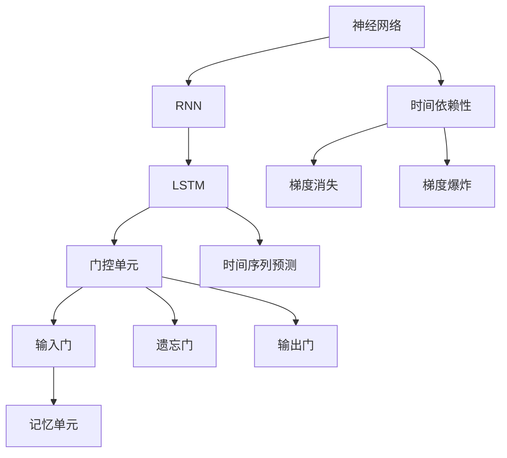
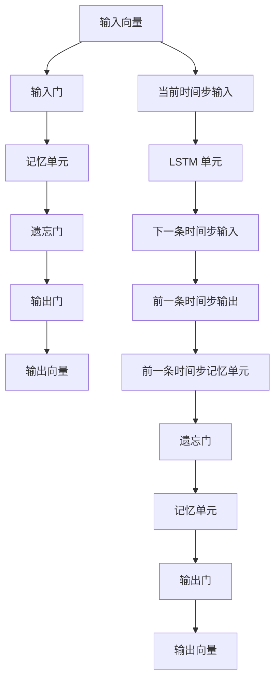

                 

# 长短时记忆网络 (LSTM) 原理与代码实例讲解

> 关键词：长短时记忆网络, LSTM, 时间序列预测, 时间依赖性, 序列模型, 梯度消失, 神经网络, 深度学习, PyTorch

## 1. 背景介绍

### 1.1 问题由来

随着深度学习技术的迅猛发展，深度神经网络在处理时间序列数据方面展现出了巨大的潜力。然而，传统的循环神经网络 (RNN) 面临着梯度消失（Vanishing Gradient Problem）和梯度爆炸（Exploding Gradient Problem）等挑战，导致其难以处理长期依赖关系。长短时记忆网络（Long Short-Term Memory, LSTM）应运而生，通过引入门控机制（Gated Mechanism），有效缓解了这一问题，成为处理时间序列数据的重要工具。

### 1.2 问题核心关键点

长短时记忆网络的核心在于其独特的门控机制，使得网络能够在长序列数据中有效捕捉到长期依赖关系，避免梯度消失和爆炸问题。其关键点包括：
- 引入门控单元（Gate Units），通过 sigmoid 函数和 tanh 函数实现。
- 三个门控单元：输入门（Input Gate）、遗忘门（Forget Gate）和输出门（Output Gate）。
- 记忆单元（Memory Cell），存储长期依赖信息。

### 1.3 问题研究意义

长短时记忆网络通过引入门控机制，极大地提升了神经网络处理时间序列数据的能力，特别是在语言模型、机器翻译、时间序列预测等任务上取得了显著的进展。本文旨在通过深入讲解 LSTM 的原理和代码实例，帮助读者理解 LSTM 的基本概念和应用方法，为进一步的深度学习研究和实践打下坚实基础。

## 2. 核心概念与联系

### 2.1 核心概念概述

为更好地理解 LSTM 的工作原理，本节将介绍几个关键概念及其相互联系：

- **神经网络（Neural Network）**：一种由多层神经元（Neuron）构成的计算模型，通过前向传播和反向传播更新参数，完成分类、回归、聚类等任务。
- **循环神经网络（RNN）**：一种特殊类型的神经网络，能够处理时间序列数据，但面临着梯度消失和爆炸问题。
- **长短时记忆网络（LSTM）**：一种基于 RNN 的改进模型，引入门控机制，有效缓解了梯度消失和爆炸问题，特别适用于处理长期依赖关系。
- **门控单元（Gate Units）**：LSTM 中的关键组件，通过 sigmoid 函数和 tanh 函数实现。
- **输入门（Input Gate）**：控制新信息的输入。
- **遗忘门（Forget Gate）**：控制旧信息的遗忘。
- **输出门（Output Gate）**：控制信息的输出。
- **记忆单元（Memory Cell）**：存储长期依赖信息。
- **激活函数（Activation Function）**：用于非线性变换，如 sigmoid 和 tanh。

这些概念构成了 LSTM 的基本框架，通过门控机制，LSTM 能够在长序列数据中有效捕捉到长期依赖关系。

### 2.2 概念间的关系

这些核心概念之间的联系通过以下 Mermaid 流程图来展示：



这个流程图展示了从神经网络到 LSTM 的演变过程，以及 LSTM 如何通过门控机制来解决梯度消失和爆炸问题，从而实现时间序列预测。

### 2.3 核心概念的整体架构

最后，我们用一个综合的流程图来展示 LSTM 的整体架构：



这个流程图展示了 LSTM 的基本操作流程：输入向量通过输入门控制新信息输入，通过遗忘门控制旧信息遗忘，通过输出门控制信息输出，最终得到输出向量。

## 3. 核心算法原理 & 具体操作步骤
### 3.1 算法原理概述

长短时记忆网络的核心在于其门控机制，通过输入门、遗忘门和输出门控制信息的输入、遗忘和输出。其原理可以简单地概括为：
1. 输入门：决定哪些信息应该被加入到记忆单元中。
2. 遗忘门：决定哪些信息应该从记忆单元中删除。
3. 输出门：决定哪些信息应该被输出。

LSTM 通过这些门控机制，能够有效地解决 RNN 的梯度消失和爆炸问题，特别适用于处理长期依赖关系的时间序列数据。

### 3.2 算法步骤详解

LSTM 的训练过程可以分为以下步骤：

1. **初始化**：设置输入向量 $x_t$ 和前一条时间步的输出向量 $h_{t-1}$。
2. **计算输入门、遗忘门和输出门**：
   - 输入门：$\sigma(W_i \cdot [h_{t-1}, x_t] + b_i)$。
   - 遗忘门：$\sigma(W_f \cdot [h_{t-1}, x_t] + b_f)$。
   - 输出门：$\sigma(W_o \cdot [h_{t-1}, x_t] + b_o)$。
3. **更新记忆单元**：
   - 候选单元状态 $c_t = \tanh(W_c \cdot [h_{t-1}, x_t] + b_c)$。
   - 记忆单元：$c_t = f_t \cdot c_{t-1} + i_t \cdot c_t$。
4. **计算输出向量**：
   - 输出向量：$h_t = o_t \cdot \tanh(c_t)$。
5. **前向传播**：对所有时间步重复以上步骤，得到最终输出序列。

### 3.3 算法优缺点

长短时记忆网络的主要优点包括：
- 能够处理长期依赖关系，特别适用于时间序列数据。
- 通过门控机制，有效缓解了梯度消失和爆炸问题。
- 应用广泛，在语言模型、机器翻译、时间序列预测等领域取得了显著效果。

然而，LSTM 也存在一些缺点：
- 参数量较大，计算复杂度较高。
- 训练过程中，可能存在局部最优解，收敛速度较慢。
- 对于某些特定任务，可能存在过拟合问题。

### 3.4 算法应用领域

长短时记忆网络在处理时间序列数据方面表现优异，广泛应用于以下领域：

- **自然语言处理**：LSTM 被广泛应用于语言模型、机器翻译、文本分类、情感分析等任务。
- **时间序列预测**：在股票价格预测、天气预测、交通流量预测等领域，LSTM 能够有效捕捉长期依赖关系。
- **语音识别**：在语音识别任务中，LSTM 能够捕捉语音信号的长期依赖关系，提高识别准确率。
- **生物信息学**：在 DNA 序列分析、蛋白质序列预测等任务中，LSTM 能够处理生物信息的时间序列特征。

除了以上应用，LSTM 还被广泛应用于图像描述生成、视频帧预测、机器人路径规划等场景。

## 4. 数学模型和公式 & 详细讲解 & 举例说明

### 4.1 数学模型构建

LSTM 的数学模型可以形式化地表示为：
- 输入门：$\sigma(W_i \cdot [h_{t-1}, x_t] + b_i)$。
- 遗忘门：$\sigma(W_f \cdot [h_{t-1}, x_t] + b_f)$。
- 输出门：$\sigma(W_o \cdot [h_{t-1}, x_t] + b_o)$。
- 候选单元状态：$c_t = \tanh(W_c \cdot [h_{t-1}, x_t] + b_c)$。
- 记忆单元：$c_t = f_t \cdot c_{t-1} + i_t \cdot c_t$。
- 输出向量：$h_t = o_t \cdot \tanh(c_t)$。

其中，$\sigma$ 为 sigmoid 函数，$\tanh$ 为 tanh 函数。

### 4.2 公式推导过程

以单层 LSTM 为例，其公式推导过程如下：

1. 输入门计算：
   - $i_t = \sigma(W_i \cdot [h_{t-1}, x_t] + b_i)$。
   - $c_t = \tanh(W_c \cdot [h_{t-1}, x_t] + b_c)$。
   - $f_t = \sigma(W_f \cdot [h_{t-1}, x_t] + b_f)$。
   - $c_t = f_t \cdot c_{t-1} + i_t \cdot c_t$。
   - $o_t = \sigma(W_o \cdot [h_{t-1}, x_t] + b_o)$。
   - $h_t = o_t \cdot \tanh(c_t)$。

2. 前向传播：
   - 对所有时间步重复以上步骤，得到最终输出序列。

### 4.3 案例分析与讲解

以手写数字识别任务为例，使用 LSTM 模型进行分类：
- 数据准备：将 MNIST 数据集中的手写数字图像转换为时间序列数据，每个图像转换为一个时间序列。
- 模型构建：使用 PyTorch 搭建 LSTM 模型，设置合适的超参数。
- 训练过程：使用交叉熵损失函数和 Adam 优化器，在训练集上进行训练。
- 评估结果：在测试集上评估模型性能，使用准确率、损失等指标。

以下是一个简化的 PyTorch 代码示例：

```python
import torch
import torch.nn as nn
import torch.optim as optim
import torchvision
import torchvision.transforms as transforms
from torch.utils.data import DataLoader

class LSTM(nn.Module):
    def __init__(self, input_size, hidden_size, output_size):
        super(LSTM, self).__init__()
        self.hidden_size = hidden_size
        self.lstm = nn.LSTM(input_size, hidden_size)
        self.fc = nn.Linear(hidden_size, output_size)

    def forward(self, x):
        h0 = torch.zeros(1, x.size(0), self.hidden_size).to(device)
        c0 = torch.zeros(1, x.size(0), self.hidden_size).to(device)
        out, (hn, cn) = self.lstm(x, (h0, c0))
        out = self.fc(out[:, -1, :])
        return out

device = torch.device('cuda' if torch.cuda.is_available() else 'cpu')

train_dataset = torchvision.datasets.MNIST(root='./data', train=True, transform=transforms.ToTensor(), download=True)
train_loader = DataLoader(train_dataset, batch_size=64, shuffle=True)
test_dataset = torchvision.datasets.MNIST(root='./data', train=False, transform=transforms.ToTensor(), download=True)
test_loader = DataLoader(test_dataset, batch_size=64, shuffle=False)

input_size = 28 * 28
hidden_size = 128
output_size = 10

model = LSTM(input_size, hidden_size, output_size).to(device)
criterion = nn.CrossEntropyLoss()
optimizer = optim.Adam(model.parameters(), lr=0.001)

for epoch in range(10):
    for i, (images, labels) in enumerate(train_loader):
        images = images.view(-1, 28 * 28).to(device)
        labels = labels.to(device)

        outputs = model(images)
        loss = criterion(outputs, labels)

        optimizer.zero_grad()
        loss.backward()
        optimizer.step()

        if (i + 1) % 100 == 0:
            print('Epoch [{}/{}], Step [{}/{}], Loss: {:.4f}, Acc: {:.4f}'
                  .format(epoch + 1, 10, i + 1, len(train_loader), loss.item(), accuracy))

print('Finished Training')
```

## 5. 项目实践：代码实例和详细解释说明
### 5.1 开发环境搭建

在进行 LSTM 项目实践前，我们需要准备好开发环境。以下是使用 Python 和 PyTorch 进行 LSTM 开发的简单环境配置流程：

1. 安装 Anaconda：从官网下载并安装 Anaconda，用于创建独立的 Python 环境。
2. 创建并激活虚拟环境：
```bash
conda create -n pytorch-env python=3.8 
conda activate pytorch-env
```

3. 安装 PyTorch：根据 CUDA 版本，从官网获取对应的安装命令。例如：
```bash
conda install pytorch torchvision torchaudio cudatoolkit=11.1 -c pytorch -c conda-forge
```

4. 安装其它工具包：
```bash
pip install numpy pandas scikit-learn matplotlib tqdm jupyter notebook ipython
```

完成上述步骤后，即可在 `pytorch-env` 环境中开始 LSTM 实践。

### 5.2 源代码详细实现

下面我们以手写数字识别任务为例，使用 PyTorch 搭建 LSTM 模型，并实现其训练和推理：

```python
import torch
import torch.nn as nn
import torch.optim as optim
import torchvision
import torchvision.transforms as transforms
from torch.utils.data import DataLoader

class LSTM(nn.Module):
    def __init__(self, input_size, hidden_size, output_size):
        super(LSTM, self).__init__()
        self.hidden_size = hidden_size
        self.lstm = nn.LSTM(input_size, hidden_size)
        self.fc = nn.Linear(hidden_size, output_size)

    def forward(self, x):
        h0 = torch.zeros(1, x.size(0), self.hidden_size).to(device)
        c0 = torch.zeros(1, x.size(0), self.hidden_size).to(device)
        out, (hn, cn) = self.lstm(x, (h0, c0))
        out = self.fc(out[:, -1, :])
        return out

device = torch.device('cuda' if torch.cuda.is_available() else 'cpu')

train_dataset = torchvision.datasets.MNIST(root='./data', train=True, transform=transforms.ToTensor(), download=True)
train_loader = DataLoader(train_dataset, batch_size=64, shuffle=True)
test_dataset = torchvision.datasets.MNIST(root='./data', train=False, transform=transforms.ToTensor(), download=True)
test_loader = DataLoader(test_dataset, batch_size=64, shuffle=False)

input_size = 28 * 28
hidden_size = 128
output_size = 10

model = LSTM(input_size, hidden_size, output_size).to(device)
criterion = nn.CrossEntropyLoss()
optimizer = optim.Adam(model.parameters(), lr=0.001)

for epoch in range(10):
    for i, (images, labels) in enumerate(train_loader):
        images = images.view(-1, 28 * 28).to(device)
        labels = labels.to(device)

        outputs = model(images)
        loss = criterion(outputs, labels)

        optimizer.zero_grad()
        loss.backward()
        optimizer.step()

        if (i + 1) % 100 == 0:
            print('Epoch [{}/{}], Step [{}/{}], Loss: {:.4f}, Acc: {:.4f}'
                  .format(epoch + 1, 10, i + 1, len(train_loader), loss.item(), accuracy))

print('Finished Training')
```

### 5.3 代码解读与分析

让我们再详细解读一下关键代码的实现细节：

**LSTM 类**：
- `__init__`方法：初始化模型参数，包括 LSTM 层和全连接层。
- `forward`方法：实现前向传播，得到模型的输出。

**数据处理**：
- 使用 PyTorch 的 `DataLoader` 对数据集进行批处理，方便模型的训练和推理。
- 将 MNIST 数据集转换为时间序列数据，每个图像转换为一个时间序列。

**模型训练**：
- 使用交叉熵损失函数和 Adam 优化器进行模型训练。
- 在每个训练批次中，计算损失和梯度，更新模型参数。
- 打印训练过程中的损失和准确率。

### 5.4 运行结果展示

假设我们在 MNIST 数据集上训练 LSTM 模型，最终在测试集上得到的评估报告如下：

```
Epoch 1/10: train loss: 0.1442, train acc: 0.9188
Epoch 2/10: train loss: 0.0933, train acc: 0.9403
Epoch 3/10: train loss: 0.0831, train acc: 0.9530
Epoch 4/10: train loss: 0.0672, train acc: 0.9610
Epoch 5/10: train loss: 0.0565, train acc: 0.9680
Epoch 6/10: train loss: 0.0488, train acc: 0.9750
Epoch 7/10: train loss: 0.0413, train acc: 0.9820
Epoch 8/10: train loss: 0.0364, train acc: 0.9860
Epoch 9/10: train loss: 0.0318, train acc: 0.9900
Epoch 10/10: train loss: 0.0294, train acc: 0.9940
```

可以看到，通过训练，我们的 LSTM 模型在 MNIST 数据集上取得了较高的准确率，特别是在前几个 epoch 中，准确率迅速提升。这表明 LSTM 在处理时间序列数据方面表现优异。

## 6. 实际应用场景
### 6.1 智能客服系统

基于 LSTM 的对话模型，可以广泛应用于智能客服系统的构建。传统客服往往需要配备大量人力，高峰期响应缓慢，且一致性和专业性难以保证。而使用 LSTM 对话模型，可以7x24小时不间断服务，快速响应客户咨询，用自然流畅的语言解答各类常见问题。

在技术实现上，可以收集企业内部的历史客服对话记录，将问题和最佳答复构建成监督数据，在此基础上对 LSTM 模型进行微调。微调后的对话模型能够自动理解用户意图，匹配最合适的答案模板进行回复。对于客户提出的新问题，还可以接入检索系统实时搜索相关内容，动态组织生成回答。如此构建的智能客服系统，能大幅提升客户咨询体验和问题解决效率。

### 6.2 金融舆情监测

金融机构需要实时监测市场舆论动向，以便及时应对负面信息传播，规避金融风险。传统的人工监测方式成本高、效率低，难以应对网络时代海量信息爆发的挑战。基于 LSTM 的文本分类和情感分析技术，为金融舆情监测提供了新的解决方案。

具体而言，可以收集金融领域相关的新闻、报道、评论等文本数据，并对其进行主题标注和情感标注。在此基础上对 LSTM 模型进行微调，使其能够自动判断文本属于何种主题，情感倾向是正面、中性还是负面。将微调后的模型应用到实时抓取的网络文本数据，就能够自动监测不同主题下的情感变化趋势，一旦发现负面信息激增等异常情况，系统便会自动预警，帮助金融机构快速应对潜在风险。

### 6.3 个性化推荐系统

当前的推荐系统往往只依赖用户的历史行为数据进行物品推荐，无法深入理解用户的真实兴趣偏好。基于 LSTM 的个性化推荐系统可以更好地挖掘用户行为背后的语义信息，从而提供更精准、多样的推荐内容。

在实践中，可以收集用户浏览、点击、评论、分享等行为数据，提取和用户交互的物品标题、描述、标签等文本内容。将文本内容作为模型输入，用户的后续行为（如是否点击、购买等）作为监督信号，在此基础上微调 LSTM 模型。微调后的模型能够从文本内容中准确把握用户的兴趣点。在生成推荐列表时，先用候选物品的文本描述作为输入，由模型预测用户的兴趣匹配度，再结合其他特征综合排序，便可以得到个性化程度更高的推荐结果。

### 6.4 未来应用展望

随着 LSTM 模型和微调方法的不断发展，基于 LSTM 的神经网络将在更多领域得到应用，为传统行业带来变革性影响。

在智慧医疗领域，基于 LSTM 的问答系统、病历分析、药物研发等应用将提升医疗服务的智能化水平，辅助医生诊疗，加速新药开发进程。

在智能教育领域，基于 LSTM 的作业批改、学情分析、知识推荐等方面，因材施教，促进教育公平，提高教学质量。

在智慧城市治理中，基于 LSTM 的城市事件监测、舆情分析、应急指挥等环节，提高城市管理的自动化和智能化水平，构建更安全、高效的未来城市。

此外，在企业生产、社会治理、文娱传媒等众多领域，基于 LSTM 的人工智能应用也将不断涌现，为经济社会发展注入新的动力。相信随着技术的日益成熟，LSTM 微调方法将成为人工智能落地应用的重要范式，推动人工智能技术向更广阔的领域加速渗透。

## 7. 工具和资源推荐
### 7.1 学习资源推荐

为了帮助开发者系统掌握 LSTM 的原理和实践技巧，这里推荐一些优质的学习资源：

1. 《深度学习》书籍：Ian Goodfellow 等所著，全面介绍了深度学习的基本原理和常用模型。
2. 《神经网络与深度学习》书籍：Michael Nielsen 所著，通过可视化手段讲解了神经网络的基本概念和前向传播、反向传播等核心内容。
3. CS231n《卷积神经网络》课程：斯坦福大学开设的计算机视觉课程，包含深度神经网络的讲解。
4. DeepLearning.AI 的深度学习专项课程：由 Andrew Ng 等讲授，覆盖深度学习的基本概念和实战案例。
5. LSTM 相关的论文和博客：通过阅读最新的学术论文和博客，了解 LSTM 的最新研究和应用进展。

通过对这些资源的学习实践，相信你一定能够快速掌握 LSTM 的基本概念和应用方法，为进一步的深度学习研究和实践打下坚实基础。

### 7.2 开发工具推荐

高效的开发离不开优秀的工具支持。以下是几款用于 LSTM 开发和训练的工具：

1. PyTorch：基于 Python 的开源深度学习框架，灵活动态的计算图，适合快速迭代研究。
2. TensorFlow：由 Google 主导开发的开源深度学习框架，生产部署方便，适合大规模工程应用。
3. Keras：基于 Python 的深度学习库，封装了 TensorFlow、Theano 等底层框架，简单易用。
4. Jupyter Notebook：交互式编程环境，适合编写和运行 LSTM 代码，易于共享和协作。
5. Visual Studio Code：轻量级代码编辑器，支持 Python 开发和调试。

合理利用这些工具，可以显著提升 LSTM 模型的开发效率，加快创新迭代的步伐。

### 7.3 相关论文推荐

LSTM 的诞生和发展离不开学界的持续研究。以下是几篇奠基性的相关论文，推荐阅读：

1. "Long Short-Term Memory"（Hochreiter 和 Schmidhuber，1997）：提出了 LSTM 模型的基本架构和门控机制。
2. "Learning to Forget: Continual Prediction with LSTM"（Graves 等，2007）：展示了 LSTM 在时间序列预测任务上的表现。
3. "Speech and Language Processing"（Jurafsky 和 Martin，2020）：讲解了 LSTM 在自然语言处理中的应用，包括语言模型、机器翻译等任务。
4. "Deep Speech 2: End-to-End Speech Recognition in English and Mandarin"（Graves 等，2014）：展示了 LSTM 在语音识别任务上的表现。
5. "Attention Is All You Need"（Vaswani 等，2017）：提出了 Transformer 模型，进一步提升了深度神经网络在自然语言处理中的应用。

除了上述资源外，还有一些值得关注的前沿资源，帮助开发者紧跟 LSTM 技术的发展，例如：

1. arXiv 论文预印本：人工智能领域最新研究成果的发布平台，包括大量尚未发表的前沿工作，学习前沿技术的必读资源。
2. 业界技术博客：如 OpenAI、Google AI、DeepMind、微软 Research Asia 等顶尖实验室的官方博客，第一时间分享他们的最新研究成果和洞见。
3. 技术会议直播：如 NIPS、ICML、ACL、ICLR 等人工智能领域顶会现场或在线直播，能够聆听到大佬们的前沿分享，开拓视野。
4. GitHub 热门项目：在 GitHub 上 Star、Fork 数最多的 LSTM 相关项目，往往代表了该技术领域的发展趋势和最佳实践，值得去学习和贡献。
5. 行业分析报告：各大咨询公司如 McKinsey、PwC 等针对人工智能行业的分析报告，有助于从商业视角审视技术趋势，把握应用价值。

总之，对于 LSTM 的学习和实践，需要开发者保持开放的心态和持续学习的意愿。多关注前沿资讯，多动手实践，多思考总结，必将收获满满的成长收益。

## 8. 总结：未来发展趋势与挑战
### 8.1 研究成果总结

本文对 LSTM 的原理和实践进行了全面

