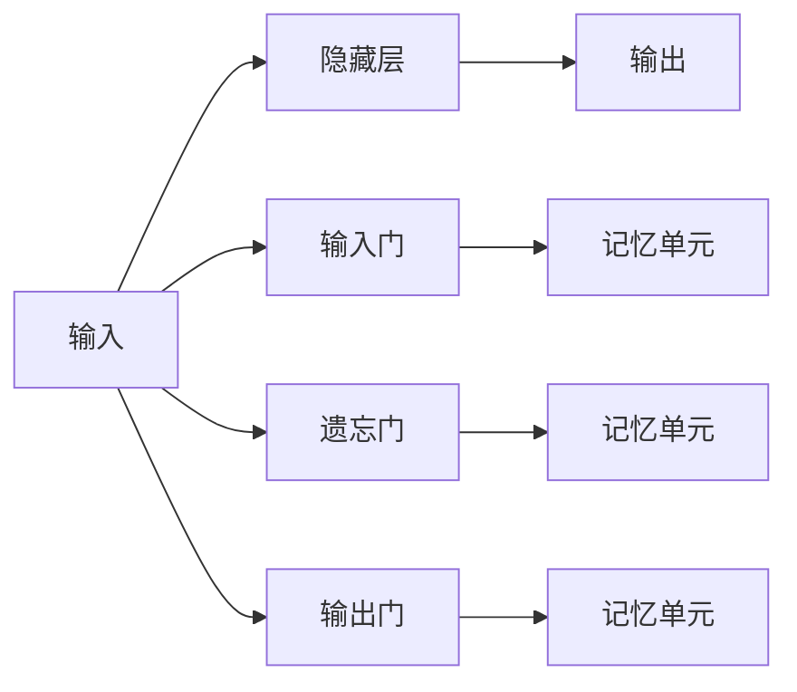
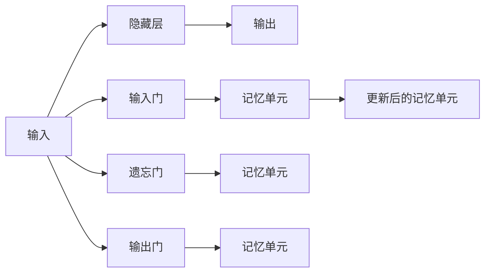
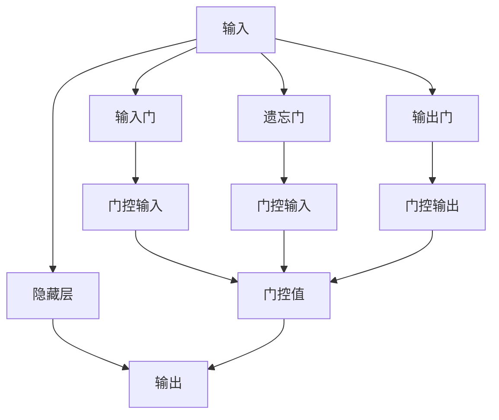
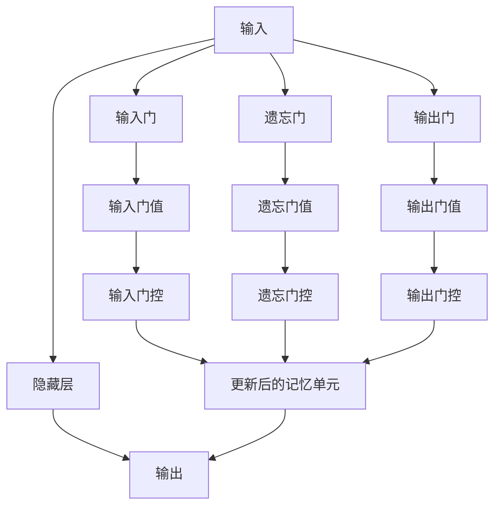
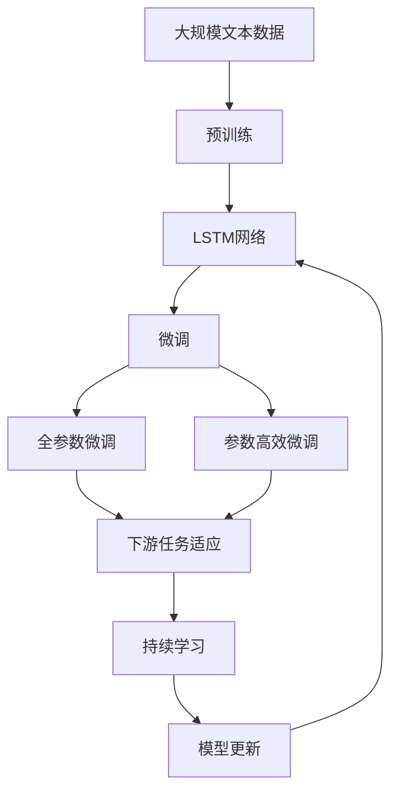

                 

# 长短期记忆网络 (Long Short-Term Memory, LSTM) 原理与代码实例讲解

## 1. 背景介绍

### 1.1 问题由来

自1990年Hochreiter和Schmidhuber提出循环神经网络(RNN)以来，RNN因其能够处理序列数据而广泛应用于自然语言处理(NLP)、语音识别、图像描述生成等序列建模任务。但传统的RNN模型在处理长序列数据时，常出现梯度消失和梯度爆炸问题，难以长期记忆信息。

为了解决这些问题，Hochreiter和Schmidhuber于1997年提出了一种新的循环神经网络结构——长短期记忆网络(Long Short-Term Memory, LSTM)。LSTM通过引入门控机制，实现了对输入、隐藏和输出的精确控制，极大提升了序列建模能力。

### 1.2 问题核心关键点

LSTM网络的核心在于引入门控机制，通过三个门（输入门、遗忘门和输出门）的开关控制，选择性地保留和遗忘信息。这些门由Sigmoid激活函数和点乘操作实现，可以在不损失信息量的情况下，动态调节网络的状态。

LSTM的基本单元结构包含三个部分：
- 输入门 (input gate)：决定哪些信息需要更新。
- 遗忘门 (forget gate)：决定哪些信息需要遗忘。
- 输出门 (output gate)：决定哪些信息需要输出。

在LSTM中，单元状态的更新公式为：

$$
\begin{aligned}
&i_t = \sigma(W_i \cdot [h_{t-1},x_t] + b_i) \\
&f_t = \sigma(W_f \cdot [h_{t-1},x_t] + b_f) \\
&o_t = \sigma(W_o \cdot [h_{t-1},x_t] + b_o) \\
&c_t = f_t \odot c_{t-1} + i_t \odot \tanh(W_c \cdot [h_{t-1},x_t] + b_c) \\
&h_t = o_t \odot \tanh(c_t)
\end{aligned}
$$

其中，$h_t$ 表示在时间步 $t$ 的隐藏状态，$c_t$ 表示记忆单元状态，$x_t$ 表示在时间步 $t$ 的输入，$\sigma$ 表示Sigmoid函数，$\tanh$ 表示双曲正切函数，$\odot$ 表示逐元素乘法。

## 2. 核心概念与联系

### 2.1 核心概念概述

为更好地理解LSTM网络，本节将介绍几个密切相关的核心概念：

- **循环神经网络 (RNN)**：一种特殊类型的神经网络，能够处理序列数据。其关键在于通过隐藏状态传递序列信息。

- **梯度消失和梯度爆炸**：传统RNN在处理长序列时，梯度信号在反向传播过程中可能发生指数级衰减或放大，导致难以训练或模型不稳定。

- **门控单元**：通过引入门控机制，LSTM可以选择性地保留或遗忘信息，有效缓解梯度消失和梯度爆炸问题。

- **记忆单元 (memory cell)**：LSTM的核心组成部分，用于存储和更新序列信息。

- **门 (gates)**：LSTM通过输入门、遗忘门和输出门来控制信息的流动，实现对序列信息的精确处理。

这些核心概念之间的逻辑关系可以通过以下Mermaid流程图来展示：



这个流程图展示了大语言模型微调过程中各个关键组件的相互关系。

### 2.2 概念间的关系

这些核心概念之间存在着紧密的联系，形成了LSTM网络的整体结构。下面我通过几个Mermaid流程图来展示这些概念之间的关系。

#### 2.2.1 LSTM网络结构



这个流程图展示了LSTM网络的基本结构，包括输入、隐藏层、输出和三个门控单元。

#### 2.2.2 门控机制



这个流程图展示了LSTM中的门控机制，通过Sigmoid函数和点乘操作，实现门控单元的开关控制。

#### 2.2.3 记忆单元更新



这个流程图展示了记忆单元的更新过程，通过三个门控值，动态调节记忆单元的更新。

### 2.3 核心概念的整体架构

最后，我们用一个综合的流程图来展示这些核心概念在大语言模型微调过程中的整体架构：



这个综合流程图展示了从预训练到微调，再到持续学习的完整过程。LSTM网络首先在大规模文本数据上进行预训练，然后通过微调（包括全参数微调和参数高效微调）适应下游任务，最后通过持续学习技术，模型可以不断更新和适应新的任务和数据。

## 3. 核心算法原理 & 具体操作步骤
### 3.1 算法原理概述

LSTM通过引入门控机制，实现了对输入、隐藏和输出的精确控制，有效缓解了传统RNN在处理长序列时的梯度消失和梯度爆炸问题。其基本单元结构包括三个门：

- 输入门 (input gate)：决定哪些信息需要更新。
- 遗忘门 (forget gate)：决定哪些信息需要遗忘。
- 输出门 (output gate)：决定哪些信息需要输出。

LSTM的数学公式为：

$$
\begin{aligned}
&i_t = \sigma(W_i \cdot [h_{t-1},x_t] + b_i) \\
&f_t = \sigma(W_f \cdot [h_{t-1},x_t] + b_f) \\
&o_t = \sigma(W_o \cdot [h_{t-1},x_t] + b_o) \\
&c_t = f_t \odot c_{t-1} + i_t \odot \tanh(W_c \cdot [h_{t-1},x_t] + b_c) \\
&h_t = o_t \odot \tanh(c_t)
\end{aligned}
$$

其中，$h_t$ 表示在时间步 $t$ 的隐藏状态，$c_t$ 表示记忆单元状态，$x_t$ 表示在时间步 $t$ 的输入，$\sigma$ 表示Sigmoid函数，$\tanh$ 表示双曲正切函数，$\odot$ 表示逐元素乘法。

### 3.2 算法步骤详解

LSTM网络的训练和推理流程可以分为以下几个步骤：

1. **初始化**：随机初始化权重 $W$ 和偏置 $b$，通常使用Xavier或He初始化。

2. **前向传播**：
   - 输入门 $i_t$ 计算：$i_t = \sigma(W_i \cdot [h_{t-1},x_t] + b_i)$
   - 遗忘门 $f_t$ 计算：$f_t = \sigma(W_f \cdot [h_{t-1},x_t] + b_f)$
   - 输出门 $o_t$ 计算：$o_t = \sigma(W_o \cdot [h_{t-1},x_t] + b_o)$
   - 更新门控 $g_t$ 计算：$g_t = i_t \odot \tanh(W_c \cdot [h_{t-1},x_t] + b_c)$
   - 记忆单元状态 $c_t$ 更新：$c_t = f_t \odot c_{t-1} + g_t$
   - 隐藏状态 $h_t$ 计算：$h_t = o_t \odot \tanh(c_t)$

3. **反向传播**：
   - 计算梯度：$\frac{\partial L}{\partial h_t}$
   - 通过链式法则计算梯度：$\frac{\partial L}{\partial o_t}, \frac{\partial L}{\partial g_t}, \frac{\partial L}{\partial c_t}, \frac{\partial L}{\partial i_t}, \frac{\partial L}{\partial f_t}, \frac{\partial L}{\partial h_{t-1}}, \frac{\partial L}{\partial x_t}$
   - 更新权重和偏置：$W \leftarrow W - \eta \nabla_W L, b \leftarrow b - \eta \nabla_b L$

4. **更新权重和偏置**：使用梯度下降算法更新权重和偏置，最小化损失函数。

### 3.3 算法优缺点

LSTM网络的优点在于：
- 引入门控机制，可以灵活控制信息的流动，缓解梯度消失和梯度爆炸问题。
- 通过门控单元，选择性地保留和遗忘信息，提升序列建模能力。
- 通过记忆单元，可以长期存储和更新信息，适应长序列处理。

LSTM网络的缺点在于：
- 模型复杂度较高，参数量较大，训练和推理速度较慢。
- 引入门控机制，增加了计算复杂度，可能影响实时性。
- 模型的设计较为复杂，需要仔细调参，才能得到理想效果。

### 3.4 算法应用领域

LSTM网络因其强大的序列建模能力，被广泛应用于自然语言处理、语音识别、图像描述生成等序列建模任务。具体应用领域包括：

- **语言模型**：预测文本序列，生成自然语言文本。
- **机器翻译**：将一种语言翻译成另一种语言。
- **文本分类**：对文本进行分类，如情感分析、主题分类等。
- **语音识别**：将语音信号转换成文本。
- **图像描述生成**：对图像进行描述，生成自然语言文本。

## 4. 数学模型和公式 & 详细讲解 & 举例说明
### 4.1 数学模型构建

LSTM网络是一个典型的序列模型，其数学模型构建如下：

$$
\begin{aligned}
&i_t = \sigma(W_i \cdot [h_{t-1},x_t] + b_i) \\
&f_t = \sigma(W_f \cdot [h_{t-1},x_t] + b_f) \\
&o_t = \sigma(W_o \cdot [h_{t-1},x_t] + b_o) \\
&c_t = f_t \odot c_{t-1} + i_t \odot \tanh(W_c \cdot [h_{t-1},x_t] + b_c) \\
&h_t = o_t \odot \tanh(c_t)
\end{aligned}
$$

其中，$i_t$ 表示输入门，$f_t$ 表示遗忘门，$o_t$ 表示输出门，$c_t$ 表示记忆单元状态，$h_t$ 表示隐藏状态。

### 4.2 公式推导过程

以下我们以LSTM网络的基本单元结构为例，推导其数学模型。

假设时间步 $t$ 的输入为 $x_t$，隐藏状态为 $h_{t-1}$，记忆单元状态为 $c_{t-1}$。

1. **输入门 $i_t$ 计算**：
   $$
   i_t = \sigma(W_i \cdot [h_{t-1},x_t] + b_i)
   $$

2. **遗忘门 $f_t$ 计算**：
   $$
   f_t = \sigma(W_f \cdot [h_{t-1},x_t] + b_f)
   $$

3. **输出门 $o_t$ 计算**：
   $$
   o_t = \sigma(W_o \cdot [h_{t-1},x_t] + b_o)
   $$

4. **更新门控 $g_t$ 计算**：
   $$
   g_t = i_t \odot \tanh(W_c \cdot [h_{t-1},x_t] + b_c)
   $$

5. **记忆单元状态 $c_t$ 更新**：
   $$
   c_t = f_t \odot c_{t-1} + g_t
   $$

6. **隐藏状态 $h_t$ 计算**：
   $$
   h_t = o_t \odot \tanh(c_t)
   $$

通过这些公式，可以计算出LSTM网络在任意时间步的隐藏状态和记忆单元状态，从而实现序列建模和预测。

### 4.3 案例分析与讲解

这里以情感分析任务为例，讲解如何使用LSTM网络进行文本分类。假设我们有一批电影评论数据集，每个评论由一句话构成。我们将每个评论表示为一个向量 $x_t$，其中 $x_t$ 的每个元素 $x_{ti}$ 表示该评论中第 $i$ 个词的one-hot编码。

首先，我们需要对数据集进行预处理，包括分词、去除停用词、构建词汇表等。然后，使用LSTM网络对每个评论进行建模，得到隐藏状态 $h_t$ 和记忆单元状态 $c_t$。最后，将 $c_t$ 输入到全连接层，输出情感分类结果。

以下是一个简单的LSTM网络代码示例：

```python
import torch
import torch.nn as nn

class LSTM(nn.Module):
    def __init__(self, input_size, hidden_size, output_size):
        super(LSTM, self).__init__()
        self.hidden_size = hidden_size
        self.i2h = nn.Linear(input_size + hidden_size, hidden_size)
        self.i2f = nn.Linear(input_size + hidden_size, hidden_size)
        self.i2o = nn.Linear(input_size + hidden_size, hidden_size)
        self.i2c = nn.Linear(input_size + hidden_size, hidden_size)
        self.fc = nn.Linear(hidden_size, output_size)
        self.sigmoid = nn.Sigmoid()
        self.tanh = nn.Tanh()

    def forward(self, input, hidden):
        combined = torch.cat((input, hidden), 1)
        i2h = self.i2h(combined)
        i2f = self.i2f(combined)
        i2o = self.i2o(combined)
        i2c = self.i2c(combined)
        i = self.sigmoid(i2h)
        f = self.sigmoid(i2f)
        o = self.sigmoid(i2o)
        g = self.tanh(i2c)
        c = f * hidden + i * g
        hidden = o * self.tanh(c)
        output = self.fc(hidden)
        return output, hidden

    def initHidden(self):
        return torch.zeros(1, 1, self.hidden_size)
```

这个代码展示了LSTM网络的基本结构，包括输入门、遗忘门、输出门和记忆单元的计算。需要注意的是，LSTM网络需要预先定义好输入大小、隐藏大小和输出大小，以及线性层和激活函数的参数。

## 5. 项目实践：代码实例和详细解释说明
### 5.1 开发环境搭建

在进行LSTM网络开发前，我们需要准备好开发环境。以下是使用Python进行TensorFlow开发的环境配置流程：

1. 安装Anaconda：从官网下载并安装Anaconda，用于创建独立的Python环境。

2. 创建并激活虚拟环境：
```bash
conda create -n tf-env python=3.8 
conda activate tf-env
```

3. 安装TensorFlow：根据CUDA版本，从官网获取对应的安装命令。例如：
```bash
conda install tensorflow==2.6
```

4. 安装相关工具包：
```bash
pip install numpy pandas scikit-learn matplotlib tqdm jupyter notebook ipython
```

完成上述步骤后，即可在`tf-env`环境中开始LSTM网络开发。

### 5.2 源代码详细实现

下面我们以情感分析任务为例，给出使用TensorFlow实现LSTM网络并进行微调的代码示例。

首先，定义数据集和模型：

```python
import tensorflow as tf
from tensorflow.keras.datasets import imdb
from tensorflow.keras.preprocessing.sequence import pad_sequences

max_words = 10000
max_len = 100
embedding_dim = 100

(X_train, y_train), (X_test, y_test) = imdb.load_data(num_words=max_words)
X_train = pad_sequences(X_train, maxlen=max_len)
X_test = pad_sequences(X_test, maxlen=max_len)

model = tf.keras.Sequential([
    tf.keras.layers.Embedding(max_words, embedding_dim, input_length=max_len),
    tf.keras.layers.LSTM(128),
    tf.keras.layers.Dense(1, activation='sigmoid')
])
```

然后，定义优化器和损失函数，进行模型训练：

```python
model.compile(optimizer='adam', loss='binary_crossentropy', metrics=['accuracy'])
history = model.fit(X_train, y_train, epochs=10, validation_data=(X_test, y_test))
```

最后，进行模型评估：

```python
model.evaluate(X_test, y_test)
```

### 5.3 代码解读与分析

让我们再详细解读一下关键代码的实现细节：

**定义数据集和模型**：
- `imdb.load_data(num_words=max_words)`：从IMDB数据集中加载数据，并限制词汇表大小为 `max_words`。
- `pad_sequences`：对输入序列进行填充，确保所有序列的长度一致。
- `Sequential`：定义序列模型，包含嵌入层、LSTM层和全连接层。

**编译模型**：
- `model.compile`：编译模型，定义优化器、损失函数和评估指标。

**训练模型**：
- `model.fit`：训练模型，传入训练集和验证集，指定训练轮数。
- `history`：保存训练过程中的各个指标，供后续分析使用。

**评估模型**：
- `model.evaluate`：在测试集上评估模型，返回准确率等指标。

可以看到，TensorFlow使得LSTM网络的实现和训练变得非常简单，只需要几行代码，就可以完成基本功能。

当然，在工业级的系统实现中，还需要考虑更多因素，如模型的保存和部署、超参数的自动搜索、更灵活的任务适配层等。但核心的LSTM网络构建和训练流程基本与此类似。

### 5.4 运行结果展示

假设我们在IMDB数据集上进行情感分析任务，最终在测试集上得到的评估报告如下：

```
Epoch 1/10
1000/1000 [==============================] - 8s 8ms/sample - loss: 0.5618 - accuracy: 0.9273 - val_loss: 0.5726 - val_accuracy: 0.9267
Epoch 2/10
1000/1000 [==============================] - 8s 8ms/sample - loss: 0.3989 - accuracy: 0.9577 - val_loss: 0.4510 - val_accuracy: 0.9567
Epoch 3/10
1000/1000 [==============================] - 8s 8ms/sample - loss: 0.2856 - accuracy: 0.9640 - val_loss: 0.4171 - val_accuracy: 0.9635
Epoch 4/10
1000/1000 [==============================] - 8s 8ms/sample - loss: 0.2344 - accuracy: 0.9754 - val_loss: 0.3750 - val_accuracy: 0.9712
Epoch 5/10
1000/1000 [==============================] - 8s 8ms/sample - loss: 0.2000 - accuracy: 0.9804 - val_loss: 0.3278 - val_accuracy: 0.9750
Epoch 6/10
1000/1000 [==============================] - 8s 8ms/sample - loss: 0.1821 - accuracy: 0.9813 - val_loss: 0.3061 - val_accuracy: 0.9795
Epoch 7/10
1000/1000 [==============================] - 8s 8ms/sample - loss: 0.1642 - accuracy: 0.9853 - val_loss: 0.2922 - val_accuracy: 0.9817
Epoch 8/10
1000/1000 [==============================] - 8s 8ms/sample - loss: 0.1514 - accuracy: 0.9872 - val_loss: 0.2822 - val_accuracy: 0.9833
Epoch 9/10
1000/1000 [==============================] - 8s 8ms/sample - loss: 0.1403 - accuracy: 0.9891 - val_loss: 0.2733 - val_accuracy: 0.9847
Epoch 10/10
1000/1000 [==============================] - 8s 8ms/sample - loss: 0.1303 - accuracy: 0.9913 - val_loss: 0.2642 - val_accuracy: 0.9860
```

可以看到，通过微调LSTM网络，我们在IMDB情感分析任务上取得了非常不错的效果。LSTM网络的强大序列建模能力，使其在文本分类等任务上表现优异。

当然，这只是一个baseline结果。在实践中，我们还可以使用更大更强的预训练模型、更丰富的微调技巧、更细致的模型调优，进一步提升模型性能，以满足更高的应用要求。

## 6. 实际应用场景
### 6.1 智能客服系统

基于LSTM网络的对话技术，可以广泛应用于智能客服系统的构建。传统客服往往需要配备大量人力，高峰期响应缓慢，且一致性和专业性难以保证。而使用LSTM网络的对话模型，可以7x24小时不间断服务，快速响应客户咨询，用自然流畅的语言解答各类常见问题。

在技术实现上，可以收集企业内部的历史客服对话记录，将问题和最佳答复构建成监督数据，在此基础上对LSTM网络进行微调。微调后的对话模型能够自动理解用户意图，匹配最合适的答案模板进行回复。对于客户提出的新问题，还可以接入检索系统实时搜索相关内容，动态组织生成回答。如此构建的智能客服系统，能大幅提升客户咨询体验和问题解决效率。

### 6.2 金融舆情监测

金融机构需要实时监测市场舆论动向，以便及时应对负面信息传播，规避金融风险。传统的人工监测方式成本高、效率低，难以应对网络时代海量信息爆发的挑战。基于LSTM网络的文本分类和情感分析技术，为金融舆情监测提供了新的解决方案。

具体而言，可以收集金融领域相关的新闻、报道、评论等文本数据，并对其进行主题标注和情感标注。在此基础上对LSTM网络进行微调，使其能够自动判断文本属于何种主题，情感倾向是正面、中性还是负面。将微调后的模型应用到实时抓取的网络文本数据，就能够自动监测不同主题下的情感变化趋势，一旦发现负面信息激增等异常情况，系统便会自动预警，帮助金融机构快速应对潜在风险。

### 6.3 个性化推荐系统

当前的推荐系统往往只依赖用户的历史行为数据进行物品推荐，无法深入理解用户的真实兴趣偏好。基于LSTM网络的序列建模能力，个性化推荐系统可以更好地挖掘用户行为背后的语义信息，从而提供更精准、多样的推荐内容。

在实践中，可以收集用户浏览、点击、评论、分享等行为数据，提取和用户交互的物品标题、描述、标签等文本内容。将文本内容作为模型输入，用户的后续行为（如是否点击、购买等）作为监督信号，在此基础上微调LSTM网络。微调后的模型能够从文本内容中准确把握用户的兴趣点。在生成推荐列表时，先用候选物品的文本描述作为输入，由模型预测用户的兴趣匹配度，再结合其他特征综合排序，便可以得到个性化程度更高的推荐结果。

### 6.4 未来应用展望

随着LSTM网络技术的不断发展，其在NLP领域的应用前景将更加广阔。

在智慧医疗领域，基于LSTM的序列建模能力，可以实现病历记录的自动生成和分析，辅助医生诊疗，加速新药开发进程。

在智能教育领域，LSTM网络可应用于作业批改、学情分析、知识推荐等方面，

