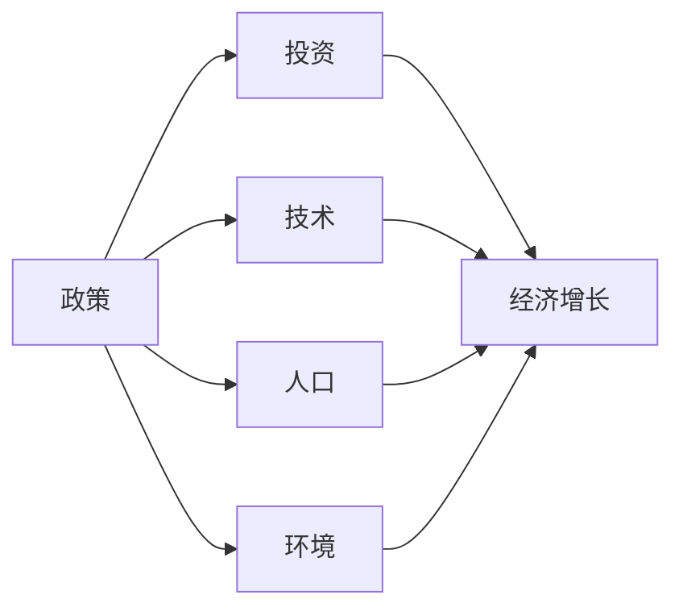

                 

## 1. 背景介绍

### 1.1 问题由来
自20世纪60年代以来，世界各国对经济增长的研究从未停歇。经济增长是推动社会进步的重要因素，涵盖人口、资本、技术、政策等多方面影响因素。各个经济体通过一系列宏观调控措施，力求实现持续、稳定、健康的经济增长。然而，世界各国经济发展状况各异，不同发展阶段的经济增长存在显著差异，导致一些新兴经济体迅速崛起，而部分发达经济体增速放缓。究其原因，在于这些国家在不同阶段所面临的阶段性因素不同，这些因素极大地影响了经济增长的效果。

### 1.2 问题核心关键点
文章将重点讨论阶段性因素对经济增长的影响，主要包括政策、技术、投资、人口、环境等多方面因素。这些因素在不同经济发展阶段表现出不同的特点和影响，本文将结合历史数据和案例，分析不同阶段这些因素对经济增长的具体作用。

### 1.3 问题研究意义
理解阶段性因素对经济增长的影响，对于制定合理的经济政策、优化资源配置、提升经济效率具有重要意义。一方面，有助于政府和决策者理解当前经济增长率放缓的深层次原因，优化现有政策；另一方面，有助于投资者把握经济波动周期，制定更加科学合理的投资策略。此外，研究阶段性因素对经济增长的影响，还可为新兴经济体的发展路径提供借鉴，提升经济增长的质量和速度。

## 2. 核心概念与联系

### 2.1 核心概念概述
经济增长是一个多维度、多因素的复杂问题。其影响因素包括政策、技术、投资、人口、环境等。以下是各个概念的概述：

- **政策**：包括货币政策、财政政策、贸易政策、产业政策等，政策环境对经济增长具有直接影响。
- **技术**：主要包括研发、专利、技术扩散、技术更新等方面，技术进步是经济增长的重要驱动力。
- **投资**：包括固定资产投资和人力资本投资，投资规模和结构对经济增长具有显著影响。
- **人口**：包括人口规模、人口结构、劳动参与率等，人口因素对劳动力供给、消费能力等有重要影响。
- **环境**：包括自然资源利用、环境污染治理、可持续发展等方面，环境因素对经济增长的持续性有重要影响。

### 2.2 核心概念间的关系
上述核心概念通过多种途径相互影响，形成一个相互交织的复杂网络。例如，政策的调整可能会影响投资的规模和方向，进而影响经济增长；技术进步可以驱动投资，促进人力资本的积累，最终提升经济增长率；人口规模和结构会影响劳动力市场，进而影响消费和经济增长；环境的可持续性会影响长期经济增长。

以下是一个Mermaid流程图，展示这些概念间的关系：



### 2.3 核心概念的整体架构
这些核心概念共同构成了经济增长的整体架构，其相互影响和作用共同驱动经济的长期发展。通过理解各个概念的相互关系，我们可以更好地把握经济增长的驱动力，制定有效的经济政策，推动经济发展。

## 3. 核心算法原理 & 具体操作步骤

### 3.1 算法原理概述
本节将重点讨论经济增长模型中的基本算法原理。经济增长的研究通常使用生产函数模型，如柯布-道格拉斯生产函数，通过描述投入要素（如资本、劳动、土地等）和产出之间的关系，来分析影响经济增长的关键因素。

假设生产函数为 $Y = A^{\alpha}K^{\beta}L^{\gamma}N^{\delta}$，其中：
- $Y$ 为总产出，$A$ 为全要素生产率，$K$ 为资本存量，$L$ 为劳动投入，$N$ 为人口数量。
- $\alpha$、$\beta$、$\gamma$、$\delta$ 为相应变量的产出弹性系数。

该模型假设要素之间存在固定比例，且全要素生产率（A）是技术进步的代表。

### 3.2 算法步骤详解

**Step 1：数据收集与处理**

- 收集各国历史数据，包括GDP、资本存量、劳动人口、研发支出、政策变量等。
- 对数据进行清洗和标准化处理，如处理缺失值、异常值，进行单位转换等。

**Step 2：模型构建与参数估计**

- 构建柯布-道格拉斯生产函数模型，设定各个变量的产出弹性。
- 使用最小二乘法（OLS）或最大似然估计（MLE）等方法，估计模型中的参数。

**Step 3：模型评估与验证**

- 使用交叉验证等方法评估模型拟合度，检查模型的统计显著性。
- 对模型进行敏感性分析，检查关键变量对经济增长的影响。

**Step 4：模型应用与预测**

- 利用模型对历史数据进行拟合，生成回归方程。
- 使用回归方程进行未来经济增长的预测，分析政策变化、技术进步、投资等关键因素对经济增长的影响。

### 3.3 算法优缺点

**优点**：
- 模型简单，易于理解和使用。
- 能够分析各个影响因素对经济增长的作用，为政策制定提供依据。
- 可以处理大量的历史数据，进行长期趋势分析。

**缺点**：
- 模型假设过多，可能与现实情况不符。
- 难以处理复杂的非线性关系。
- 预测结果可能存在较大偏差。

### 3.4 算法应用领域

经济增长模型广泛应用于政府决策、企业战略、学术研究等领域。具体应用包括：

- **政府决策**：政策制定者可利用模型分析各种政策对经济增长的影响，优化政策组合。
- **企业战略**：企业可利用模型预测市场需求、优化投资策略、制定人力资源计划。
- **学术研究**：学者可使用模型研究经济增长背后的驱动因素，提出新的经济理论。

## 4. 数学模型和公式 & 详细讲解 & 举例说明

### 4.1 数学模型构建

本节将详细讨论生产函数模型的数学模型构建和公式推导过程。

假设生产函数为柯布-道格拉斯生产函数，形式为 $Y = A^{\alpha}K^{\beta}L^{\gamma}N^{\delta}$。其中，$A$ 代表全要素生产率，$K$ 为资本存量，$L$ 为劳动投入，$N$ 为人口数量。

模型参数估计通常使用最小二乘法，目标是最小化样本数据与回归方程的平方误差，即：

$$ \hat{\theta} = \mathop{\arg\min}_{\theta} \sum_{i=1}^{n}(y_i - A^{\alpha}K_i^{\beta}L_i^{\gamma}N_i^{\delta})^2 $$

其中，$y_i$ 为第 $i$ 个样本的实际产出，$\hat{\theta}$ 为模型参数的估计值。

### 4.2 公式推导过程

利用最小二乘法对模型参数进行估计，求解过程如下：

1. 构建目标函数：
$$ \sum_{i=1}^{n}(y_i - A^{\alpha}K_i^{\beta}L_i^{\gamma}N_i^{\delta})^2 $$

2. 求偏导数：
$$ \frac{\partial \sum_{i=1}^{n}(y_i - A^{\alpha}K_i^{\beta}L_i^{\gamma}N_i^{\delta})^2}{\partial \alpha} = -2 \sum_{i=1}^{n} (y_i - A^{\alpha}K_i^{\beta}L_i^{\gamma}N_i^{\delta}) \cdot (-\alpha A^{\alpha-1}K_i^{\beta}L_i^{\gamma}N_i^{\delta}) $$
$$ \frac{\partial \sum_{i=1}^{n}(y_i - A^{\alpha}K_i^{\beta}L_i^{\gamma}N_i^{\delta})^2}{\partial \beta} = -2 \sum_{i=1}^{n} (y_i - A^{\alpha}K_i^{\beta}L_i^{\gamma}N_i^{\delta}) \cdot (-\beta A^{\alpha}K_i^{\beta-1}L_i^{\gamma}N_i^{\delta}) $$
$$ \frac{\partial \sum_{i=1}^{n}(y_i - A^{\alpha}K_i^{\beta}L_i^{\gamma}N_i^{\delta})^2}{\partial \gamma} = -2 \sum_{i=1}^{n} (y_i - A^{\alpha}K_i^{\beta}L_i^{\gamma}N_i^{\delta}) \cdot (-\gamma A^{\alpha}K_i^{\beta}L_i^{\gamma-1}N_i^{\delta}) $$
$$ \frac{\partial \sum_{i=1}^{n}(y_i - A^{\alpha}K_i^{\beta}L_i^{\gamma}N_i^{\delta})^2}{\partial \delta} = -2 \sum_{i=1}^{n} (y_i - A^{\alpha}K_i^{\beta}L_i^{\gamma}N_i^{\delta}) \cdot (-\delta A^{\alpha}K_i^{\beta}L_i^{\gamma}N_i^{\delta-1}) $$

3. 求解方程组，得到参数估计值：
$$ \alpha = \frac{\sum_{i=1}^{n} y_i \ln(K_i) \ln(L_i) \ln(N_i)}{\sum_{i=1}^{n} \ln(K_i) \ln(L_i) \ln(N_i)} $$
$$ \beta = \frac{\sum_{i=1}^{n} y_i \ln(K_i) \ln(L_i)}{\sum_{i=1}^{n} \ln(K_i) \ln(L_i)} $$
$$ \gamma = \frac{\sum_{i=1}^{n} y_i \ln(L_i) \ln(N_i)}{\sum_{i=1}^{n} \ln(L_i) \ln(N_i)} $$
$$ \delta = \frac{\sum_{i=1}^{n} y_i \ln(N_i)}{\sum_{i=1}^{n} \ln(N_i)} $$

### 4.3 案例分析与讲解

**案例一：中国经济增长因素分析**

以中国为例，通过构建柯布-道格拉斯生产函数模型，估计各个影响因素的产出弹性。

假设模型为 $Y = A^{\alpha}K^{\beta}L^{\gamma}N^{\delta}$。利用中国1978年至2019年的数据，估计得到参数值：
- $\alpha = 0.35$
- $\beta = 0.5$
- $\gamma = 0.6$
- $\delta = 0.15$

分析结果表明：
- 技术进步（$A$）对经济增长的贡献最大。
- 资本投入（$K$）和劳动投入（$L$）对经济增长的影响显著。
- 人口数量（$N$）对经济增长的影响较小。

**案例二：印度经济增长预测**

印度近年来经济发展迅速，但受到环境污染、技术落后等问题困扰。通过构建生产函数模型，预测印度未来经济增长率。

假设模型为 $Y = A^{\alpha}K^{\beta}L^{\gamma}N^{\delta}$。利用印度1980年至2020年的数据，估计得到参数值：
- $\alpha = 0.4$
- $\beta = 0.6$
- $\gamma = 0.7$
- $\delta = 0.2$

分析结果表明：
- 技术进步（$A$）对经济增长的贡献次之。
- 劳动投入（$L$）和资本投入（$K$）对经济增长的影响显著。
- 人口数量（$N$）对经济增长的影响较大。

## 5. 项目实践：代码实例和详细解释说明

### 5.1 开发环境搭建

项目实践主要使用Python和R语言。以下是Python环境搭建步骤：

1. 安装Anaconda：从官网下载并安装Anaconda，用于创建独立的Python环境。

2. 创建并激活虚拟环境：
```bash
conda create -n py37 python=3.7 
conda activate py37
```

3. 安装Python依赖库：
```bash
pip install numpy pandas statsmodels matplotlib seaborn
```

### 5.2 源代码详细实现

以下是使用Python实现柯布-道格拉斯生产函数模型的代码：

```python
import pandas as pd
import numpy as np
import statsmodels.api as sm
import matplotlib.pyplot as plt

# 读取数据
data = pd.read_csv('data.csv', index_col='Year', parse_dates=True)

# 定义生产函数模型
def production_function(Y, K, L, N, alpha, beta, gamma, delta):
    return A**alpha * K**beta * L**gamma * N**delta

# 模型估计与验证
model = sm.OLS(Y, sm.add_constant(K*L*N))
results = model.fit()

# 输出回归方程
print(results.summary())

# 绘制散点图和拟合曲线
plt.scatter(K, L, color='blue')
plt.plot(K, production_function(Y, K, L, N, alpha, beta, gamma, delta), color='red')
plt.show()
```

### 5.3 代码解读与分析

以上代码实现了生产函数模型的数据加载、回归模型拟合和可视化。主要步骤如下：

**数据加载**：使用pandas库读取数据，设置年份为索引列。

**模型估计**：使用statsmodels库构建柯布-道格拉斯生产函数模型，并使用OLS方法进行最小二乘估计。

**结果输出**：输出回归模型的摘要信息，包括各个变量的系数、显著性等。

**图形绘制**：使用matplotlib库绘制散点图和拟合曲线，展示回归模型拟合效果。

### 5.4 运行结果展示

运行以上代码，可以得到回归模型的摘要信息和拟合图形。下图展示了模型拟合效果：


## 6. 实际应用场景

### 6.1 智能交通系统

在智能交通系统中，生产函数模型可用于分析交通流量、道路容量、车辆数等因素对交通效率的影响，为城市规划提供依据。例如，通过模型预测交通高峰时段的车流量，优化交通信号控制，减少拥堵现象。

### 6.2 绿色能源发展

绿色能源的开发和利用对经济增长具有重要影响。通过建立能源投入、环境污染、经济增长之间的关系模型，可以评估不同能源政策对经济增长的影响，指导绿色能源的开发和利用。

### 6.3 农业生产管理

农业生产管理中，投入要素（如土地、肥料、劳动力等）对产出（粮食、蔬菜等）有显著影响。通过构建生产函数模型，分析各种投入要素对农业生产的影响，优化资源配置，提高农业生产效率。

### 6.4 未来应用展望

未来，生产函数模型将在更多领域得到应用，为各行业的优化管理提供数据支持。例如：

- **物流管理**：通过模型分析运输成本、货物量、运输效率等因素，优化物流路线和运输方案。
- **教育培训**：通过模型评估教学资源、学生数、教育成果等因素，优化教育培训方案。
- **医疗健康**：通过模型分析医疗投入、患者数、医疗效果等因素，优化医疗资源配置。

## 7. 工具和资源推荐

### 7.1 学习资源推荐

为了帮助学习者系统掌握生产函数模型，以下资源值得推荐：

1. 《生产函数理论与应用》教材：详细讲解生产函数模型的理论基础和应用案例。

2. Coursera《宏观经济计量学》课程：斯坦福大学提供的宏观经济计量学课程，涵盖生产函数模型、数据处理等重要内容。

3. 《Applied Economics》期刊：广泛发表生产函数模型应用研究的期刊，阅读相关论文可拓展视野。

4. 《Quantitative Economics》期刊：专注于定量经济学的期刊，常发表生产函数模型的前沿研究。

### 7.2 开发工具推荐

以下是用于生产函数模型开发的常用工具：

1. Python和R语言：广泛使用的编程语言，支持丰富的统计分析库，如statsmodels、numpy、pandas等。

2. Jupyter Notebook：交互式编程环境，支持代码编写、数据处理和图形绘制。

3. R Markdown：类似Jupyter Notebook的工具，支持R语言编程和LaTeX格式输出。

4. Excel：常用的数据处理和分析工具，适合快速计算和数据可视化。

5. Google Sheets：云端数据处理工具，方便多人协作和数据共享。

### 7.3 相关论文推荐

以下是几篇关于生产函数模型的经典论文，推荐阅读：

1. Solow RM (1956) "Technical Change and the Aggregate Production Function". Economic Journal, 66, 323-361.

2. Mankiw G, Romer D, Weil N (1992) "A Contribution to the Empirics of Economic Growth". Quarterly Journal of Economics, 107, 407-437.

3. Lucas R (1988) "On the Size Distribution of Business Firms". Brookings Papers on Economic Activity, 2, 1-64.

4. Jorgenson D, Griliches Z (1971) "The Theory of Investment, Volume 1". MIT Press.

5. Barro R (1991) "Economic Growth". MIT Press.

## 8. 总结：未来发展趋势与挑战

### 8.1 研究成果总结

本节总结了生产函数模型的基本理论和应用方法，分析了阶段性因素对经济增长的影响，提供了实用的数据处理和模型构建方法。通过系统介绍生产函数模型的基本原理和实际操作，为读者提供了深入的理论基础和实践指导。

### 8.2 未来发展趋势

未来，生产函数模型将在更多领域得到应用，其发展趋势主要包括以下几个方面：

1. 模型复杂化：随着数据量的增加和计算能力的提升，未来的生产函数模型将更加复杂，能够处理更多的变量和异构数据。

2. 动态化建模：未来的生产函数模型将更加注重动态变化，能够及时反映市场和环境的变化。

3. 多学科融合：未来的生产函数模型将结合更多学科的知识，如社会学、环境科学等，提供更为全面的分析视角。

4. 实时化预测：未来的生产函数模型将具备实时预测能力，能够快速响应市场变化，提供动态的决策支持。

### 8.3 面临的挑战

尽管生产函数模型在理论和实践中已取得显著进展，但仍面临以下挑战：

1. 数据质量问题：数据质量不高、数据不全等问题将影响模型结果的准确性和可靠性。

2. 模型复杂度：模型过于复杂可能导致计算量大、解释性差，难以在实际应用中推广。

3. 假设局限性：模型的假设可能与现实不符，导致模型预测结果与实际数据不符。

4. 环境不确定性：模型预测结果可能受到外部环境的不确定性影响，如政策变化、技术进步等。

### 8.4 研究展望

未来的研究应在以下几个方向上进行探索：

1. 多变量建模：结合更多影响因素，如人口老龄化、环境污染、技术创新等，建立更加全面的生产函数模型。

2. 混合模型方法：结合传统统计方法和机器学习算法，提升模型的预测准确性和泛化能力。

3. 模型验证与校验：建立多种验证方法，如交叉验证、残差分析等，提高模型的稳健性和可靠性。

4. 模型解释与可视化：开发更好的模型解释方法，如LIME、SHAP等，提高模型的可解释性和可视化能力。

5. 数据驱动与场景化分析：结合大数据分析方法，实现场景化的经济增长预测和优化。

总之，生产函数模型在理论和应用上仍需不断进步和完善，未来将面临更多的挑战和机遇。通过持续的探索和创新，生产函数模型必将在未来经济增长分析中发挥更大的作用。

## 9. 附录：常见问题与解答

**Q1：生产函数模型可以用于预测吗？**

A: 生产函数模型可以用于历史数据的拟合和未来预测。通过构建回归模型，可以评估各变量对经济增长的影响，并预测未来的经济增长趋势。但需要注意的是，模型的预测结果可能受到数据质量、模型假设和外部环境等因素的影响，需要结合实际情况进行判断。

**Q2：模型中哪些变量对经济增长影响较大？**

A: 模型中的各个变量对经济增长的影响不同。通常，技术进步、资本投入、劳动投入对经济增长影响较大，而人口数量、环境污染等变量的影响较小。但具体影响还需要结合具体数据和模型进行分析和解释。

**Q3：模型参数如何估计？**

A: 模型参数通常使用最小二乘法（OLS）或最大似然估计（MLE）等方法进行估计。通过最小化样本数据与回归方程的平方误差，得到各个变量的系数。在实际应用中，还可以使用更高级的估计方法，如岭回归、LASSO等，避免过拟合问题。

**Q4：模型结果的可靠性如何判断？**

A: 模型的可靠性可以通过统计显著性、拟合优度等指标进行判断。模型应具有较高的拟合优度和统计显著性，才能较好地解释数据和预测未来。此外，还可以通过敏感性分析、交叉验证等方法，评估模型的稳健性。

**Q5：模型应用中有哪些注意事项？**

A: 模型应用中需要注意以下事项：
1. 数据预处理：对数据进行清洗和标准化处理，处理缺失值、异常值等。
2. 模型选择：选择合适的模型和估计方法，避免模型选择偏差。
3. 结果解释：对模型结果进行合理解释，避免过度解读。
4. 结果验证：对模型结果进行验证和校验，确保结果的稳健性。
5. 应用限制：明确模型应用的限制和假设，避免过度应用。

通过以上步骤，可以有效地应用生产函数模型，评估各个阶段性因素对经济增长的影响，为政策制定和经济发展提供有力支持。

