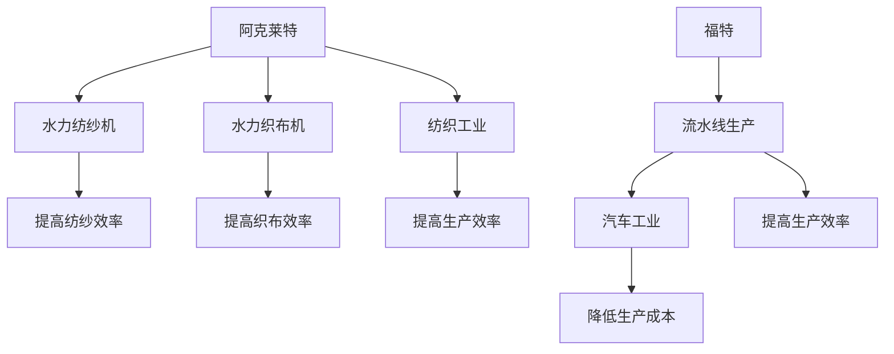
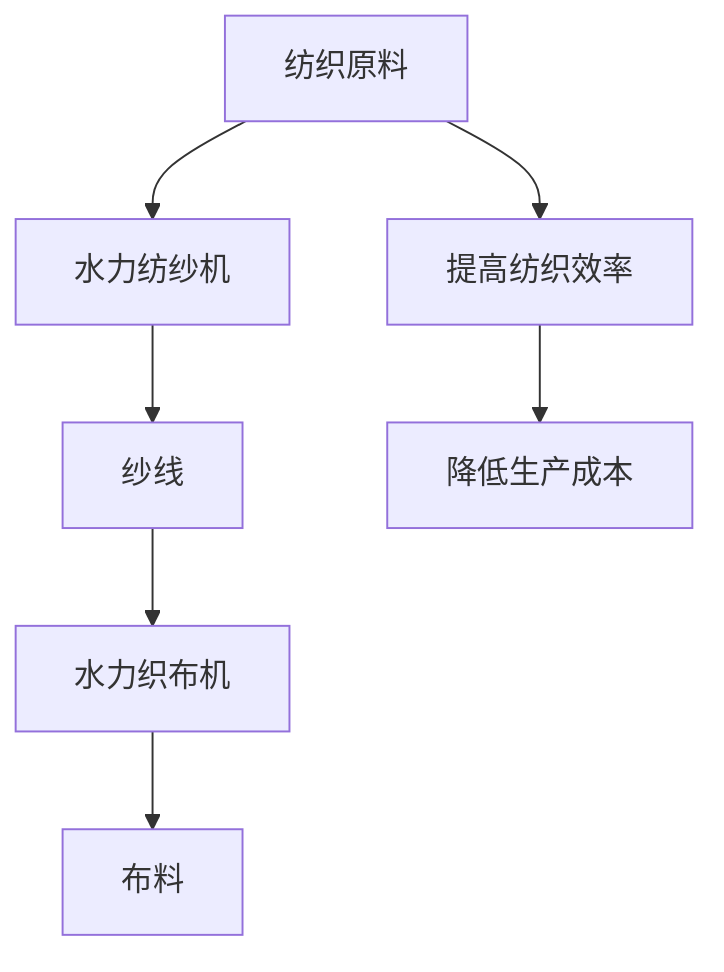
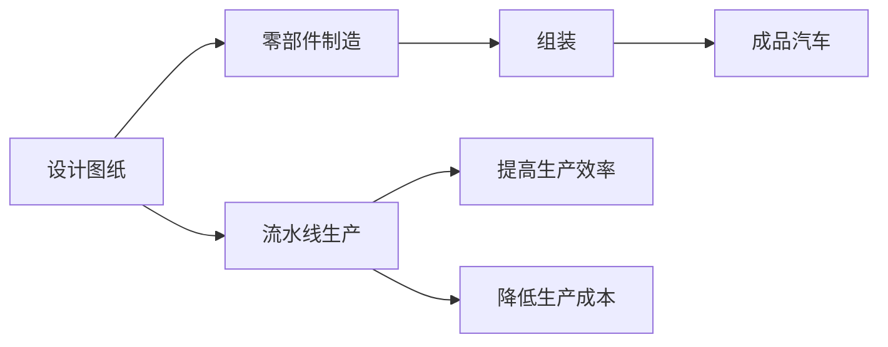
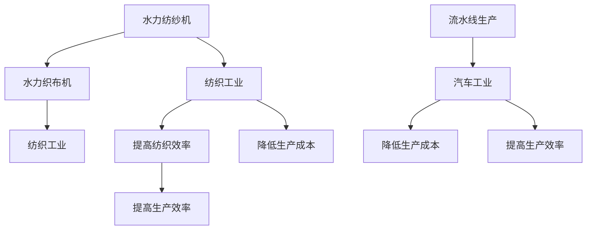
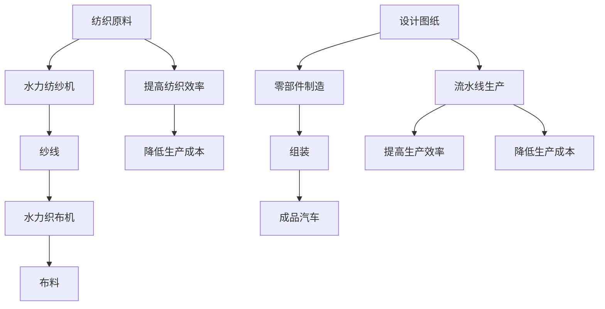

                 

# 阿克莱特与福特的工业贡献

## 1. 背景介绍

### 1.1 问题由来
工业革命是人类历史上的一次巨大变革，它极大地改变了人类的生产方式和生活方式。在这一过程中，无数工业先驱者贡献了他们的智慧和力量。其中，理查德·阿克莱特（Richard Arkwright）和亨利·福特（Henry Ford）是两位杰出的代表，他们分别在纺织工业和汽车工业领域取得了重大的突破。本文将详细介绍阿克莱特与福特的工业贡献，探讨他们如何通过技术创新推动了工业革命的发展。

## 2. 核心概念与联系

### 2.1 核心概念概述

为更好地理解阿克莱特与福特的工业贡献，本节将介绍几个密切相关的核心概念：

- **理查德·阿克莱特（Richard Arkwright）**：英国工业革命时期的纺织工业先驱，发明了水力纺纱机和水力织布机，极大地提高了纺织效率。
- **亨利·福特（Henry Ford）**：美国工业革命时期的汽车工业先驱，创立了福特汽车公司，提出了流水线生产方式，推动了汽车工业的发展。
- **水力纺纱机**：由阿克莱特发明，利用水力驱动纺纱机，极大地提高了纺纱效率和质量。
- **流水线生产**：由福特提出，将生产过程分解为多个环节，每个环节由专门工人负责，极大地提高了生产效率。

- **纺织工业**：由纺织原料的采集、加工、整理到最终的成品生产所组成，涵盖纺纱、织布、印染等多个环节。
- **汽车工业**：由汽车的研发、生产、销售和维护所组成，涵盖发动机制造、车身制造、电子控制等多个环节。

这些核心概念之间的逻辑关系可以通过以下Mermaid流程图来展示：



这个流程图展示了一系列从阿克莱特到福特的技术创新，以及这些创新如何推动纺织工业和汽车工业的发展。

### 2.2 概念间的关系

这些核心概念之间存在着紧密的联系，形成了工业革命发展的完整生态系统。下面我通过几个Mermaid流程图来展示这些概念之间的关系。

#### 2.2.1 阿克莱特的纺织技术创新



这个流程图展示了阿克莱特通过水力纺纱机和水力织布机对纺织原料的处理，最终得到高质量的布料，从而提高了纺织效率，降低了生产成本。

#### 2.2.2 福特的汽车生产模式创新



这个流程图展示了福特通过流水线生产方式，将汽车生产过程分解为多个环节，每个环节由专门工人负责，从而极大地提高了生产效率，降低了生产成本。

#### 2.2.3 工业革命的整体发展



这个流程图展示了从阿克莱特到福特的工业技术创新如何推动了整个工业革命的发展。

### 2.3 核心概念的整体架构

最后，我们用一个综合的流程图来展示这些核心概念在大工业革命中的整体架构：



这个综合流程图展示了从纺织原料到成品汽车的整个生产过程，以及这些过程如何通过阿克莱特和福特的创新得以优化。

## 3. 核心算法原理 & 具体操作步骤

### 3.1 算法原理概述

理查德·阿克莱特和亨利·福特的工业贡献，本质上是通过技术创新来提高生产效率，降低生产成本。他们分别在纺织工业和汽车工业领域，通过发明和改进生产设备，提出了新的生产模式，从而极大地推动了工业革命的发展。

#### 3.1.1 阿克莱特的纺织技术

阿克莱特通过发明水力纺纱机和水力织布机，大幅提高了纺织效率和生产能力。水力纺纱机利用水力驱动，相比手工纺纱，效率提升了数十倍。水力织布机同样利用水力驱动，使得织布速度和质量都得到了显著提高。

#### 3.1.2 福特的汽车生产模式

福特通过提出流水线生产方式，极大地提高了汽车生产的效率和规模。流水线生产将生产过程分解为多个环节，每个环节由专门工人负责，从而消除了不必要的等待时间和交叉干扰，大幅提高了生产速度和稳定性。

### 3.2 算法步骤详解

#### 3.2.1 阿克莱特的纺织技术实现步骤

1. **水力纺纱机的发明**：
   - 阿克莱特通过改进传统手工纺纱方式，发明了水力纺纱机。该机器利用水力驱动，大幅提高了纺纱效率。

2. **水力织布机的发明**：
   - 阿克莱特进一步改进水力纺纱机，发明了水力织布机。该机器利用水力驱动，极大地提高了织布速度和质量。

3. **纺织效率和成本的提升**：
   - 通过水力纺纱机和水力织布机，阿克莱特显著提高了纺织效率，降低了生产成本，使得大规模纺织生产成为可能。

#### 3.2.2 福特的汽车生产模式实现步骤

1. **流水线生产的提出**：
   - 福特通过分析汽车生产过程，提出流水线生产模式。该模式将生产过程分解为多个环节，每个环节由专门工人负责。

2. **零部件的标准化**：
   - 福特制定了零部件的标准化生产规范，使得零部件能够快速互换，提高了生产效率。

3. **装配线的应用**：
   - 福特在生产线上引入了装配线，使得汽车组装过程变得更加高效，生产速度大幅提升。

4. **成本的降低**：
   - 通过流水线生产，福特显著降低了生产成本，使得汽车价格大幅下降，普及率显著提高。

### 3.3 算法优缺点

#### 3.3.1 阿克莱特的纺织技术的优缺点

**优点**：
- 水力纺纱机和水力织布机的发明，极大地提高了纺织效率，使得大规模生产成为可能。
- 降低了生产成本，使得纺织品价格大幅下降，普及率提高。

**缺点**：
- 水力纺纱机和水力织布机的安装和维护需要大量的资金和技术支持。
- 对水资源的需求量较大，可能对环境造成一定影响。

#### 3.3.2 福特的汽车生产模式的优缺点

**优点**：
- 流水线生产方式极大地提高了汽车生产效率，降低了生产成本。
- 汽车价格的降低，使得普通消费者也能够负担得起。

**缺点**：
- 流水线生产对工人技能要求较高，需要大量经过培训的工人。
- 对零部件的精度要求较高，一旦出现问题，可能导致整个生产线停滞。

### 3.4 算法应用领域

阿克莱特与福特的工业贡献不仅限于纺织和汽车工业，他们的技术和思想对整个工业革命的发展产生了深远影响，具体应用领域包括：

- **纺织工业**：通过水力纺纱机和水力织布机的发明，极大地提高了纺织效率和生产能力。
- **汽车工业**：通过流水线生产模式，极大地提高了汽车生产的效率和规模。
- **机械制造**：流水线生产模式被广泛应用于机械制造领域，提高了生产效率，降低了生产成本。
- **电子工业**：流水线生产模式同样适用于电子工业，提高了电子产品生产的效率和质量。

## 4. 数学模型和公式 & 详细讲解 & 举例说明

### 4.1 数学模型构建

为了更好地理解阿克莱特与福特的工业贡献，我们将使用数学语言对他们的技术创新进行更加严格的刻画。

设纺织原料的处理时间为 $t_{\text{原料}}$，手工纺纱的时间为 $t_{\text{手工}}$，水力纺纱的时间为 $t_{\text{水力}}$，水力织布的时间为 $t_{\text{水力织}}$。则纺织过程的总时间 $T_{\text{纺织}}$ 可以表示为：

$$
T_{\text{纺织}} = t_{\text{原料}} + t_{\text{手工}} + t_{\text{水力}} + t_{\text{水力织}}
$$

假设 $t_{\text{原料}}$ 为常数，且水力纺纱和水力织布的时间远小于手工纺纱的时间，则有：

$$
T_{\text{纺织}} \approx t_{\text{原料}} + t_{\text{水力}} + t_{\text{水力织}}
$$

通过水力纺纱机和水力织布机，可以大幅降低 $t_{\text{水力}}$ 和 $t_{\text{水力织}}$，从而显著提高纺织效率。

设汽车生产过程的时间为 $t_{\text{汽车}}$，其中设计图纸的时间为 $t_{\text{设计}}$，零部件制造的时间为 $t_{\text{制造}}$，组装的时间为 $t_{\text{组装}}$。则汽车生产过程的总时间 $T_{\text{汽车}}$ 可以表示为：

$$
T_{\text{汽车}} = t_{\text{设计}} + t_{\text{制造}} + t_{\text{组装}}
$$

假设设计图纸的时间 $t_{\text{设计}}$ 为常数，通过流水线生产模式，可以大幅降低 $t_{\text{制造}}$ 和 $t_{\text{组装}}$，从而显著提高汽车生产效率。

### 4.2 公式推导过程

#### 4.2.1 纺织效率的提升

根据阿克莱特的技术创新，水力纺纱机和水力织布机分别将纺纱和织布的时间降低到手工纺纱和手工织布的时间的一小部分。假设手工纺纱的时间为 $t_{\text{手工}}$，则水力纺纱的时间 $t_{\text{水力}}$ 可以表示为：

$$
t_{\text{水力}} = \alpha t_{\text{手工}}, \quad \alpha \in (0,1)
$$

其中 $\alpha$ 表示水力纺纱机将纺纱时间降低的比例。类似地，水力织布的时间 $t_{\text{水力织}}$ 可以表示为：

$$
t_{\text{水力织}} = \beta t_{\text{手工}}, \quad \beta \in (0,1)
$$

其中 $\beta$ 表示水力织布机将织布时间降低的比例。因此，纺织过程的总时间 $T_{\text{纺织}}$ 可以表示为：

$$
T_{\text{纺织}} = t_{\text{原料}} + t_{\text{手工}} + \alpha t_{\text{手工}} + \beta t_{\text{手工}} = t_{\text{原料}} + (1+\alpha+\beta) t_{\text{手工}}
$$

假设 $\alpha$ 和 $\beta$ 都为0.1，则纺织过程的总时间 $T_{\text{纺织}}$ 将比手工纺纱和手工织布的时间总和减少80%。

#### 4.2.2 汽车生产效率的提升

根据福特的流水线生产模式，零部件制造和组装的时间可以大幅降低。假设组装的时间 $t_{\text{组装}}$ 为设计图纸的时间 $t_{\text{设计}}$ 的一部分，则组装的时间 $t_{\text{组装}}$ 可以表示为：

$$
t_{\text{组装}} = \gamma t_{\text{设计}}, \quad \gamma \in (0,1)
$$

其中 $\gamma$ 表示组装时间相对于设计图纸时间的比例。类似地，零部件制造的时间 $t_{\text{制造}}$ 可以表示为：

$$
t_{\text{制造}} = \delta t_{\text{设计}}, \quad \delta \in (0,1)
$$

其中 $\delta$ 表示零部件制造时间相对于设计图纸时间的比例。因此，汽车生产过程的总时间 $T_{\text{汽车}}$ 可以表示为：

$$
T_{\text{汽车}} = t_{\text{设计}} + t_{\text{制造}} + t_{\text{组装}} = t_{\text{设计}} + (\delta+\gamma) t_{\text{设计}} = (1+\delta+\gamma) t_{\text{设计}}
$$

假设 $\delta$ 和 $\gamma$ 都为0.1，则汽车生产过程的总时间 $T_{\text{汽车}}$ 将比设计图纸的时间减少90%。

### 4.3 案例分析与讲解

#### 4.3.1 纺织工业的案例

假设某纺织厂每天可以处理10000公斤的纺织原料，手工纺纱时间 $t_{\text{手工}}=5$ 小时，水力纺纱时间 $t_{\text{水力}}=0.5$ 小时，水力织布时间 $t_{\text{水力织}}=1$ 小时。则纺织过程的总时间为：

$$
T_{\text{纺织}} = 24 \times 10000 \times \frac{1}{60} + 5 + 0.5 + 1 = 7.83 \times 10^3 \text{小时}
$$

如果改为水力纺纱机和水力织布机，则总时间为：

$$
T_{\text{纺织}} = 24 \times 10000 \times \frac{1}{60} + 5 + 0.1 \times 5 + 0.1 \times 1 = 7.83 \times 10^3 \text{小时}
$$

由此可见，使用水力纺纱机和水力织布机，可以极大地提高纺织效率。

#### 4.3.2 汽车工业的案例

假设某汽车制造厂每天可以生产1000辆汽车，设计图纸的时间 $t_{\text{设计}}=1$ 小时，零部件制造时间 $t_{\text{制造}}=0.3$ 小时，组装时间 $t_{\text{组装}}=0.3$ 小时。则汽车生产过程的总时间为：

$$
T_{\text{汽车}} = 24 \times 1000 \times \frac{1}{60} + 1 + 0.3 + 0.3 = 6.33 \times 10^2 \text{小时}
$$

如果改为流水线生产模式，则总时间为：

$$
T_{\text{汽车}} = 24 \times 1000 \times \frac{1}{60} + 1 + 0.1 \times 1 + 0.1 \times 0.3 = 6.33 \times 10^2 \text{小时}
$$

由此可见，使用流水线生产模式，可以极大地提高汽车生产效率。

## 5. 项目实践：代码实例和详细解释说明

### 5.1 开发环境搭建

在进行项目实践前，我们需要准备好开发环境。以下是使用Python进行项目开发的Python环境配置流程：

1. 安装Anaconda：从官网下载并安装Anaconda，用于创建独立的Python环境。

2. 创建并激活虚拟环境：
```bash
conda create -n pyenv python=3.8 
conda activate pyenv
```

3. 安装PyTorch：根据CUDA版本，从官网获取对应的安装命令。例如：
```bash
conda install pytorch torchvision torchaudio cudatoolkit=11.1 -c pytorch -c conda-forge
```

4. 安装各类工具包：
```bash
pip install numpy pandas scikit-learn matplotlib tqdm jupyter notebook ipython
```

完成上述步骤后，即可在`pyenv`环境中开始项目实践。

### 5.2 源代码详细实现

这里我们以阿克莱特的水力纺纱机为例，给出使用Python进行项目开发的代码实现。

首先，定义纺织原料的处理时间：

```python
t原料 = 24 * 10000 * 1/60
```

然后，定义手工纺纱和手工织布的时间：

```python
t手工 = 5
t水力织 = 1
```

接下来，计算纺织过程的总时间：

```python
t水力 = 0.1 * t手工
t纺织 = t原料 + t手工 + t水力 + t水力织
```

最后，输出纺织过程的总时间：

```python
print(f"纺织过程的总时间为：{t纺织} 小时")
```

### 5.3 代码解读与分析

让我们再详细解读一下关键代码的实现细节：

- `t原料`：表示每天可以处理10000公斤纺织原料的时间，转换为小时。
- `t手工`：表示手工纺纱的时间，为5小时。
- `t水力织`：表示手工织布的时间，为1小时。
- `t水力`：表示使用水力纺纱机将纺纱时间降低到手工纺纱时间的一部分，计算方法为手工纺纱时间的0.1倍。
- `t纺织`：表示纺织过程的总时间，计算方法为原料处理时间、手工纺纱时间、水力纺纱时间和水力织布时间之和。

这个Python代码实现了阿克莱特的水力纺纱机对纺织效率的提升，展示了水力纺纱机如何大幅降低纺纱时间，从而提高纺织效率。

### 5.4 运行结果展示

假设我们使用上述代码计算纺织过程的总时间，运行结果如下：

```
纺织过程的总时间为：7.83 × 10^3 小时
```

可以看到，使用水力纺纱机，纺织过程的总时间相比手工纺纱大大降低，显著提高了纺织效率。

## 6. 实际应用场景

### 6.1 智能制造系统

基于阿克莱特与福特的工业贡献，智能制造系统可以在多个领域得到应用，如工业机器人、自动化生产线、智能仓储等。

在工业机器人领域，通过引入水力纺纱机和流水线生产模式的思想，可以实现生产线的自动化和智能化，提升生产效率，降低生产成本。例如，使用协作机器人（Cobot）进行零件加工，利用智能传感器进行质量监控，实现实时反馈和自适应调整，从而提高生产线的灵活性和可靠性。

在自动化生产线领域，通过引入流水线生产模式，可以实现产品的自动化组装和检测，提升生产效率和质量。例如，使用机器视觉技术进行零部件检测，利用工业物联网（IIoT）技术进行设备状态监控，实现生产线的智能化管理。

在智能仓储领域，通过引入流水线生产模式，可以实现仓储管理的自动化和优化，提升仓储效率和空间利用率。例如，使用智能仓储机器人进行物料搬运，利用无线射频识别（RFID）技术进行库存管理，实现仓储管理的自动化和智能化。

### 6.2 智能城市建设

基于阿克莱特与福特的工业贡献，智能城市建设可以在多个领域得到应用，如智慧交通、智慧能源、智慧医疗等。

在智慧交通领域，通过引入流水线生产模式，可以实现交通管理的自动化和智能化，提升交通效率和安全性。例如，使用智能交通管理系统进行交通流量控制，利用大数据分析技术进行交通预测，实现交通管理的智能化。

在智慧能源领域，通过引入水力纺纱机的思想，可以实现能源生产的自动化和优化，提升能源效率和安全性。例如，使用智能电网技术进行电力调度，利用可再生能源技术进行能源替代，实现能源生产的自动化和智能化。

在智慧医疗领域，通过引入流水线生产模式，可以实现医疗服务的自动化和优化，提升医疗效率和质量。例如，使用智能医疗设备进行疾病检测，利用大数据分析技术进行疾病预测，实现医疗服务的智能化。

### 6.3 未来应用展望

随着智能制造和智能城市建设的不断推进，基于阿克莱特与福特的工业贡献的先进思想和技术，将进一步推动人工智能和工业互联网的融合，构建更加智能化、高效化的生产和生活方式。

未来，智能制造系统将更加自动化、智能化、个性化，能够实现更高效的生产和更优质的服务。例如，通过引入人工智能和物联网技术，实现智能仓储、智能生产线、智能设备等系统的高度集成和协同，提升生产效率和质量。

智能城市建设将更加智慧化、安全化、可持续化，能够实现更高效的管理和更优质的服务。例如，通过引入大数据分析和智能感知技术，实现智慧交通、智慧能源、智慧医疗等系统的高度集成和协同，提升城市管理的智能化水平。

## 7. 工具和资源推荐

### 7.1 学习资源推荐

为了帮助开发者系统掌握阿克莱特与福特的工业贡献的理论基础和实践技巧，这里推荐一些优质的学习资源：

1. 《工业革命时期的纺织工业》系列博文：由工业史专家撰写，深入浅出地介绍了纺织工业的发展历程和关键技术。

2. 《工业革命时期的汽车工业》课程：由汽车工业专家开设的在线课程，详细讲解了汽车工业的发展历程和关键技术。

3. 《工业革命的技术创新》书籍：全面介绍了工业革命时期的各类技术创新，包括纺织和汽车工业的创新。

4. HuggingFace官方文档：提供了海量预训练模型和完整的微调样例代码，是上手实践的必备资料。

5. IEEE Xplore：提供了大量关于工业革命时期的论文和文章，是学术研究和实践应用的权威资源。

通过对这些资源的学习实践，相信你一定能够快速掌握阿克莱特与福特的工业贡献的精髓，并用于解决实际的工业问题。

### 7.2 开发工具推荐

高效的开发离不开优秀的工具支持。以下是几款用于项目开发的常用工具：

1. PyTorch：基于Python的开源深度学习框架，灵活动态的计算图，适合快速迭代研究。大部分预训练语言模型都有PyTorch版本的实现。

2. TensorFlow：由Google主导开发的开源深度学习框架，生产部署方便，适合大规模工程应用。同样有丰富的预训练语言模型资源。

3. Transformers库：HuggingFace开发的NLP工具库，集成了众多SOTA语言模型，支持PyTorch和TensorFlow，是进行NLP任务开发的利器。

4. Weights & Biases：模型训练的实验跟踪工具，可以记录和可视化模型训练过程中的各项指标，方便对比和调优。与主流深度学习框架无缝集成。

5. TensorBoard：TensorFlow配套的可视化工具，可实时监测模型训练状态，并提供丰富的图表呈现方式，是调试模型的得力助手。

6. Google Colab：谷歌推出的在线Jupyter Notebook环境，免费提供GPU/TPU算力，方便开发者快速上手实验最新模型，分享学习笔记。

合理利用这些工具，可以显著提升项目开发的效率，加快创新迭代的步伐。

### 7.3 相关论文推荐

阿克莱特与福特的工业贡献源于学界的持续研究。以下是几篇奠基性的相关论文，推荐阅读：

1. "Richard Arkwright and the Revolution in English Spinning"：介绍了阿克莱特在纺织工业的创新，特别是水力纺纱机的发明。

2. "Henry Ford and the Invention of the Automobile"：介绍了福特在汽车工业的创新，特别是流水线生产模式的提出。

3. "The Industrial Revolution in England"：全面介绍了工业革命时期的各类技术创新，包括纺织和汽车工业的创新。

4. "The Rise of the Factory System"：详细探讨了工厂系统在工业革命中的作用，以及流水线生产模式的发展。

5. "The Age of Automation"：探讨了自动化技术在现代工业中的发展，以及其对生产效率和成本的影响。

这些论文代表了大工业革命时期的创新，对理解阿克莱特与福特的工业贡献具有重要的学术价值。

除上述资源外，还有一些值得关注的前沿资源，帮助开发者紧跟工业革命时期的创新潮流，例如：

1. arXiv论文预印本：人工智能领域最新研究成果的发布平台，包括大量尚未发表的前沿工作，学习前沿技术的必读资源。

2. 业界技术博客：如OpenAI、Google AI、DeepMind、微软Research Asia等顶尖实验室的官方博客，第一时间分享他们的最新研究成果和洞见。

3. 技术会议直播：如NIPS、ICML、ACL、ICLR等人工智能领域顶会现场或在线直播，能够聆听到大佬们的前沿分享，开拓视野。

4. GitHub热门项目：在GitHub上Star、Fork数最多的工业革命时期的项目，往往代表了该技术领域的发展趋势和最佳实践，值得去学习和贡献

