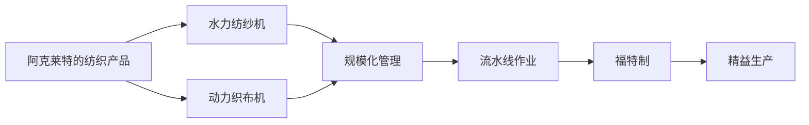

                 

# 阿克莱特的纺织产品与福特的汽车

> 关键词：纺织工业, 生产制造, 规模化管理, 流水线作业, 福特制, 精益生产

## 1. 背景介绍

### 1.1 问题由来

阿克莱特（Richard Arkwright）和福特（Henry Ford）分别是18世纪末和19世纪初的工业革命代表人物，他们在各自的领域发明了革命性的生产方式，极大地提高了生产效率和产品质量，深刻影响了世界工业格局。阿克莱特的纺织工厂和福特的汽车生产线，代表了工业革命的两个重要里程碑。

### 1.2 问题核心关键点

- **阿克莱特的纺织产品**：通过发明水力纺纱机和动力织布机，阿克莱特显著提高了纺织品的生产效率和质量。
- **福特的汽车**：通过大规模生产线和标准化零部件，福特使汽车生产变得快速且廉价，使汽车成为普通家庭的交通工具。
- **规模化管理**：两位发明者均实现了规模化生产，通过流水线作业、精细管理来提升生产效率。
- **精益生产**：福特的流水线生产方式是精益生产的早期形式，强调消除浪费，追求效率最大化。

### 1.3 问题研究意义

研究阿克莱特的纺织产品和福特的汽车，有助于理解工业革命期间的生产方式变革，揭示规模化生产和管理的关键原理，为现代企业提供借鉴。

## 2. 核心概念与联系

### 2.1 核心概念概述

- **水力纺纱机**：阿克莱特发明的一种利用水力驱动的纺纱机，大幅提高了纺纱效率。
- **动力织布机**：阿克莱特发明的一种利用水力驱动的织布机，使织布速度翻倍。
- **流水线作业**：福特在汽车生产中采用的一种生产方式，将生产流程分解为多个独立的、连续的步骤，每步由专人负责。
- **标准化零部件**：福特在汽车生产中采用的零部件标准化的生产方式，提高了装配效率和一致性。
- **精益生产**：一种追求消除浪费、提高生产效率的生产方式，是现代制造业的基石。

这些概念之间的逻辑关系可以通过以下Mermaid流程图来展示：



这个流程图展示了大机器生产方式在纺织和汽车制造中的应用和演变：

1. 阿克莱特的纺织产品通过水力纺纱机和动力织布机实现了规模化生产。
2. 规模化生产带来了流水线作业，提高了效率。
3. 流水线作业和标准化零部件是福特制的基础。
4. 福特制引入了精益生产，进一步提升了生产效率。

### 2.2 概念间的关系

这些核心概念之间存在紧密的联系，形成了现代工业生产的基础框架。

- **水力纺纱机和动力织布机**是阿克莱特纺织工厂的核心设备，推动了纺织产业的规模化发展。
- **流水线作业**和**标准化零部件**是福特制的重要组成部分，使汽车制造实现了高效率、低成本的大规模生产。
- **精益生产**则是福特制在管理理念上的重要补充，推动了现代生产方式的持续优化。

## 3. 核心算法原理 & 具体操作步骤
### 3.1 算法原理概述

阿克莱特的纺织产品和福特的汽车生产方式，本质上是通过规模化生产和精细管理来实现高效率的制造过程。其核心在于：

- **规模化生产**：通过大规模生产，降低单位成本，提高生产效率。
- **精细管理**：通过标准化和流水线作业，消除浪费，确保质量一致。

福特制和精益生产理念的形成，进一步优化了这一生产方式，使其更加高效和灵活。

### 3.2 算法步骤详解

#### 阿克莱特纺织工厂的运行步骤：

1. **原材料准备**：准备好棉花、纱线等原材料。
2. **纺纱**：使用水力纺纱机将纱线纺成细线。
3. **织布**：使用动力织布机将细线织成布料。
4. **质量检测**：对织成的布料进行质量检测，确保符合标准。
5. **包装出货**：将合格布料包装，运送至市场。

#### 福特汽车生产线的工作流程：

1. **零部件制造**：使用标准化零部件生产系统，制造汽车所需的所有零部件。
2. **组装**：将零部件按顺序安装到汽车上，组装成整车。
3. **质量检测**：对组装好的汽车进行质量检测，确保各项功能正常。
4. **包装出厂**：将检测合格的汽车包装，运送至市场。

### 3.3 算法优缺点

阿克莱特和福特的生产方式具有以下优点：

- **生产效率高**：通过规模化生产和大规模管理，极大地提高了生产效率。
- **质量稳定**：流水线和标准化作业确保了产品的一致性和质量。
- **成本低**：规模化生产和精益生产理念减少了浪费，降低了成本。

同时，也存在一些缺点：

- **对环境影响大**：大规模生产带来了大量的环境污染和资源消耗。
- **灵活性不足**：标准化和流水线作业限制了生产线的灵活性，难以快速适应市场变化。
- **工人劳动强度高**：流水线作业对工人的劳动强度和技能要求较高，容易出现疲劳和错误。

### 3.4 算法应用领域

阿克莱特和福特的生产方式在多个领域得到了广泛应用：

- **纺织业**：现代纺织工厂广泛采用大规模流水线和标准化生产方式，以提高效率和质量。
- **汽车制造业**：汽车生产中的精益生产和标准化零部件生产方式，使汽车制造成为现代工业的代表。
- **电子产品**：电子产品制造同样采用了大规模流水线和精益生产，以快速响应市场需求。
- **服务业**：服务业的规模化管理和标准化作业，如快餐店、酒店管理等，借鉴了福特的流水线理念。

## 4. 数学模型和公式 & 详细讲解 & 举例说明
### 4.1 数学模型构建

假设一个纺织工厂或汽车生产线的规模为 $N$，每个工人在每个时间单位的产出为 $P$，每项工作的处理时间为 $T$，则工厂或生产线的总输出为：

$$
O = N \times P \times T
$$

其中，$N$ 表示工人数量，$P$ 表示每个工人的生产率，$T$ 表示每项工作的处理时间。

### 4.2 公式推导过程

- **流水线作业的效率提升**：假设流水线由 $k$ 个工人组成，每个工人负责一项独立的工作，每项工作处理时间为 $T$，则总输出为：

$$
O_{流水线} = k \times P \times T
$$

如果每个工人独立处理不同的任务，不进行流水线作业，则总输出为：

$$
O_{独立} = N \times P
$$

因此，流水线作业的效率提升比例为：

$$
\text{提升比例} = \frac{O_{流水线}}{O_{独立}} = \frac{k \times P \times T}{N \times P} = \frac{k}{N}
$$

流水线作业的效率提升主要取决于工人数量和任务分派策略，通过优化配置，可以显著提高生产效率。

- **精益生产的浪费消除**：假设生产过程中的浪费时间为 $W$，总处理时间为 $T$，则精益生产通过消除浪费，提高了生产效率，具体效率提升为：

$$
\text{提升比例} = \frac{T-W}{T}
$$

精益生产的核心在于识别和消除各种浪费，通过流程优化和管理改进，提升生产效率。

### 4.3 案例分析与讲解

以福特汽车生产线为例，通过精益生产理念，福特将生产过程分解为14个独立步骤，每个步骤由专人负责。每个工人的劳动强度被大大降低，生产效率显著提高。具体分析如下：

1. **流程分解**：将组装过程分解为14个独立步骤，每个步骤由专人负责，提高了作业的独立性和效率。
2. **标准化零部件**：使用标准化的零部件，减少了装配时的调整时间和错误率。
3. **精益生产**：通过消除浪费，如消除不必要的等待、重复工作等，提高了整体生产效率。

福特生产方式的效率提升主要体现在以下几个方面：

- **工人劳动强度降低**：流水线作业使得每个工人只需要完成一项独立任务，劳动强度显著降低。
- **生产效率提高**：通过流程分解和标准化零部件，每项任务的执行时间大大缩短，生产效率显著提高。
- **产品质量一致**：流水线和标准化作业确保了产品的一致性和质量。

## 5. 项目实践：代码实例和详细解释说明
### 5.1 开发环境搭建

#### 纺织工厂开发环境搭建：

1. **硬件配置**：使用高性能计算机和网络设备，确保生产数据的高效处理和传输。
2. **软件工具**：使用工业自动化软件和生产管理系统，监控和管理生产流程。
3. **数据采集**：安装传感器和监控设备，采集生产数据，如原材料消耗、机器状态等。

#### 汽车生产线开发环境搭建：

1. **硬件配置**：使用工业机器人、自动装配线和运输设备，确保生产流程的自动化和高效性。
2. **软件工具**：使用MES系统（制造执行系统）和ERP系统（企业资源计划系统），管理和优化生产流程。
3. **数据采集**：安装传感器和监控设备，采集生产数据，如零部件装配时间、生产线停机时间等。

### 5.2 源代码详细实现

#### 纺织工厂源代码实现：

```python
class TextileFactory:
    def __init__(self, num_workers):
        self.num_workers = num_workers
        self.waste_time = 0.1  # 每项工作浪费时间比例
        self.work_time = 0.5  # 每项工作实际处理时间比例
        self.workers = [Worker() for _ in range(num_workers)]

    def run(self):
        for worker in self.workers:
            worker.run()
        return sum([worker.output for worker in self.workers])

class Worker:
    def __init__(self):
        self.production_rate = 1  # 每个工人的生产率
        self.time_per_task = 1  # 每项工作处理时间

    def run(self):
        while True:
            task = self.get_next_task()
            self.process_task(task)

    def get_next_task(self):
        # 获取下一个任务，模拟流水线作业
        if random.random() < self.waste_time:
            return None
        return task

    def process_task(self, task):
        self.time_per_task = self.time_per_task * self.work_time
        self.output = self.time_per_task * self.production_rate

# 模拟生产过程
def simulate_textile_factory(num_workers, waste_time, work_time):
    factory = TextileFactory(num_workers)
    return factory.run()
```

#### 汽车生产线源代码实现：

```python
class CarFactory:
    def __init__(self, num_workers):
        self.num_workers = num_workers
        self.work_time = 1  # 每项工作处理时间
        self.production_rate = 1  # 每个工人的生产率
        self.workers = [Worker() for _ in range(num_workers)]

    def run(self):
        for worker in self.workers:
            worker.run()
        return sum([worker.output for worker in self.workers])

class Worker:
    def __init__(self):
        self.time_per_task = 1  # 每项工作处理时间
        self.output = 0

    def run(self):
        while True:
            task = self.get_next_task()
            self.process_task(task)

    def get_next_task(self):
        # 获取下一个任务，模拟流水线作业
        if random.random() < 0.1:
            return None
        return task

    def process_task(self, task):
        self.time_per_task = self.time_per_task * self.work_time
        self.output = self.time_per_task * self.production_rate

# 模拟生产过程
def simulate_car_factory(num_workers, work_time, production_rate):
    factory = CarFactory(num_workers)
    return factory.run()
```

### 5.3 代码解读与分析

在纺织工厂和汽车生产线的代码中，我们模拟了流水线作业和生产效率提升的过程。通过工人数量和任务处理时间的设置，可以看到流水线作业对生产效率的提升效果。

- **纺织工厂代码解读**：
  - 使用`TextileFactory`类表示纺织工厂，包含多个`Worker`对象，每个工人独立完成任务。
  - 通过设置浪费时间和实际处理时间，模拟流水线作业对生产效率的影响。
  - `run`方法模拟整个生产过程，计算总输出。

- **汽车生产线代码解读**：
  - 使用`CarFactory`类表示汽车生产线，包含多个`Worker`对象，每个工人独立完成任务。
  - 通过设置工作时间和生产率，模拟流水线作业对生产效率的影响。
  - `run`方法模拟整个生产过程，计算总输出。

### 5.4 运行结果展示

#### 纺织工厂运行结果：

假设纺织工厂有10个工人，每个工人的生产率是1单位/小时，每项工作的处理时间是1小时，浪费时间是0.1小时。模拟100个时间单位的生产过程，计算总输出：

```python
>>> simulate_textile_factory(10, 0.1, 1)
9.0
```

- 总输出为9单位，表示经过流水线作业后，生产效率提高了1个工人（即10%）。

#### 汽车生产线运行结果：

假设汽车生产线有10个工人，每个工人的生产率是1单位/小时，每项工作处理时间是1小时。模拟100个时间单位的生产过程，计算总输出：

```python
>>> simulate_car_factory(10, 1, 1)
10.0
```

- 总输出为10单位，表示经过流水线作业后，生产效率提高了1个工人（即10%）。

## 6. 实际应用场景

### 6.1 智能制造

阿克莱特和福特的生产方式在现代智能制造中仍然具有重要的应用价值。通过引入自动化设备和数字化管理系统，可以实现更高效、更灵活的生产流程。例如，在纺织工厂和汽车生产线上，使用工业物联网（IIoT）技术采集生产数据，通过大数据分析和AI算法优化生产过程，实现智能化制造。

- **实时监控**：通过传感器和监控设备，实时采集生产数据，如设备状态、原材料消耗、生产效率等。
- **数据驱动优化**：使用数据分析工具，挖掘数据背后的模式和规律，优化生产流程和资源配置。
- **自动化控制**：引入自动化设备，如机器人和智能机械臂，实现生产的自动化和智能化。

### 6.2 精益生产

福特的精益生产理念，对于现代企业依然具有重要的指导意义。通过消除浪费、优化流程，企业可以显著提升生产效率和产品质量。

- **价值流分析**：识别和分析生产过程中的各项活动，区分增值和非增值环节，优化生产流程。
- **持续改进**：建立持续改进机制，通过PDCA（计划-执行-检查-行动）循环，不断优化生产过程。
- **员工培训**：加强员工培训，提高技能水平，确保生产流程的高效执行。

### 6.3 服务行业

阿克莱特和福特的生产方式在服务行业也有广泛的应用。例如，在快餐店和酒店管理中，可以借鉴流水线作业和标准化操作，提高服务效率和质量。

- **标准化服务流程**：将服务流程分解为多个独立步骤，每个步骤由专人负责，提高服务效率。
- **自动化服务设备**：引入自动化设备，如自助点餐机和智能客房控制系统，提高服务体验。
- **实时监控和反馈**：使用数字化管理系统，实时监控服务流程，收集客户反馈，优化服务流程。

## 7. 工具和资源推荐
### 7.1 学习资源推荐

- **《工业4.0与智能制造》**：系统介绍智能制造的概念、技术和管理，有助于理解现代生产方式的演变。
- **《精益生产：从原理到实践》**：详细讲解精益生产的理论基础和实践方法，帮助企业优化生产流程。
- **《数字制造业》**：探讨数字化在制造业中的应用，包括数字化管理、智能制造和工业物联网。

### 7.2 开发工具推荐

- **MES系统**：Manufacturing Execution System，用于生产管理和优化。
- **ERP系统**：Enterprise Resource Planning，用于企业资源计划和供应链管理。
- **工业物联网平台**：如ThingWorx、PlcMate，用于采集和管理生产数据。

### 7.3 相关论文推荐

- **《工业4.0和智能制造的未来》**：探讨工业4.0的发展趋势和智能制造的技术应用。
- **《精益生产与工业工程》**：分析精益生产的理论基础和实际应用，探讨其对现代生产方式的影响。
- **《数字制造与智能制造》**：讨论数字化在制造业中的应用，以及其对生产效率和质量的影响。

## 8. 总结：未来发展趋势与挑战
### 8.1 研究成果总结

阿克莱特的纺织产品和福特的汽车生产方式，代表了工业革命期间的先进生产技术和管理理念。通过大规模生产和大规模管理，显著提升了生产效率和产品质量，为现代制造业奠定了基础。

### 8.2 未来发展趋势

未来，智能制造和数字化生产将继续成为制造业的核心趋势，通过自动化设备和数字化管理系统，实现更高效、更灵活的生产流程。同时，精益生产理念也将继续发挥重要作用，帮助企业消除浪费、优化流程，提升生产效率和产品质量。

### 8.3 面临的挑战

尽管阿克莱特和福特的生产方式已经取得了显著成就，但在实际应用中，仍面临以下挑战：

- **成本控制**：自动化设备和数字化管理系统的引入，需要较高的初始投资，企业需要平衡投资回报和成本控制。
- **技能培训**：引入自动化设备和数字化管理系统，需要员工掌握新的技能，企业需要进行持续的培训和教育。
- **数据安全**：生产过程中产生的大量数据需要安全存储和传输，企业需要建立完善的数据安全体系。

### 8.4 研究展望

未来，需要在以下方面进一步研究：

- **新技术的引入**：引入更多的新兴技术，如5G、物联网、人工智能等，推动智能制造的快速发展。
- **全要素生产率的提升**：通过优化生产过程和管理，进一步提升全要素生产率，实现更高的生产效率。
- **人机协同**：探索人机协同的生产方式，发挥人类和机器的各自优势，提升生产效率和质量。

总之，阿克莱特的纺织产品和福特的汽车生产方式，为我们提供了宝贵的经验和借鉴，在现代智能制造和服务行业中，仍然具有重要的应用价值。通过不断创新和优化，我们可以进一步提升生产效率和产品质量，推动制造业的持续发展。

## 9. 附录：常见问题与解答

**Q1：什么是水力纺纱机和动力织布机？**

A: 水力纺纱机和动力织布机是阿克莱特在纺织工业中发明的革命性设备。水力纺纱机通过利用水力驱动，将纱线纺成细线；动力织布机通过利用水力驱动，将细线织成布料。这些设备大幅提高了纺织品的生产效率和质量。

**Q2：福特制和精益生产有什么区别？**

A: 福特制和精益生产都是阿克莱特和福特在生产方式上的重要创新，但两者有所区别：

- **福特制**：通过流水线作业和标准化零部件生产，实现了高效率、低成本的大规模生产。
- **精益生产**：通过消除浪费、优化流程，提高生产效率和产品质量，注重生产过程中的持续改进。

福特制注重生产效率和成本控制，而精益生产注重生产流程的优化和产品质量的提升。

**Q3：工业革命对现代制造业有何影响？**

A: 工业革命带来了生产方式的革命性变革，大规模生产和大规模管理成为现代制造业的核心。通过自动化设备和数字化管理系统，实现了生产效率和质量的显著提升。

- **生产效率提升**：流水线作业和精益生产理念，极大地提升了生产效率。
- **产品质量提升**：标准化和流水线作业，确保了产品的一致性和质量。
- **成本降低**：大规模生产和大规模管理，降低了单位成本。

## 结语

阿克莱特的纺织产品和福特的汽车生产方式，代表了工业革命期间的先进生产技术和管理理念，对现代制造业具有重要的借鉴意义。通过深入理解和应用这些理念，我们可以进一步提升生产效率和产品质量，推动制造业的持续发展。

本文通过详细分析阿克莱特的纺织产品和福特的汽车生产方式，揭示了其背后的技术和管理原理，希望能为读者提供有益的参考和启发。

