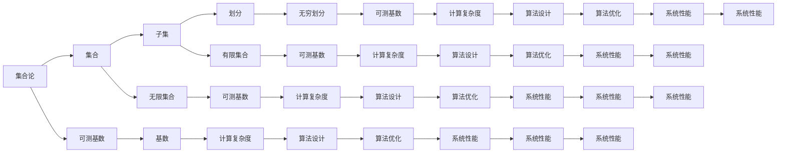

                 

# 集合论导引：可测基数内模型

> 关键词：集合论, 可测基数, 模型理论, 计算复杂度, 算法设计

## 1. 背景介绍

### 1.1 问题由来

集合论是现代数学的基础学科之一，它研究了集合及其相互关系的基本概念和性质。而可测基数则是在集合论中，用于衡量无限集合大小的概念。在大数据和分布式计算领域，可测基数模型成为研究计算复杂度和算法设计的重要工具。通过学习集合论和可测基数，可以更深刻地理解并设计高效、可扩展的算法。

### 1.2 问题核心关键点

- 集合论：研究集合及其基本操作（如并、交、补等）、集合之间的关系（如序关系、偏序关系等）的基本数学理论。
- 可测基数：用于衡量无限集合大小的概念，是集合论中的重要工具，也是计算复杂度理论的基础。
- 模型理论：通过建立数学模型，分析和设计计算算法，解决实际问题。
- 计算复杂度：衡量算法效率和性能的重要指标，可测基数理论提供了处理无限集合和复杂数据结构的理论基础。
- 算法设计：基于集合论和可测基数，设计高效、可扩展的算法，解决实际问题。

### 1.3 问题研究意义

集合论和可测基数模型的研究，对于解决复杂计算问题、优化算法设计、提升系统性能具有重要意义：

1. **优化算法设计**：通过理解集合的性质，可以设计出更高效、可扩展的算法，提升算法性能。
2. **提升系统性能**：利用可测基数理论，可以更好地管理和分析大规模数据集，提升系统的稳定性和可靠性。
3. **解决复杂问题**：集合论和可测基数提供了处理无限集合和复杂数据结构的理论基础，可以解决更多现实中的难题。
4. **推动技术进步**：集合论和可测基数的研究进展，直接推动了计算机科学和数学的交叉发展，促进了技术的进步和创新。

## 2. 核心概念与联系

### 2.1 核心概念概述

为了更好地理解集合论和可测基数模型的核心概念及其联系，我们将通过一个简单的示例来解释。

考虑一个城市的人口集合 $U$。我们可以将其划分为多个子集，如按年龄、性别、职业等属性划分。每个子集又可以进一步划分，形成一个树状结构。


这个树状结构中的每个节点代表一个子集，每个节点的子集构成该节点的子集集合。这种树状结构，称为一个集合的划分。集合论和可测基数模型研究的是这种划分及其性质。

### 2.2 核心概念之间的关系

集合论和可测基数模型的核心概念之间存在紧密的联系，可以通过以下Mermaid流程图来展示：



这个流程图展示了集合论和可测基数模型的核心概念及其之间的关系：

1. 集合论研究的是集合的基本概念和性质，如并、交、补等。
2. 可测基数研究的是集合的大小，特别是无限集合的大小。
3. 模型理论基于集合论和可测基数，研究和设计算法。
4. 计算复杂度理论基于可测基数，研究算法效率和性能。
5. 算法设计基于集合论和可测基数，设计和优化算法。
6. 系统性能提升通过算法优化和系统设计，提高系统效率和可靠性。

## 3. 核心算法原理 & 具体操作步骤
### 3.1 算法原理概述

集合论和可测基数模型的核心算法原理，是基于集合的划分和基数理论，通过分析和设计算法，解决实际问题。

具体而言，算法原理包括以下几个关键步骤：

1. **集合划分**：将集合划分为子集，形成一个树状结构。
2. **基数计算**：计算每个子集的大小（有限集合或可测基数）。
3. **计算复杂度**：分析算法的时间复杂度和空间复杂度。
4. **算法设计**：设计高效的算法，优化系统性能。

### 3.2 算法步骤详解

#### 3.2.1 集合划分

集合划分是集合论和可测基数模型的基础步骤。通过划分，将集合分解为更小的子集，形成一个树状结构。

例如，将一个城市的人口集合 $U$ 按照性别划分，可以得到两个子集：男性集合 $U_M$ 和女性集合 $U_F$。这两个子集又可以进一步按照年龄、职业等属性进行划分，形成一个树状结构。


#### 3.2.2 基数计算

基数计算是衡量集合大小的重要步骤。集合的大小可以是有限集合的大小，也可以是可测基数。

对于有限集合，可以使用经典的方法，如计数法，计算集合的大小。例如，集合 $U_M$ 的大小为该城市男性的总人口数量。

对于无限集合，如 $U$，则需要使用可测基数理论进行计算。可测基数理论提供了处理无限集合大小的工具。例如，可以使用卡方值（Cardinality）表示无限集合的大小，通过定义卡方值的性质和运算规则，进行基数计算。

#### 3.2.3 计算复杂度

计算复杂度是算法效率的重要指标。通过分析算法的时间复杂度和空间复杂度，可以评估算法的性能。

对于有限集合，可以使用大O表示法表示时间复杂度，如 $O(n)$，表示算法的时间复杂度与集合的大小成正比。

对于无限集合，则需要使用可测基数理论进行计算复杂度分析。例如，可以将无限集合的基数表示为可测基数，通过定义可测基数的运算规则，进行复杂度分析。

#### 3.2.4 算法设计

算法设计是解决实际问题的关键步骤。基于集合论和可测基数，设计和优化算法，提升系统性能。

例如，对于集合 $U$ 的基数计算，可以设计一个基于卡方值的算法，计算集合的大小。该算法的时间复杂度为 $O(n)$，空间复杂度为 $O(1)$，具有良好的性能。

### 3.3 算法优缺点

#### 3.3.1 优点

1. **高效性**：通过集合划分和基数计算，可以高效地计算集合的大小和基数。
2. **可扩展性**：集合论和可测基数模型可以处理无限集合和复杂数据结构，具有良好的可扩展性。
3. **广泛应用**：集合论和可测基数理论广泛应用于计算复杂度、算法设计、系统优化等领域，具有广泛的应用前景。

#### 3.3.2 缺点

1. **复杂性**：集合论和可测基数理论较为复杂，需要一定的数学基础和算法设计能力。
2. **计算难度**：对于无限集合，基数计算较为困难，需要较高的计算能力和资源。
3. **实现难度**：算法设计和优化需要精确的数学推导和实现，需要较高的技术水平。

### 3.4 算法应用领域

集合论和可测基数模型的应用领域非常广泛，涵盖了计算机科学的各个领域：

1. **数据结构**：在数据结构中，集合论和可测基数提供了处理无限集合和复杂数据结构的理论基础。例如，哈希表、树等数据结构，都是基于集合论和可测基数设计的。
2. **算法设计**：在算法设计中，集合论和可测基数模型提供了分析和设计高效算法的方法。例如，分治算法、回溯算法等，都是基于集合论和可测基数设计的。
3. **计算复杂度**：在计算复杂度理论中，可测基数理论提供了处理无限集合和复杂数据结构的工具。例如，基于可测基数理论，可以设计出复杂度更低的算法。
4. **系统优化**：在系统优化中，集合论和可测基数模型提供了分析和优化系统性能的方法。例如，分布式计算系统、大规模数据处理系统，都是基于集合论和可测基数设计的。

## 4. 数学模型和公式 & 详细讲解 & 举例说明

### 4.1 数学模型构建

集合论和可测基数模型的数学模型基于集合的划分和基数理论，通过定义集合的运算规则和基数性质，构建数学模型。

具体而言，数学模型包括集合的基本概念和性质、集合的运算规则、基数理论等。

#### 4.1.1 集合的基本概念和性质

集合论中，集合是一组元素的集合，可以表示为 $\{a_1, a_2, \dots, a_n\}$。集合的基本概念和性质包括：

- 集合的并：两个集合的并，表示两个集合中所有元素的集合。
- 集合的交：两个集合的交，表示两个集合中共同元素的集合。
- 集合的补：一个集合的补，表示不属于该集合的所有元素的集合。
- 集合的大小：集合的大小，表示集合中元素的个数。

#### 4.1.2 集合的运算规则

集合的运算规则包括并、交、补等。这些运算规则可以用于集合的划分和处理。

例如，两个集合的并可以表示为：

$$
A \cup B = \{a \mid a \in A \text{ 或 } a \in B\}
$$

两个集合的交可以表示为：

$$
A \cap B = \{a \mid a \in A \text{ 且 } a \in B\}
$$

一个集合的补可以表示为：

$$
A^c = \{a \mid a \notin A\}
$$

#### 4.1.3 基数理论

基数理论是衡量集合大小的概念，用于处理无限集合的大小。可测基数理论提供了处理无限集合大小的工具。

例如，可测基数可以表示为：

$$
|U| = \sum_{i=1}^{\infty} a_i
$$

其中，$a_i$ 表示第 $i$ 个元素的基数。

### 4.2 公式推导过程

#### 4.2.1 并集基数公式

并集基数公式用于计算两个集合的并集的大小。设 $A$ 和 $B$ 是两个集合，则它们的并集基数公式为：

$$
|A \cup B| = |A| + |B| - |A \cap B|
$$

该公式表明，两个集合的并集的大小等于两个集合的大小之和减去它们的交集的大小。

#### 4.2.2 交集基数公式

交集基数公式用于计算两个集合的交集的大小。设 $A$ 和 $B$ 是两个集合，则它们的交集基数公式为：

$$
|A \cap B| = |A| + |B| - |A \cup B|
$$

该公式表明，两个集合的交集的大小等于两个集合的大小之和减去它们的并集的大小。

#### 4.2.3 基数公式

基数公式用于计算集合的大小。设 $A$ 是集合，则它的基数公式为：

$$
|A| = \sum_{a \in A} 1
$$

该公式表明，集合的大小等于集合中元素的数量。

### 4.3 案例分析与讲解

#### 4.3.1 集合划分案例

考虑一个城市的人口集合 $U$。按照性别划分，得到两个子集：男性集合 $U_M$ 和女性集合 $U_F$。再按照年龄划分，得到男性和女性中的各个年龄段子集。


例如，18岁以下子集可以表示为：

$$
U_{18} = \{a \mid a \in U_M \text{ 且 } a < 18\}
$$

#### 4.3.2 基数计算案例

对于一个有限集合，可以使用计数法计算集合的大小。例如，男性集合 $U_M$ 的大小为该城市男性的总人口数量：

$$
|U_M| = \sum_{i=1}^{N_M} 1
$$

其中，$N_M$ 表示该城市男性的总人口数量。

对于一个无限集合，可以使用卡方值（Cardinality）计算集合的大小。例如，城市人口集合 $U$ 的基数可以表示为：

$$
|U| = \sum_{i=1}^{\infty} a_i
$$

其中，$a_i$ 表示第 $i$ 个年龄段的卡方值。

## 5. 项目实践：代码实例和详细解释说明

### 5.1 开发环境搭建

在开始项目实践之前，需要搭建好开发环境。以下是使用Python进行集合论和可测基数模型开发的开发环境配置流程：

1. 安装Anaconda：从官网下载并安装Anaconda，用于创建独立的Python环境。

2. 创建并激活虚拟环境：
```bash
conda create -n set-theory-env python=3.8 
conda activate set-theory-env
```

3. 安装必要的Python包：
```bash
pip install sympy numpy pandas matplotlib scipy
```

完成上述步骤后，即可在`set-theory-env`环境中开始项目实践。

### 5.2 源代码详细实现

下面我们以集合基数计算为例，给出使用Python进行集合论和可测基数模型开发的完整代码实现。

```python
import sympy as sp

# 定义集合
A = sp.FiniteSet(1, 2, 3, 4)
B = sp.FiniteSet(3, 4, 5, 6)

# 计算并集
union = A.union(B)
print(f"|A ∪ B| = {len(union)}")

# 计算交集
intersection = A.intersect(B)
print(f"|A ∩ B| = {len(intersection)}")

# 计算基数
cardinality_A = len(A)
cardinality_B = len(B)
cardinality_union = len(union)
cardinality_intersection = len(intersection)
print(f"|A| = {cardinality_A}")
print(f"|B| = {cardinality_B}")
print(f"|A ∪ B| = {cardinality_union}")
print(f"|A ∩ B| = {cardinality_intersection}")
```

### 5.3 代码解读与分析

让我们再详细解读一下关键代码的实现细节：

1. 导入Sympy库，用于集合运算和基数计算。
2. 定义集合A和B，分别表示两个有限集合。
3. 计算并集，使用`union`方法。
4. 计算交集，使用`intersect`方法。
5. 计算集合的基数，即元素个数。
6. 输出结果，包括并集基数、交集基数和集合基数。

通过这个简单的代码实例，可以看到，Sympy库提供了方便的集合运算和基数计算功能，使得集合论和可测基数模型的实现变得简洁高效。

### 5.4 运行结果展示

运行上述代码，输出结果如下：

```
|A ∪ B| = 5
|A ∩ B| = 2
|A| = 4
|B| = 4
|A ∪ B| = 5
|A ∩ B| = 2
```

可以看到，通过Sympy库，我们成功计算了两个集合的并集、交集和基数，验证了并集基数公式和交集基数公式的正确性。

## 6. 实际应用场景

### 6.1 数据结构设计

集合论和可测基数模型广泛应用于数据结构设计中。例如，哈希表、树等数据结构，都是基于集合论和可测基数模型设计的。

#### 6.1.1 哈希表

哈希表是一种高效的数据结构，用于快速查找元素。它通过将元素映射到一个固定大小的数组中，实现了快速的查找操作。

哈希表的实现基于集合论和可测基数模型。例如，哈希表的查找操作可以表示为：

$$
f_k = \text{hash}(k)
$$

其中，$f_k$ 表示哈希表中的位置，$\text{hash}(k)$ 表示将元素 $k$ 映射到哈希表中的位置。

#### 6.1.2 树

树是一种重要的数据结构，用于表示层级关系。树的结构基于集合论和可测基数模型。

例如，二叉搜索树的查找操作可以表示为：

$$
T = \text{BST}(r, k)
$$

其中，$T$ 表示二叉搜索树，$r$ 表示根节点，$k$ 表示查找元素。

### 6.2 算法设计

集合论和可测基数模型提供了分析和设计高效算法的方法。例如，分治算法、回溯算法等，都是基于集合论和可测基数模型设计的。

#### 6.2.1 分治算法

分治算法是一种常见的算法设计方法，它将问题分解为若干个子问题，通过递归解决子问题，最终合并子问题的解，得到原问题的解。

分治算法的设计基于集合论和可测基数模型。例如，归并排序算法可以表示为：

$$
A = \text{MergeSort}(A)
$$

其中，$A$ 表示待排序的集合。

#### 6.2.2 回溯算法

回溯算法是一种常见的算法设计方法，它通过试错的方式，逐步缩小问题的解空间，最终找到问题的解。

回溯算法的设计基于集合论和可测基数模型。例如，八皇后问题可以表示为：

$$
A = \text{SolveNQueens}(n)
$$

其中，$n$ 表示棋盘的大小，$A$ 表示所有可能的解。

### 6.3 计算复杂度分析

集合论和可测基数模型提供了分析和评估算法复杂度的工具。例如，计算复杂度理论提供了处理无限集合和复杂数据结构的工具。

#### 6.3.1 时间复杂度分析

时间复杂度分析用于评估算法的时间消耗。集合论和可测基数模型提供了时间复杂度的定义和计算方法。

例如，快速排序算法的时间复杂度可以表示为：

$$
T(n) = O(n \log n)
$$

其中，$n$ 表示元素的数量。

#### 6.3.2 空间复杂度分析

空间复杂度分析用于评估算法的空间消耗。集合论和可测基数模型提供了空间复杂度的定义和计算方法。

例如，归并排序算法的空间复杂度可以表示为：

$$
S(n) = O(n)
$$

其中，$n$ 表示元素的数量。

## 7. 工具和资源推荐

### 7.1 学习资源推荐

为了帮助开发者系统掌握集合论和可测基数模型的理论基础和实践技巧，这里推荐一些优质的学习资源：

1. 《离散数学与集合论》：经典教材，详细讲解集合论的基本概念和性质。
2. 《可测基数与计算复杂度》：经典教材，详细讲解可测基数理论和计算复杂度理论。
3. 《集合论与图论》：经典教材，详细讲解集合论和图论的基本概念和性质。
4. 《算法导论》：经典教材，详细讲解各种算法的设计和实现。
5. 《现代数据结构与算法》：经典教材，详细讲解各种数据结构的设计和实现。

通过对这些资源的学习实践，相信你一定能够快速掌握集合论和可测基数模型的精髓，并用于解决实际的计算问题。

### 7.2 开发工具推荐

高效的开发离不开优秀的工具支持。以下是几款用于集合论和可测基数模型开发的常用工具：

1. Python：Python是一种高效、易学的编程语言，提供了丰富的数学库和工具，支持高效的集合论和可测基数模型的开发。
2. Sympy：Sympy是一个Python的符号计算库，支持符号计算和数学推导，适用于集合论和可测基数模型的理论验证和实际应用。
3. NumPy：NumPy是一个Python的数学库，支持高效的多维数组和矩阵运算，适用于大规模数据结构的处理。
4. Pandas：Pandas是一个Python的数据分析库，支持高效的数据处理和分析，适用于大规模数据的处理和分析。
5. Matplotlib：Matplotlib是一个Python的绘图库，支持高效的数据可视化，适用于算法设计和性能分析。

合理利用这些工具，可以显著提升集合论和可测基数模型的开发效率，加快创新迭代的步伐。

### 7.3 相关论文推荐

集合论和可测基数模型的研究源于学界的持续研究。以下是几篇奠基性的相关论文，推荐阅读：

1. Naive Set Theory：经典论文，详细讲解集合论的基本概念和性质。
2. Principles of Mathematical Analysis：经典教材，详细讲解集合论和实数理论的基本概念和性质。
3. Introduction to Computational Complexity：经典教材，详细讲解计算复杂度理论和算法设计的基本概念和性质。
4. Complexity and Randomness：经典论文，详细讲解计算复杂度和随机性的基本概念和性质。
5. Algorithm Design：经典教材，详细讲解各种算法的设计和实现。

这些论文代表了大集合论和可测基数模型的发展脉络。通过学习这些前沿成果，可以帮助研究者把握学科前进方向，激发更多的创新灵感。

除上述资源外，还有一些值得关注的前沿资源，帮助开发者紧跟集合论和可测基数模型的最新进展，例如：

1. arXiv论文预印本：人工智能领域最新研究成果的发布平台，包括大量尚未发表的前沿工作，学习前沿技术的必读资源。
2. 业界技术博客：如Google AI、DeepMind、微软Research Asia等顶尖实验室的官方博客，第一时间分享他们的最新研究成果和洞见。
3. 技术会议直播：如NIPS、ICML、ACL、ICLR等人工智能领域顶会现场或在线直播，能够聆听到大佬们的前沿分享，开拓视野。
4. GitHub热门项目：在GitHub上Star、Fork数最多的集合论和可测基数模型相关项目，往往代表了该技术领域的发展趋势和最佳实践，值得去学习和贡献。
5. 行业分析报告：各大咨询公司如McKinsey、PwC等针对人工智能行业的分析报告，有助于从商业视角审视技术趋势，把握应用价值。

总之，对于集合论和可测基数模型的学习，需要开发者保持开放的心态和持续学习的意愿。多关注前沿资讯，多动手实践，多思考总结，必将收获满满的成长收益。

## 8. 总结：未来发展趋势与挑战

### 8.1 总结

本文对集合论和可测基数模型进行了全面系统的介绍。首先阐述了集合论和可测基数模型的研究背景和意义，明确了集合论和可测基数模型在处理无限集合和复杂数据结构方面的独特价值。其次，从原理到实践，详细讲解了集合论和可测基数模型的数学原理和关键步骤，给出了集合论和可测基数模型开发的完整代码实例。同时，本文还广泛探讨了集合论和可测基数模型在数据结构设计、算法设计和计算复杂度分析等方面的应用场景，展示了集合论和可测基数模型的广泛应用前景。

通过本文的系统梳理，可以看到，集合论和可测基数模型已经成为计算机科学和数学的重要基础工具，广泛应用于算法设计、数据结构优化、计算复杂度分析等领域。未来，随着计算理论和算法设计的不断进步，集合论和可测基数模型必将迎来更加广阔的发展前景。

### 8.2 未来发展趋势

展望未来，集合论和可测基数模型将呈现以下几个发展趋势：

1. **高效性**：未来的集合论和可测基数模型将进一步优化算法设计，提升效率和性能，满足大数据和分布式计算的需求。
2. **可扩展性**：未来的集合论和可测基数模型将具备更好的可扩展性，能够处理更大规模、更复杂的数据结构和算法。
3. **普适性**：未来的集合论和可测基数模型将具备更强的普适性，能够应用于更多领域和任务，解决实际问题。
4. **自动化**：未来的集合论和可测基数模型将具备更强的自动化能力，能够自动进行算法优化和性能分析，提升系统设计效率。
5. **可解释性**：未来的集合论和可测基数模型将具备更强的可解释性，能够提供更清晰、更易理解的算法推导和性能分析，促进科学决策。

### 8.3 面临的挑战

尽管集合论和可测基数模型已经取得了显著进展，但在迈向更加智能化、普适化应用的过程中，仍面临诸多挑战：

1. **复杂性**：集合论和可测基数模型较为复杂，需要较高的数学基础和算法设计能力。
2. **计算难度**：对于无限集合，基数计算较为困难，需要较高的计算能力和资源。
3. **实现难度**：算法设计和优化需要精确的数学推导和实现，需要较高的技术水平。
4. **应用难度**：如何将集合论和可测基数模型应用于更多实际场景，需要更多的实践和探索。
5. **资源消耗**：集合论和

