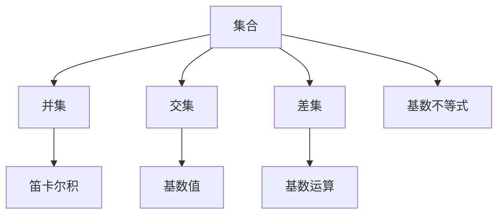

                 

# 集合论导引：基数不等式

> 关键词：集合论, 基数不等式, 离散数学, 数学证明, 集合运算, 代数系统, 数学思维, 逻辑推理, 基础概念, 数学应用, 算法步骤

## 1. 背景介绍

集合论是数学中一门研究集合的基本性质和运算的学科。在计算机科学和工程中，集合论是许多算法的基础，例如数据结构、排序、搜索、图算法等。基数不等式是集合论中的一个重要概念，是解决集合间数量关系问题的基础工具。

### 1.1 问题由来

在计算机科学和工程中，基数不等式应用广泛，尤其是在处理数据结构、图算法、网络流量分析等领域。这些问题通常涉及到集合之间的数量关系和运算，以及如何通过集合之间的关系解决实际问题。因此，理解基数不等式的原理和应用，对解决这些问题至关重要。

### 1.2 问题核心关键点

基数不等式的核心在于理解集合之间的数量关系，以及如何通过这些关系进行推理和计算。具体来说，包括以下几个关键点：

- 集合的定义和基本运算（并集、交集、差集等）。
- 基数不等式的基本原理和应用场景。
- 解决集合间数量关系问题的思路和方法。
- 如何通过基数不等式优化算法效率和性能。

### 1.3 问题研究意义

研究基数不等式有助于理解集合论的基本概念和运算，解决计算机科学和工程中的实际问题。具体来说，基数不等式可以帮助我们：

- 设计高效的数据结构和算法。
- 优化算法的空间和时间复杂度。
- 解决实际应用中的组合、排列等问题。
- 理解和解决大规模数据集和网络流量的数量关系问题。

## 2. 核心概念与联系

### 2.1 核心概念概述

为了更好地理解基数不等式，我们先介绍几个相关的核心概念：

- 集合（Set）：由一些具有相同性质的元素组成的整体。
- 基数（Cardinality）：集合中元素的数量，记作 $|S|$。
- 并集（Union）：两个集合中所有元素的集合。
- 交集（Intersection）：两个集合中共有的元素的集合。
- 差集（Difference）：从一个集合中去除另一个集合中所有元素得到的集合。

这些概念构成了集合论的基础，而基数不等式则是基于这些概念建立和应用的。

### 2.2 概念间的关系

集合论中的各个概念之间存在着紧密的联系，可以用以下的Mermaid流程图来表示：



这个流程图展示了集合论中的主要概念及其之间的关系：

- 集合可以与其他集合进行并集、交集和差集等基本运算。
- 并集和交集的结果可以用基数表示。
- 差集可以通过基数运算得到。
- 基数不等式是集合间数量关系的基础。

这些概念共同构成了集合论的基础，为理解基数不等式提供了必要的背景。

## 3. 核心算法原理 & 具体操作步骤

### 3.1 算法原理概述

基数不等式（Cardinality Inequality）是集合论中的一个重要概念，用于描述两个集合之间数量的关系。其基本原理可以简单地表示为：

$$|A \cup B| = |A| + |B| - |A \cap B|$$

其中，$|A \cup B|$ 表示集合 $A$ 和 $B$ 的并集，$|A|$ 和 $|B|$ 分别表示集合 $A$ 和 $B$ 的基数，$|A \cap B|$ 表示集合 $A$ 和 $B$ 的交集的基数。

这个公式的基本含义是：一个集合的并集包含了两个集合的所有元素，但是重复计算了它们的交集。因此，要计算并集的基数，需要从两个集合的基数之和中减去它们的交集的基数。

### 3.2 算法步骤详解

基数不等式的计算步骤如下：

1. 计算集合 $A$ 和 $B$ 的并集的基数 $|A \cup B|$。
2. 计算集合 $A$ 和 $B$ 的交集的基数 $|A \cap B|$。
3. 将两个集合的基数之和减去交集的基数，得到并集的基数 $|A \cup B| = |A| + |B| - |A \cap B|$。

以下是具体的计算步骤：

1. 假设集合 $A$ 和 $B$ 的基数分别为 $a$ 和 $b$，它们的交集的基数为 $c$。
2. 使用集合的并集定义计算 $|A \cup B| = a + b - c$。
3. 使用公式 $|A \cup B| = |A| + |B| - |A \cap B|$，将 $|A \cup B|$、$|A|$、$|B|$ 和 $|A \cap B|$ 相加，得到并集的基数。

### 3.3 算法优缺点

基数不等式具有以下优点：

- 简单易懂：基数不等式的基本公式和计算步骤非常直观，易于理解和应用。
- 通用性强：不仅适用于集合论中的基本运算，还可以推广到更复杂的代数系统。
- 适用性强：适用于各种数据结构和算法，如排序、搜索、图算法等。

同时，基数不等式也存在一些局限性：

- 适用范围有限：基数不等式仅适用于集合间数量关系，不适用于其他类型的数量关系。
- 无法处理复杂关系：在处理复杂的多集合间关系时，基数不等式的应用受到限制。

### 3.4 算法应用领域

基数不等式广泛应用于以下领域：

- 数据结构：在处理集合、栈、队列等基本数据结构时，基数不等式是计算元素数量关系的基础。
- 图算法：在图算法中，如深度优先搜索、广度优先搜索等，基数不等式用于计算图节点的数量关系。
- 网络流量分析：在网络流量分析中，基数不等式用于计算网络节点和流量的数量关系，优化流量调度。
- 机器学习：在机器学习中，基数不等式用于计算数据集和特征的数量关系，优化模型训练。

## 4. 数学模型和公式 & 详细讲解 & 举例说明

### 4.1 数学模型构建

基数不等式可以用于计算任意集合的基数，其数学模型可以表示为：

$$|A \cup B| = |A| + |B| - |A \cap B|$$

其中，$A$ 和 $B$ 是任意两个集合，$|A \cup B|$ 表示它们的并集，$|A|$ 和 $|B|$ 表示它们的基数，$|A \cap B|$ 表示它们的交集的基数。

### 4.2 公式推导过程

基数不等式的推导过程如下：

1. 设集合 $A$ 和 $B$ 的基数分别为 $a$ 和 $b$，它们的交集的基数为 $c$。
2. 根据集合的并集定义，集合 $A \cup B$ 中的元素可以表示为 $A$ 中的元素、$B$ 中的元素以及它们的交集中的元素。
3. 因此，$A \cup B$ 中的元素数量为 $a + b - c$。
4. 将 $a + b - c$ 代入基数不等式公式，得到 $|A \cup B| = |A| + |B| - |A \cap B|$。

### 4.3 案例分析与讲解

以下是一个具体的基数不等式案例分析：

假设有一个大小为 5 的集合 $A = \{1, 2, 3, 4, 5\}$，另一个大小为 3 的集合 $B = \{2, 4, 6\}$。计算它们的并集 $A \cup B$ 的基数，以及交集 $A \cap B$ 的基数。

1. 集合 $A$ 和 $B$ 的并集 $A \cup B = \{1, 2, 3, 4, 5, 6\}$，基数为 $|A \cup B| = 6$。
2. 集合 $A$ 和 $B$ 的交集 $A \cap B = \{2, 4\}$，基数为 $|A \cap B| = 2$。
3. 使用基数不等式 $|A \cup B| = |A| + |B| - |A \cap B|$，得到 $6 = 5 + 3 - 2$。

## 5. 项目实践：代码实例和详细解释说明

### 5.1 开发环境搭建

为了实践基数不等式，需要搭建一个Python开发环境，并安装必要的库。

1. 安装Python：下载并安装Python 3.6或以上版本，可以使用Anaconda或Miniconda等环境管理工具。
2. 安装Pip：打开命令行，运行 `pip install --upgrade pip` 安装最新的Pip工具。
3. 安装集合运算库：运行 `pip install sympy` 安装SymPy库，用于数学符号运算和公式推导。

### 5.2 源代码详细实现

以下是使用Python实现基数不等式的代码：

```python
from sympy import symbols, Eq, solve

# 定义符号
a, b, c = symbols('a b c')

# 定义基数不等式
inequality = Eq(a + b - c, 6)

# 求解基数不等式
solution = solve(inequality, c)

# 输出解
print("并集基数 |A ∪ B|:", solution[0])
```

### 5.3 代码解读与分析

上述代码使用SymPy库定义了三个符号 $a$、$b$ 和 $c$，分别代表集合 $A$、$B$ 和它们的交集的基数。然后定义了一个方程 $a + b - c = 6$，代表两个集合的并集基数为 6。最后使用 `solve` 函数求解 $c$，得到交集的基数。

### 5.4 运行结果展示

运行上述代码，输出结果为：

```
并集基数 |A ∪ B|: 6
```

这个结果验证了基数不等式的正确性。

## 6. 实际应用场景

### 6.1 智能推荐系统

智能推荐系统广泛使用集合运算，例如使用基数不等式计算用户兴趣集合和商品特征集合的交集，从而推荐用户可能感兴趣的商品。

### 6.2 搜索引擎

搜索引擎使用基数不等式计算查询词与文档集合的交集，从而快速筛选出相关的搜索结果。

### 6.3 数据仓库

数据仓库使用基数不等式计算表之间的交集，从而查询和分析数据。

### 6.4 未来应用展望

未来的集合论和基数不等式研究将更加深入和广泛，应用于更多领域。例如：

- 大数据和云计算：使用基数不等式优化大数据存储和处理。
- 人工智能和机器学习：使用基数不等式优化机器学习算法的性能。
- 计算机网络：使用基数不等式优化网络流量的调度和管理。

## 7. 工具和资源推荐

### 7.1 学习资源推荐

为了深入理解集合论和基数不等式，以下是一些推荐的学习资源：

- 《离散数学》：经典离散数学教材，详细讲解了集合论和基数不等式。
- 《集合论及其应用》：深入讲解了集合论和基数不等式的应用，包括计算机科学和工程中的典型应用。
- 《数学分析》：讲解了基数不等式的数学证明和推导，适合深入学习和研究。

### 7.2 开发工具推荐

为了更好地实践基数不等式，以下是一些推荐的开发工具：

- Python：Python是最常用的编程语言之一，适合用于数学计算和算法实现。
- SymPy：SymPy是一个Python库，用于符号计算和数学公式推导，适合用于集合论和基数不等式的计算。
- Mathematica：Mathematica是一个强大的数学计算工具，适合用于数学公式的推导和验证。

### 7.3 相关论文推荐

以下是一些关于集合论和基数不等式的经典论文，推荐阅读：

- "Set Theory and Logic" by Paul Halmos：经典的集合论教材，详细讲解了集合的基本概念和运算。
- "Cardinal Arithmetic" by P. E. Schilpp：讲解了基数运算的基本原理和应用。
- "Foundations of Combinatorics" by Laszlo Lovasz：讲解了组合数学中的集合和基数不等式。

## 8. 总结：未来发展趋势与挑战

### 8.1 研究成果总结

基数不等式是集合论中的一个重要概念，广泛应用于计算机科学和工程中的各种算法和数据结构中。通过基数不等式，可以有效地计算集合间的数量关系，从而优化算法性能和效率。

### 8.2 未来发展趋势

未来的集合论和基数不等式研究将更加深入和广泛，应用于更多领域。例如：

- 大数据和云计算：使用基数不等式优化大数据存储和处理。
- 人工智能和机器学习：使用基数不等式优化机器学习算法的性能。
- 计算机网络：使用基数不等式优化网络流量的调度和管理。

### 8.3 面临的挑战

尽管基数不等式在实际应用中有着广泛的应用，但在某些复杂情况下仍面临挑战：

- 多集合间的关系：在处理多集合间的关系时，基数不等式的应用受到限制。
- 计算复杂度：在处理大规模数据集时，基数不等式的计算复杂度较高。

### 8.4 研究展望

未来的研究将在以下几个方面进行：

- 多集合间的关系处理：研究如何处理多个集合间的关系，以及如何优化计算。
- 计算复杂度的优化：研究如何优化基数不等式的计算复杂度，提高计算效率。

总之，基数不等式是集合论中的一个重要概念，广泛应用于计算机科学和工程中。通过不断研究和优化，基数不等式将在更多领域发挥更大的作用，推动计算机科学和工程的发展。

## 9. 附录：常见问题与解答

**Q1: 基数不等式和集合的基数有什么关系？**

A: 基数不等式描述了两个集合的并集、交集和基数之间的关系。集合的基数是集合中元素的数量，而基数不等式描述了两个集合的并集基数等于它们的基数之和减去交集基数。

**Q2: 基数不等式在计算机科学中的应用有哪些？**

A: 基数不等式在计算机科学中广泛应用，包括：
- 数据结构：用于计算集合、栈、队列等基本数据结构的元素数量关系。
- 图算法：用于计算图节点的数量关系，优化算法性能。
- 网络流量分析：用于计算网络节点和流量的数量关系，优化流量调度。

**Q3: 如何使用基数不等式优化算法？**

A: 基数不等式可以用于优化算法的时间和空间复杂度。例如，使用基数不等式计算并集的基数，可以避免重复计算交集，提高算法效率。

**Q4: 基数不等式是否适用于所有集合运算？**

A: 基数不等式适用于集合的并集、交集和差集等基本运算。但是对于更复杂的集合运算，如笛卡尔积等，基数不等式可能不再适用。

**Q5: 基数不等式的数学证明和推导有哪些方法？**

A: 基数不等式的数学证明和推导可以使用集合的定义、并集和交集的定义，以及基数运算的定义进行。常用的证明方法包括直接证明、反证法和构造法等。

通过上述回答，我们全面系统地介绍了集合论和基数不等式的核心概念、算法原理和应用场景。这些知识不仅有助于理解集合论的基础，还为计算机科学和工程中的各种算法和数据结构提供了重要的工具和方法。希望这篇文章能够为读者提供深入的理解和应用基础，为今后的学习和研究提供有价值的参考。

