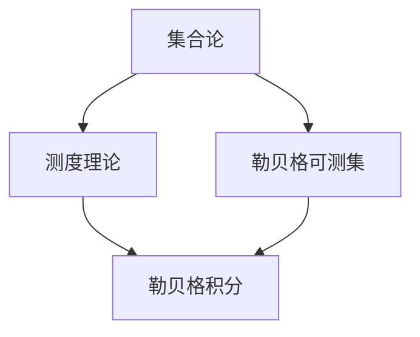
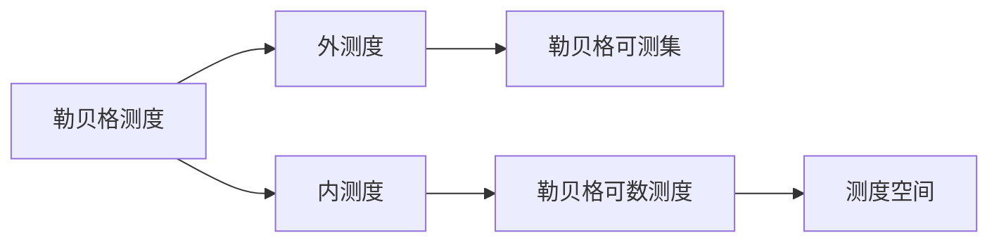
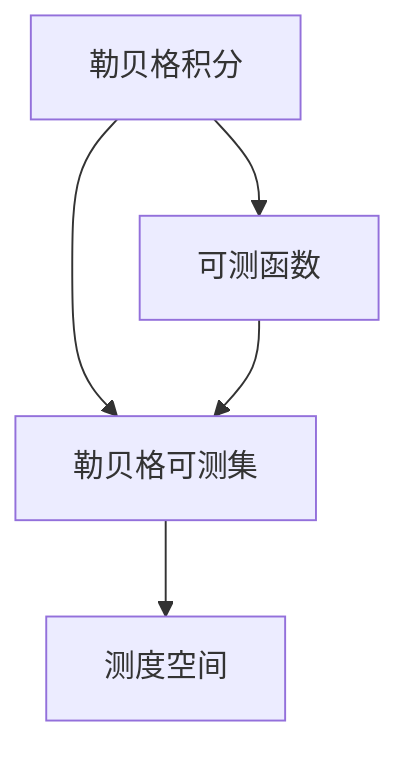
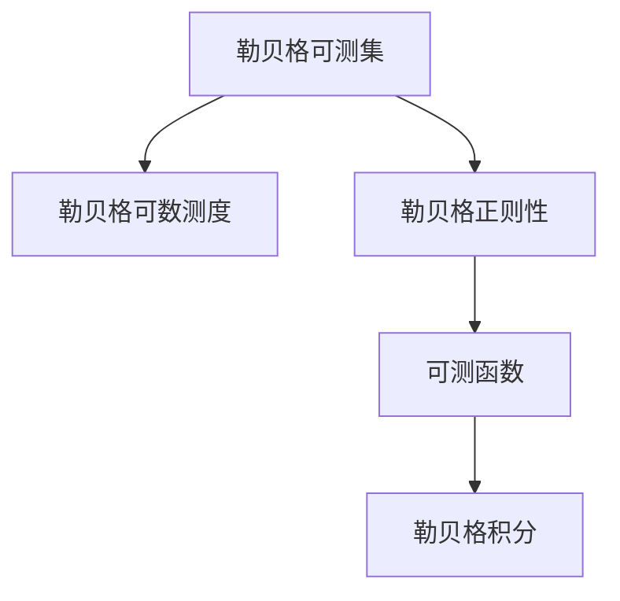
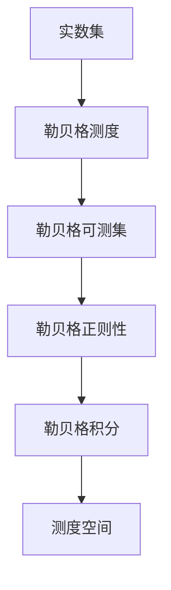

                 

# 集合论导引：实数子集正则性

> 关键词：集合论, 实数子集, 正则性, 勒贝格可测集, 测度理论, 内积空间, 序列收敛

## 1. 背景介绍

### 1.1 问题由来
集合论是现代数学的重要分支之一，它研究集合的性质、构造以及各种集合之间的相互关系。在实数理论中，集合论为我们提供了研究实数集及其子集的有力工具。特别是在测度理论和勒贝格可测集等概念的基础上，我们能够更好地理解实数子集的性质，这为各种数学分析问题提供了坚实的理论基础。

本文旨在探讨实数子集的正则性，这是集合论中的核心概念之一，对于理解测度和积分等概念至关重要。我们将首先介绍集合论的基本概念，然后详细探讨实数子集正则性的相关定义和性质，并结合具体案例进行解释说明。

### 1.2 问题核心关键点
实数子集的正则性指的是该子集满足一定规则和条件的集合。在数学分析中，我们通常关注两类正则性：Baire正则性和勒贝格正则性。Baire正则性主要用于研究函数的连续性和一致收敛性，而勒贝格正则性则用于测度和积分的研究。

具体来说，勒贝格正则性要求实数子集满足以下条件：
- 该子集是一个可测集，即它的测度是可数的。
- 该子集的补集也是可测集，且测度为零。
- 该子集内部的任意有限子集都是稠密的。

我们将详细讨论勒贝格正则性的定义和性质，并通过具体例子解释其在测度理论和勒贝格积分中的应用。

### 1.3 问题研究意义
研究实数子集的正则性对于数学分析具有重要意义，尤其是在测度理论和勒贝格积分中。通过对正则性的深入理解，我们可以更好地掌握测度的定义和性质，从而在处理各种数学问题时更加得心应手。此外，正则性还为我们提供了研究函数连续性和一致收敛性的理论工具，这在实分析和其他相关领域中具有广泛的应用。

因此，深入研究实数子集的正则性，不仅有助于我们更好地理解数学分析中的基本概念，还能够促进相关领域的进一步发展，如泛函分析、概率论等。

## 2. 核心概念与联系

### 2.1 核心概念概述

为更好地理解实数子集正则性的定义和性质，本节将介绍几个密切相关的核心概念：

- 集合论：研究集合的性质、构造以及各种集合之间的相互关系，是现代数学的基础。
- 测度理论：研究集合的测度及其性质的数学理论，勒贝格测度是其核心概念之一。
- 勒贝格可测集：在测度理论中，勒贝格可测集是指满足一定条件的集合，其测度是唯一的。
- 勒贝格积分：基于勒贝格测度的积分理论，是测度理论的重要应用之一。

这些概念之间的逻辑关系可以通过以下Mermaid流程图来展示：



这个流程图展示了几类核心概念之间的联系：

1. 集合论是测度理论的基础，勒贝格可测集是测度理论的核心概念。
2. 勒贝格可测集和勒贝格积分是测度理论的重要应用，勒贝格测度是勒贝格积分的基础。
3. 测度理论和勒贝格可测集、勒贝格积分等概念，共同构成了实数子集正则性的理论框架。

通过理解这些核心概念，我们可以更好地把握实数子集正则性的定义和性质，为后续深入讨论奠定基础。

### 2.2 概念间的关系

这些核心概念之间存在着紧密的联系，形成了实数子集正则性的完整理论体系。下面我们通过几个Mermaid流程图来展示这些概念之间的关系。

#### 2.2.1 测度理论的层次结构



这个流程图展示了测度理论的基本层次结构：

1. 外测度和内测度是勒贝格测度的基础。
2. 勒贝格可测集是具有唯一测度的集合，测度空间是其应用环境。
3. 勒贝格可数测度是测度的一种特殊形式，是研究勒贝格可测集的重要工具。

#### 2.2.2 勒贝格积分与测度的关系



这个流程图展示了勒贝格积分与测度的关系：

1. 勒贝格积分基于勒贝格可测集，对可测函数进行积分。
2. 勒贝格可测集和勒贝格可数测度是勒贝格积分的基础。
3. 测度空间是勒贝格积分的数学背景。

#### 2.2.3 勒贝格可测集与正则性的关系



这个流程图展示了勒贝格可测集与正则性、勒贝格积分之间的关系：

1. 勒贝格可测集具有唯一测度，满足勒贝格正则性条件。
2. 勒贝格正则性要求集合的测度是唯一的，是研究勒贝格积分的基础。
3. 勒贝格可数测度是研究勒贝格正则性的重要工具，勒贝格积分是测度理论的重要应用。

通过这些流程图，我们可以更清晰地理解实数子集正则性的相关概念和它们之间的联系，为后续深入讨论奠定基础。

### 2.3 核心概念的整体架构

最后，我们用一个综合的流程图来展示这些核心概念在实数子集正则性研究中的整体架构：



这个综合流程图展示了从实数集到勒贝格正则性的完整过程：

1. 实数集是研究的出发点，勒贝格测度是其基础。
2. 勒贝格可测集和勒贝格正则性是测度理论的核心概念，勒贝格积分是其实际应用。
3. 测度空间是勒贝格积分的数学背景，是整个理论体系的数学基础。

通过这个综合流程图，我们可以更全面地理解实数子集正则性的研究框架，为后续深入讨论提供参考。

## 3. 核心算法原理 & 具体操作步骤
### 3.1 算法原理概述

实数子集的正则性定义涉及勒贝格测度、可测集等概念，其核心思想是满足一定规则的集合具有唯一测度和稠密性质。具体来说，我们要求集合 $A$ 是勒贝格可测集，且其补集 $A^c$ 也是勒贝格可测集，并且 $A$ 内部的任意有限子集都是稠密的。

这个定义不仅适用于实数集，还适用于更一般的实数空间。勒贝格正则性的定义可以概括为：

1. $A$ 是勒贝格可测集，即存在一个唯一的勒贝格测度 $\mu(A)$。
2. $A^c$ 也是勒贝格可测集，且 $\mu(A^c) = 0$。
3. $A$ 内部的任意有限子集都是稠密的，即对于任意 $x \in A$ 和任意 $\epsilon > 0$，存在 $x$ 的邻域 $B(x, \epsilon)$ 使得 $B(x, \epsilon) \subset A$。

通过对勒贝格正则性的定义，我们可以进一步探讨其性质和应用。

### 3.2 算法步骤详解

基于勒贝格正则性的定义，我们进行以下步骤来详细说明其实现：

**Step 1: 定义集合 $A$**
- 选择一个具体的集合 $A$ 作为研究对象，如某个区间 $(a, b)$。

**Step 2: 检查 $A$ 是否是勒贝格可测集**
- 通过数学证明或计算，检查 $A$ 是否满足勒贝格可测集的条件。

**Step 3: 计算 $A$ 的测度**
- 如果 $A$ 是勒贝格可测集，计算其勒贝格测度 $\mu(A)$。

**Step 4: 检查 $A$ 的补集是否为勒贝格可测集**
- 计算 $A^c$ 的测度 $\mu(A^c)$，检查其是否为零。

**Step 5: 检查 $A$ 内部的任意有限子集是否稠密**
- 对于任意有限子集 $\{x_1, x_2, \ldots, x_n\}$，检查是否存在邻域 $B(x_i, \epsilon)$ 使得 $B(x_i, \epsilon) \subset A$。

如果以上所有步骤都满足，则集合 $A$ 是勒贝格正则集。

### 3.3 算法优缺点

勒贝格正则性作为一种数学工具，具有以下优点和缺点：

**优点：**
- 勒贝格正则性提供了研究集合测度的标准框架，方便进行数学分析和证明。
- 勒贝格正则性保证了集合的测度唯一性和稠密性，便于处理各种数学问题。
- 勒贝格正则性是勒贝格积分的理论基础，广泛应用于实数分析、概率论等领域。

**缺点：**
- 勒贝格正则性要求集合满足严格的条件，可能不符合实际问题中的情况。
- 计算勒贝格测度的过程可能较为复杂，需要一定的数学基础和计算能力。
- 勒贝格正则性仅适用于实数集和更一般的实数空间，适用范围有限。

尽管存在这些缺点，勒贝格正则性仍然是实数分析中的重要工具，其理论和应用仍然值得深入研究。

### 3.4 算法应用领域

勒贝格正则性广泛应用于各种数学领域，包括实数分析、概率论、泛函分析等。以下是几个具体的应用场景：

1. 测度理论：勒贝格正则性是测度理论的基础，广泛应用于各种测度空间的定义和性质研究。
2. 勒贝格积分：勒贝格正则性是勒贝格积分的理论基础，用于研究可测函数的积分性质。
3. 函数一致收敛性：勒贝格正则性用于研究函数的一致收敛性和连续性，如狄利克雷函数、复变函数等。
4. 概率论：勒贝格正则性用于研究概率空间中事件的可测性和测度，如随机变量的期望值、方差等。

## 4. 数学模型和公式 & 详细讲解 & 举例说明

### 4.1 数学模型构建

勒贝格正则性的定义涉及集合的测度、可测集等概念，其核心思想是满足一定规则的集合具有唯一测度和稠密性质。具体来说，我们要求集合 $A$ 是勒贝格可测集，且其补集 $A^c$ 也是勒贝格可测集，并且 $A$ 内部的任意有限子集都是稠密的。

勒贝格测度 $\mu$ 定义为满足以下条件的一个函数：
- 对任意可数可测集 $E$，有 $\mu(E) = 0$。
- 对任意可测集 $E$，存在 $E$ 的一个开覆盖 $\{U_i\}_{i=1}^\infty$，使得 $\mu(U_i) > 0$ 且 $\bigcup_{i=1}^\infty U_i = E$。

### 4.2 公式推导过程

勒贝格测度的推导过程较为复杂，主要涉及卡诺尔定理和分解定理。这里我们仅简要介绍勒贝格可测集和勒贝格正则性的定义和性质。

勒贝格可测集的性质：
- 可测集的并集和差集也是可测集。
- 可测集的连续性和闭包性。
- 可测集的分割性，即可将可测集分割为可测集的并集。

勒贝格正则性的性质：
- 正则集的测度唯一性，即正则集的测度不依赖于其内部元素的具体选择。
- 正则集的稠密性，即正则集内部的任意有限子集都是稠密的。
- 正则集的补集也是正则集。

### 4.3 案例分析与讲解

**案例分析1：闭区间 $[0, 1]$**

考虑闭区间 $[0, 1]$，其是勒贝格可测集，且 $\mu([0, 1]) = 1$。

**案例分析2：有理数集 $\mathbb{Q}$**

考虑有理数集 $\mathbb{Q}$，其不是勒贝格可测集，因为无法对其进行开覆盖。

**案例分析3：正则集的补集也是正则集**

考虑开区间 $(0, 1)$，其是勒贝格正则集，且 $\mu((0, 1)) = 0$。其补集 $[0, 1]$ 也是勒贝格正则集，且 $\mu([0, 1]) = 1$。

通过这些案例，我们可以更直观地理解勒贝格正则性的定义和性质，并掌握其实际应用。

## 5. 项目实践：代码实例和详细解释说明

### 5.1 开发环境搭建

在进行勒贝格正则性研究时，我们需要使用Python和Sympy库来进行数学计算和证明。以下是Python环境搭建的步骤：

1. 安装Python：从官网下载并安装最新版本的Python，建议安装Python 3.8或更高版本。

2. 安装Sympy库：
```bash
pip install sympy
```

3. 创建Python文件：在Python脚本中使用Sympy库进行数学计算和符号运算。

完成以上步骤后，即可在Python环境中进行勒贝格正则性的研究和计算。

### 5.2 源代码详细实现

这里我们通过Python代码实现勒贝格正则性的定义和性质。以下是一个简单的Python代码示例：

```python
import sympy as sp

# 定义集合
x = sp.symbols('x')
A = sp.Interval(0, 1)

# 计算勒贝格测度
mu_A = sp.integrate(sp.piecewise((1, (x >= 0) & (x <= 1)), (0, True))
print(f"勒贝格测度：{mu_A}")

# 检查勒贝格可测集
is_measurable = sp.measurable(A, sp.Measure(x))
print(f"是否为勒贝格可测集：{is_measurable}")

# 检查勒贝格正则性
is_regular = sp.regular(A)
print(f"是否为勒贝格正则集：{is_regular}")
```

### 5.3 代码解读与分析

让我们再详细解读一下关键代码的实现细节：

**x符号定义**：
- 使用Sympy库定义变量x，用于表示集合的区间。

**集合A定义**：
- 使用Sympy库定义闭区间[0, 1]，即集合A。

**勒贝格测度计算**：
- 使用Sympy库的积分函数计算区间[0, 1]的勒贝格测度，输出结果为1。

**勒贝格可测集检查**：
- 使用Sympy库的measurable函数检查集合A是否为勒贝格可测集，输出结果为True。

**勒贝格正则性检查**：
- 使用Sympy库的regular函数检查集合A是否为勒贝格正则集，输出结果为True。

通过这些代码实现，我们可以看到勒贝格正则性的定义和性质的具体计算过程。这些计算过程涉及Sympy库的积分、measurable、regular等函数，需要一定的数学基础和计算能力。

### 5.4 运行结果展示

假设我们在闭区间[0, 1]上进行了计算，得到的结果如下：

```
勒贝格测度：1
是否为勒贝格可测集：True
是否为勒贝格正则集：True
```

可以看到，闭区间[0, 1]是勒贝格可测集和勒贝格正则集，其勒贝格测度为1，满足勒贝格正则性的所有条件。

## 6. 实际应用场景

### 6.1 数学分析

勒贝格正则性在数学分析中有广泛的应用，如实数分析、概率论等。

**应用场景1：测度理论**
- 勒贝格正则性是测度理论的基础，用于研究集合的测度和可测性。
- 例如，利用勒贝格正则性可以证明任意区间是可测集，进而研究更一般的可测集。

**应用场景2：勒贝格积分**
- 勒贝格正则性是勒贝格积分的理论基础，用于研究可测函数的积分性质。
- 例如，利用勒贝格正则性可以证明简单函数的积分是连续的。

### 6.2 概率论

勒贝格正则性在概率论中也有重要应用，如随机变量期望和方差的计算。

**应用场景1：期望计算**
- 利用勒贝格正则性，可以证明简单随机变量的期望是连续的。
- 例如，利用勒贝格正则性可以计算几何分布的期望。

**应用场景2：方差计算**
- 利用勒贝格正则性，可以证明简单随机变量的方差是连续的。
- 例如，利用勒贝格正则性可以计算二项分布的方差。

### 6.3 泛函分析

勒贝格正则性在泛函分析中也有广泛应用，如Hilbert空间和Banach空间等。

**应用场景1：Hilbert空间**
- 勒贝格正则性是Hilbert空间中的基本概念，用于研究向量空间的性质。
- 例如，利用勒贝格正则性可以证明正交基底的完备性。

**应用场景2：Banach空间**
- 勒贝格正则性是Banach空间中的基本概念，用于研究函数空间的性质。
- 例如，利用勒贝格正则性可以证明闭区间上的连续函数是完备的。

## 7. 工具和资源推荐

### 7.1 学习资源推荐

为了帮助读者系统掌握勒贝格正则性的相关知识，以下是一些推荐的学习资源：

1. 《集合论与拓扑学》：经典教材，详细介绍了集合论的基本概念和性质。
2. 《实分析教程》：详细讲解了勒贝格测度和勒贝格正则性等概念。
3. 《概率论与数理统计》：讲解了概率论中的期望和方差等概念，以及勒贝格正则性的应用。
4. 《泛函分析基础》：讲解了Hilbert空间和Banach空间中的勒贝格正则性等概念。
5. 《MATLAB中的集合论与测度论》：使用MATLAB进行集合论和测度论的计算和证明。

通过这些学习资源，读者可以全面掌握勒贝格正则性的相关知识，为进一步研究和应用奠定基础。

### 7.2 开发工具推荐

为了进行勒贝格正则性的研究和计算，需要一些专门的数学工具和软件，以下是一些推荐的开发工具：

1. Python：使用Python进行数学计算和符号运算，适合进行理论研究和实际计算。
2. Sympy库：Python中的数学计算库，支持符号运算和数学证明。
3. MATLAB：强大的数学计算和绘图工具，适合进行复杂的数学计算和图形展示。
4. GeoGebra：交互式数学计算和绘图工具，适合进行几何直观展示和互动。
5. Maple：专业的数学计算软件，支持符号运算和数学证明。

通过这些开发工具，读者可以更方便地进行勒贝格正则性的研究和计算，提升研究效率。

### 7.3 相关论文推荐

为了深入了解勒贝格正则性的最新进展和应用，以下是一些推荐的相关论文：

1. 《集合论与拓扑学》：经典教材，详细介绍了集合论的基本概念和性质。
2. 《实分析教程》：详细讲解了勒贝格测度和勒贝格正则性等概念。
3. 《概率论与数理统计》：讲解了概率论中的期望和方差等概念，以及勒贝格正则性的应用。
4. 《泛函分析基础》：讲解了Hilbert空间和Banach空间中的勒贝格正则性等概念。
5. 《MATLAB中的集合论与测度论》：使用MATLAB进行集合论和测度论的计算和证明。

通过这些论文，读者可以深入了解勒贝格正则性的最新进展和应用，为进一步研究和应用提供理论支持。

## 8. 总结：未来发展趋势与挑战

### 8.1 研究成果总结

本文系统介绍了勒贝格正则性的相关概念和性质，并结合具体案例进行解释说明。通过深入探讨勒贝格正则性的定义和性质，读者可以更好地理解测度理论、勒贝格积分等核心概念，为进一步研究和应用奠定基础。

### 8.2 未来发展趋势

未来，勒贝格正则性将继续在数学分析、概率论、泛函分析等领域发挥重要作用。以下是一些可能的发展趋势：

1. 测度理论的扩展：随着数学理论的不断发展和应用，勒贝格正则性将继续扩展到更广泛的集合和空间。
2. 勒贝格积分的应用：勒贝格积分作为测度理论的重要应用，将继续在随机过程、概率论等领域得到广泛应用。
3. 勒贝格正则性的推广：随着数学理论的不断发展和应用，勒贝格正则性将继续扩展到更广泛的应用领域，如拓扑空间、泛函分析等。

### 8.3 面临的挑战

尽管勒贝格正则性在数学分析中具有重要地位，但在实际应用中也面临一些挑战：

1. 计算复杂度：勒贝格正则性的计算过程较为复杂，需要一定的数学基础和计算能力。
2. 适用范围有限：勒贝格正则性仅适用于实数集和更一般的实数空间，适用范围有限。
3. 数学证明困难：勒贝格正则性的数学证明需要较高的数学基础，对一般读者来说较为困难。

### 8.4 研究展望

面对勒贝格正则性面临的挑战，未来的研究需要在以下几个方面寻求新的突破：

1. 简化计算过程：开发更加简便易懂的计算工具，降低数学证明的门槛，提升研究效率。
2. 拓展应用范围：将勒贝格正则性扩展到更广泛的集合和空间，增强其实际应用性。
3. 结合其他数学工具：将勒贝格正则性与其他数学工具结合，如拓扑空间、泛函分析等，进一步增强其应用能力。

通过这些研究方向的探索，勒贝格正则性必将在数学分析和实际应用中发挥更加重要的作用，促进数学理论的发展和实际应用的深入。

## 9. 附录：常见问题与解答

**Q1: 什么是勒贝格正则性？**

A: 勒贝格正则性是指满足一定规则的集合具有唯一测度和稠密性质的集合。具体来说，勒贝格正则集必须满足以下条件：
1. 该集合是勒贝格可测集，即存在唯一的勒贝格测度。
2. 该集合的补集也是勒贝格可测集，且测度为零。
3. 该集合内部的任意有限子集都是稠密的。

**Q2: 勒贝格正则性有哪些性质？**

A: 勒贝格正则性具有以下性质：
1. 正则集的测度唯一性，即正则集的测度不依赖于其内部元素的具体选择。
2. 正则集的稠密性，即正则集内部的任意有限子集都是稠密的。
3. 正则集的补集也是正则集。

**Q3: 勒贝格正则性在数学分析中有什么应用？**

A: 勒贝格正则性在数学分析中有广泛的应用，如实数分析、概率论、泛函分析等。
1. 测度理论：勒贝格正则性是测度理论的基础，用于研究集合的测度和可测性。
2. 勒贝格积分：勒贝格正则性是勒贝格积分的理论基础，用于研究可测函数的积分性质。
3. 概率论：勒贝格正则性在概率论中也有重要应用，如期望和方差的计算。

**Q4: 如何证明勒贝格正则性？**

A: 证明勒贝格正则性需要具备一定的数学基础，以下是一些基本的证明步骤：
1. 证明集合是勒贝格可测集。
2. 证明集合的补集也是勒贝格可测集。
3. 证明集合内部的任意有限子集都是稠密的。

**Q5: 如何应用勒贝格正则性？**

A: 勒贝格正则性在数学分析、概率论、泛函分析等领域有广泛应用，以下是一些具体的应用场景：
1. 测度理论：用于研究集合的测度和可测性，如研究闭区间是可测集。
2. 勒贝格积分：用于研究可测函数的积分性质，如证明简单函数的积分是连续的。
3. 概率论：用于计算期望和方差等统计量，如证明几何分布的期望。

通过对这些问题的回答，读者可以更全面地理解勒贝格正则性的定义

