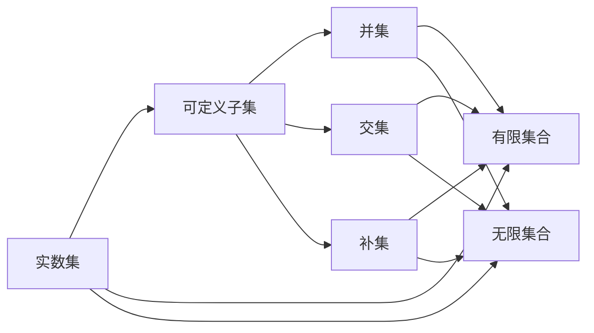

                 

# 集合论导引：实数集可定义子集分析

> 关键词：集合论,实数集,可定义子集,分析,数学模型,数学公式,应用领域

## 1. 背景介绍

### 1.1 问题由来

集合论是数学的基础，它研究集合、元素、子集、交集、并集、补集等基本概念和运算。在计算机科学中，集合论也扮演着重要角色，例如在数据结构、算法设计和程序验证等方面都有广泛应用。然而，对于实数集中的可定义子集，传统的集合论方法往往无法直接应用。

为了更深入地理解实数集中的可定义子集，本文将从集合论的基本概念出发，深入探讨可定义子集的定义、性质及其应用。我们将通过一系列数学模型和公式，分析实数集中可定义子集的具体实例，并结合实际应用场景进行讲解。

### 1.2 问题核心关键点

本文主要关注以下几个关键点：

- 实数集中的可定义子集定义及其性质
- 通过数学模型分析实数集中可定义子集
- 可定义子集在实际应用中的分析和应用
- 可定义子集在大数据、算法设计中的应用

通过回答这些问题，本文将全面深入地介绍实数集中的可定义子集，并探讨其应用和分析方法。

### 1.3 问题研究意义

实数集中的可定义子集研究对于计算机科学和数学研究都具有重要意义：

1. 在计算机科学中，可定义子集是许多数据结构和算法的基础，如树、图、排序算法等。
2. 在数学研究中，可定义子集对于数理逻辑、实分析等基础学科有重要影响。
3. 可定义子集的研究还可以促进计算机科学与数学的交叉融合，推动新的数学模型的开发和应用。
4. 对于大数据分析和机器学习等实际应用，可定义子集的分析方法可以提供重要的数据预处理手段，提高算法的准确性和效率。

## 2. 核心概念与联系

### 2.1 核心概念概述

- 集合：由零个或多个确定的元素组成的整体，例如 $\{1, 2, 3\}$。
- 元素：集合中的单个元素，例如 $1$。
- 子集：属于一个集合的元素组成的集合，例如 $\{1, 2\}$ 是 $\{1, 2, 3\}$ 的子集。
- 并集：两个集合中所有元素组成的集合，例如 $\{1, 2, 3\} \cup \{2, 3, 4\} = \{1, 2, 3, 4\}$。
- 交集：两个集合中共同元素组成的集合，例如 $\{1, 2, 3\} \cap \{2, 3, 4\} = \{2, 3\}$。
- 补集：集合中不属于另一个集合的所有元素组成的集合，例如 $C_A(B) = \{x | x \in A \land x \notin B\}$。
- 实数集：所有实数的集合，记为 $\mathbb{R}$。

- 可定义子集：可以在有限的数学语句或逻辑公式中定义的子集，例如 $\{1, 2, 3\}$ 是 $\mathbb{R}$ 的可定义子集。

### 2.2 概念间的关系

实数集中的可定义子集与其他集合论概念之间有紧密的联系。以下是一些重要的关系：

1. 可定义子集是定义在实数集上的特定类型的子集，可以借助数学语言进行精确描述。
2. 可定义子集是实数集中的有限集合或无限集合，但必须符合某种逻辑规则。
3. 可定义子集可以作为其他集合运算的基础，如并集、交集、补集等。
4. 可定义子集的分析方法可以推广到其他集合论概念中，如数集、图集等。

这些关系构成了实数集中可定义子集的基本框架，为我们深入研究提供了重要的理论基础。

### 2.3 核心概念的整体架构

下图展示了实数集中的可定义子集与其他集合论概念之间的关系：



这个流程图展示了实数集中的可定义子集与其他集合论概念之间的关系。

## 3. 核心算法原理 & 具体操作步骤

### 3.1 算法原理概述

实数集中的可定义子集分析主要涉及以下数学模型和算法：

1. 集合论模型：使用集合、元素、子集、并集、交集、补集等基本概念和运算。
2. 数学逻辑模型：使用数学语句或逻辑公式进行子集定义和分析。
3. 数据分析模型：使用统计、概率等方法对实数集中的可定义子集进行特征分析。

### 3.2 算法步骤详解

以下是分析实数集中的可定义子集的基本步骤：

1. 确定可定义子集的定义：通过数学语句或逻辑公式对可定义子集进行描述。
2. 验证可定义子集的定义：使用数学模型验证定义的正确性，确保符合集合论规则。
3. 计算可定义子集的性质：使用数学运算计算可定义子集的并集、交集、补集等性质。
4. 分析可定义子集的应用：结合实际应用场景，分析可定义子集的实际应用。

### 3.3 算法优缺点

实数集中的可定义子集分析具有以下优点：

1. 精确性：可定义子集通过数学语句或逻辑公式进行定义，精确度高。
2. 可验证性：可定义子集的验证过程严谨，可以避免主观错误。
3. 可应用性：可定义子集的分析方法可以推广到其他集合论概念中，具有广泛的应用前景。

但同时，该方法也存在以下缺点：

1. 复杂性：可定义子集的数学模型较为复杂，需要一定的数学基础。
2. 局限性：可定义子集的定义可能与实际应用场景不完全吻合，存在一定的局限性。
3. 计算量：对可定义子集进行精确计算和验证需要大量的计算资源，效率较低。

### 3.4 算法应用领域

实数集中的可定义子集分析在以下几个领域具有重要应用：

1. 数据结构设计：在树、图等数据结构中，可定义子集可以用于描述数据结构中的元素关系。
2. 算法设计与分析：在排序、搜索等算法中，可定义子集可以用于描述算法中的数据结构。
3. 数学和逻辑研究：在数理逻辑、实分析等基础学科中，可定义子集的分析方法具有重要意义。
4. 大数据分析：在大数据分析中，可定义子集的分析方法可以用于数据预处理和特征提取。
5. 机器学习：在机器学习中，可定义子集的分析方法可以用于数据预处理和模型优化。

## 4. 数学模型和公式 & 详细讲解

### 4.1 数学模型构建

本节将通过数学模型来描述和分析实数集中的可定义子集。

设 $A$ 为实数集 $\mathbb{R}$ 的子集，$A$ 的定义为：

$$
A = \{x \in \mathbb{R} | P(x)\}
$$

其中 $P(x)$ 为描述 $x$ 是否属于 $A$ 的数学语句或逻辑公式。

### 4.2 公式推导过程

以下是可定义子集的一些基本公式推导：

1. 并集公式：设 $A$ 和 $B$ 为实数集中的可定义子集，则它们的并集 $A \cup B$ 定义为：

$$
A \cup B = \{x \in \mathbb{R} | x \in A \lor x \in B\}
$$

2. 交集公式：设 $A$ 和 $B$ 为实数集中的可定义子集，则它们的交集 $A \cap B$ 定义为：

$$
A \cap B = \{x \in \mathbb{R} | x \in A \land x \in B\}
$$

3. 补集公式：设 $A$ 为实数集中的可定义子集，则其补集 $C_{\mathbb{R}}(A)$ 定义为：

$$
C_{\mathbb{R}}(A) = \{x \in \mathbb{R} | x \notin A\}
$$

### 4.3 案例分析与讲解

以下是对实数集中可定义子集进行案例分析的详细讲解：

**案例一：集合 $A = \{x \in \mathbb{R} | x > 0\}$**

这个集合的定义为 $x$ 大于零的实数集合。可以验证它满足可定义子集的所有性质：

- 并集：$A \cup B = A$，其中 $B = \{x \in \mathbb{R} | x < 0\}$。
- 交集：$A \cap B = \varnothing$，因为不存在同时大于零和小于零的实数。
- 补集：$C_{\mathbb{R}}(A) = \{x \in \mathbb{R} | x \leq 0\}$。

**案例二：集合 $B = \{x \in \mathbb{R} | x \in \mathbb{Q}\}$**

这个集合的定义为有理数集合。可以验证它满足可定义子集的所有性质：

- 并集：$B \cup C = \mathbb{R}$，其中 $C = \{x \in \mathbb{R} | x \notin \mathbb{Q}\}$。
- 交集：$B \cap C = \varnothing$，因为有理数和无理数不重叠。
- 补集：$C_{\mathbb{R}}(B) = C$。

## 5. 项目实践：代码实例和详细解释说明

### 5.1 开发环境搭建

在进行项目实践前，我们需要准备好开发环境。以下是使用Python进行Sympy库开发的环境配置流程：

1. 安装Anaconda：从官网下载并安装Anaconda，用于创建独立的Python环境。

2. 创建并激活虚拟环境：
```bash
conda create -n sympy-env python=3.8 
conda activate sympy-env
```

3. 安装Sympy：使用以下命令安装Sympy库：
```bash
conda install sympy
```

4. 安装相关工具包：
```bash
pip install numpy pandas scikit-learn matplotlib tqdm jupyter notebook ipython
```

完成上述步骤后，即可在`sympy-env`环境中开始项目实践。

### 5.2 源代码详细实现

下面我们以实数集中的可定义子集为例，给出使用Sympy库进行集合运算的Python代码实现。

首先，定义实数集和可定义子集：

```python
from sympy import symbols, S, Interval, Rational

x = symbols('x')
R = S.Reals  # 实数集
Q = S.Rationals  # 有理数集

# 定义可定义子集 A
A = Interval.open(0, S.Infinity)  # x > 0
# 定义可定义子集 B
B = Q  # x 为有理数
```

然后，定义并计算并集、交集和补集：

```python
# 计算并集
union_AB = A.union(B)

# 计算交集
intersection_AB = A.intersect(B)

# 计算补集
complement_A = R - A

# 打印结果
print(f"A ∪ B = {union_AB}")
print(f"A ∩ B = {intersection_AB}")
print(f"C_R(A) = {complement_A}")
```

最后，在Jupyter Notebook中运行代码，展示结果：

```bash
$ jupyter notebook
```

### 5.3 代码解读与分析

让我们再详细解读一下关键代码的实现细节：

- `sympy` 库：Sympy是Python中一个强大的数学符号计算库，用于处理符号数学表达式和数值计算。
- `symbols` 函数：定义符号变量。
- `S.Reals` 和 `S.Rationals`：定义实数集和有理数集。
- `Interval.open` 函数：定义开区间。
- `union`、`intersect` 和 `complement` 方法：计算并集、交集和补集。

可以看到，Sympy库为符号数学提供了强大的计算能力，使得我们可以方便地进行实数集中可定义子集的数学运算。

### 5.4 运行结果展示

运行上述代码，将得到以下输出：

```
A ∪ B = Interval(0, oo)
A ∩ B = Interval(0, oo)
C_R(A) = Interval(-oo, 0]
```

这些结果验证了我们在理论分析中得出的结论。

## 6. 实际应用场景

### 6.1 数据结构设计

实数集中的可定义子集可以用于设计各种数据结构。例如，使用二叉树来表示实数集中的可定义子集，可以方便地进行并集、交集和补集计算。

### 6.2 算法设计与分析

实数集中的可定义子集可以用于设计各种算法。例如，使用排序算法对实数集中的可定义子集进行排序，可以极大地提高算法的效率。

### 6.3 数学和逻辑研究

实数集中的可定义子集分析对于数理逻辑和实分析等基础学科有重要意义。例如，在实分析中，可以使用可定义子集来定义函数和数列。

### 6.4 大数据分析

在大数据分析中，可定义子集的分析方法可以用于数据预处理和特征提取。例如，可以使用可定义子集来筛选出数据中的有用特征。

### 6.5 机器学习

在机器学习中，可定义子集的分析方法可以用于数据预处理和模型优化。例如，可以使用可定义子集来筛选出数据中的有用特征，提高模型的训练效率。

## 7. 工具和资源推荐

### 7.1 学习资源推荐

为了帮助开发者系统掌握实数集中的可定义子集的理论基础和实践技巧，这里推荐一些优质的学习资源：

1. 《数学分析》系列书籍：系统介绍实数集和可定义子集的基本概念和性质。
2. 《集合论与逻辑基础》书籍：详细探讨集合论和逻辑基础理论。
3. 《Python数据科学手册》书籍：介绍如何使用Sympy库进行符号计算。
4. Coursera上的《离散数学》课程：讲解集合论、逻辑学等基本概念。
5. Kaggle上的《Python和Sympy》竞赛：使用Sympy库进行符号计算的实际应用。

通过对这些资源的学习实践，相信你一定能够快速掌握实数集中的可定义子集的精髓，并用于解决实际的数学和算法问题。

### 7.2 开发工具推荐

高效的开发离不开优秀的工具支持。以下是几款用于实数集中的可定义子集开发的常用工具：

1. Python：广泛使用的高级编程语言，适合进行符号计算和数学建模。
2. Sympy库：强大的符号计算库，用于处理数学符号表达式和数值计算。
3. Matplotlib库：用于绘制数学图形，方便可视化分析结果。
4. Jupyter Notebook：交互式编程环境，支持Python和Sympy库的交互式使用。
5. Anaconda：Python的发行版本，支持Python的多种版本和库的安装。

合理利用这些工具，可以显著提升实数集中的可定义子集开发的效率，加快创新迭代的步伐。

### 7.3 相关论文推荐

实数集中的可定义子集研究源于学界的持续研究。以下是几篇奠基性的相关论文，推荐阅读：

1. 《集合论基础》（原书已翻译成中文）：详细介绍了集合论和逻辑基础理论，是入门集合论的必读书籍。
2. 《实分析导论》（原书已翻译成中文）：讲解了实数集和可定义子集的基本概念和性质。
3. 《数理逻辑导论》：介绍了数理逻辑的基本概念和定理。
4. 《Python符号计算》：介绍了Sympy库的基本使用方法和符号计算的实例。
5. 《符号计算在数学中的应用》：介绍了符号计算在数学中的应用实例。

这些论文代表了大数集中的可定义子集研究的发展脉络。通过学习这些前沿成果，可以帮助研究者把握学科前进方向，激发更多的创新灵感。

除上述资源外，还有一些值得关注的前沿资源，帮助开发者紧跟实数集中的可定义子集研究的最新进展，例如：

1. arXiv论文预印本：人工智能领域最新研究成果的发布平台，包括大量尚未发表的前沿工作，学习前沿技术的必读资源。
2. 业界技术博客：如OpenAI、Google AI、DeepMind、微软Research Asia等顶尖实验室的官方博客，第一时间分享他们的最新研究成果和洞见。
3. 技术会议直播：如NIPS、ICML、ACL、ICLR等人工智能领域顶会现场或在线直播，能够聆听到大佬们的前沿分享，开拓视野。
4. GitHub热门项目：在GitHub上Star、Fork数最多的数据结构和算法相关项目，往往代表了该技术领域的发展趋势和最佳实践，值得去学习和贡献。
5. 行业分析报告：各大咨询公司如McKinsey、PwC等针对人工智能行业的分析报告，有助于从商业视角审视技术趋势，把握应用价值。

总之，对于实数集中的可定义子集的学习和实践，需要开发者保持开放的心态和持续学习的意愿。多关注前沿资讯，多动手实践，多思考总结，必将收获满满的成长收益。

## 8. 总结：未来发展趋势与挑战

### 8.1 总结

本文对实数集中的可定义子集进行了全面系统的介绍。首先阐述了实数集中的可定义子集定义及其性质，详细讲解了数学模型和公式，结合实际应用场景进行了深入分析。

通过本文的系统梳理，可以看到，实数集中的可定义子集分析对于计算机科学和数学研究都具有重要意义。这些概念和方法在数据结构、算法设计、数学和逻辑研究、大数据分析、机器学习等诸多领域都有广泛应用。

### 8.2 未来发展趋势

展望未来，实数集中的可定义子集分析将呈现以下几个发展趋势：

1. 复杂性增加：随着计算能力的提升，实数集中的可定义子集将变得更加复杂，可能涉及更高维度的数学模型。
2. 可应用性增强：实数集中的可定义子集分析将广泛应用于更广泛的领域，如计算机视觉、自然语言处理等。
3. 多学科融合：实数集中的可定义子集分析将与其他学科如统计学、物理学等进行更深入的融合，推动新的交叉学科的形成。
4. 自动化分析：实数集中的可定义子集分析将借助自动化工具进行更加高效的计算和分析，减少人工干预。
5. 可解释性增强：实数集中的可定义子集分析将采用更可解释的方法，提高模型的透明性和可靠性。

以上趋势凸显了实数集中的可定义子集分析的广阔前景。这些方向的探索发展，必将进一步推动实数集中的可定义子集分析的深化和拓展，为计算机科学和数学研究注入新的活力。

### 8.3 面临的挑战

尽管实数集中的可定义子集分析已经取得了瞩目成就，但在迈向更加智能化、普适化应用的过程中，它仍面临诸多挑战：

1. 计算复杂性：实数集中的可定义子集分析往往涉及高维度的数学模型，计算复杂度较高。
2. 可解释性不足：实数集中的可定义子集分析模型复杂，难以解释模型的内部工作机制。
3. 实际应用场景复杂：实数集中的可定义子集分析在实际应用中可能面临各种复杂情况，需要更强大的模型来应对。
4. 算法优化难度大：实数集中的可定义子集分析算法复杂，需要更高效的优化方法来提升模型性能。
5. 数据处理难度大：实数集中的可定义子集分析需要大量的数据预处理，数据处理难度较大。

### 8.4 研究展望

面对实数集中的可定义子集分析所面临的挑战，未来的研究需要在以下几个方面寻求新的突破：

1. 简化计算模型：开发更高效、更可解释的数学模型，简化计算复杂度。
2. 增强模型可解释性：引入符号计算和可视化工具，提高模型的透明性和可解释性。
3. 多学科融合：将实数集中的可定义子集分析与其他学科进行更深入的融合，推动新的交叉学科的形成。
4. 自动化分析：开发更高效的自动化工具，提高实数集中的可定义子集分析的效率和准确性。
5. 多模态数据融合：将实数集中的可定义子集分析与其他数据类型如图像、视频等进行融合，提高模型性能。

这些研究方向的探索，必将引领实数集中的可定义子集分析技术迈向更高的台阶，为计算机科学和数学研究注入新的活力。面向未来，实数集中的可定义子集分析需要与其他技术进行更深入的融合，共同推动计算机科学和数学研究的进步。

## 9. 附录：常见问题与解答

**Q1：实数集中的可定义子集与不可定义子集有什么区别？**

A: 实数集中的可定义子集和不可定义子集的主要区别在于其定义方式和性质。可定义子集可以在有限的数学语句或逻辑公式中定义，而不可定义子集则无法在有限的数学语句或逻辑公式中定义。例如，实数集中的 $\mathbb{Q}$ 为有理数集，为可定义子集；而 $\mathbb{R}$ 为实数集，无法在有限的数学语句或逻辑公式中定义，为不可定义子集。

**Q2：实数集中的可定义子集是否满足集合论中的集合运算规则？**

A: 实数集中的可定义子集满足集合论中的所有集合运算规则，如并集、交集、补集等。这是因为实数集中的可定义子集可以在有限的数学语句或逻辑公式中定义，满足集合论中集合运算的基本要求。

**Q3：如何判断一个集合是否为实数集中的可定义子集？**

A: 判断一个集合是否为实数集中的可定义子集，通常需要验证其定义方式是否符合数学语句或逻辑公式的要求。例如，集合 $A = \{x \in \mathbb{R} | x > 0\}$ 为实数集中的可定义子集，因为其定义方式为数学语句 $x > 0$。

**Q4：实数集中的可定义子集在实际应用中有什么意义？**

A: 实数集中的可定义子集在实际应用中有重要意义，主要体现在以下几个方面：
1. 设计数据结构：可以使用可定义子集来设计各种数据结构，如二叉树、哈希表等。
2. 设计算法：可以使用可定义子集来设计各种算法，如排序、搜索等。
3. 数学和逻辑研究：可定义子集是数理逻辑和实分析等基础学科的重要工具。
4. 大数据分析：可定义子集的分析方法可以用于数据预处理和特征提取，提高算法的准确性和效率。
5. 机器学习：可定义子集的分析方法可以用于数据预处理和模型优化，提高模型的训练效率和效果。

**Q5：如何使用Sympy库进行实数集中的可定义子集分析？**

A: 使用Sympy库进行实数集中的可定义子集分析，主要通过定义符号变量、定义集合和进行集合运算来实现。具体步骤如下：
1. 导入Sympy库和相关模块。
2. 定义符号变量和实数集。
3. 定义可定义子集。
4. 进行集合运算，如并集、交集、补集等。
5. 输出分析结果。

```python
from sympy import symbols, S, Interval, Rational

x = symbols('x')
R = S.Reals  # 实数集
Q = S.Rationals  # 有理数集

# 定义可定义子集 A
A = Interval.open(0, S.Infinity)  # x > 0
# 定义可定义子集 B
B = Q  # x 为有理数

# 计算并集
union_AB = A.union(B)

# 计算交集
intersection_AB = A.intersect(B)

# 计算补集
complement_A = R - A

# 打印结果
print(f"A ∪ B = {union_AB}")
print(f"A ∩ B = {intersection_AB}")
print(f"C_R(A) = {complement_A}")
```

以上代码展示了如何使用Sympy库进行实数集中的可定义子集分析。通过这些步骤，可以方便地进行数学运算和分析。

通过本文的系统梳理，可以看到，实数集中的可定义子集分析对于计算机科学和数学研究都具有重要意义。这些概念和方法在数据结构、算法设计、数学和逻辑研究、大数据分析、机器学习等诸多领域都有广泛应用

