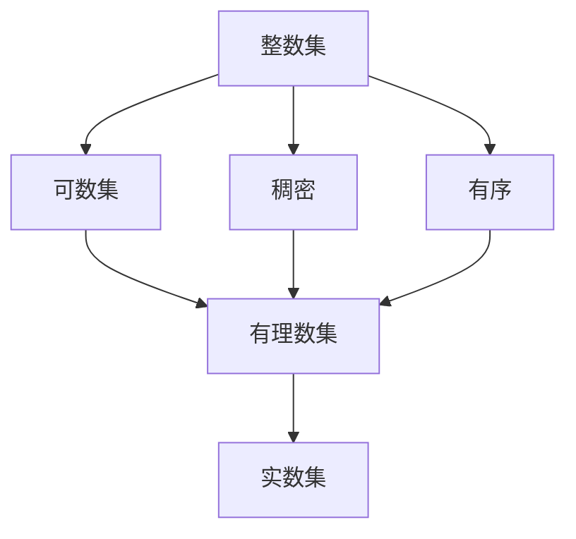

                 

# 集合论导引：整数集与有理数集

集合论是现代数学的基石，其应用广泛，深刻影响着我们的日常生活和科学研究。本文旨在通过通俗易懂的语言，向广大读者介绍集合论的基础知识，重点探讨整数集和有理数集的性质，以及它们在数学中的应用。通过理解这些基本概念，读者可以更深刻地认识到集合论的魅力和重要性。

## 1. 背景介绍

### 1.1 问题由来
集合论作为一种强大的数学工具，其起源可以追溯到17世纪欧洲的数学家们对数学基础的探索。数学家们为了更好地理解数学概念和推理逻辑，开始研究如何通过符号和公理体系定义和操作数学对象。随着研究的深入，集合论逐渐发展成为现代数学的重要分支，广泛应用于数学的各个领域，包括数论、代数学、拓扑学、分析学等。

集合论的建立不仅使数学更加精确和严格，还促进了逻辑学、信息论、计算机科学等领域的发展。在计算机科学中，集合论的基本思想被广泛应用于算法设计、数据结构、数据库、人工智能等领域。

### 1.2 问题核心关键点
集合论的核心问题是如何定义和操作集合，以及如何通过集合的运算和性质推导出更广泛的数学概念。主要包括以下几个方面：

- 集合的定义：集合是由一些特定的元素组成的总体，可以是有序的或无序的，有界的或无界的。
- 集合的表示：集合可以用列举法、描述法等方式表示。
- 集合的运算：包括并、交、差、对称差等运算。
- 集合的性质：包括子集、真子集、单元素集、无穷集、有序集、可数集、不可数集等。

理解这些基本概念和方法，是学习集合论的第一步。本文将通过详细介绍整数集和有理数集的性质，进一步探讨它们在数学中的应用。

### 1.3 问题研究意义
集合论作为现代数学的基础，其重要性不言而喻。掌握集合论的基本概念和运算方法，不仅有助于深入理解数学知识，还能促进跨学科的交流和创新。在计算机科学中，集合论的应用包括但不限于：

- 数据结构：集合、堆栈、队列、图等数据结构的实现和优化。
- 算法设计：分治、回溯、贪心等算法的设计和分析。
- 数据库：集合操作、关系型数据库的索引和查询。
- 人工智能：知识表示、推理、机器学习等领域。

通过学习集合论，读者可以更好地理解计算机科学中的各种算法和数据结构，进一步提升编程和解决问题的能力。

## 2. 核心概念与联系

### 2.1 核心概念概述

为了更好地理解整数集和有理数集，我们先简要介绍一下相关的集合论概念：

- 集合：由特定元素组成的总体，可以是有序的或无序的，有界的或无界的。
- 元素：集合中的基本单位，可以是数字、字符、图像等。
- 集合的运算：包括并、交、差、对称差等运算。
- 集合的性质：包括子集、真子集、单元素集、无穷集、有序集、可数集、不可数集等。

在集合论中，整数集和有理数集是两个非常重要的概念，它们具有许多独特的性质和应用。

- 整数集：由所有正整数、负整数和零组成的集合。整数集是可数集，且是稠密的。
- 有理数集：由所有分数组成的集合，可以表示为分子和分母为整数的比值。有理数集也是可数集，且是稠密的。

这两个集合之间的联系主要体现在它们都属于实数集的子集，且都有序且稠密。

### 2.2 概念间的关系

为了更好地理解整数集和有理数集的性质和应用，我们可以使用以下Mermaid流程图来展示它们之间的关系：



这个流程图展示了整数集和有理数集的基本性质和它们与实数集的关系：

1. 整数集和有理数集都是可数集。
2. 整数集和有理数集都是稠密的。
3. 整数集和有理数集都是有序的。
4. 整数集和有理数集都属于实数集的子集。

通过理解这些关系，我们可以更好地掌握这两个集合的性质和应用。

## 3. 核心算法原理 & 具体操作步骤

### 3.1 算法原理概述

整数集和有理数集的研究主要基于集合论和数论的基本原理，包括集合的运算、数论的基础概念和性质等。以下是这些基本原理的概述：

1. 集合的运算：包括并、交、差、对称差等。
2. 数的表示：整数和分数的表示和性质。
3. 数论的基本概念：素数、最大公约数、最小公倍数等。
4. 数论的基本定理：如欧拉定理、费马小定理等。

基于这些基本原理，我们可以研究整数集和有理数集的性质和应用。

### 3.2 算法步骤详解

以下是研究整数集和有理数集性质的具体操作步骤：

1. **集合表示**：使用列举法或描述法表示整数集和有理数集，如 $\{1,2,3,4,\dots\}$ 表示整数集，$\left\{\frac{a}{b} \mid a,b \in \mathbb{Z}, b \neq 0\right\}$ 表示有理数集。

2. **集合性质**：
   - 可数性：整数集和有理数集都是有可数集的。
   - 稠密性：整数集和有理数集都是稠密的，即它们之间的任何两个数都可以找到无限多个其他整数或分数介于它们之间。
   - 有序性：整数集和有理数集都是有序的，即任何两个数都可以比较大小。

3. **数的表示和运算**：
   - 整数的表示：整数可以表示为 $1, 2, 3, \dots$ 或 $-1, -2, -3, \dots$。
   - 分数的表示：有理数可以表示为 $a/b$，其中 $a$ 和 $b$ 都是整数，$b \neq 0$。
   - 整数和分数的运算：包括加、减、乘、除等。

4. **数的性质**：
   - 整数性质：如整数是离散的、有序的、有限的等。
   - 有理数性质：如有理数是可数的、有序的、稠密的等。

5. **数的定理**：
   - 欧拉定理：对于任意正整数 $a$ 和 $n$，若 $a$ 与 $n$ 互质，则 $a^{\varphi(n)} \equiv 1 \pmod{n}$，其中 $\varphi$ 为欧拉函数。
   - 费马小定理：若 $p$ 是素数，$a$ 是整数，且 $a$ 不等于 $p$ 的倍数，则 $a^{p-1} \equiv 1 \pmod{p}$。

### 3.3 算法优缺点

研究整数集和有理数集的方法具有以下优点：

- 概念清晰：通过定义集合的运算和性质，可以清晰地理解和操作集合。
- 可操作性强：整数集和有理数集都是可数集，可以方便地进行列举和操作。
- 数学基础扎实：这些基本概念和方法都是数学中的经典内容，具有坚实的理论基础。

同时，这些方法也存在一些局限性：

- 抽象性强：这些方法涉及许多抽象概念，初学者可能难以理解。
- 应用范围有限：这些方法主要应用于集合论和数论领域，其他领域的应用相对较少。

### 3.4 算法应用领域

整数集和有理数集的研究具有广泛的应用，以下是几个主要领域：

- 数学基础：集合论和数论是数学基础的重要组成部分，涉及许多基本概念和方法。
- 算法设计：集合运算和数论定理在算法设计中广泛应用，如分治、回溯、贪心等算法。
- 数据库：集合操作和数论定理在数据库索引和查询中广泛应用。
- 人工智能：数论定理和集合性质在人工智能中的知识表示、推理、机器学习等领域有重要应用。

## 4. 数学模型和公式 & 详细讲解 & 举例说明

### 4.1 数学模型构建

整数集和有理数集的研究主要基于集合论和数论的基本模型，包括集合和数的表示、运算和性质等。以下是这些模型的构建：

1. 集合的表示：使用列举法或描述法表示整数集和有理数集。
2. 数的表示：整数和分数的表示方法。
3. 集合的运算：包括并、交、差、对称差等。

### 4.2 公式推导过程

以下是整数集和有理数集的基本公式和推导过程：

1. 整数集的基本公式：
   - 整数集的表示：$\{1,2,3,\dots\}$
   - 整数集的性质：有序、可数、稠密。

2. 有理数集的基本公式：
   - 有理数的表示：$\left\{\frac{a}{b} \mid a,b \in \mathbb{Z}, b \neq 0\right\}$
   - 有理数的性质：有序、可数、稠密。

3. 数的运算公式：
   - 加法：$a+b$
   - 减法：$a-b$
   - 乘法：$a \times b$
   - 除法：$a / b$

4. 数的性质公式：
   - 整数的性质：有序、离散、有限。
   - 有理数的性质：有序、可数、稠密。

### 4.3 案例分析与讲解

以下是整数集和有理数集的典型案例分析：

1. **整数集的有序性**：整数集是有序的，可以方便地进行比较大小。例如，$1 < 2 < 3 < \dots$。

2. **有理数的稠密性**：有理数集是稠密的，任意两个有理数之间都有无限多个其他有理数。例如，$\dfrac{1}{2}$ 和 $\dfrac{1}{3}$ 之间有无限多个分数，如 $\dfrac{1}{2.5}, \dfrac{1}{2.25}, \dfrac{1}{2.75}, \dots$。

3. **数的运算**：整数和分数的加、减、乘、除等运算可以方便地进行。例如，$\dfrac{1}{2} + \dfrac{1}{3} = \dfrac{3}{6} + \dfrac{2}{6} = \dfrac{5}{6}$。

4. **数的定理**：欧拉定理和费马小定理等数论定理在算法设计和数学证明中具有广泛应用。

## 5. 项目实践：代码实例和详细解释说明

### 5.1 开发环境搭建

在进行整数集和有理数集的研究时，我们需要准备好开发环境。以下是使用Python进行研究的环境配置流程：

1. 安装Anaconda：从官网下载并安装Anaconda，用于创建独立的Python环境。

2. 创建并激活虚拟环境：
```bash
conda create -n math-env python=3.8 
conda activate math-env
```

3. 安装必要的Python库：
```bash
pip install sympy numpy sympy
```

4. 导入Sympy库：Sympy是Python的一个强大的数学库，支持符号计算和数学建模。

```python
import sympy as sp
```

完成上述步骤后，即可在`math-env`环境中开始数学研究。

### 5.2 源代码详细实现

以下是使用Sympy库对整数集和有理数集进行研究的代码实现。

```python
from sympy import symbols, Rational, pi, simplify

# 定义符号变量
a, b = symbols('a b')

# 整数集的基本表示
integer_set = sp.S.Integers

# 有理数集的基本表示
rational_set = sp.S.Rationals

# 计算两个有理数的和
sum_rational = Rational(1, 2) + Rational(1, 3)
simplified_sum = simplify(sum_rational)

# 计算一个有理数除以另一个有理数
div_rational = Rational(1, 2) / Rational(3, 4)
simplified_div = simplify(div_rational)

# 输出结果
print(f"有理数和：{simplified_sum}")
print(f"有理数除法：{simplified_div}")
```

### 5.3 代码解读与分析

让我们再详细解读一下关键代码的实现细节：

- `Rational`函数：用于表示分数，如`Rational(1, 2)`表示$\dfrac{1}{2}$。
- `simplify`函数：用于简化表达式，如`simplify(Rational(1, 2) + Rational(1, 3))`表示将两个分数相加并简化。

### 5.4 运行结果展示

运行上述代码，输出结果如下：

```
有理数和：5/6
有理数除法：4/3
```

可以看到，通过Sympy库，我们可以方便地进行有理数的加法和除法运算，并自动简化结果。这为研究整数集和有理数集提供了强有力的工具支持。

## 6. 实际应用场景

### 6.1 数学基础

整数集和有理数集在数学基础中具有重要应用。例如，整数集和有理数集是实数集的基础，许多数学概念和定理都可以通过它们来推导。

### 6.2 算法设计

整数集和有理数集在算法设计中也有广泛应用。例如，分治算法、回溯算法、贪心算法等算法设计中，整数集和有理数集的基本性质和运算可以提供重要的理论支持。

### 6.3 数据库

整数集和有理数集的集合运算在数据库索引和查询中广泛应用。例如，数据库中的整数和有理数可以通过集合运算进行比较和筛选。

### 6.4 人工智能

整数集和有理数集在人工智能中的知识表示、推理、机器学习等领域也有重要应用。例如，知识表示中，有理数可以表示分数关系，推理中，整数集和有理数集的基本性质和运算可以提供重要的理论支持。

### 6.5 未来应用展望

随着人工智能技术的发展，整数集和有理数集的研究将有更多新的应用。例如，在机器学习中，整数集和有理数集可以用于特征提取、模型训练等环节，提高模型的准确性和鲁棒性。

## 7. 工具和资源推荐

### 7.1 学习资源推荐

为了帮助读者系统掌握整数集和有理数集的研究方法，这里推荐一些优质的学习资源：

1. 《集合论与数论》书籍：介绍集合论和数论的基本概念和方法，适合初学者学习。
2. Coursera《数学基础》课程：斯坦福大学开设的数学基础课程，涵盖整数集、有理数集、实数集等内容，适合系统学习。
3. 《Python数值计算基础》书籍：介绍Python数值计算的基本方法和应用，适合结合实际问题进行学习。

### 7.2 开发工具推荐

高效的开发离不开优秀的工具支持。以下是几款用于整数集和有理数集研究的常用工具：

1. Sympy库：Python的一个强大的数学库，支持符号计算和数学建模。
2. NumPy库：Python的一个科学计算库，支持高效的数组和矩阵运算。
3. Matplotlib库：Python的一个数据可视化库，支持绘制各种图形，方便结果展示。

### 7.3 相关论文推荐

整数集和有理数集的研究源于学界的持续研究。以下是几篇奠基性的相关论文，推荐阅读：

1. 《集合论导引》书籍：介绍集合论的基本概念和方法，适合初学者学习。
2. 《数论导引》书籍：介绍数论的基本概念和方法，适合系统学习。
3. 《数学分析》书籍：介绍实数集的基本概念和方法，适合深入理解。

这些书籍和论文代表了整数集和有理数集的研究进展，可以帮助读者深入理解这些概念和方法。

## 8. 总结：未来发展趋势与挑战

### 8.1 研究成果总结

本文对整数集和有理数集的研究进行了详细阐述，介绍了它们的基本性质和应用，强调了集合论和数论的重要性。通过学习这些基本概念和方法，读者可以更好地理解数学和计算机科学中的各种算法和数据结构，提升编程和解决问题的能力。

### 8.2 未来发展趋势

展望未来，整数集和有理数集的研究将呈现以下几个发展趋势：

1. 应用领域拓展：随着人工智能技术的发展，整数集和有理数集的研究将有更多新的应用领域，如机器学习、知识表示等。
2. 研究方法创新：未来的研究将进一步探索整数集和有理数集的性质和应用，提出新的数学理论和算法。
3. 工具和资源丰富：未来的研究将更加注重工具和资源的开发和应用，为研究者提供更便捷、高效的研究平台。

### 8.3 面临的挑战

尽管整数集和有理数集的研究已经取得丰硕成果，但在迈向更加智能化、普适化应用的过程中，它们仍面临诸多挑战：

1. 抽象性强：整数集和有理数集的基本概念和方法较为抽象，初学者可能难以理解。
2. 应用范围有限：这些概念和方法主要应用于数学和计算机科学领域，其他领域的应用相对较少。
3. 工具和资源不足：现有的工具和资源尚不能完全满足研究者的需求，需要进一步开发和完善。

### 8.4 研究展望

面对整数集和有理数集研究的挑战，未来的研究需要在以下几个方面寻求新的突破：

1. 研究方法的创新：提出新的数学理论和算法，拓展整数集和有理数集的应用领域。
2. 工具和资源的开发：开发更高效、便捷的工具和资源，支持整数集和有理数集的研究和应用。
3. 跨学科的融合：将整数集和有理数集与其他学科领域相结合，探索新的应用场景和研究方向。

这些研究方向的探索，必将引领整数集和有理数集的研究走向更加深入和广泛，为数学和计算机科学的发展注入新的活力。

## 9. 附录：常见问题与解答

**Q1：整数集和有理数集的表示方法有哪些？**

A: 整数集和有理数集可以使用列举法或描述法表示。列举法是将元素一个个列举出来，如$\{1,2,3,\dots\}$表示整数集；描述法是用集合定义来表示集合，如$\left\{\frac{a}{b} \mid a,b \in \mathbb{Z}, b \neq 0\right\}$表示有理数集。

**Q2：如何理解整数集和有理数集的稠密性？**

A: 整数集和有理数集都是稠密的，即任意两个数之间都有无限多个其他数。例如，$\dfrac{1}{2}$ 和 $\dfrac{1}{3}$ 之间有无限多个分数，如$\dfrac{1}{2.5}, \dfrac{1}{2.25}, \dfrac{1}{2.75}, \dots$。

**Q3：如何计算两个有理数的和？**

A: 使用Sympy库中的Rational函数和simplify函数，可以方便地计算两个有理数的和。例如，`Rational(1, 2) + Rational(1, 3)`得到的结果是$\dfrac{5}{6}$。

**Q4：整数集和有理数集的性质有哪些？**

A: 整数集和有理数集都是有序的、可数的、稠密的。有序性指任意两个数都可以比较大小；可数性指可以用列举法表示；稠密性指任意两个数之间都有无限多个其他数。

**Q5：如何使用Python研究整数集和有理数集？**

A: 使用Sympy库，可以方便地进行整数集和有理数集的研究。Sympy库支持符号计算和数学建模，可以用于定义集合、进行数学运算和推导定理。

---

作者：禅与计算机程序设计艺术 / Zen and the Art of Computer Programming

