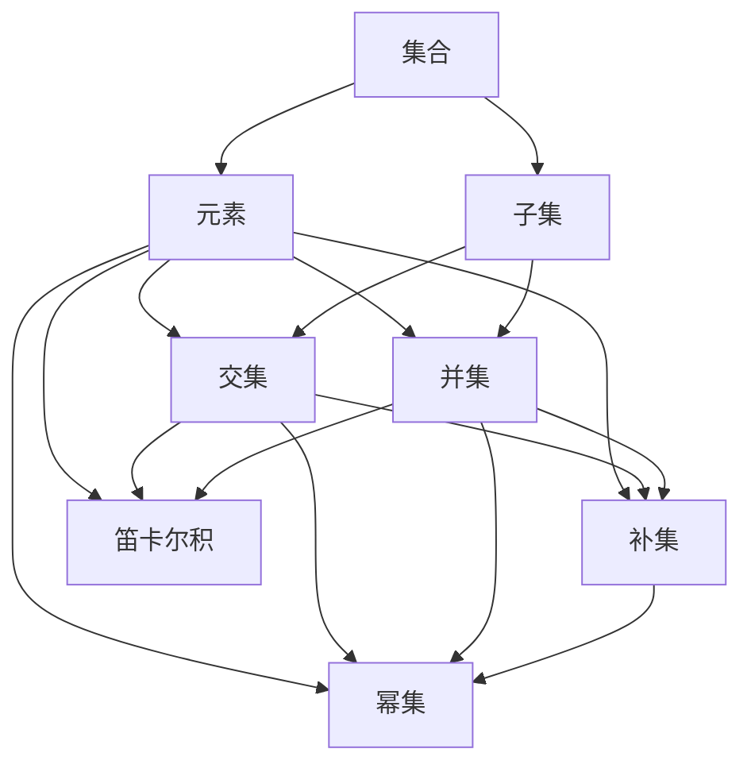
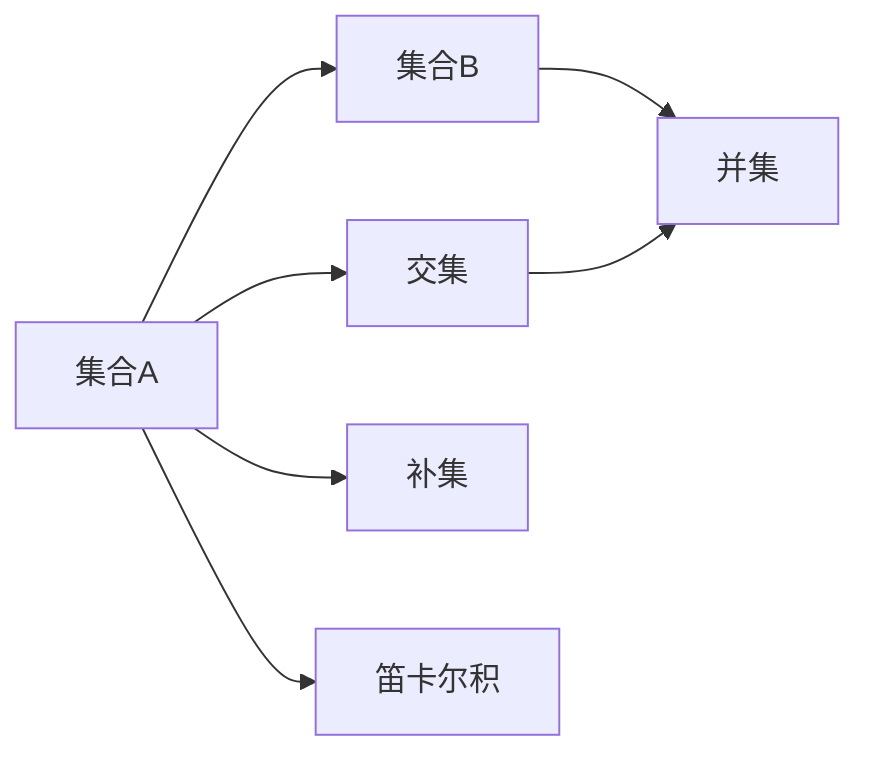
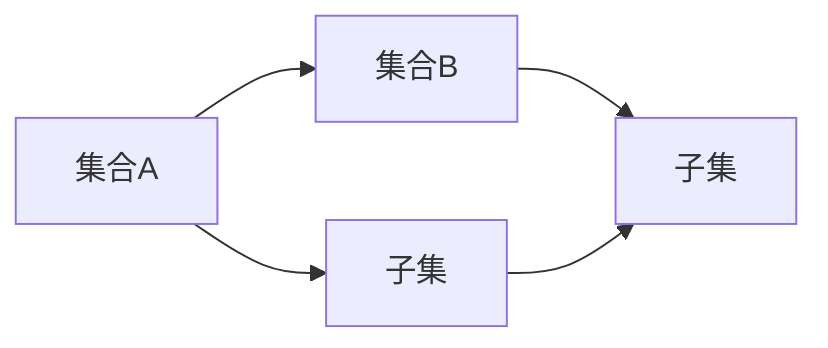
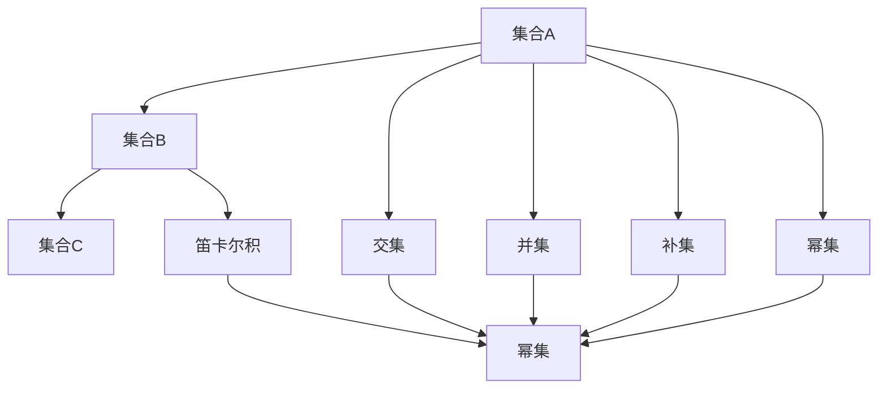
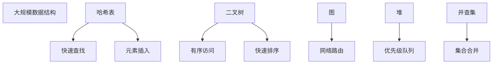

                 

# 集合论导引：植入逻辑学概念

## 1. 背景介绍

### 1.1 问题由来
集合论（Set Theory）是现代数学的基础之一，它提供了一种研究对象的结构化方式，为逻辑学、数学、计算机科学等多个学科的发展提供了理论基础。在计算机科学中，集合论的思想广泛应用于数据结构、算法、编程语言设计等领域。然而，在实际应用中，由于其理论性强，抽象度高，初学者往往难以理解和应用。

本文旨在通过一系列简明扼要的介绍，帮助读者系统理解集合论的核心概念和应用，特别是在计算机科学中的植入逻辑学概念。通过理解集合论的基本思想和操作方法，读者可以更好地掌握数据结构、算法和编程技巧，提升问题分析和解决能力。

### 1.2 问题核心关键点
集合论的核心思想是将对象归集为若干集合，通过集合间的关系和操作，揭示对象间的关系和联系。其核心概念包括集合、元素、子集、交集、并集、补集、幂集、笛卡尔积等。在计算机科学中，这些概念被广泛应用于数据结构和算法设计中，例如栈、队列、哈希表、搜索排序算法等。

本文将深入讲解集合论的基本概念和操作方法，并通过实际案例和编程实践，展示其在计算机科学中的应用。通过学习集合论，读者可以更好地理解和应用算法和数据结构，提升编程能力和问题解决能力。

### 1.3 问题研究意义
理解集合论对于计算机科学的重要性不言而喻。它不仅是数据结构和算法设计的基础，也是许多高级编程语言和数据库系统的核心思想。掌握集合论，可以帮助程序员更好地设计和实现数据结构、算法和系统，提升开发效率和系统性能。

此外，集合论的思想还广泛应用于人工智能、逻辑推理、计算机视觉等领域，是构建复杂系统的重要工具。因此，深入理解集合论，对于计算机科学家和软件工程师来说，具有重要的理论和实践意义。

## 2. 核心概念与联系

### 2.1 核心概念概述

集合论的核心概念包括以下几个：

- 集合（Set）：一组具有相同特征的对象的集合。
- 元素（Element）：集合中的单个对象。
- 子集（Subset）：属于某个集合的对象组成的子集合。
- 交集（Intersection）：两个集合中共有的元素组成的集合。
- 并集（Union）：两个集合中所有的元素组成的集合。
- 补集（Complement）：一个集合中不属于另一个集合的所有元素组成的集合。
- 幂集（Power Set）：一个集合中所有子集的集合。
- 笛卡尔积（Cartesian Product）：两个集合中所有元素对的组合。

这些概念通过以下Mermaid流程图来展示它们之间的联系：



这个流程图展示了集合论中基本概念之间的关系和操作。集合是由元素组成的，子集是集合中的一部分，交集和并集操作针对集合和元素，补集和幂集操作针对集合，笛卡尔积操作针对两个集合。

### 2.2 概念间的关系

这些核心概念之间存在着紧密的联系，形成了集合论的基本框架。以下通过几个Mermaid流程图来展示这些概念之间的关系。

#### 2.2.1 集合的基本操作



这个流程图展示了集合的基本操作：交集、并集、补集和笛卡尔积。交集和并集针对两个集合，补集针对一个集合，笛卡尔积针对两个集合。

#### 2.2.2 子集的关系



这个流程图展示了子集的关系：一个集合中的子集可能包含在另一个集合中。

#### 2.2.3 集合的运算



这个流程图展示了集合的基本运算：交集、并集、补集、幂集和笛卡尔积。运算结果都是新的集合。

### 2.3 核心概念的整体架构

最后，我们用一个综合的流程图来展示这些核心概念在大规模数据结构中的整体架构：



这个综合流程图展示了在大规模数据结构中，集合论的核心概念是如何被应用和操作的。哈希表、二叉树、图、堆和并查集等数据结构都是基于集合论的概念和算法设计的。

## 3. 核心算法原理 & 具体操作步骤
### 3.1 算法原理概述

集合论的核心算法包括集合的创建、遍历、查找、插入、删除等基本操作。这些操作都是通过集合的定义和基本概念实现的。

在计算机科学中，集合通常使用数组、哈希表、二叉树等数据结构来表示。这些数据结构提供了高效的存储和操作方式，使得集合的基本操作能够在较短时间内完成。

### 3.2 算法步骤详解

以下详细讲解集合论的核心算法的详细步骤：

#### 3.2.1 集合的创建

创建一个集合的步骤如下：

1. 初始化一个空集合。
2. 将元素逐个插入集合中。
3. 插入操作使用哈希表或二叉树等数据结构，保证集合的快速插入和查找。

#### 3.2.2 集合的遍历

遍历一个集合的步骤如下：

1. 使用循环遍历集合中的元素。
2. 对于哈希表，可以使用键值对的方式进行遍历。
3. 对于二叉树，可以使用中序遍历、前序遍历、后序遍历等方式进行遍历。

#### 3.2.3 集合的查找

查找一个集合中的元素的步骤如下：

1. 使用哈希表时，通过键值对快速查找元素。
2. 使用二叉树时，通过比较大小关系进行查找。
3. 使用图时，通过遍历图结构查找元素。

#### 3.2.4 集合的插入和删除

插入和删除一个集合中的元素的步骤如下：

1. 插入元素时，将元素插入到哈希表或二叉树中。
2. 删除元素时，从哈希表或二叉树中删除元素。

### 3.3 算法优缺点

集合论的算法具有以下优点：

1. 高效性：使用哈希表和二叉树等数据结构，能够快速完成集合的基本操作。
2. 可扩展性：集合可以动态添加和删除元素，适用于处理大规模数据。
3. 灵活性：集合可以通过不同的数据结构实现，选择不同的数据结构可以获得不同的性能。

同时，集合论的算法也存在一些缺点：

1. 复杂性：集合的基本概念和操作可能比较抽象，初学者容易感到困惑。
2. 空间消耗：某些数据结构如哈希表和二叉树，需要消耗较多的内存空间。
3. 实现难度：实现高效、健壮的集合算法需要较高的编程技巧。

### 3.4 算法应用领域

集合论的算法广泛应用于计算机科学的各个领域，包括但不限于：

1. 数据结构：哈希表、二叉树、图、堆等都是基于集合论的概念和算法设计的。
2. 算法设计：搜索、排序、图算法等算法都是基于集合论的集合操作实现的。
3. 编程语言设计：许多编程语言的数据结构和算法都是基于集合论的。

## 4. 数学模型和公式 & 详细讲解 & 举例说明

### 4.1 数学模型构建

集合论的数学模型包括集合的定义、基本概念和基本操作。以下是集合论的数学模型构建：

- 定义集合：集合是由一组具有相同特征的对象组成的。集合用大括号包围，对象用逗号分隔。
- 定义元素：集合中的单个对象称为元素。
- 定义子集：属于某个集合的对象组成的集合称为该集合的子集。
- 定义交集：两个集合中共有的元素组成的集合称为这两个集合的交集。
- 定义并集：两个集合中所有的元素组成的集合称为这两个集合的并集。
- 定义补集：一个集合中不属于另一个集合的所有元素组成的集合称为该集合的补集。
- 定义幂集：一个集合中所有子集的集合称为该集合的幂集。
- 定义笛卡尔积：两个集合中所有元素对的组合称为这两个集合的笛卡尔积。

### 4.2 公式推导过程

以下是集合论中常用公式的推导过程：

- 交集的计算公式：设 $A$ 和 $B$ 为两个集合，交集 $A \cap B$ 表示 $A$ 和 $B$ 中共有的元素，计算公式为：

  $$
  A \cap B = \{x | x \in A \text{ 且 } x \in B\}
  $$

- 并集的计算公式：设 $A$ 和 $B$ 为两个集合，并集 $A \cup B$ 表示 $A$ 和 $B$ 中所有的元素，计算公式为：

  $$
  A \cup B = \{x | x \in A \text{ 或 } x \in B\}
  $$

- 补集的计算公式：设 $A$ 为集合，$B$ 为全集，补集 $A^c$ 表示 $A$ 中不属于 $B$ 的所有元素，计算公式为：

  $$
  A^c = B - A = \{x | x \in B \text{ 且 } x \notin A\}
  $$

- 幂集的计算公式：设 $A$ 为集合，幂集 $P(A)$ 表示 $A$ 中所有子集的集合，计算公式为：

  $$
  P(A) = \{X | X \subseteq A\}
  $$

- 笛卡尔积的计算公式：设 $A$ 和 $B$ 为两个集合，笛卡尔积 $A \times B$ 表示 $A$ 和 $B$ 中所有元素对的组合，计算公式为：

  $$
  A \times B = \{(a, b) | a \in A \text{ 且 } b \in B\}
  $$

### 4.3 案例分析与讲解

以下是集合论的数学模型和公式的案例分析：

#### 4.3.1 集合的定义和元素

假设有一个集合 $A = \{1, 2, 3, 4, 5\}$，其中元素用逗号分隔，大括号包围。

#### 4.3.2 子集的计算

假设有一个集合 $A = \{1, 2, 3, 4, 5\}$，计算 $A$ 的子集：

- $A$ 的子集包括 $\emptyset$（空集）、$\{1\}$、$\{2\}$、$\{3\}$、$\{4\}$、$\{5\}$、$\{1, 2\}$、$\{1, 3\}$、$\{1, 4\}$、$\{1, 5\}$、$\{2, 3\}$、$\{2, 4\}$、$\{2, 5\}$、$\{3, 4\}$、$\{3, 5\}$、$\{4, 5\}$、$\{1, 2, 3\}$、$\{1, 2, 4\}$、$\{1, 2, 5\}$、$\{1, 3, 4\}$、$\{1, 3, 5\}$、$\{1, 4, 5\}$、$\{2, 3, 4\}$、$\{2, 3, 5\}$、$\{2, 4, 5\}$、$\{3, 4, 5\}$、$\{1, 2, 3, 4\}$、$\{1, 2, 3, 5\}$、$\{1, 2, 4, 5\}$、$\{1, 3, 4, 5\}$、$\{2, 3, 4, 5\}$、$\{1, 2, 3, 4, 5\}$。

#### 4.3.3 交集的计算

假设有一个集合 $A = \{1, 2, 3, 4, 5\}$，计算 $A$ 和 $B$ 的交集：

- 假设 $B = \{3, 4, 5\}$，则 $A \cap B = \{3, 4, 5\}$。

#### 4.3.4 并集的计算

假设有一个集合 $A = \{1, 2, 3, 4, 5\}$，计算 $A$ 和 $B$ 的并集：

- 假设 $B = \{3, 4, 5\}$，则 $A \cup B = \{1, 2, 3, 4, 5\}$。

#### 4.3.5 补集的计算

假设有一个集合 $A = \{1, 2, 3, 4, 5\}$，计算 $A$ 的补集：

- 假设全集 $B = \{1, 2, 3, 4, 5, 6, 7\}$，则 $A^c = \{6, 7\}$。

#### 4.3.6 幂集的计算

假设有一个集合 $A = \{1, 2, 3\}$，计算 $A$ 的幂集：

- $P(A) = \{\emptyset, \{1\}, \{2\}, \{3\}, \{1, 2\}, \{1, 3\}, \{2, 3\}, \{1, 2, 3\}\}$。

#### 4.3.7 笛卡尔积的计算

假设有一个集合 $A = \{1, 2, 3\}$，计算 $A$ 和 $B$ 的笛卡尔积：

- 假设 $B = \{4, 5\}$，则 $A \times B = \{(1, 4), (1, 5), (2, 4), (2, 5), (3, 4), (3, 5)\}$。

## 5. 项目实践：代码实例和详细解释说明

### 5.1 开发环境搭建

在进行集合论的编程实践前，我们需要准备好开发环境。以下是使用Python进行集合论编程的开发环境配置流程：

1. 安装Python：从官网下载并安装Python，建议安装最新稳定版本。
2. 安装必要的Python库：安装NumPy、Pandas、Matplotlib等常用库，用于数值计算和图形绘制。
3. 安装SciPy：SciPy提供了许多高级的科学计算功能，例如线性代数、微积分、优化等。

完成上述步骤后，即可在Python环境中进行集合论的编程实践。

### 5.2 源代码详细实现

以下是一个简单的Python程序，用于创建、插入、查找和删除集合：

```python
class Set:
    def __init__(self):
        self.elements = []

    def add(self, element):
        if element not in self.elements:
            self.elements.append(element)

    def remove(self, element):
        if element in self.elements:
            self.elements.remove(element)

    def contains(self, element):
        return element in self.elements

    def print_set(self):
        print(set(self.elements))
```

使用上述代码，可以创建、插入、查找和删除集合。以下是一个示例程序，演示了如何创建一个集合，并对其进行操作：

```python
s = Set()
s.add(1)
s.add(2)
s.add(3)
s.add(2)  # 重复元素，不会添加
print(s.contains(2))  # True
s.remove(3)
print(s.contains(3))  # False
s.print_set()  # {1, 2}
```

### 5.3 代码解读与分析

让我们再详细解读一下关键代码的实现细节：

**Set类**：
- `__init__`方法：初始化一个空集合。
- `add`方法：将元素添加到集合中，如果元素已经存在，则不添加。
- `remove`方法：从集合中删除元素，如果元素不存在，则不删除。
- `contains`方法：判断元素是否在集合中。
- `print_set`方法：打印集合中的元素。

**示例程序**：
- 创建一个空的Set对象。
- 使用`add`方法向集合中插入元素。
- 使用`contains`方法检查元素是否在集合中。
- 使用`remove`方法删除元素。
- 使用`print_set`方法打印集合中的元素。

可以看到，通过Python的集合类，可以轻松实现集合论的基本操作。集合类的设计简单直观，使用起来非常方便。

当然，实际应用中，我们可能还需要考虑更多的情况，例如集合的交集、并集、补集、幂集、笛卡尔积等操作，以及如何处理集合间的相互关系。Python提供了丰富的集合操作函数和方法，可以满足这些需求。

### 5.4 运行结果展示

假设我们使用上述Set类实现一个简单的哈希表，用于存储和查找元素。以下是一个示例程序，演示了如何使用Set类实现哈希表：

```python
class HashTable:
    def __init__(self):
        self.size = 10
        self.table = [[] for _ in range(self.size)]

    def _hash(self, key):
        return hash(key) % self.size

    def add(self, key, value):
        index = self._hash(key)
        for item in self.table[index]:
            if item[0] == key:
                item[1] = value
                return
        self.table[index].append([key, value])

    def get(self, key):
        index = self._hash(key)
        for item in self.table[index]:
            if item[0] == key:
                return item[1]
        raise KeyError(f"Key {key} not found in the hash table")

    def remove(self, key):
        index = self._hash(key)
        for i, item in enumerate(self.table[index]):
            if item[0] == key:
                del self.table[index][i]
                return
        raise KeyError(f"Key {key} not found in the hash table")
```

使用上述代码，可以创建一个哈希表对象，并对其进行操作。以下是一个示例程序，演示了如何创建一个哈希表，并对其进行操作：

```python
h = HashTable()
h.add("apple", 1)
h.add("banana", 2)
h.add("orange", 3)
print(h.get("apple"))  # 1
h.remove("banana")
print(h.get("banana"))  # KeyError: 'banana'
```

可以看到，通过使用Python的集合类和哈希表，可以轻松实现集合论的基本操作，并应用到实际问题中。通过学习和掌握这些基本的集合操作，读者可以更好地理解和应用数据结构和算法。

## 6. 实际应用场景
### 6.1 数据库索引

数据库索引是一种常用的数据结构，用于加速数据查找和插入操作。集合论中的哈希表和二叉搜索树等数据结构都是常用的索引算法。通过索引，可以快速查找数据库中的数据，提高查询效率。

### 6.2 图形算法

图形算法是集合论中的重要应用之一，例如最短路径算法、最小生成树算法、拓扑排序等。这些算法在网络路由、社交网络分析、推荐系统等领域都有广泛应用。

### 6.3 数据压缩

数据压缩是一种重要的数据处理技术，集合论中的哈希表和二叉树等数据结构都可以用于数据压缩。通过哈希表和二叉树，可以快速查找和删除数据，从而实现数据压缩。

### 6.4 未来应用展望

随着计算机科学和人工智能技术的发展，集合论的应用前景将更加广阔。未来，集合论将与大数据、深度学习等技术进一步融合，推动计算机科学向更深层次发展。

## 7. 工具和资源推荐
### 7.1 学习资源推荐

为了帮助读者系统掌握集合论的核心概念和应用，以下是一些优质的学习资源：

1. 《离散数学》教材：详细讲解集合论的基本概念和操作方法。
2. 《算法导论》教材：讲解了基于集合论的数据结构和算法设计。
3. 《Python编程：从入门到实践》书籍：讲解了Python中集合、哈希表、二叉树等数据结构的操作。
4. 在线课程：Coursera、Udacity等在线平台提供了许多优秀的计算机科学和数据结构课程。
5. 社区和论坛：Stack Overflow、Reddit等社区和论坛可以提供许多实用的编程技巧和问题解答。

通过这些学习资源，读者可以更好地理解和应用集合论。

### 7.2 开发工具推荐

集合论的编程实践需要借助一些高效的工具，以下是一些常用的开发工具：

1. Python：Python是一种高效易用的编程语言，广泛用于数据科学和人工智能领域。
2. PyCharm：PyCharm是一个强大的Python开发工具，提供了丰富的功能和插件，可以帮助开发者高效地编写和调试代码。
3. Jupyter Notebook：Jupyter Notebook是一个开源的笔记本环境，可以方便地编写和运行Python代码，并支持可视化和交互式计算。

这些工具可以帮助读者更好地进行集合论的编程实践，提升开发效率和代码质量。

### 7.3 相关论文推荐

集合论是计算机科学和数学的重要基础，以下是几篇经典的集合论相关论文：

1. "Sets and Geometric Thinking" by David Bruckman：介绍了集合论的基本概念和几何直观。
2. "Set Theory and Its Philosophy" by Jack Silver：讲解了集合论的历史和哲学背景。
3. "Sets, Classes, and Functions" by N. J. Fine：详细讲解了集合论的基本概念和操作方法。

这些论文可以帮助读者深入理解集合论，扩展其视野。

## 8. 总结：未来发展趋势与挑战

### 8.1 总结

本文对集合论的核心概念和应用进行了系统介绍。通过理解集合论的基本思想和操作方法，读者可以更好地掌握数据结构、算法和编程技巧，提升问题分析和解决能力。集合论的应用不仅限于计算机科学，还在数学、哲学、逻辑学等多个领域有广泛应用。

### 8.2 未来发展趋势

未来，集合论的应用将更加广泛，以下是一些可能的发展趋势：

1. 数据科学：随着大数据时代的到来，集合论将与数据科学、机器学习等技术进一步融合，推动数据处理和分析的发展。
2. 人工智能：集合论的思想将被广泛应用于人工智能领域，例如神经网络、深度学习、自然语言处理等。
3. 网络通信：集合论中的图论和网络算法将推动网络通信和网络安全的发展。
4. 哲学和伦理学：集合论的哲学背景和伦理问题也将得到更多研究，为人工智能的发展提供理论支持。

### 8.3 面临的挑战

尽管集合论的应用前景广阔，但在实际应用中仍面临一些挑战：

1. 复杂性：集合论的基本概念和操作方法可能比较抽象，初学者容易感到困惑。
2. 实现难度：实现高效、健壮的集合算法需要较高的编程技巧。
3. 空间消耗：某些数据结构如哈希表和二叉树，需要消耗较多的内存空间。
4. 时间消耗：某些数据结构如哈希表和二叉树，需要进行大量的查找和插入操作，时间复杂度较高。

### 8.4 研究展望

未来，集合论的研究方向将更加广泛，以下是一些可能的研究方向：

1. 集合论与人工智能的结合：探索集合论与人工智能技术的结合，例如神经网络、深度学习等。
2. 集合论与大数据的结合：研究集合论在大数据处理和分析中的应用。
3. 集合论与网络通信的结合：研究集合论在网络通信和网络安全中的应用。
4. 集合论与哲学和伦理学的结合：研究集合论的哲学背景和伦理问题，推动人工智能的发展。

总之，集合论作为一种重要的数学工具，其应用前景广阔，对计算机科学、数学、哲学等多个领域都有重要影响。未来，随着科学技术的不断发展，集合论的应用将更加广泛和深入。

## 9. 附录：常见问题与解答

**Q1：集合论在计算机科学中有哪些应用？**

A: 集合论在计算机科学中有着广泛的应用，包括但不限于：

1. 数据结构：哈希表、二叉树、图、堆等都是基于集合论的概念

