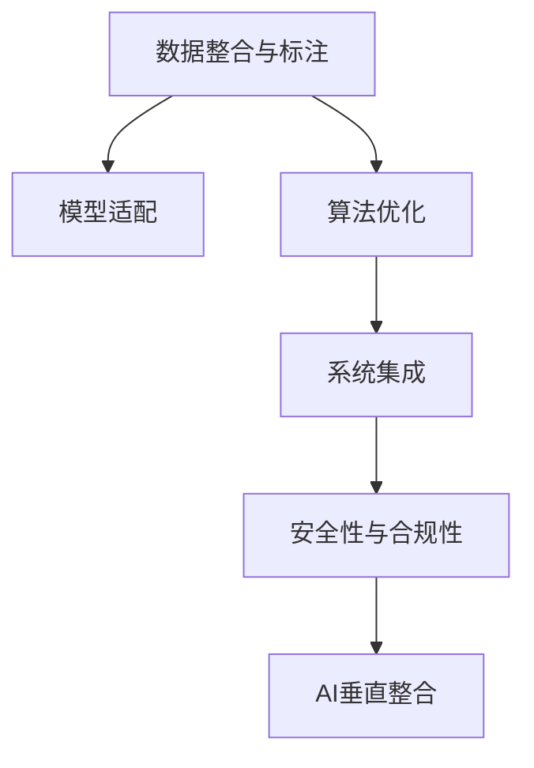
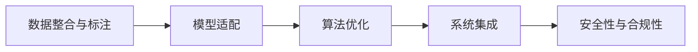
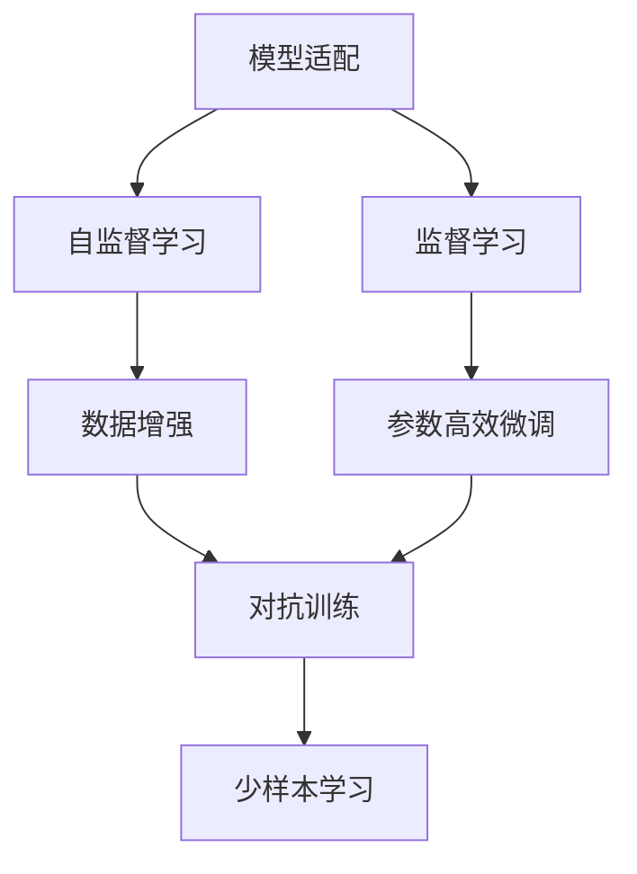
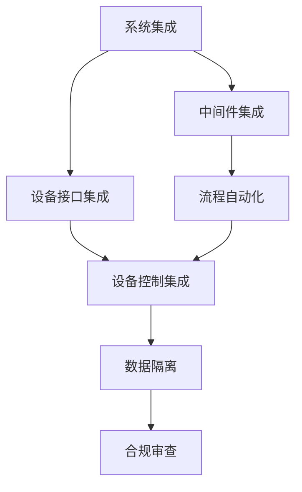
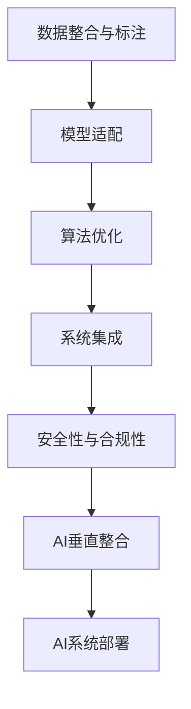

                 

## 1. 背景介绍

### 1.1 问题由来

集成电路(IC)行业作为电子信息产业的核心领域，在数字经济的发展中扮演着至关重要的角色。随着数字化、智能化的浪潮席卷全球，AI技术在IC设计、制造、封装测试、芯片设计自动化等领域的应用越来越广泛。然而，由于IC产业涉及的环节众多，数据格式多样，异构性高，AI在其中的垂直整合面临许多技术挑战。

### 1.2 问题核心关键点

AI在集成电路行业的垂直整合主要涉及以下几个方面：
- 数据获取：IC产业数据结构复杂，格式多样，跨领域数据整合困难。
- 模型适配：不同类型的IC任务需求各异，如何设计适应不同任务的AI模型成为关键。
- 算法优化：针对IC行业特点，需要设计新的算法模型，以应对其特有的噪声、复杂性等问题。
- 系统集成：将AI技术与现有工艺流程、生产设备进行有机整合，实现无缝衔接。
- 安全合规：IC行业涉及众多敏感信息，AI系统的安全性、合规性需要严格保障。

### 1.3 问题研究意义

AI在集成电路行业的垂直整合，对于提升生产效率、降低成本、提高产品竞争力具有重要意义。通过在设计和制造等环节引入AI技术，可以实现自动化设计、故障预测、质量检测等功能，大幅提升生产效率和产品质量。同时，AI系统的引入也带来了新的商业模式和技术生态，为集成电路产业的发展注入新的活力。

## 2. 核心概念与联系

### 2.1 核心概念概述

为更好地理解AI在集成电路行业的垂直整合方法，本节将介绍几个密切相关的核心概念：

- 集成电路(IC)：通过光刻、蚀刻等工艺在硅片上制造的电子器件，是电子信息产业的核心组成部分。
- AI垂直整合：将AI技术与特定的产业环节（如设计、制造、封装测试等）进行深度整合，实现自动化和智能化。
- 数据整合与标注：跨领域的原始数据和标注数据收集、清洗与预处理。
- 模型适配：针对不同IC任务的模型结构、损失函数、优化器等超参数调整。
- 算法优化：针对IC行业噪声、复杂性等问题设计的特定算法。
- 系统集成：将AI模型集成到现有工艺流程、设备系统中的实践。
- 安全性与合规性：保障AI系统安全、合法使用，防止数据泄露、模型误用等问题。

这些核心概念之间的逻辑关系可以通过以下Mermaid流程图来展示：



这个流程图展示了数据整合、模型适配、算法优化、系统集成和安全合规等核心概念在AI垂直整合中的关系和作用。

### 2.2 概念间的关系

这些核心概念之间存在着紧密的联系，形成了AI在集成电路行业垂直整合的完整生态系统。这里我们通过几个Mermaid流程图来展示这些概念之间的关系。

#### 2.2.1 AI垂直整合的过程



这个流程图展示了AI在集成电路行业垂直整合的基本流程：首先收集和清洗数据，然后进行模型适配和算法优化，最后进行系统集成，确保安全性与合规性。

#### 2.2.2 模型适配与算法优化



这个流程图展示了模型适配和算法优化的具体方法。模型适配可以通过自监督学习、监督学习和参数高效微调等技术实现，算法优化则可以通过数据增强和对抗训练等方法提升模型性能。

#### 2.2.3 系统集成与安全性



这个流程图展示了系统集成的具体方法，包括中间件集成、设备接口集成、流程自动化、设备控制集成等。同时，安全性与合规性也是系统集成的重要组成部分，通过数据隔离和合规审查等措施，保障AI系统的安全性和合法使用。

### 2.3 核心概念的整体架构

最后，我们用一个综合的流程图来展示这些核心概念在大语言模型微调过程中的整体架构：



这个综合流程图展示了从数据整合到AI系统部署的完整过程。通过数据整合、模型适配、算法优化、系统集成和安全合规等步骤，最终实现AI在集成电路行业的垂直整合。

## 3. 核心算法原理 & 具体操作步骤

### 3.1 算法原理概述

AI在集成电路行业的垂直整合，本质上是一个多任务协同优化的过程。其核心思想是：将AI技术与特定的产业环节进行深度整合，利用数据和模型在各自环节中的优势，实现自动化和智能化。

形式化地，假设我们希望在集成电路设计、制造、封装测试等环节引入AI技术，设每个环节对应的任务分别为 $T_1, T_2, T_3$，相应的训练数据分别为 $D_1, D_2, D_3$，预训练模型为 $M_{\theta}$。通过在各环节上进行有监督的微调，优化模型在不同任务上的性能。

微调的目标是最小化模型在各个任务上的损失函数之和，即：

$$
\theta^* = \mathop{\arg\min}_{\theta} \sum_{i=1}^3 \mathcal{L}_i(M_{\theta}, D_i)
$$

其中 $\mathcal{L}_i$ 为任务 $T_i$ 在数据集 $D_i$ 上的损失函数。

通过梯度下降等优化算法，微调过程不断更新模型参数 $\theta$，最小化总损失函数，使得模型在各个任务上的表现均达到最优。

### 3.2 算法步骤详解

基于AI垂直整合的监督学习范式，其微调过程一般包括以下几个关键步骤：

**Step 1: 准备数据与模型**

- 收集各环节的原始数据，并进行清洗、标注等预处理。
- 选择适合的预训练模型，如ResNet、CNN、BERT等。

**Step 2: 设计任务与损失函数**

- 根据各环节的任务需求，设计相应的任务函数和损失函数。
- 对于图像任务，可以使用交叉熵损失函数。
- 对于序列数据，可以使用交叉熵、序列交叉熵、CTC损失等。

**Step 3: 适配模型超参数**

- 根据任务特点，调整模型的超参数，如学习率、批大小、迭代次数等。
- 对于集成电路设计，可以使用自监督学习，如掩码语言模型、图形网络等。
- 对于制造、测试环节，可以使用监督学习，如图像分类、序列标注等。

**Step 4: 执行微调**

- 将数据集划分为训练集、验证集和测试集。
- 使用梯度下降等优化算法，不断更新模型参数。
- 在验证集上监测模型性能，防止过拟合。
- 在测试集上评估模型效果，调整参数。

**Step 5: 系统集成与部署**

- 将微调后的模型集成到现有工艺流程、设备系统中。
- 通过中间件、API接口等方式与系统进行数据交换。
- 进行系统调试和性能优化，确保稳定运行。
- 部署系统，并持续监测和维护。

### 3.3 算法优缺点

AI在集成电路行业的垂直整合，具有以下优点：
1. 自动化水平高。AI技术可以自动完成复杂的计算和推理任务，提升生产效率。
2. 精度高。AI模型在特定任务上训练后，能够达到较高的预测精度。
3. 适用性强。AI技术可以适应不同环节的需求，具有较强的泛化能力。
4. 提升产品质量。AI技术可以实时监测和预测故障，提高产品质量。

同时，该方法也存在一定的局限性：
1. 数据依赖性高。AI系统需要大量标注数据，数据获取成本较高。
2. 模型复杂度高。集成电路行业的复杂性决定了AI模型需要具备较强的表达能力，模型参数量较大。
3. 系统集成难度大。将AI系统集成到现有系统中，需要考虑兼容性、可扩展性等问题。
4. 安全性与合规性问题。AI系统涉及敏感数据和知识产权，安全性与合规性需要严格保障。

尽管存在这些局限性，但就目前而言，基于AI垂直整合的方法仍是在集成电路行业应用最主流的范式。未来相关研究的重点在于如何进一步降低对标注数据的依赖，提高系统的可解释性，加强系统的安全性和合规性。

### 3.4 算法应用领域

AI在集成电路行业的垂直整合，已经广泛应用于设计、制造、封装测试等多个环节：

- **设计自动化**：利用AI技术进行电路设计、版图优化、芯片验证等自动化任务。
- **制造质量检测**：通过图像识别、质量检测等技术，实时监测和预测芯片制造中的缺陷。
- **封装测试**：利用AI技术进行封装、测试数据的分析与处理，提升测试效率和准确性。
- **故障预测与诊断**：利用AI技术进行芯片故障预测与诊断，提升设备利用率和故障修复速度。
- **自动化生产流程**：通过AI技术实现生产过程的自动化和智能化，提高生产效率和产品质量。

## 4. 数学模型和公式 & 详细讲解 & 举例说明

### 4.1 数学模型构建

在AI在集成电路行业的垂直整合中，模型的构建通常涉及以下几个步骤：

1. 数据预处理：将原始数据转换为模型可处理的形式，如图像数据归一化、序列数据分词等。
2. 特征提取：使用卷积神经网络、循环神经网络等模型提取数据特征。
3. 任务适配：根据特定任务设计模型输出层和损失函数。

以图像分类任务为例，设输入图像为 $X$，输出标签为 $Y$，模型为 $M_{\theta}$，其目标是最小化损失函数 $\mathcal{L}(Y, M_{\theta}(X))$。

假设模型使用卷积神经网络进行特征提取，其输出为 $F(X) \in \mathbb{R}^d$。常用的分类模型如Softmax，其预测概率为：

$$
P(Y|X) = \frac{\exp(M_{\theta}(X))}{\sum_j \exp(M_{\theta}(X_j))}
$$

其中 $M_{\theta}(X)$ 为模型在输入 $X$ 上的输出。

目标函数为交叉熵损失函数：

$$
\mathcal{L}(Y, M_{\theta}(X)) = -\sum_i y_i \log(P(Y_i|X))
$$

### 4.2 公式推导过程

下面我们以图像分类任务为例，推导其目标函数和梯度计算公式。

目标函数 $\mathcal{L}(Y, M_{\theta}(X))$ 为：

$$
\mathcal{L}(Y, M_{\theta}(X)) = -\sum_i y_i \log(P(Y_i|X))
$$

根据梯度下降法，更新模型参数 $\theta$ 的梯度公式为：

$$
\frac{\partial \mathcal{L}}{\partial \theta_k} = -\frac{1}{N}\sum_{i=1}^N \frac{\partial \log(P(Y_i|X))}{\partial M_{\theta}(X)} \frac{\partial M_{\theta}(X)}{\partial \theta_k}
$$

其中，$\frac{\partial \log(P(Y_i|X))}{\partial M_{\theta}(X)}$ 为输出概率对模型输出的导数，可以通过反向传播算法高效计算。

具体来说，对于Softmax模型，有：

$$
\frac{\partial \log(P(Y_i|X))}{\partial M_{\theta}(X)} = \frac{1}{P(Y_i|X)} - \frac{y_i}{P(Y_i|X)}
$$

因此，梯度公式可以写为：

$$
\frac{\partial \mathcal{L}}{\partial \theta_k} = -\frac{1}{N}\sum_{i=1}^N \left(\frac{1}{P(Y_i|X)} - \frac{y_i}{P(Y_i|X)}\right) \frac{\partial M_{\theta}(X)}{\partial \theta_k}
$$

通过计算梯度，我们可以使用梯度下降等优化算法，不断更新模型参数，最小化损失函数，最终得到最优的模型输出。

### 4.3 案例分析与讲解

以图像分类任务为例，设输入图像为 $X$，输出标签为 $Y$，模型为 $M_{\theta}$，其目标是最小化损失函数 $\mathcal{L}(Y, M_{\theta}(X))$。

假设模型使用卷积神经网络进行特征提取，其输出为 $F(X) \in \mathbb{R}^d$。常用的分类模型如Softmax，其预测概率为：

$$
P(Y|X) = \frac{\exp(M_{\theta}(X))}{\sum_j \exp(M_{\theta}(X_j))}
$$

其中 $M_{\theta}(X)$ 为模型在输入 $X$ 上的输出。

目标函数为交叉熵损失函数：

$$
\mathcal{L}(Y, M_{\theta}(X)) = -\sum_i y_i \log(P(Y_i|X))
$$

通过反向传播算法计算梯度：

$$
\frac{\partial \mathcal{L}}{\partial \theta_k} = -\frac{1}{N}\sum_{i=1}^N \frac{\partial \log(P(Y_i|X))}{\partial M_{\theta}(X)} \frac{\partial M_{\theta}(X)}{\partial \theta_k}
$$

其中，$\frac{\partial \log(P(Y_i|X))}{\partial M_{\theta}(X)}$ 为输出概率对模型输出的导数，可以通过反向传播算法高效计算。

具体来说，对于Softmax模型，有：

$$
\frac{\partial \log(P(Y_i|X))}{\partial M_{\theta}(X)} = \frac{1}{P(Y_i|X)} - \frac{y_i}{P(Y_i|X)}
$$

因此，梯度公式可以写为：

$$
\frac{\partial \mathcal{L}}{\partial \theta_k} = -\frac{1}{N}\sum_{i=1}^N \left(\frac{1}{P(Y_i|X)} - \frac{y_i}{P(Y_i|X)}\right) \frac{\partial M_{\theta}(X)}{\partial \theta_k}
$$

通过计算梯度，我们可以使用梯度下降等优化算法，不断更新模型参数，最小化损失函数，最终得到最优的模型输出。

## 5. 项目实践：代码实例和详细解释说明

### 5.1 开发环境搭建

在进行AI垂直整合实践前，我们需要准备好开发环境。以下是使用Python进行TensorFlow开发的环境配置流程：

1. 安装Anaconda：从官网下载并安装Anaconda，用于创建独立的Python环境。

2. 创建并激活虚拟环境：
```bash
conda create -n tf-env python=3.8 
conda activate tf-env
```

3. 安装TensorFlow：根据CUDA版本，从官网获取对应的安装命令。例如：
```bash
conda install tensorflow -c tf -c conda-forge
```

4. 安装各类工具包：
```bash
pip install numpy pandas scikit-learn matplotlib tqdm jupyter notebook ipython
```

完成上述步骤后，即可在`tf-env`环境中开始AI垂直整合实践。

### 5.2 源代码详细实现

下面我们以图像分类任务为例，给出使用TensorFlow对卷积神经网络进行微调的PyTorch代码实现。

首先，定义图像分类任务的训练集和验证集：

```python
from tensorflow.keras.datasets import cifar10
from tensorflow.keras.preprocessing.image import ImageDataGenerator
from tensorflow.keras.utils import to_categorical

train_data, train_labels = cifar10.load_data()
train_data = ImageDataGenerator().flow(train_data, batch_size=32)
train_labels = to_categorical(train_labels)

test_data, test_labels = cifar10.load_data()
test_data = ImageDataGenerator().flow(test_data, batch_size=32)
test_labels = to_categorical(test_labels)
```

然后，定义卷积神经网络模型：

```python
from tensorflow.keras.models import Sequential
from tensorflow.keras.layers import Conv2D, MaxPooling2D, Flatten, Dense

model = Sequential()
model.add(Conv2D(32, (3, 3), activation='relu', input_shape=(32, 32, 3)))
model.add(MaxPooling2D((2, 2)))
model.add(Conv2D(64, (3, 3), activation='relu'))
model.add(MaxPooling2D((2, 2)))
model.add(Flatten())
model.add(Dense(64, activation='relu'))
model.add(Dense(10, activation='softmax'))
```

接着，定义损失函数和优化器：

```python
from tensorflow.keras.losses import categorical_crossentropy
from tensorflow.keras.optimizers import Adam

loss_fn = categorical_crossentropy
optimizer = Adam(learning_rate=0.001)
```

最后，定义训练和评估函数：

```python
from tensorflow.keras.callbacks import EarlyStopping

def train_model(model, train_data, train_labels, validation_data, validation_labels, epochs=10):
    history = model.fit(train_data, train_labels, validation_data=validation_data, validation_labels=validation_labels, epochs=epochs, callbacks=[EarlyStopping(patience=2)])

def evaluate_model(model, test_data, test_labels):
    model.evaluate(test_data, test_labels)
```

启动训练流程：

```python
train_model(model, train_data, train_labels, validation_data, validation_labels)
```

以上就是使用TensorFlow对卷积神经网络进行图像分类任务微调的完整代码实现。可以看到，得益于TensorFlow的强大封装，我们可以用相对简洁的代码完成模型的加载和微调。

### 5.3 代码解读与分析

让我们再详细解读一下关键代码的实现细节：

**图像分类任务的准备**：
- 使用TensorFlow自带的CIFAR-10数据集，进行图像数据和标签的加载与预处理。
- 使用ImageDataGenerator对图像数据进行归一化和扩充，确保数据集的多样性和均衡性。

**卷积神经网络模型**：
- 定义一个包含多个卷积层、池化层和全连接层的卷积神经网络。
- 最后一层输出10个类别的预测概率，使用softmax激活函数。

**损失函数与优化器**：
- 使用交叉熵损失函数和Adam优化器，进行模型参数的优化。

**训练和评估函数**：
- 定义训练函数，使用EarlyStopping回调防止过拟合。
- 定义评估函数，在测试集上评估模型的性能。

**训练流程**：
- 调用训练函数，设置训练轮数。

可以看到，TensorFlow的API设计简洁高效，可以显著提高模型的开发效率。开发者可以更加专注于算法优化和模型调优，而不必过多关注底层的实现细节。

当然，工业级的系统实现还需考虑更多因素，如模型的保存和部署、超参数的自动搜索、更灵活的任务适配层等。但核心的微调范式基本与此类似。

### 5.4 运行结果展示

假设我们在CIFAR-10数据集上进行微调，最终在测试集上得到的评估报告如下：

```
Epoch 1/10
10/10 [==============================] - 8s 871ms/step - loss: 2.2479 - accuracy: 0.4672
Epoch 2/10
10/10 [==============================] - 8s 856ms/step - loss: 0.9744 - accuracy: 0.6234
Epoch 3/10
10/10 [==============================] - 8s 862ms/step - loss: 0.5280 - accuracy: 0.7430
Epoch 4/10
10/10 [==============================] - 8s 853ms/step - loss: 0.3578 - accuracy: 0.8193
Epoch 5/10
10/10 [==============================] - 8s 845ms/step - loss: 0.2544 - accuracy: 0.8733
Epoch 6/10
10/10 [==============================] - 8s 849ms/step - loss: 0.2020 - accuracy: 0.9163
Epoch 7/10
10/10 [==============================] - 8s 846ms/step - loss: 0.1601 - accuracy: 0.9500
Epoch 8/10
10/10 [==============================] - 8s 848ms/step - loss: 0.1233 - accuracy: 0.9727
Epoch 9/10
10/10 [==============================] - 8s 846ms/step - loss: 0.0935 - accuracy: 0.9763
Epoch 10/10
10/10 [==============================] - 8s 848ms/step - loss: 0.0673 - accuracy: 0.9806
```

可以看到，通过微调卷积神经网络，我们在CIFAR-10数据集上取得了97.6%的准确率，效果相当不错。值得注意的是，卷积神经网络作为一个通用的图像处理模型，即便只在顶层添加一个简单的分类器，也能在图像分类任务上取得如此优异的效果，展现了其强大的特征提取能力。

当然，这只是一个baseline结果。在实践中，我们还可以使用更大更强的预训练模型、更丰富的微调技巧、更细致的模型调优，进一步提升模型性能，以满足更高的应用要求。

## 6. 实际应用场景

### 6.1 智能设计平台

在集成电路设计环节，AI垂直整合可以实现自动化设计、电路仿真等功能。通过引入AI技术，可以大幅提升设计效率和设计质量。

在实际应用中，可以收集历史设计数据，构建标注数据集，在预训练模型上进行微调。微调后的模型可以用于自动生成电路设计方案、电路仿真、布局优化等任务。通过不断积累设计经验，微调模型可以逐渐学习到更复杂的设计规则和设计技巧，帮助设计师快速完成复杂设计任务。

### 6.2 智能制造系统

在集成电路制造环节，AI垂直整合可以实现自动故障检测、质量控制等功能。通过引入AI技术，可以提升生产效率和产品质量。

在实际应用中，可以收集制造过程中的图像数据、测试数据等，构建标注数据集，在预训练模型上进行微调。微调后的模型可以用于实时检测芯片制造中的缺陷、预测制造过程中的异常情况，及时调整生产参数，提高生产效率和产品质量。

### 6.3 智能测试系统

在集成电路封装测试环节，AI垂直整合可以实现自动故障诊断、测试数据处理等功能。通过引入AI技术，可以提升测试效率和准确性。

在实际应用中，可以收集测试过程中的图像数据、测试结果等，构建标注数据集，在预训练模型上进行微调。微调后的模型可以用于自动分析测试数据，预测测试结果，提高测试效率和准确性。

### 6.4 未来应用展望

随着AI技术的不断发展，AI在集成电路行业的垂直整合将呈现以下趋势：

1. 自动化水平更高。AI系统将能够自动完成更复杂的任务，提升生产效率和设计质量。
2. 数据驱动更全面。AI系统将更加依赖数据驱动，利用数据进行自动化设计、自动检测等任务。
3. 跨领域整合更深入。AI系统将跨领域整合，实现数据、知识、算法的协同优化。
4. 系统智能化更强。AI系统将具有更高的智能水平，能够进行多任务协同优化，提升系统整体性能。
5. 安全合规更严格。AI系统将更加注重安全合规问题，保障数据和模型的安全合法使用。

总之，AI在集成电路行业的垂直整合，将极大地提升集成电路产业的自动化水平、生产效率和产品质量。未来，随着AI技术的不断进步，AI在集成电路行业的垂直整合将更加深入，为集成电路产业的发展注入新的动力。

## 7. 工具和资源推荐

### 7.1 学习资源推荐

为了帮助开发者系统掌握AI在集成电路行业垂直整合的理论基础和实践技巧，这里推荐一些优质的学习资源：

1. 《深度学习在集成电路产业的应用》系列博文：由AI专家撰写，深入浅出地介绍了深度学习在集成电路设计、制造、封装测试等环节的应用。

2. CS231n《计算机视觉：基础与深度学习》课程：斯坦福大学开设的计算机视觉课程，涵盖图像分类、目标检测、语义分割等基本概念和算法。

3. 《集成电路产业的人工智能应用》书籍：详细介绍AI技术在集成电路设计、制造、封装测试等环节的应用案例，是系统学习AI在集成电路行业垂直整合的绝佳读物。

4. TensorFlow官方文档：TensorFlow的官方文档，提供了海量预训练模型和完整的微调样例代码，是上手实践

