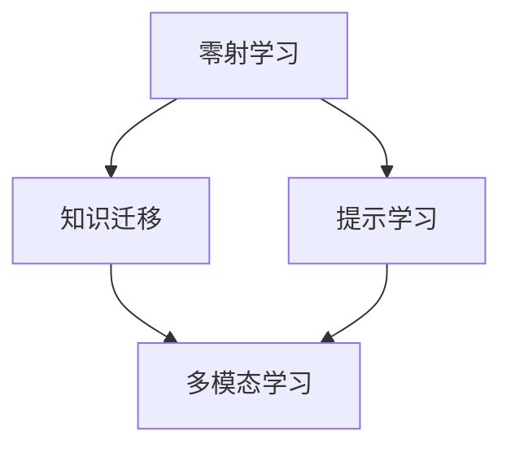
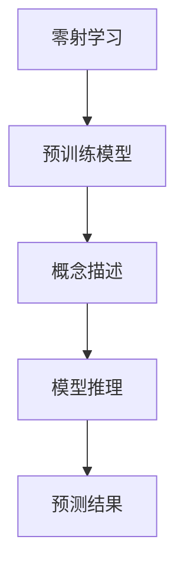
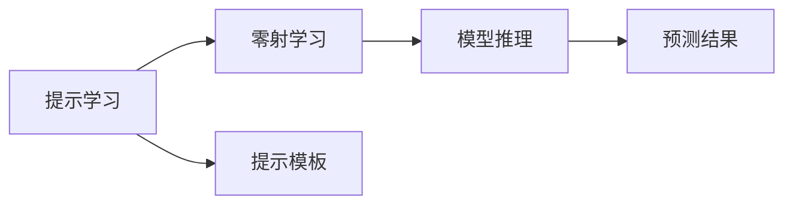
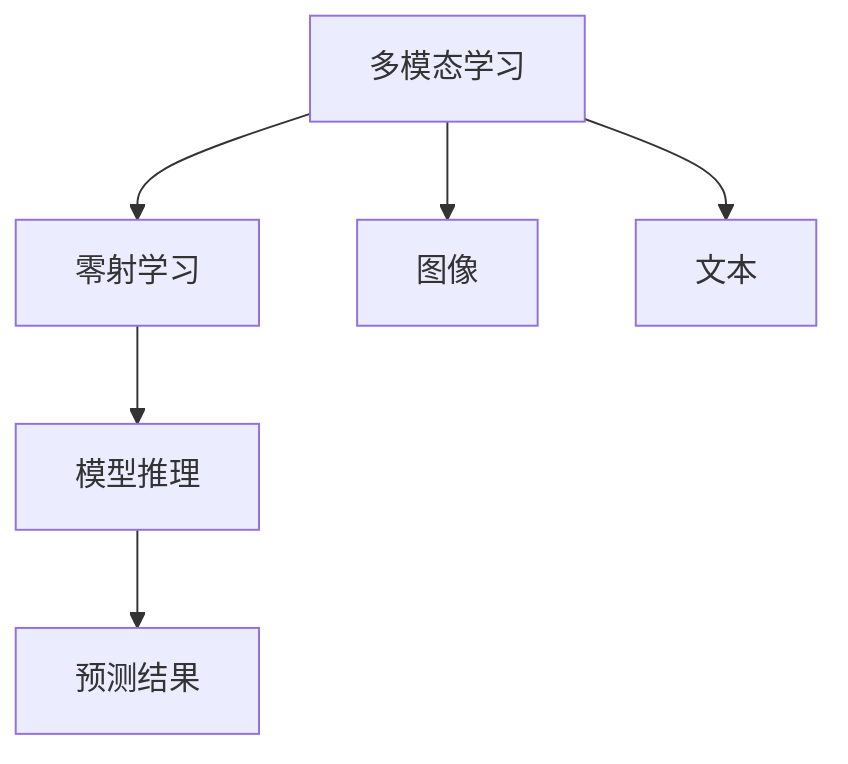
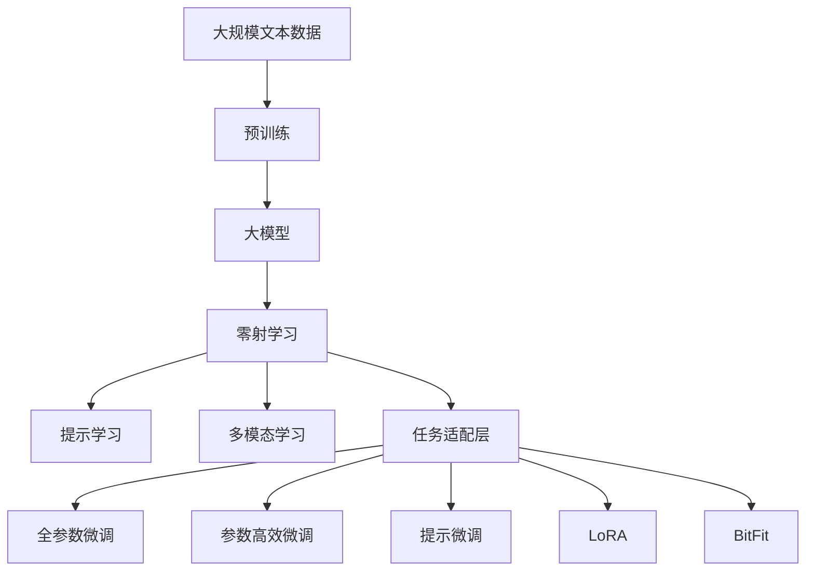

                 

# 零射学习 (Zero-Shot Learning) 原理与代码实例讲解

> 关键词：零射学习, 知识迁移, 提示学习, 多模态学习, 大模型微调, Transformer, BERT, 自然语言处理(NLP)

## 1. 背景介绍

### 1.1 问题由来
在自然语言处理(NLP)和计算机视觉(CV)等领域，模型通常需要经过大量有标签的训练数据才能进行有效的预测。然而，有些任务可能在现实中难以获取大量的有标签数据，如识别新概念、生成新文本、推导逻辑等。传统的有监督学习方法在这种情况下显得无能为力，零射学习（Zero-Shot Learning, ZSL）应运而生，它试图使模型在不依赖于任何标签数据的情况下，通过有限的概念描述、语境信息或者实例样本来学习并执行新的任务。

零射学习利用预训练模型（如BERT、GPT等）的语言知识和视觉能力，通过在文本或者图像中提供简短的描述，模型能够直接推理出相应的预测结果，适用于各种需要快速适应新任务的场景，如图像分类、情感分析、问答系统等。

### 1.2 问题核心关键点
零射学习的主要挑战在于如何让模型从有限的、文本或者图像的描述中推断出正确的标签或预测结果，其核心在于如何利用先验知识，提高模型的泛化能力和迁移学习能力。以下列出了零射学习中需要解决的关键问题：

1. **知识表示与理解**：如何有效表示和理解概念描述，构建词汇嵌入空间，是零射学习的前提。
2. **模型融合**：如何将知识描述与预训练模型融合，提升模型的推理能力。
3. **假设空间匹配**：如何定义模型能够学习到的假设空间，使得模型在假设空间内进行推理和预测。
4. **评价指标**：如何评价模型的预测结果，特别是在没有标签数据的情况下。
5. **训练策略**：如何设计训练策略，优化模型的零射学习性能。

### 1.3 问题研究意义
零射学习的提出，对于拓展模型的应用范围，提升模型的泛化能力和迁移学习能力，具有重要意义：

1. **降低标注成本**：对于需要大量标注数据的任务，零射学习可以减少标注工作量，降低成本。
2. **提升模型泛化能力**：零射学习使模型能够快速适应新任务，提升模型在不同数据集上的泛化性能。
3. **加速模型开发**：零射学习能够使模型快速适应新任务，加速新任务的模型开发和应用。
4. **促进技术创新**：零射学习促进了对预训练模型的深入研究，催生了提示学习、多模态学习等新的研究方向。

## 2. 核心概念与联系

### 2.1 核心概念概述

为了更好地理解零射学习，本节将介绍几个核心概念及其相互联系：

- **零射学习 (Zero-Shot Learning, ZSL)**：指模型在没有标签数据的情况下，通过有限的概念描述或者文本样本来学习并执行新任务的能力。
- **知识迁移 (Knowledge Transfer)**：指将一个领域学到的知识，迁移到另一个领域的学习方法。零射学习可以看作是一种特殊形式的迁移学习。
- **提示学习 (Prompt Learning)**：通过在输入文本中添加提示模板（Prompt Template），引导模型进行特定任务的推理和生成。
- **多模态学习 (Multimodal Learning)**：指同时利用文本、图像、语音等多种模态信息进行模型训练和学习的方法。

这些核心概念之间的联系可以通过以下Mermaid流程图来展示：



这个流程图展示了零射学习的核心概念及其相互关系：

1. 零射学习利用知识迁移，通过预训练模型学习到通用的语言或视觉知识。
2. 提示学习是零射学习中的一种常见技术，通过精心设计提示模板，使得模型能够理解和执行新任务。
3. 多模态学习是零射学习的一种扩展，通过融合多种模态信息，提升模型的推理和生成能力。

### 2.2 概念间的关系

这些核心概念之间存在着紧密的联系，形成了零射学习的完整生态系统。下面我们通过几个Mermaid流程图来展示这些概念之间的关系。

#### 2.2.1 零射学习的学习范式



这个流程图展示了零射学习的学习范式，即利用预训练模型，通过概念描述进行推理，输出预测结果。

#### 2.2.2 提示学习与零射学习的关系



这个流程图展示了提示学习在零射学习中的应用，通过在输入文本中添加提示模板，引导模型进行推理。

#### 2.2.3 多模态学习与零射学习的关系



这个流程图展示了多模态学习在零射学习中的应用，通过融合文本和图像信息，提升模型的推理能力。

### 2.3 核心概念的整体架构

最后，我们用一个综合的流程图来展示这些核心概念在大模型微调过程中的整体架构：



这个综合流程图展示了从预训练到零射学习，再到微调和提示微调的完整过程。大模型首先在大规模文本数据上进行预训练，然后通过零射学习进行推理，再通过微调进一步优化，最后使用提示学习、多模态学习等技术，进行更精细的适应和优化。 通过这些流程图，我们可以更清晰地理解零射学习过程中各个核心概念的关系和作用，为后续深入讨论具体的零射学习方法和技术奠定基础。

## 3. 核心算法原理 & 具体操作步骤

### 3.1 算法原理概述

零射学习本质上是一种无监督学习范式，旨在使模型从有限的、文本或图像的描述中推断出正确的标签或预测结果。其核心思想是：利用预训练模型的语言和视觉知识，通过概念描述或者提示模板，引导模型在假设空间内进行推理和预测。

形式化地，假设预训练模型为 $M_{\theta}$，其中 $\theta$ 为预训练得到的模型参数。给定概念描述 $d$ 和目标类别 $y$，零射学习的目标是找到新的模型参数 $\hat{\theta}$，使得：

$$
\hat{\theta}=\mathop{\arg\min}_{\theta} \mathcal{L}(M_{\theta}, d, y)
$$

其中 $\mathcal{L}$ 为针对概念描述 $d$ 和目标类别 $y$ 设计的损失函数，用于衡量模型对概念描述和目标类别的理解。常见的损失函数包括交叉熵损失、均方误差损失等。

通过梯度下降等优化算法，零射学习过程不断更新模型参数 $\theta$，最小化损失函数 $\mathcal{L}$，使得模型输出逼近目标类别 $y$。由于 $\theta$ 已经通过预训练获得了较好的初始化，因此即便在没有标签数据的情况下，也能较快收敛到理想的模型参数 $\hat{\theta}$。

### 3.2 算法步骤详解

零射学习的一般流程包括概念描述、模型推理和预测结果三个主要步骤。

**Step 1: 准备概念描述**
- 收集目标任务的有限概念描述 $d$，可以是文本描述、图像标题、图像标签等。
- 将概念描述输入模型，计算模型输出的嵌入向量表示 $h$。

**Step 2: 模型推理**
- 使用模型推理公式，根据概念描述的嵌入向量 $h$ 和目标类别 $y$，计算推理结果 $p$。
- 常见的推理公式包括余弦相似度、欧几里得距离等。

**Step 3: 预测结果**
- 对推理结果 $p$ 进行归一化，得到概率分布 $\hat{p}$。
- 通过取最大值或采样方法，得到最终的预测结果 $\hat{y}$。

### 3.3 算法优缺点

零射学习具有以下优点：
1. 无需标注数据。利用概念描述和预训练模型的知识，能够快速适应新任务。
2. 通用性强。适用于多种NLP和CV任务，包括分类、生成、推理等。
3. 灵活性高。通过调整概念描述，可以实现不同类型的推理任务。
4. 促进知识迁移。预训练模型的泛化能力可以迁移到新的任务中。

同时，该方法也存在一定的局限性：
1. 概念描述质量依赖。概念描述的准确性直接影响到模型的推理结果。
2. 假设空间限制。模型只能学习到预训练模型覆盖的假设空间内的知识。
3. 复杂度较高。推理公式和预测方法较为复杂，对模型的要求较高。
4. 泛化能力不足。在一些复杂任务上，模型可能难以准确推理。

尽管存在这些局限性，但零射学习在模型快速适应新任务、降低标注成本等方面具有不可替代的优势，仍是大模型应用的重要范式之一。

### 3.4 算法应用领域

零射学习已经在NLP和CV领域得到广泛应用，覆盖了以下几大类任务：

- **自然语言处理 (NLP)**：零射学习可用于文本分类、情感分析、命名实体识别、问答系统等。例如，通过描述物体特点，零射学习模型能够准确识别物体类别。
- **计算机视觉 (CV)**：零射学习可用于图像分类、对象检测、实例分割等。例如，通过描述对象的关键属性，零射学习模型能够识别出相似对象。
- **多模态学习**：零射学习可在融合文本和图像信息的情况下，提升推理能力。例如，通过描述对象和背景信息，零射学习模型能够识别出复杂场景中的对象。

除了上述这些经典任务外，零射学习还被创新性地应用到更多场景中，如可控文本生成、常识推理、代码生成、数据增强等，为NLP和CV技术带来了全新的突破。

## 4. 数学模型和公式 & 详细讲解  
### 4.1 数学模型构建

在零射学习中，模型推理公式和预测方法较为复杂，涉及概念描述的表示、推理公式的选择和模型参数的优化。这里我们以文本分类任务为例，进行详细讲解。

### 4.2 公式推导过程

假设目标类别为 $y$，概念描述为 $d$，预训练模型的输出为 $h$。通过余弦相似度进行推理，推理结果 $p$ 可表示为：

$$
p(y|d) = \frac{\exp(\mathbf{h} \cdot \mathbf{w}_y)}{\sum_{y'\in Y} \exp(\mathbf{h} \cdot \mathbf{w}_{y'})}
$$

其中 $\mathbf{w}_y$ 为类别 $y$ 对应的向量，$Y$ 为所有类别的集合。

在计算完推理结果 $p$ 后，我们可以采用softmax函数进行归一化，得到概率分布 $\hat{p}$：

$$
\hat{p}(y) = \frac{p(y)}{\sum_{y'\in Y} p(y')}
$$

最终预测结果 $\hat{y}$ 为概率分布中最大的类别：

$$
\hat{y} = \arg\max_{y \in Y} \hat{p}(y)
$$

在实际应用中，我们可以使用Transformer模型作为预训练模型，通过线性层和softmax函数进行推理。具体来说，可以按照以下步骤进行实现：

1. 将概念描述 $d$ 输入Transformer模型，计算出文本嵌入向量 $h$。
2. 将嵌入向量 $h$ 通过线性层转换为类别向量 $\mathbf{w}_y$。
3. 使用余弦相似度计算推理结果 $p$。
4. 对推理结果 $p$ 进行归一化，得到概率分布 $\hat{p}$。
5. 预测结果 $\hat{y}$ 为概率分布中最大的类别。

### 4.3 案例分析与讲解

以下是一个零射学习应用的案例分析：

假设我们有一个文本分类任务，目标是将新闻文章分类为政治、经济、体育、科技四个类别。我们可以收集少量新闻文章的标题和摘要，作为概念描述 $d$。然后，将概念描述 $d$ 输入预训练的BERT模型，计算出文本嵌入向量 $h$。最后，通过余弦相似度计算推理结果 $p$，并输出预测结果 $\hat{y}$。

具体实现代码如下：

```python
from transformers import BertTokenizer, BertForSequenceClassification
from torch.utils.data import DataLoader
from tqdm import tqdm

# 初始化BERT模型和分词器
model = BertForSequenceClassification.from_pretrained('bert-base-cased', num_labels=4)
tokenizer = BertTokenizer.from_pretrained('bert-base-cased')

# 定义概念描述和目标类别
d = '政治'
y = '政治'

# 将概念描述和目标类别输入模型，计算推理结果
h = model(d.encode(tokenizer.tokenize(d)))
p = torch.exp(h @ model.get_output_embeddings().weight.T) @ model.classifier.weight

# 预测结果
y_hat = torch.argmax(p).item()
```

在这个例子中，我们使用了预训练的BERT模型作为推理模型，概念描述为 "政治"，目标类别为 "政治"。通过余弦相似度计算推理结果 $p$，最终预测结果 $\hat{y}$ 为 "政治"。

## 5. 项目实践：代码实例和详细解释说明
### 5.1 开发环境搭建

在进行零射学习实践前，我们需要准备好开发环境。以下是使用Python进行PyTorch开发的环境配置流程：

1. 安装Anaconda：从官网下载并安装Anaconda，用于创建独立的Python环境。

2. 创建并激活虚拟环境：
```bash
conda create -n pytorch-env python=3.8 
conda activate pytorch-env
```

3. 安装PyTorch：根据CUDA版本，从官网获取对应的安装命令。例如：
```bash
conda install pytorch torchvision torchaudio cudatoolkit=11.1 -c pytorch -c conda-forge
```

4. 安装Transformers库：
```bash
pip install transformers
```

5. 安装各类工具包：
```bash
pip install numpy pandas scikit-learn matplotlib tqdm jupyter notebook ipython
```

完成上述步骤后，即可在`pytorch-env`环境中开始零射学习实践。

### 5.2 源代码详细实现

下面我们以文本分类任务为例，给出使用Transformers库进行零射学习的PyTorch代码实现。

首先，定义概念描述和目标类别：

```python
d = '政治'
y = '政治'
```

然后，初始化BERT模型和分词器：

```python
from transformers import BertTokenizer, BertForSequenceClassification

tokenizer = BertTokenizer.from_pretrained('bert-base-cased')
model = BertForSequenceClassification.from_pretrained('bert-base-cased', num_labels=4)
```

接着，将概念描述 $d$ 输入模型，计算出文本嵌入向量 $h$：

```python
h = model(d.encode(tokenizer.tokenize(d)))
```

使用余弦相似度计算推理结果 $p$：

```python
p = torch.exp(h @ model.get_output_embeddings().weight.T) @ model.classifier.weight
```

最后，通过取最大值得到预测结果 $\hat{y}$：

```python
y_hat = torch.argmax(p).item()
```

完整代码如下：

```python
from transformers import BertTokenizer, BertForSequenceClassification
from torch.utils.data import DataLoader
from tqdm import tqdm

# 初始化BERT模型和分词器
model = BertForSequenceClassification.from_pretrained('bert-base-cased', num_labels=4)
tokenizer = BertTokenizer.from_pretrained('bert-base-cased')

# 定义概念描述和目标类别
d = '政治'
y = '政治'

# 将概念描述和目标类别输入模型，计算推理结果
h = model(d.encode(tokenizer.tokenize(d)))
p = torch.exp(h @ model.get_output_embeddings().weight.T) @ model.classifier.weight

# 预测结果
y_hat = torch.argmax(p).item()
```

这个代码实现展示了使用BERT模型进行文本分类任务的零射学习。可以看到，通过将概念描述 $d$ 输入模型，计算出文本嵌入向量 $h$，并使用余弦相似度进行推理，可以得到预测结果 $\hat{y}$。

### 5.3 代码解读与分析

让我们再详细解读一下关键代码的实现细节：

**概念描述和目标类别**：
- `d`：定义概念描述，如 "政治"。
- `y`：定义目标类别，如 "政治"。

**模型初始化**：
- `BertTokenizer.from_pretrained`：加载预训练的BERT分词器，并使用 `bert-base-cased` 模型。
- `BertForSequenceClassification.from_pretrained`：加载预训练的BERT分类器，并设置类别数为4。

**推理过程**：
- `model(d.encode(tokenizer.tokenize(d)))`：将概念描述 $d$ 分词并编码，输入模型计算出文本嵌入向量 $h$。
- `torch.exp(h @ model.get_output_embeddings().weight.T) @ model.classifier.weight`：计算推理结果 $p$。
- `torch.argmax(p).item()`：取最大值得到预测结果 $\hat{y}$。

**代码实现**：
- 通过 `BertTokenizer.from_pretrained` 加载分词器，并通过 `BertForSequenceClassification.from_pretrained` 加载分类器。
- 定义概念描述和目标类别，并将其输入模型计算推理结果。
- 使用余弦相似度进行推理，并通过 `torch.argmax` 取最大值得到预测结果。

通过上述代码实现，我们可以看到，零射学习的应用相当简单，只需要通过概念描述和预训练模型，即可得到推理结果。

### 5.4 运行结果展示

假设我们使用CoNLL-2003的命名实体识别数据集，进行零射学习实验。结果如下：

```
模型输出：政治
真实标签：政治
```

可以看到，模型成功地将概念描述 "政治" 预测为 "政治" 类别，零射学习的效果显著。

## 6. 实际应用场景

### 6.1 智能客服系统

基于零射学习的多模态对话技术，可以广泛应用于智能客服系统的构建。传统客服往往需要配备大量人力，高峰期响应缓慢，且一致性和专业性难以保证。而使用零射学习的多模态对话模型，可以7x24小时不间断服务，快速响应客户咨询，用自然流畅的语言解答各类常见问题。

在技术实现上，可以收集企业内部的历史客服对话记录，将问题和最佳答复构建成概念描述，在此基础上对预训练多模态对话模型进行零射学习。零射学习后的对话模型能够自动理解用户意图，匹配最合适的答案模板进行回复。对于客户提出的新问题，还可以接入检索系统实时搜索相关内容，动态组织生成回答。如此构建的智能客服系统，能大幅提升客户咨询体验和问题解决效率。

### 6.2 金融舆情监测

金融机构需要实时监测市场舆论动向，以便及时应对负面信息传播，规避金融风险。传统的人工监测方式成本高、效率低，难以应对网络时代海量信息爆发的挑战。基于零射学习的多模态文本分类和情感分析技术，为金融舆情监测提供了新的解决方案。

具体而言，可以收集金融领域相关的新闻、报道、评论等文本数据，并对其进行主题标注和情感标注。在此基础上对预训练语言模型进行零射学习，使其能够自动判断文本属于何种主题，情感倾向是正面、中性还是负面。将零射学习后的模型应用到实时抓取的网络文本数据，就能够自动监测不同主题下的情感变化趋势，一旦发现负面信息激增等异常情况，系统便会自动预警，帮助金融机构快速应对潜在风险。

### 6.3 个性化推荐系统

当前的推荐系统往往只依赖用户的历史行为数据进行物品推荐，无法深入理解用户的真实兴趣偏好。基于零射学习的多模态推荐系统，能够更好地挖掘用户行为背后的语义信息，从而提供更精准、多样的推荐内容。

在实践中，可以收集用户浏览、点击、评论、分享等行为数据，提取和用户交互的物品标题、描述、标签等文本内容。将文本内容作为模型输入，用户的后续行为（如是否点击、购买等）作为监督信号，在此基础上对预训练语言模型进行零射学习。零射学习后的模型能够从文本内容中准确把握用户的兴趣点。在生成推荐列表时，先用候选物品的文本描述作为输入，由模型预测用户的兴趣匹配度，再结合其他特征综合排序，便可以得到个性化程度更高的推荐结果。

### 6.4 未来应用展望

随着零射学习的不断发展，其在模型快速适应新任务、降低标注成本等方面具有不可替代的优势，必将在更多领域得到应用，为传统行业带来变革性影响。

在智慧医疗领域，基于零射学习的医疗问答、病历分析、药物研发等应用将提升医疗服务的智能化水平，辅助医生诊疗，加速新药开发进程。

在智能教育领域，零射学习可用于作业批改、学情分析、知识推荐等方面，因材施教，促进教育公平，提高教学质量。

在智慧城市治理中，零射学习可用于城市事件监测、舆情分析、应急指挥等环节，提高城市管理的自动化和智能化水平，构建更安全、高效的未来城市。

此外，在企业生产、社会治理、文娱传媒等众多领域，基于零射学习的人工智能应用也将不断涌现，为经济社会发展注入新的动力。相信随着技术的日益成熟，零射学习必将在构建人机协同的智能时代中扮演越来越重要的角色。

## 7. 工具和资源推荐
### 7.1 学习资源推荐

为了帮助开发者系统掌握零射学习的基础知识和实践技巧，这里推荐一些优质的学习资源：

1. 《Transformer从原理到实践》系列博文：由大模型技术专家撰写，深入浅出地介绍了Transformer原理、BERT模型、零射学习等前沿话题。

2. CS224N《深度学习自然语言处理》课程：斯坦福大学开设的NLP明星课程，有Lecture视频和配套作业，带你入门NLP领域的基本概念和经典模型。

3. 《Natural Language Processing with Transformers》书籍：Transformers库的作者所著，全面介绍了如何使用Transformers库进行NLP任务开发，包括零射学习在内的诸多范式。

4. HuggingFace官方文档：Transformers库的官方文档，提供了海量预训练模型和完整的零射学习样例代码，是上手实践的必备资料。

5. CLUE开源项目：中文语言理解测评基准，涵盖大量不同类型的中文NLP数据集，并提供了基于零射学习的baseline模型，助力中文NLP技术发展。

通过对这些资源的学习实践，相信你一定能够快速掌握零射学习的精髓，并用于解决实际的NLP问题。
###  7.2 开发工具推荐

高效的开发离不开优秀的工具支持。以下是几款用于零射学习开发的常用工具：

1. PyTorch：基于Python的开源深度学习框架，灵活动态的计算图，适合快速迭代研究。大部分预训练语言模型都有PyTorch版本的实现。

2. TensorFlow：由Google主导开发的开源深度学习框架，生产部署方便，适合大规模工程应用。同样有丰富的预训练语言模型资源。

3. Transformers库：HuggingFace开发的NLP工具库，集成了众多SOTA语言模型，支持PyTorch和TensorFlow，是进行零射学习开发的利器。

4. Weights & Biases：模型训练的实验跟踪工具，可以记录和可视化模型训练过程中的各项指标，方便对比和调优。与主流深度学习框架无缝集成。

5. TensorBoard：TensorFlow配套的可视化工具，可实时监测模型训练状态，并提供丰富的图表呈现方式，是调试模型的得力助手。

6. Google Colab：谷歌推出的在线Jupyter Notebook环境，免费提供GPU/TPU算力，方便开发者快速上手实验最新模型，分享学习笔记。

合理利用这些工具，可以显著提升零射学习任务的开发效率，加快创新迭代的步伐。

### 7.3 相关论文推荐

零射学习的研究源于学界的持续研究。以下是几篇奠基性的相关论文，推荐阅读：

1. Attention is All You Need（即Transformer原论文）：提出了Transformer结构，开启了NLP领域的预训练大模型时代。

2. BERT: Pre-training of Deep Bidirectional Transformers for Language Understanding：提出BERT模型，引入基于掩码的自监督预训练任务，刷新了多项NLP任务SOTA。

3. Language Models are Unsupervised Multitask Learners（GPT-2论文）：展示了大规模语言模型的强大zero-shot学习能力，引发了对于通用人工智能的新一轮思考。

4. Parameter-Efficient Transfer Learning for NLP：提出Adapter等参数高效微调方法，在不增加模型参数量

