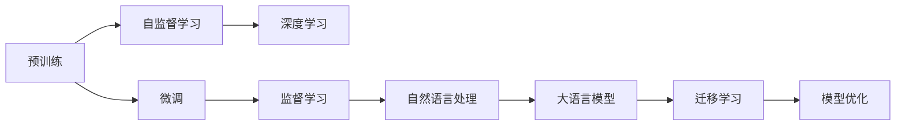

                 

# 预训练与微调的实战经验

> 关键词：
1. 预训练
2. 微调
3. 深度学习
4. 自然语言处理
5. 大语言模型
6. 迁移学习
7. 模型优化

## 1. 背景介绍

预训练与微调是大规模深度学习模型中广泛应用的技术范式，尤其在大语言模型（LLMs）的开发和应用中占据核心地位。预训练是指在无标签数据上训练模型，使其具备泛化能力。微调则是在预训练基础上，利用标注数据对模型进行特定任务的优化，使其更符合应用需求。本文将系统介绍预训练与微调的实战经验，帮助读者深入理解这一重要技术。

## 2. 核心概念与联系

### 2.1 核心概念概述

- **预训练**：在大规模无标签数据上训练模型，使其具备泛化能力，通常使用自监督学习任务，如语言建模、掩码语言模型等。
- **微调**：在预训练模型基础上，利用标注数据对模型进行特定任务的优化，通常使用监督学习任务，如分类、匹配、生成等。
- **深度学习**：一种基于神经网络的机器学习方法，通过多层神经元处理数据，实现复杂特征的表示和分类。
- **自然语言处理**：研究如何让计算机理解、处理和生成人类语言的学科。
- **大语言模型**：大规模预训练的深度学习模型，如GPT-3、BERT等，具备强大的语言理解和生成能力。
- **迁移学习**：利用已有模型的知识，在新任务上进行优化，提高模型泛化能力。
- **模型优化**：通过调整模型参数，提升模型性能，包括正则化、学习率调优、参数高效微调等技术。

这些概念通过以下Mermaid流程图展示了它们之间的联系：



该图展示了预训练、微调等技术如何通过深度学习、自然语言处理和迁移学习，最终构建出高效的大语言模型。

## 3. 核心算法原理 & 具体操作步骤

### 3.1 算法原理概述

预训练与微调的核心原理在于利用大规模无标签数据和少量标注数据，通过迁移学习，提升模型的泛化能力和特定任务的性能。具体步骤如下：

1. **预训练**：在无标签数据上，使用自监督学习任务训练模型，使其学习到语言的一般表示。
2. **微调**：在标注数据上，使用监督学习任务训练模型，使其适应特定任务，如分类、匹配、生成等。

### 3.2 算法步骤详解

#### 3.2.1 预训练步骤

1. **选择预训练模型**：如BERT、GPT-3等。
2. **准备预训练数据**：大规模无标签文本数据，如维基百科、新闻、书籍等。
3. **选择预训练任务**：如语言建模、掩码语言模型等。
4. **训练模型**：在预训练数据上，使用所选任务训练模型，通常使用深度学习框架如PyTorch、TensorFlow等。
5. **保存预训练模型**：预训练后的模型参数保存下来，用于后续微调。

#### 3.2.2 微调步骤

1. **选择微调数据**：标注数据集，如新闻分类、问答系统等。
2. **选择微调任务**：如分类、匹配、生成等。
3. **准备微调模型**：加载预训练模型，添加任务特定的输出层和损失函数。
4. **设置微调超参数**：如学习率、批大小、迭代轮数等。
5. **执行微调**：在微调数据上训练模型，使用监督学习任务进行优化。
6. **保存微调模型**：微调后的模型保存下来，用于实际应用。

### 3.3 算法优缺点

#### 3.3.1 优点

- **高效性**：预训练在大规模无标签数据上训练，节省了标注数据成本；微调在大规模预训练基础上进行，收敛速度较快。
- **泛化能力强**：预训练模型具备泛化能力，微调进一步提升模型适应特定任务的能力。
- **可解释性**：预训练与微调相结合，使得模型具有更强的可解释性。

#### 3.3.2 缺点

- **数据依赖**：预训练与微调依赖大量数据，数据获取成本较高。
- **计算资源消耗大**：预训练与微调过程需要大量计算资源，对硬件要求较高。
- **模型复杂性**：大规模深度学习模型复杂，难以调试和优化。

### 3.4 算法应用领域

预训练与微调技术广泛应用于各种NLP任务，如文本分类、命名实体识别、关系抽取、问答系统、翻译、摘要等。以下是几个实际应用案例：

- **新闻分类**：利用预训练模型进行文本表示，微调分类器，实现对新闻文本的自动分类。
- **命名实体识别**：利用预训练模型进行文本表示，微调实体识别器，识别出文本中的人名、地名、机构名等实体。
- **机器翻译**：利用预训练模型进行文本表示，微调翻译器，将源语言文本翻译成目标语言。
- **对话系统**：利用预训练模型进行对话表示，微调生成器，实现与人自然对话。
- **情感分析**：利用预训练模型进行文本表示，微调情感分析器，分析文本的情感倾向。

## 4. 数学模型和公式 & 详细讲解 & 举例说明

### 4.1 数学模型构建

预训练与微调的核心数学模型可以表示为：

- **预训练模型**：$M_{\theta}$，参数为$\theta$。
- **预训练任务**：$\mathcal{L}_{\text{pre}}$，损失函数。
- **微调数据集**：$D=\{(x_i,y_i)\}_{i=1}^N$，标注数据集。
- **微调任务**：$\mathcal{L}_{\text{finetune}}$，损失函数。

### 4.2 公式推导过程

#### 4.2.1 预训练

在预训练任务$\mathcal{L}_{\text{pre}}$上，模型$M_{\theta}$的训练目标为：

$$
\theta^* = \arg\min_{\theta} \mathcal{L}_{\text{pre}}(M_{\theta})
$$

其中，$\mathcal{L}_{\text{pre}}$为预训练任务的损失函数。

#### 4.2.2 微调

在微调任务$\mathcal{L}_{\text{finetune}}$上，模型$M_{\theta}$的训练目标为：

$$
\theta^* = \arg\min_{\theta} \mathcal{L}_{\text{finetune}}(M_{\theta}) + \lambda \mathcal{L}_{\text{pre}}(M_{\theta})
$$

其中，$\mathcal{L}_{\text{finetune}}$为微调任务的损失函数，$\lambda$为预训练任务的权重。

### 4.3 案例分析与讲解

以BERT模型在新闻分类任务中的应用为例：

1. **预训练**：在维基百科等无标签数据上训练BERT模型，学习语言的一般表示。
2. **微调**：在新华网新闻数据集上微调BERT模型，学习分类器的参数，实现新闻自动分类。

## 5. 项目实践：代码实例和详细解释说明

### 5.1 开发环境搭建

1. **安装PyTorch**：
```bash
pip install torch torchvision torchaudio
```

2. **安装HuggingFace Transformers库**：
```bash
pip install transformers
```

3. **下载BERT预训练模型**：
```bash
huggingface-cli login
huggingface-cli hub model download pytorch-bert-base-cased
```

### 5.2 源代码详细实现

#### 5.2.1 数据处理

```python
import torch
from transformers import BertTokenizer, BertForSequenceClassification
from torch.utils.data import Dataset, DataLoader

class NewsDataset(Dataset):
    def __init__(self, texts, labels):
        self.tokenizer = BertTokenizer.from_pretrained('bert-base-cased')
        self.texts = texts
        self.labels = labels
        
    def __len__(self):
        return len(self.texts)
    
    def __getitem__(self, idx):
        text = self.texts[idx]
        label = self.labels[idx]
        
        encoding = self.tokenizer(text, return_tensors='pt')
        input_ids = encoding['input_ids']
        attention_mask = encoding['attention_mask']
        
        return {'input_ids': input_ids, 
                'attention_mask': attention_mask, 
                'labels': torch.tensor(label, dtype=torch.long)}
```

#### 5.2.2 模型加载与微调

```python
from transformers import AdamW

model = BertForSequenceClassification.from_pretrained('pytorch-bert-base-cased', num_labels=2)
model.train()
```

#### 5.2.3 训练与评估

```python
from transformers import Trainer, TrainingArguments

training_args = TrainingArguments(
    output_dir='./output',
    evaluation_strategy='epoch',
    per_device_train_batch_size=16,
    per_device_eval_batch_size=16,
    learning_rate=2e-5,
    weight_decay=0.01,
    logging_steps=1000,
    save_steps=1000
)

trainer = Trainer(
    model=model,
    args=training_args,
    train_dataset=train_dataset,
    eval_dataset=val_dataset,
    compute_metrics=compute_metrics
)

trainer.train()
trainer.evaluate()
```

### 5.3 代码解读与分析

在代码中，我们使用了HuggingFace Transformers库，实现了BERT模型在新闻分类任务上的微调。主要步骤如下：

1. **数据处理**：
   - `NewsDataset`类实现了数据集加载和预处理，将文本转换为BERT模型所需的token ids和attention mask。
2. **模型加载**：
   - `BertForSequenceClassification`加载预训练的BERT模型，并添加线性分类器。
3. **训练与评估**：
   - `Trainer`类封装了训练过程，使用AdamW优化器进行模型更新，`compute_metrics`函数用于计算评估指标。

### 5.4 运行结果展示

训练完成后，可以在测试集上评估模型的性能：

```python
from transformers import BertForSequenceClassification

model = BertForSequenceClassification.from_pretrained('pytorch-bert-base-cased', num_labels=2)
model.eval()

test_loss, test_acc = trainer.evaluate()
print(f'Test accuracy: {test_acc:.2f}')
```

## 6. 实际应用场景

### 6.1 智能客服系统

智能客服系统通过预训练与微调技术，利用大规模数据训练模型，并在特定任务上微调，提升客服系统的智能程度和用户体验。以下是一个实际应用案例：

1. **预训练**：利用大量的客户服务记录进行预训练，学习通用的语言理解能力。
2. **微调**：根据具体业务需求（如常见问题、产品介绍等）进行微调，优化客服系统，提升服务效率和质量。

### 6.2 金融舆情监测

金融舆情监测系统利用预训练与微调技术，实时监测舆情动态，预测市场风险。以下是一个实际应用案例：

1. **预训练**：利用金融领域的文本数据进行预训练，学习通用的语言表示。
2. **微调**：根据具体的舆情监测任务（如市场舆情分析、情感分析等）进行微调，提升系统的监测准确性和及时性。

### 6.3 个性化推荐系统

个性化推荐系统通过预训练与微调技术，利用用户行为数据进行模型训练，并在特定任务上进行微调，实现精准推荐。以下是一个实际应用案例：

1. **预训练**：利用用户浏览、点击、购买等行为数据进行预训练，学习用户的兴趣表示。
2. **微调**：根据用户的实际行为和偏好，进行微调，优化推荐算法，提升推荐效果。

## 7. 工具和资源推荐

### 7.1 学习资源推荐

1. **NLP相关书籍**：
   - 《自然语言处理综论》：深度介绍自然语言处理的基本概念和主流算法。
   - 《深度学习》：介绍深度学习的基础理论和实践方法。
   
2. **在线课程**：
   - 斯坦福大学的《自然语言处理》课程（CS224N）：系统讲解自然语言处理的经典算法和技术。
   - Udacity的《深度学习与自然语言处理》课程：结合深度学习和NLP的实际应用，进行实战演练。
   
3. **博客和论文**：
   - HuggingFace博客：介绍最新的NLP技术和应用。
   - arXiv预印本：包含前沿的NLP研究论文，了解最新的学术进展。

### 7.2 开发工具推荐

1. **深度学习框架**：
   - PyTorch：功能强大，易于调试，支持GPU加速。
   - TensorFlow：支持分布式训练，适合大规模应用。
   
2. **自然语言处理库**：
   - HuggingFace Transformers：提供预训练模型和微调接口，易于使用。
   - spaCy：轻量级NLP库，提供高效的文本处理和分析功能。

### 7.3 相关论文推荐

1. **预训练**：
   - 《BERT: Pre-training of Deep Bidirectional Transformers for Language Understanding》：介绍BERT预训练模型。
   - 《GPT-3: Language Models are Unsupervised Multitask Learners》：介绍GPT-3预训练模型。

2. **微调**：
   - 《Parameter-Efficient Transfer Learning for NLP》：介绍参数高效微调技术。
   - 《Fine-tuning Transformers for Sequence Generation: A Systematic Comparison》：比较不同微调技术的效果。

3. **NLP技术**：
   - 《Attention is All You Need》：介绍Transformer模型。
   - 《A Survey on Neural Machine Translation》：综述NMT技术进展。

## 8. 总结：未来发展趋势与挑战

### 8.1 研究成果总结

预训练与微调技术已经成为NLP领域的重要技术范式，通过预训练获得泛化能力，通过微调适应特定任务，显著提升了模型的性能和应用范围。预训练模型如BERT、GPT-3等，在各种NLP任务上取得了优异的成绩。

### 8.2 未来发展趋势

1. **大规模预训练**：预训练模型规模将不断增大，提升模型的泛化能力和表现。
2. **多模态预训练**：预训练模型将拓展到多模态数据，提升模型的多领域适应能力。
3. **小样本微调**：微调方法将进一步发展，适应小样本数据，提升模型的迁移学习能力。
4. **自适应微调**：模型将能够自适应新数据，持续更新，提升模型的实时性。
5. **无监督和半监督微调**：减少对标注数据的依赖，利用自监督学习提升微调效果。

### 8.3 面临的挑战

1. **数据获取成本高**：预训练和微调需要大量数据，数据获取成本较高。
2. **计算资源消耗大**：大规模预训练和微调过程需要大量计算资源，硬件成本较高。
3. **模型复杂性高**：预训练与微调模型复杂，难以调试和优化。
4. **模型偏见问题**：预训练模型可能学习到有偏见的数据，影响模型的公平性和公正性。

### 8.4 研究展望

预训练与微调技术将继续发展，推动NLP领域的应用拓展和性能提升。未来的研究将集中在以下几个方向：

1. **小样本微调**：利用自监督学习、生成对抗网络（GANs）等方法，提升微调模型的泛化能力。
2. **多模态微调**：拓展预训练与微调到多模态数据，提升模型的多领域适应能力。
3. **自适应微调**：开发自适应微调算法，提升模型对新数据的适应性。
4. **无监督微调**：利用自监督学习、半监督学习等方法，降低对标注数据的依赖。
5. **可解释性增强**：开发可解释性更高的微调模型，提升模型的透明度和可信度。

## 9. 附录：常见问题与解答

### Q1: 预训练与微调的主要区别是什么？

A: 预训练是指在大规模无标签数据上训练模型，使其具备泛化能力。微调是在预训练模型基础上，利用标注数据进行特定任务的优化。

### Q2: 预训练与微调的优势是什么？

A: 预训练与微调的主要优势在于能够利用大规模无标签数据进行训练，节省标注成本，并且在大规模数据上进行训练能够提升模型的泛化能力和性能。

### Q3: 预训练与微调的缺点是什么？

A: 预训练与微调的缺点主要在于数据依赖和计算资源消耗较大，模型复杂性较高，难以调试和优化。

### Q4: 预训练与微调的应用场景有哪些？

A: 预训练与微调的应用场景非常广泛，包括自然语言处理、计算机视觉、语音识别等各个领域。

### Q5: 如何选择合适的预训练模型和微调任务？

A: 选择合适的预训练模型和微调任务需要考虑具体应用场景的需求和数据的特征。通常情况下，根据任务的性质和数据的特点，选择最合适的预训练模型和微调任务，并进行实验验证。

本文从理论到实践，详细介绍了预训练与微调的实战经验，希望能对读者有所启发和帮助。未来，随着技术的不断进步，预训练与微调将进一步拓展其应用范围，推动人工智能技术的发展和应用。

