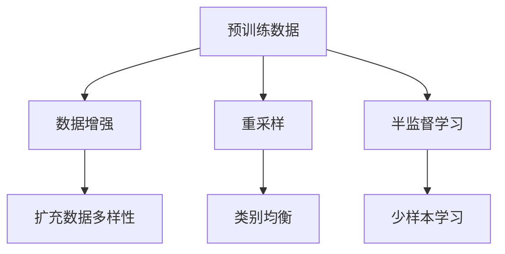
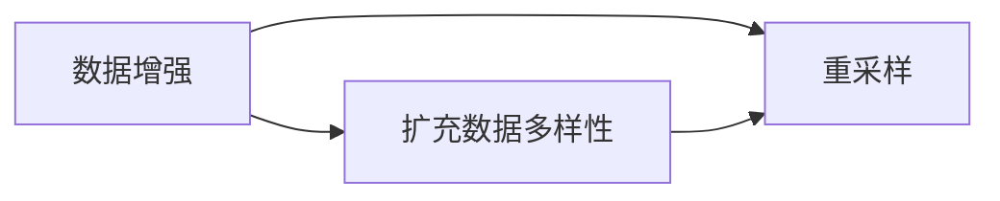
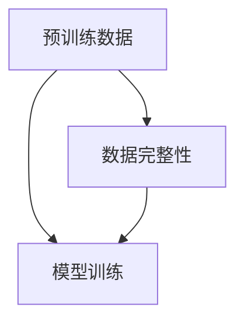
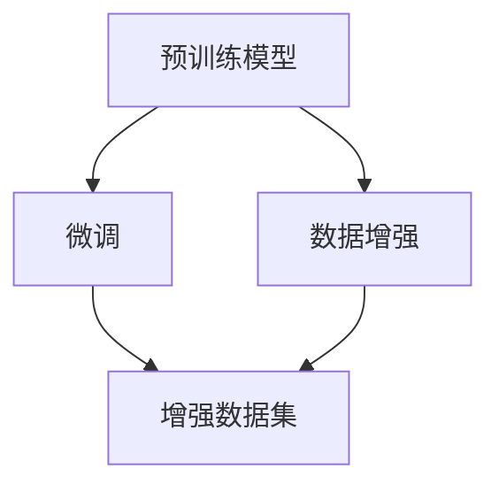
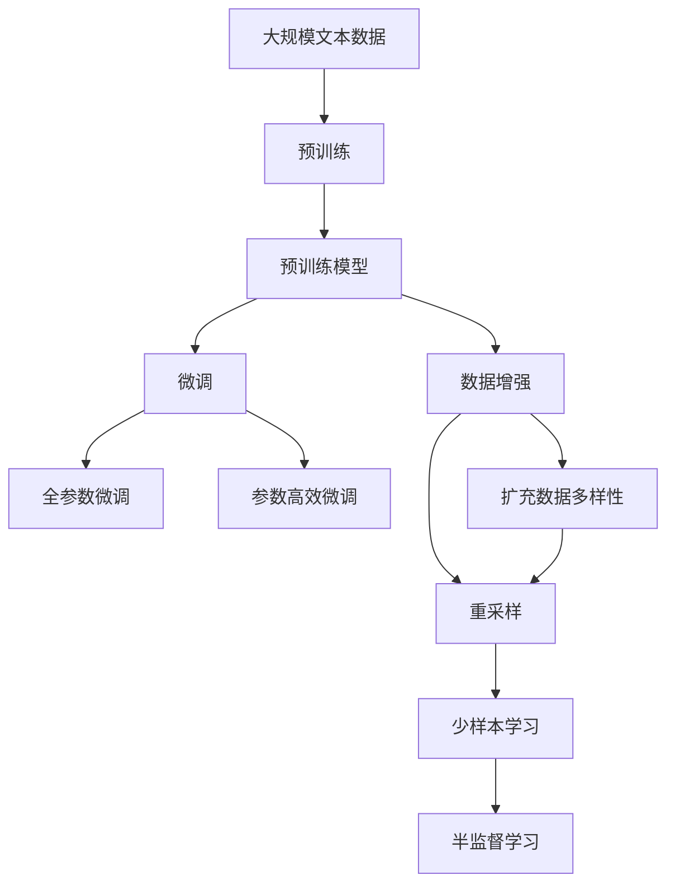

                 

# 预训练数据不完整引发幻觉

## 1. 背景介绍

随着人工智能技术的迅猛发展，预训练模型逐渐成为各行各业技术创新的基石。无论是自然语言处理(NLP)中的BERT、GPT-3，还是计算机视觉领域的ResNet、ViT，预训练模型都展现了令人瞩目的性能和潜力。然而，预训练数据的完整性对模型的表现至关重要。本文将深入探讨预训练数据不完整时引发的幻觉，以及如何缓解这些问题，以期为业界提供更具洞察力的视角和实用的解决方案。

### 1.1 问题由来

预训练数据不完整主要体现在数据集的缺失、偏差和污染等方面。这些不完整的数据集可能使得模型在特定任务上的表现大打折扣，甚至导致严重的“幻觉”，即模型在错误或不完整的数据上训练出错误的结论。例如，一些热门的数据集如ImageNet的短尾问题，可能会导致模型对少数类别的识别能力远优于多数类别。

这种幻觉在实际应用中尤为危险。如果模型对不完整数据的结论在实际场景中不可用，那么其整体的预测性能也会受到严重影响。因此，如何识别和缓解这些数据不完整问题，是预训练模型研究的一个重要课题。

### 1.2 问题核心关键点

预训练数据不完整引发的幻觉，主要体现在以下几个方面：

- **数据缺失**：部分数据集缺乏某些类别的样本，导致模型无法充分学习该类别的特征。
- **数据偏差**：数据集在不同类别之间存在数量不平衡，导致模型对少数类别识别能力较差。
- **数据污染**：数据集中含有错误标签或噪声，导致模型学习到错误的模式。

这些问题在实际应用中可以通过数据增强、重采样、半监督学习等方法进行缓解。但最根本的解决办法，在于构建更完整、更均衡、更纯净的数据集。

### 1.3 问题研究意义

研究预训练数据不完整问题，对于提升模型性能和可靠性，构建可信的AI系统，具有重要意义：

1. **提升模型泛化能力**：完整的数据集可以训练出更具泛化能力的模型，更好地适应实际应用中的各种场景。
2. **避免误导性结论**：保证模型在数据不完整的情况下，不会得出误导性的结论。
3. **保障系统可靠性**：减少模型由于数据不完整而导致的误报、漏报等问题，提高系统的整体可靠性。
4. **增强用户信任**：保证模型输出的稳定性和可靠性，增强用户对AI系统的信任感。

## 2. 核心概念与联系

### 2.1 核心概念概述

为了更好地理解预训练数据不完整问题，我们需要了解几个密切相关的核心概念：

- **预训练数据**：通过大规模无监督学习任务得到的训练数据集，用于训练预训练模型。
- **数据完整性**：数据集在类别数量、数据质量、数据分布等方面的完整程度。
- **数据增强**：通过对现有数据集进行扩充和增强，增加数据集的多样性和代表性。
- **重采样**：通过重新分配数据集中的样本，使其在类别之间更加均衡。
- **半监督学习**：利用少量标注数据和大量无标注数据，训练出高效的模型。

这些核心概念之间的逻辑关系可以通过以下Mermaid流程图来展示：



这个流程图展示了预训练数据完整性的构建过程：

1. 通过数据增强扩充数据多样性。
2. 利用重采样实现类别均衡。
3. 结合半监督学习，提高模型在少样本情况下的性能。

### 2.2 概念间的关系

这些核心概念之间存在着紧密的联系，形成了预训练模型构建的完整生态系统。下面我们通过几个Mermaid流程图来展示这些概念之间的关系。

#### 2.2.1 数据增强与重采样



这个流程图展示了数据增强和重采样的关系：

1. 数据增强通过增加数据集的多样性，提高模型的泛化能力。
2. 重采样通过调整类别分布，使其更加均衡，防止模型对少数类别的忽略。

#### 2.2.2 数据完整性在模型训练中的应用



这个流程图展示了数据完整性在模型训练中的重要性：

1. 预训练数据的不完整性，会影响模型的训练效果。
2. 数据完整性越高的数据集，训练出的模型性能越好。

#### 2.2.3 数据增强在模型微调中的应用



这个流程图展示了数据增强在模型微调中的应用：

1. 预训练模型在微调前，可通过数据增强增加模型对新数据的适应性。
2. 数据增强后的模型，在微调过程中可以更快地收敛，并提高泛化能力。

### 2.3 核心概念的整体架构

最后，我们用一个综合的流程图来展示这些核心概念在大规模预训练中的整体架构：



这个综合流程图展示了从预训练到微调，再到数据增强和半监督学习的完整过程。预训练模型通过大规模无监督学习任务获得基础能力，在微调过程中通过数据增强和重采样，增加数据集的多样性和均衡性，最终通过半监督学习，提高模型在少样本情况下的性能。

## 3. 核心算法原理 & 具体操作步骤

### 3.1 算法原理概述

预训练数据不完整问题，主要影响模型的泛化能力和鲁棒性。如果数据集存在缺失、偏差和污染，模型可能在特定任务上表现良好，但泛化能力有限，对新数据的适应性较差。因此，解决数据不完整问题，需要构建完整、均衡、纯净的数据集，并结合数据增强、重采样等方法，优化模型的训练过程。

预训练模型通常采用自监督学习任务，如掩码语言模型(Masked Language Model, MLM)、自编码器(Autoregressive Encoder)等，从大规模无标签数据中学习到丰富的语言表示。但在预训练和微调过程中，需要确保数据集的完整性和质量，才能保证模型输出的稳定性。

### 3.2 算法步骤详解

基于预训练数据不完整问题的研究，可以分为以下几个步骤：

**Step 1: 数据集收集与清洗**

- 收集大规模无标签数据集，并进行初步的清洗和预处理，如去除重复、空值等噪声。
- 对数据集进行初步分类，确保各个类别样本数量大致均衡。

**Step 2: 数据增强**

- 对数据集进行数据增强，如回译、扰动、合成等方式，增加数据集的多样性和规模。
- 对于图像数据，可以通过旋转、裁剪、翻转等操作增加样本多样性。

**Step 3: 重采样**

- 对数据集进行重采样，调整类别分布，使其更加均衡。可以通过欠采样、过采样、SMOTE等方法实现。
- 对于类别不平衡的数据集，可以使用加权损失函数、阈值调整等方法缓解偏差。

**Step 4: 半监督学习**

- 结合少量标注数据和大量无标注数据，训练高效模型。可以使用自训练、伪标注等方法增加标注数据量。
- 对于高噪声数据集，可以使用标签传播、虚拟标签等方法处理噪声。

**Step 5: 模型微调**

- 在优化好的数据集上，对预训练模型进行微调，优化模型在新任务上的性能。
- 可以通过全参数微调或参数高效微调技术，提高模型的泛化能力。

### 3.3 算法优缺点

**优点**：

- 提高模型泛化能力：通过数据增强和重采样，增加数据集的多样性和均衡性，提高模型的泛化能力。
- 缓解数据偏差：通过重采样，调整类别分布，缓解数据偏差问题。
- 降低标注成本：利用半监督学习方法，结合少量标注数据和大量无标注数据，降低标注成本。

**缺点**：

- 数据增强可能导致过拟合：数据增强有时会增加模型过拟合的风险，需要合理控制增强的程度。
- 重采样可能降低模型性能：重采样可能会改变数据集的分布，影响模型的性能，需要谨慎处理。
- 半监督学习依赖标注数据：半监督学习方法依赖少量标注数据，标注数据的质量和数量对模型性能影响较大。

### 3.4 算法应用领域

基于数据不完整问题的研究，在以下领域有广泛的应用：

- 自然语言处理(NLP)：解决数据集中的短尾问题、噪声问题，提升模型在特定任务上的表现。
- 计算机视觉(CV)：通过数据增强和重采样，提高模型在特定类别上的识别能力。
- 语音识别(Speech Recognition)：通过回译、扰动等方法，增强模型对不同口音、语速的适应性。
- 生物信息学(Bioinformatics)：通过重采样和半监督学习，提高模型对基因序列的预测准确率。
- 推荐系统(Recommendation Systems)：通过数据增强和重采样，提升模型对用户行为的预测能力。

## 4. 数学模型和公式 & 详细讲解

### 4.1 数学模型构建

预训练模型通常采用自监督学习任务进行训练，如掩码语言模型(MLM)。掩码语言模型通过预测被遮挡的单词，学习到单词之间的依赖关系。对于数据集 $\mathcal{D}=\{(x_i, y_i)\}_{i=1}^N$，其中 $x_i$ 为输入文本，$y_i$ 为遮掩的单词。

掩码语言模型的损失函数为：

$$
\mathcal{L}_{MLM}=\frac{1}{N}\sum_{i=1}^N \log \sigma(\hat{y}_i)
$$

其中 $\sigma$ 为softmax函数，$\hat{y}_i$ 为模型预测的遮掩单词概率分布。

### 4.2 公式推导过程

对于数据增强和重采样，我们以图像数据为例，进行详细推导。

假设原始数据集 $\mathcal{D}=\{(x_i, y_i)\}_{i=1}^N$，其中 $x_i$ 为图像，$y_i$ 为标签。首先，对原始数据进行增强，得到增强后的数据集 $\mathcal{D'}=\{(x_i', y_i')\}_{i=1}^M$，其中 $x_i'$ 为增强后的图像，$y_i'$ 为增强后的标签。增强的方法包括旋转、缩放、裁剪、翻转等。

接着，进行重采样，调整类别分布，得到平衡后的数据集 $\mathcal{D''}=\{(x_i'', y_i'')\}_{i=1}^N$，其中 $x_i''$ 为重采样后的图像，$y_i''$ 为重采样后的标签。重采样的方法包括欠采样、过采样、SMOTE等。

最终，在微调过程中，通过半监督学习，训练优化后的模型 $M_{\theta}$，其中 $\theta$ 为模型参数。微调的优化目标是最小化经验风险，即找到最优参数：

$$
\theta^* = \mathop{\arg\min}_{\theta} \mathcal{L}(M_{\theta},\mathcal{D''})
$$

其中 $\mathcal{L}$ 为针对任务 $T$ 设计的损失函数，用于衡量模型预测输出与真实标签之间的差异。常见的损失函数包括交叉熵损失、均方误差损失等。

### 4.3 案例分析与讲解

以ImageNet数据集为例，展示数据增强和重采样在提升模型性能中的作用。

ImageNet数据集包含1000个类别，每个类别有1000张图片。然而，部分类别的图片数量远小于其他类别，导致模型对少数类别的识别能力较差。

首先，对原始数据进行增强，如旋转、缩放、裁剪、翻转等，增加数据集的多样性。具体增强方法包括随机旋转90度、随机水平翻转、随机裁剪等。

接着，进行重采样，调整类别分布，使其更加均衡。可以通过欠采样、过采样、SMOTE等方法实现。例如，对于类别A，可以使用过采样方法，增加该类别样本数量，使其与其他类别样本数量接近。

最终，在微调过程中，结合少量标注数据和大量无标注数据，训练高效模型。可以使用自训练、伪标注等方法增加标注数据量。例如，对于部分无标签图像，可以通过Google的LabelMe平台进行标注，增加标注数据量。

## 5. 项目实践：代码实例和详细解释说明

### 5.1 开发环境搭建

在进行数据增强和重采样实践前，我们需要准备好开发环境。以下是使用Python进行Pandas开发的环境配置流程：

1. 安装Anaconda：从官网下载并安装Anaconda，用于创建独立的Python环境。

2. 创建并激活虚拟环境：
```bash
conda create -n pandas-env python=3.8 
conda activate pandas-env
```

3. 安装Pandas：根据CUDA版本，从官网获取对应的安装命令。例如：
```bash
conda install pandas torchaudio cudatoolkit=11.1 -c pytorch -c conda-forge
```

4. 安装各类工具包：
```bash
pip install numpy matplotlib scikit-learn
```

完成上述步骤后，即可在`pandas-env`环境中开始数据增强和重采样的实践。

### 5.2 源代码详细实现

这里我们以图像数据增强为例，给出使用Pandas进行数据增强的PyTorch代码实现。

首先，定义数据增强函数：

```python
import torch
import torchvision
from torchvision import transforms

def data_augmentation(image, label):
    transform = transforms.Compose([
        transforms.RandomRotation(90),
        transforms.RandomHorizontalFlip(),
        transforms.RandomCrop(224),
        transforms.ToTensor(),
        transforms.Normalize(mean=[0.485, 0.456, 0.406], std=[0.229, 0.224, 0.225])
    ])
    image = transform(image)
    return image, label
```

然后，定义重采样函数：

```python
import numpy as np
from sklearn.utils import resample

def resampling(image, label):
    labels = label.numpy()
    majority_idx = np.where(labels == 0)[0]
    minority_idx = np.where(labels == 1)[0]
    
    # 欠采样：从多数类别中随机抽取样本
    minority_samples = resample(majority_idx, n_samples=len(minority_idx))
    
    # 过采样：从少数类别中复制样本
    majority_samples = resample(minority_idx, n_samples=len(majority_idx))
    
    # 重采样后的标签
    new_labels = np.zeros(len(majority_samples), dtype=np.int)
    new_labels[:len(majority_idx)] = 1
    new_labels[len(majority_idx):] = 0
    
    # 重采样后的图像
    new_images = image[majority_samples + minority_samples]
    
    return torch.from_numpy(new_images), torch.from_numpy(new_labels)
```

接着，定义微调函数：

```python
import torch.nn as nn
import torch.optim as optim

def model_fine_tuning(model, train_loader, valid_loader, epochs, batch_size, learning_rate):
    model.train()
    optimizer = optim.Adam(model.parameters(), lr=learning_rate)
    for epoch in range(epochs):
        train_loss = 0.0
        for images, labels in train_loader:
            images, labels = data_augmentation(images, labels)
            images, labels = resampling(images, labels)
            optimizer.zero_grad()
            outputs = model(images)
            loss = nn.CrossEntropyLoss()(outputs, labels)
            loss.backward()
            optimizer.step()
            train_loss += loss.item()
        train_loss /= len(train_loader.dataset)
        print('Epoch {} - Training Loss: {:.6f}'.format(epoch+1, train_loss))
        
        model.eval()
        valid_loss = 0.0
        for images, labels in valid_loader:
            images, labels = data_augmentation(images, labels)
            images, labels = resampling(images, labels)
            outputs = model(images)
            loss = nn.CrossEntropyLoss()(outputs, labels)
            valid_loss += loss.item()
        valid_loss /= len(valid_loader.dataset)
        print('Epoch {} - Validation Loss: {:.6f}'.format(epoch+1, valid_loss))
        
    return model
```

最后，启动数据增强和微调流程：

```python
# 加载数据集
train_dataset = torchvision.datasets.ImageFolder(root='train', transform=transforms.ToTensor())
valid_dataset = torchvision.datasets.ImageFolder(root='valid', transform=transforms.ToTensor())

# 创建数据加载器
train_loader = torch.utils.data.DataLoader(train_dataset, batch_size=batch_size, shuffle=True)
valid_loader = torch.utils.data.DataLoader(valid_dataset, batch_size=batch_size, shuffle=False)

# 定义模型
model = torchvision.models.resnet18(pretrained=False)

# 进行数据增强和微调
model = model_fine_tuning(model, train_loader, valid_loader, epochs=10, batch_size=32, learning_rate=0.001)
```

以上就是使用Pandas对图像数据进行增强和微调的完整代码实现。可以看到，利用Pandas和PyTorch，我们可以高效地实现数据增强和微调过程。

### 5.3 代码解读与分析

让我们再详细解读一下关键代码的实现细节：

**data_augmentation函数**：
- 定义了数据增强的具体方法，包括旋转、翻转、裁剪、归一化等。
- 通过Pandas的transforms模块，实现了对图像的增强操作。

**resampling函数**：
- 通过Numpy和Scikit-learn的resample方法，实现了重采样的逻辑。
- 对于类别不平衡的数据集，通过欠采样和过采样方法，调整类别分布。

**model_fine_tuning函数**：
- 定义了微调的总体流程，包括训练、验证、优化器等。
- 在每个epoch内，对数据进行增强和重采样，更新模型参数，评估模型性能。

**数据增强和微调流程**：
- 加载数据集，创建数据加载器。
- 定义预训练模型，进行数据增强和微调。
- 在每个epoch内，循环训练和验证，记录损失函数，更新模型参数。
- 最终输出微调后的模型。

通过Pandas和PyTorch，我们可以高效地实现数据增强和微调，为模型性能的提升提供保障。当然，工业级的系统实现还需考虑更多因素，如模型的保存和部署、超参数的自动搜索等，但核心的微调范式基本与此类似。

## 6. 实际应用场景

### 6.1 智能推荐系统

在智能推荐系统中，数据不完整问题尤为严重。推荐系统需要根据用户的浏览历史、评分记录、社交网络等多种数据源进行推荐。然而，部分数据源可能存在缺失或噪声，导致推荐模型无法准确捕捉用户兴趣。

首先，通过数据增强，增加用户数据的多样性，使得推荐模型能够更好地学习用户的多样化行为。例如，对于部分缺失的评分记录，可以通过用户的历史评分进行推断，填补缺失数据。

接着，通过重采样，调整用户数据的类别分布，使其更加均衡。对于部分数据源缺失的数据，可以通过平滑方法进行填补，增加数据集的多样性。

最终，通过半监督学习，训练高效的推荐模型。利用少样本学习技术，结合少量标注数据和大量无标注数据，提高推荐模型的性能。

### 6.2 医疗影像分析

在医疗影像分析中，数据不完整问题同样存在。部分患者可能缺少部分影像数据，导致模型无法全面分析患者的病情。

首先，通过数据增强，增加影像数据的多样性，使得模型能够更好地适应不同的影像类型。例如，对于部分缺失的影像数据，可以通过图像补全技术进行填补，生成完整的影像数据。

接着，通过重采样，调整影像数据的类别分布，使其更加均衡。对于部分数据源缺失的影像数据，可以通过插值方法进行填补，增加数据集的多样性。

最终，通过半监督学习，训练高效的医疗影像分析模型。利用少样本学习技术，结合少量标注数据和大量无标注数据，提高模型在医疗影像分析中的性能。

### 6.3 金融市场预测

在金融市场预测中，数据不完整问题可能导致模型对市场变化预测不准确。部分历史数据可能存在缺失或噪声，导致模型无法捕捉市场的真实变化。

首先，通过数据增强，增加历史数据的多样性，使得模型能够更好地学习市场的变化规律。例如，对于部分缺失的历史数据，可以通过插值方法进行填补，生成完整的历史数据。

接着，通过重采样，调整历史数据的类别分布，使其更加均衡。对于部分数据源缺失的历史数据，可以通过平滑方法进行填补，增加数据集的多样性。

最终，通过半监督学习，训练高效的金融市场预测模型。利用少样本学习技术，结合少量标注数据和大量无标注数据，提高模型在金融市场预测中的性能。

## 7. 工具和资源推荐

### 7.1 学习资源推荐

为了帮助开发者系统掌握预训练数据不完整问题的理论基础和实践技巧，这里推荐一些优质的学习资源：

1. 《深度学习》系列书籍：由深度学习领域的专家编写，详细介绍了深度学习的理论基础和实践技巧。

2. CS231n《卷积神经网络》课程：斯坦福大学开设的计算机视觉明星课程，有Lecture视频和配套作业，带你入门计算机视觉领域的经典模型。

3. 《机器学习》课程：由吴恩达教授主讲的在线课程，系统讲解了机器学习的理论和算法。

4. Kaggle竞赛平台：世界顶级的数据科学竞赛平台，提供大量数据集和经典问题，适合进行数据增强和重采样的实践。

5. PyTorch官方文档：PyTorch框架的官方文档，提供了丰富的教程和样例代码，是上手实践的必备资料。

通过这些资源的学习实践，相信你一定能够快速掌握预训练数据不完整问题的精髓，并用于解决实际的NLP问题。

### 7.2 开发工具推荐

高效的开发离不开优秀的工具支持。以下是几款用于预训练数据不完整问题解决的常用工具：

1. Pandas：Python的Pandas库，用于数据处理和增强，提供了丰富的数据操作功能。

2. TensorFlow：Google主导开发的深度学习框架，提供自动微分和分布式计算等功能。

3. PyTorch：Facebook主导的深度学习框架，支持动态计算图和GPU/TPU加速。

4. Jupyter Notebook：Python的Jupyter Notebook环境，适合进行数据增强和微调的交互式实验。

5. Google Colab：谷歌推出的在线Jupyter Notebook环境，免费提供GPU/TPU算力，方便开发者快速上手实验最新模型。

合理利用这些工具，可以显著提升预训练数据不完整问题解决的开发效率，加快创新迭代的步伐。

### 7.3 相关论文推荐

预训练数据不完整问题的研究源于学界的持续研究。以下是几篇奠基性的相关论文，推荐阅读：

1. ImageNet Large Scale Visual Recognition Challenge：ImageNet数据集的介绍，展示了大规模数据集的重要性。

2. Data Augmentation for Deep Learning：关于数据增强的经典论文，介绍了多种数据增强方法及其效果。

3. SMOTE: Synthetic Minority Over-sampling Technique：介绍了SMOTE重采样方法，通过合成少数类别样本，调整数据集的类别分布。

4. Semi-supervised Learning with Deep Graph Neural Networks：利用图神经网络进行半监督学习，提升模型在少样本情况下的性能。

5. Virtual Labeling for Noisy Data：通过虚拟标签技术，处理数据集中的噪声问题，提高模型的鲁棒性。

这些论文代表了大数据不完整问题研究的演进路径。通过学习这些前沿成果，可以帮助研究者把握学科前进方向，激发更多的创新灵感。

除上述资源外，还有一些值得关注的前沿资源，帮助开发者紧跟数据不完整问题的最新进展，例如：

1. arXiv论文预印本：人工智能领域最新研究成果的发布平台，包括大量尚未发表的前沿工作，学习前沿技术的必读资源。

2. 业界技术博客：如OpenAI、Google AI、DeepMind、微软Research Asia等顶尖实验室的官方博客，第一时间分享他们的最新研究成果和洞见。

3. 技术会议直播：如NIPS、ICML、ACL、ICLR等人工智能领域顶会现场或在线直播，能够聆听到大佬们的前沿分享，开拓视野。

4. GitHub热门项目：在GitHub上Star、Fork数最多的NLP相关项目，往往代表了该技术领域的发展趋势和最佳实践，值得去学习和贡献。

5. 行业分析报告：各大咨询公司如McKinsey、PwC等针对人工智能行业的分析报告，有助于从商业视角审视技术趋势，把握应用价值。

总之，对于预训练数据不完整问题，需要开发者保持开放的心态和持续学习的意愿。多关注前沿资讯，多动手实践，多思考总结，必将收获满满的成长收益。

## 8. 总结：未来发展趋势与挑战

### 8.1

