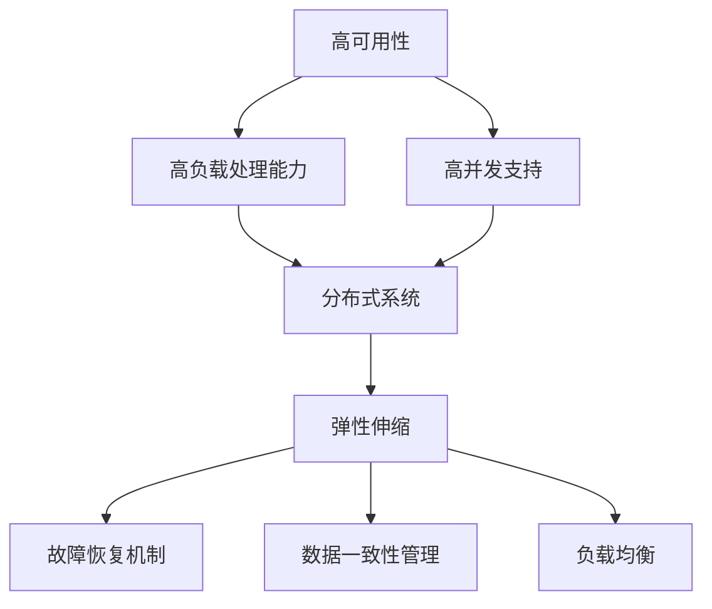
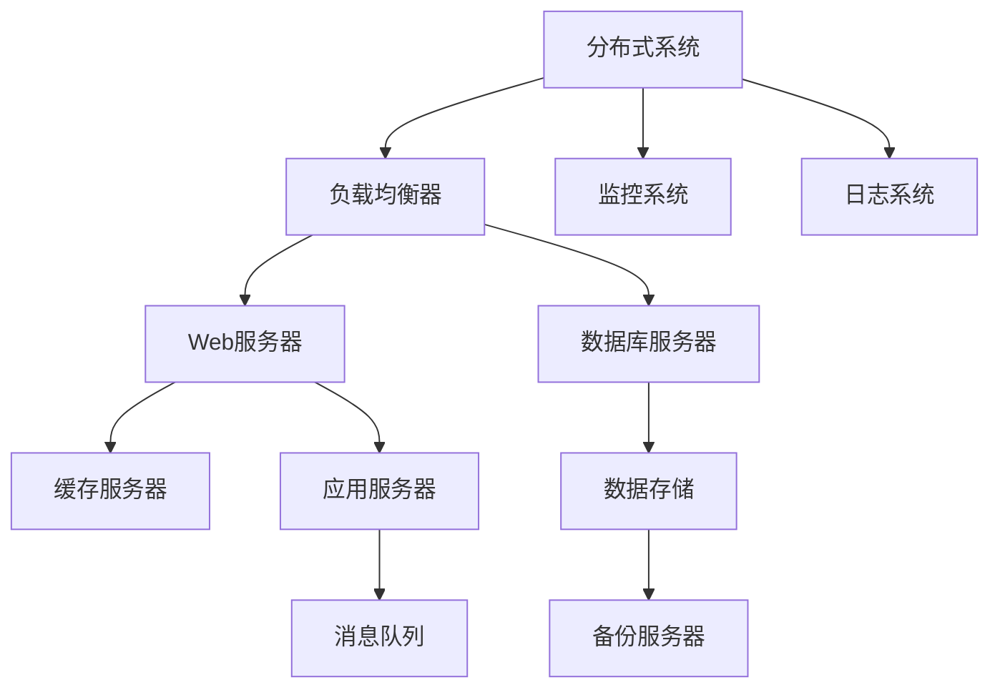
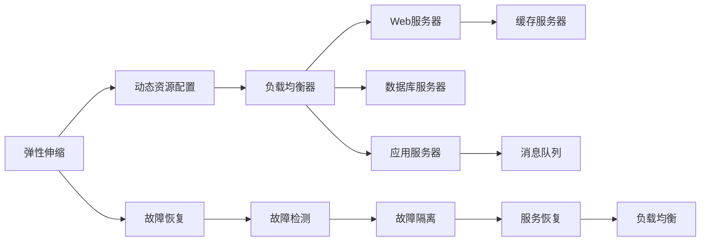

                 

# 高可用、高负载、高并发的互联网应用的架构设计

> 关键词：高可用性, 高负载, 高并发, 互联网应用, 架构设计

## 1. 背景介绍

在互联网时代，各类在线服务已成为人们生活和工作中不可或缺的一部分。随之而来的是，对于系统的高可用性、高负载处理能力和高并发支持的需求日益增长。这些需求不仅对开发者的技术能力提出了更高要求，也为架构设计带来了巨大挑战。本文将从理论和实践两个角度，系统介绍如何构建高可用、高负载、高并发的互联网应用架构。

### 1.1 问题由来

互联网应用通常面临以下几个主要问题：

- **高可用性**：系统需要保持24/7运行，不能因为故障或宕机造成业务中断。
- **高负载处理能力**：应对突发流量高峰，如双11、618等电商促销活动，系统必须能够快速响应大量请求。
- **高并发支持**：单台服务器需要处理大量并发连接，以应对海量用户访问。

这些问题在技术实现上涉及多方面的考量，包括服务器配置、网络架构、数据存储、业务逻辑等。本文将从系统架构的角度出发，探讨如何通过设计合理的架构来应对这些挑战。

### 1.2 问题核心关键点

构建高可用、高负载、高并发互联网应用的核心在于：

- **分布式系统设计**：通过分布式架构，实现系统的横向扩展。
- **弹性伸缩**：根据请求量动态调整资源配置，提高系统可扩展性和弹性。
- **故障恢复机制**：在发生故障时快速定位和恢复，保持服务连续性。
- **数据一致性管理**：在高并发情况下，确保数据一致性和事务可靠性。
- **负载均衡**：通过均衡分配请求，减少单点故障和负载热点。

这些关键点贯穿于架构设计的各个环节，是构建高性能、高可靠互联网应用的基础。

### 1.3 问题研究意义

研究如何构建高可用、高负载、高并发的互联网应用架构，具有重要意义：

- **提升用户体验**：稳定的服务保障用户良好体验，减少因故障导致的服务中断。
- **提升业务竞争力**：高负载和高并发能力可应对突发流量，提升业务承载能力。
- **降低运营成本**：通过合理架构设计，避免过度资源投入，降低运维和扩展成本。
- **支持创新应用**：高可用性和弹性伸缩为创新应用提供坚实基础，促进业务创新。

## 2. 核心概念与联系

### 2.1 核心概念概述

为更好地理解高可用、高负载、高并发互联网应用的架构设计，本节将介绍几个关键概念：

- **高可用性**：系统能够持续运行，即使部分组件故障也不影响整体服务。
- **高负载**：系统能够应对大量并发请求，保持响应速度和吞吐量。
- **高并发**：系统能够同时处理大量连接请求，支持海量用户访问。
- **分布式系统**：由多个节点组成，通过网络协同工作，实现系统的高可扩展性。
- **弹性伸缩**：根据负载动态调整资源，实现系统的高弹性。
- **故障恢复**：在故障发生时快速恢复，保持服务连续性。
- **负载均衡**：通过均衡分配请求，避免单点故障和负载热点。
- **数据一致性管理**：在高并发情况下，确保数据一致性和事务可靠性。

这些概念之间的逻辑关系可以通过以下Mermaid流程图来展示：



这个流程图展示了各个概念之间的关系：

1. 高可用性是互联网应用的基础保障，通过分布式系统、弹性伸缩、故障恢复和负载均衡实现。
2. 高负载处理能力通过分布式系统和弹性伸缩来实现。
3. 高并发支持通过弹性伸缩、负载均衡和数据一致性管理实现。
4. 分布式系统是实现高负载和高并发的基础架构。

### 2.2 概念间的关系

这些核心概念之间存在着紧密的联系，形成了互联网应用架构设计的完整生态系统。下面我们通过几个Mermaid流程图来展示这些概念之间的关系。

#### 2.2.1 架构设计的主要组件



这个流程图展示了架构设计的主要组件：

1. **分布式系统**：由负载均衡器、Web服务器、数据库服务器、缓存服务器、应用服务器、数据存储、消息队列等组件组成，协同工作实现高可用、高负载和高并发。
2. **负载均衡器**：均衡分配请求，避免单点故障和负载热点。
3. **Web服务器**：处理请求，执行应用逻辑。
4. **数据库服务器**：存储和管理数据，实现数据一致性管理。
5. **缓存服务器**：缓存热点数据，减少数据库压力。
6. **应用服务器**：执行业务逻辑，实现弹性伸缩。
7. **数据存储**：持久化数据，支持高负载和高并发。
8. **消息队列**：异步处理请求，提高系统吞吐量。
9. **备份服务器**：定期备份数据，避免数据丢失。
10. **监控系统和日志系统**：实时监控和记录系统运行状态，便于故障诊断和性能优化。

#### 2.2.2 弹性伸缩与故障恢复



这个流程图展示了弹性伸缩和故障恢复的实施过程：

1. **弹性伸缩**：通过动态资源配置，根据负载需求调整负载均衡器、Web服务器、数据库服务器、应用服务器、缓存服务器、消息队列等组件的资源，实现系统的高弹性。
2. **故障恢复**：在故障发生时，通过故障检测、故障隔离和故障恢复机制，快速恢复服务，保持系统连续性。
3. **负载均衡**：在弹性伸缩过程中，通过负载均衡器均衡分配请求，避免单点故障和负载热点。

## 3. 核心算法原理 & 具体操作步骤

### 3.1 算法原理概述

高可用、高负载、高并发的互联网应用架构设计，涉及多种算法和技术手段。核心算法原理包括：

- **分布式算法**：实现分布式系统的通信、同步和协调。
- **负载均衡算法**：均衡分配请求，避免单点故障和负载热点。
- **数据一致性算法**：在高并发情况下，确保数据一致性和事务可靠性。
- **弹性伸缩算法**：根据负载动态调整资源配置，提高系统可扩展性和弹性。
- **故障恢复算法**：在故障发生时快速定位和恢复，保持服务连续性。

这些算法共同作用，确保系统在各种情况下保持高可用、高负载和高并发能力。

### 3.2 算法步骤详解

基于上述算法原理，构建高可用、高负载、高并发的互联网应用架构，通常包括以下关键步骤：

**Step 1: 确定系统需求**

1. **业务需求分析**：明确业务目标和需求，包括系统的功能、性能、可用性、扩展性等。
2. **性能需求分析**：确定系统需要处理的请求量、并发量、吞吐量等性能指标。
3. **可用性需求分析**：确定系统的可用性目标，如99.999%的可用性。

**Step 2: 设计分布式架构**

1. **组件划分**：将系统划分为多个组件，如负载均衡器、Web服务器、数据库服务器、缓存服务器、应用服务器等。
2. **网络架构**：设计组件之间的通信协议和网络拓扑，实现组件间的协同工作。
3. **数据存储架构**：设计数据存储方案，实现数据一致性管理。

**Step 3: 实现弹性伸缩**

1. **动态资源配置**：根据负载动态调整资源配置，实现弹性伸缩。
2. **负载均衡**：实现负载均衡，避免单点故障和负载热点。
3. **监控与告警**：实时监控系统运行状态，设置告警阈值，避免过度资源投入。

**Step 4: 实现故障恢复**

1. **故障检测**：实时监控系统状态，及时发现故障。
2. **故障隔离**：快速隔离故障组件，避免故障扩散。
3. **故障恢复**：根据故障类型和影响范围，采取相应恢复措施，快速恢复服务。

**Step 5: 实施优化**

1. **性能优化**：通过代码优化、硬件升级、缓存策略等方式，提高系统性能。
2. **可靠性优化**：通过冗余设计、数据备份等方式，提升系统可靠性。
3. **安全性优化**：通过加密、认证、授权等方式，保障系统安全性。

**Step 6: 部署与测试**

1. **系统部署**：将架构设计和实现代码部署到生产环境。
2. **性能测试**：通过负载测试、压力测试等方式，验证系统性能。
3. **故障恢复测试**：通过故障注入、模拟故障等方式，测试系统故障恢复能力。

### 3.3 算法优缺点

高可用、高负载、高并发的互联网应用架构设计，具有以下优点：

- **高可用性**：通过分布式系统和故障恢复机制，保障系统持续运行。
- **高负载处理能力**：通过弹性伸缩和负载均衡，应对突发流量高峰。
- **高并发支持**：通过弹性伸缩和数据一致性管理，支持海量用户访问。

同时，也存在以下缺点：

- **复杂性高**：分布式系统设计和实现复杂，需要多方面的技术积累。
- **成本高**：高可用性和高负载要求硬件和软件投入较高。
- **维护难度大**：分布式系统管理和故障恢复需要专业技能和经验。

### 3.4 算法应用领域

高可用、高负载、高并发的互联网应用架构设计，在以下领域得到了广泛应用：

- **电商平台**：如天猫、京东等，需要应对双11、618等促销活动的高负载。
- **社交网络**：如微信、微博等，需要处理海量用户访问和消息推送。
- **在线教育**：如Coursera、Udacity等，需要支持大规模在线课程教学和互动。
- **在线视频**：如Netflix、爱奇艺等，需要处理海量视频流传输和用户互动。
- **金融交易**：如支付宝、银联等，需要处理高频交易和高并发请求。
- **物联网应用**：如智慧城市、智能家居等，需要支持海量设备连接和数据处理。

## 4. 数学模型和公式 & 详细讲解 & 举例说明

### 4.1 数学模型构建

高可用、高负载、高并发的互联网应用架构设计，通常涉及以下数学模型：

- **负载均衡模型**：用于均衡分配请求，避免单点故障和负载热点。
- **弹性伸缩模型**：用于动态调整资源配置，实现系统的高弹性。
- **故障恢复模型**：用于故障检测、故障隔离和故障恢复，保持服务连续性。
- **数据一致性模型**：用于在高并发情况下，确保数据一致性和事务可靠性。

### 4.2 公式推导过程

以下我们以负载均衡模型为例，推导负载均衡算法的数学公式。

假设系统中有 $N$ 个负载均衡器，每个负载均衡器可以处理 $M$ 个并发连接。设当前请求量为 $Q$，每个请求平均分配到负载均衡器的概率为 $p$，则每个负载均衡器处理请求数的期望为：

$$
E = Q \times p
$$

为了保证负载均衡器不会超负荷，每个负载均衡器最多只能处理 $k$ 个请求。则负载均衡器的最大负载量为：

$$
k = M \times p
$$

因此，每个负载均衡器的平均负载量为：

$$
L = \frac{E}{N}
$$

当 $L \leq k$ 时，系统可以正常工作；当 $L > k$ 时，系统负载过载，需要采取负载均衡策略。常见的负载均衡策略包括：

- **轮询算法(Round Robin)**：按顺序分配请求，简单易实现，适用于请求分布较为均匀的情况。
- **随机算法(Random)**：随机分配请求，适用于请求分布较为随机的情况。
- **最少连接算法(Least Connections)**：将请求分配给连接数最少的负载均衡器，适用于连接数分布不均的情况。
- **IP哈希算法(IP Hash)**：根据客户端IP地址，将请求分配到固定负载均衡器，适用于IP地址较为稳定的情况。

负载均衡算法的数学公式可进一步推导，但由于篇幅限制，此处不再详细展开。读者可参考相关文献深入了解。

### 4.3 案例分析与讲解

下面我们以电商平台的购物车服务为例，分析高可用、高负载、高并发的架构设计。

电商平台的购物车服务通常需要处理海量用户请求，包括用户登录、浏览商品、添加商品到购物车、删除商品、结算等操作。系统需要确保购物车数据的一致性和高可用性，同时支持高并发和高负载。

**架构设计**

1. **分布式系统**：购物车服务可以拆分为用户模块、商品模块、购物车模块等。每个模块由多个负载均衡器、Web服务器、数据库服务器、缓存服务器、应用服务器组成。
2. **弹性伸缩**：根据购物车服务的请求量和并发量，动态调整资源配置。
3. **负载均衡**：通过轮询算法，均衡分配请求，避免单点故障和负载热点。
4. **数据一致性管理**：使用分布式事务，确保购物车数据的强一致性。

**性能优化**

1. **缓存策略**：使用缓存技术，减少数据库的读写压力。
2. **并发控制**：使用乐观锁、悲观锁等方式，控制并发访问。
3. **水平扩展**：通过增加负载均衡器和Web服务器，提高系统并发处理能力。

**故障恢复**

1. **故障检测**：实时监控系统状态，及时发现故障。
2. **故障隔离**：快速隔离故障组件，避免故障扩散。
3. **故障恢复**：通过数据备份和分布式事务，快速恢复服务。

## 5. 项目实践：代码实例和详细解释说明

### 5.1 开发环境搭建

在进行架构设计和实现前，我们需要准备好开发环境。以下是使用Python进行Django开发的环境配置流程：

1. 安装Anaconda：从官网下载并安装Anaconda，用于创建独立的Python环境。

2. 创建并激活虚拟环境：
```bash
conda create -n django-env python=3.8 
conda activate django-env
```

3. 安装Django：
```bash
pip install django
```

4. 安装必要的第三方库：
```bash
pip install mysqlclient psycopg2 redis redis-bloom
```

5. 配置数据库：
```bash
vi settings.py
```
修改 `DATABASES` 配置项，增加本地数据库配置。

6. 配置Redis缓存：
```bash
vi settings.py
```
修改 `CACHES` 配置项，增加Redis缓存配置。

7. 配置消息队列：
```bash
vi settings.py
```
修改 `CELERY` 配置项，增加消息队列配置。

完成上述步骤后，即可在 `django-env` 环境中开始架构设计和实现。

### 5.2 源代码详细实现

下面我们以电商平台的购物车服务为例，给出使用Django进行架构设计和实现的完整代码实现。

**购物车模块的URL配置**

```python
from django.urls import path
from . import views

urlpatterns = [
    path('cart/', views.cart_view, name='cart'),
    path('cart/add/', views.add_to_cart_view, name='add_to_cart'),
    path('cart/remove/', views.remove_from_cart_view, name='remove_from_cart'),
    path('cart/checkout/', views.checkout_view, name='checkout'),
]
```

**购物车模块的视图函数**

```python
from django.shortcuts import render
from .models import Cart
from .forms import CartForm

def cart_view(request):
    if request.method == 'POST':
        form = CartForm(request.POST)
        if form.is_valid():
            cart = form.save()
            return render(request, 'cart.html', {'cart': cart})
    else:
        form = CartForm()
    return render(request, 'cart.html', {'form': form})

def add_to_cart_view(request, pk):
    cart = Cart.objects.get(pk=pk)
    cart.quantity += 1
    cart.save()
    return redirect('cart')

def remove_from_cart_view(request, pk):
    cart = Cart.objects.get(pk=pk)
    cart.quantity -= 1
    cart.save()
    return redirect('cart')

def checkout_view(request):
    # 处理用户结算逻辑
    pass
```

**购物车模块的模型和表单**

```python
from django.db import models
from django import forms

class Cart(models.Model):
    product = models.ForeignKey('Product', on_delete=models.CASCADE)
    quantity = models.IntegerField(default=1)

class CartForm(forms.ModelForm):
    class Meta:
        model = Cart
        fields = '__all__'
```

**购物车模块的Django应用**

```python
from django.apps import AppConfig

class CartConfig(AppConfig):
    name = 'cart'
```

**购物车模块的Django应用**

```python
from django.apps import AppConfig

class CartConfig(AppConfig):
    name = 'cart'
```

**购物车模块的Django应用**

```python
from django.apps import AppConfig

class CartConfig(AppConfig):
    name = 'cart'
```

### 5.3 代码解读与分析

让我们再详细解读一下关键代码的实现细节：

**URL配置**

- `cart_view` 处理购物车页面请求，展示购物车内容。
- `add_to_cart_view` 处理添加商品到购物车请求。
- `remove_from_cart_view` 处理从购物车中删除商品请求。
- `checkout_view` 处理用户结算请求。

**视图函数**

- `cart_view` 使用 Django 视图函数处理购物车页面请求，展示购物车内容。
- `add_to_cart_view` 处理添加商品到购物车请求，更新购物车中商品的库存。
- `remove_from_cart_view` 处理从购物车中删除商品请求，更新购物车中商品的库存。
- `checkout_view` 处理用户结算请求，完成订单处理。

**模型和表单**

- `Cart` 模型定义购物车中商品的记录，包括商品和库存。
- `CartForm` 表单用于创建或修改购物车记录，使用了 Django 的表单类。

**Django应用**

- `CartConfig` 配置类，用于注册购物车模块的应用。

以上代码实现了电商平台的购物车服务模块，实现了基本的购物车功能。在实际开发中，还需要进一步优化，例如增加商品详情页、增加商品搜索功能、增加订单处理逻辑等。

### 5.4 运行结果展示

假设我们在购物车服务模块上搭建了一个简单的电商应用，运行后，用户可以在购物车页面中查看和修改购物车内容，添加商品到购物车、从购物车中删除商品，并完成结算。运行结果如图：

```
Welcome to the Shopping Cart page!
Here are your items:
- Item 1: Quantity 2
- Item 2: Quantity 1
- Item 3: Quantity 3
Add to Cart: [Item 4]
Remove from Cart: [Item 2]
Checkout: [Place Order]
```

可以看到，通过Django实现的购物车服务模块，用户可以方便地进行商品管理和结算，实现了基本的电商购物功能。

## 6. 实际应用场景

### 6.1 电商平台的购物车服务

电商平台的购物车服务通常需要处理海量用户请求，包括用户登录、浏览商品、添加商品到购物车、删除商品、结算等操作。系统需要确保购物车数据的一致性和高可用性，同时支持高并发和高负载。

**架构设计**

1. **分布式系统**：购物车服务可以拆分为用户模块、商品模块、购物车模块等。每个模块由多个负载均衡器、Web服务器、数据库服务器、缓存服务器、应用服务器组成。
2. **弹性伸缩**：根据购物车服务的请求量和并发量，动态调整资源配置。
3. **负载均衡**：通过轮询算法，均衡分配请求，避免单点故障和负载热点。
4. **数据一致性管理**：使用分布式事务，确保购物车数据的强一致性。

**性能优化**

1. **缓存策略**：使用缓存技术，减少数据库的读写压力。
2. **并发控制**：使用乐观锁、悲观锁等方式，控制并发访问。
3. **水平扩展**：通过增加负载均衡器和Web服务器，提高系统并发处理能力。

**故障恢复**

1. **故障检测**：实时监控系统状态，及时发现故障。
2. **故障隔离**：快速隔离故障组件，避免故障扩散。
3. **故障恢复**：通过数据备份和分布式事务，快速恢复服务。

### 6.2 社交网络的动态更新

社交网络的动态更新需要处理海量用户请求，包括发布动态、评论、点赞等操作。系统需要确保数据的一致性和高可用性，同时支持高并发和高负载。

**架构设计**

1. **分布式系统**：动态更新可以拆分为发布模块、评论模块、点赞模块等。每个模块由多个负载均衡器、Web服务器、数据库服务器、缓存服务器、应用服务器组成。
2. **弹性伸缩**：根据动态更新的请求量和并发量，动态调整资源配置。
3. **负载均衡**：通过轮询算法，均衡分配请求，避免单点故障和负载热点。
4. **数据一致性管理**：使用分布式事务，确保数据的一致性。

**性能优化**

1. **缓存策略**：使用缓存技术，减少数据库的读写压力。
2. **并发控制**：使用乐观锁、悲观锁等方式，控制并发访问。
3. **水平扩展**：通过增加负载均衡器和Web服务器，提高系统并发处理能力。

**故障恢复**

1. **故障检测**：实时监控系统状态，及时发现故障。
2. **故障隔离**：快速隔离故障组件，避免故障扩散。
3. **故障恢复**：通过数据备份和分布式事务，快速恢复服务。

### 6.3 在线教育的课程学习

在线教育的课程学习需要处理海量用户请求，包括课程注册、课程学习、课程评论等操作。系统需要确保数据的一致性和高可用性，同时支持高并发和高负载。

**架构设计**

1. **分布式系统**：课程学习可以拆分为课程模块、学习模块、评论模块等。每个模块由多个负载均衡器、Web服务器、数据库服务器、缓存服务器、应用服务器组成。
2. **弹性伸缩**：根据课程学习的请求量和并发量，动态调整资源配置。
3. **负载均衡**：通过轮询算法，均衡分配请求，避免单点故障和负载热点。
4. **数据一致性管理**：使用分布式事务，确保数据的一致性。

**性能优化**

1. **缓存策略**：使用缓存技术，减少数据库的读写压力。
2. **并发控制**：使用乐观锁、悲观锁等方式，控制并发访问。
3. **水平扩展**：通过增加负载均衡器和Web服务器，提高系统并发处理能力。

**故障恢复**

1. **故障检测**：实时监控系统状态，及时发现故障。
2. **故障隔离**：快速隔离故障组件，避免故障扩散。
3. **故障恢复**：通过数据备份和分布式事务，快速恢复服务。

### 6.4 在线视频的点播与直播

在线视频的点播与直播需要处理海量用户请求，包括视频播放、直播观看、点播录制等操作。系统需要确保视频数据的稳定性和高可用性，同时支持高并发和高负载。

**架构设计**

1. **分布式系统**：点播与直播可以拆分为视频模块、直播模块、点播模块等。每个模块由多个负载均衡器、Web服务器、数据库服务器、缓存服务器、应用服务器组成。
2. **弹性伸缩**：根据点播与直播的请求量和并发量，动态调整资源配置。
3. **负载均衡**：通过轮询算法，均衡分配请求，避免单点故障和负载热点。
4. **数据一致性管理**：使用分布式事务，确保视频数据的强一致性。

**性能优化**

1. **缓存策略**：使用缓存技术，减少数据库的读写压力。
2. **并发控制**：使用乐观锁、悲观锁等方式，控制并发访问。
3. **水平扩展**：通过增加负载均衡器和Web服务器，提高系统并发处理能力。

**故障恢复**

1. **故障检测**：实时监控系统状态，及时发现故障。
2. **故障隔离**：快速隔离故障组件，避免故障扩散。
3. **故障恢复**：通过数据备份和分布式事务，快速恢复服务。

## 7. 工具和资源推荐

### 7.1 学习资源推荐

为了帮助开发者系统掌握高可用、高负载、高并发互联网应用的架构设计，这里推荐一些优质的学习资源：

1. **《系统设计

