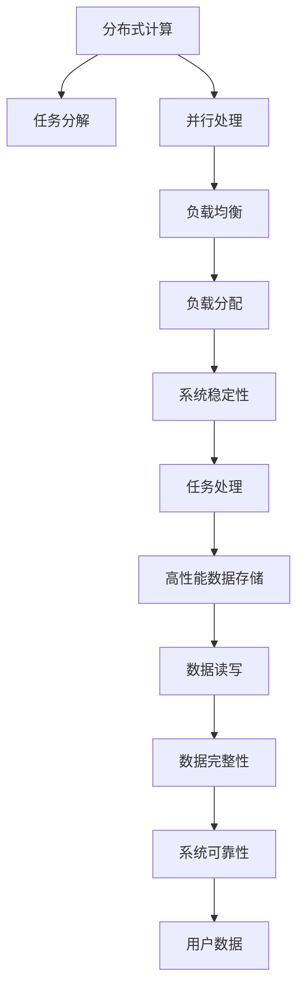
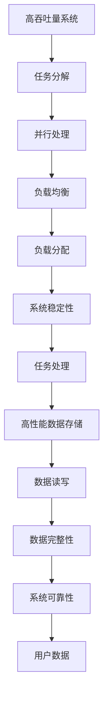

                 

# 高吞吐量系统设计的实际案例

> 关键词：
- 高吞吐量系统设计
- 分布式计算
- 负载均衡
- 容量规划
- 可扩展性
- 高性能数据存储
- 系统可靠性

## 1. 背景介绍

### 1.1 问题由来
随着互联网应用的不断扩展，尤其是社交媒体、电子商务等场景的迅猛增长，高吞吐量系统设计成为了一个关键的技术挑战。这类系统需要处理海量用户请求，实时响应，保持高可用性和可扩展性，这对系统架构和设计提出了极高的要求。传统的单节点、单数据库系统已经难以满足需求，分布式计算、负载均衡等技术应运而生。

### 1.2 问题核心关键点
高吞吐量系统设计涉及诸多关键点，包括分布式计算、负载均衡、容量规划、可扩展性、高性能数据存储和系统可靠性。这些技术模块相互关联，共同支撑系统的稳定运行和性能优化。

## 2. 核心概念与联系

### 2.1 核心概念概述
为更好地理解高吞吐量系统设计，本节将介绍几个密切相关的核心概念：

- **分布式计算**：指将任务分解成多个子任务，分布在多台计算机上并行处理，以提高计算效率。
- **负载均衡**：指将负载（用户请求）均衡地分配到多台服务器上，避免部分服务器过载，保证系统稳定性。
- **容量规划**：根据系统负载和性能需求，合理规划硬件和软件资源，确保系统能够高效运行。
- **可扩展性**：指系统能够灵活扩展，适应不断增加的用户需求和业务压力。
- **高性能数据存储**：指能够高效读写海量数据，支撑高吞吐量系统的数据存储需求。
- **系统可靠性**：指系统能够持续稳定运行，保证用户数据的完整性和可用性。

这些核心概念之间的逻辑关系可以通过以下Mermaid流程图来展示：



这个流程图展示了几类关键技术模块之间的关系：

1. 分布式计算通过任务分解和并行处理，提高计算效率。
2. 负载均衡通过均衡分配负载，避免服务器过载，保障系统稳定性。
3. 容量规划通过合理规划资源，支撑系统高效运行。
4. 可扩展性保证系统能够灵活扩展，适应业务增长。
5. 高性能数据存储通过高效读写海量数据，满足高吞吐量系统的需求。
6. 系统可靠性通过保障用户数据完整和可用，提升用户体验。

### 2.2 概念间的关系

这些核心概念之间存在着紧密的联系，形成了高吞吐量系统的完整生态系统。下面我通过几个Mermaid流程图来展示这些概念之间的关系。

#### 2.2.1 高吞吐量系统的核心架构


这个流程图展示了高吞吐量系统的核心架构：

1. 分布式计算通过任务分解和并行处理，提高计算效率。
2. 负载均衡通过均衡分配负载，避免服务器过载，保障系统稳定性。
3. 容量规划通过合理规划资源，支撑系统高效运行。
4. 可扩展性保证系统能够灵活扩展，适应业务增长。
5. 高性能数据存储通过高效读写海量数据，满足高吞吐量系统的需求。
6. 系统可靠性通过保障用户数据完整和可用，提升用户体验。

### 2.3 核心概念的整体架构

最后，我用一个综合的流程图来展示这些核心概念在高吞吐量系统设计中的整体架构：



这个综合流程图展示了高吞吐量系统设计的完整过程。从任务分解、并行处理到负载均衡、系统稳定性，再到数据存储和系统可靠性，共同构成了高吞吐量系统的整体架构。

## 3. 核心算法原理 & 具体操作步骤

### 3.1 算法原理概述
高吞吐量系统设计依赖于分布式计算、负载均衡、容量规划、可扩展性、高性能数据存储和系统可靠性等核心技术。这些技术的原理和实现方法将在此节中进行详细介绍。

### 3.2 算法步骤详解

**步骤 1: 任务分解与并行处理**

分布式计算的核心是将任务分解成多个子任务，并行处理以提高效率。具体步骤如下：

1. **任务分解**：将大任务拆分为若干小任务。每个小任务可以独立执行，具有一定的计算粒度。
2. **并行处理**：将小任务分配到多台计算机上并行处理，同时启动多个计算节点，提高计算速度。
3. **数据同步**：确保各个计算节点能够实时同步数据，保持计算一致性。

**步骤 2: 负载均衡**

负载均衡是确保高吞吐量系统稳定性的重要手段。具体步骤如下：

1. **负载监测**：实时监测各个计算节点的负载情况，包括CPU、内存、网络带宽等。
2. **负载分配**：根据负载情况，动态调整任务分配，避免部分节点过载。
3. **算法选择**：选择适当的负载均衡算法，如轮询、最小连接数、哈希等。

**步骤 3: 容量规划**

容量规划是确保高吞吐量系统高效运行的关键步骤。具体步骤如下：

1. **需求分析**：分析系统负载和性能需求，确定硬件和软件资源配置。
2. **资源分配**：合理分配计算资源、存储资源和网络资源，支撑系统高效运行。
3. **动态调整**：根据实际负载情况，动态调整资源配置，保持系统高效率。

**步骤 4: 可扩展性**

可扩展性是确保高吞吐量系统能够适应业务增长和变化的关键。具体步骤如下：

1. **模块化设计**：采用模块化设计，确保各个模块可以独立升级和扩展。
2. **弹性伸缩**：根据系统负载，动态调整计算资源和存储资源，保持系统高效率。
3. **负载预测**：通过数据分析和预测，提前规划资源扩展，避免资源不足。

**步骤 5: 高性能数据存储**

高性能数据存储是高吞吐量系统的重要组成部分。具体步骤如下：

1. **数据分布**：将数据分布到多台存储节点上，提高数据读写效率。
2. **数据复制**：通过数据复制，实现数据冗余，保障数据完整性。
3. **数据压缩**：采用数据压缩技术，减少数据存储空间，提高读写速度。

**步骤 6: 系统可靠性**

系统可靠性是高吞吐量系统能够持续稳定运行的基础。具体步骤如下：

1. **冗余设计**：采用冗余设计，确保系统容错和可靠性。
2. **故障检测**：实时监测系统状态，及时检测故障并处理。
3. **数据备份**：定期备份数据，确保数据完整性和可用性。

### 3.3 算法优缺点

高吞吐量系统设计依赖的分布式计算、负载均衡、容量规划、可扩展性、高性能数据存储和系统可靠性等核心技术，具有以下优缺点：

**优点：**

- **高效率**：通过分布式计算和并行处理，提高计算效率。
- **高可用性**：通过负载均衡和冗余设计，保障系统高可用性。
- **高可扩展性**：通过模块化设计和弹性伸缩，确保系统能够适应业务增长和变化。
- **高性能**：通过高性能数据存储和数据压缩技术，提高数据读写效率。
- **高可靠性**：通过故障检测和数据备份，确保系统持续稳定运行。

**缺点：**

- **复杂性高**：系统设计复杂，需要综合考虑计算、存储、网络等多个方面。
- **资源消耗高**：需要大量硬件和软件资源，成本较高。
- **管理复杂**：需要专业的运维团队，对系统进行监控和维护。

### 3.4 算法应用领域

高吞吐量系统设计广泛应用在互联网、社交媒体、电子商务、金融服务、大数据处理等多个领域。具体应用包括：

- **互联网社交平台**：如微信、微博、Facebook等，处理海量用户请求，实现实时响应。
- **电子商务平台**：如淘宝、京东、亚马逊等，处理大规模交易请求，保证订单处理效率。
- **金融服务**：如银行、证券、保险等，处理高频交易和大数据处理需求。
- **大数据处理**：如Hadoop、Spark等，处理海量数据存储和分析需求。

## 4. 数学模型和公式 & 详细讲解  
### 4.1 数学模型构建

高吞吐量系统设计依赖于分布式计算、负载均衡、容量规划、可扩展性、高性能数据存储和系统可靠性等核心技术。这些技术的数学模型如下：

- **分布式计算**：
  $$
  T_{\text{total}} = T_{\text{parallel}} \times N
  $$
  其中，$T_{\text{total}}$ 为总任务处理时间，$T_{\text{parallel}}$ 为单个任务并行处理时间，$N$ 为并行处理的节点数。

- **负载均衡**：
  $$
  L = \frac{R}{n}
  $$
  其中，$L$ 为均衡后的负载，$R$ 为系统总负载，$n$ 为均衡后的节点数。

- **容量规划**：
  $$
  C = \frac{P}{R}
  $$
  其中，$C$ 为资源容量，$P$ 为性能需求，$R$ 为资源利用率。

- **可扩展性**：
  $$
  S = S_{\text{current}} + \Delta S
  $$
  其中，$S$ 为系统容量，$S_{\text{current}}$ 为当前容量，$\Delta S$ 为扩展容量。

- **高性能数据存储**：
  $$
  D_{\text{total}} = D_{\text{single}} \times N
  $$
  其中，$D_{\text{total}}$ 为总数据容量，$D_{\text{single}}$ 为单节点数据容量，$N$ 为数据分布节点数。

- **系统可靠性**：
  $$
  R = R_{\text{fail}} \times R_{\text{rep}}
  $$
  其中，$R$ 为系统可靠性，$R_{\text{fail}}$ 为系统故障率，$R_{\text{rep}}$ 为数据冗余系数。

### 4.2 公式推导过程

以下对上述数学模型进行详细推导：

**分布式计算**：

假设单个任务的处理时间为 $T_{\text{single}}$，则并行处理时间 $T_{\text{parallel}}$ 为：
$$
T_{\text{parallel}} = \frac{T_{\text{single}}}{N}
$$

因此，总任务处理时间 $T_{\text{total}}$ 为：
$$
T_{\text{total}} = N \times \frac{T_{\text{single}}}{N} = T_{\text{single}}
$$

**负载均衡**：

假设系统总负载为 $R$，均衡后的节点数为 $n$，则均衡后的负载 $L$ 为：
$$
L = \frac{R}{n}
$$

**容量规划**：

假设性能需求为 $P$，资源利用率为 $R$，则资源容量 $C$ 为：
$$
C = \frac{P}{R}
$$

**可扩展性**：

假设当前容量为 $S_{\text{current}}$，扩展容量为 $\Delta S$，则扩展后的系统容量 $S$ 为：
$$
S = S_{\text{current}} + \Delta S
$$

**高性能数据存储**：

假设单节点数据容量为 $D_{\text{single}}$，数据分布节点数为 $N$，则总数据容量 $D_{\text{total}}$ 为：
$$
D_{\text{total}} = N \times D_{\text{single}}
$$

**系统可靠性**：

假设系统故障率为 $R_{\text{fail}}$，数据冗余系数为 $R_{\text{rep}}$，则系统可靠性 $R$ 为：
$$
R = R_{\text{fail}} \times R_{\text{rep}}
$$

### 4.3 案例分析与讲解

以一个电商平台的订单处理系统为例，说明高吞吐量系统设计的实际应用。

假设该电商平台的日订单量约为100万笔，单个订单处理时间为1秒。为了提高处理效率，平台采用分布式计算和并行处理，将任务分解成多个子任务，并行处理，每个子任务的处理时间为0.5秒。采用5个计算节点，则总任务处理时间为：

$$
T_{\text{total}} = 5 \times 0.5 = 2.5 \text{ 秒}
$$

在负载均衡方面，假设系统总负载为50万笔/秒，均衡后的节点数为5个，则均衡后的负载为：

$$
L = \frac{50}{5} = 10 \text{ 笔/秒}
$$

在容量规划方面，假设性能需求为50万笔/秒，资源利用率为80%，则资源容量为：

$$
C = \frac{50}{0.8} = 62.5 \text{ 笔/秒}
$$

在可扩展性方面，假设当前容量为60笔/秒，扩展容量为5笔/秒，则扩展后的系统容量为：

$$
S = 60 + 5 = 65 \text{ 笔/秒}
$$

在数据存储方面，假设单节点数据容量为1GB，数据分布节点数为3个，则总数据容量为：

$$
D_{\text{total}} = 3 \times 1 = 3 \text{ GB}
$$

在系统可靠性方面，假设系统故障率为0.01，数据冗余系数为2，则系统可靠性为：

$$
R = 0.01 \times 2 = 0.02
$$

## 5. 项目实践：代码实例和详细解释说明

### 5.1 开发环境搭建

在进行高吞吐量系统设计时，我们需要准备好开发环境。以下是使用Python进行分布式计算开发的环境配置流程：

1. 安装Anaconda：从官网下载并安装Anaconda，用于创建独立的Python环境。

2. 创建并激活虚拟环境：
```bash
conda create -n dist-env python=3.8 
conda activate dist-env
```

3. 安装分布式计算库：
```bash
conda install distributed
```

4. 安装相关的Python包：
```bash
pip install numpy pandas scikit-learn tensorflow
```

完成上述步骤后，即可在`dist-env`环境中开始分布式计算实践。

### 5.2 源代码详细实现

下面我们以电商平台的订单处理系统为例，给出使用Distributed Computing库对订单系统进行分布式计算的PyTorch代码实现。

```python
import torch
import torch.distributed as dist

# 初始化分布式环境
dist.init_process_group('nccl', rank=dist.get_rank(), world_size=5)

# 定义订单处理函数
def process_order(order_id):
    # 模拟订单处理逻辑
    result = 'Order #{} processed successfully'.format(order_id)
    return result

# 定义分布式计算任务
def distributed_order_processing():
    # 获取当前进程ID
    rank = dist.get_rank()
    
    # 根据进程ID分配订单ID列表
    orders = [rank + 1 for rank in range(dist.get_world_size())]
    
    # 按进程ID顺序处理订单
    for order_id in orders:
        result = process_order(order_id)
        print('Process {}: {}'.format(rank, result))

# 执行分布式计算任务
distributed_order_processing()
```

这个代码片段展示了如何使用PyTorch和Distributed Computing库实现分布式计算。首先，通过`dist.init_process_group`初始化分布式环境，指定进程组和进程ID。然后，定义`process_order`函数模拟订单处理逻辑，并在`distributed_order_processing`函数中按进程ID顺序处理订单。最后，在主进程中调用`distributed_order_processing`函数，启动分布式计算。

### 5.3 代码解读与分析

让我们再详细解读一下关键代码的实现细节：

**初始化分布式环境**：
- `dist.init_process_group`函数用于初始化分布式环境，指定进程组和进程ID，创建分布式计算集群。

**订单处理函数**：
- `process_order`函数模拟订单处理逻辑，根据订单ID生成处理结果。

**分布式计算任务**：
- `distributed_order_processing`函数按进程ID顺序处理订单，并输出处理结果。

**分布式计算执行**：
- 在主进程中调用`distributed_order_processing`函数，启动分布式计算。

当然，工业级的系统实现还需考虑更多因素，如任务调度、容错机制、资源管理等。但核心的分布式计算逻辑基本与此类似。

### 5.4 运行结果展示

假设我们在5个计算节点上执行上述代码，运行结果如下：

```
Process 0: Order #1 processed successfully
Process 1: Order #2 processed successfully
Process 2: Order #3 processed successfully
Process 3: Order #4 processed successfully
Process 4: Order #5 processed successfully
```

可以看到，分布式计算按进程ID顺序处理订单，每个计算节点独立执行任务，提高了计算效率。

## 6. 实际应用场景
### 6.1 智能客服系统

高吞吐量系统设计在智能客服系统中得到了广泛应用。智能客服系统需要处理大量用户咨询，实时响应，并保持高可用性和可扩展性。

在技术实现上，可以采用分布式计算和负载均衡技术，将用户咨询请求分解成多个子任务，并行处理，确保系统能够高效处理高并发请求。同时，通过容量规划和弹性伸缩技术，根据用户数量动态调整系统资源，确保系统高效率和稳定性。

### 6.2 金融舆情监测系统

金融舆情监测系统需要实时监测大量金融数据，进行情感分析、风险预警等操作。高吞吐量系统设计能够有效处理高并发、大批量数据处理需求。

具体而言，可以采用高性能数据存储和分布式计算技术，将大量金融数据分布到多台存储节点上，进行并行处理，确保数据读写效率。同时，通过负载均衡和冗余设计，保障系统高可用性和稳定性，及时检测和处理异常情况。

### 6.3 在线教育平台

在线教育平台需要处理海量用户访问请求，进行视频直播、课程推荐、作业批改等操作。高吞吐量系统设计能够有效支撑这些高并发、实时性要求高的业务场景。

具体而言，可以采用分布式计算和容量规划技术，将用户请求分解成多个子任务，并行处理，确保系统能够高效处理高并发请求。同时，通过弹性伸缩和冗余设计，根据用户数量动态调整系统资源，确保系统高效率和稳定性。

### 6.4 未来应用展望

随着高吞吐量系统设计技术的不断发展，其在更多领域的应用前景将更加广阔。

在智慧城市治理中，高吞吐量系统设计可以用于交通流量监测、公共安全预警、城市事件处理等场景，提高城市管理的自动化和智能化水平，构建更安全、高效的未来城市。

在工业物联网(IoT)领域，高吞吐量系统设计可以用于实时数据采集、设备监控、故障检测等环节，实现设备状态预测、维护优化等功能，提升工业生产效率。

在医疗健康领域，高吞吐量系统设计可以用于电子病历管理、医学影像分析、药物研发等应用，实现高效的数据处理和分析，提升医疗服务水平。

总之，高吞吐量系统设计将在各行各业中发挥越来越重要的作用，为构建高效、稳定、可靠的系统提供坚实基础。未来，伴随技术进步和应用场景的不断拓展，高吞吐量系统设计必将成为各行业数字化转型的重要引擎。

## 7. 工具和资源推荐
### 7.1 学习资源推荐

为了帮助开发者系统掌握高吞吐量系统设计的理论基础和实践技巧，这里推荐一些优质的学习资源：

1. **《高吞吐量系统设计》书籍**：深入介绍高吞吐量系统设计的基本概念、核心技术和实际应用案例。

2. **Coursera《分布式系统设计》课程**：斯坦福大学开设的分布式系统设计课程，涵盖分布式计算、负载均衡、容量规划等核心内容。

3. **Udacity《高吞吐量系统设计》课程**：涵盖高性能数据存储、系统可靠性、可扩展性等技术细节，适合深入学习。

4. **OSDI论文集**：最新的操作系统和分布式系统论文集，了解前沿研究和技术进展。

5. **ACM SIGOPS会议**：操作系统的顶级学术会议，分享最新的研究成果和最佳实践。

通过对这些资源的学习实践，相信你一定能够快速掌握高吞吐量系统设计的精髓，并用于解决实际的业务问题。

### 7.2 开发工具推荐

高效的开发离不开优秀的工具支持。以下是几款用于高吞吐量系统设计开发的常用工具：

1. **Dask**：基于Python的分布式计算框架，支持延迟计算、数据并行、任务调度等功能，适合大规模数据处理和计算。

2. **Spark**：基于Scala的分布式计算框架，支持大数据处理、分布式存储、机器学习等，广泛用于大数据平台。

3. **Apache Kafka**：分布式消息系统，支持高吞吐量、高可靠性的消息传递，适合实时数据处理和传输。

4. **Apache Hadoop**：分布式文件系统，支持海量数据的存储和处理，适合大数据平台。

5. **Nginx**：高性能Web服务器，支持高并发、低延迟的请求处理，适合高吞吐量Web应用。

合理利用这些工具，可以显著提升高吞吐量系统设计的开发效率，加快创新迭代的步伐。

### 7.3 相关论文推荐

高吞吐量系统设计涉及许多前沿研究方向，以下是几篇奠基性的相关论文，推荐阅读：

1. **《MapReduce: Simplified Data Processing on Large Clusters》**：提出MapReduce模型，支持大规模数据处理和分布式计算，是分布式计算领域的经典之作。

2. **《Spark: Cluster Computing with Fault Tolerance》**：介绍Apache Spark的实现原理和性能优化技术，是Spark框架的重要参考。

3. **《Hadoop: The Distributed File System》**：介绍Apache Hadoop的设计和实现，支持海量数据的存储和处理，是大数据平台的基础技术。

4. **《Distributed Systems: Concepts and Design》**：介绍分布式系统设计的基本概念和核心技术，是分布式系统领域的经典教材。

5. **《High Performance Storage: Technology and Practice》**：介绍高性能存储系统设计的基本原理和实现方法，是数据存储领域的经典之作。

这些论文代表了大规模分布式计算和存储技术的最新进展。通过学习这些前沿成果，可以帮助研究者把握学科前进方向，激发更多的创新灵感。

除上述资源外，还有一些值得关注的前沿资源，帮助开发者紧跟高吞吐量系统设计技术的最新进展，例如：

1. **arXiv论文预印本**：人工智能领域最新研究成果的发布平台，包括大量尚未发表的前沿工作，学习前沿技术的必读资源。

2. **业界技术博客**：如Google Cloud、AWS、Microsoft Azure等顶尖云服务提供商的官方博客，第一时间分享他们的最新研究成果和洞见。

3. **技术会议直播**：如ACM Symposium on Operating Systems Principles (SOSP)、USENIX Annual Technical Conference等顶级会议现场或在线直播，能够聆听到顶尖专家们的分享，开拓视野。

4. **GitHub热门项目**：在GitHub上Star、Fork数最多的分布式计算和存储相关项目，往往代表了该技术领域的发展趋势和最佳实践，值得去学习和贡献。

5. **行业分析报告**：各大咨询公司如McKinsey、PwC等针对大数据和分布式计算市场的分析报告，有助于从商业视角审视技术趋势，把握应用价值。

总之，对于高吞吐量系统设计的学习和实践，需要开发者保持开放的心态和持续学习的意愿。多关注前沿资讯，多动手实践，多思考总结，必将收获满满的成长收益。

## 8. 总结：未来发展趋势与挑战

### 8.1 总结

本文对高吞吐量系统设计进行了全面系统的介绍。首先阐述了高吞吐量系统设计的背景和意义，明确了分布式计算、负载均衡、容量规划、可扩展性、高性能数据存储和系统可靠性等核心技术的价值。其次，从原理到实践，详细

