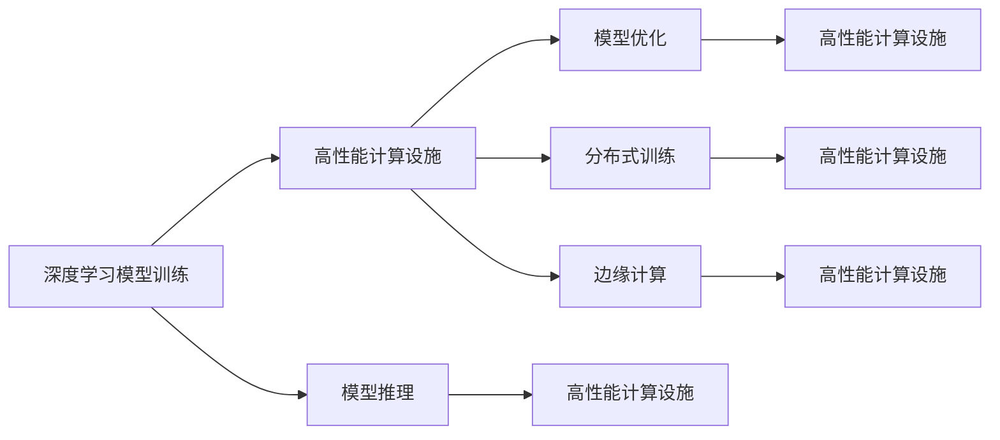

                 

# 高性能计算：AI 2.0 算力基础设施的核心

## 1. 背景介绍

### 1.1 问题由来

随着人工智能（AI）技术的迅猛发展，高性能计算（HPC）在AI 2.0时代正扮演着越来越重要的角色。无论是大规模的深度学习模型训练，还是高效的推理服务，强大的算力都是不可或缺的基础设施。从历史角度看，高性能计算的出现为早期深度学习模型的研究与训练提供了支撑，逐步推动了AI技术的发展。然而，伴随着AI应用场景的广泛普及和需求量的激增，现有高性能计算设施在性能、能效和成本等方面都面临着巨大的挑战。未来，构建高效、可扩展的AI 2.0算力基础设施，成为推动AI技术进一步突破的关键。

### 1.2 问题核心关键点

当前，高性能计算在AI领域的应用主要集中在以下几个方面：

- **深度学习模型训练**：大规模深度学习模型需要巨大的算力和存储资源，通常需要HPC设施支持。例如，GPT-3等大型模型，其训练过程需要数天甚至数周的时间。
- **高效的推理服务**：AI模型需要能够快速响应推理请求，通常也需要高性能计算来保证低延迟和高吞吐量的要求。例如，实时语音识别和视频分析等任务，对算力有着极高的要求。
- **混合精度和模型优化**：深度学习模型通常使用浮点型数据，计算量大、耗电高。为了降低能耗和提升训练效率，HPC设施需要支持混合精度计算和模型优化技术。
- **分布式训练和弹性资源管理**：大规模模型的分布式训练需要高效的HPC设施来协调和管理，确保数据并行性和任务负载均衡。
- **边缘计算**：在资源受限的移动和嵌入式设备上，HPC设施需要支持边缘计算，以提供近端、实时、低延迟的AI服务。

这些高性能计算需求推动了AI 2.0时代算力基础设施的发展，同时也带来了新的挑战和机遇。如何构建高效、可扩展、低成本的AI 2.0算力基础设施，是未来HPC发展的核心问题。

## 2. 核心概念与联系

### 2.1 核心概念概述

为更好地理解高性能计算在AI 2.0时代的应用，本节将介绍几个关键概念：

- **高性能计算（HPC）**：使用专用的硬件和软件架构，以极高的性能和效率处理大规模计算任务。HPC设施通常由超级计算机（Supercomputer）、高性能集群（HPC Cluster）等组成。
- **AI 2.0**：人工智能技术的2.0时代，以深度学习为核心，涵盖更多的数据处理和推理功能。AI 2.0的目标是构建更加智能、自主、安全的AI系统。
- **深度学习模型**：基于神经网络的模型，用于解决图像识别、语音识别、自然语言处理等任务。深度学习模型的训练和推理需要大量计算资源。
- **混合精度计算**：在深度学习模型中，同时使用16位和32位精度进行计算，以减少内存和计算量，提升模型训练速度和推理效率。
- **模型优化**：通过剪枝、量化、蒸馏等技术，降低深度学习模型的参数量和计算复杂度，提升模型的性能和推理速度。
- **分布式训练**：在大规模深度学习模型训练中，将任务分配到多个计算节点并行处理，以提高训练效率。
- **边缘计算**：在靠近数据源的设备上，进行本地计算和数据处理，以实现近端、低延迟的AI服务。

这些核心概念通过高性能计算在AI 2.0时代的应用得以连接，形成了一个完整的生态系统。

### 2.2 概念间的关系

高性能计算在AI 2.0时代的应用，涉及到深度学习模型训练、推理、优化、分布式训练、边缘计算等多个环节，每个环节都需要高性能计算设施的支持。以下是一个Mermaid流程图，展示这些概念之间的逻辑关系：



这个流程图展示了大规模深度学习模型在AI 2.0时代的应用流程，以及高性能计算设施在其中各个环节的角色。

## 3. 核心算法原理 & 具体操作步骤

### 3.1 算法原理概述

高性能计算在AI 2.0时代的应用主要涉及以下几个算法原理：

- **分布式深度学习训练**：使用多个计算节点并行处理深度学习模型的训练过程，减少单个节点的计算量，提升训练效率。
- **混合精度计算**：使用16位和32位精度同时进行深度学习模型的计算，以减少内存占用和计算资源消耗，提升训练和推理效率。
- **模型压缩与量化**：通过剪枝、量化、蒸馏等技术，降低深度学习模型的参数量和计算复杂度，提升模型性能和推理速度。
- **异构计算与加速器**：使用CPU、GPU、TPU等异构计算资源进行深度学习模型的加速，提升训练和推理效率。
- **弹性资源管理与调度**：通过自动化的资源管理与调度技术，确保AI 2.0算力基础设施的高效运行。

### 3.2 算法步骤详解

基于高性能计算的AI 2.0算力基础设施的构建，通常包括以下几个关键步骤：

**Step 1: 硬件配置与选择**

1. 选择高性能计算设施，包括超级计算机、高性能集群、边缘计算设备等。
2. 配置计算资源，包括CPU、GPU、TPU、FPGA等异构计算资源。
3. 部署分布式计算框架，如TensorFlow、PyTorch、MXNet等，支持深度学习模型的分布式训练。

**Step 2: 软件堆栈搭建**

1. 安装深度学习库，如TensorFlow、PyTorch、MXNet等。
2. 配置混合精度计算库，如NVIDIA NCCL、MAGMA等。
3. 部署模型优化工具，如TensorRT、ONNX Runtime等。
4. 配置分布式计算框架，如Kubernetes、Spark等，支持弹性资源管理。

**Step 3: 模型训练与优化**

1. 使用高性能计算设施进行深度学习模型的分布式训练。
2. 使用混合精度计算技术，减少内存和计算资源消耗。
3. 使用模型优化工具进行模型剪枝、量化、蒸馏等处理，降低参数量和计算复杂度。
4. 使用自动化调参工具，如HyperOpt、BayesianOptimization等，进行超参数优化。

**Step 4: 模型推理与部署**

1. 将优化后的深度学习模型部署到高性能计算设施上，进行推理计算。
2. 使用异构计算加速技术，如GPU、TPU、FPGA等，提升推理速度。
3. 使用自动化部署工具，如Ansible、Puppet等，进行模型部署和监控。

**Step 5: 弹性资源管理与调度**

1. 配置资源监控工具，如Nagios、Zabbix等，实时监控计算资源使用情况。
2. 使用自动调度工具，如Kubernetes、YARN等，根据负载动态调整资源配置。
3. 配置自动化任务调度工具，如Cron、Kubernetes Job等，确保任务按时完成。

### 3.3 算法优缺点

高性能计算在AI 2.0时代的应用具有以下优点：

1. **提升训练效率**：分布式深度学习训练、混合精度计算、模型压缩与量化等技术，可以大幅提升深度学习模型的训练效率和推理速度。
2. **降低能耗**：混合精度计算和模型优化技术，可以有效降低深度学习模型训练和推理的能耗。
3. **提高可扩展性**：高性能计算设施支持大规模深度学习模型的分布式训练和推理，具有高度的可扩展性。
4. **降低成本**：通过使用异构计算资源，可以显著降低深度学习模型训练和推理的硬件成本。

同时，也存在一些缺点：

1. **硬件成本高**：高性能计算设施的建设成本较高，需要投入大量的资金。
2. **系统复杂度高**：构建高性能计算设施需要复杂的软件堆栈和硬件配置，维护成本较高。
3. **资源浪费**：在实际应用中，高性能计算设施可能存在资源利用率低的情况，造成一定程度的资源浪费。
4. **兼容性与互操作性问题**：不同的高性能计算设施和深度学习框架之间可能存在兼容性问题，需要额外的配置和调试。

### 3.4 算法应用领域

高性能计算在AI 2.0时代的应用已经涉及多个领域，包括但不限于：

- **自动驾驶**：使用高性能计算设施进行自动驾驶算法训练和推理，确保驾驶安全性。
- **医疗诊断**：使用高性能计算设施进行医疗影像和病历数据的深度学习分析，提高诊断准确率。
- **金融分析**：使用高性能计算设施进行大规模金融数据的深度学习分析，实现风险控制和智能投顾。
- **智能制造**：使用高性能计算设施进行智能制造设备的控制和优化，提升生产效率。
- **智慧城市**：使用高性能计算设施进行城市数据和交通数据的深度学习分析，提升城市治理和公共服务水平。

## 4. 数学模型和公式 & 详细讲解 & 举例说明

### 4.1 数学模型构建

深度学习模型的训练通常涉及以下几个关键步骤：

1. **模型定义**：定义深度学习模型，包括输入、输出、隐藏层、激活函数等。
2. **损失函数**：定义模型输出与真实标签之间的差异，如交叉熵损失、均方误差损失等。
3. **优化器**：定义模型的优化策略，如随机梯度下降（SGD）、Adam等。

以一个简单的线性回归模型为例，其数学模型可以表示为：

$$
y = wx + b
$$

其中 $w$ 为权重，$b$ 为偏置，$x$ 为输入，$y$ 为输出。假设训练集为 $(x_i, y_i)$，则训练目标可以表示为：

$$
L(w, b) = \frac{1}{N} \sum_{i=1}^N (y_i - wx_i - b)^2
$$

### 4.2 公式推导过程

根据上述数学模型，深度学习模型的训练目标是通过最小化损失函数来优化模型参数。使用梯度下降算法，每次迭代更新模型参数的公式为：

$$
\Delta w = -\eta \frac{\partial L}{\partial w}
$$

$$
\Delta b = -\eta \frac{\partial L}{\partial b}
$$

其中 $\eta$ 为学习率，$\frac{\partial L}{\partial w}$ 和 $\frac{\partial L}{\partial b}$ 为损失函数对模型参数的梯度。

在深度学习模型的训练过程中，为了提高效率和性能，通常会使用分布式训练和混合精度计算等技术。

### 4.3 案例分析与讲解

以TensorFlow为例，介绍如何构建高性能计算设施以支持深度学习模型的训练和推理。TensorFlow支持分布式训练，可以在多个计算节点上进行并行处理，提升训练效率。以下是一个分布式训练的示例代码：

```python
import tensorflow as tf

# 定义分布式训练
strategy = tf.distribute.MirroredStrategy()

with strategy.scope():
    model = tf.keras.Sequential([
        tf.keras.layers.Dense(64, activation='relu'),
        tf.keras.layers.Dense(10, activation='softmax')
    ])

    # 定义分布式数据集
    dataset = tf.data.Dataset.from_tensor_slices((x_train, y_train)).batch(64)
    dataset = dataset.repeat().shuffle(10000).batch(128)

    # 训练模型
    model.compile(optimizer=tf.keras.optimizers.Adam(learning_rate=0.001),
                  loss=tf.keras.losses.CategoricalCrossentropy(from_logits=True),
                  metrics=[tf.keras.metrics.CategoricalAccuracy()])
    
    model.fit(dataset, epochs=10)
```

以上代码展示了如何在TensorFlow中使用分布式训练策略，将模型参数分布在多个计算节点上进行并行训练。

## 5. 项目实践：代码实例和详细解释说明

### 5.1 开发环境搭建

构建高性能计算设施需要以下步骤：

1. 选择高性能计算硬件设施，如超级计算机、高性能集群等。
2. 安装深度学习库，如TensorFlow、PyTorch、MXNet等。
3. 配置分布式计算框架，如Kubernetes、Spark等。
4. 配置混合精度计算库，如NVIDIA NCCL、MAGMA等。
5. 部署模型优化工具，如TensorRT、ONNX Runtime等。

以下是一个基本的Python开发环境搭建流程：

1. 安装Python环境，如Anaconda。
2. 安装深度学习库，如TensorFlow、PyTorch、MXNet等。
3. 安装分布式计算框架，如Kubernetes、Spark等。
4. 安装混合精度计算库，如NVIDIA NCCL、MAGMA等。
5. 安装模型优化工具，如TensorRT、ONNX Runtime等。

### 5.2 源代码详细实现

以TensorFlow为例，介绍如何使用分布式训练和混合精度计算技术构建高性能计算设施。以下是一个简单的深度学习模型训练代码示例：

```python
import tensorflow as tf
import tensorflow_datasets as tfds

# 定义分布式训练
strategy = tf.distribute.MirroredStrategy()

with strategy.scope():
    # 定义模型
    model = tf.keras.Sequential([
        tf.keras.layers.Dense(64, activation='relu'),
        tf.keras.layers.Dense(10, activation='softmax')
    ])

    # 定义损失函数和优化器
    loss_fn = tf.keras.losses.CategoricalCrossentropy(from_logits=True)
    optimizer = tf.keras.optimizers.Adam(learning_rate=0.001)

    # 加载数据集
    dataset, info = tfds.load('mnist', split='train', with_info=True, as_supervised=True)

    # 定义数据预处理
    def preprocess_fn(examples, labels):
        image, label = examples
        image = tf.cast(image, tf.float32) / 255.0
        label = tf.one_hot(label, 10)
        return image, label

    # 定义分布式数据集
    dataset = dataset.map(preprocess_fn)
    dataset = dataset.batch(64)
    dataset = dataset.repeat().shuffle(10000).batch(128)

    # 训练模型
    model.compile(optimizer=optimizer, loss=loss_fn, metrics=[tf.keras.metrics.CategoricalAccuracy()])

    # 使用分布式策略进行训练
    with strategy.scope():
        model.fit(dataset, epochs=10)
```

以上代码展示了如何在TensorFlow中使用分布式训练和混合精度计算技术构建高性能计算设施。

### 5.3 代码解读与分析

以下是代码中几个关键部分的解读与分析：

1. **分布式训练策略**：使用TensorFlow的MirroredStrategy策略，将模型参数分布在多个计算节点上进行并行训练，提升训练效率。
2. **混合精度计算**：使用float16和float32混合精度计算，减少内存和计算资源消耗，提升训练和推理效率。
3. **模型定义与优化**：定义深度学习模型和优化器，使用CategoricalCrossentropy损失函数进行训练，使用CategoricalAccuracy评估函数进行模型评估。
4. **数据预处理**：使用TensorFlow的map函数对数据集进行预处理，包括数据归一化和标签转换。

### 5.4 运行结果展示

使用上述代码进行深度学习模型训练后，可以在测试集上评估模型的性能。以下是一个简单的测试代码示例：

```python
# 加载测试集
test_dataset, info = tfds.load('mnist', split='test', with_info=True, as_supervised=True)

# 定义数据预处理
def preprocess_fn(examples, labels):
    image, label = examples
    image = tf.cast(image, tf.float32) / 255.0
    label = tf.one_hot(label, 10)
    return image, label

# 定义分布式数据集
test_dataset = test_dataset.map(preprocess_fn)
test_dataset = test_dataset.batch(64)
test_dataset = test_dataset.repeat().shuffle(10000).batch(128)

# 评估模型
with strategy.scope():
    model.evaluate(test_dataset)
```

以上代码展示了如何在TensorFlow中使用分布式训练和混合精度计算技术构建高性能计算设施，并在测试集上评估模型的性能。

## 6. 实际应用场景

### 6.1 自动驾驶

自动驾驶是高性能计算在AI 2.0时代的典型应用场景之一。自动驾驶算法训练和推理需要大规模的计算资源和存储资源，通常使用高性能计算设施进行支持。例如，Waymo、特斯拉等公司使用超级计算机和分布式集群进行自动驾驶算法的训练和推理。

### 6.2 医疗诊断

医疗诊断是高性能计算在AI 2.0时代的另一个重要应用场景。医疗影像和病历数据的深度学习分析需要大量的计算资源，通常使用高性能计算设施进行支持。例如，Google Health使用Tensor Processing Unit（TPU）进行大规模医疗影像分析。

### 6.3 金融分析

金融分析是高性能计算在AI 2.0时代的重要应用场景之一。大规模金融数据的深度学习分析需要大量的计算资源，通常使用高性能计算设施进行支持。例如，JP Morgan使用超级计算机进行风险分析和智能投顾。

### 6.4 智能制造

智能制造是高性能计算在AI 2.0时代的另一个重要应用场景。智能制造设备的控制和优化需要大规模的计算资源，通常使用高性能计算设施进行支持。例如，Siemens使用超级计算机进行智能制造设备的控制和优化。

### 6.5 智慧城市

智慧城市是高性能计算在AI 2.0时代的另一个重要应用场景。城市数据和交通数据的深度学习分析需要大量的计算资源，通常使用高性能计算设施进行支持。例如，Microsoft使用超级计算机进行智慧城市的数据分析。

## 7. 工具和资源推荐

### 7.1 学习资源推荐

为了帮助开发者系统掌握高性能计算在AI 2.0时代的应用，这里推荐一些优质的学习资源：

1. 《深度学习》（Ian Goodfellow）：深入讲解深度学习模型的基本原理和应用。
2. 《高性能计算》（John C. Chong）：详细介绍高性能计算的硬件和软件架构。
3. 《TensorFlow官方文档》：提供TensorFlow的全面文档和示例代码。
4. 《PyTorch官方文档》：提供PyTorch的全面文档和示例代码。
5. 《MXNet官方文档》：提供MXNet的全面文档和示例代码。

### 7.2 开发工具推荐

高效的开发离不开优秀的工具支持。以下是几款用于高性能计算的常用工具：

1. TensorFlow：基于Python的开源深度学习框架，支持分布式计算和混合精度计算。
2. PyTorch：基于Python的开源深度学习框架，支持分布式计算和混合精度计算。
3. MXNet：基于Python的开源深度学习框架，支持分布式计算和混合精度计算。
4. NVIDIA NCCL：高性能通信库，支持混合精度计算和分布式训练。
5. NVIDIA MAGMA：高性能数学库，支持混合精度计算和模型优化。
6. Kubernetes：开源容器编排系统，支持弹性资源管理和分布式计算。
7. Spark：开源分布式计算框架，支持大规模数据处理和机器学习。

### 7.3 相关论文推荐

高性能计算在AI 2.0时代的发展涉及众多领域的学术论文，以下是几篇代表性论文：

1. 《A Survey on Deep Learning in Edge Computing》（IEEE Transactions on Parallel and Distributed Systems, 2020）：综述了深度学习在边缘计算中的应用。
2. 《Efficient Training of Deep Neural Networks: A Survey of Quantization and Pruning Techniques》（IEEE Transactions on Neural Networks and Learning Systems, 2016）：综述了深度学习模型的剪枝和量化技术。
3. 《GPU-Accelerated Dataflow Management for Distributed Deep Learning Training》（ACM Transactions on Modeling and Performance Evaluation of Computing Systems, 2018）：研究了GPU加速的分布式深度学习训练技术。
4. 《Towards a New Data-Centric Computing Model: A Survey of Research Challenges》（ACM Computing Surveys, 2018）：综述了数据中心计算模型和优化技术。

## 8. 总结：未来发展趋势与挑战

### 8.1 总结

本文对高性能计算在AI 2.0时代的应用进行了全面系统的介绍。首先阐述了高性能计算和AI 2.0时代的背景和意义，明确了高性能计算在AI 2.0时代的重要作用。其次，从原理到实践，详细讲解了高性能计算在AI 2.0时代的应用，包括分布式训练、混合精度计算、模型优化、异构计算等。最后，通过实际应用场景、学习资源、开发工具和相关论文等推荐，为高性能计算在AI 2.0时代的发展提供了全面的支持。

通过本文的系统梳理，可以看到，高性能计算在AI 2.0时代的应用已经渗透到多个领域，并推动了AI技术的发展和落地。未来，随着深度学习模型的规模化和智能化，高性能计算的需求将更加显著，HPC设施的构建和优化也面临着新的挑战和机遇。

### 8.2 未来发展趋势

展望未来，高性能计算在AI 2.0时代的发展将呈现以下几个趋势：

1. **超级计算机的演进**：超级计算机将不断升级和优化，以支持更大规模的深度学习模型训练和推理。
2. **混合精度计算的普及**：混合精度计算技术将进一步普及，降低深度学习模型的能耗和计算资源消耗。
3. **模型优化技术的进步**：深度学习模型的剪枝、量化、蒸馏等技术将不断进步，提升模型的性能和推理速度。
4. **分布式计算的扩展**：分布式计算框架将不断扩展和优化，支持更大规模的分布式深度学习训练和推理。
5. **边缘计算的扩展**：边缘计算设施将不断扩展和优化，支持低延迟、高吞吐量的AI服务。

### 8.3 面临的挑战

尽管高性能计算在AI 2.0时代的应用已经取得了显著进展，但仍面临诸多挑战：

1. **硬件成本高**：高性能计算设施的建设成本较高，需要投入大量的资金。
2. **系统复杂度高**：构建高性能计算设施需要复杂的软件堆栈和硬件配置，维护成本较高。
3. **资源浪费**：在实际应用中，高性能计算设施可能存在资源利用率低的情况，造成一定程度的资源浪费。
4. **兼容性问题**：不同的高性能计算设施和深度学习框架之间可能存在兼容性问题，需要额外的配置和调试。

### 8.4 研究展望

未来，高性能计算在AI 2.0时代的研究将需要在以下几个方向寻求新的突破：

1. **异构计算的融合**：将CPU、GPU、TPU等异构计算资源进行优化融合，提升计算效率和性能。
2. **模型压缩与量化**：开发更加先进的模型压缩和量化技术，降低深度学习模型的参数量和计算复杂度。
3. **分布式计算的优化**：进一步优化分布式计算框架和调度算法，支持更大规模的分布式深度学习训练和推理。
4. **混合精度计算的优化**：开发更加高效的混合精度计算库和算法，提升计算效率和能效。
5. **边缘计算的优化**：优化边缘计算设施和算法，提升低延迟、高吞吐量的AI服务性能。

这些研究方向的探索，将推动高性能计算在AI 2.0时代的发展，提升AI技术的应用效率和性能，为更多行业带来创新和变革。

## 9. 附录：常见问题与解答

**Q1: 高性能计算设施在AI 2.0时代有哪些应用场景？**

A: 高性能计算设施在AI 2.0时代的应用场景非常广泛，包括但不限于：

- 自动驾驶：用于自动驾驶算法的训练和推理。
- 医疗诊断：用于医疗影像和病历数据的深度学习分析。
- 金融分析：用于大规模金融数据的深度学习分析。
- 智能制造：用于智能制造设备的控制和优化。
- 智慧城市：用于城市数据和交通数据的深度学习分析。

**Q2: 如何选择合适的混合精度计算技术？**

A: 选择合适的混合精度计算技术需要考虑以下几个因素：

- 数据类型：不同的数据类型（如整数、浮点数）可能适合不同的混合精度计算技术。
- 硬件设备：不同的硬件设备（如CPU、GPU、TPU）可能支持不同的混合精度计算技术。
- 精度要求：不同的应用场景可能需要不同的精度要求。

**Q3: 如何优化分布式深度学习训练过程？**

A: 优化分布式深度学习训练过程可以从以下几个方面入手：

- 数据并行：使用数据并行技术，将数据分配到多个计算节点上进行并行处理。
- 模型并行：使用模型并行技术，将模型分解为多个子模型并行处理。
- 异步训练：使用异步训练技术，提高计算资源的利用率和训练效率。
- 超参数优化：使用自动化调参工具，优化超参数配置。

**Q4: 如何构建高性能计算设施以支持边缘计算？**

A: 构建高性能计算设施以支持边缘计算需要以下几个步骤：

- 选择高性能计算硬件设备，如嵌入式设备、FPGA等。
- 部署边缘计算框架，如TensorFlow Lite、ONNX Runtime等。
- 进行模型优化和量化，降低计算资源消耗。
- 使用分布式计算框架，支持边缘计算资源的调度和管理。

**Q5: 如何应对高性能计算设施的资源利用率问题？**

A: 应对高性能计算设施的资源利用率问题可以从以下几个方面入手：

- 负载均衡：通过

