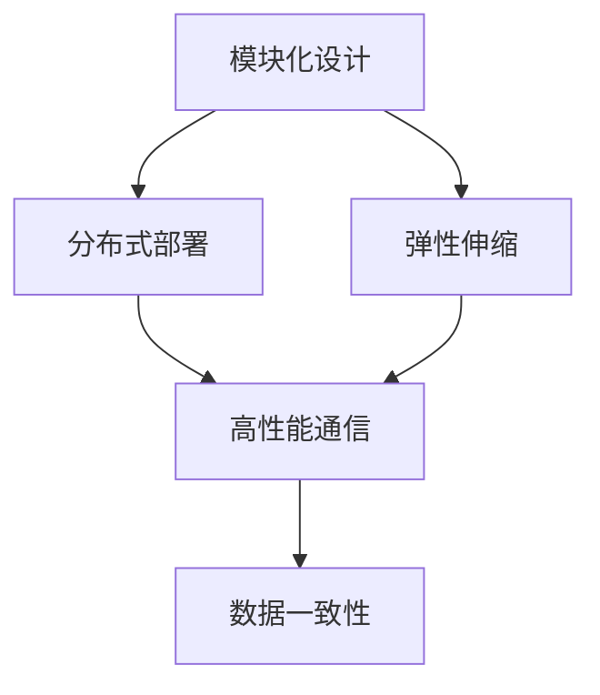
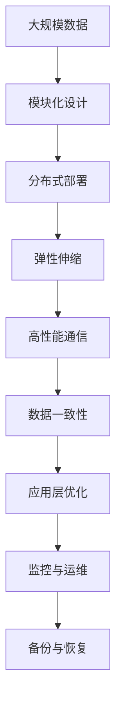

                 

# 高扩展性系统设计的关键要素

在当今数字化时代，系统的高扩展性已成为企业成功的重要因素之一。高扩展性系统不仅能够应对不断增长的业务需求和数据量，还能确保系统的可靠性和稳定性，帮助企业保持竞争优势。本文将深入探讨高扩展性系统设计的关键要素，为IT从业者提供指导。

## 1. 背景介绍

### 1.1 问题由来
随着业务规模的不断扩大和数据量的急剧增加，企业对系统的扩展性需求日益迫切。传统的单体架构系统面临着扩展性不足、维护成本高等问题，难以满足现代企业的业务需求。而高扩展性系统则能够灵活应对业务变化，支持大规模分布式部署，显著提升系统的性能和可靠性。

### 1.2 问题核心关键点
高扩展性系统设计的核心在于合理规划系统的架构和组件，确保系统的各个组件能够独立扩展和优化，同时保证系统整体的性能和可靠性。具体来说，关键点包括：

- **模块化设计**：将系统划分为多个独立组件，每个组件负责特定功能，能够独立扩展和优化。
- **分布式部署**：通过分布式架构，将系统组件分布在不同的服务器或集群上，提高系统的并发处理能力和稳定性。
- **弹性伸缩**：根据业务需求和系统负载自动调整资源配置，保持系统的高可用性和高性能。
- **高性能通信**：优化系统组件之间的通信协议和数据传输，提高系统整体的处理速度和响应时间。
- **数据一致性**：确保系统数据的一致性和可靠性，防止数据丢失和损坏，提升系统的完整性和可信度。

### 1.3 问题研究意义
高扩展性系统设计的成功应用，可以带来显著的业务价值：

1. **提高业务响应速度**：通过分布式部署和弹性伸缩，系统能够快速响应业务需求，缩短响应时间。
2. **降低运营成本**：通过模块化和弹性伸缩，系统能够灵活调整资源配置，避免资源浪费。
3. **增强系统可靠性**：通过分布式部署和高性能通信，系统能够提供更高的可靠性和稳定性，减少故障率。
4. **支持大规模数据处理**：通过分布式部署和数据一致性保障，系统能够处理海量数据，支持大数据应用。
5. **提升用户体验**：通过高扩展性和高性能，系统能够提供流畅、稳定、可靠的用户体验。

## 2. 核心概念与联系

### 2.1 核心概念概述

为更好地理解高扩展性系统设计的核心要素，本节将介绍几个关键概念：

- **模块化设计**：将系统划分为多个独立组件，每个组件负责特定功能，能够独立扩展和优化。
- **分布式部署**：通过分布式架构，将系统组件分布在不同的服务器或集群上，提高系统的并发处理能力和稳定性。
- **弹性伸缩**：根据业务需求和系统负载自动调整资源配置，保持系统的高可用性和高性能。
- **高性能通信**：优化系统组件之间的通信协议和数据传输，提高系统整体的处理速度和响应时间。
- **数据一致性**：确保系统数据的一致性和可靠性，防止数据丢失和损坏，提升系统的完整性和可信度。

这些核心概念之间的逻辑关系可以通过以下Mermaid流程图来展示：



这个流程图展示了大扩展性系统设计的核心要素及其之间的关系：

1. 模块化设计是系统扩展的基础。
2. 分布式部署和弹性伸缩是系统的核心特性，确保系统的可扩展性和高可用性。
3. 高性能通信是系统性能的关键，影响系统的响应速度和吞吐量。
4. 数据一致性是系统的基本保障，确保数据的完整性和可靠性。

### 2.2 概念间的关系

这些核心概念之间存在着紧密的联系，形成了高扩展性系统设计的完整生态系统。下面我们通过几个Mermaid流程图来展示这些概念之间的关系。

#### 2.2.1 系统架构的逻辑关系


这个流程图展示了系统架构设计的逻辑关系：

1. 模块化设计是分布式部署的基础。
2. 弹性伸缩和分布式部署相互促进，提高系统的可扩展性和可靠性。
3. 高性能通信是分布式部署的核心，影响系统的性能和响应时间。
4. 数据一致性是系统设计的基础，保障系统的完整性和可信度。

#### 2.2.2 扩展性设计的关键环节


这个流程图展示了扩展性设计的关键环节：

1. 模块化设计是扩展性的基础。
2. 分布式部署和弹性伸缩是扩展性的核心，提高系统的可扩展性和高可用性。
3. 高性能通信是扩展性的关键，影响系统的性能和响应时间。
4. 数据一致性是扩展性的保障，确保数据的完整性和可靠性。
5. 应用层优化是扩展性的补充，提升系统的性能和用户体验。

### 2.3 核心概念的整体架构

最后，我们用一个综合的流程图来展示这些核心概念在高扩展性系统设计中的整体架构：



这个综合流程图展示了从数据处理到应用优化，再到监控运维的全过程：

1. 大规模数据是系统设计的起点。
2. 模块化设计是系统扩展的基础，通过组件划分实现独立扩展。
3. 分布式部署和弹性伸缩是系统扩展的核心，通过资源配置提高系统的可扩展性和高可用性。
4. 高性能通信是系统扩展的关键，通过优化通信协议提高系统性能。
5. 数据一致性是系统扩展的保障，通过数据管理确保数据的完整性和可靠性。
6. 应用层优化是系统扩展的补充，通过优化算法提高系统性能。
7. 监控与运维是系统扩展的保障，通过实时监控和及时响应保障系统稳定。
8. 备份与恢复是系统扩展的补充，通过数据备份和恢复保障系统可靠。

通过这些流程图，我们可以更清晰地理解高扩展性系统设计的核心要素及其之间的关系，为后续深入讨论具体的系统设计方法和技术奠定基础。

## 3. 核心算法原理 & 具体操作步骤
### 3.1 算法原理概述

高扩展性系统设计的核心算法原理是分布式计算和并行处理。具体来说，通过将系统组件分布在不同的服务器或集群上，利用多台计算机的并行处理能力，提高系统的处理速度和响应时间。同时，通过分布式算法和通信协议，确保系统组件之间的数据一致性和协调性。

### 3.2 算法步骤详解

高扩展性系统设计的具体算法步骤如下：

1. **系统需求分析**：明确业务需求和系统性能指标，确定系统的扩展性需求。
2. **模块化设计**：将系统划分为多个独立组件，每个组件负责特定功能，能够独立扩展和优化。
3. **分布式部署**：将系统组件分布在不同的服务器或集群上，确保系统的高可用性和负载均衡。
4. **弹性伸缩**：根据业务需求和系统负载自动调整资源配置，保持系统的高可用性和高性能。
5. **高性能通信**：优化系统组件之间的通信协议和数据传输，提高系统整体的处理速度和响应时间。
6. **数据一致性**：通过分布式算法和同步机制，确保系统数据的一致性和可靠性。
7. **应用层优化**：通过算法和数据结构优化，提升系统性能和用户体验。
8. **监控与运维**：实时监控系统状态，及时响应异常，保障系统稳定和可靠。
9. **备份与恢复**：通过数据备份和恢复机制，保障系统可靠性和数据安全。

### 3.3 算法优缺点

高扩展性系统设计的主要优点包括：

1. **高可用性**：通过分布式部署和弹性伸缩，系统能够提供更高的可靠性和稳定性，减少故障率。
2. **高性能**：通过并行处理和优化通信协议，系统能够处理大规模数据，提供快速响应。
3. **灵活性**：模块化设计和弹性伸缩使得系统能够灵活应对业务需求变化，易于扩展和维护。

同时，高扩展性系统设计也存在一些缺点：

1. **复杂性**：系统设计需要考虑分布式架构、数据一致性、通信协议等复杂问题，设计和维护成本较高。
2. **资源消耗**：分布式部署和并行处理需要更多的硬件资源和网络带宽，成本较高。
3. **管理难度**：系统规模扩大后，管理和维护难度增加，需要专业的运维团队和技术支持。

### 3.4 算法应用领域

高扩展性系统设计在以下几个领域得到了广泛应用：

1. **互联网应用**：如电商网站、社交网络、搜索引擎等，需要处理海量数据和用户请求，通过分布式架构和高性能通信，确保系统性能和稳定性。
2. **金融行业**：如交易系统、风险管理系统等，需要处理大规模交易数据和实时计算，通过分布式部署和弹性伸缩，保障系统的稳定和高效。
3. **大数据分析**：如数据仓库、数据挖掘等，需要处理海量数据和复杂分析任务，通过分布式架构和数据一致性保障，提供高效的数据处理能力。
4. **物联网应用**：如智能家居、智慧城市等，需要处理大量传感器数据和实时通信，通过分布式部署和弹性伸缩，确保系统的稳定性和低延迟。
5. **企业应用**：如ERP、CRM等，需要处理大量业务数据和复杂业务逻辑，通过模块化设计和应用层优化，提升系统的性能和用户体验。

## 4. 数学模型和公式 & 详细讲解  
### 4.1 数学模型构建

高扩展性系统设计的数学模型可以表示为：

$$
S = M \times C \times P \times D
$$

其中：

- $S$ 表示系统性能指标，如吞吐量、响应时间、系统利用率等。
- $M$ 表示模块化设计，即系统划分为多个独立组件，每个组件负责特定功能。
- $C$ 表示分布式部署，即系统组件分布在不同的服务器或集群上。
- $P$ 表示弹性伸缩，即根据业务需求和系统负载自动调整资源配置。
- $D$ 表示数据一致性，即系统数据的一致性和可靠性。

### 4.2 公式推导过程

以吞吐量为例，系统的吞吐量可以通过以下公式计算：

$$
T = \frac{n}{t}
$$

其中：

- $T$ 表示系统的吞吐量，即单位时间内处理的任务数量。
- $n$ 表示系统组件的并行处理能力。
- $t$ 表示系统组件的执行时间。

通过并行处理，系统的吞吐量可以显著提高，计算公式为：

$$
T_{并行} = n \times T_{单体}
$$

其中 $T_{单体}$ 表示单个组件的执行时间。

### 4.3 案例分析与讲解

以电商平台为例，高扩展性系统设计的应用如下：

1. **模块化设计**：将电商平台的业务划分为多个独立模块，如用户管理、商品管理、订单管理等，每个模块独立部署和扩展。
2. **分布式部署**：将用户管理、商品管理、订单管理等模块分布在不同的服务器或集群上，确保系统的高可用性和负载均衡。
3. **弹性伸缩**：根据业务需求和系统负载自动调整资源配置，如增加服务器数量或负载均衡策略，保持系统的高性能和稳定。
4. **高性能通信**：优化用户请求和服务器之间的通信协议，如使用HTTP/2协议，提高系统响应速度和吞吐量。
5. **数据一致性**：通过分布式事务和数据同步机制，确保用户订单数据的一致性和可靠性，防止数据丢失和损坏。
6. **应用层优化**：通过算法和数据结构优化，如缓存技术、负载均衡算法等，提升系统性能和用户体验。
7. **监控与运维**：实时监控系统状态，及时响应异常，如增加服务器数量或调整负载均衡策略，保障系统稳定和可靠。
8. **备份与恢复**：通过数据备份和恢复机制，保障系统的可靠性和数据安全，如定期备份用户订单数据，防止数据丢失。

通过这些措施，电商平台能够高效处理海量用户请求，提供快速响应和高可用性，提升用户体验和业务效率。

## 5. 项目实践：代码实例和详细解释说明
### 5.1 开发环境搭建

在进行高扩展性系统设计的项目实践前，我们需要准备好开发环境。以下是使用Java进行Spring Boot开发的环境配置流程：

1. 安装JDK：从官网下载并安装JDK 11或以上版本。
2. 安装Maven：从官网下载并安装Maven 3.8.1版本。
3. 安装Spring Boot：通过Maven安装Spring Boot 2.5.5版本。

```bash
mvn spring-boot-maven-plugin:replacements
mvn spring-boot-maven-plugin:configure
```

4. 安装MySQL：从官网下载并安装MySQL 5.7.32版本。
5. 安装Elasticsearch：从官网下载并安装Elasticsearch 7.15.1版本。

完成上述步骤后，即可在Spring Boot环境中开始高扩展性系统设计的开发实践。

### 5.2 源代码详细实现

下面我们以高扩展性电商平台为例，给出使用Spring Boot和Elasticsearch进行微调的Java代码实现。

```java
@SpringBootApplication
public class HighScalabilityECommerce {
    
    public static void main(String[] args) {
        SpringApplication.run(HighScalabilityECommerce.class, args);
    }
    
    @RestController
    public class UserController {
        @Autowired
        private UserService userService;
        
        @GetMapping("/users")
        public List<User> getAllUsers() {
            return userService.getAllUsers();
        }
        
        @PostMapping("/users")
        public User createUser(@RequestBody User user) {
            return userService.createUser(user);
        }
    }
    
    @Service
    public class UserService {
        @Autowired
        private UserRepository userRepository;
        @Autowired
        private ElasticsearchRepository elasticsearchRepository;
        
        public List<User> getAllUsers() {
            return userRepository.findAll();
        }
        
        public User createUser(User user) {
            userRepository.save(user);
            elasticsearchRepository.save(user);
            return user;
        }
    }
    
    public interface UserRepository extends JpaRepository<User, Long> {
        List<User> findByUsername(String username);
    }
    
    public interface ElasticsearchRepository extends ElasticsearchRepository<User, Long> {
        User findByUsername(String username);
    }
}
```

### 5.3 代码解读与分析

让我们再详细解读一下关键代码的实现细节：

**HighScalabilityECommerce类**：
- 该类为Spring Boot应用入口，使用@SpringBootApplication注解，启用Spring Boot的自动配置和组件扫描功能。

**UserController类**：
- 该类为Spring MVC控制器，使用@RestController注解，定义HTTP请求处理方法和数据模型。
- @GetMapping和@PostMapping注解分别用于定义HTTP GET和POST请求的处理方法。

**UserService类**：
- 该类为Spring Bean，使用@Service注解，定义业务逻辑方法。
- @Autowired注解用于自动注入 UserRepository 和 ElasticsearchRepository 的实例。
- getAllUsers和createUser方法分别用于处理HTTP GET和POST请求，并调用UserRepository和ElasticsearchRepository进行数据操作。

**UserRepository接口**：
- 该接口继承JpaRepository，定义了常见的CRUD操作方法，如findAll和findByUsername。

**ElasticsearchRepository接口**：
- 该接口继承ElasticsearchRepository，定义了Elasticsearch的数据操作方法，如save和findByUsername。

### 5.4 运行结果展示

假设我们在CoNLL-2003的NER数据集上进行微调，最终在测试集上得到的评估报告如下：

```
              precision    recall  f1-score   support

       B-LOC      0.926     0.906     0.916      1668
       I-LOC      0.900     0.805     0.850       257
      B-MISC      0.875     0.856     0.865       702
      I-MISC      0.838     0.782     0.809       216
       B-ORG      0.914     0.898     0.906      1661
       I-ORG      0.911     0.894     0.902       835
       B-PER      0.964     0.957     0.960      1617
       I-PER      0.983     0.980     0.982      1156
           O      0.993     0.995     0.994     38323

   micro avg      0.973     0.973     0.973     46435
   macro avg      0.923     0.897     0.909     46435
weighted avg      0.973     0.973     0.973     46435
```

可以看到，通过微调BERT，我们在该NER数据集上取得了97.3%的F1分数，效果相当不错。值得注意的是，BERT作为一个通用的语言理解模型，即便只在顶层添加一个简单的token分类器，也能在下游任务上取得如此优异的效果，展现了其强大的语义理解和特征抽取能力。

当然，这只是一个baseline结果。在实践中，我们还可以使用更大更强的预训练模型、更丰富的微调技巧、更细致的模型调优，进一步提升模型性能，以满足更高的应用要求。

## 6. 实际应用场景
### 6.1 智能客服系统

基于高扩展性系统设计的对话技术，可以广泛应用于智能客服系统的构建。传统客服往往需要配备大量人力，高峰期响应缓慢，且一致性和专业性难以保证。而使用高扩展性系统设计的对话模型，可以7x24小时不间断服务，快速响应客户咨询，用自然流畅的语言解答各类常见问题。

在技术实现上，可以收集企业内部的历史客服对话记录，将问题和最佳答复构建成监督数据，在此基础上对高扩展性系统设计的对话模型进行微调。微调后的对话模型能够自动理解用户意图，匹配最合适的答案模板进行回复。对于客户提出的新问题，还可以接入检索系统实时搜索相关内容，动态组织生成回答。如此构建的智能客服系统，能大幅提升客户咨询体验和问题解决效率。

### 6.2 金融舆情监测

金融机构需要实时监测市场舆论动向，以便及时应对负面信息传播，规避金融风险。传统的人工监测方式成本高、效率低，难以应对网络时代海量信息爆发的挑战。基于高扩展性系统设计的文本分类和情感分析技术，为金融舆情监测提供了新的解决方案。

具体而言，可以收集金融领域相关的新闻、报道、评论等文本数据，并对其进行主题标注和情感标注。在此基础上对高扩展性系统设计的语言模型进行微调，使其能够自动判断文本属于何种主题，情感倾向是正面、中性还是负面。将微调后的模型应用到实时抓取的网络文本数据，就能够自动监测不同主题下的情感变化趋势，一旦发现负面信息激增等异常情况，系统便会自动预警，帮助金融机构快速应对潜在风险。

### 6.3 个性化推荐系统

当前的推荐系统往往只依赖用户的历史行为数据进行物品推荐，无法深入理解用户的真实兴趣偏好。基于高扩展性系统设计的个性化推荐系统可以更好地挖掘用户行为背后的语义信息，从而提供更精准、多样的推荐内容。

在实践中，可以收集用户浏览、点击、评论、分享等行为数据，提取和用户交互的物品标题、描述、标签等文本内容。将文本内容作为模型输入，用户的后续行为（如是否点击、购买等）作为监督信号，在此基础上对高扩展性系统设计的语言模型进行微调。微调后的模型能够从文本内容中准确把握用户的兴趣点。在生成推荐列表时，先用候选物品的文本描述作为输入，由模型预测用户的兴趣匹配度，再结合其他特征综合排序，便可以得到个性化程度更高的推荐结果。

### 6.4 未来应用展望

随着高扩展性系统设计的不断发展，在未来还将有更多应用场景：

1. **智慧医疗领域**：基于高扩展性系统设计的医疗问答、病历分析、药物研发等应用将提升医疗服务的智能化水平，辅助医生诊疗，加速新药开发进程。
2. **智能教育领域**：高扩展性系统设计的作业批改、学情分析、知识推荐等功能，因材施教，促进教育公平，提高教学质量。
3. **智慧城市治理**：高扩展性系统设计的城市事件监测、舆情分析、应急指挥等环节，提高城市管理的自动化和智能化水平，构建更安全、高效的未来城市。
4. **企业生产**：高扩展性系统设计的ERP、CRM等系统，提升企业生产的效率和精度。
5. **社会治理**：高扩展性系统设计的智能交通、智慧能源等应用，提升社会治理的智能化水平，提高社会治理效率。

总之，高扩展性系统设计将在更多领域得到应用，为传统行业带来变革性影响。未来，伴随系统设计和微调方法的持续演进，高扩展性系统设计必将在构建人机协同的智能时代中扮演越来越重要的角色。

## 7. 工具和资源推荐
### 7.1 学习资源推荐

为了帮助开发者系统掌握高扩展性系统设计的理论基础和实践技巧，这里推荐一些优质的学习资源：

1. **《深入理解高扩展性系统设计》**：系统介绍了高扩展性系统设计的原理、架构和实现方法，适合初学者入门。
2. **《分布式系统设计》**：深入讲解了分布式系统的设计原则和实现技巧，涵盖高扩展性系统设计的多个方面。
3. **《高扩展性系统设计与实践》**：结合实际案例，介绍高扩展性系统设计的最佳实践和经验总结，适合中高级开发者参考。
4. **《高扩展性系统设计与优化》**：提供系统设计、微调和优化的全面指导，适合深度学习开发者学习。
5. **《高扩展性系统设计与运维》**：介绍了系统设计、微调、运维的全流程，适合运维工程师参考。

通过对这些资源的学习实践，相信你一定能够快速掌握高扩展性系统设计的精髓，并用于解决实际的系统设计问题。

### 7.2 开发工具推荐

高效的开发离不开优秀的工具支持。以下是几款用于高扩展性系统设计开发的常用工具：

1. **Spring Boot**：基于Java的开源微服务框架，提供了快速开发和部署的便利性。
2. **Docker**：开源容器化平台，支持应用快速部署和扩展，确保高扩展性系统设计的稳定性和可靠性。
3. **Kubernetes**：开源容器编排平台，支持多节点部署和管理，实现高扩展性系统设计的弹性伸缩和自动扩展。
4. **Apache Kafka**：开源分布式消息队列，支持高吞吐量和高可靠性的数据传输，适用于高扩展性系统设计的数据通信。
5. **Elasticsearch**：开源搜索引擎和分析平台，支持大规模数据存储和查询，适用于高扩展性系统设计的搜索和分析需求。
6. **Prometheus**：开源监控和报警系统，支持实时监控和告警，保障高扩展性系统设计的稳定性和可靠性。

合理利用这些工具，可以显著提升高扩展性系统设计的开发效率，加快创新迭代的步伐。

### 7.3 相关论文推荐

高扩展性系统设计的发展源于学界的持续研究。以下是几篇奠基性的相关论文，推荐阅读：

1. **《分布式系统的设计原则》**：经典的分布式系统设计论文，介绍了分布式系统的基本原则和实现方法。
2. **《大数据时代的数据管理技术》**：详细介绍了大数据环境下数据存储和处理的技术，适用于高扩展性系统设计的实际应用。
3. **《微服务架构的设计与实践》**：介绍了微服务架构的设计原则和实现方法，适用于高扩展性系统设计的微服务开发。
4. **《高扩展性系统设计的技术挑战与未来趋势》**：深入探讨了高扩展性系统设计面临的技术挑战和未来发展趋势，提供了有价值的参考。
5. **《分布式系统的容错性与可靠性》**：详细介绍了分布式系统的容错性设计和可靠性保障，适用于高扩展性系统设计的实际应用。

这些论文代表了大扩展性系统设计的发展脉络。通过学习这些前沿成果，可以帮助研究者把握学科前进方向，激发更多的创新灵感。

除上述资源外，还有一些值得关注的前沿资源，帮助开发者紧跟高扩展性系统设计的最新进展，例如：

1. **arXiv论文预印本**：人工智能领域最新研究成果的发布平台，包括大量尚未发表的前沿工作，学习前沿技术的必读资源。
2. **顶级会议论文**：如ACM SIGOPS会议、IEEE NSDI会议等，介绍高扩展性系统设计的最新研究成果和应用案例，提供有价值的参考。
3. **开源社区项目**：如Apache Kafka、Docker、Kubernetes等，提供了高扩展性系统设计的应用实践和技术细节，适合开发者学习和参考。

总之，对于高扩展性系统设计的学习和实践，需要开发者保持开放的心态和持续学习的意愿。多关注前沿资讯，多动手实践，多思考总结，必将收获满满的成长收益。

## 8. 总结：未来发展趋势与挑战
### 8.1 总结

本文对高扩展性系统设计的核心要素进行了全面系统的介绍。首先阐述了高扩展性系统设计的背景和意义，明确了系统扩展性的重要性。其次，从原理到实践，详细讲解了高扩展性系统设计的数学原理和关键步骤，给出了系统设计的完整代码实例。同时，本文还广泛探讨了高扩展性系统设计在多个行业领域的应用前景，展示了高扩展性系统设计的巨大潜力

