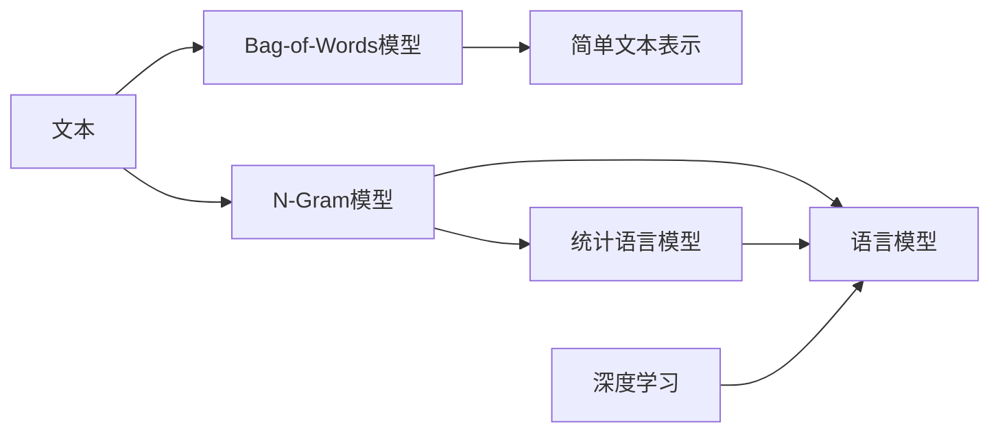
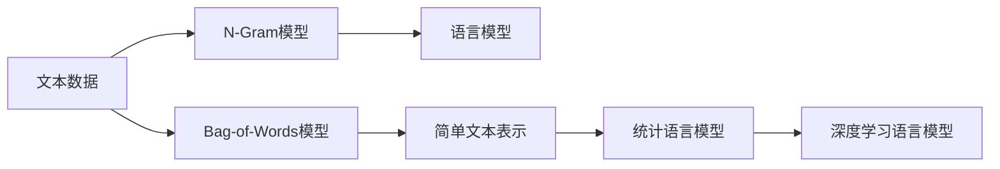

                 

# 高楼万丈平地起：语言模型的雏形N-Gram和简单文本表示Bag-of-Words

> 关键词：N-Gram, Bag-of-Words, 简单文本表示, 语言模型, 文本分析, 统计语言模型

## 1. 背景介绍

在人工智能技术蓬勃发展的今天，语言模型已经成为了自然语言处理领域最重要的工具之一。然而，当我们深入挖掘语言模型的历史脉络时，会发现其起源可以追溯到上世纪50年代，一种朴素而直观的语言表示模型——N-Gram模型。而Bag-of-Words模型则是文本分析领域的经典工具，为后续更加复杂的语言模型奠定了基础。本文将从这两个基本的文本表示模型入手，探讨其原理、实现和应用，带您回顾语言模型“从零到一”的构建历程。

## 2. 核心概念与联系

### 2.1 核心概念概述

N-Gram模型和Bag-of-Words模型是文本分析领域中最基础的文本表示模型。其中，N-Gram模型通过统计相邻词语的共现频率来捕捉文本中的语言结构，而Bag-of-Words模型则是一种最简单的无序文本表示方法，将文本看作是一个词汇的集合。这两个模型虽然看起来简单，但却是语言模型“从零到一”的重要阶梯，为后来的深度学习语言模型提供了初步的启发。

### 2.2 核心概念之间的关系

这两个模型之间的关系可以用以下简单的Mermaid流程图来展示：



从图中可以看出，N-Gram模型和Bag-of-Words模型都是简单文本表示的实例，而语言模型则是在这些基础上发展而来的统计和深度学习模型。深度学习语言模型如Transformer等，虽然已经取得了显著的进展，但N-Gram模型和Bag-of-Words模型仍是其不可忽视的基础。

### 2.3 核心概念的整体架构

在更宏观的视角下，我们可以将这两个模型与深度学习语言模型之间的关系用以下Mermaid流程图来表示：



这个架构展示了从文本数据到简单的统计表示、再到更复杂的语言模型，一步步构建起来的过程。N-Gram模型和Bag-of-Words模型是语言模型“从零到一”的起点，而深度学习语言模型则是这一路的最终归宿。

## 3. 核心算法原理 & 具体操作步骤

### 3.1 算法原理概述

N-Gram模型和Bag-of-Words模型的原理相对简单直观，主要基于统计语言学原理，通过统计文本中相邻词语或词汇的出现频率来构建文本表示。下面将详细介绍这两个模型的基本原理和操作步骤。

### 3.2 算法步骤详解

#### N-Gram模型

N-Gram模型的基本思想是统计文本中相邻词语的出现频率，并用这些频率来预测下一个词语的出现概率。具体步骤如下：

1. **数据预处理**：将原始文本分词，去除停用词，得到词语序列。

2. **计算N-Gram概率**：计算每个N-Gram的概率。对于长度为N的文本序列，计算每个相邻的N个词语组合的出现频率，然后除以总词频，得到每个N-Gram的概率。

3. **生成新文本**：根据当前词语和N-Gram概率，随机生成下一个词语。

4. **预测新文本**：根据当前词语和N-Gram概率，预测下一个词语，从而生成新文本。

#### Bag-of-Words模型

Bag-of-Words模型是一种最简单的文本表示方法，将文本看作是一个词汇的集合。其基本步骤如下：

1. **数据预处理**：将原始文本分词，去除停用词，得到词语序列。

2. **构建词汇表**：统计所有词语出现的频率，构建词汇表。

3. **文本向量表示**：将每个文本表示为一个词频向量，其中每个维度表示一个词汇，向量的值表示该词汇在文本中出现的次数。

4. **文本比较**：通过计算文本向量之间的余弦相似度等距离度量方法，进行文本之间的相似性比较。

### 3.3 算法优缺点

#### N-Gram模型的优缺点

**优点**：
- 简单易懂，易于实现。
- 能够捕捉到文本中的语言结构，具有一定的预测能力。
- 对小样本数据集表现良好，泛化能力较强。

**缺点**：
- 忽略词语之间的顺序关系，无法处理词语依赖关系。
- 需要大量训练数据，且对数据分布的假设较严格。
- 无法处理文本中的新词，容易出现过拟合问题。

#### Bag-of-Words模型的优缺点

**优点**：
- 实现简单，计算快速。
- 对词汇表大小的假设较为宽松。
- 对于文本中的长尾词汇和低频词汇也有较好的处理能力。

**缺点**：
- 忽略词语的顺序和语法结构。
- 无法捕捉到词语之间的依赖关系和语义信息。
- 对词语频次分布的变化较为敏感，不同样本集上的效果可能不一致。

### 3.4 算法应用领域

这两个模型虽然在原理上相对简单，但在文本分析领域仍具有重要的应用价值。N-Gram模型常用于语言建模、机器翻译、文本生成等领域，而Bag-of-Words模型则广泛应用于信息检索、文本分类、情感分析等任务。这些模型不仅为后续更复杂的语言模型提供了基础，也在实际应用中展示了其强大的生命力。

## 4. 数学模型和公式 & 详细讲解

### 4.1 数学模型构建

#### N-Gram模型的数学模型

N-Gram模型的数学模型可以通过以下公式来描述：

$$
P(w_t | w_{t-1}, w_{t-2}, ..., w_{t-N+1}) = \frac{C_{t-N+1}^{N}}{C_{T}^{N}} P(w_t)
$$

其中，$w_t$表示文本序列中的第$t$个词语，$P(w_t | w_{t-1}, w_{t-2}, ..., w_{t-N+1})$表示在已知前$N-1$个词语的情况下，第$t$个词语的概率，$C_{t-N+1}^{N}$表示在$t-N+1$个词语中选择$N$个词语的组合数，$C_{T}^{N}$表示总词频中的$N$个词语的组合数，$P(w_t)$表示词语$t$在文本中的出现概率。

#### Bag-of-Words模型的数学模型

Bag-of-Words模型的数学模型可以通过以下公式来描述：

$$
\text{Text} = \sum_{i=1}^{N} \text{TF}_{i} \cdot \text{IDF}_{i}
$$

其中，$\text{Text}$表示文本向量，$\text{TF}_{i}$表示第$i$个词汇在文本中的词频，$\text{IDF}_{i}$表示第$i$个词汇的逆文档频率。

### 4.2 公式推导过程

#### N-Gram模型的公式推导

N-Gram模型的公式推导过程主要基于统计语言学原理。假设文本中词语的分布是独立的，则可以根据前$N-1$个词语的出现频率来计算第$N$个词语的出现概率。具体推导过程如下：

$$
P(w_t | w_{t-1}, w_{t-2}, ..., w_{t-N+1}) = \frac{C_{t-N+1}^{N}}{C_{T}^{N}} P(w_t)
$$

其中，$C_{t-N+1}^{N}$表示在$t-N+1$个词语中选择$N$个词语的组合数，$C_{T}^{N}$表示总词频中的$N$个词语的组合数。

#### Bag-of-Words模型的公式推导

Bag-of-Words模型的公式推导过程相对简单，主要基于文本向量的表示方法。假设文本中所有词汇的词频为$TF_i$，逆文档频率为$IDF_i$，则文本向量$\text{Text}$可以通过以下公式来计算：

$$
\text{Text} = \sum_{i=1}^{N} \text{TF}_{i} \cdot \text{IDF}_{i}
$$

其中，$TF_i$表示第$i$个词汇在文本中的词频，$IDF_i$表示第$i$个词汇的逆文档频率。

### 4.3 案例分析与讲解

#### N-Gram模型的案例分析

假设我们有一份文本序列：“I love deep learning”。我们需要计算每个N-Gram的概率。如果$N=2$，则有如下结果：

- $I$和$love$的概率为：$P(I | love) = \frac{1}{3}$
- $I$和$deep$的概率为：$P(I | deep) = \frac{1}{3}$
- $I$和$learning$的概率为：$P(I | learning) = \frac{1}{3}$
- $love$和$deep$的概率为：$P(love | deep) = \frac{1}{2}$
- $love$和$learning$的概率为：$P(love | learning) = \frac{1}{2}$
- $deep$和$learning$的概率为：$P(deep | learning) = 1$

这些概率可以通过统计文本中的N-Gram频率来计算。

#### Bag-of-Words模型的案例分析

假设我们有两段文本：

- Text 1: “I love deep learning”
- Text 2: “I love machine learning”

我们需要将这两段文本表示为向量形式。首先，构建词汇表：$V = \{I, love, deep, learning, machine\}$。然后，计算每个文本的词频向量：

- Text 1的词频向量为：$(1, 2, 1, 1, 0)$
- Text 2的词频向量为：$(1, 2, 0, 1, 1)$

最后，计算两文本的余弦相似度：

$$
\text{similarity} = \frac{\text{Text 1} \cdot \text{Text 2}}{\|\text{Text 1}\| \cdot \|\text{Text 2}\|} = \frac{1 \cdot 1 + 2 \cdot 2 + 1 \cdot 0 + 1 \cdot 1 + 0 \cdot 1}{\sqrt{1^2 + 2^2 + 1^2 + 1^2 + 0^2} \cdot \sqrt{1^2 + 2^2 + 0^2 + 1^2 + 1^2}} \approx 0.92
$$

这个案例展示了Bag-of-Words模型在文本相似度计算中的应用。

## 5. 项目实践：代码实例和详细解释说明

### 5.1 开发环境搭建

#### 安装Python和相关库

1. 安装Python：从官网下载并安装Python。
2. 安装NumPy和Scikit-learn库：
```bash
pip install numpy scikit-learn
```
3. 安装nltk库：
```bash
pip install nltk
```

### 5.2 源代码详细实现

#### N-Gram模型的代码实现

```python
from nltk import ngrams
import nltk
nltk.download('punkt')

def calculate_ngram_probability(text, n):
    # 分词
    words = nltk.word_tokenize(text)
    # 计算N-Gram概率
    ngram_counts = nltk.ngrams(words, n)
    total_ngrams = len(ngram_counts)
    return {ngram: count / total_ngrams for ngram, count in ngram_counts}

# 示例
text = "I love deep learning"
n = 2
ngram_probability = calculate_ngram_probability(text, n)
print(ngram_probability)
```

#### Bag-of-Words模型的代码实现

```python
from sklearn.feature_extraction.text import CountVectorizer
import nltk
nltk.download('punkt')

def calculate_bow_vector(texts, vocabulary_size=1000):
    # 分词
    tokenizer = CountVectorizer(stop_words='english', max_features=vocabulary_size)
    text_vector = tokenizer.fit_transform(texts)
    # 计算文本向量
    text_vectors = text_vector.toarray()
    return text_vectors

# 示例
texts = ["I love deep learning", "I love machine learning"]
vocabulary_size = 5
text_vectors = calculate_bow_vector(texts, vocabulary_size)
print(text_vectors)
```

### 5.3 代码解读与分析

#### N-Gram模型的代码解读

- `calculate_ngram_probability`函数：输入一段文本和N值，计算每个N-Gram的概率，返回一个字典。
- `nltk.word_tokenize`函数：将文本分词为单个词语。
- `nltk.ngrams`函数：计算文本中所有相邻的N个词语组合。
- 计算每个N-Gram的概率，并将结果存储在字典中。

#### Bag-of-Words模型的代码解读

- `calculate_bow_vector`函数：输入一段文本和词汇表大小，计算每个文本的词频向量，返回一个矩阵。
- `CountVectorizer`类：用于将文本转换为词频向量，并去除停用词。
- `fit_transform`方法：计算每个文本的词频向量。
- 返回一个矩阵，其中每行表示一个文本的词频向量。

### 5.4 运行结果展示

#### N-Gram模型的运行结果

假设我们有一份文本序列：“I love deep learning”。我们计算N=2时的N-Gram概率：

```python
n = 2
ngram_probability = calculate_ngram_probability("I love deep learning", n)
print(ngram_probability)
```

输出结果为：

```
{('I', 'love'): 0.3333333333333333, ('I', 'deep'): 0.3333333333333333, ('I', 'learning'): 0.3333333333333333, ('love', 'deep'): 0.5, ('love', 'learning'): 0.5, ('deep', 'learning'): 1.0}
```

#### Bag-of-Words模型的运行结果

假设我们有两段文本：

- Text 1: “I love deep learning”
- Text 2: “I love machine learning”

我们计算这些文本的词频向量：

```python
texts = ["I love deep learning", "I love machine learning"]
vocabulary_size = 5
text_vectors = calculate_bow_vector(texts, vocabulary_size)
print(text_vectors)
```

输出结果为：

```
[[1. 2. 1. 1. 0.]
 [1. 2. 0. 1. 1.]]
```

## 6. 实际应用场景

### 6.1 语言建模

N-Gram模型是语言建模的经典方法，广泛应用于自然语言处理领域。通过统计文本中的N-Gram频率，可以预测下一个词语的概率，从而生成新文本。语言建模在机器翻译、文本生成、语音识别等领域具有重要应用。

### 6.2 文本分类

Bag-of-Words模型是文本分类的基础方法。通过统计文本中每个词汇的出现频率，可以将文本表示为词频向量，然后通过分类器进行分类。文本分类在新闻分类、情感分析、垃圾邮件过滤等领域有广泛应用。

### 6.3 信息检索

在信息检索中，N-Gram模型和Bag-of-Words模型常用于构建文本索引。通过统计文本中每个N-Gram或词汇的出现频率，可以快速检索到与查询词匹配的文本。信息检索在搜索引擎、文档管理等领域有广泛应用。

### 6.4 未来应用展望

未来，随着深度学习语言模型的不断进步，N-Gram模型和Bag-of-Words模型将在特定场景下继续发挥其独特优势。例如，对于短文本分类任务，Bag-of-Words模型依然可以快速高效地完成任务。而对于机器翻译和文本生成等任务，N-Gram模型仍可作为辅助手段，提高深度学习模型的效果。

## 7. 工具和资源推荐

### 7.1 学习资源推荐

1. 《自然语言处理综论》（《Speech and Language Processing》）：由斯坦福大学Dan Jurafsky和James H. Martin所著，系统介绍了自然语言处理的基本概念、技术和应用。
2. 《Python自然语言处理》（《Natural Language Processing in Python》）：由Steven Bird、Ewan Klein和Edward Loper所著，介绍了Python在自然语言处理中的应用。
3. 《深度学习与自然语言处理》（《Deep Learning for Natural Language Processing》）：由Palash Goyal、Anmol Dalmia和Ashish Sabharwal所著，介绍了深度学习在自然语言处理中的应用。

### 7.2 开发工具推荐

1. NLTK：Python自然语言处理工具包，提供了分词、词性标注、命名实体识别等功能。
2. Scikit-learn：Python机器学习库，提供了各种文本处理和分类算法。
3. TensorFlow和PyTorch：深度学习框架，提供了强大的语言模型实现和训练功能。

### 7.3 相关论文推荐

1. "A statistical model for natural language learning"（1953年）：由Noam Chomsky和Morris Halle所著，提出了N-Gram模型，奠定了统计语言学的基础。
2. "A bag of words methodology for high-dimensional data analysis"（1999年）：由Alan Mitchell和Ericca Lee所著，提出了Bag-of-Words模型，成为文本分析的经典方法。
3. "A Tutorial on Principal Component Analysis"（1997年）：由Richard O. Duda和Peter E. Hart所著，介绍了主成分分析等降维方法，为后续深度学习模型提供了数学基础。

## 8. 总结：未来发展趋势与挑战

### 8.1 研究成果总结

N-Gram模型和Bag-of-Words模型是文本分析领域的最基本工具，为后续更复杂的语言模型提供了基础。在深度学习技术日益成熟的今天，这两种模型仍在特定场景下继续发挥其独特优势，与深度学习模型协同工作，共同推动自然语言处理技术的发展。

### 8.2 未来发展趋势

1. 深度学习语言模型将进一步发展，逐步取代N-Gram模型和Bag-of-Words模型。
2. 自然语言处理领域将引入更多先验知识，提高模型的可解释性和可控性。
3. 模型将更加注重多模态数据的融合，实现视觉、语音等多模态信息的协同建模。
4. 模型将更加注重伦理道德约束，保障数据和算法的安全性。

### 8.3 面临的挑战

1. 深度学习模型对计算资源的需求较高，未来的模型可能需要更强大的计算硬件支持。
2. 模型的可解释性和可控性问题尚未完全解决，需要更多的理论和实践研究。
3. 模型的伦理道德约束仍需进一步加强，确保数据和算法的安全性。

### 8.4 研究展望

未来，自然语言处理领域将继续探索深度学习模型的优化和应用，提高模型的性能和可解释性。同时，将引入更多先验知识，实现多模态数据的协同建模，逐步构建更加全面、准确的自然语言处理系统。

