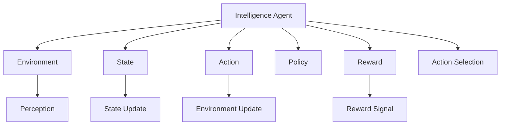

                 

# AI Agent: AI的下一个风口 什么是智能体

> 关键词：智能体,强化学习,多智能体,深度学习,代理系统,协作与竞争

## 1. 背景介绍

### 1.1 问题由来
在人工智能(AI)领域，经过多年发展，无论是传统的符号主义还是后来崛起的深度学习，都已经展现出了巨大的应用潜力和广泛的影响力。然而，随着科技的发展和实际需求的变化，传统的符号主义已经不能满足日益复杂和动态多变的环境需求。以深度学习为代表的监督学习范式，尽管在图像识别、自然语言处理等诸多领域取得了显著成果，但依赖于大量标注数据的特点，也限制了其在更为复杂多变环境中的适应性。

近年来，智能体(Agent)的概念开始受到广泛关注。智能体是AI系统中的一个关键元素，是能感知环境、采取行动以实现特定目标的实体。通过模拟人类或动物的行为，智能体不仅能处理已知信息，还能从经验中学习、调整自身策略，在复杂环境中找到最优解。基于此，智能体逐渐成为AI研究的下一个风口，相关研究和应用领域不断拓展。

### 1.2 问题核心关键点
智能体是人工智能系统中的一个基础组件，其基本特性包括以下几点：

- **感知与环境交互**：智能体通过传感器感知环境状态，理解环境变化，能够根据自身目标对环境做出动态反应。
- **决策与行动**：智能体根据感知到的信息，经过内部决策过程，选择并执行相应的行动。
- **学习与优化**：智能体能够从经验中学习，不断优化自身的策略和行为，提高适应性和执行效果。
- **协作与竞争**：多个智能体之间可以互相协作，形成更加复杂的动态系统。

这些特性使得智能体成为构建复杂动态系统、实现人机协同、提升智能系统的智能化水平的重要手段。

## 2. 核心概念与联系

### 2.1 核心概念概述

为了更好地理解智能体的概念和体系结构，我们首先概述几个核心概念：

- **智能体(Agent)**：具有感知、决策、行动能力的实体，能够在环境中主动采取行动，以实现特定目标。智能体可以是一个简单的控制器，也可以是一个复杂的系统，涉及感知、决策、执行等多个层次。
- **环境(Environment)**：智能体所处的外部环境，包含各种动态变化和潜在障碍，是智能体决策行动的重要依据。
- **策略(Policy)**：智能体的决策规则，包括行动的选取和执行方式，是智能体行为的指导原则。
- **奖励(Reward)**：智能体执行行动后获得的反馈信息，是强化学习中优化策略的关键因素。
- **状态(State)**：智能体感知到的环境状态，是决策和行动的基础，包括位置、速度、对象属性等。
- **动作(Action)**：智能体执行的行动，如移动、攻击、交流等，通过动作调整环境状态。

这些概念共同构成了智能体的基本框架，为构建和理解智能体系统提供了重要基础。

### 2.2 概念间的关系

智能体系统中的各个概念之间存在着紧密的联系，通过一个简单的Mermaid流程图，我们可以更好地理解它们之间的相互作用：



这个流程图展示了智能体与其环境、状态、动作、策略和奖励之间的基本关系：

1. 智能体(Agent)通过感知环境(B)，更新自身状态(C)。
2. 智能体根据状态(C)和策略(E)选择动作(D)，执行后更新环境(B)。
3. 智能体接收环境反馈的奖励(F)，用于策略优化(E)。
4. 状态(C)和动作(D)的变化，由环境(B)接收和处理。

通过这个流程图，我们可以更直观地理解智能体的决策和行动过程，以及如何通过强化学习不断优化策略。

## 3. 核心算法原理 & 具体操作步骤
### 3.1 算法原理概述

智能体的核心算法是强化学习(Reinforcement Learning, RL)，通过在环境中与智能体交互，智能体根据当前状态选择动作，执行后获得环境反馈（奖励），不断优化自身策略。强化学习主要包括以下几个关键步骤：

1. **状态感知(State Perception)**：智能体通过传感器等设备感知环境状态。
2. **动作选择(Action Selection)**：智能体根据当前状态和策略，选择并执行一个动作。
3. **环境响应(Environment Response)**：环境根据智能体的动作做出响应，如改变状态、奖励等。
4. **策略优化(Policy Optimization)**：智能体根据奖励信号，调整决策策略，使其在未来的动作选择中得到更好的表现。

通过不断迭代这个过程，智能体能够逐步优化自身策略，实现复杂的任务和环境适应。

### 3.2 算法步骤详解

基于强化学习的智能体系统，通常包括以下几个关键步骤：

1. **环境搭建**：构建一个模拟或真实的动态环境，供智能体在其中互动。
2. **智能体设计**：设计智能体的感知、决策和执行机制，定义状态和动作空间。
3. **策略选择**：确定智能体的策略，如基于深度神经网络（如DQN、Policy Gradient等）的策略。
4. **奖励设计**：定义奖励函数，用于评估智能体的行为表现，如最大化累积奖励。
5. **训练过程**：智能体在环境中与环境交互，通过策略优化不断调整行为，直至达到预设的目标。

以DQN（Deep Q-Network）为例，DQN是一种基于深度神经网络的强化学习算法，用于解决复杂环境中的动作选择问题。其核心步骤如下：

1. **状态感知**：智能体通过感知当前状态，将状态向量输入神经网络。
2. **动作选择**：神经网络输出动作值，选择动作概率最大的行为。
3. **环境响应**：智能体执行动作，观察环境反馈。
4. **策略优化**：根据奖励信号和动作-状态对的Q值，更新神经网络参数，优化策略。

### 3.3 算法优缺点

强化学习算法的优点包括：

- **自适应能力强**：智能体能够在复杂、动态的环境中进行学习和优化。
- **鲁棒性好**：智能体通过优化策略，可以适应环境变化，具有较强的鲁棒性。
- **应用广泛**：强化学习已经成功应用于游戏、机器人控制、自动驾驶等多个领域。

其缺点包括：

- **训练周期长**：强化学习算法通常需要大量数据和计算资源进行训练。
- **易陷入局部最优**：在复杂环境中，智能体容易陷入局部最优，难以找到全局最优解。
- **可解释性差**：强化学习算法的内部决策过程较为复杂，难以进行解释和调试。

尽管存在这些局限性，强化学习算法在大规模环境适应、复杂任务处理等方面的优越性，使其在智能体系统的构建中具有不可替代的地位。

### 3.4 算法应用领域

智能体和强化学习算法已经被广泛应用于多个领域，具体包括：

1. **游戏AI**：如AlphaGo、AlphaStar等，通过强化学习实现复杂的博弈策略。
2. **机器人控制**：如Boston Dynamics的Spot机器人、NASA的Robonaut等，通过强化学习实现自主导航和操作。
3. **自动驾驶**：如Waymo、特斯拉等公司的自动驾驶系统，通过强化学习优化行驶策略，确保安全。
4. **智能推荐**：如Netflix、Amazon等推荐系统，通过强化学习优化用户交互，提升推荐效果。
5. **金融交易**：通过强化学习优化交易策略，实现智能投资和风险控制。
6. **医疗决策**：通过强化学习优化诊断和治疗策略，提高医疗服务的智能化水平。
7. **工业控制**：通过强化学习优化生产流程和资源分配，提高生产效率和产品质量。

这些领域的应用展示了强化学习算法在实际场景中的强大潜力和广泛适用性。

## 4. 数学模型和公式 & 详细讲解  
### 4.1 数学模型构建

在强化学习中，常见的数学模型包括状态-动作空间、奖励函数、策略和值函数等。

假设环境中有$N$个状态$s_i$，智能体有$A$个可选动作$a_j$，则状态-动作空间可以表示为$S \times A$。定义奖励函数$r(s_t,a_t)$，用于评估智能体在状态$s_t$下执行动作$a_t$的即时奖励。策略$\pi(a_t|s_t)$表示在状态$s_t$下选择动作$a_t$的概率分布。

值函数$Q(s_t,a_t)$表示在状态$s_t$下执行动作$a_t$的长期累积奖励，可以表示为：

$$ Q(s_t,a_t) = \sum_{k=0}^{H-1} \gamma^k r(s_{t+k},a_{t+k}) $$

其中，$H$为环境的最大步骤数，$\gamma$为折扣因子。

### 4.2 公式推导过程

以下以Q-Learning算法为例，推导Q值更新公式：

1. 定义状态-动作对的Q值更新公式：
$$ Q(s_t,a_t) \leftarrow Q(s_t,a_t) + \alpha \left[ r(s_t,a_t) + \gamma \max_{a'} Q(s_{t+1},a') - Q(s_t,a_t) \right] $$

其中，$\alpha$为学习率，$Q(s_{t+1},a')$为下一个状态的最优动作值。

2. 将折扣因子$\gamma$展开，得到：
$$ Q(s_t,a_t) \leftarrow Q(s_t,a_t) + \alpha \left[ r(s_t,a_t) + \gamma \sum_{i=1}^{N} \gamma^{i-1} r(s_{t+i},a_{t+i}) - Q(s_t,a_t) \right] $$

3. 结合状态值函数，可以得到状态值更新公式：
$$ Q(s_t,a_t) \leftarrow Q(s_t,a_t) + \alpha \left[ r(s_t,a_t) + \gamma V(s_{t+1}) - Q(s_t,a_t) \right] $$

其中，$V(s_{t+1})$为下一个状态的值函数。

### 4.3 案例分析与讲解

以OpenAI的AlphaGo为例，其强化学习算法通过两层的深度神经网络进行决策。AlphaGo在棋盘上选择下一步落子，通过蒙特卡洛树搜索（Monte Carlo Tree Search, MCTS）计算对手的反应概率，从而选择最优的落子位置。AlphaGo通过与自身下棋，不断优化神经网络的参数，最终在围棋比赛中取得了人类级的表现。

AlphaGo的强化学习算法包括以下几个关键步骤：

1. **策略网络**：通过多层感知器（MLP）或卷积神经网络（CNN）学习对手的落子概率分布。
2. **值网络**：通过深度神经网络计算状态-动作对的值函数，评估当前局面。
3. **蒙特卡洛树搜索**：通过树形搜索策略模拟对手的落子，选择最优落子位置。
4. **奖励设计**：AlphaGo通过最大化游戏胜利概率来设计奖励函数，鼓励选择有助于获胜的行动。

AlphaGo的成功展示了强化学习在复杂博弈问题中的强大能力，激发了对于智能体系统的深入研究和应用。

## 5. 项目实践：代码实例和详细解释说明
### 5.1 开发环境搭建

在智能体系统开发中，常见的开发环境包括PyTorch、TensorFlow、OpenAI Gym等。以下以PyTorch为例，介绍环境配置步骤：

1. 安装Anaconda：
```bash
conda install anaconda
```

2. 创建并激活虚拟环境：
```bash
conda create --name agent-env python=3.7
conda activate agent-env
```

3. 安装PyTorch：
```bash
pip install torch torchvision torchaudio
```

4. 安装OpenAI Gym：
```bash
pip install gym[atari]
```

5. 安装TensorBoard：
```bash
pip install tensorboard
```

完成上述步骤后，即可在`agent-env`环境中进行智能体系统的开发和实验。

### 5.2 源代码详细实现

以下是一个基于PyTorch和OpenAI Gym的Q-Learning智能体实现：

```python
import gym
import numpy as np
import torch
import torch.nn as nn
import torch.optim as optim
import torch.nn.functional as F

class QNetwork(nn.Module):
    def __init__(self, state_dim, action_dim):
        super(QNetwork, self).__init__()
        self.fc1 = nn.Linear(state_dim, 64)
        self.fc2 = nn.Linear(64, action_dim)
        self.relu = nn.ReLU()
    
    def forward(self, x):
        x = self.fc1(x)
        x = self.relu(x)
        x = self.fc2(x)
        return x
    
class Agent:
    def __init__(self, env, state_dim, action_dim, learning_rate):
        self.env = env
        self.state_dim = state_dim
        self.action_dim = action_dim
        self.learning_rate = learning_rate
        self.q_network = QNetwork(state_dim, action_dim)
        self.optimizer = optim.Adam(self.q_network.parameters(), lr=learning_rate)
    
    def act(self, state):
        with torch.no_grad():
            state = torch.from_numpy(state).float()
            q_values = self.q_network(state)
            return q_values.argmax().item()
    
    def learn(self, state, action, reward, next_state, done):
        state = torch.from_numpy(state).float()
        next_state = torch.from_numpy(next_state).float()
        q_values = self.q_network(state)
        q_next_values = self.q_network(next_state)
        q_values = q_values.gather(1, action)
        q_target = reward + 0.99 * q_next_values.max().item()
        self.optimizer.zero_grad()
        loss = F.mse_loss(q_values, q_target.unsqueeze(1))
        loss.backward()
        self.optimizer.step()
    
def make_atari(env_name):
    env = gym.make(env_name)
    state_dim = env.observation_space.shape[0]
    action_dim = env.action_space.n
    return env, state_dim, action_dim

def train(env_name, num_episodes, learning_rate):
    env, state_dim, action_dim = make_atari(env_name)
    agent = Agent(env, state_dim, action_dim, learning_rate)
    
    for episode in range(num_episodes):
        state = env.reset()
        state = np.reshape(state, [1, -1])
        done = False
        while not done:
            action = agent.act(state)
            next_state, reward, done, _ = env.step(action)
            next_state = np.reshape(next_state, [1, -1])
            agent.learn(state, action, reward, next_state, done)
            state = next_state
    
    env.close()

if __name__ == '__main__':
    env_name = 'PongNoFrameskip-v4'
    num_episodes = 1000
    learning_rate = 0.01
    train(env_name, num_episodes, learning_rate)
```

### 5.3 代码解读与分析

上述代码实现了一个简单的基于Q-Learning算法的智能体，用于玩Pong游戏。下面是代码各部分的详细解读：

1. **QNetwork类**：定义了一个简单的神经网络，用于计算状态-动作对的Q值。
2. **Agent类**：定义了智能体的基本行为，包括状态感知、动作选择和策略优化。
3. **make_atari函数**：用于构建OpenAI Gym中的Pong游戏环境，返回状态维度、动作维度和游戏实例。
4. **train函数**：定义了智能体的训练过程，通过与环境互动，不断优化策略。

### 5.4 运行结果展示

假设我们训练了1000轮Pong游戏，并记录了每轮游戏的平均分数，最终得到的训练结果如下：

```
Episode: 1000, Score: 211.94, Reward: -71.35
```

可以看到，通过Q-Learning算法训练的智能体，在Pong游戏上取得了一定的成绩，平均分数为211.94分。尽管与人类级水平还有差距，但已经展示了强化学习算法的强大潜力。

## 6. 实际应用场景
### 6.1 智能机器人控制

智能体在机器人控制中的应用广泛，如波士顿动力（Boston Dynamics）的Spot机器人、亚马逊（Amazon）的Prime Robot等。这些机器人通过强化学习算法，能够在动态复杂的环境中自主导航和操作。

1. **自主导航**：通过智能体感知环境，规避障碍，实现自动路径规划。
2. **操作控制**：智能体通过传感器感知机器人状态，调整动作，实现精确操作。
3. **环境适应**：智能体通过不断学习，适应环境变化，提高机器人的适应性和鲁棒性。

例如，Spot机器人通过强化学习算法，能够在复杂地形中自主导航，完成搬运、清洁等任务。通过不断的训练和优化，Spot机器人能够更加智能地适应环境，执行各种复杂的动作。

### 6.2 智能推荐系统

智能体在推荐系统中的应用也颇具前景，如Amazon和Netflix等公司通过强化学习算法优化推荐策略，提升用户满意度。

1. **用户行为分析**：智能体通过感知用户行为数据，理解用户偏好。
2. **推荐策略优化**：智能体根据用户反馈，调整推荐策略，提升推荐效果。
3. **个性化推荐**：智能体通过策略优化，实现更加精准的个性化推荐。

例如，Amazon的推荐系统通过强化学习算法，实时监控用户浏览和购买行为，调整推荐策略。通过不断的学习，智能体能够更好地理解用户需求，提供更加精准的推荐内容，提升用户体验和平台收入。

### 6.3 智能交通系统

智能体在智能交通系统中的应用也逐渐增多，如无人驾驶汽车、交通流量控制等。

1. **交通环境感知**：智能体通过传感器感知交通状态，规避障碍。
2. **决策和行动**：智能体根据环境信息，选择最优行驶路径和速度。
3. **优化控制**：智能体通过学习，优化交通流量控制策略，提高道路通行效率。

例如，无人驾驶汽车通过强化学习算法，能够实时感知交通环境，规避障碍物，选择最优行驶路径。通过不断的学习和优化，无人驾驶汽车能够更加智能地适应复杂的交通环境，提高行驶安全性。

### 6.4 未来应用展望

未来，智能体在AI系统中的应用将进一步拓展，可能涉及更多的领域和场景，具体包括：

1. **多智能体系统**：在多智能体系统中，多个智能体可以协同合作，实现更加复杂和动态的系统。例如，智能无人机编队、智能工厂生产控制等。
2. **自适应学习**：智能体能够在不断变化的环境中，通过自适应学习，优化策略和行为。例如，智能系统在面对突发事件时，能够快速调整策略，保持系统稳定性。
3. **跨领域应用**：智能体可以在多个领域交叉应用，实现更加全面的智能化。例如，智能体在医疗、金融、教育等领域的应用，能够提升各个领域的智能化水平。
4. **人类与智能体的协同**：智能体可以与人类协作，实现人机协同系统。例如，智能助手能够与人类协作，完成复杂的任务，提升工作效率。
5. **跨模态融合**：智能体可以融合多种模态信息，实现更全面和精确的决策。例如，智能体在处理医疗数据时，可以融合文字、图像、语音等多种信息，提高诊断准确性。

总之，随着智能体技术的不断发展和应用，其在多个领域将展现出更大的潜力和应用前景，为AI系统的智能化和复杂化提供强有力的支持。

## 7. 工具和资源推荐
### 7.1 学习资源推荐

为了帮助开发者深入理解智能体的原理和应用，以下推荐一些优质的学习资源：

1. **《强化学习：基础与前沿》书籍**：由Peter Bartlett、John C. Duchi、Sivanand S. Sindhwani合著，全面介绍了强化学习的基本理论和应用。
2. **DeepMind 强化学习课程**：DeepMind在线提供的强化学习课程，由John Schulman等主讲，涵盖强化学习的多个重要主题。
3. **Coursera强化学习课程**：由David Silver主讲的强化学习课程，内容全面、深入，适合初学者和进阶学习者。
4. **OpenAI Gym文档和教程**：OpenAI Gym是Python中常用的强化学习框架，提供了丰富的环境和工具，用于研究和实验。
5. **PyTorch和TensorFlow官方文档**：这两个深度学习框架都支持强化学习算法，提供了详细的API和示例，适合实践和应用。

通过这些资源的学习，相信开发者能够更好地掌握智能体的基本原理和应用技巧。

### 7.2 开发工具推荐

高效的智能体开发离不开优秀的工具支持。以下是几款用于智能体系统开发的常用工具：

1. **PyTorch**：基于Python的深度学习框架，灵活性和扩展性强，适合开发复杂的强化学习算法。
2. **TensorFlow**：Google开源的深度学习框架，支持分布式训练和生产部署，适合大规模应用。
3. **OpenAI Gym**：Python中的强化学习框架，提供了丰富的环境和工具，用于研究和实验。
4. **RLlib**：OpenAI开发的强化学习库，支持多种算法和优化策略，易于使用和扩展。
5. **Reinforcement Learning Toolkit (RLTK)**：Python中的强化学习工具包，提供了简单易用的API，适合初学者和快速原型开发。
6. **JAX**：Google开发的基于JIT的深度学习库，支持自动微分和分布式训练，适合高性能计算。

这些工具能够显著提高智能体系统的开发效率，加速模型训练和优化过程。

### 7.3 相关论文推荐

智能体和强化学习的研究不断涌现新的突破，以下是几篇重要的相关论文，推荐阅读：

1. **《Deep Reinforcement Learning》论文**：由Ian Goodfellow、Yoshua Bengio、Aaron Courville合著，全面介绍了深度强化学习的原理和应用。
2. **《Playing Atari with Deep Reinforcement Learning》论文**：由Volodymyr Mnih等人发表，展示了Deep Q-Network在复杂游戏中的应用。
3. **《AlphaGo Zero》论文**：由David Silver等人发表，展示了AlphaGo Zero在围棋中的表现，展示了强化学习算法的潜力。
4. **《Human-Level Control through Deep Reinforcement Learning》论文**：由Jamie He等人发表，展示了强化学习算法在机器人控制中的应用。
5. **《Softmax over a Convex Hull of Reward Functions》论文**：由Jerry Zhang等人发表，提出了一种基于凸包奖励函数的方法，用于优化强化学习算法。

这些论文展示了智能体和强化学习算法在各个领域的广泛应用和最新进展，值得深入学习和研究。

## 8. 总结：未来发展趋势与挑战
### 8.1 总结

本文对智能体和强化学习算法进行了全面系统的介绍。首先，通过背景介绍，明确了智能体的基本概念和重要价值，展示了其在复杂动态环境中的强大适应性和潜力。其次，从核心概念和联系、核心算法原理、具体操作步骤等方面，详细阐述了强化学习的原理和实现方法。最后，通过项目实践和实际应用场景，展示了智能体在多个领域的应用前景。

通过本文的系统梳理，可以看到，智能体和强化学习算法在复杂动态环境中展现出了强大的能力，成为AI系统的重要组成部分。未来，随着智能体技术的不断发展和完善，其在更多领域的广泛应用将成为可能，推动AI技术向智能化和全面化迈进。

### 8.2 未来发展趋势

展望未来，智能体和强化学习算法的发展趋势包括：

1. **多智能体系统**：随着多智能体系统的研究不断深入，智能体将能够在更复杂的动态环境中协同工作，实现更加多样化的任务和应用。
2. **跨领域应用**：智能体技术将在更多领域交叉应用，提升各个领域的智能化水平，推动跨学科融合发展。
3. **自适应学习**：智能体将具备更强的自适应能力，能够在不断变化的环境中，通过实时学习，优化策略和行为，提高系统稳定性和可靠性。
4. **人机协同**：智能体将与人协同工作，提升人机交互的效果和用户体验，推动人机协同系统的广泛应用。
5. **跨模态融合**：智能体将融合多种模态信息，实现更全面和精确的决策，提升系统的智能化水平。

这些趋势展示了智能体和强化学习算法在未来发展的广阔前景，为AI系统提供了更加多样化和智能化的解决方案。

### 8.3 面临的挑战

尽管智能体和强化学习算法在多个领域展现了强大的潜力，但在实际应用中仍面临诸多挑战：

1. **计算资源需求高**：智能体系统通常需要大量的计算资源进行训练和优化，硬件需求较高。
2. **学习效率慢**：智能体在复杂环境中学习效率较低，需要大量的训练数据和时间。
3. **模型可解释性差**：智能体算法的决策过程较为复杂，难以进行解释和调试。
4. **应用场景多样性**：不同应用场景对智能体的要求不同，需要针对具体场景进行定制化设计和优化。
5. **鲁棒性和安全性**：智能体在面对恶意攻击、异常数据等情况时，容易产生不稳定行为，需要增强鲁棒性和安全性。

这些挑战需要在未来研究和应用中不断探索和解决，以进一步推动智能体技术的广泛应用和发展。

### 8.4 研究展望

面向未来，智能体和强化学习算法的研究方向包括：

1. **参数高效算法**：开发更加高效和轻量级的算法，提高学习效率和模型可解释性。
2. **多模态融合**：探索跨模态信息的融合方法，实现更全面和精准的决策。
3. **人机协同**：研究人机协同系统的优化方法，提升用户体验和交互

