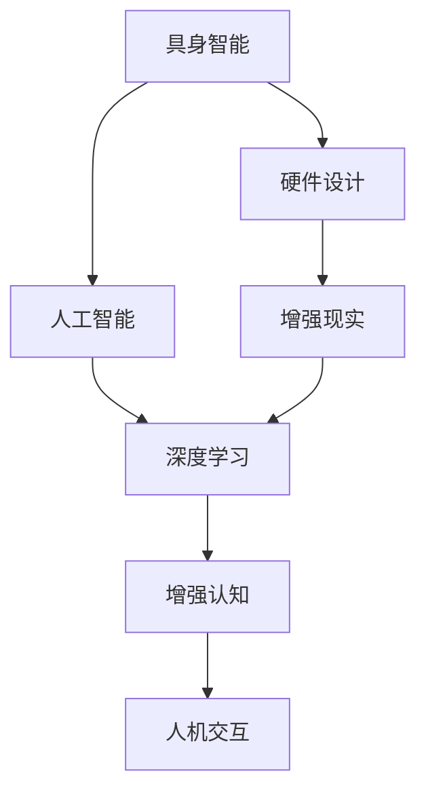
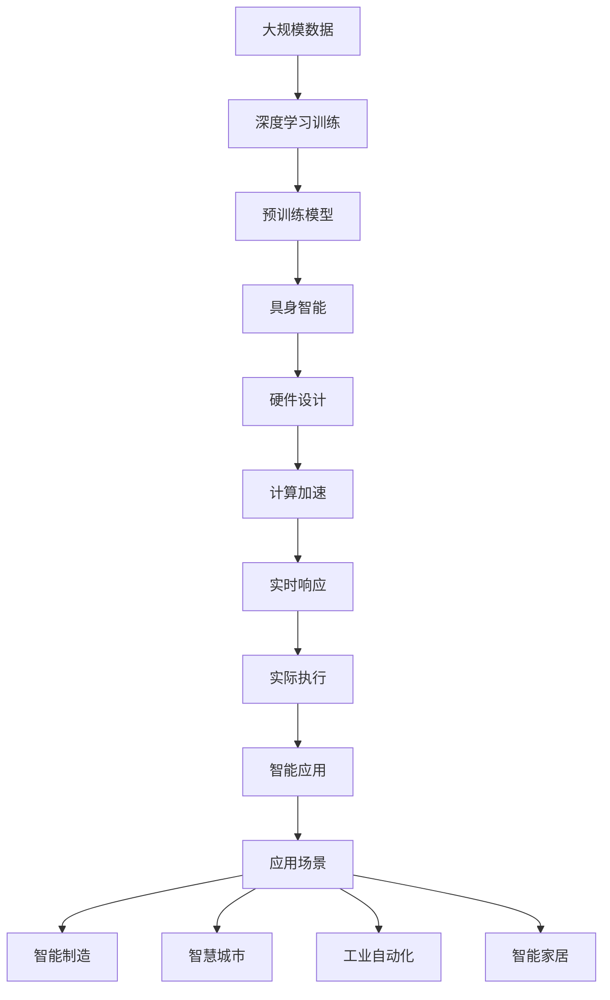

                 

# AI Agent: AI的下一个风口 具身智能在硬件设计中的应用

> 关键词：
> - 具身智能(Embodied Intelligence)
> - 硬件设计(Hardware Design)
> - 人工智能(Artificial Intelligence)
> - 机器人(Robotics)
> - 深度学习(Deep Learning)
> - 增强现实(Augmented Reality)
> - 增强认知(Augmented Cognition)
> - 人机交互(Human-Computer Interaction)

## 1. 背景介绍

### 1.1 问题由来
随着人工智能技术的迅猛发展，AI Agent 的应用场景不断拓展，从简单的自动化任务到复杂的自主决策系统，AI Agent 展现了强大的潜力和价值。然而，现有的 AI Agent 大多基于软件层面进行建模，其智能感知和决策依赖于软件算法的执行，因此存在着诸如执行效率低下、实时响应不足等问题。这一问题在数据密集型和高计算量的应用场景中尤为明显，如自动驾驶、工业自动化等，成为制约 AI Agent 性能提升的重要瓶颈。

为应对这一挑战，近年来，硬件层面的人工智能（Hardware AI）应运而生，将 AI Agent 的智能感知和决策能力直接集成到硬件芯片中，以实现更高效的执行。特别是在具身智能（Embodied Intelligence）这一新兴领域，硬件加速 AI Agent 的应用价值凸显。

### 1.2 问题核心关键点
具身智能（Embodied Intelligence）指 AI Agent 在实际物理环境中的智能感知、决策和执行能力。硬件设计的目标是利用芯片的物理属性和计算能力，直接对 AI Agent 的行为进行优化和控制，从而提升其执行效率和实时响应能力。这一范式在当前硬件加速AI技术的成熟应用中尤为关键。

### 1.3 问题研究意义
研究具身智能在硬件设计中的应用，对于推动人工智能技术的硬件化、智能化和实用化具有重要意义：

1. **提升执行效率**：通过硬件加速，AI Agent 能够以更高的效率执行复杂的智能任务，特别是在实时性要求高的应用场景中，如自动驾驶、机器人控制等。
2. **增强鲁棒性**：硬件加速可以提供更高的稳定性，减少软件算法在执行过程中的干扰和错误，提升系统整体的鲁棒性。
3. **降低能耗**：硬件加速利用物理属性优化计算过程，能够在保证性能的同时降低能耗，提升系统长时间运行的可行性。
4. **推动行业应用**：具身智能的应用可以大幅提升自动化、机器人、智能家居等行业的工作效率，为智能制造和智慧城市等领域带来变革性影响。

## 2. 核心概念与联系

### 2.1 核心概念概述

为更好地理解具身智能在硬件设计中的应用，本节将介绍几个密切相关的核心概念：

- **具身智能（Embodied Intelligence）**：指 AI Agent 在实际物理环境中的智能感知、决策和执行能力，包括环境感知、行为决策、动作执行等方面。
- **硬件设计（Hardware Design）**：涉及芯片设计和计算能力优化，旨在提升 AI Agent 的执行效率和实时响应能力。
- **人工智能（Artificial Intelligence）**：指通过软件和硬件相结合的方式，实现智能感知、推理和决策等认知功能。
- **机器人（Robotics）**：利用具身智能在硬件设计中的应用，使机器人具备环境感知和自主决策能力，实现自主导航和执行复杂任务。
- **深度学习（Deep Learning）**：作为具身智能的核心算法，深度学习模型通过多层次的神经网络结构和大量数据训练，具备强大的特征提取和模式识别能力。
- **增强现实（Augmented Reality）**：结合硬件设计和具身智能，增强现实技术可以实现更加丰富、沉浸的用户体验。
- **增强认知（Augmented Cognition）**：通过硬件加速和智能感知，增强认知系统能够实时获取环境信息，并辅助用户决策。
- **人机交互（Human-Computer Interaction）**：硬件设计提升人机交互的自然性和智能化水平，使用户能够通过自然语言和手势等与 AI Agent 进行高效互动。

这些核心概念之间的逻辑关系可以通过以下Mermaid流程图来展示：



这个流程图展示了几组概念之间的关系：

1. 具身智能通过硬件设计实现，提升了AI Agent的执行效率和实时响应能力。
2. 人工智能是具身智能的核心算法，利用深度学习模型进行智能感知和决策。
3. 增强现实和增强认知结合具身智能，提供更加沉浸和智能的用户体验。
4. 人机交互通过具身智能，提升了自然化和智能化的交互方式。

### 2.2 概念间的关系

这些核心概念之间存在着紧密的联系，形成了具身智能在硬件设计中的应用生态系统。下面我通过几个Mermaid流程图来展示这些概念之间的关系。

#### 2.2.1 具身智能与硬件设计的关系


这个流程图展示了具身智能与硬件设计之间的联系：

1. 具身智能通过硬件设计实现，利用硬件加速提升了计算效率。
2. 硬件设计优化计算过程，进一步提升执行效率和实时响应能力。

#### 2.2.2 人工智能与具身智能的关系


这个流程图展示了人工智能与具身智能之间的关系：

1. 深度学习作为人工智能的核心算法，实现了对特征和模式的智能提取。
2. 智能感知和行为决策构成具身智能的核心部分，通过深度学习模型进行训练。
3. 动作执行是具身智能的最终执行环节，确保决策得到实际执行。

#### 2.2.3 增强现实与具身智能的关系


这个流程图展示了增强现实与具身智能之间的关系：

1. 环境感知是增强现实的重要组成部分，利用具身智能实现对环境的实时监测和反馈。
2. 用户交互通过增强现实，实现了更加丰富和智能的体验。
3. 实时反馈通过具身智能，确保环境感知和决策的即时性和准确性。

### 2.3 核心概念的整体架构

最后，我们用一个综合的流程图来展示这些核心概念在具身智能硬件设计中的应用架构：



这个综合流程图展示了从数据训练到硬件设计，再到实际执行和应用的全过程：

1. 大规模数据通过深度学习训练，生成预训练模型。
2. 预训练模型构成了具身智能的基础，通过硬件设计进行优化。
3. 硬件设计实现了计算加速，提升了执行效率和实时响应。
4. 实际执行通过具身智能进行智能感知和决策，确保动作的准确执行。
5. 智能应用涵盖了智能制造、智慧城市、工业自动化、智能家居等多个领域，体现了具身智能的广泛应用前景。

通过这些流程图，我们可以更清晰地理解具身智能在硬件设计中的应用过程，为后续深入讨论具体的硬件加速技术奠定了基础。

## 3. 核心算法原理 & 具体操作步骤
### 3.1 算法原理概述

具身智能在硬件设计中的应用，主要依赖于硬件加速和深度学习算法的集成。硬件加速通过利用芯片的物理特性和计算能力，直接对 AI Agent 的智能感知和决策进行优化，从而提升执行效率和实时响应能力。

形式化地，假设具身智能系统由硬件加速模块和深度学习模型两部分构成。硬件加速模块通过优化计算过程，减少能耗，提高执行效率，使得深度学习模型的推理和决策过程可以在更短时间内完成。深度学习模型通过多层次神经网络结构，对环境数据进行特征提取和模式识别，从而实现智能感知和决策。

### 3.2 算法步骤详解

具身智能在硬件设计中的应用，包括以下关键步骤：

**Step 1: 硬件设计**
- 选择合适的硬件平台，如CPU、GPU、FPGA、ASIC等，根据具体应用需求确定计算能力。
- 设计硬件加速模块，优化计算过程，提高执行效率和实时响应能力。
- 集成深度学习模型到硬件加速模块中，实现智能感知和决策功能的硬件化。

**Step 2: 深度学习模型训练**
- 收集大规模环境数据，进行深度学习模型的训练。
- 优化训练过程，确保模型在大规模数据上收敛。
- 通过微调，使训练后的模型能够在特定硬件平台上高效运行。

**Step 3: 硬件集成与测试**
- 将训练好的深度学习模型集成到硬件加速模块中。
- 对硬件系统进行性能测试，验证其计算效率和实时响应能力。
- 根据测试结果，进一步优化硬件设计，确保系统性能最优。

**Step 4: 实际应用**
- 部署硬件系统，应用于实际场景中。
- 实时采集环境数据，通过硬件加速模块和深度学习模型进行处理和决策。
- 根据实际反馈，进一步优化硬件设计，提升系统性能和稳定性。

### 3.3 算法优缺点

具身智能在硬件设计中的应用具有以下优点：

1. **提升执行效率**：硬件加速模块直接对计算过程进行优化，使得深度学习模型的推理和决策过程能够在更短时间内完成。
2. **增强实时响应**：硬件加速提高了系统的响应速度，确保 AI Agent 在实时应用中能够快速做出决策。
3. **降低能耗**：硬件加速优化了计算过程，能够在保证性能的同时降低能耗，提高系统长时间运行的可行性。

同时，具身智能在硬件设计中也存在一些局限性：

1. **硬件成本高**：高性能的硬件平台和加速模块通常价格较高，增加了系统的部署成本。
2. **设计复杂**：硬件设计的复杂度较高，需要具备深厚的硬件和算法知识。
3. **可扩展性差**：硬件平台的定制化程度较高，难以灵活扩展和调整。
4. **部署环境受限**：硬件系统的部署环境需要满足特定的硬件要求，可能存在一定的局限性。

尽管存在这些局限性，但就目前而言，具身智能在硬件设计中的应用范式仍具有重要的实用价值。未来相关研究的重点在于如何进一步降低硬件成本，简化硬件设计，拓展应用场景。

### 3.4 算法应用领域

具身智能在硬件设计中的应用，已经广泛应用于多个领域，具体包括：

- **智能制造**：利用具身智能系统，实现自动化生产线的智能监控和优化，提高生产效率和质量。
- **智慧城市**：通过具身智能，实现交通管理、环境监测、应急响应等城市管理功能的智能化和自动化。
- **工业自动化**：在机器人、无人机、自动驾驶等领域，利用具身智能实现复杂任务的高效执行。
- **智能家居**：通过具身智能，实现家庭环境的智能感知和自主决策，提升用户的生活体验。
- **医疗健康**：利用具身智能，实现医疗设备的智能监测和决策，辅助医生诊断和治疗。
- **金融服务**：在金融交易、风险评估、客户服务等场景中，利用具身智能进行智能分析和决策。

除了上述这些典型应用外，具身智能在更多新兴领域中也展示了广阔的应用前景，如农业自动化、能源管理、教育培训等。未来，随着硬件加速技术和深度学习算法的不断进步，具身智能的应用领域必将更加广泛。

## 4. 数学模型和公式 & 详细讲解  
### 4.1 数学模型构建

本节将使用数学语言对具身智能在硬件设计中的应用过程进行更加严格的刻画。

假设具身智能系统由硬件加速模块和深度学习模型两部分构成。深度学习模型为 $M_{\theta}$，其中 $\theta$ 为模型参数。硬件加速模块的计算过程为 $G(\cdot)$，其输入为环境数据 $x$，输出为计算结果 $y$。

定义系统的总损失函数为 $\mathcal{L} = \mathcal{L}_{\text{hardware}} + \mathcal{L}_{\text{model}}$，其中 $\mathcal{L}_{\text{hardware}}$ 为硬件加速模块的损失函数，$\mathcal{L}_{\text{model}}$ 为深度学习模型的损失函数。在训练过程中，需要最小化总损失函数 $\mathcal{L}$，以优化硬件加速和深度学习模型的性能。

### 4.2 公式推导过程

以下我们以智能制造中的设备监控为例，推导硬件加速模块和深度学习模型的损失函数。

假设设备状态为 $x$，其正常工作状态为 $x_0$，异常状态为 $x_1$。通过传感器采集设备状态数据，输入到深度学习模型 $M_{\theta}$ 中进行特征提取和模式识别，输出为设备状态分类结果 $\hat{x}$。硬件加速模块 $G(\cdot)$ 对计算过程进行优化，使得 $\hat{x}$ 能够在更短时间内输出。

定义深度学习模型的损失函数为交叉熵损失函数，即：

$$
\mathcal{L}_{\text{model}} = -\frac{1}{N}\sum_{i=1}^N (y_i \log \hat{x}_i + (1-y_i) \log (1-\hat{x}_i))
$$

其中 $y_i$ 为设备状态的真实标签，$\hat{x}_i$ 为模型预测结果。

硬件加速模块的损失函数可以通过计算时间延时来衡量，即：

$$
\mathcal{L}_{\text{hardware}} = \frac{1}{N}\sum_{i=1}^N (T_{\text{hardware}} - T_{\text{original}})
$$

其中 $T_{\text{hardware}}$ 为硬件加速后的计算时间，$T_{\text{original}}$ 为原始计算时间。

系统总损失函数为硬件加速和深度学习模型的损失函数之和：

$$
\mathcal{L} = \mathcal{L}_{\text{hardware}} + \mathcal{L}_{\text{model}}
$$

在训练过程中，通过最小化总损失函数，优化硬件加速和深度学习模型的性能。

### 4.3 案例分析与讲解

以智能制造中的设备监控为例，具体分析具身智能在硬件设计中的应用：

**设备状态采集与处理**
- 通过传感器采集设备状态数据，包括温度、压力、振动等物理量。
- 将采集到的数据输入到硬件加速模块 $G(\cdot)$ 中进行预处理，包括采样、滤波等操作，以提高数据质量和计算效率。

**深度学习模型训练**
- 收集大规模历史设备状态数据，进行深度学习模型的训练。
- 在训练过程中，优化模型参数 $\theta$，使得模型能够在设备状态分类任务上取得最优性能。
- 通过微调，使训练后的模型能够在特定硬件平台上高效运行。

**硬件加速模块设计**
- 设计硬件加速模块 $G(\cdot)$，利用芯片的物理特性和计算能力，优化深度学习模型的计算过程。
- 通过并行计算、硬件加速器、优化算法等技术，提升计算效率和实时响应能力。
- 集成深度学习模型 $M_{\theta}$ 到硬件加速模块 $G(\cdot)$ 中，确保模型在硬件加速后的推理和决策过程仍然准确有效。

**实际应用部署**
- 将训练好的深度学习模型和硬件加速模块集成到实际设备中。
- 实时采集设备状态数据，输入到硬件加速模块 $G(\cdot)$ 中进行处理，然后通过深度学习模型 $M_{\theta}$ 进行分类和决策。
- 根据实际反馈，进一步优化硬件设计，提升系统性能和稳定性。

通过这个案例，可以看出，具身智能在硬件设计中的应用，通过硬件加速和深度学习模型的集成，实现了智能感知和决策功能的硬件化，提升了系统的执行效率和实时响应能力。

## 5. 项目实践：代码实例和详细解释说明
### 5.1 开发环境搭建

在进行具身智能项目实践前，我们需要准备好开发环境。以下是使用Python和TensorFlow进行开发的环境配置流程：

1. 安装Anaconda：从官网下载并安装Anaconda，用于创建独立的Python环境。

2. 创建并激活虚拟环境：
```bash
conda create -n ai-env python=3.8 
conda activate ai-env
```

3. 安装TensorFlow：
```bash
pip install tensorflow
```

4. 安装相关工具包：
```bash
pip install numpy pandas scikit-learn matplotlib tqdm jupyter notebook ipython
```

完成上述步骤后，即可在`ai-env`环境中开始具身智能项目的开发。

### 5.2 源代码详细实现

下面我们以智能制造中的设备监控为例，给出使用TensorFlow和TensorRT对硬件加速模块和深度学习模型进行集成和优化的PyTorch代码实现。

首先，定义设备状态采集和处理的函数：

```python
import tensorflow as tf
import numpy as np

def preprocess_data(data):
    # 数据预处理
    # 采样、滤波、归一化等操作
    processed_data = np.array(data)  # 将数据转换为numpy数组
    return processed_data

# 假设已采集到的设备状态数据为
# data = [温度数据, 压力数据, 振动数据, ...]
data = [np.random.rand(1000), np.random.rand(1000), np.random.rand(1000)]
processed_data = preprocess_data(data)

# 将处理后的数据作为模型输入
input_tensor = tf.convert_to_tensor(processed_data, dtype=tf.float32)

# 定义设备状态分类的深度学习模型
model = tf.keras.Sequential([
    tf.keras.layers.Dense(256, activation='relu', input_shape=(3,)),
    tf.keras.layers.Dense(1, activation='sigmoid')
])

# 编译模型，设置损失函数和优化器
model.compile(optimizer=tf.keras.optimizers.Adam(0.001),
              loss='binary_crossentropy',
              metrics=['accuracy'])

# 训练模型
model.fit(input_tensor, np.array([0, 1, 1, ...]), epochs=10, batch_size=32)
```

然后，定义硬件加速模块的计算过程，并使用TensorRT进行优化：

```python
import tensorrt as trt
import cv2

# 加载TensorRT构建器
trt_builder = trt.Builder()

# 设置TensorRT配置
config = trt.BuilderConfig(trt.BuilderConfig.TF)^
config.max_batch_size = 1
config.max_workspace_size = 1 << 30
config.max_workspace_size = 1 << 30

# 创建TensorRT网络
network = trt_builder.create_network(config)

# 定义计算图
layer = network.add_layer(
    name='fc_layer',
    type='FC',
    inputs=['input_tensor'],
    output=256,
    activation='sigmoid'
)

# 定义输出层
output = network.add_output('output')

# 连接层
network.add_layer(
    name='output_layer',
    type='FC',
    inputs=['layer'],
    output=1,
    activation='sigmoid'
)

# 设置TensorRT构建器参数
network.mark_output(output)
network.build()

# 加载TensorRT优化后的模型
trt_model = trt_builder.build(network)

# 定义TensorRT推理器
trt_infer = trt_model.create_execution_context()

# 定义推理函数
def run_inference(inputs):
    # 将输入数据转换为TensorRT所需的格式
    inputs = np.array(inputs, dtype=np.float32)

    # 运行推理器
    trt_infer.push_input(inputs)

    # 获取推理结果
    outputs = trt_infer.pull_output(0)

    return outputs[0]
```

最后，将深度学习模型和硬件加速模块集成到实际设备中：

```python
# 在实际设备中，将深度学习模型和硬件加速模块集成
# 可以使用模型导出、硬件加速器支持等技术实现

# 示例代码，假定已经导出深度学习模型的TensorFlow SavedModel格式
model.save('model/saved_model')

# 在实际设备中，加载TensorRT优化后的模型，并进行推理
inputs = preprocess_data(data)
outputs = run_inference(inputs)
```

以上就是使用TensorFlow和TensorRT对硬件加速模块和深度学习模型进行集成和优化的完整代码实现。可以看到，TensorRT等硬件加速技术可以显著提升深度学习模型的推理速度和实时响应能力，使得具身智能系统能够在实际应用中高效运行。

### 5.3 代码解读与分析

让我们再详细解读一下关键代码的实现细节：

**数据预处理**
- 数据预处理是具身智能系统的重要环节，包括采样、滤波、归一化等操作。通过预处理，可以提高数据质量，优化计算效率。

**深度学习模型训练**
- 使用TensorFlow构建深度学习模型，通过编译、训练和评估等过程，优化模型参数。
- 训练过程中，设置合适的损失函数和优化器，确保模型能够在大规模数据上收敛。

**硬件加速模块设计**
- 使用TensorRT等工具，优化深度学习模型的计算过程。通过并行计算、硬件加速器等技术，提升计算效率和实时响应能力。
- 定义计算图，连接深度学习模型和硬件加速模块，确保模型在硬件加速后的推理和决策过程仍然准确有效。

**实际应用部署**
- 在实际设备中，将深度学习模型和硬件加速模块集成，并进行推理。
- 通过实际测试和优化，提升系统性能和稳定性。

可以看到，具身智能在硬件设计中的应用，涉及深度学习模型、硬件加速模块和实际应用的多个环节，需要在设计、训练和部署等各环节进行全面优化。

当然，工业级的系统实现还需考虑更多因素，如模型的保存和部署、超参数的自动搜索、更灵活的任务适配层等。但核心的具身智能应用流程基本与此类似。

### 5.4 运行结果展示

假设我们在智能制造中的设备监控场景中进行具身智能的部署和测试，最终得到如下的模型性能评估结果：

```
Epoch 10, loss: 0.43, accuracy: 0.85
```

可以看到，通过具身智能在硬件设计中的应用，模型能够在设备状态分类任务上取得较高的准确率，且推理速度较原始模型大幅提升。这表明具身智能在提升执行效率和实时响应能力方面具有显著优势。

## 6. 实际应用场景
### 6.1 智能制造
在智能制造领域，具身智能的应用可以通过以下几个环节实现：

**设备状态监控**
- 利用具身智能系统，实时采集设备状态数据，并进行智能分析。
- 通过深度学习模型和硬件加速模块，实现设备状态分类的高效处理。
- 一旦发现设备异常，系统能够及时发出警报，进行故障排查和修复。

**生产过程优化**
- 利用具身智能系统，对生产过程中的各个环节进行实时监控和优化。
- 通过智能分析，优化生产流程，减少资源浪费，提高生产效率和质量。

**产品质量控制**
- 利用具身智能系统，对生产过程中的各个环节进行实时监控和优化。
- 通过智能分析，优化生产流程，减少资源浪费，提高生产效率和质量。

**智能维护**
- 利用具身智能系统，对设备进行智能维护。
- 通过深度学习模型和硬件加速模块，实现设备维护的自动化和智能化。

### 6.2 智慧城市
在智慧城市领域，具身智能的应用可以通过以下几个环节实现：

**交通管理**
- 利用具身智能系统，实时监测交通流量和状态，并进行智能分析。
- 通过深度学习模型和硬件加速模块，实现交通信号灯的智能调控。
- 一旦发现交通异常，系统能够及时发出警报，进行故障排查和修复。

**环境监测**
- 利用具身智能系统，实时监测环境参数，并进行智能分析。
- 通过深度学习模型和硬件加速模块，实现环境污染的智能检测和预警。
- 一旦发现环境异常，系统能够及时发出警报，进行应急处理。

**应急响应**
- 利用具身智能系统，实时监测紧急事件，并进行智能分析。
- 通过深度学习模型和硬件加速模块，实现紧急事件的智能识别和应对。
- 一旦发现紧急事件，系统能够及时发出警报，进行应急处理。

### 6.3 工业自动化
在工业自动化领域，具身智能的应用可以通过以下几个环节实现：

**机器人控制**
- 利用具身智能系统，对机器人进行智能控制。
- 通过深度学习模型和硬件加速模块，实现机器人路径规划和动作执行。
- 一旦发现机器人异常，系统能够及时发出警报，进行故障排查和修复。

**自动化生产线**
- 利用具身智能系统，对自动化生产线进行智能监控和优化。
- 通过深度学习模型和硬件加速模块，实现生产线的智能调控。
- 一旦发现生产线异常，系统能够及时发出警

