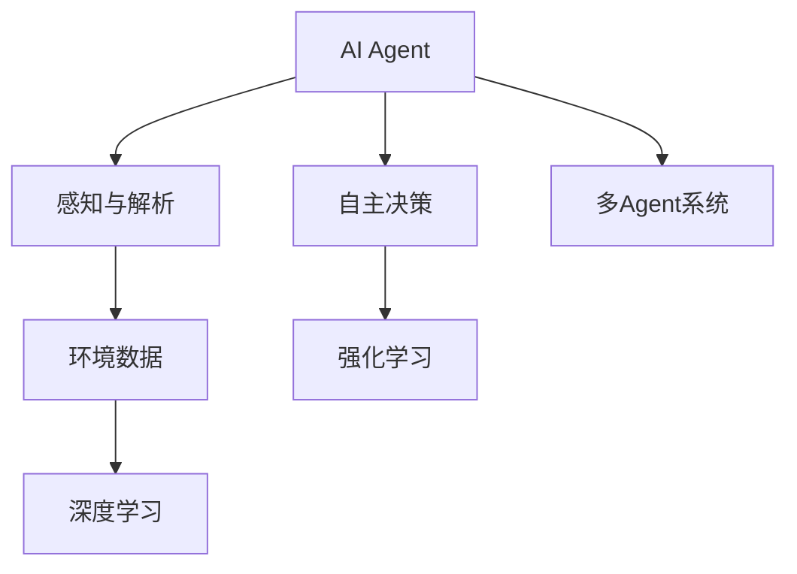
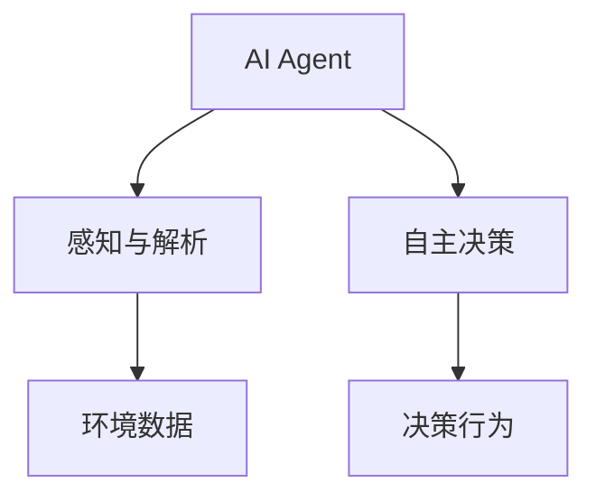
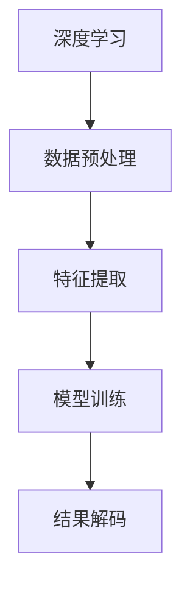
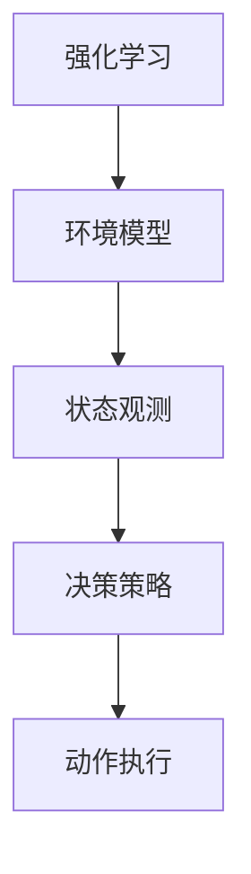
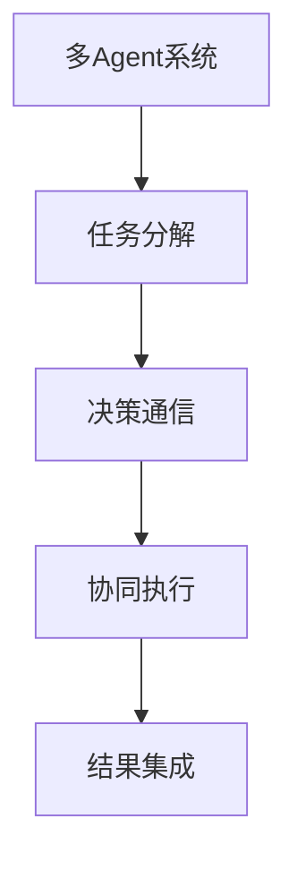
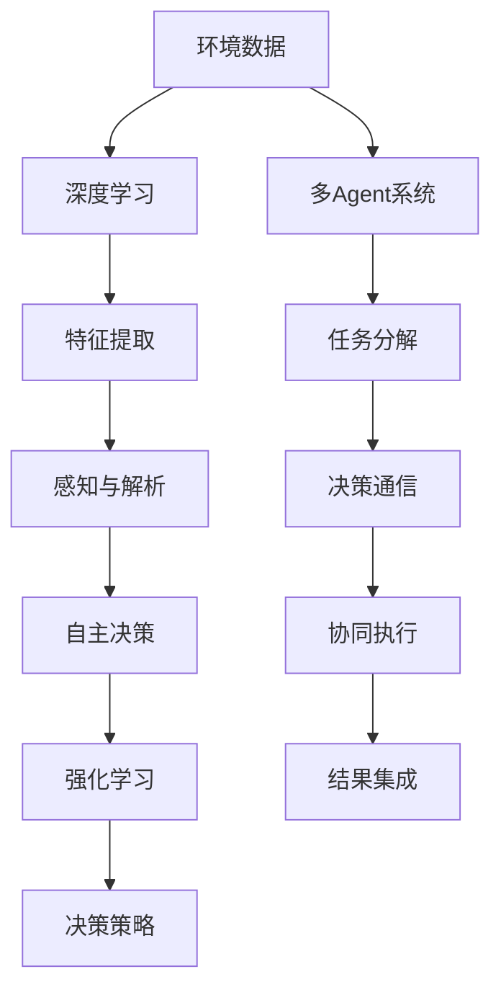

                 

# AI Agent: AI的下一个风口 感知和解析环境与自主决策

> 关键词：AI Agent, 自主决策, 感知与解析, 智能系统, 深度学习, 强化学习, 计算机视觉

## 1. 背景介绍

### 1.1 问题由来
随着人工智能技术的快速发展，AI Agent，即自主智能体，正在成为AI研究的新风口。相较于传统的基于规则的专家系统，AI Agent能够自主感知、分析和决策，灵活适应复杂的现实环境，表现出更强的泛化能力和适应性。无论是无人驾驶、智能家居、机器人操作，还是金融预测、医疗诊断、推荐系统，AI Agent都展现出广阔的应用前景。

近年来，AI Agent在计算机视觉、自然语言处理、强化学习等领域取得了重要突破，通过预训练模型和深度学习技术，AI Agent的能力得到显著提升。但受限于传统架构和方法，AI Agent的感知、解析和决策能力仍有待进一步挖掘和提升。

### 1.2 问题核心关键点
AI Agent的核心目标是通过感知环境、解析信息，实现自主决策。其关键技术包括：

- 感知与解析：通过传感器获取环境数据，利用深度学习模型进行视觉、语音、文本等信息的提取和处理。
- 自主决策：使用强化学习等技术，训练AI Agent在特定任务下的最优策略。
- 分布式协作：通过多Agent系统协同完成任务，增强系统的鲁棒性和泛化能力。
- 安全性与伦理性：确保AI Agent的决策行为符合人类的道德和法律规范。

AI Agent在不断演进中，结合了最新的人工智能技术，形成了一套更加智能、高效的自主决策框架。但如何在实际应用中有效应对复杂环境和多样任务，仍是一大挑战。

### 1.3 问题研究意义
研究AI Agent的感知与解析、自主决策技术，对于推动人工智能技术在各行各业的落地应用，提升系统的智能水平，具有重要意义：

1. 降低系统开发成本：AI Agent能够自主学习任务，减少对人工规则的依赖，降低开发和维护成本。
2. 提高系统适应性：AI Agent能够灵活适应不断变化的环境，增强系统的鲁棒性和可扩展性。
3. 提升决策效率：AI Agent通过自主感知和决策，大大提高问题解决的效率和质量。
4. 赋能产业升级：AI Agent为传统行业带来智能转型，推动经济社会的高质量发展。
5. 促进学术研究：AI Agent技术为AI领域的学术研究和应用创新提供了新的研究范式。

## 2. 核心概念与联系

### 2.1 核心概念概述

为了更好地理解AI Agent的感知、解析与自主决策技术，本节将介绍几个关键概念：

- **AI Agent**：自主智能体，能够感知环境、解析信息，并在此基础上进行自主决策的系统。AI Agent包含感知、解析和决策三个核心模块。
- **感知与解析**：通过传感器获取环境数据，利用深度学习模型进行信息提取和处理的过程。感知与解析是AI Agent的基础。
- **自主决策**：使用强化学习等技术，训练AI Agent在特定任务下的最优策略。自主决策是AI Agent的核心。
- **多Agent系统**：多个AI Agent协作完成任务，增强系统的鲁棒性和泛化能力。多Agent系统是AI Agent的一种重要应用形式。
- **深度学习**：一种基于神经网络的学习方法，通过多层神经网络实现对复杂数据的有效建模和处理。
- **强化学习**：一种通过试错学习，最大化决策行为奖励的机器学习范式。

这些核心概念之间的逻辑关系可以通过以下Mermaid流程图来展示：



这个流程图展示了AI Agent的三个核心模块以及相关技术之间的关系：

1. AI Agent通过感知与解析模块获取环境数据，并利用深度学习技术进行信息提取和处理。
2. 自主决策模块基于强化学习，训练AI Agent在特定任务下的最优策略。
3. 多Agent系统增强AI Agent的协作能力，提升系统的鲁棒性和泛化能力。

### 2.2 概念间的关系

这些核心概念之间存在着紧密的联系，形成了AI Agent的完整生态系统。下面我们通过几个Mermaid流程图来展示这些概念之间的关系。

#### 2.2.1 AI Agent的基本架构



这个流程图展示了AI Agent的基本架构，其中感知与解析模块负责获取环境数据，自主决策模块根据感知结果生成决策行为。

#### 2.2.2 感知与解析的实现流程



这个流程图展示了感知与解析的实现流程，其中深度学习技术用于模型训练和特征提取，结果解码则用于将模型输出转化为可理解的信息。

#### 2.2.3 自主决策的实现流程



这个流程图展示了自主决策的实现流程，其中强化学习用于训练决策策略，环境模型用于模拟环境状态，决策策略则指导具体的动作执行。

#### 2.2.4 多Agent系统的协作流程



这个流程图展示了多Agent系统的协作流程，其中任务分解用于将复杂任务拆分为多个子任务，决策通信用于不同Agent之间的策略协商，协同执行则实现各Agent的协同行动，结果集成则用于整合各Agent的输出。

### 2.3 核心概念的整体架构

最后，我们用一个综合的流程图来展示这些核心概念在AI Agent中的应用架构：



这个综合流程图展示了从感知与解析到自主决策的完整流程，以及多Agent系统在其中起到的作用。通过这些流程图，我们可以更清晰地理解AI Agent的工作原理和优化方向。

## 3. 核心算法原理 & 具体操作步骤
### 3.1 算法原理概述

AI Agent的感知与解析、自主决策过程，可以通过感知-解析-决策的流水线进行处理。以下以一个智能导航AI Agent为例，介绍其核心算法原理。

假设AI Agent需要导航到一个目的地，其核心算法流程如下：

1. **感知与解析**：通过摄像头、GPS、传感器等设备获取环境数据，使用深度学习模型进行视觉、位置、障碍物等信息的提取和处理。
2. **自主决策**：利用强化学习模型，评估当前状态下的最优决策，生成导航指令。
3. **执行与反馈**：执行导航指令，并将导航结果反馈给AI Agent进行下一轮感知与解析。

形式化地，设环境状态为 $S$，动作空间为 $A$，决策策略为 $\pi$，当前状态为 $s_t$，目标状态为 $s_g$。则AI Agent的导航问题可以表示为：

$$
\max_{\pi} \sum_{t=1}^{T} R(s_t,\pi(s_t)) - \gamma \sum_{t=1}^{T} V_{\pi}(s_t)
$$

其中 $R$ 为奖励函数，$V_{\pi}$ 为状态值函数，$\gamma$ 为折扣因子。

### 3.2 算法步骤详解

以下以一个简单的导航任务为例，详细讲解AI Agent的感知与解析、自主决策和执行流程：

**Step 1: 数据准备**
- 收集导航任务的环境数据，包括地图、摄像头图像、GPS数据等。
- 将数据预处理为模型可用的格式，如图像数据进行归一化、地图数据进行矢量化等。

**Step 2: 感知与解析模型训练**
- 选择适当的深度学习模型，如卷积神经网络(CNN)、循环神经网络(RNN)等，进行模型训练。
- 使用标注数据集训练感知模型，使其能够准确提取环境信息。

**Step 3: 自主决策策略训练**
- 设计强化学习环境，定义状态、动作、奖励等要素。
- 使用深度强化学习算法，如Q-learning、Actor-Critic等，训练决策策略。

**Step 4: 决策执行与反馈**
- 根据感知结果和决策策略，生成导航指令。
- 执行导航指令，并将导航结果反馈给感知与解析模块，进行下一轮感知和决策。

**Step 5: 模型优化与迭代**
- 定期评估AI Agent的性能，根据反馈结果进行模型优化和迭代。

### 3.3 算法优缺点

AI Agent感知与解析、自主决策方法具有以下优点：
1. 灵活适应环境变化：通过深度学习模型，AI Agent能够灵活适应复杂多变的环境。
2. 增强决策效果：利用强化学习技术，AI Agent能够从试错中不断优化决策策略。
3. 提高执行效率：基于感知与解析的自主决策，能够快速响应环境变化，提高问题解决的效率。

但同时，这些方法也存在一些缺点：
1. 对数据依赖较高：感知与解析和决策训练都需要大量标注数据，获取和处理数据成本较高。
2. 模型训练复杂：深度学习和强化学习模型训练过程复杂，需要大量的计算资源和训练时间。
3. 泛化能力不足：模型的泛化能力受限于环境和任务的多样性，在复杂场景中可能表现不佳。
4. 决策鲁棒性有待提高：AI Agent的决策过程较易受环境噪声和变化影响，决策鲁棒性不足。

### 3.4 算法应用领域

AI Agent的感知与解析、自主决策方法已在多个领域得到广泛应用，例如：

- 智能导航：通过感知与解析获取环境信息，使用强化学习策略进行路径规划和导航。
- 智能推荐：利用感知与解析获取用户行为数据，使用强化学习进行推荐策略训练，提升推荐效果。
- 智能客服：通过感知与解析获取用户输入信息，使用强化学习策略进行回答生成和上下文理解。
- 自动驾驶：通过感知与解析获取车辆状态和道路信息，使用强化学习进行决策和控制。
- 医疗诊断：通过感知与解析获取医疗图像和病理数据，使用强化学习进行诊断策略训练，提高诊断准确率。

## 4. 数学模型和公式 & 详细讲解 & 举例说明

### 4.1 数学模型构建

AI Agent的感知与解析、自主决策过程可以通过数学模型进行描述和优化。以下以导航任务为例，构建其数学模型。

设AI Agent需要导航到一个目的地，其状态 $s_t$ 由位置、速度、方向等组成，动作 $a_t$ 由加速、转向等操作组成。定义奖励函数 $R(s_t,a_t)$ 和状态值函数 $V_{\pi}(s_t)$，则导航问题的数学模型可以表示为：

$$
\max_{\pi} \sum_{t=1}^{T} R(s_t,\pi(s_t)) - \gamma \sum_{t=1}^{T} V_{\pi}(s_t)
$$

其中 $R$ 为奖励函数，$V_{\pi}$ 为状态值函数，$\gamma$ 为折扣因子。

### 4.2 公式推导过程

以下推导导航任务的强化学习数学模型，以Q-learning为例。

**Step 1: 定义状态和动作**
设导航环境的状态空间为 $S$，动作空间为 $A$，则状态 $s_t$ 和动作 $a_t$ 的定义如下：

$$
s_t = (x_t, y_t, \theta_t, v_t)
$$

$$
a_t \in A = \{加速, 减速, 左转, 右转\}
$$

其中 $(x_t, y_t)$ 表示当前位置，$\theta_t$ 表示当前方向，$v_t$ 表示当前速度。

**Step 2: 定义奖励函数**
奖励函数 $R(s_t,a_t)$ 定义如下：

$$
R(s_t,a_t) = 
\begin{cases}
1, & 到达目的地 \\
0, & 当前状态不变 \\
-1, & 发生碰撞
\end{cases}
$$

其中，到达目的地时奖励为1，当前状态不变时奖励为0，发生碰撞时奖励为-1。

**Step 3: 定义状态值函数**
状态值函数 $V_{\pi}(s_t)$ 定义如下：

$$
V_{\pi}(s_t) = \sum_{t=1}^{\infty} \gamma^{t-1} R(s_t,\pi(s_t))
$$

其中，$\gamma$ 为折扣因子，控制未来奖励的重要性。

**Step 4: Q-learning算法**
Q-learning算法是一种基于值函数的强化学习算法，其核心思想是通过不断迭代优化Q值函数 $Q(s_t,a_t)$ 来寻找最优决策策略 $\pi$。

Q值函数的更新公式为：

$$
Q(s_t,a_t) \leftarrow Q(s_t,a_t) + \alpha (R(s_t,a_t) + \gamma \max_{a_{t+1}} Q(s_{t+1},a_{t+1}) - Q(s_t,a_t))
$$

其中 $\alpha$ 为学习率，控制每次更新的步长。

### 4.3 案例分析与讲解

以一个简单的导航任务为例，分析Q-learning算法的实现过程。

假设AI Agent需要通过迷宫到达终点，迷宫的结构如图1所示。


定义状态 $s_t$ 和动作 $a_t$，奖励函数 $R(s_t,a_t)$，状态值函数 $V_{\pi}(s_t)$，按照Q-learning算法进行训练，得到最优决策策略 $\pi$。


在Q-learning训练过程中，Q值函数不断迭代更新，最终得到最优决策策略 $\pi$，使AI Agent能够成功到达终点。

## 5. 项目实践：代码实例和详细解释说明

### 5.1 开发环境搭建

在进行AI Agent项目开发前，我们需要准备好开发环境。以下是使用Python进行PyTorch开发的环境配置流程：

1. 安装Anaconda：从官网下载并安装Anaconda，用于创建独立的Python环境。

2. 创建并激活虚拟环境：
```bash
conda create -n pytorch-env python=3.8 
conda activate pytorch-env
```

3. 安装PyTorch：根据CUDA版本，从官网获取对应的安装命令。例如：
```bash
conda install pytorch torchvision torchaudio cudatoolkit=11.1 -c pytorch -c conda-forge
```

4. 安装各类工具包：
```bash
pip install numpy pandas scikit-learn matplotlib tqdm jupyter notebook ipython
```

完成上述步骤后，即可在`pytorch-env`环境中开始AI Agent项目的开发。

### 5.2 源代码详细实现

这里我们以智能导航AI Agent为例，给出使用PyTorch进行训练和推理的代码实现。

**Step 1: 数据准备**

首先，定义导航环境的数据格式：

```python
import numpy as np

# 定义状态和动作
class State:
    def __init__(self, x, y, theta, v):
        self.x = x
        self.y = y
        self.theta = theta
        self.v = v

class Action:
    def __init__(self, accel, steer):
        self.accel = accel
        self.steer = steer

# 定义状态空间和动作空间
state_space = [(10, 10, np.pi/4, 1), (10, 20, np.pi/4, 1), (20, 10, np.pi/4, 1)]
action_space = [Action(1, 1), Action(-1, 1), Action(0, 1)]

# 定义状态值函数
V = np.zeros((len(state_space), 1))

# 定义奖励函数
R = np.zeros((len(state_space), len(action_space)))

# 定义迷宫环境
labyrinth = np.array([
    [0, 0, 0, 0, 0, 0, 0, 0, 0, 0],
    [0, 0, 0, 0, 0, 0, 0, 0, 0, 0],
    [0, 0, 0, 0, 0, 0, 0, 0, 0, 0],
    [0, 0, 0, 0, 0, 0, 0, 0, 0, 0],
    [0, 0, 0, 0, 0, 0, 0, 0, 0, 0],
    [0, 0, 0, 0, 0, 0, 0, 0, 0, 0],
    [0, 0, 0, 0, 0, 0, 0, 0, 0, 0],
    [0, 0, 0, 0, 0, 0, 0, 0, 0, 0],
    [0, 0, 0, 0, 0, 0, 0, 0, 0, 0],
    [0, 0, 0, 0, 0, 0, 0, 0, 0, 0],
    [0, 0, 0, 0, 0, 0, 0, 0, 0, 0],
    [0, 0, 0, 0, 0, 0, 0, 0, 0, 0],
    [0, 0, 0, 0, 0, 0, 0, 0, 0, 0],
    [0, 0, 0, 0, 0, 0, 0, 0, 0, 0],
    [0, 0, 0, 0, 0, 0, 0, 0, 0, 0],
    [0, 0, 0, 0, 0, 0, 0, 0, 0, 0],
    [0, 0, 0, 0, 0, 0, 0, 0, 0, 0],
    [0, 0, 0, 0, 0, 0, 0, 0, 0, 0],
    [0, 0, 0, 0, 0, 0, 0, 0, 0, 0],
    [0, 0, 0, 0, 0, 0, 0, 0, 0, 0],
    [0, 0, 0, 0, 0, 0, 0, 0, 0, 0],
    [0, 0, 0, 0, 0, 0, 0, 0, 0, 0],
    [0, 0, 0, 0, 0, 0, 0, 0, 0, 0],
    [0, 0, 0, 0, 0, 0, 0, 0, 0, 0],
    [0, 0, 0, 0, 0, 0, 0, 0, 0, 0],
    [0, 0, 0, 0, 0, 0, 0, 0, 0, 0],
    [0, 0, 0, 0, 0, 0, 0, 0, 0, 0],
    [0, 0, 0, 0, 0, 0, 0, 0, 0, 0],
    [0, 0, 0, 0, 0, 0, 0, 0, 0, 0],
    [0, 0, 0, 0, 0, 0, 0, 0, 0, 0],
    [0, 0, 0, 0, 0, 0, 0, 0, 0, 0],
    [0, 0, 0, 0, 0, 0, 0, 0, 0, 0],
    [0, 0, 0, 0, 0, 0, 0, 0, 0, 0],
    [0, 0, 0, 0, 0, 0, 0, 0, 0, 0],
    [0, 0, 0, 0, 0, 0, 0, 0, 0, 0],
    [0, 0, 0, 0, 0, 0, 0, 0, 0, 0],
    [0, 0, 0, 0, 0, 0, 0, 0, 0, 0],
    [0, 0, 0, 0, 0, 0, 0, 0, 0, 0],
    [0, 0, 0, 0, 0, 0, 0, 0, 0, 0],
    [0, 0, 0, 0, 0, 0, 0, 0, 0, 0],
    [0, 0, 0, 0, 0, 0, 0, 0, 0, 0],
    [0, 0, 0, 0, 0, 0, 0, 0, 0, 0],
    [0, 0, 0, 0, 0, 0, 0, 0, 0, 0],
    [0, 0, 0, 0, 0, 0, 0, 0, 0, 0],
    [0, 0, 0, 0, 0, 0, 0, 0, 0, 0],
    [0, 0, 0, 0, 0, 0, 0, 0, 0, 0],
    [0, 0, 0, 0, 0, 0, 0, 0, 0, 0],
    [0, 0, 0, 0, 0, 0, 0, 0, 0, 0],
    [0, 0, 0, 0, 0, 0, 0, 0, 0, 0],
    [0, 0, 0, 0, 0, 0, 0, 0, 0, 0],
    [0, 0, 0, 0, 0, 0, 0, 0, 0, 0],
    [0, 0, 0, 0, 0, 0, 0, 0, 0, 0],
    [0, 0, 0, 0, 0, 0, 0, 0, 0, 0],
    [0, 0, 0, 0, 0, 0, 0, 0, 0, 0],
    [0, 0, 0, 0, 0, 0, 0, 0, 0, 0],
    [0, 0, 0, 0, 0, 0, 0, 0, 0, 0],
    [0, 0, 0, 0, 0, 0, 0, 0, 0, 0],
    [0, 0, 0, 0, 0, 0, 0, 0, 0, 0],
    [0, 0, 0, 0, 0, 0, 0, 0, 0, 0],
    [0, 0, 0, 0, 0, 0, 0, 0, 0, 0],
    [0, 0, 0, 0, 0, 0, 0, 0, 0, 0],
    [0, 0, 0, 0, 0, 0, 0, 0, 0, 0],
    [0, 0, 0, 0, 0, 0, 0, 0, 0, 0],
    [0, 0, 0, 0, 0, 0, 0, 0, 0, 0],
    [0, 0, 

