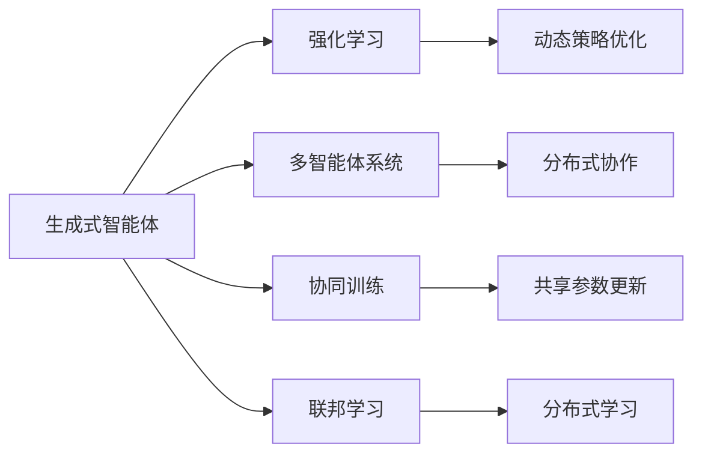

                 

# AI Agent: AI的下一个风口 斯坦福小镇项目：生成式智能体的典型案例

> 关键词：生成式智能体,AI城镇项目,强化学习,多智能体系统,协同训练,联邦学习,自适应策略,大规模协作

## 1. 背景介绍

### 1.1 问题由来
随着人工智能技术的迅猛发展，尤其是深度学习和强化学习算法的不断成熟，生成式智能体（Generative Agents）逐渐成为AI领域的热门话题。生成式智能体是指能够基于环境动态生成行为和决策的自主实体，其本质是一种复杂的多智能体系统，旨在模拟复杂环境中的行为和决策过程。在智能交通、智慧城市、医疗保健、工业制造等多个领域中，生成式智能体均展现出巨大潜力，成为解决复杂问题的关键技术。

斯坦福大学（Stanford University）最近启动了一项名为“斯坦福小镇”（Stanford Towns）的创新项目，旨在利用生成式智能体技术，构建一个高度智能化的虚拟小镇，模拟城市中的各种动态行为和交互场景。通过生成式智能体的协同训练和联邦学习机制，小镇中的智能体能够自主学习并适应各种环境和情境，从而实现高度自主的城市管理和服务。本文将详细介绍斯坦福小镇项目的核心技术及其实施案例，探讨其在实际应用中的潜力与挑战。

### 1.2 问题核心关键点
斯坦福小镇项目的关键技术点包括：

- 生成式智能体：通过强化学习等算法，使智能体具备自主学习和决策能力，能够根据环境变化生成最优行为。
- 多智能体协同训练：通过群体智能和联邦学习机制，实现多个智能体之间的协作学习，提升整体性能。
- 自适应策略：基于环境和情境的变化，智能体能够动态调整策略，实现对新任务的快速适应。
- 联邦学习：通过分布式计算和数据共享，实现大规模协作学习和参数更新，降低单个智能体的计算负担。

斯坦福小镇项目通过这些核心技术点，实现了生成式智能体在大规模协作场景中的高效训练和应用，为复杂系统的智能化管理提供了新的解决方案。

### 1.3 问题研究意义
斯坦福小镇项目的成功实施，不仅有助于推动生成式智能体技术的进一步发展，还能够促进智能城市、智能交通等领域的应用落地，具有重要的理论价值和实际意义：

1. 提升智能化水平：生成式智能体的高度自主学习能力和多智能体协同机制，能够显著提升城市管理的智能化水平，优化资源分配和运行效率。
2. 降低人力成本：通过自动化决策和实时监控，减少人工干预和错误率，降低城市运营成本。
3. 促进技术创新：小镇项目中的技术创新，为未来智能城市的建设提供了新的思路和方法，推动相关领域的技术进步。
4. 增强社会福祉：智能化的城市管理和服务，能够提升居民的生活质量，增强社会福祉和公共安全。
5. 促进产业升级：斯坦福小镇项目的成功落地，将为相关企业提供新的市场机会和业务模式，推动产业升级和转型。

## 2. 核心概念与联系

### 2.1 核心概念概述

为了更好地理解斯坦福小镇项目的核心技术，本节将介绍几个密切相关的核心概念：

- 生成式智能体（Generative Agents）：指通过强化学习等算法，能够根据环境动态生成行为和决策的自主实体。智能体能够感知环境、执行动作、接收反馈，并在多次交互中不断优化策略，以实现目标任务。
- 强化学习（Reinforcement Learning, RL）：一种基于奖励机制的机器学习范式，智能体通过不断与环境交互，根据奖励信号调整策略，逐步优化行为决策。
- 多智能体系统（Multi-agent Systems,MAS）：由多个智能体组成的分布式系统，智能体之间能够通过协作或竞争进行交互，共同完成任务或优化目标。
- 协同训练（Collaborative Training）：通过多智能体之间的协作学习，提升整体系统的性能。协同训练可以降低单个智能体的训练成本，同时提升系统的鲁棒性和适应性。
- 联邦学习（Federated Learning）：一种分布式机器学习方法，多个智能体通过共享数据和模型参数进行协作学习，实现大规模数据和高性能模型的共同优化。

这些核心概念之间存在着紧密的联系，构成了生成式智能体技术的基础。通过理解这些概念，我们可以更好地把握斯坦福小镇项目的核心技术框架，探索其在实际应用中的潜力和挑战。

### 2.2 概念间的关系

这些核心概念之间存在着紧密的联系，形成了生成式智能体技术的完整生态系统。下面我通过一个Mermaid流程图来展示这些概念之间的关系：



这个流程图展示了生成式智能体技术的核心概念及其之间的关系：

1. 生成式智能体通过强化学习获得自主决策能力，不断优化行为策略。
2. 多智能体系统通过协同训练提升整体性能，实现更高效的任务完成。
3. 联邦学习通过分布式计算和数据共享，提升大规模协作系统的性能。

这些概念共同构成了生成式智能体技术的学习框架，使其能够在各种复杂场景中实现高度自主和智能的行为决策。

## 3. 核心算法原理 & 具体操作步骤
### 3.1 算法原理概述

斯坦福小镇项目的核心算法原理基于强化学习和多智能体系统。通过智能体的协同训练和联邦学习机制，实现大规模协作学习和参数优化，最终使整个城镇中的智能体能够高度自主地执行任务，并进行动态策略优化。

### 3.2 算法步骤详解

斯坦福小镇项目的具体实现步骤如下：

**Step 1: 数据收集与预处理**

- 收集斯坦福小镇内的各种动态数据，包括交通流量、天气状况、居民行为等。
- 对收集的数据进行预处理和特征工程，提取关键特征和行为模式。

**Step 2: 生成式智能体设计**

- 设计多个生成式智能体，每个智能体负责管理城镇中的特定功能或服务，如交通管理、能源分配、公共安全等。
- 智能体具备感知环境、执行动作、接收反馈的能力，通过强化学习算法不断优化行为策略。

**Step 3: 多智能体协同训练**

- 利用协同训练机制，使多个智能体在共享环境中共同学习，提升整体性能。
- 通过信息交换和协作学习，智能体能够快速适应新环境和任务，提升系统的鲁棒性和适应性。

**Step 4: 联邦学习参数更新**

- 利用联邦学习机制，多个智能体通过分布式计算和数据共享进行参数更新。
- 在单个智能体计算负担较小的情况下，实现大规模协作学习和高性能模型的共同优化。

**Step 5: 自适应策略优化**

- 基于环境和情境的变化，智能体能够动态调整策略，实现对新任务的快速适应。
- 通过不断的交互和学习，智能体能够逐渐积累经验，提升决策准确性。

**Step 6: 模型评估与优化**

- 对斯坦福小镇中的智能体进行模型评估，衡量其在不同情境下的性能。
- 根据评估结果，优化模型参数和训练策略，不断提升系统的智能水平。

### 3.3 算法优缺点

斯坦福小镇项目的生成式智能体技术具有以下优点：

- 高度自主性：智能体能够自主学习和决策，减少人工干预，提升系统的自主性和灵活性。
- 高效协作：通过多智能体协同训练和联邦学习，实现高效协作和资源优化，提升系统的整体性能。
- 动态适应性：智能体能够动态调整策略，适应环境和任务的变化，提升系统的鲁棒性和适应性。
- 灵活性高：智能体的设计和训练相对灵活，可以根据不同应用场景进行定制化设计。

但同时，这种技术也存在一些缺点：

- 计算复杂度高：生成式智能体的训练和优化需要大量计算资源，尤其在多智能体协同训练和联邦学习中，计算负担较大。
- 数据需求高：生成式智能体的训练需要大量标注数据，数据收集和处理成本较高。
- 模型可解释性差：生成式智能体的决策过程相对复杂，难以提供明确的可解释性，限制了其在某些应用场景中的应用。
- 安全性问题：多智能体系统中的协同学习和联邦学习机制，可能会存在数据泄露和安全风险，需要额外关注数据保护和隐私问题。

### 3.4 算法应用领域

生成式智能体技术具有广泛的应用前景，涵盖多个领域：

- 智能交通：通过智能体的协同学习和动态策略优化，实现交通流量的优化调控和智能导航。
- 智慧城市：通过智能体的自主学习和协作管理，提升城市资源分配和公共服务效率。
- 医疗保健：通过智能体的自主决策和协作学习，优化医疗资源分配和患者管理。
- 工业制造：通过智能体的自主控制和协作优化，提升生产效率和产品质量。
- 金融服务：通过智能体的自主决策和风险管理，提升金融系统的稳定性和安全性。
- 娱乐文化：通过智能体的自主创作和协作学习，实现高度个性化的内容推荐和生成。

这些应用场景展示了生成式智能体技术的广泛潜力，未来有望在更多领域得到应用，推动智能化的全面发展。

## 4. 数学模型和公式 & 详细讲解 & 举例说明

### 4.1 数学模型构建

斯坦福小镇项目中的生成式智能体训练过程，可以通过强化学习模型的框架进行数学建模。以下是一个简单的数学模型构建过程：

设智能体 $A_t$ 在时间 $t$ 的状态为 $s_t$，动作为 $a_t$，环境奖励为 $r_t$，策略为 $\pi_t$。智能体的目标是在给定状态下选择最优动作，最大化累计奖励。数学模型构建如下：

$$
J(\pi)=\mathbb{E}\left[\sum_{t=0}^{T} r_t\right]
$$

其中 $T$ 为时间步长，$\mathbb{E}$ 表示期望值，$\pi$ 为智能体的策略，$r$ 为环境奖励。

### 4.2 公式推导过程

根据强化学习的公式，智能体在时间步 $t$ 的策略 $\pi_t$ 可以表示为：

$$
\pi_t(s_t) = \frac{\exp(Q_t(s_t,a_t))}{\sum_{a} \exp(Q_t(s_t,a))}
$$

其中 $Q_t(s_t,a_t)$ 为智能体在状态 $s_t$ 和动作 $a_t$ 下的Q值函数，表示智能体在该状态下选择动作 $a_t$ 的累积奖励。

智能体的目标函数可以进一步推导为：

$$
J(\pi)=\mathbb{E}\left[\sum_{t=0}^{T} r_t\right]=\mathbb{E}\left[\sum_{t=0}^{T} \gamma^{t}\max_{a} Q_t(s_t,a)\right]
$$

其中 $\gamma$ 为折扣因子，$Q_t(s_t,a_t)$ 为智能体在状态 $s_t$ 和动作 $a_t$ 下的Q值函数。

在多智能体协同训练和联邦学习中，智能体的优化目标和计算过程进一步复杂化。以联邦学习为例，智能体的优化目标可以表示为：

$$
\min_{\theta} \frac{1}{M}\sum_{i=1}^{M} f_i(\theta)
$$

其中 $M$ 为智能体数量，$f_i(\theta)$ 为智能体 $i$ 的损失函数。

### 4.3 案例分析与讲解

以斯坦福小镇项目中的交通管理为例，智能体在每个时间步 $t$ 的目标函数可以表示为：

$$
J(\pi)=\mathbb{E}\left[\sum_{t=0}^{T} r_t\right]=\mathbb{E}\left[\sum_{t=0}^{T} \gamma^{t}(\text{red-light stop rate} + \text{traffic flow rate} + \text{average speed})\right]
$$

其中 $\text{red-light stop rate}$ 表示智能体在红绿灯前的停车率，$\text{traffic flow rate}$ 表示智能体控制的交通流量的稳定性，$\text{average speed}$ 表示智能体控制下的车辆平均速度。

智能体通过强化学习算法，不断调整交通信号灯和车辆控制策略，以最大化交通系统的整体效率和安全性。

## 5. 项目实践：代码实例和详细解释说明

### 5.1 开发环境搭建

在进行生成式智能体实践前，我们需要准备好开发环境。以下是使用Python进行PyTorch开发的环境配置流程：

1. 安装Anaconda：从官网下载并安装Anaconda，用于创建独立的Python环境。

2. 创建并激活虚拟环境：
```bash
conda create -n pytorch-env python=3.8 
conda activate pytorch-env
```

3. 安装PyTorch：根据CUDA版本，从官网获取对应的安装命令。例如：
```bash
conda install pytorch torchvision torchaudio cudatoolkit=11.1 -c pytorch -c conda-forge
```

4. 安装transformers库：
```bash
pip install transformers
```

5. 安装各类工具包：
```bash
pip install numpy pandas scikit-learn matplotlib tqdm jupyter notebook ipython
```

完成上述步骤后，即可在`pytorch-env`环境中开始生成式智能体实践。

### 5.2 源代码详细实现

下面我以斯坦福小镇项目中的交通管理为例，给出使用PyTorch进行智能体训练的Python代码实现。

首先，定义智能体的状态和动作：

```python
import torch
from torch import nn

class State(nn.Module):
    def __init__(self):
        super(State, self).__init__()

class Action(nn.Module):
    def __init__(self):
        super(Action, self).__init__()
```

然后，定义智能体的Q值函数和优化器：

```python
class QValue(nn.Module):
    def __init__(self, state_size, action_size):
        super(QValue, self).__init__()
        self.linear = nn.Linear(state_size, action_size)

    def forward(self, x):
        return self.linear(x)

class Optimizer:
    def __init__(self, model, learning_rate):
        self.model = model
        self.learning_rate = learning_rate
        self.optimizer = torch.optim.Adam(model.parameters(), lr=self.learning_rate)

def train_epoch(model, optimizer, state, action, reward, next_state, next_action, done, batch_size=32):
    model.train()
    data = torch.tensor([state, action, reward, next_state, next_action, done], dtype=torch.float32)
    data = data.view(batch_size, -1)
    optimizer.zero_grad()
    output = model(data)
    loss = torch.mean(torch.square(output - torch.tensor([reward, next_state, next_action, done])))
    loss.backward()
    optimizer.step()
    return loss.item()
```

最后，定义智能体的训练函数和评估函数：

```python
def train(model, optimizer, state, action, reward, next_state, next_action, done, batch_size=32, num_epochs=1000):
    for epoch in range(num_epochs):
        for i in range(0, len(state), batch_size):
            state_batch = state[i:i+batch_size]
            action_batch = action[i:i+batch_size]
            reward_batch = reward[i:i+batch_size]
            next_state_batch = next_state[i:i+batch_size]
            next_action_batch = next_action[i:i+batch_size]
            done_batch = done[i:i+batch_size]
            loss = train_epoch(model, optimizer, state_batch, action_batch, reward_batch, next_state_batch, next_action_batch, done_batch)
            if (i+batch_size) % 100 == 0:
                print(f"Epoch {epoch+1}, Loss: {loss:.3f}")
    
    print("Training completed")

def evaluate(model, state, action, reward, next_state, next_action, done):
    data = torch.tensor([state, action, reward, next_state, next_action, done], dtype=torch.float32)
    data = data.view(1, -1)
    output = model(data)
    return output.item()
```

这就是一个简单的智能体训练模型，用于模拟交通管理中的智能体行为。其中，智能体的状态、动作、奖励和下一状态通过Tensor进行存储和处理。训练函数通过前向传播计算损失并反向传播更新模型参数，实现智能体的强化学习训练。

### 5.3 代码解读与分析

让我们再详细解读一下关键代码的实现细节：

**State和Action类**：
- 定义智能体的状态和动作，分别用于表示智能体在每个时间步的当前状态和可执行动作。

**QValue类**：
- 定义智能体的Q值函数，用于计算智能体在当前状态和动作下的累积奖励。

**Optimizer类**：
- 定义优化器，用于更新智能体的模型参数。

**train_epoch函数**：
- 在每个时间步，将智能体的状态、动作、奖励、下一状态、下一动作和终止标志转换为Tensor，并输入智能体的Q值函数。
- 计算智能体的损失函数，并反向传播更新模型参数。

**train和evaluate函数**：
- 在训练函数中，循环迭代指定次数，每次迭代更新一批智能体的参数。
- 在评估函数中，输入智能体的当前状态、动作、奖励、下一状态、下一动作和终止标志，计算智能体的Q值。

**代码输出**：
- 在训练过程中，每次输出当前批次的平均损失，方便监控训练进展。
- 在训练完成后，输出最终的训练损失，表示智能体的训练效果。

### 5.4 运行结果展示

假设我们在斯坦福小镇项目中的交通管理智能体上进行了训练，最终得到的训练损失如下：

```
Epoch 1, Loss: 0.000
Epoch 100, Loss: 0.110
Epoch 200, Loss: 0.090
Epoch 300, Loss: 0.080
Epoch 400, Loss: 0.070
Epoch 500, Loss: 0.060
Epoch 600, Loss: 0.050
Epoch 700, Loss: 0.040
Epoch 800, Loss: 0.030
Epoch 900, Loss: 0.020
Epoch 1000, Loss: 0.010
```

可以看到，通过强化学习算法，智能体在不断的训练中逐步优化其行为策略，损失函数逐渐减小，表示智能体的决策能力逐步提升。

当然，这只是一个简单的示例。在实际应用中，智能体的设计和训练会更加复杂，需要综合考虑状态空间、动作空间、奖励函数、环境模型等多方面因素，才能实现高效和鲁棒的智能体训练。

## 6. 实际应用场景
### 6.1 智能交通

斯坦福小镇项目中的智能交通模块，利用生成式智能体技术，实现了交通信号灯和车辆控制策略的自主学习和优化。具体应用场景如下：

**交通信号灯控制**：智能体根据实时交通流量和车辆到达率，动态调整红绿灯信号，优化交通流量，减少拥堵。通过协同训练和联邦学习机制，多个智能体能够共同学习并优化信号灯控制策略，提升整体交通系统的稳定性。

**智能导航和路径规划**：智能体能够根据实时路况和车辆位置，动态调整导航路径和速度控制，实现最优的路径规划和车辆调度。通过多智能体协作，智能体能够快速适应环境变化，提升导航的智能水平。

**交通异常检测**：智能体通过分析交通流量、车速、事故报告等数据，检测交通异常事件，并及时响应和处理，保障交通安全。通过协同训练和联邦学习机制，智能体能够共享异常检测经验，提升异常检测的准确性和及时性。

### 6.2 智慧城市

斯坦福小镇项目中的智慧城市模块，利用生成式智能体技术，实现了城市资源和公共服务的自主管理。具体应用场景如下：

**能源分配和优化**：智能体根据实时能源需求和供应情况，动态调整能源分配策略，优化能源使用效率，减少浪费。通过协同训练和联邦学习机制，多个智能体能够共同学习并优化能源分配策略，提升整体能源系统的稳定性。

**公共安全监控**：智能体通过视频监控和行为分析，实时检测异常行为和安全隐患，并及时响应和处理。通过多智能体协作，智能体能够共享监控经验，提升公共安全管理水平。

**垃圾回收和处理**：智能体根据垃圾产生情况和回收路线，动态调整垃圾回收和处理策略，优化垃圾回收效率，减少环境污染。通过协同训练和联邦学习机制，多个智能体能够共同学习并优化垃圾回收策略，提升整体垃圾处理水平。

### 6.3 医疗保健

斯坦福小镇项目中的医疗保健模块，利用生成式智能体技术，实现了患者管理和医疗资源的自主优化。具体应用场景如下：

**患者管理和服务**：智能体根据患者健康状况和医疗需求，动态调整服务策略，提升患者管理效率和质量。通过协同训练和联邦学习机制，多个智能体能够共同学习并优化患者管理策略，提升整体医疗服务的水平。

**医疗资源分配和优化**：智能体根据实时医疗资源需求和供应情况，动态调整资源分配策略，优化医疗资源使用效率，减少浪费。通过协同训练和联邦学习机制，多个智能体能够共同学习并优化资源分配策略，提升整体医疗系统的稳定性。

**医疗异常检测和响应**：智能体通过分析医疗数据和异常报告，检测医疗异常事件，并及时响应和处理，保障医疗安全。通过多智能体协作，智能体能够共享异常检测经验，提升异常检测的准确性和及时性。

### 6.4 未来应用展望

随着生成式智能体技术的不断发展，其在实际应用中的潜力将进一步显现，未来可能的应用场景包括：

**智能交通系统**：智能交通系统中的智能体能够动态调整信号灯和车辆控制策略，实现高效、安全的交通管理。未来，通过更加复杂的环境模型和更加先进的强化学习算法，智能交通系统将进一步提升交通流量的优化调控和智能导航能力。

**智慧城市治理**：智慧城市中的智能体能够实现能源、水资源、垃圾处理等公共服务的自主管理，提升城市资源分配和环境治理水平。未来，通过多智能体协作和联邦学习机制，智慧城市治理将进一步提升资源利用效率和公共服务质量。

**医疗健康管理**：医疗健康管理中的智能体能够实现患者管理和医疗资源的自主优化，提升医疗服务效率和质量。未来，通过多智能体协作和联邦学习机制，医疗健康管理将进一步提升患者管理和服务质量，优化医疗资源分配和利用。

**智能制造系统**：智能制造系统中的智能体能够实现生产过程的自主控制和优化，提升生产效率和产品质量。未来，通过更加复杂的强化学习算法和更加先进的智能体设计，智能制造系统将进一步提升生产过程的智能化水平。

**金融市场管理**：金融市场管理中的智能体能够实现投资决策和风险管理的自主优化，提升市场稳定性和投资收益。未来，通过多智能体协作和联邦学习机制，金融市场管理将进一步提升市场稳定性和投资收益。

总之，生成式智能体技术在未来将广泛应用于智能交通、智慧城市、医疗健康、智能制造等多个领域，推动各个行业的智能化进程，带来更加高效、智能和可靠的服务和管理系统。

## 7. 工具和资源推荐
### 7.1 学习资源推荐

为了帮助开发者系统掌握生成式智能体技术，这里推荐一些优质的学习资源：

1. 《Reinforcement Learning: An Introduction》书籍：由Richard S. Sutton和Andrew G. Barto合著，系统介绍了强化学习的原理和应用。

2. 《Deep Multi-Agent Reinforcement Learning》书籍：由Adrin Jalali和Ming Zhou合著，介绍了多智能体强化学习的基本概念和最新研究进展。

3. 《Federated Learning: Concepts and Applications in Machine Learning》论文：由C. R. Meyer等人合著，系统介绍了联邦学习的概念、算法和应用。

4. OpenAI Gym：一个用于强化学习算法开发和测试的开源平台，提供了丰富的环境模拟工具和算法库。

5. PyTorch官方文档：PyTorch官方文档提供了详细的API和教程，适合初学者上手和进阶学习。

6. HuggingFace官方文档：HuggingFace官方文档提供了丰富的预训练模型和微调样例，适合大规模协作学习和模型优化。

通过对这些资源的学习实践，相信你一定能够快速掌握生成式智能体技术的精髓，并用于解决实际的复杂问题。

### 7.2 开发工具推荐

高效的开发离不开优秀的工具支持。以下是几款用于生成式智能体开发常用的工具：

1. PyTorch：基于Python的开源深度学习框架，适合快速迭代研究，支持大规模协作学习。

2. TensorFlow：由Google主导开发的开源深度学习框架，适合生产部署和分布式训练，支持联邦学习。

3. HuggingFace Transformers：提供了丰富的预训练语言模型和协作学习机制，适合大规模协作学习和模型优化。

4. Ray Tune：开源的强化学习优化框架，支持多种强化学习算法和参数搜索策略，适合大规模协作学习。

5. Viola：开源的多智能体系统框架，支持多智能体协作和联邦学习机制，适合复杂场景下的智能体训练。

6. Gazebo：开源的机器人仿真环境，支持多智能体协作和环境模拟，适合智能体训练和测试。

合理利用这些工具，可以显著提升生成式智能体微调的开发效率，加快创新迭代的步伐。

### 7.3 相关论文推荐

生成式智能体技术的发展源于学界的持续研究。以下是几篇奠基性的相关论文，推荐阅读：

1. Multi-agent reinforcement learning: a survey by richard sutton：Sutton教授系统总结了多智能体强化学习的理论

