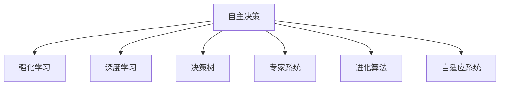
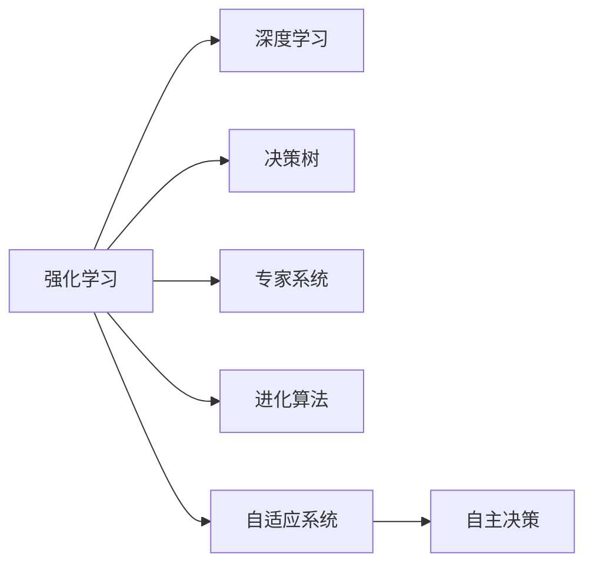

                 

# AI Agent: AI的下一个风口 自主决策的重要性

> 关键词：AI Agent,自主决策,强化学习,深度学习,决策树,专家系统,进化算法,自适应系统

## 1. 背景介绍

### 1.1 问题由来
随着人工智能技术的飞速发展，AI Agent（AI代理人）这一概念逐渐成为热议焦点。AI Agent不仅代表了一种新的AI应用范式，更是一种全新的智能化形态，标志着AI技术的又一次跃进。AI Agent的核心能力在于自主决策，即能够在复杂多变的环境中，根据当前环境状态和目标，自主制定并执行决策策略。与传统的基于规则和手动调参的AI系统相比，AI Agent以其高度的自主性、适应性和智能性，展现出更大的潜力和价值。

### 1.2 问题核心关键点
AI Agent的自主决策能力，体现在其能够根据环境和任务动态调整策略、学习新知识和适应新变化。这种能力不仅提升了AI系统的灵活性和智能水平，也使得AI Agent能够应对更为复杂、不确定的实际应用场景，如自动驾驶、机器人操作、智能控制等。但同时也带来了新的挑战，如如何构建高效的学习模型、如何保证决策的鲁棒性和可靠性等。

### 1.3 问题研究意义
研究AI Agent及其自主决策机制，对于拓展AI技术的应用边界，提升系统的智能水平和自动化程度，具有重要意义：

1. **提升系统智能**：通过自主决策，AI Agent能够根据环境变化动态调整策略，使系统具备更强的环境适应能力和智能水平。
2. **减少人工干预**：AI Agent能够自动完成复杂的决策过程，减少了对人力的依赖，提高了系统的效率和稳定性。
3. **应对复杂场景**：AI Agent能够应对各种复杂多变的环境和任务，具备更强的灵活性和适应性。
4. **促进产业升级**：AI Agent技术的广泛应用，将加速各行各业的智能化转型，推动产业升级和经济社会发展。
5. **推动技术创新**：AI Agent技术的研发和应用，催生了新的技术方向和研究热点，推动了AI领域的前沿探索。

## 2. 核心概念与联系

### 2.1 核心概念概述

AI Agent的核心概念包括：

- **自主决策**：AI Agent能够在复杂环境中自主制定并执行决策策略。
- **强化学习**：通过与环境的交互，学习最优决策策略，最大化奖励。
- **深度学习**：基于神经网络构建高层次特征表示，提升决策能力。
- **决策树**：用于决策过程的结构化表示，便于理解和优化。
- **专家系统**：结合人类专家知识，提高决策的准确性和可靠性。
- **进化算法**：通过模拟自然进化过程，优化决策策略。
- **自适应系统**：能够根据环境变化动态调整参数，适应新环境。

这些核心概念之间的关系可以通过以下Mermaid流程图来展示：



这个流程图展示了AI Agent自主决策的核心架构，以及各个概念之间的关联和交互。

### 2.2 概念间的关系

这些核心概念之间的逻辑关系可以通过以下Mermaid流程图来展示：



这个流程图展示了强化学习、深度学习等技术如何支撑AI Agent的自主决策能力，以及自适应系统如何进一步增强系统的灵活性和适应性。

## 3. 核心算法原理 & 具体操作步骤

### 3.1 算法原理概述

AI Agent的自主决策能力，主要通过强化学习（Reinforcement Learning, RL）、深度学习（Deep Learning, DL）等技术实现。强化学习通过与环境的交互，逐步学习最优决策策略，优化决策效果。深度学习通过构建高层次特征表示，提升决策的准确性和鲁棒性。

### 3.2 算法步骤详解

AI Agent自主决策的实现步骤如下：

1. **环境建模**：构建环境的数学模型，包括状态空间、动作空间、奖励函数等。
2. **策略学习**：通过深度学习网络构建策略函数，学习最优决策策略。
3. **策略评估**：使用模拟或实验数据评估策略的效果，通过强化学习算法优化策略。
4. **策略执行**：将最优策略应用于实际环境，进行决策和执行。
5. **策略优化**：根据执行结果反馈，进一步优化策略，形成迭代循环。

### 3.3 算法优缺点

AI Agent的自主决策算法具有以下优点：

- **高智能性**：通过深度学习和高层次特征表示，AI Agent能够处理复杂、非结构化的决策问题。
- **灵活性**：强化学习策略的逐步优化，使得AI Agent能够动态适应环境变化。
- **鲁棒性**：多策略和自适应系统的结合，提升了系统的稳定性和可靠性。

但同时也存在一些局限性：

- **训练复杂**：深度学习模型和强化学习算法需要大量的计算资源和时间，训练过程较为复杂。
- **模型泛化**：在实际应用中，AI Agent的泛化能力可能受限于训练数据的代表性。
- **决策透明性**：AI Agent的决策过程往往是"黑箱"的，缺乏可解释性，难以理解其决策逻辑。

### 3.4 算法应用领域

AI Agent及其自主决策技术，已经在多个领域得到了广泛应用，例如：

- **自动驾驶**：通过与实际道路环境的交互，自动学习最优驾驶策略，提升行车安全和效率。
- **机器人操作**：在复杂的工业操作环境中，自主学习最优操作策略，减少人工干预。
- **智能控制**：在电力、水利等关键基础设施中，实现高效、可靠的自动化控制。
- **金融交易**：自动学习和执行交易策略，优化投资回报率。
- **医疗诊断**：结合专家知识和病历数据，自主学习最优诊断策略，提高诊断准确性。
- **物流配送**：优化配送路径和策略，提高物流效率和成本效益。

## 4. 数学模型和公式 & 详细讲解  
### 4.1 数学模型构建

AI Agent的自主决策过程可以建模为一个马尔可夫决策过程（MDP）。MDP由状态空间 $S$、动作空间 $A$、奖励函数 $R$、状态转移概率 $P$ 和折扣因子 $\gamma$ 组成。其中，状态 $s$ 表示当前环境状态，动作 $a$ 表示决策，奖励 $r$ 表示对当前决策的即时奖励，状态转移概率 $p$ 表示从当前状态到下一个状态的概率分布，折扣因子 $\gamma$ 用于衡量长期奖励的重要性。

### 4.2 公式推导过程

AI Agent的自主决策过程可以通过策略梯度方法进行优化。策略 $\pi$ 定义为从状态 $s$ 到动作 $a$ 的概率分布，即 $\pi(a|s) = P(a|s,\theta)$。其中，$\theta$ 为策略参数。目标是最小化策略的负对数似然，即：

$$
\min_{\theta} \mathbb{E}_{s\sim S}\left[ -\log \pi(a|s)\right]
$$

使用随机梯度下降（SGD）等优化算法，更新策略参数 $\theta$。通过强化学习算法（如REINFORCE、DQN等），不断优化策略，使得AI Agent能够逐渐学习到最优决策策略。

### 4.3 案例分析与讲解

以自动驾驶为例，MDP的状态可以定义为车辆当前的位置和速度，动作可以定义为加速度、转向角度等。奖励函数可以定义为一个复合函数，包括安全、效率和舒适性等多维目标。通过强化学习算法，自动驾驶AI Agent能够在复杂道路环境中，学习到最优的驾驶策略，实现安全、高效的自主决策。

## 5. 项目实践：代码实例和详细解释说明
### 5.1 开发环境搭建

要进行AI Agent的开发和测试，首先需要搭建一个高效的开发环境。以下是使用Python和TensorFlow搭建开发环境的流程：

1. 安装Anaconda：从官网下载并安装Anaconda，用于创建独立的Python环境。

2. 创建并激活虚拟环境：
```bash
conda create -n agent-env python=3.8 
conda activate agent-env
```

3. 安装TensorFlow：
```bash
pip install tensorflow==2.7
```

4. 安装必要的库：
```bash
pip install numpy scipy matplotlib scikit-learn pandas jupyter notebook ipython
```

5. 设置TensorBoard：
```bash
pip install tensorboard
```

6. 配置环境变量：
```bash
export TENSORBOARD_LOG_DIR=/path/to/logs
```

完成上述步骤后，即可在`agent-env`环境中进行AI Agent的开发和测试。

### 5.2 源代码详细实现

以下是一个简单的AI Agent代码实现，以自动驾驶决策为例：

```python
import numpy as np
import tensorflow as tf
from tensorflow.keras import layers, models
from tensorflow.keras.optimizers import Adam

class Agent(tf.keras.Model):
    def __init__(self, state_dim, action_dim, learning_rate=0.01):
        super(Agent, self).__init__()
        self.state_dim = state_dim
        self.action_dim = action_dim
        self.learning_rate = learning_rate
        self.dense1 = layers.Dense(128, activation='relu')
        self.dense2 = layers.Dense(64, activation='relu')
        self.output = layers.Dense(action_dim, activation='softmax')
    
    def call(self, x):
        x = self.dense1(x)
        x = self.dense2(x)
        return self.output(x)

    def policy(self, state):
        x = self.predict(state)
        return x.numpy().argmax()

    def predict(self, state):
        return self(tf.convert_to_tensor(state, dtype=tf.float32))
```

在这个代码中，我们定义了一个简单的线性神经网络，用于决策策略的估计。`state` 是车辆当前的状态，`action` 是车辆的决策动作，如加速度、转向角度等。

接下来，我们定义了训练过程：

```python
def train(environment, episodes=1000, steps_per_episode=100, batch_size=32, learning_rate=0.01):
    state_dim = environment.observation_dim
    action_dim = environment.action_dim
    agent = Agent(state_dim, action_dim, learning_rate)
    optimizer = Adam(learning_rate)
    state_buffer = []
    action_buffer = []
    reward_buffer = []
    
    for episode in range(episodes):
        state = environment.reset()
        done = False
        total_reward = 0
        while not done:
            action = agent.policy(state)
            next_state, reward, done = environment.step(action)
            state_buffer.append(state)
            action_buffer.append(action)
            reward_buffer.append(reward)
            state = next_state
            total_reward += reward
        print(f'Episode {episode+1}, Reward: {total_reward}')
    
    state_tensor = tf.convert_to_tensor(np.array(state_buffer), dtype=tf.float32)
    action_tensor = tf.convert_to_tensor(np.array(action_buffer), dtype=tf.int32)
    reward_tensor = tf.convert_to_tensor(np.array(reward_buffer), dtype=tf.float32)
    
    with tf.GradientTape() as tape:
        log_probs = []
        for i in range(len(reward_buffer)):
            log_probs.append(tf.math.log(agent.predict(state_tensor[i])))
        loss = -tf.reduce_mean(tf.reduce_sum(log_probs * reward_tensor, axis=1))
    
    grads = tape.gradient(loss, agent.trainable_variables)
    optimizer.apply_gradients(zip(grads, agent.trainable_variables))
```

在这个训练过程中，我们使用了Q-Learning算法来优化策略，即通过状态-动作对的经验数据，逐步优化策略函数，使得AI Agent能够学习到最优的决策策略。

### 5.3 代码解读与分析

让我们再详细解读一下关键代码的实现细节：

**Agent类**：
- `__init__`方法：初始化神经网络结构，包括输入层、隐藏层和输出层。
- `call`方法：定义前向传播过程，输出动作概率分布。
- `policy`方法：根据当前状态，返回最优动作。
- `predict`方法：根据当前状态，输出动作概率分布。

**train函数**：
- 在每个epoch中，使用Q-Learning算法逐步优化策略函数。
- 通过遍历环境，收集状态、动作、奖励等经验数据。
- 使用梯度下降算法，更新策略函数的参数。

**训练结果展示**：
```python
import gym
from gym import spaces

# 定义环境
env = gym.make('CartPole-v0')

# 训练
train(env)
```

在这个环境中，我们使用CartPole-v0作为训练环境，这是一个经典的连续控制问题，用于测试AI Agent的决策能力。

## 6. 实际应用场景

### 6.1 自动驾驶

自动驾驶是AI Agent的重要应用场景之一。在自动驾驶中，AI Agent需要根据当前道路状态，自主选择行车速度、加速度、转向角度等决策动作，以实现安全、高效的驾驶。

### 6.2 机器人操作

在工业机器人、服务机器人等应用中，AI Agent可以通过与环境的交互，学习最优的操作策略，实现复杂任务的自动化操作。

### 6.3 智能控制

在电力、水利等关键基础设施中，AI Agent能够根据实时环境数据，自动调整控制参数，优化系统的运行效率和稳定性。

### 6.4 金融交易

在金融交易中，AI Agent可以学习最优的交易策略，自动化执行买卖操作，提高投资回报率。

### 6.5 医疗诊断

在医疗诊断中，AI Agent结合专家知识库和患者数据，自主学习最优诊断策略，提高诊断准确性。

### 6.6 物流配送

在物流配送中，AI Agent可以优化配送路径和策略，提高物流效率和成本效益。

## 7. 工具和资源推荐
### 7.1 学习资源推荐

为了帮助开发者系统掌握AI Agent及其自主决策技术，这里推荐一些优质的学习资源：

1. 《深度学习》书籍：Ian Goodfellow等著，系统介绍深度学习的理论基础和实践方法。
2. 《强化学习》书籍：Richard Sutton等著，全面介绍强化学习的原理和应用。
3. 《Python深度学习》书籍：Francois Chollet著，介绍使用TensorFlow和Keras进行深度学习的实践。
4. 《OpenAI Gym教程》：介绍如何使用Gym环境进行强化学习实验。
5. 《TensorFlow教程》：介绍TensorFlow的基本用法和高级特性。
6. 《PyTorch教程》：介绍PyTorch的基本用法和深度学习应用。

通过对这些资源的学习实践，相信你一定能够快速掌握AI Agent及其自主决策的精髓，并用于解决实际的AI问题。

### 7.2 开发工具推荐

高效的开发离不开优秀的工具支持。以下是几款用于AI Agent开发的常用工具：

1. TensorFlow：基于Python的开源深度学习框架，生产部署方便，适合大规模工程应用。
2. PyTorch：基于Python的开源深度学习框架，灵活动态的计算图，适合快速迭代研究。
3. OpenAI Gym：环境库，提供了各种模拟环境，用于测试和优化AI Agent。
4. TensorBoard：TensorFlow配套的可视化工具，实时监测模型训练状态，提供丰富的图表呈现方式。
5. Jupyter Notebook：交互式编程环境，适合实验和调试AI Agent。
6. VS Code：轻量级代码编辑器，支持Python和TensorFlow的集成开发。

合理利用这些工具，可以显著提升AI Agent开发的效率，加快创新迭代的步伐。

### 7.3 相关论文推荐

AI Agent及其自主决策技术的发展源于学界的持续研究。以下是几篇奠基性的相关论文，推荐阅读：

1. Deep Q-Learning：使用深度神经网络进行强化学习的经典论文，由Volodymyr Mnih等提出。
2. REINFORCE：使用策略梯度方法进行强化学习的经典论文，由Ronald Williams提出。
3. Evolution Strategies：一种基于自然进化过程的优化算法，由Klaus Hurlbert提出。
4. Evolved Strategies in Reinforcement Learning：将进化算法应用于强化学习的经典论文，由Ryo Ishikawa等提出。
5. Evolved Policy Optimization：一种结合进化算法和策略梯度的优化方法，由Rafael Cosman等提出。
6. Compositional Generalization through Model-Based Evolution Strategies：使用模型化进化策略进行组合泛化的经典论文，由Uwe-Simon Schaul等提出。

这些论文代表了大规模AI Agent研究的发展脉络。通过学习这些前沿成果，可以帮助研究者把握学科前进方向，激发更多的创新灵感。

除上述资源外，还有一些值得关注的前沿资源，帮助开发者紧跟AI Agent技术的前沿进展，例如：

1. arXiv论文预印本：人工智能领域最新研究成果的发布平台，包括大量尚未发表的前沿工作，学习前沿技术的必读资源。
2. 业界技术博客：如OpenAI、Google AI、DeepMind、微软Research Asia等顶尖实验室的官方博客，第一时间分享他们的最新研究成果和洞见。
3. 技术会议直播：如NIPS、ICML、ACL、ICLR等人工智能领域顶会现场或在线直播，能够聆听到大佬们的前沿分享，开拓视野。
4. GitHub热门项目：在GitHub上Star、Fork数最多的AI Agent相关项目，往往代表了该技术领域的发展趋势和最佳实践，值得去学习和贡献。
5. 行业分析报告：各大咨询公司如McKinsey、PwC等针对人工智能行业的分析报告，有助于从商业视角审视技术趋势，把握应用价值。

总之，对于AI Agent及其自主决策技术的学习和实践，需要开发者保持开放的心态和持续学习的意愿。多关注前沿资讯，多动手实践，多思考总结，必将收获满满的成长收益。

## 8. 总结：未来发展趋势与挑战

### 8.1 总结

本文对AI Agent及其自主决策技术进行了全面系统的介绍。首先阐述了AI Agent和自主决策技术的研究背景和意义，明确了其在高智能性、灵活性和适应性方面的独特价值。其次，从原理到实践，详细讲解了强化学习、深度学习等技术的核心算法，并给出了代码实例。同时，本文还广泛探讨了AI Agent在自动驾驶、机器人操作、智能控制等领域的实际应用场景，展示了其广阔的应用前景。最后，本文精选了相关学习资源、开发工具和前沿论文，为读者提供了全方位的技术指引。

通过本文的系统梳理，可以看到，AI Agent及其自主决策技术正在成为AI领域的重要方向，极大地拓展了AI技术的边界，推动了AI技术的普及和应用。未来，伴随AI技术的不断进步，AI Agent必将在更多领域大放异彩，为人类社会的智能化转型提供重要支持。

### 8.2 未来发展趋势

展望未来，AI Agent及其自主决策技术将呈现以下几个发展趋势：

1. **智能化程度提升**：通过更高效的算法和更大规模的模型，AI Agent将具备更高的智能水平，能够处理更加复杂、不确定的环境和任务。
2. **多模态融合**：结合视觉、语音、文本等多模态数据，AI Agent将具备更全面、准确的环境感知能力。
3. **自适应和进化**：通过进化算法和多任务学习，AI Agent将具备更强的适应性和自优化能力，能够根据环境和任务动态调整策略。
4. **知识整合**：将人类专家的知识和规则与AI Agent结合，形成更加全面、准确的信息整合能力，提升决策的准确性和可靠性。
5. **跨领域应用**：AI Agent技术将广泛应用于自动驾驶、机器人操作、金融交易等多个领域，推动各行业的智能化转型。
6. **人机协同**：AI Agent将与人类的决策机制协同工作，形成更高效、更可靠的智能系统。

这些趋势凸显了AI Agent技术的广阔前景。这些方向的探索发展，必将进一步提升AI系统的智能水平和应用范围，为人类认知智能的进化带来深远影响。

### 8.3 面临的挑战

尽管AI Agent及其自主决策技术已经取得了瞩目成就，但在迈向更加智能化、普适化应用的过程中，它仍面临着诸多挑战：

1. **训练复杂**：深度学习模型和强化学习算法需要大量的计算资源和时间，训练过程较为复杂。
2. **模型泛化**：在实际应用中，AI Agent的泛化能力可能受限于训练数据的代表性。
3. **决策透明性**：AI Agent的决策过程往往是"黑箱"的，缺乏可解释性，难以理解其决策逻辑。
4. **资源消耗**：AI Agent在高智能性和多模态融合的需求下，资源消耗较大，需要高效的算法和优化方法。
5. **安全性和可靠性**：AI Agent在复杂环境中决策的鲁棒性和安全性，还需进一步研究优化。

### 8.4 研究展望

面对AI Agent及其自主决策技术所面临的挑战，未来的研究需要在以下几个方面寻求新的突破：

1. **高效算法研究**：探索更高效的强化学习算法和深度学习模型，减少训练时间和计算资源消耗。
2. **泛化能力提升**：通过多任务学习和迁移学习，提高AI Agent的泛化能力和跨领域适应性。
3. **决策可解释性**：开发可解释性的决策模型和工具，增强决策过程的透明度和可信度。
4. **资源优化**：研究高效的多模态融合和跨领域适应算法，减少AI Agent的资源消耗。
5. **安全性保障**：研究鲁棒性和安全性保障方法，确保AI Agent在复杂环境中的决策稳定性和可靠性。
6. **人机协同机制**：研究人机协同的机制和界面设计，提升人机交互的效率和体验。

这些研究方向的探索，必将引领AI Agent技术迈向更高的台阶，为构建安全、可靠、可解释、可控的智能系统铺平道路。面向未来，AI Agent技术还需要与其他AI技术进行更深入的融合，如知识表示、因果推理、强化学习等，多路径协同发力，共同推动人工智能技术的进步。只有勇于创新、敢于突破，才能不断拓展AI技术的边界，让智能技术更好地造福人类社会。

## 9. 附录：常见问题与解答

**Q1：AI Agent的自主决策能力如何提升？**

A: AI Agent的自主决策能力可以通过以下方法提升：
1. **深度学习模型优化**：选择更高效、更准确的深度学习模型，提高特征表示的准确性。
2. **强化学习算法优化**：探索更高效的强化学习算法，如模型化进化策略、多任务学习等，提升决策策略的优化效果。
3. **多模态数据融合**：结合视觉、语音、文本等多模态数据，提高AI Agent的环境感知能力。
4. **自适应和进化**：通过进化算法和多任务学习，增强AI Agent的适应性和自优化能力。
5. **跨领域知识整合**：将人类专家的知识和规则与AI Agent结合，形成更全面、准确的信息整合能力。

**Q2：AI Agent的训练过程需要注意哪些问题？**

A: AI Agent的训练过程中需要注意以下问题：
1. **计算资源消耗**：AI Agent训练通常需要大量的计算资源和时间，选择合适的硬件设备和优化算法是关键。
2. **数据代表性**：AI Agent的泛化能力受限于训练数据的代表性，确保数据集的多样性和覆盖面。
3. **决策透明性**：AI Agent的决策过程往往是"黑箱"的，需要开发可解释性的决策模型和工具。
4. **鲁棒性和安全性**：AI Agent在复杂环境中的决策鲁棒性和安全性，需进一步研究优化。
5. **多模态数据融合**：AI Agent在高智能性和多模态融合的需求下，资源消耗较大，需要高效的算法和优化方法。

**Q3：AI Agent在未来有哪些新的应用场景？**

A: AI Agent在未来可能有以下新的应用场景：
1. **智能医疗**：AI Agent在医疗领域的应用将更加广泛，能够自主进行诊断、治疗方案推荐等。
2. **智能家居**：AI Agent将实现更智能的家居控制，能够自主进行家电管理、环境调节等。
3. **智能教育**：AI Agent在教育领域的应用将更加深入，能够进行个性化教育、智能评估等。
4. **智能交通**：AI Agent在交通领域的应用将更加广泛，能够实现自动驾驶、智能交通管理等。
5. **智能制造**：AI Agent在制造领域的应用将更加深入，能够进行设备预测维护、智能调度等。

总之，AI Agent技术将在更多领域大放异彩，为人类社会的智能化转型提供重要支持。

---

作者：禅与计算机程序设计艺术 / Zen and the Art of Computer Programming

