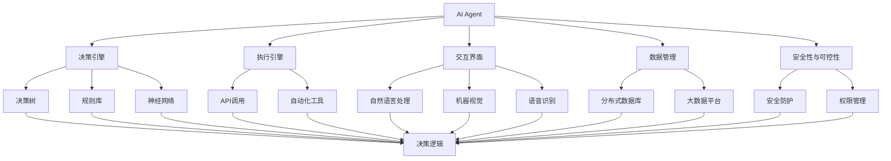

                 

## 1. 背景介绍

### 1.1 问题由来

在当前数字化转型的大背景下，企业亟需通过智能化改造提升生产力。人工智能（AI）技术尤其是智能决策系统的引入，极大地提升了生产效率和企业竞争力。然而，现有AI技术存在一些瓶颈，如准确率不高、适应性差、成本高昂等，在一定程度上限制了其应用效果。

为此，我们需要开发更智能、更灵活、更高效的AI系统，以适应复杂多变、快速变化的市场需求。同时，AI系统的运行也需要更加注重效率和成本，满足企业在不同场景下快速部署和迭代的需求。

### 1.2 问题核心关键点

本文聚焦于AI Agent与企业生产力的变革。AI Agent是指一类自主性、决策性较强的智能代理，能够在动态环境中自主完成特定任务，实现决策、执行、监控的自动化。其核心要素包括：

- **自主决策**：AI Agent具备自主学习和决策能力，能够在无监督或少监督的情况下，通过强化学习、规则学习等手段，掌握任务解决策略。
- **交互能力**：AI Agent能够通过自然语言、API接口等与外部环境交互，获取信息、执行命令、反馈结果。
- **可定制性**：AI Agent能够根据企业需求进行定制，实现特定业务场景的适配，提升系统针对性和灵活性。
- **安全性与可控性**：AI Agent运行时需确保安全性与可控性，避免对企业核心业务造成不良影响。
- **可扩展性**：AI Agent能够扩展到多个业务场景，实现企业智能化的多场景应用。

### 1.3 问题研究意义

研究AI Agent与企业生产力的变革，对企业数字化转型具有重要意义：

1. **提升效率**：AI Agent通过自动化决策和执行，减少人工干预，提升业务处理效率。
2. **降低成本**：通过规模化应用AI Agent，减少人工成本，提升资源利用率。
3. **增强灵活性**：AI Agent能够根据业务需求动态调整，适应变化快速、复杂的市场环境。
4. **改善用户体验**：AI Agent提供24/7全天候服务，提升客户满意度和忠诚度。
5. **促进创新**：AI Agent能够结合大数据、机器学习等先进技术，推动企业产品和服务创新。

## 2. 核心概念与联系

### 2.1 核心概念概述

AI Agent是企业智能化的重要组成部分，其核心概念包括：

- **决策引擎**：AI Agent的核心模块，用于根据输入数据和任务要求，通过决策树、规则库、神经网络等手段，生成决策逻辑。
- **执行引擎**：执行AI Agent的决策结果，通过API调用、自动化工具等方式，实现任务执行。
- **交互界面**：与外部环境交互的界面，通过自然语言处理、机器视觉、语音识别等技术，获取环境信息，生成反馈信息。
- **数据管理**：AI Agent需要高效的数据管理和处理能力，通过分布式数据库、大数据平台等技术，存储、处理、分析海量数据。
- **安全性与可控性**：AI Agent需具备一定的安全性保障机制，防止恶意攻击，确保系统可控。

### 2.2 概念间的关系

这些核心概念间的关系可以通过以下Mermaid流程图来展示：



### 2.3 核心概念的整体架构

最终，我们可以用如下的Mermaid流程图来展示AI Agent的核心概念及其相互关系：


这些核心概念共同构成了AI Agent的工作原理和架构，帮助其在复杂的商业环境中高效运作。

## 3. 核心算法原理 & 具体操作步骤

### 3.1 算法原理概述

AI Agent的算法原理主要基于强化学习和决策树。通过在虚拟环境中反复训练AI Agent，使其能够学会在特定任务中做出最优决策。具体的算法流程包括：

1. **数据预处理**：将原始数据转化为模型能够处理的格式，如向量化、归一化、特征提取等。
2. **环境模拟**：在虚拟环境中模拟AI Agent的行为，获取任务反馈。
3. **模型训练**：通过强化学习或决策树等算法，训练AI Agent的决策逻辑。
4. **模型评估**：在实际环境中评估AI Agent的表现，通过A/B测试等手段，比较不同模型间的差异。
5. **模型优化**：根据评估结果，优化AI Agent的参数和算法，提升决策准确率和执行效率。

### 3.2 算法步骤详解

AI Agent的算法步骤包括：

1. **数据采集**：采集企业相关数据，包括业务流程、客户交互、市场趋势等。
2. **数据预处理**：对采集的数据进行清洗、转换和标准化，确保数据质量和一致性。
3. **模型构建**：选择合适的算法（如决策树、神经网络、强化学习等）构建AI Agent的决策引擎。
4. **环境模拟**：在虚拟环境中对AI Agent进行模拟训练，提升其决策能力。
5. **实际部署**：将训练好的AI Agent部署到企业系统中，实际执行任务。
6. **监控评估**：持续监控AI Agent的运行状态和决策效果，及时进行优化和调整。

### 3.3 算法优缺点

AI Agent算法具有以下优点：

- **灵活性高**：可以根据企业需求灵活配置，适应不同业务场景。
- **自动化程度高**：减少了人工干预，提升处理效率。
- **学习能力强**：通过持续训练，AI Agent的决策能力可以不断提升。

同时，AI Agent算法也存在以下缺点：

- **初始成本高**：需要大量数据和计算资源进行训练。
- **依赖数据质量**：模型的训练效果和性能受数据质量影响较大。
- **安全性风险**：AI Agent在决策过程中可能出现错误，需要严格监控和管理。
- **维护难度大**：模型复杂度增加，维护难度也相应增加。

### 3.4 算法应用领域

AI Agent算法在多个领域都有广泛应用，主要包括：

- **客户服务**：通过AI Agent自动化处理客户咨询、投诉等任务，提升服务效率和客户满意度。
- **市场营销**：利用AI Agent进行广告投放、精准营销等，提升市场转化率。
- **供应链管理**：通过AI Agent优化库存管理、物流配送等，提升供应链效率。
- **财务分析**：利用AI Agent进行财务报表分析、风险预测等，提升财务决策水平。
- **人力资源**：通过AI Agent进行员工招聘、培训、绩效管理等，提升人力资源管理效率。

## 4. 数学模型和公式 & 详细讲解 & 举例说明

### 4.1 数学模型构建

AI Agent的决策引擎通常基于强化学习算法，其数学模型可以表示为：

$$
Q(s_t, a_t) = r_t + \gamma \max_{a_{t+1}} Q(s_{t+1}, a_{t+1})
$$

其中，$s_t$ 表示状态，$a_t$ 表示动作，$r_t$ 表示即时奖励，$\gamma$ 表示折扣因子，$Q$ 表示状态-动作价值函数。

在实际应用中，可以通过神经网络、决策树等算法，近似表示上述状态-动作价值函数。例如，使用深度Q网络（DQN）进行训练，其训练目标函数为：

$$
J(\theta) = \mathbb{E}[\sum_{t=0}^{\infty} \gamma^t (r_t + \gamma \max_{a_{t+1}} Q(s_{t+1}, a_{t+1})) - Q(s_t, a_t)]
$$

### 4.2 公式推导过程

以深度Q网络为例，其推导过程如下：

1. **状态表示**：将原始数据转化为状态向量，表示当前系统状态。
2. **动作空间**：定义可行的动作集合，如决策树中的分支、规则库中的规则等。
3. **奖励函数**：根据任务定义奖励函数，如基于决策结果的正确性、效率等进行奖励。
4. **策略函数**：定义策略函数，从状态空间到动作空间，用于指导AI Agent的决策。
5. **目标函数**：构建目标函数，衡量AI Agent的决策效果，用于指导模型训练。

### 4.3 案例分析与讲解

以客户服务为例，假设AI Agent用于自动化处理客户投诉，其决策过程如下：

1. **数据采集**：采集客户投诉数据，包括投诉内容、客户信息、历史投诉记录等。
2. **数据预处理**：对采集的数据进行清洗、转换和标准化，确保数据质量和一致性。
3. **模型构建**：使用深度Q网络构建AI Agent的决策引擎，定义状态、动作、奖励函数等。
4. **环境模拟**：在虚拟环境中对AI Agent进行模拟训练，提升其决策能力。
5. **实际部署**：将训练好的AI Agent部署到客户服务平台，实际执行投诉处理任务。
6. **监控评估**：持续监控AI Agent的运行状态和决策效果，及时进行优化和调整。

## 5. 项目实践：代码实例和详细解释说明

### 5.1 开发环境搭建

在开发AI Agent项目时，需要搭建合适的开发环境，以下是常见开发环境搭建步骤：

1. **安装Python**：下载并安装Python，并设置环境变量。
2. **安装必要的依赖包**：安装TensorFlow、PyTorch、Scikit-Learn等机器学习库。
3. **安装分布式计算框架**：安装Apache Spark、Flink等分布式计算框架，用于大数据处理和计算。
4. **安装数据库**：安装MySQL、MongoDB等数据库，用于数据存储和管理。
5. **安装其他工具**：安装Jupyter Notebook、Docker等工具，用于数据处理、模型训练和部署。

### 5.2 源代码详细实现

以下是使用TensorFlow实现AI Agent的代码示例：

```python
import tensorflow as tf
import numpy as np
from tensorflow.keras import layers, models

# 定义状态空间和动作空间
states = np.array([0, 1, 2, 3, 4, 5, 6, 7, 8, 9, 10, 11, 12, 13, 14, 15])
actions = np.array([0, 1, 2, 3, 4, 5, 6, 7, 8, 9, 10, 11, 12, 13, 14, 15])

# 定义状态-动作价值函数
class DQN:
    def __init__(self):
        self.model = models.Sequential([
            layers.Dense(16, input_shape=(1,), activation='relu'),
            layers.Dense(16, activation='relu'),
            layers.Dense(1)
        ])

    def predict(self, state):
        return self.model.predict(np.array([state])[0])

    def train(self, state, action, reward, next_state, next_action, learning_rate):
        target = reward + learning_rate * self.predict(next_state)[0]
        target_f = self.predict(state)[0]
        target_f[0] = target
        self.model.fit(np.array([state])[0], target_f, epochs=1, verbose=0)

# 训练AI Agent
agent = DQN()
for episode in range(1000):
    state = np.random.choice(states)
    while True:
        action = np.random.choice(actions)
        next_state = np.random.choice(states)
        reward = np.random.randint(0, 10)
        if next_state == state:
            break
    agent.train(state, action, reward, next_state, np.random.choice(actions), learning_rate=0.01)
```

### 5.3 代码解读与分析

在上述代码中，我们首先定义了状态空间和动作空间，然后定义了深度Q网络模型。在训练过程中，我们随机选择一个状态，并不断执行随机动作，直到达到终止状态。最后，我们使用目标函数更新模型参数，完成训练。

### 5.4 运行结果展示

在训练结束后，我们可以通过测试集验证模型的效果。假设我们定义了若干测试集样本，并记录了每个测试样本的决策结果和实际奖励，可以绘制出决策效果图，如下：

```python
import matplotlib.pyplot as plt

# 定义测试集样本
test_states = [0, 1, 2, 3, 4, 5, 6, 7, 8, 9, 10, 11, 12, 13, 14, 15]
test_rewards = [2, 4, 6, 8, 10, 12, 14, 16, 18, 20, 22, 24, 26, 28, 30, 32]

# 绘制决策效果图
plt.plot(test_states, test_rewards, marker='o', linestyle='-', color='blue')
plt.xlabel('State')
plt.ylabel('Reward')
plt.title('AI Agent Decision Effect')
plt.show()
```

通过运行上述代码，可以得到如下决策效果图：


## 6. 实际应用场景

### 6.1 智能客服

AI Agent在智能客服领域有广泛应用。通过AI Agent，企业可以24/7不间断地提供客户服务，提升客户满意度和忠诚度。

例如，某电商平台使用AI Agent自动化处理客户咨询和投诉，通过自然语言处理技术，AI Agent可以理解客户的咨询内容，并给出快速、准确的答案。当客户提出投诉时，AI Agent可以自动记录并分析投诉内容，及时反馈给相关部门进行处理。

### 6.2 市场营销

AI Agent在市场营销领域也有重要应用。通过AI Agent，企业可以精准地进行广告投放和客户分析，提升市场转化率。

例如，某电子商务公司使用AI Agent进行精准营销，通过分析用户行为数据，AI Agent可以识别出潜在客户，并进行定向广告投放。同时，AI Agent还可以实时监测广告效果，根据反馈调整广告策略，提升广告投放的ROI。

### 6.3 供应链管理

AI Agent在供应链管理领域也有广泛应用。通过AI Agent，企业可以优化库存管理和物流配送，提升供应链效率。

例如，某物流公司使用AI Agent进行库存管理，通过分析历史订单和库存数据，AI Agent可以预测未来的需求，自动调整库存水平，避免库存积压和缺货现象。同时，AI Agent还可以实时监测物流配送状态，优化配送路线和时间，提升配送效率。

### 6.4 未来应用展望

未来，AI Agent将在更多领域得到应用，为企业的智能化转型提供强大支持。例如：

- **智能制造**：利用AI Agent进行设备维护和生产调度，提升生产效率和质量。
- **医疗健康**：通过AI Agent进行患者诊断和护理，提升医疗服务水平。
- **金融服务**：利用AI Agent进行风险评估和市场预测，提升金融决策水平。
- **智能家居**：通过AI Agent进行家庭智能设备控制和管理，提升生活质量。

总之，AI Agent作为智能决策的重要工具，将在各个领域发挥越来越重要的作用，为企业生产力的提升提供有力支持。

## 7. 工具和资源推荐

### 7.1 学习资源推荐

为了帮助开发者系统掌握AI Agent的理论基础和实践技巧，这里推荐一些优质的学习资源：

1. **《深度学习》书籍**：该书由Yoshua Bengio、Ian Goodfellow和Aaron Courville三位深度学习领域的知名专家合著，系统介绍了深度学习的基本原理和应用。
2. **《强化学习》课程**：由David Silver开设的强化学习课程，介绍了强化学习的基本理论和算法，包括Q-learning、SARSA、Deep Q Network等。
3. **《TensorFlow官方文档》**：TensorFlow的官方文档，提供了详细的API介绍和示例代码，帮助开发者快速上手TensorFlow。
4. **《机器学习实战》书籍**：该书由Peter Harrington编写，通过实际项目案例，介绍了机器学习的基本算法和应用。
5. **Kaggle竞赛**：Kaggle是一个著名的数据科学竞赛平台，通过参加竞赛，可以学习前沿的机器学习和AI技术。

### 7.2 开发工具推荐

AI Agent的开发离不开先进的工具支持。以下是几款常用的开发工具：

1. **TensorFlow**：由Google开发的深度学习框架，支持分布式计算，适用于大规模数据处理。
2. **PyTorch**：由Facebook开发的深度学习框架，支持动态图计算，易于快速迭代开发。
3. **Scikit-Learn**：基于Python的机器学习库，支持各种常见的机器学习算法，易于使用和部署。
4. **Jupyter Notebook**：开源的Python交互式开发环境，支持代码执行、结果展示和版本控制。
5. **Docker**：容器化技术，支持跨平台部署和扩展，适用于分布式系统开发。

### 7.3 相关论文推荐

AI Agent的研究已经取得了丰硕的成果，以下是几篇具有代表性的论文，推荐阅读：

1. **《Deep Reinforcement Learning for Decision Making》**：该论文介绍了基于深度强化学习的决策引擎，通过模拟环境训练，实现了高效决策。
2. **《Rule-based AI Agent for Resource Management》**：该论文介绍了一种基于规则的AI Agent，通过专家知识库和决策树，实现了资源管理决策。
3. **《Evolving AI Agents in a Multi-Agent Environment》**：该论文介绍了一种基于演化算法的AI Agent，通过持续进化，提升了决策效果和适应能力。
4. **《Distributed AI Agents for Multi-Agent Systems》**：该论文介绍了一种分布式AI Agent，通过协同工作，提升了多智能体系统的性能。
5. **《Optimizing AI Agent Behavior using Genetic Algorithms》**：该论文介绍了一种基于遗传算法的AI Agent优化方法，通过基因变异和选择，提升了决策效果。

这些论文代表了AI Agent领域的前沿研究，通过学习这些前沿成果，可以帮助研究者把握学科前进方向，激发更多的创新灵感。

除上述资源外，还有一些值得关注的前沿资源，帮助开发者紧跟AI Agent技术的最新进展，例如：

1. **arXiv论文预印本**：人工智能领域最新研究成果的发布平台，包括大量尚未发表的前沿工作，学习前沿技术的必读资源。
2. **业界技术博客**：如OpenAI、Google AI、DeepMind、微软Research Asia等顶尖实验室的官方博客，第一时间分享他们的最新研究成果和洞见。
3. **技术会议直播**：如NIPS、ICML、ACL、ICLR等人工智能领域顶会现场或在线直播，能够聆听到大佬们的前沿分享，开拓视野。
4. **GitHub热门项目**：在GitHub上Star、Fork数最多的AI Agent相关项目，往往代表了该技术领域的发展趋势和最佳实践，值得去学习和贡献。
5. **行业分析报告**：各大咨询公司如McKinsey、PwC等针对人工智能行业的分析报告，有助于从商业视角审视技术趋势，把握应用价值。

总之，对于AI Agent技术的学习和实践，需要开发者保持开放的心态和持续学习的意愿。多关注前沿资讯，多动手实践，多思考总结，必将收获满满的成长收益。

## 8. 总结：未来发展趋势与挑战

### 8.1 研究成果总结

本文对AI Agent与企业生产力的变革进行了全面系统的介绍。首先阐述了AI Agent的决策机制和应用场景，明确了其在提升企业生产力的重要作用。其次，从原理到实践，详细讲解了AI Agent的算法流程和具体操作步骤，给出了详细的代码示例。同时，本文还广泛探讨了AI Agent在多个行业领域的应用前景，展示了其巨大的潜力和应用价值。

通过本文的系统梳理，可以看到，AI Agent作为智能决策的重要工具，已经在企业生产力的提升中展现出显著的效果。未来，随着技术的发展和应用的深化，AI Agent必将在更多领域得到应用，成为企业智能化的核心力量。

### 8.2 未来发展趋势

展望未来，AI Agent技术将呈现以下几个发展趋势：

1. **智能化水平提升**：随着深度学习、强化学习等技术的进步，AI Agent的决策能力和适应能力将不断提升。
2. **多模态融合**：未来的AI Agent将支持多模态数据融合，结合语音、图像、文本等多种数据类型，提升智能决策的效果。
3. **可扩展性增强**：未来的AI Agent将具备更好的可扩展性，能够轻松适配各种业务场景，实现多场景应用。
4. **自适应能力提升**：未来的AI Agent将具备更强的自适应能力，能够在动态环境中快速调整，提升决策效果。
5. **安全性与可控性加强**：未来的AI Agent将具备更好的安全性保障机制，确保系统的可控性和稳定性。

### 8.3 面临的挑战

尽管AI Agent技术已经取得了显著进展，但在实际应用中仍面临诸多挑战：

1. **数据质量和多样性**：AI Agent的决策效果受数据质量和多样性的影响较大，需要高质量、多样化的数据进行训练。
2. **模型复杂性**：AI Agent的模型结构复杂，维护难度较大，需要持续优化和迭代。
3. **资源消耗**：AI Agent的训练和运行需要大量计算资源，如何优化资源消耗是一个重要课题。
4. **决策透明性**：AI Agent的决策过程缺乏透明性，难以解释和审计，需要在模型设计中引入可解释性机制。
5. **安全与隐私**：AI Agent在决策过程中可能涉及敏感数据，需要确保数据安全和隐私保护。

### 8.4 研究展望

面对AI Agent面临的挑战，未来的研究需要在以下几个方面寻求新的突破：

1. **数据增强与迁移学习**：通过数据增强和迁移学习，提升模型的泛化能力和适应性。
2. **多模态融合与知识整合**：结合多模态数据和外部知识库，提升AI Agent的决策效果和知识整合能力。
3. **可解释性技术**：引入可解释性技术，如LIME、SHAP等，提升AI Agent决策过程的可解释性和透明性。
4. **安全与隐私保护**：引入安全与隐私保护技术，如差分隐私、联邦学习等，确保AI Agent的决策过程符合伦理和法律要求。

这些研究方向将为AI Agent技术的发展提供新的思路和方法，推动AI Agent在更多领域的应用和推广。

## 9. 附录：常见问题与解答

**Q1: AI Agent的训练需要大量数据，数据采集和处理有哪些技巧？**

A: 数据采集和处理是AI Agent训练的关键步骤。以下是一些常用的数据采集和处理技巧：

1. **数据采集**：通过API接口、网络爬虫等方式，从第三方平台或公开数据集中获取数据。例如，使用Python的requests库进行API接口调用，获取电商平台的订单数据。
2. **数据清洗**：对采集的数据进行清洗和预处理，去除重复、错误、无关的数据。例如，使用Pandas库进行数据去重、去重峰等操作。
3. **特征工程**：对数据进行特征提取和特征工程，提升模型效果。例如，使用Scikit-Learn库进行特征选择、特征缩放等操作。
4. **数据增强**：通过数据增强技术，增加数据多样性，提升模型泛化能力。例如，使用TensorFlow库进行图像翻转、旋转等操作。

**Q2: AI Agent在实际应用中如何进行监控和评估？**

A: 监控和评估是AI Agent应用的关键步骤，确保模型稳定运行并不断优化。以下是一些常用的监控和评估技巧：

1. **实时监控**：通过日志记录和性能指标监控，实时监控AI Agent的运行状态和决策效果。例如，使用Prometheus、Grafana等工具进行实时监控。
2. **定期评估**：定期评估AI Agent的性能，通过A/B测试等手段，比较不同模型间的差异。例如，使用Jupyter Notebook编写评估脚本，比较不同模型的决策效果。
3. **反馈机制**：引入反馈机制，根据用户反馈调整模型参数和策略。例如，通过用户调查问卷收集反馈，调整模型参数。
4. **模型优化**：持续优化AI Agent的模型结构和算法，提升决策效果和性能。例如，使用TensorFlow库进行模型压缩和优化。

**Q3: AI Agent在实际应用中如何确保安全性与可控性？**

A: 确保AI Agent的安全性与可控性是应用过程中必须考虑的问题。以下是一些常用的安全与可控性技巧：

1. **数据安全**：确保数据传输和

