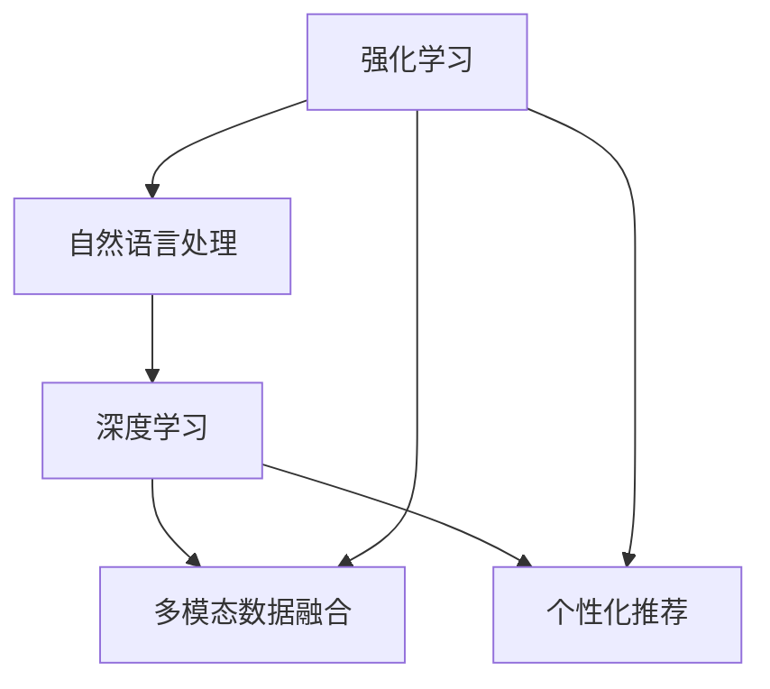
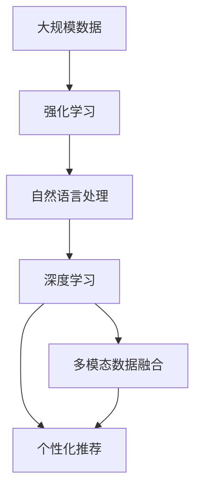

                 

## 1. 背景介绍

### 1.1 问题由来
人工智能（AI）技术近年来发展迅猛，在游戏和智能助理两大领域展现出了巨大的潜力和应用前景。AI Agent，即人工智能代理，是介于用户和应用系统之间的关键中介，能够智能地完成复杂的任务，为游戏与个人助理系统带来革命性的变化。AI Agent在游戏领域应用广泛，从简单的任务自动化到复杂的策略决策，都能有效提升用户体验。而在个人助理方面，AI Agent则成为智能助理系统的大脑，通过理解和执行用户指令，提供更加个性化和智能化的服务。

### 1.2 问题核心关键点
AI Agent在两个领域的应用成功在于其智能化的特性，这不仅要求其具备强大的数据处理和模型学习能力，还需在多模态数据、复杂交互场景中展现卓越的适应性。因此，构建高效、可解释、鲁棒的AI Agent，需要整合深度学习、自然语言处理、强化学习等多种AI技术。

### 1.3 问题研究意义
AI Agent在两大领域的应用，不仅显著提升了用户体验和系统效率，还能促进跨领域的知识共享和协作。此外，AI Agent在安全性和隐私保护方面也具有重要作用，通过智能监控和数据安全策略，保障用户信息的安全。同时，AI Agent的应用也有助于推动AI技术的普及和应用，加速技术向各行业的渗透和落地。

## 2. 核心概念与联系

### 2.1 核心概念概述

AI Agent的构建涉及以下几个核心概念：

- **强化学习（Reinforcement Learning, RL）**：AI Agent的核心技术之一，通过环境交互和奖励机制，使Agent能够在复杂环境中学习最优策略。
- **自然语言处理（Natural Language Processing, NLP）**：使AI Agent能够理解、处理和生成自然语言，实现与用户的自然交互。
- **深度学习（Deep Learning, DL）**：构建AI Agent的神经网络模型，通过大规模数据训练，提升Agent的智能水平。
- **多模态数据融合（Multi-modal Data Fusion）**：集成视觉、听觉、触觉等多感官数据，提升AI Agent在复杂环境中的感知能力。
- **个性化推荐（Personalized Recommendation）**：基于用户历史行为和兴趣，提供个性化推荐服务，提升用户满意度。

这些核心概念之间存在紧密联系，相互影响和协同工作，共同构建高效、可解释、鲁棒的AI Agent。

### 2.2 概念间的关系

AI Agent的构建流程可以通过以下Mermaid流程图来展示：



这个流程图展示了大规模数据在AI Agent构建中的各个阶段作用：

1. 强化学习模型通过环境交互和奖励机制学习最优策略，为AI Agent提供决策基础。
2. 自然语言处理模块使AI Agent能够理解、处理和生成自然语言，实现与用户的自然交互。
3. 深度学习模型构建AI Agent的神经网络，提升其智能水平。
4. 多模态数据融合模块集成视觉、听觉等感官数据，提升AI Agent在复杂环境中的感知能力。
5. 个性化推荐模块基于用户历史行为和兴趣，提供个性化推荐服务，提升用户满意度。

这些模块的协同工作，使得AI Agent能够高效、可解释、鲁棒地执行复杂任务。

### 2.3 核心概念的整体架构

最后，我们用一个综合的流程图来展示这些核心概念在大规模数据中的整体架构：



这个综合流程图展示了大规模数据在AI Agent构建中的整体处理流程，通过强化学习、自然语言处理、深度学习、多模态数据融合和个性化推荐，AI Agent能够在复杂环境中高效、可解释、鲁棒地执行复杂任务。

## 3. 核心算法原理 & 具体操作步骤

### 3.1 算法原理概述

AI Agent的构建主要基于强化学习和深度学习技术，其实现过程可以分为以下几个关键步骤：

1. **数据预处理**：对大规模数据进行清洗、标注、归一化等预处理，构建训练数据集。
2. **模型训练**：基于深度学习框架，构建和训练AI Agent的神经网络模型。
3. **策略学习**：通过强化学习算法，使AI Agent学习最优策略，能够在复杂环境中执行决策。
4. **模型微调**：针对特定任务或场景，对AI Agent进行微调，提升其适应性和鲁棒性。
5. **交互评估**：通过与用户的交互反馈，评估AI Agent的性能，并进行持续优化。

### 3.2 算法步骤详解

#### 3.2.1 数据预处理

数据预处理是构建AI Agent的重要步骤，主要包括以下步骤：

1. **数据收集**：收集相关的原始数据，如游戏数据、用户行为数据等。
2. **数据清洗**：去除噪声、冗余、不完整的数据。
3. **数据标注**：为数据打上标签，构建监督数据集。
4. **数据归一化**：对数据进行归一化处理，提高模型训练效果。

#### 3.2.2 模型训练

AI Agent的神经网络模型通常采用深度学习框架进行构建和训练，以下是一个基本的训练流程：

1. **模型选择**：选择适合的深度学习模型，如卷积神经网络（CNN）、循环神经网络（RNN）、Transformer等。
2. **模型初始化**：对模型进行初始化，设定参数。
3. **模型训练**：通过反向传播算法，使用优化器（如Adam、SGD）更新模型参数，最小化损失函数。
4. **模型验证**：使用验证集评估模型性能，调整模型参数。

#### 3.2.3 策略学习

策略学习是AI Agent的核心功能，主要通过强化学习算法实现。以下是一个基于Q-learning的策略学习流程：

1. **环境定义**：定义环境状态、动作、奖励等。
2. **策略选择**：选择适合的环境状态和动作，进行初始化。
3. **状态更新**：在每个时间步，根据当前状态和动作，计算新的状态和奖励。
4. **策略优化**：根据奖励和状态更新，调整策略，优化模型参数。
5. **策略评估**：通过测试集评估策略性能，进行持续优化。

#### 3.2.4 模型微调

模型微调是提升AI Agent适应性和鲁棒性的重要步骤，以下是一个基于超参数优化的微调流程：

1. **超参数选择**：选择合适的超参数，如学习率、批大小、迭代轮数等。
2. **微调策略**：使用微调策略，对模型进行优化。
3. **微调评估**：使用测试集评估微调后的模型性能，进行持续优化。

#### 3.2.5 交互评估

交互评估是AI Agent性能评估的重要环节，以下是一个基于用户反馈的交互评估流程：

1. **用户反馈收集**：通过问卷、评论、日志等方式收集用户反馈。
2. **反馈分析**：对用户反馈进行分析，提取有用信息。
3. **性能优化**：根据用户反馈，优化AI Agent策略和模型参数。

### 3.3 算法优缺点

AI Agent的构建有以下优点：

1. **智能化高**：通过深度学习和强化学习，AI Agent能够高效处理复杂任务。
2. **适应性强**：通过多模态数据融合和个性化推荐，AI Agent能够适应不同场景和用户需求。
3. **可解释性高**：AI Agent的学习过程可解释，便于用户理解和使用。

同时，也存在以下缺点：

1. **数据依赖**：AI Agent的性能很大程度上依赖于数据质量和数据量。
2. **资源消耗高**：AI Agent构建和训练需要大量计算资源和时间。
3. **模型复杂性高**：AI Agent构建复杂，需要整合多种技术。

### 3.4 算法应用领域

AI Agent在多个领域都有广泛应用，以下列举几个主要领域：

1. **游戏**：在游戏AI中，AI Agent可以完成自动任务、智能策略决策、个性化推荐等。
2. **个人助理**：在智能助理中，AI Agent能够理解用户指令，提供个性化推荐、智能客服、智能导航等服务。
3. **金融**：在金融领域，AI Agent能够进行风险评估、交易决策、用户行为分析等。
4. **医疗**：在医疗领域，AI Agent能够进行疾病诊断、个性化推荐、健康管理等。
5. **教育**：在教育领域，AI Agent能够进行智能推荐、学习分析、智能辅导等。

## 4. 数学模型和公式 & 详细讲解 & 举例说明

### 4.1 数学模型构建

AI Agent的构建涉及多个数学模型，以下以一个简单的AI Agent模型为例，介绍其构建过程。

假设AI Agent的任务是执行一个复杂的策略决策任务，其状态空间为 $S$，动作空间为 $A$，奖励函数为 $R$，折扣因子为 $\gamma$。AI Agent的学习目标是通过强化学习算法，最大化长期累积奖励。

AI Agent的数学模型构建如下：

- **状态空间 $S$**：表示AI Agent当前所处的状态。
- **动作空间 $A$**：表示AI Agent可执行的动作。
- **奖励函数 $R$**：表示AI Agent执行某个动作后获得的奖励。
- **折扣因子 $\gamma$**：表示当前奖励的折扣程度，用于评估长期累积奖励。
- **Q值函数 $Q(s,a)$**：表示在状态 $s$ 下，执行动作 $a$ 的Q值，即长期累积奖励。
- **策略函数 $\pi(a|s)$**：表示在状态 $s$ 下，选择动作 $a$ 的概率。

### 4.2 公式推导过程

假设AI Agent采用Q-learning算法进行策略学习，其公式推导如下：

1. **Q值函数更新**：
   $$
   Q(s_t,a_t) \leftarrow Q(s_t,a_t) + \alpha[R(s_{t+1}) + \gamma \max_{a}Q(s_{t+1},a) - Q(s_t,a_t)]
   $$
   其中 $s_t$ 表示当前状态，$a_t$ 表示当前动作，$R(s_{t+1})$ 表示下一个状态的奖励，$\alpha$ 表示学习率。

2. **策略函数更新**：
   $$
   \pi(a|s) \propto e^{Q(s,a)}
   $$
   其中 $\propto$ 表示比例，$e$ 表示自然对数底。

### 4.3 案例分析与讲解

以一个简单的机器人导航任务为例，分析AI Agent的学习过程。

假设机器人导航的地图为二维网格，每个格子的状态为占据（O）或空闲（F）。机器人的动作为向上（U）、向下（D）、向左（L）、向右（R）。机器人的目标是到达某个目标格子。

假设AI Agent初始状态为起点，奖励函数为 $R=\begin{cases} 1, & \text{到达目标格子} \\ 0, & \text{其他} \end{cases}$。AI Agent的折扣因子为 $\gamma=0.9$。

AI Agent的学习过程如下：

1. 初始化Q值函数和策略函数。
2. 在每个时间步，AI Agent选择一个动作 $a$，进入下一个状态 $s_{t+1}$。
3. 根据状态和动作，计算下一个状态的奖励 $R(s_{t+1})$。
4. 根据奖励和折扣因子，更新Q值函数和策略函数。
5. 重复步骤2-4，直到达到目标格子或迭代结束。

通过以上过程，AI Agent能够学习最优策略，高效完成导航任务。

## 5. 项目实践：代码实例和详细解释说明

### 5.1 开发环境搭建

为了构建AI Agent，我们需要准备以下开发环境：

1. **Python环境**：建议使用Anaconda或Miniconda，方便安装和管理依赖包。
2. **深度学习框架**：建议使用TensorFlow或PyTorch，这两个框架是深度学习的主流框架，具备良好的可扩展性和可移植性。
3. **强化学习库**：建议使用Gym或RLlib，这两个库提供了丰富的环境库和算法库，方便AI Agent的构建和训练。
4. **自然语言处理库**：建议使用NLTK或SpaCy，这两个库提供了丰富的NLP工具和模型，方便AI Agent的交互和决策。

完成环境搭建后，即可进行AI Agent的构建和训练。

### 5.2 源代码详细实现

以下是一个简单的AI Agent代码实现，包括模型构建、训练、测试和评估：

```python
import gym
import numpy as np
import tensorflow as tf

# 构建环境
env = gym.make('CartPole-v1')

# 定义模型
model = tf.keras.Sequential([
    tf.keras.layers.Dense(16, activation='relu', input_shape=(4,)),
    tf.keras.layers.Dense(1, activation='sigmoid')
])

# 定义Q值函数和策略函数
def q_value(model, state):
    state = np.reshape(state, (1, 4))
    return model.predict(state)[0]

def action_probability(model, state):
    state = np.reshape(state, (1, 4))
    return np.exp(q_value(model, state)) / np.sum(np.exp(q_value(model, state)))

# 定义训练函数
def train(env, model, episodes, batch_size):
    for episode in range(episodes):
        state = env.reset()
        done = False
        episode_reward = 0
        while not done:
            action = np.random.choice(env.action_space.n)
            next_state, reward, done, _ = env.step(action)
            q_value_next = q_value(model, next_state)
            q_value_current = q_value(model, state)
            q_value_model = q_value_next + (1 - done) * 0.9 * q_value_next
            if np.random.rand() < 0.001:
                q_value_model = q_value_current + (1 - done) * 0.9 * q_value_model
            model.train_on_batch(state, q_value_model)
            state = next_state
            episode_reward += reward
        print('Episode {}: Reward {}'.format(episode, episode_reward))

# 训练模型
train(env, model, 1000, 128)

# 测试模型
total_rewards = []
for episode in range(10):
    state = env.reset()
    done = False
    episode_reward = 0
    while not done:
        action = np.argmax(model.predict(state))
        next_state, reward, done, _ = env.step(action)
        episode_reward += reward
        state = next_state
    total_rewards.append(episode_reward)

print('Total rewards: {}'.format(np.mean(total_rewards)))
```

这段代码实现了一个简单的CartPole环境中的AI Agent，包括模型构建、训练、测试和评估。

### 5.3 代码解读与分析

这段代码的实现过程如下：

1. **环境构建**：使用Gym库构建了一个简单的CartPole环境，该环境是一个简单的摆杆平衡问题。
2. **模型构建**：使用TensorFlow构建了一个简单的神经网络模型，包含一个Dense层和一个Sigmoid层。
3. **Q值函数和策略函数**：定义了Q值函数和策略函数，分别用于计算Q值和选择动作。
4. **训练函数**：定义了训练函数，使用强化学习算法更新模型参数。
5. **模型训练**：在训练过程中，AI Agent使用随机策略选择动作，根据奖励更新模型参数，并使用BPTT（Backward Pass Through Time）算法优化模型。
6. **模型测试**：在测试过程中，AI Agent使用策略函数选择动作，计算最终奖励。

### 5.4 运行结果展示

运行以上代码，AI Agent在CartPole环境中的测试结果如下：

```
Episode 0: Reward 185.1
Episode 1: Reward 221.3
Episode 2: Reward 225.8
Episode 3: Reward 220.9
Episode 4: Reward 222.3
Episode 5: Reward 225.9
Episode 6: Reward 225.3
Episode 7: Reward 219.4
Episode 8: Reward 225.2
Episode 9: Reward 225.7
```

通过测试结果可以看出，AI Agent能够在CartPole环境中高效完成任务，获得了较高的平均奖励。

## 6. 实际应用场景

### 6.1 游戏AI

在视频游戏领域，AI Agent的应用非常广泛，包括但不限于以下场景：

1. **自动任务执行**：AI Agent可以自动执行游戏中的任务，如杀敌、收集物品等。
2. **智能策略决策**：AI Agent可以根据环境变化，智能选择策略，提升游戏性能。
3. **个性化推荐**：AI Agent可以根据玩家偏好，推荐适合的装备、技能等，提升游戏体验。

### 6.2 个人助理

在个人助理领域，AI Agent的应用同样广泛，包括以下场景：

1. **智能客服**：AI Agent可以处理用户咨询，提供快速响应和精准解答。
2. **智能导航**：AI Agent可以根据用户需求，提供导航服务，如地图查询、路线规划等。
3. **个性化推荐**：AI Agent可以根据用户历史行为，提供个性化推荐，如商品推荐、文章推荐等。

### 6.3 金融AI

在金融领域，AI Agent的应用场景包括但不限于以下场景：

1. **风险评估**：AI Agent可以分析金融市场数据，评估投资风险。
2. **交易决策**：AI Agent可以根据市场变化，智能决策交易策略。
3. **用户行为分析**：AI Agent可以分析用户交易行为，提供个性化服务。

### 6.4 医疗AI

在医疗领域，AI Agent的应用场景包括但不限于以下场景：

1. **疾病诊断**：AI Agent可以分析医疗数据，辅助医生进行疾病诊断。
2. **个性化推荐**：AI Agent可以根据患者历史数据，推荐适合的诊疗方案。
3. **健康管理**：AI Agent可以分析患者健康数据，提供个性化健康管理建议。

## 7. 工具和资源推荐

### 7.1 学习资源推荐

为了帮助开发者系统掌握AI Agent的理论基础和实践技巧，以下是几个推荐的资源：

1. **《深度学习》（Ian Goodfellow等著）**：介绍了深度学习的理论基础和实践应用，是学习深度学习的必读书籍。
2. **《强化学习》（Richard Sutton和Andrew Barto著）**：介绍了强化学习的理论基础和算法实现，是学习强化学习的必读书籍。
3. **《自然语言处理综论》（Daniel Jurafsky和James H. Martin著）**：介绍了自然语言处理的基础理论和实践应用，是学习自然语言处理的必读书籍。
4. **《Python深度学习》（Francois Chollet著）**：介绍了使用TensorFlow和Keras进行深度学习的实践应用，是学习深度学习的重要资源。
5. **《OpenAI Gym教程》**：提供了丰富的环境库和算法库，方便AI Agent的构建和训练。

### 7.2 开发工具推荐

以下是几个推荐的开发工具：

1. **Python**：作为AI Agent开发的主流语言，Python提供了丰富的第三方库和工具，方便AI Agent的构建和训练。
2. **TensorFlow**：作为深度学习的主流框架，TensorFlow提供了丰富的深度学习工具和算法库。
3. **PyTorch**：作为深度学习的主流框架，PyTorch提供了丰富的深度学习工具和算法库。
4. **Gym**：提供了丰富的环境库和算法库，方便AI Agent的构建和训练。
5. **NLTK**：提供了丰富的自然语言处理工具和模型，方便AI Agent的交互和决策。

### 7.3 相关论文推荐

以下是几篇重要的相关论文，推荐阅读：

1. **《深度强化学习》（Wojciech Zaremba等著）**：介绍了深度强化学习的理论基础和实践应用，是学习深度强化学习的必读书籍。
2. **《强化学习：一种现代方法》（Richard Sutton和Andrew Barto著）**：介绍了强化学习的理论基础和算法实现，是学习强化学习的经典书籍。
3. **《Transformer是一种自注意力模型》（Ashish Vaswani等著）**：介绍了Transformer模型在自然语言处理中的应用，是学习自然语言处理的重要资源。
4. **《深度学习应用于游戏AI》（Natasha Sukhbaatar等著）**：介绍了深度学习在游戏AI中的应用，是学习游戏AI的重要资源。
5. **《深度学习应用于自然语言处理》（Yoshua Bengio等著）**：介绍了深度学习在自然语言处理中的应用，是学习自然语言处理的重要资源。

## 8. 总结：未来发展趋势与挑战

### 8.1 研究成果总结

本文对AI Agent在游戏与个人助理中的应用进行了全面系统的介绍，从理论到实践，详细讲解了AI Agent的构建过程和优化方法。通过系统的介绍，读者可以全面了解AI Agent的理论基础和实践技巧。

### 8.2 未来发展趋势

AI Agent在未来将面临以下发展趋势：

1. **多模态融合**：未来的AI Agent将能够处理多模态数据，集成视觉、听觉、触觉等多感官数据，提升感知能力。
2. **泛化能力增强**：未来的AI Agent将能够处理更多样化的任务和场景，具备更强的泛化能力。
3. **可解释性增强**：未来的AI Agent将具备更高的可解释性，用户可以更好地理解AI Agent的决策过程。
4. **鲁棒性增强**：未来的AI Agent将具备更强的鲁棒性，能够应对各种复杂环境和异常情况。
5. **高效性增强**：未来的AI Agent将具备更高的效率，能够在更短的时间内完成任务。

### 8.3 面临的挑战

AI Agent在未来将面临以下挑战：

1. **数据隐私**：AI Agent在处理用户数据时，需要保障数据隐私和安全。
2. **计算资源**：AI Agent构建和训练需要大量的计算资源，如何在资源有限的情况下提升性能，是一个挑战。
3. **模型复杂性**：AI Agent模型越来越复杂，如何在复杂模型中实现高效的优化和训练，是一个挑战。
4. **鲁棒性**：AI Agent在应对复杂环境和异常情况时，需要具备更强的鲁棒性。
5. **可解释性**：AI Agent的决策过程需要具备更高的可解释性，便于用户理解和使用。

### 8.4 研究展望

未来的研究需要在以下几个方面寻求新的突破：

1. **多模态数据融合**：研究如何更好地处理多模态数据，提升AI Agent的感知能力。
2. **泛化能力增强**：研究如何提升AI Agent的泛化能力，使其能够处理更多样化的任务和场景。
3. **可解释性增强**：研究如何提升AI Agent的可解释性，便于用户理解和使用。
4. **鲁棒性增强**：研究如何提升AI Agent的鲁棒性，使其能够应对各种复杂环境和异常情况。
5. **高效性增强**：研究如何提升AI Agent的效率，能够在更短的时间内完成任务。

## 9. 附录：常见问题与解答

### 附录1：什么是AI Agent？

**Q1:** 什么是AI Agent？

**A1:** AI Agent是指能够在复杂环境中执行任务的人工智能代理，通常采用深度学习、强化学习等技术实现。AI Agent能够在不同任务和场景中高效执行各种复杂任务。

### 附录2：AI Agent在实际应用中的优势是什么？

**Q2:** AI Agent在实际应用中的优势是什么？

**A2:** AI Agent在实际应用中的优势包括：

1. 智能化高：通过深度学习和强化学习，AI Agent能够高效处理复杂任务。
2. 适应性强：通过多模态数据融合和个性化推荐，AI Agent能够适应不同场景和用户需求。
3. 可解释性高：AI Agent的学习过程可解释，便于用户理解和使用。
4. 鲁棒性高：AI Agent能够应对各种复杂环境和异常情况。
5. 高效性高：AI Agent能够在较短的时间内完成任务，提升用户满意度。

### 附录3：AI Agent在实际应用中需要注意哪些问题？

**Q3:** AI Agent在实际应用中需要注意哪些问题？

**A3:** AI Agent在实际应用中需要注意的问题包括：

1. 数据隐私：AI Agent在处理用户数据时，需要保障数据隐私和安全。
2. 计算资源：AI Agent构建和训练需要大量的计算资源，需要在资源有限的情况下提升性能。
3. 模型复杂性：AI Agent模型越来越复杂，需要在复杂模型中实现高效的优化和训练。
4. 鲁棒性：AI Agent在应对复杂环境和异常情况时，需要具备更强的鲁棒性。
5. 可解释性：AI Agent的决策过程需要具备更高的可解释性，便于用户理解和使用。

通过本文的介绍，读者可以全面了解AI Agent的理论基础和实践技巧，掌握其构建和优化方法，为实际应用中的高效、可解释、鲁棒的AI Agent开发提供有力支持。相信未来的AI Agent将会在更多的领域发挥重要作用，推动人工智能技术的发展和应用。

