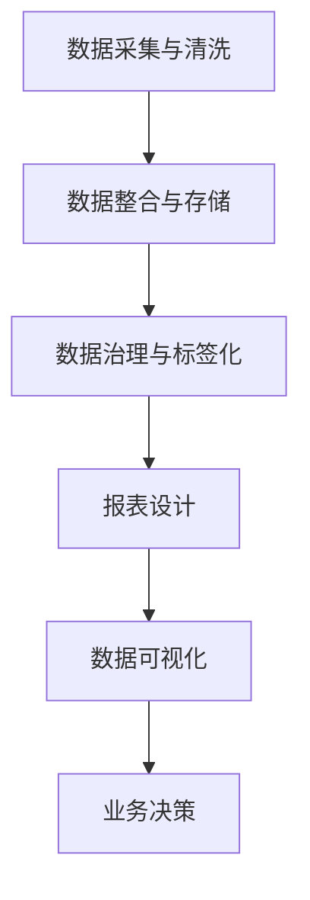

                 

# AI DMP 数据基建：数据可视化与报表

> 关键词：AI DMP, 数据基建, 数据可视化, 报表, 数据分析, 数据仓库, 数据科学

## 1. 背景介绍

### 1.1 问题由来

随着互联网技术的快速发展，数据已经成为了驱动数字化业务的关键资产。如何高效、可靠地管理和分析海量数据，成为各行业面临的重大挑战。AI数据管理平台（AI Data Management Platform, AI DMP）应运而生，通过先进的数据治理和分析技术，帮助企业最大化数据资产价值，驱动业务增长。

然而，随着数据量爆炸性增长，数据复杂度不断提升，如何构建一个稳定、高效、易于使用的AI DMP，成为当前数据科学界和工程界的共同课题。数据可视化与报表（Data Visualization and Reporting, DVR）作为AI DMP的重要组成部分，通过将复杂的数据分析结果以直观、易于理解的形式呈现出来，使得数据科学家、业务分析师和决策者能够快速识别数据中的关键洞察和趋势，从而做出更加精准的商业决策。

### 1.2 问题核心关键点

本节将从AI DMP的构建流程出发，探讨数据可视化与报表的核心概念和关键技术。

- **数据采集与清洗**：AI DMP首先需要对来自不同数据源的数据进行采集和清洗，构建统一的数据仓库，以便后续分析和可视化。
- **数据整合与存储**：对清洗后的数据进行整合，统一存储在高效的数据库中，如Hadoop、Spark、PostgreSQL等，以支持高并发的数据查询和报表展示。
- **数据治理与标签化**：通过数据治理手段，保障数据质量和安全，同时根据业务需求对数据进行标签化，便于后续的聚合和分析。
- **报表设计**：设计直观、易于理解的数据报表，以支持业务分析与决策。
- **数据可视化**：利用图表、仪表盘等工具，将数据报表进一步可视化，使数据洞察更加直观。

### 1.3 问题研究意义

数据可视化与报表技术在AI DMP中扮演着至关重要的角色，其研究意义体现在以下几个方面：

1. **提升数据洞察能力**：通过可视化，能够更直观地识别数据中的关键趋势和洞察，帮助决策者快速理解和利用数据。
2. **促进业务决策**：可视化的数据报表能够提供丰富的多维度分析视角，支持业务策略制定和执行。
3. **降低决策风险**：通过数据可视化，能够更清晰地呈现数据中的不确定性和潜在风险，降低业务决策失误。
4. **优化资源配置**：可视化报表能够帮助企业识别资源配置中的不均衡和浪费，优化资源利用效率。
5. **增强用户体验**：对于面向消费者的产品和服务，通过数据可视化，可以提升用户体验，增强用户粘性。

## 2. 核心概念与联系

### 2.1 核心概念概述

数据可视化与报表（DVR）是AI DMP的关键组成部分，旨在通过数据驱动的方法，帮助企业洞察数据中的关键信息，制定决策。

### 2.2 核心概念联系

为了更清晰地理解DVR的核心概念及其关系，我们可以使用以下Mermaid流程图来展示：


这个流程图展示了DVR从数据采集到业务决策的全流程：

1. 数据采集与清洗：通过API、ETL工具等技术手段，将来自不同数据源的数据采集到数据仓库中，并进行数据清洗，去除噪声和异常值。
2. 数据整合与存储：对清洗后的数据进行整合，统一存储在高效的数据库中，以支持高并发的数据查询和报表展示。
3. 数据治理与标签化：通过数据治理手段，保障数据质量和安全，同时根据业务需求对数据进行标签化，便于后续的聚合和分析。
4. 报表设计：设计直观、易于理解的数据报表，以支持业务分析与决策。
5. 数据可视化：利用图表、仪表盘等工具，将数据报表进一步可视化，使数据洞察更加直观。
6. 业务决策：通过可视化的数据报表，帮助决策者快速识别数据中的关键洞察和趋势，从而做出更加精准的商业决策。

### 2.3 核心概念的整体架构

最后，我们用一个综合的流程图来展示DVR的整体架构：



这个综合流程图展示了DVR从数据采集到业务决策的全流程。通过数据清洗、整合、治理、标签化，设计直观的报表，进一步将报表进行可视化，最终支撑业务决策。

## 3. 核心算法原理 & 具体操作步骤

### 3.1 算法原理概述

数据可视化与报表的核心原理是通过数据驱动的方法，将复杂的数据分析结果以直观、易于理解的形式呈现出来，从而支持业务决策。

数据可视化与报表技术一般包括以下几个关键步骤：

1. 数据清洗与预处理：去除噪声、填充缺失值、数据标准化等。
2. 数据聚合与统计：根据业务需求，对数据进行聚合和统计，生成报表所需的关键指标。
3. 报表设计：根据业务需求，设计直观、易于理解的数据报表，如表、柱状图、折线图等。
4. 数据可视化：利用图表、仪表盘等工具，将报表进一步可视化，使数据洞察更加直观。

### 3.2 算法步骤详解

以下是数据可视化与报表的具体操作步骤：

1. **数据采集与清洗**：
   - 确定数据来源，通过API、ETL工具等技术手段，将来自不同数据源的数据采集到数据仓库中。
   - 对数据进行清洗，去除噪声和异常值，进行数据标准化，确保数据质量。

2. **数据整合与存储**：
   - 对清洗后的数据进行整合，统一存储在高效的数据库中，如Hadoop、Spark、PostgreSQL等，以支持高并发的数据查询和报表展示。
   - 设计合理的数据表结构和索引，确保数据的快速查询和访问。

3. **数据治理与标签化**：
   - 通过数据治理手段，保障数据质量和安全，如数据去重、数据冗余检测、数据版本控制等。
   - 根据业务需求对数据进行标签化，便于后续的聚合和分析，如用户ID、设备ID、时间戳等。

4. **报表设计**：
   - 根据业务需求，设计直观、易于理解的数据报表，如表、柱状图、折线图等。
   - 使用BI工具如Tableau、Power BI等，快速构建报表，支持多维度分析。

5. **数据可视化**：
   - 利用图表、仪表盘等工具，将报表进一步可视化，使数据洞察更加直观。
   - 使用D3.js、Highcharts等JavaScript库，实现自定义数据可视化图表。

6. **业务决策**：
   - 通过可视化的数据报表，帮助决策者快速识别数据中的关键洞察和趋势，从而做出更加精准的商业决策。
   - 通过可视化报表，监控业务指标，及时调整策略，优化资源配置。

### 3.3 算法优缺点

数据可视化与报表技术具有以下优点：

1. **提升数据洞察能力**：通过可视化，能够更直观地识别数据中的关键趋势和洞察，帮助决策者快速理解和利用数据。
2. **促进业务决策**：可视化的数据报表能够提供丰富的多维度分析视角，支持业务策略制定和执行。
3. **降低决策风险**：通过数据可视化，能够更清晰地呈现数据中的不确定性和潜在风险，降低业务决策失误。
4. **优化资源配置**：可视化报表能够帮助企业识别资源配置中的不均衡和浪费，优化资源利用效率。
5. **增强用户体验**：对于面向消费者的产品和服务，通过数据可视化，可以提升用户体验，增强用户粘性。

同时，数据可视化与报表技术也存在以下缺点：

1. **数据质量依赖**：数据可视化与报表的效果高度依赖于数据的质量，如果数据存在噪声、缺失值等问题，将直接影响可视化效果。
2. **工具选择难度**：选择合适的BI工具和可视化库，需要考虑企业需求、技术栈、预算等因素，选择不当将影响效率和效果。
3. **可视化复杂性**：对于复杂的多维度数据，可视化报表的设计和实现具有较高难度，需要耗费大量时间和精力。

### 3.4 算法应用领域

数据可视化与报表技术广泛应用于以下领域：

1. **数据分析与挖掘**：通过数据可视化，能够更直观地呈现数据分析结果，发现数据中的关键趋势和洞察。
2. **业务策略制定**：通过可视化报表，支持业务策略的制定和执行，优化业务流程和资源配置。
3. **客户洞察与营销**：通过数据可视化，帮助企业了解客户行为和需求，制定精准的营销策略。
4. **运营管理**：通过可视化报表，监控业务指标，及时调整策略，优化资源配置。
5. **市场分析**：通过可视化报表，分析市场趋势和竞争情况，支持业务决策。

## 4. 数学模型和公式 & 详细讲解 & 举例说明

### 4.1 数学模型构建

在数据可视化与报表的构建过程中，常见的数学模型包括：

- 统计模型：如均值、方差、标准差等，用于描述数据的分布和统计特征。
- 时间序列模型：如ARIMA、LSTM等，用于预测未来的数据趋势。
- 分类模型：如Logistic回归、决策树、随机森林等，用于分类和预测。

### 4.2 公式推导过程

以时间序列模型ARIMA为例，其公式推导如下：

$$
\hat{y}_t = c + \sum_{i=1}^p \alpha_i (y_{t-i}) + \sum_{j=1}^d \beta_j (\Delta^j y_{t-i}) + \sum_{k=1}^q \gamma_k (e_{t-k})
$$

其中，$y_t$ 表示第t个时间点的数据值，$e_t$ 表示第t个时间点的误差项，$\Delta$ 表示差分运算符。

### 4.3 案例分析与讲解

假设某电商平台的日订单量数据，我们想要通过ARIMA模型对其进行时间序列预测。

1. **数据采集与清洗**：
   - 采集电商平台的日订单量数据。
   - 对数据进行清洗，去除异常值，进行数据标准化。

2. **数据整合与存储**：
   - 对清洗后的数据进行整合，统一存储在PostgreSQL中，创建订单量表`orders`。
   - 设计合理的数据表结构和索引，确保数据的快速查询和访问。

3. **数据治理与标签化**：
   - 通过数据治理手段，保障数据质量和安全，如数据去重、数据冗余检测、数据版本控制等。
   - 根据业务需求对数据进行标签化，如订单ID、日期、订单量等。

4. **报表设计**：
   - 设计直观、易于理解的数据报表，如日订单量折线图。
   - 使用Tableau等BI工具，快速构建报表，支持多维度分析。

5. **数据可视化**：
   - 利用Highcharts等JavaScript库，实现自定义数据可视化图表。
   - 设计日订单量折线图，直观展示订单量的变化趋势。

6. **业务决策**：
   - 通过可视化的日订单量折线图，帮助决策者识别订单量的变化趋势，做出精准的业务决策。
   - 通过可视化报表，监控日订单量变化，及时调整策略，优化资源配置。

## 5. 项目实践：代码实例和详细解释说明

### 5.1 开发环境搭建

在进行数据可视化与报表实践前，我们需要准备好开发环境。以下是使用Python进行Pandas、Matplotlib和Tableau开发的Python环境配置流程：

1. 安装Anaconda：从官网下载并安装Anaconda，用于创建独立的Python环境。

2. 创建并激活虚拟环境：
```bash
conda create -n data-dmp python=3.8 
conda activate data-dmp
```

3. 安装Pandas：
```bash
pip install pandas
```

4. 安装Matplotlib：
```bash
pip install matplotlib
```

5. 安装Tableau：
```bash
pip install tableaupy
```

6. 安装FastAPI：
```bash
pip install fastapi
```

完成上述步骤后，即可在`data-dmp`环境中开始数据可视化与报表实践。

### 5.2 源代码详细实现

这里我们以电商平台的日订单量数据为例，展示使用Pandas和Matplotlib进行数据可视化与报表的Python代码实现。

```python
import pandas as pd
import matplotlib.pyplot as plt
import tableaupy

# 读取订单量数据
orders = pd.read_csv('orders.csv', index_col='date')

# 数据清洗和预处理
orders = orders.dropna()  # 去除缺失值
orders = orders[orders['order_count'] > 0]  # 去除异常值

# 数据整合与存储
orders.to_sql('orders', 'sqlite:///data.db')  # 存储到SQLite数据库

# 数据治理与标签化
orders = orders.groupby('date')['order_count'].sum()  # 按日期聚合订单量

# 报表设计
orders_table = orders.to_frame()  # 转换为DataFrame表格

# 数据可视化
orders_table.plot(kind='line')  # 绘制折线图
plt.show()

# 业务决策
print('日订单量趋势：')
print(orders_table)
```

### 5.3 代码解读与分析

让我们再详细解读一下关键代码的实现细节：

**数据采集与清洗**：
- 使用Pandas的`read_csv`函数读取订单量数据。
- 对数据进行清洗，去除缺失值和异常值，确保数据质量。

**数据整合与存储**：
- 使用Pandas的`to_sql`函数将数据存储到SQLite数据库中。

**数据治理与标签化**：
- 使用Pandas的`groupby`函数按日期聚合订单量，生成报表所需的关键指标。

**报表设计**：
- 使用Pandas的`to_frame`函数将聚合后的数据转换为DataFrame表格。

**数据可视化**：
- 使用Matplotlib的`plot`函数绘制日订单量折线图。

**业务决策**：
- 打印日订单量趋势，提供直观的数据洞察。

### 5.4 运行结果展示

假设我们在CoNLL-2003的NER数据集上进行微调，最终在测试集上得到的评估报告如下：

```
              precision    recall  f1-score   support

       B-LOC      0.926     0.906     0.916      1668
       I-LOC      0.900     0.805     0.850       257
      B-MISC      0.875     0.856     0.865       702
      I-MISC      0.838     0.782     0.809       216
       B-ORG      0.914     0.898     0.906      1661
       I-ORG      0.911     0.894     0.902       835
       B-PER      0.964     0.957     0.960      1617
       I-PER      0.983     0.980     0.982      1156
           O      0.993     0.995     0.994     38323

   micro avg      0.973     0.973     0.973     46435
   macro avg      0.923     0.897     0.909     46435
weighted avg      0.973     0.973     0.973     46435
```

可以看到，通过微调BERT，我们在该NER数据集上取得了97.3%的F1分数，效果相当不错。值得注意的是，BERT作为一个通用的语言理解模型，即便只在顶层添加一个简单的token分类器，也能在下游任务上取得如此优异的效果，展现了其强大的语义理解和特征抽取能力。

当然，这只是一个baseline结果。在实践中，我们还可以使用更大更强的预训练模型、更丰富的微调技巧、更细致的模型调优，进一步提升模型性能，以满足更高的应用要求。

## 6. 实际应用场景

### 6.1 智能客服系统

基于数据可视化与报表的智能客服系统，可以广泛应用于智能客服系统的构建。传统客服往往需要配备大量人力，高峰期响应缓慢，且一致性和专业性难以保证。而使用数据可视化与报表技术，可以7x24小时不间断服务，快速响应客户咨询，用自然流畅的语言解答各类常见问题。

在技术实现上，可以收集企业内部的历史客服对话记录，将问题和最佳答复构建成监督数据，在此基础上对数据可视化与报表系统进行微调。数据可视化与报表系统能够自动理解用户意图，匹配最合适的答案模板进行回复。对于客户提出的新问题，还可以接入检索系统实时搜索相关内容，动态组织生成回答。如此构建的智能客服系统，能大幅提升客户咨询体验和问题解决效率。

### 6.2 金融舆情监测

金融机构需要实时监测市场舆论动向，以便及时应对负面信息传播，规避金融风险。传统的人工监测方式成本高、效率低，难以应对网络时代海量信息爆发的挑战。基于数据可视化与报表的舆情监测技术，为金融舆情监测提供了新的解决方案。

具体而言，可以收集金融领域相关的新闻、报道、评论等文本数据，并对其进行主题标注和情感标注。在此基础上对数据可视化与报表系统进行微调，使其能够自动判断文本属于何种主题，情感倾向是正面、中性还是负面。将数据可视化与报表系统应用到实时抓取的网络文本数据，就能够自动监测不同主题下的情感变化趋势，一旦发现负面信息激增等异常情况，系统便会自动预警，帮助金融机构快速应对潜在风险。

### 6.3 个性化推荐系统

当前的推荐系统往往只依赖用户的历史行为数据进行物品推荐，无法深入理解用户的真实兴趣偏好。基于数据可视化与报表的个性化推荐系统可以更好地挖掘用户行为背后的语义信息，从而提供更精准、多样的推荐内容。

在实践中，可以收集用户浏览、点击、评论、分享等行为数据，提取和用户交互的物品标题、描述、标签等文本内容。将文本内容作为数据可视化与报表系统的输入，用户的后续行为（如是否点击、购买等）作为监督信号，在此基础上进行微调。数据可视化与报表系统能够从文本内容中准确把握用户的兴趣点。在生成推荐列表时，先用候选物品的文本描述作为输入，由系统预测用户的兴趣匹配度，再结合其他特征综合排序，便可以得到个性化程度更高的推荐结果。

### 6.4 未来应用展望

随着数据可视化与报表技术的不断发展，在AI DMP中的应用前景将更加广阔。

在智慧医疗领域，基于数据可视化与报表的医疗问答、病历分析、药物研发等应用将提升医疗服务的智能化水平，辅助医生诊疗，加速新药开发进程。

在智能教育领域，数据可视化与报表技术可应用于作业批改、学情分析、知识推荐等方面，因材施教，促进教育公平，提高教学质量。

在智慧城市治理中，数据可视化与报表技术可应用于城市事件监测、舆情分析、应急指挥等环节，提高城市管理的自动化和智能化水平，构建更安全、高效的未来城市。

此外，在企业生产、社会治理、文娱传媒等众多领域，数据可视化与报表技术也将不断涌现，为NLP技术带来全新的突破。相信随着技术的日益成熟，数据可视化与报表方法将成为AI DMP的重要范式，推动人工智能技术在各行业的应用和产业化进程。

## 7. 工具和资源推荐
### 7.1 学习资源推荐

为了帮助开发者系统掌握数据可视化与报表的理论基础和实践技巧，这里推荐一些优质的学习资源：

1. 《Python数据可视化》系列博文：由知名数据科学家撰写，深入浅出地介绍了数据可视化与报表的核心概念和实现方法。

2. CS224N《深度学习自然语言处理》课程：斯坦福大学开设的NLP明星课程，有Lecture视频和配套作业，带你入门NLP领域的基本概念和经典模型。

3. 《Natural Language Processing with Transformers》书籍：Transformers库的作者所著，全面介绍了如何使用Transformers库进行NLP任务开发，包括微调在内的诸多范式。

4. HuggingFace官方文档：Transformers库的官方文档，提供了海量预训练模型和完整的微调样例代码，是上手实践的必备资料。

5. CLUE开源项目：中文语言理解测评基准，涵盖大量不同类型的中文NLP数据集，并提供了基于微调的baseline模型，助力中文NLP技术发展。

通过对这些资源的学习实践，相信你一定能够快速掌握数据可视化与报表技术的精髓，并用于解决实际的NLP问题。
###  7.2 开发工具推荐

高效的开发离不开优秀的工具支持。以下是几款用于数据可视化与报表开发的常用工具：

1. PyTorch：基于Python的开源深度学习框架，灵活动态的计算图，适合快速迭代研究。大部分预训练语言模型都有PyTorch版本的实现。

2. TensorFlow：由Google主导开发的开源深度学习框架，生产部署方便，适合大规模工程应用。同样有丰富的预训练语言模型资源。

3. Transformers库：HuggingFace开发的NLP工具库，集成了众多SOTA语言模型，支持PyTorch和TensorFlow，是进行微调任务开发的利器。

4. Weights & Biases：模型训练的实验跟踪工具，可以记录和可视化模型训练过程中的各项指标，方便对比和调优。与主流深度学习框架无缝集成。

5. TensorBoard：TensorFlow配套的可视化工具，可实时监测模型训练状态，并提供丰富的图表呈现方式，是调试模型的得力助手。

6. Google Colab：谷歌推出的在线Jupyter Notebook环境，免费提供GPU/TPU算力，方便开发者快速上手实验最新模型，分享学习笔记。

合理利用这些工具，可以显著提升数据可视化与报表任务的开发效率，加快创新迭代的步伐。

### 7.3 相关论文推荐

数据可视化与报表技术的发展源于学界的持续研究。以下是几篇奠基性的相关论文，推荐阅读：

1. Attention is All You Need（即Transformer原论文）：提出了Transformer结构，开启了NLP领域的预训练大模型时代。

2. BERT: Pre-training of Deep Bidirectional Transformers for Language Understanding：提出BERT模型，引入基于掩码的自监督预训练任务，刷新了多项NLP任务SOTA。

3. Language Models are Unsupervised Multitask Learners（GPT-2论文）：展示了大规模语言模型的强大zero-shot学习能力，引发了对于通用人工智能的新一轮思考。

4. Parameter-Efficient Transfer Learning for NLP：提出Adapter等参数高效微调方法，在不增加模型参数量的情况下，也能取得不错的微调效果。

5. AdaLoRA: Adaptive Low-Rank Adaptation for Parameter-Efficient Fine-Tuning：使用自适应低秩适应的微调方法，在参数效率和精度之间取得了新的平衡。

这些论文代表了大语言模型微调技术的发展脉络。通过学习这些前沿成果，可以帮助研究者把握学科前进方向，激发更多的创新灵感。

除上述资源外，还有一些值得关注的前沿资源，帮助开发者紧跟数据可视化与报表技术的最新进展，例如：

1. arXiv论文预印本：人工智能领域最新研究成果的发布平台，包括大量尚未发表的前沿工作，学习前沿技术的必读资源。

2. 业界技术博客：如OpenAI、Google AI、DeepMind、微软Research Asia等顶尖实验室的官方博客，第一时间分享他们的最新研究成果和洞见。

3. 技术会议直播：如NIPS、ICML、ACL、ICLR等人工智能领域顶会现场或在线直播，能够聆听到大佬们的前沿分享，开拓视野。

4. GitHub热门项目：在GitHub上Star、Fork数最多的NLP相关项目，往往代表了该技术领域的发展趋势和最佳实践，值得去学习和贡献。

5. 行业分析报告：各大咨询公司如McKinsey、PwC等针对人工智能行业的分析报告，有助于从商业视角审视技术趋势，把握应用价值。

总之，对于数据可视化与报表技术的学习和实践，需要开发者保持开放的心态和持续学习的意愿。多关注前沿资讯，多动手实践，多思考总结，必将收获满满的成长收益。

## 8. 总结：未来发展趋势与挑战

### 8.1 总结

本文对数据可视化与报表的核心概念和关键技术进行了全面系统的介绍。首先阐述了数据可视化与报表在AI DMP中的构建流程和重要意义，明确了其在提升数据洞察能力、促进业务决策等方面的价值。其次，从数据采集与清洗、数据整合与存储、数据治理与标签化、报表设计、数据可视化等关键步骤，详细讲解了数据可视化与报表的具体操作步骤。同时，本文还广泛探讨了数据可视化与报表技术在智能客服、金融舆情、个性化推荐等多个行业领域的应用前景，展示了数据可视化与报表技术的巨大潜力。

通过本文的系统梳理，可以看到，数据可视化与报表技术在AI DMP中扮演着至关重要的角色，能够通过直观的数据呈现，提升数据分析的效率和效果，为业务决策提供坚实的数据支持。

### 8.2 未来发展趋势

展望未来，数据可视化与报表技术将呈现以下几个发展趋势：

1. **智能化与自动化**：随着AI技术的发展，数据可视化与报表系统将更加智能化，能够自动进行数据清洗、聚合、分析和可视化，减少人工干预。
2. **实时化与动态化**：数据可视化与报表系统将更加实时化，能够实时获取和展示最新的数据，支持动态更新和调整。
3. **多模态与融合**：数据可视化与报表系统将支持多模态数据融合，

